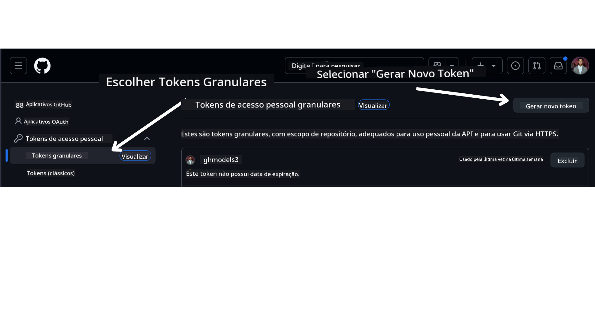

<!--
CO_OP_TRANSLATOR_METADATA:
{
  "original_hash": "76945069b52a49cd0432ae3e0b0ba22e",
  "translation_date": "2025-07-12T07:48:53+00:00",
  "source_file": "00-course-setup/README.md",
  "language_code": "br"
}
-->
em sua conta do GitHub.

Selecione a opção `Fine-grained tokens` no lado esquerdo da tela.

Em seguida, selecione `Generate new token`.



Você será solicitado a inserir um nome para o seu token, selecionar a data de expiração (Recomendado: 30 dias) e escolher os escopos para o seu token (Repositórios Públicos).

Também é necessário editar as permissões deste token: Permissions -> Models -> Permite acesso aos Modelos do GitHub

Copie o novo token que você acabou de criar. Agora, você irá adicioná-lo ao seu arquivo `.env` incluído neste curso.

### Passo 2: Crie seu arquivo `.env`

Para criar seu arquivo `.env`, execute o seguinte comando no seu terminal.

```bash
cp .env.example .env
```

Isso irá copiar o arquivo de exemplo e criar um `.env` no seu diretório, onde você preencherá os valores das variáveis de ambiente.

Com seu token copiado, abra o arquivo `.env` no seu editor de texto favorito e cole seu token no campo `GITHUB_TOKEN`.

Agora você deve conseguir executar os exemplos de código deste curso.

## Configuração para Exemplos usando Azure AI Foundry e Azure AI Agent Service

### Passo 1: Recupere o Endpoint do seu Projeto Azure

Siga os passos para criar um hub e projeto no Azure AI Foundry encontrados aqui: [Visão geral dos recursos do hub](https://learn.microsoft.com/en-us/azure/ai-foundry/concepts/ai-resources)

Depois de criar seu projeto, será necessário recuperar a string de conexão do seu projeto.

Isso pode ser feito acessando a página **Overview** do seu projeto no portal Azure AI Foundry.


### Passo 2: Crie seu arquivo `.env`

Para criar seu arquivo `.env`, execute o seguinte comando no seu terminal.

```bash
cp .env.example .env
```

Isso irá copiar o arquivo de exemplo e criar um `.env` no seu diretório, onde você preencherá os valores das variáveis de ambiente.

Com seu token copiado, abra o arquivo `.env` no seu editor de texto favorito e cole seu token no campo `PROJECT_ENDPOINT`.

### Passo 3: Faça login no Azure

Como prática recomendada de segurança, usaremos [autenticação sem chave](https://learn.microsoft.com/azure/developer/ai/keyless-connections?tabs=csharp%2Cazure-cli?WT.mc_id=academic-105485-koreyst) para autenticar no Azure OpenAI com Microsoft Entra ID. Antes disso, você precisará instalar o **Azure CLI** conforme as [instruções de instalação](https://learn.microsoft.com/cli/azure/install-azure-cli?WT.mc_id=academic-105485-koreyst) para seu sistema operacional.

Em seguida, abra um terminal e execute `az login --use-device-code` para fazer login na sua conta Azure.

Depois de logado, selecione sua assinatura no terminal.

## Variáveis de Ambiente Adicionais - Azure Search e Azure OpenAI

Para a Aula Agentic RAG - Aula 5 - existem exemplos que usam Azure Search e Azure OpenAI.

Se quiser executar esses exemplos, será necessário adicionar as seguintes variáveis de ambiente ao seu arquivo `.env`:

### Página de Visão Geral (Projeto)

- `AZURE_SUBSCRIPTION_ID` - Verifique os **Detalhes do projeto** na página **Overview** do seu projeto.

- `AZURE_AI_PROJECT_NAME` - Veja no topo da página **Overview** do seu projeto.

- `AZURE_OPENAI_SERVICE` - Encontre na aba **Included capabilities** para **Azure OpenAI Service** na página **Overview**.

### Centro de Gerenciamento

- `AZURE_OPENAI_RESOURCE_GROUP` - Vá para **Propriedades do projeto** na página **Overview** do **Management Center**.

- `GLOBAL_LLM_SERVICE` - Em **Connected resources**, encontre o nome da conexão **Azure AI Services**. Se não estiver listado, verifique no **portal Azure** dentro do seu grupo de recursos o nome do recurso AI Services.

### Página de Modelos + Endpoints

- `AZURE_OPENAI_EMBEDDING_DEPLOYMENT_NAME` - Selecione seu modelo de embedding (ex: `text-embedding-ada-002`) e anote o **Deployment name** nos detalhes do modelo.

- `AZURE_OPENAI_CHAT_DEPLOYMENT_NAME` - Selecione seu modelo de chat (ex: `gpt-4o-mini`) e anote o **Deployment name** nos detalhes do modelo.

### Portal Azure

- `AZURE_OPENAI_ENDPOINT` - Procure por **Azure AI services**, clique nele, depois vá para **Resource Management**, **Keys and Endpoint**, role até os "Azure OpenAI endpoints" e copie o que diz "Language APIs".

- `AZURE_OPENAI_API_KEY` - Na mesma tela, copie a CHAVE 1 ou CHAVE 2.

- `AZURE_SEARCH_SERVICE_ENDPOINT` - Encontre seu recurso **Azure AI Search**, clique nele e veja a **Overview**.

- `AZURE_SEARCH_API_KEY` - Depois vá para **Settings** e então **Keys** para copiar a chave administrativa primária ou secundária.

### Página Externa

- `AZURE_OPENAI_API_VERSION` - Visite a página [Ciclo de vida da versão da API](https://learn.microsoft.com/en-us/azure/ai-services/openai/api-version-deprecation#latest-ga-api-release) em **Latest GA API release**.

### Configurar autenticação sem chave

Ao invés de codificar suas credenciais, usaremos uma conexão sem chave com Azure OpenAI. Para isso, importaremos `DefaultAzureCredential` e depois chamaremos a função `DefaultAzureCredential` para obter a credencial.

```python
from azure.identity import DefaultAzureCredential, InteractiveBrowserCredential
```

## Travou em algum lugar?

Se você tiver qualquer problema ao executar essa configuração, entre em nosso

ou

.

## Próxima Aula

Agora você está pronto para executar o código deste curso. Aproveite para aprender mais sobre o mundo dos Agentes de IA!

[Introdução aos Agentes de IA e Casos de Uso de Agentes](../01-intro-to-ai-agents/README.md)

**Aviso Legal**:  
Este documento foi traduzido utilizando o serviço de tradução por IA [Co-op Translator](https://github.com/Azure/co-op-translator). Embora nos esforcemos para garantir a precisão, esteja ciente de que traduções automáticas podem conter erros ou imprecisões. O documento original em seu idioma nativo deve ser considerado a fonte autorizada. Para informações críticas, recomenda-se tradução profissional humana. Não nos responsabilizamos por quaisquer mal-entendidos ou interpretações incorretas decorrentes do uso desta tradução.