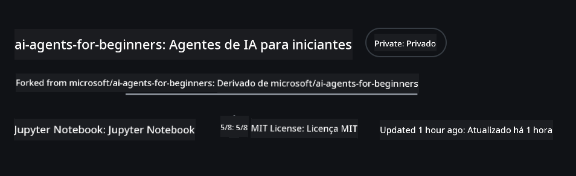
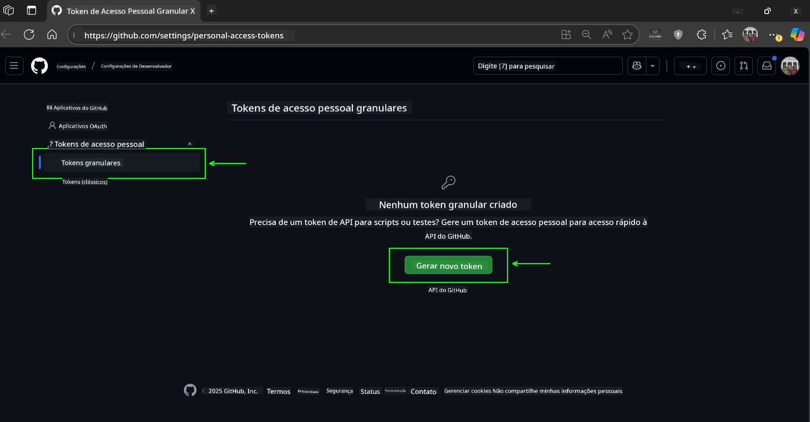
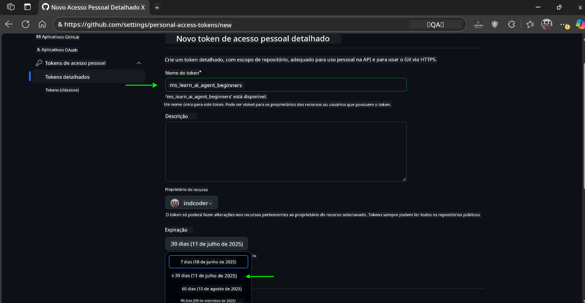
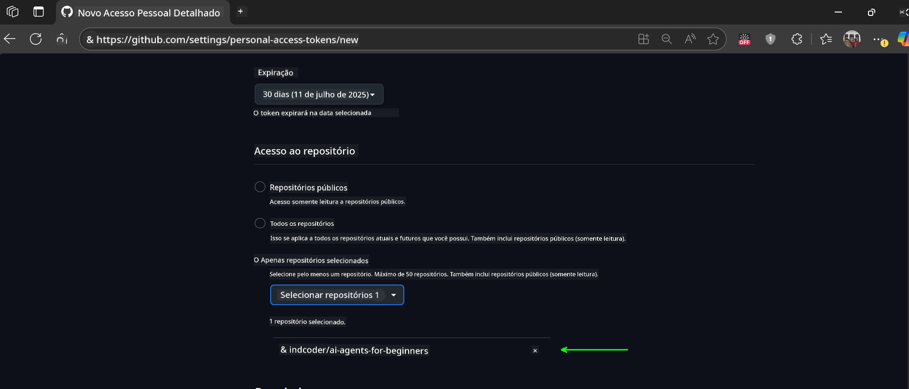
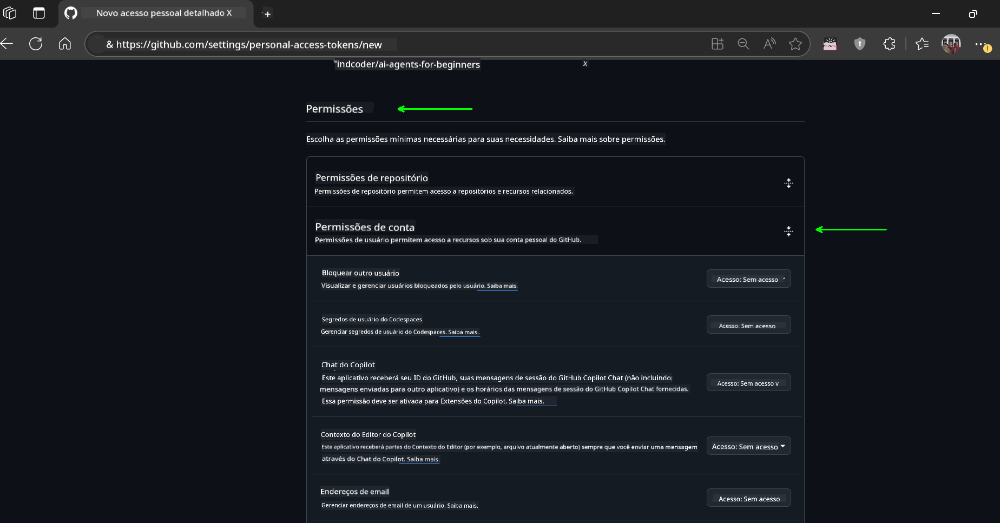
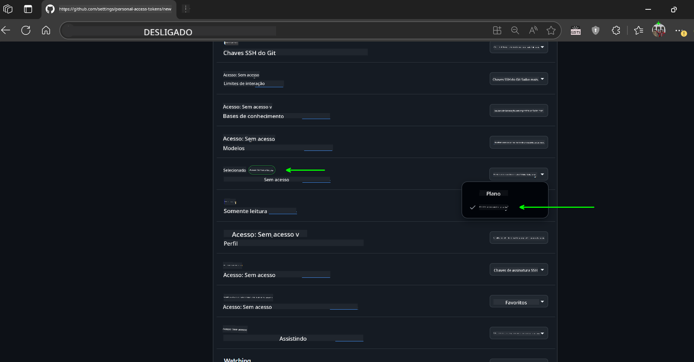
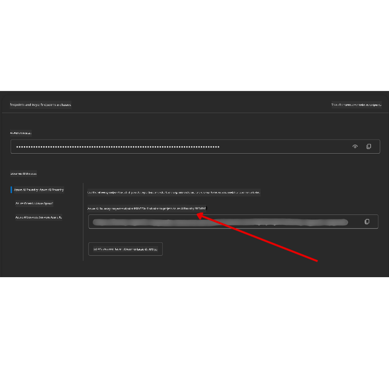

<!--
CO_OP_TRANSLATOR_METADATA:
{
  "original_hash": "c6a79c8f2b56a80370ff7e447765524f",
  "translation_date": "2025-07-23T08:37:36+00:00",
  "source_file": "00-course-setup/README.md",
  "language_code": "br"
}
-->
# Configuração do Curso

## Introdução

Esta lição abordará como executar os exemplos de código deste curso.

## Clonar ou Fazer Fork deste Repositório

Para começar, clone ou faça um fork do repositório GitHub. Isso criará sua própria versão do material do curso para que você possa executar, testar e ajustar o código!

Isso pode ser feito clicando no link para

Você deve agora ter sua própria versão forkada deste curso no seguinte link:



## Executando o Código

Este curso oferece uma série de Jupyter Notebooks que você pode executar para obter experiência prática na construção de Agentes de IA.

Os exemplos de código utilizam:

**Requer Conta no GitHub - Gratuito**:

1) Framework Semantic Kernel Agent + GitHub Models Marketplace. Rotulado como (semantic-kernel.ipynb)
2) Framework AutoGen + GitHub Models Marketplace. Rotulado como (autogen.ipynb)

**Requer Assinatura do Azure**:
3) Azure AI Foundry + Azure AI Agent Service. Rotulado como (azureaiagent.ipynb)

Recomendamos que você experimente os três tipos de exemplos para ver qual funciona melhor para você.

A opção que você escolher determinará quais etapas de configuração você precisará seguir abaixo:

## Requisitos

- Python 3.12+
  - **NOTE**: Se você não tiver o Python 3.12 instalado, certifique-se de instalá-lo. Em seguida, crie seu venv usando python3.12 para garantir que as versões corretas sejam instaladas a partir do arquivo requirements.txt.
- Uma Conta no GitHub - Para acesso ao GitHub Models Marketplace
- Assinatura do Azure - Para acesso ao Azure AI Foundry
- Conta do Azure AI Foundry - Para acesso ao Azure AI Agent Service

Incluímos um arquivo `requirements.txt` na raiz deste repositório que contém todos os pacotes Python necessários para executar os exemplos de código.

Você pode instalá-los executando o seguinte comando no terminal na raiz do repositório:

```bash
pip install -r requirements.txt
```
Recomendamos criar um ambiente virtual Python para evitar conflitos e problemas.

## Configurar o VSCode
Certifique-se de que está usando a versão correta do Python no VSCode.


## Configuração para Exemplos usando GitHub Models 

### Passo 1: Recuperar seu Token de Acesso Pessoal (PAT) do GitHub

Este curso utiliza o GitHub Models Marketplace, fornecendo acesso gratuito a Modelos de Linguagem Grande (LLMs) que você usará para construir Agentes de IA.

Para usar os modelos do GitHub, você precisará criar um [Token de Acesso Pessoal do GitHub](https://docs.github.com/en/authentication/keeping-your-account-and-data-secure/managing-your-personal-access-tokens).

Isso pode ser feito acessando sua conta no GitHub.

Por favor, siga o [Princípio do Menor Privilégio](https://docs.github.com/en/get-started/learning-to-code/storing-your-secrets-safely) ao criar seu token. Isso significa que você deve conceder ao token apenas as permissões necessárias para executar os exemplos de código deste curso.

1. Selecione a opção `Fine-grained tokens` no lado esquerdo da tela.

    Em seguida, selecione `Generate new token`.

    

1. Insira um nome descritivo para seu token que reflita seu propósito, facilitando sua identificação posteriormente. Defina uma data de expiração (recomendado: 30 dias; você pode escolher um período mais curto, como 7 dias, se preferir uma postura mais segura).

    

1. Limite o escopo do token ao seu fork deste repositório.

    

1. Restrinja as permissões do token: Em **Permissions**, alterne **Account Permissions**, navegue até **Models** e habilite apenas o acesso de leitura necessário para os modelos do GitHub.

    

    

Copie seu novo token que acabou de criar. Agora você o adicionará ao arquivo `.env` incluído neste curso.

### Passo 2: Criar seu Arquivo `.env`

Para criar seu arquivo `.env`, execute o seguinte comando no terminal.

```bash
cp .env.example .env
```

Isso copiará o arquivo de exemplo e criará um `.env` no seu diretório, onde você preencherá os valores das variáveis de ambiente.

Com seu token copiado, abra o arquivo `.env` no seu editor de texto favorito e cole seu token no campo `GITHUB_TOKEN`.

Agora você deve conseguir executar os exemplos de código deste curso.

## Configuração para Exemplos usando Azure AI Foundry e Azure AI Agent Service

### Passo 1: Recuperar o Endpoint do Projeto no Azure

Siga os passos para criar um hub e projeto no Azure AI Foundry encontrados aqui: [Visão geral dos recursos do Hub](https://learn.microsoft.com/en-us/azure/ai-foundry/concepts/ai-resources)

Depois de criar seu projeto, você precisará recuperar a string de conexão para seu projeto.

Isso pode ser feito acessando a página **Overview** do seu projeto no portal do Azure AI Foundry.



### Passo 2: Criar seu Arquivo `.env`

Para criar seu arquivo `.env`, execute o seguinte comando no terminal.

```bash
cp .env.example .env
```

Isso copiará o arquivo de exemplo e criará um `.env` no seu diretório, onde você preencherá os valores das variáveis de ambiente.

Com seu token copiado, abra o arquivo `.env` no seu editor de texto favorito e cole seu token no campo `PROJECT_ENDPOINT`.

### Passo 3: Fazer Login no Azure

Como prática recomendada de segurança, usaremos [autenticação sem chave](https://learn.microsoft.com/azure/developer/ai/keyless-connections?tabs=csharp%2Cazure-cli?WT.mc_id=academic-105485-koreyst) para autenticar no Azure OpenAI com Microsoft Entra ID.

Em seguida, abra um terminal e execute `az login --use-device-code` para fazer login na sua conta do Azure.

Depois de fazer login, selecione sua assinatura no terminal.

## Variáveis de Ambiente Adicionais - Azure Search e Azure OpenAI 

Para a lição Agentic RAG - Lição 5 - há exemplos que utilizam Azure Search e Azure OpenAI.

Se você quiser executar esses exemplos, precisará adicionar as seguintes variáveis de ambiente ao seu arquivo `.env`:

### Página de Visão Geral (Projeto)

- `AZURE_SUBSCRIPTION_ID` - Verifique **Project details** na página **Overview** do seu projeto.

- `AZURE_AI_PROJECT_NAME` - Veja no topo da página **Overview** do seu projeto.

- `AZURE_OPENAI_SERVICE` - Encontre isso na aba **Included capabilities** para **Azure OpenAI Service** na página **Overview**.

### Centro de Gerenciamento

- `AZURE_OPENAI_RESOURCE_GROUP` - Vá para **Project properties** na página **Overview** do **Management Center**.

- `GLOBAL_LLM_SERVICE` - Em **Connected resources**, encontre o nome da conexão **Azure AI Services**. Se não estiver listado, verifique no **Azure portal** sob seu grupo de recursos o nome do recurso de AI Services.

### Página de Modelos + Endpoints

- `AZURE_OPENAI_EMBEDDING_DEPLOYMENT_NAME` - Selecione seu modelo de embedding (por exemplo, `text-embedding-ada-002`) e anote o **Deployment name** nos detalhes do modelo.

- `AZURE_OPENAI_CHAT_DEPLOYMENT_NAME` - Selecione seu modelo de chat (por exemplo, `gpt-4o-mini`) e anote o **Deployment name** nos detalhes do modelo.

### Portal do Azure

- `AZURE_OPENAI_ENDPOINT` - Procure por **Azure AI services**, clique nele, vá para **Resource Management**, **Keys and Endpoint**, role para baixo até "Azure OpenAI endpoints" e copie o que diz "Language APIs".

- `AZURE_OPENAI_API_KEY` - Na mesma tela, copie KEY 1 ou KEY 2.

- `AZURE_SEARCH_SERVICE_ENDPOINT` - Encontre seu recurso **Azure AI Search**, clique nele e veja **Overview**.

- `AZURE_SEARCH_API_KEY` - Em seguida, vá para **Settings** e depois **Keys** para copiar a chave de administrador primária ou secundária.

### Página Externa

- `AZURE_OPENAI_API_VERSION` - Visite a página [Ciclo de vida da versão da API](https://learn.microsoft.com/en-us/azure/ai-services/openai/api-version-deprecation#latest-ga-api-release) em **Latest GA API release**.

### Configurar autenticação sem chave

Em vez de codificar suas credenciais, usaremos uma conexão sem chave com o Azure OpenAI. Para isso, importaremos `DefaultAzureCredential` e posteriormente chamaremos a função `DefaultAzureCredential` para obter a credencial.

```python
from azure.identity import DefaultAzureCredential, InteractiveBrowserCredential
```

## Com Problemas?

Se você tiver qualquer problema ao executar esta configuração, entre em nosso

## Próxima Lição

Agora você está pronto para executar o código deste curso. Aproveite para aprender mais sobre o mundo dos Agentes de IA!

[Introdução aos Agentes de IA e Casos de Uso de Agentes](../01-intro-to-ai-agents/README.md)

**Aviso Legal**:  
Este documento foi traduzido utilizando o serviço de tradução por IA [Co-op Translator](https://github.com/Azure/co-op-translator). Embora nos esforcemos para garantir a precisão, esteja ciente de que traduções automatizadas podem conter erros ou imprecisões. O documento original em seu idioma nativo deve ser considerado a fonte autoritativa. Para informações críticas, recomenda-se a tradução profissional realizada por humanos. Não nos responsabilizamos por quaisquer mal-entendidos ou interpretações equivocadas decorrentes do uso desta tradução.