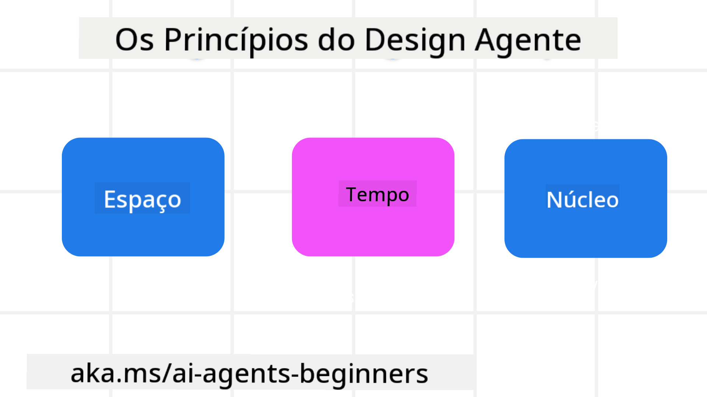

<!--
CO_OP_TRANSLATOR_METADATA:
{
  "original_hash": "4c46e4ff9e349c521e2b0b17f51afa64",
  "translation_date": "2025-08-29T12:52:42+00:00",
  "source_file": "03-agentic-design-patterns/README.md",
  "language_code": "br"
}
-->

> _(Clique na imagem acima para assistir ao vídeo desta lição)_
# Princípios de Design de Agentes de IA

## Introdução

Existem muitas maneiras de pensar na construção de Sistemas de Agentes de IA. Dado que a ambiguidade é uma característica e não um defeito no design de IA Generativa, às vezes é difícil para os engenheiros saberem por onde começar. Criamos um conjunto de Princípios de Design centrados no ser humano para permitir que os desenvolvedores construam sistemas de agentes centrados no cliente para atender às suas necessidades de negócios. Esses princípios de design não são uma arquitetura prescritiva, mas sim um ponto de partida para equipes que estão definindo e desenvolvendo experiências de agentes.

De forma geral, os agentes devem:

- Ampliar e escalar as capacidades humanas (brainstorming, resolução de problemas, automação, etc.)
- Preencher lacunas de conhecimento (me atualize sobre domínios de conhecimento, tradução, etc.)
- Facilitar e apoiar a colaboração nas formas como preferimos trabalhar com outras pessoas
- Tornar-nos versões melhores de nós mesmos (por exemplo, coach de vida/gestor de tarefas, ajudando-nos a aprender habilidades de regulação emocional e mindfulness, construindo resiliência, etc.)

## Esta Lição Abrangerá

- O que são os Princípios de Design de Agentes
- Quais são algumas diretrizes a seguir ao implementar esses princípios de design
- Quais são alguns exemplos de uso dos princípios de design

## Objetivos de Aprendizado

Após concluir esta lição, você será capaz de:

1. Explicar o que são os Princípios de Design de Agentes
2. Explicar as diretrizes para usar os Princípios de Design de Agentes
3. Entender como construir um agente usando os Princípios de Design de Agentes

## Os Princípios de Design de Agentes

### Agente (Espaço)

Este é o ambiente no qual o agente opera. Esses princípios orientam como projetamos agentes para interagir nos mundos físico e digital.

- **Conectar, não colapsar** – ajudar a conectar pessoas a outras pessoas, eventos e conhecimentos acionáveis para possibilitar colaboração e conexão.
- Agentes ajudam a conectar eventos, conhecimentos e pessoas.
- Agentes aproximam as pessoas. Eles não são projetados para substituir ou diminuir as pessoas.
- **Facilmente acessível, mas ocasionalmente invisível** – o agente opera amplamente em segundo plano e só nos alerta quando é relevante e apropriado.
  - O agente é facilmente descoberto e acessível para usuários autorizados em qualquer dispositivo ou plataforma.
  - O agente suporta entradas e saídas multimodais (som, voz, texto, etc.).
  - O agente pode alternar perfeitamente entre primeiro plano e segundo plano; entre proativo e reativo, dependendo de sua percepção das necessidades do usuário.
  - O agente pode operar de forma invisível, mas seu caminho de processo em segundo plano e colaboração com outros agentes são transparentes e controláveis pelo usuário.

### Agente (Tempo)

Este é o modo como o agente opera ao longo do tempo. Esses princípios orientam como projetamos agentes interagindo entre passado, presente e futuro.

- **Passado**: Refletindo sobre a história que inclui tanto estado quanto contexto.
  - O agente fornece resultados mais relevantes com base na análise de dados históricos mais ricos, além de apenas o evento, pessoas ou estados.
  - O agente cria conexões a partir de eventos passados e reflete ativamente sobre a memória para interagir com situações atuais.
- **Agora**: Sugerindo mais do que notificando.
  - O agente incorpora uma abordagem abrangente para interagir com as pessoas. Quando um evento acontece, o agente vai além de uma notificação estática ou outra formalidade estática. O agente pode simplificar fluxos ou gerar dinamicamente dicas para direcionar a atenção do usuário no momento certo.
  - O agente entrega informações com base no ambiente contextual, mudanças sociais e culturais e adaptadas à intenção do usuário.
  - A interação com o agente pode ser gradual, evoluindo/crescendo em complexidade para capacitar os usuários a longo prazo.
- **Futuro**: Adaptando-se e evoluindo.
  - O agente se adapta a vários dispositivos, plataformas e modalidades.
  - O agente se adapta ao comportamento do usuário, às necessidades de acessibilidade e é livremente personalizável.
  - O agente é moldado e evolui por meio de interações contínuas com o usuário.

### Agente (Núcleo)

Estes são os elementos-chave no núcleo do design de um agente.

- **Abraçar a incerteza, mas estabelecer confiança**.
  - Um certo nível de incerteza do agente é esperado. A incerteza é um elemento-chave do design de agentes.
  - Confiança e transparência são camadas fundamentais do design de agentes.
  - Os humanos têm controle sobre quando o agente está ligado/desligado e o status do agente é claramente visível o tempo todo.

## As Diretrizes para Implementar Esses Princípios

Ao usar os princípios de design anteriores, siga as seguintes diretrizes:

1. **Transparência**: Informe o usuário que a IA está envolvida, como ela funciona (incluindo ações passadas) e como fornecer feedback e modificar o sistema.
2. **Controle**: Permita que o usuário personalize, especifique preferências e personalize, e tenha controle sobre o sistema e seus atributos (incluindo a capacidade de esquecer).
3. **Consistência**: Busque experiências consistentes e multimodais em dispositivos e pontos de contato. Use elementos de UI/UX familiares sempre que possível (por exemplo, ícone de microfone para interação por voz) e reduza ao máximo a carga cognitiva do cliente (por exemplo, respostas concisas, recursos visuais e conteúdo "Saiba Mais").

## Como Projetar um Agente de Viagem Usando Esses Princípios e Diretrizes

Imagine que você está projetando um Agente de Viagem, veja como você poderia pensar em usar os Princípios de Design e Diretrizes:

1. **Transparência** – Informe ao usuário que o Agente de Viagem é um Agente habilitado por IA. Forneça algumas instruções básicas sobre como começar (por exemplo, uma mensagem de “Olá”, exemplos de comandos). Documente isso claramente na página do produto. Mostre a lista de comandos que um usuário fez no passado. Deixe claro como fornecer feedback (polegar para cima e para baixo, botão Enviar Feedback, etc.). Articule claramente se o Agente tem restrições de uso ou tópicos.
2. **Controle** – Certifique-se de que está claro como o usuário pode modificar o Agente após ele ter sido criado, com coisas como o Prompt do Sistema. Permita que o usuário escolha o quão detalhado o Agente deve ser, seu estilo de escrita e quaisquer restrições sobre o que o Agente não deve abordar. Permita que o usuário visualize e exclua quaisquer arquivos ou dados associados, comandos e conversas passadas.
3. **Consistência** – Certifique-se de que os ícones para Compartilhar Comando, adicionar um arquivo ou foto e marcar alguém ou algo sejam padrão e reconhecíveis. Use o ícone de clipe de papel para indicar upload/compartilhamento de arquivos com o Agente e um ícone de imagem para indicar upload de gráficos.

### Tem Mais Perguntas sobre Padrões de Design de Agentes de IA?

Participe do [Discord do Azure AI Foundry](https://aka.ms/ai-agents/discord) para se conectar com outros aprendizes, participar de horários de atendimento e tirar suas dúvidas sobre Agentes de IA.

## Recursos Adicionais

## Lição Anterior

[Explorando Estruturas de Agentes](../02-explore-agentic-frameworks/README.md)

## Próxima Lição

[Padrão de Design de Uso de Ferramentas](../04-tool-use/README.md)

---

**Aviso Legal**:  
Este documento foi traduzido utilizando o serviço de tradução por IA [Co-op Translator](https://github.com/Azure/co-op-translator). Embora nos esforcemos para garantir a precisão, esteja ciente de que traduções automatizadas podem conter erros ou imprecisões. O documento original em seu idioma nativo deve ser considerado a fonte autoritativa. Para informações críticas, recomenda-se a tradução profissional realizada por humanos. Não nos responsabilizamos por quaisquer mal-entendidos ou interpretações equivocadas decorrentes do uso desta tradução.