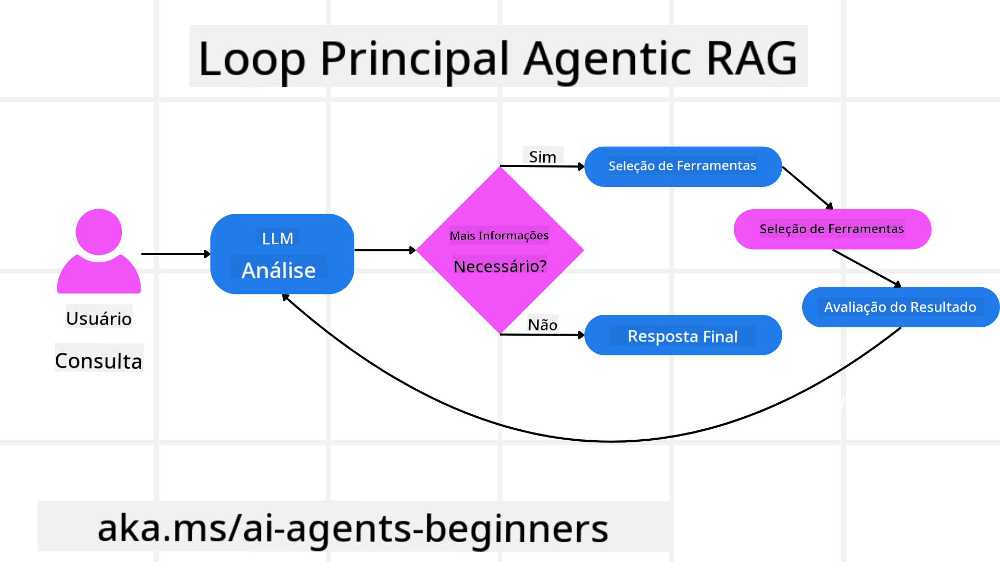
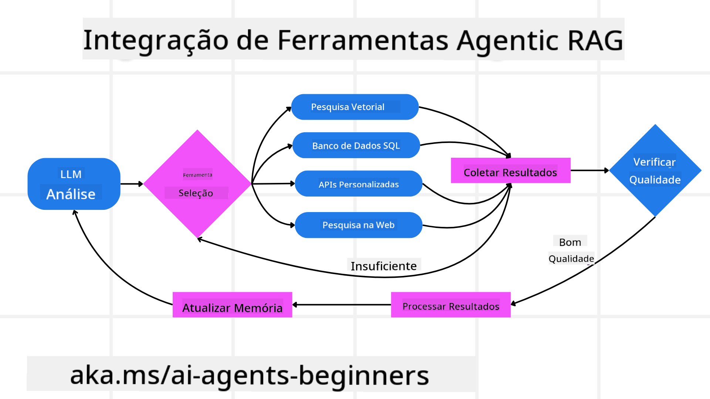
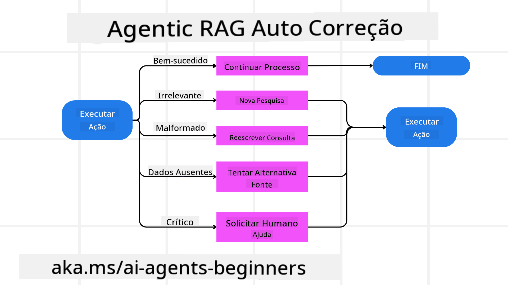
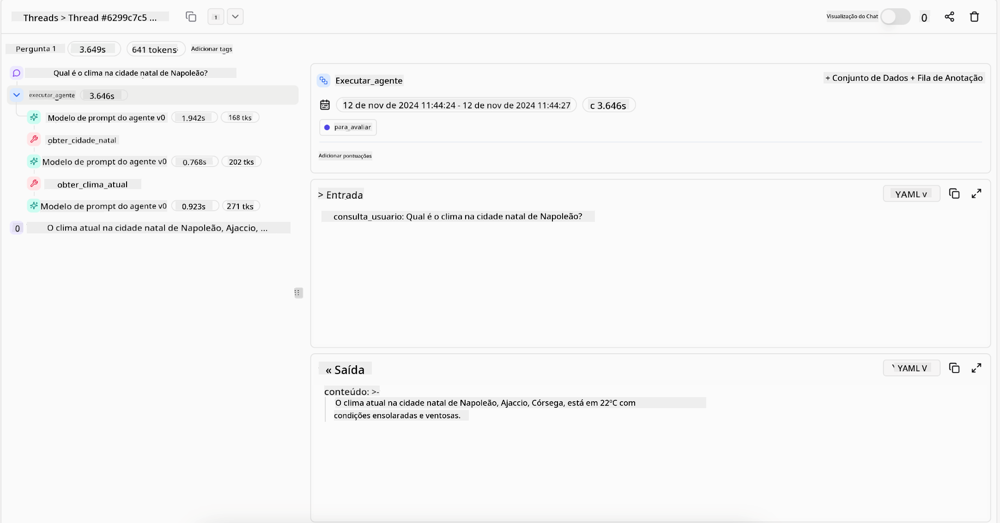
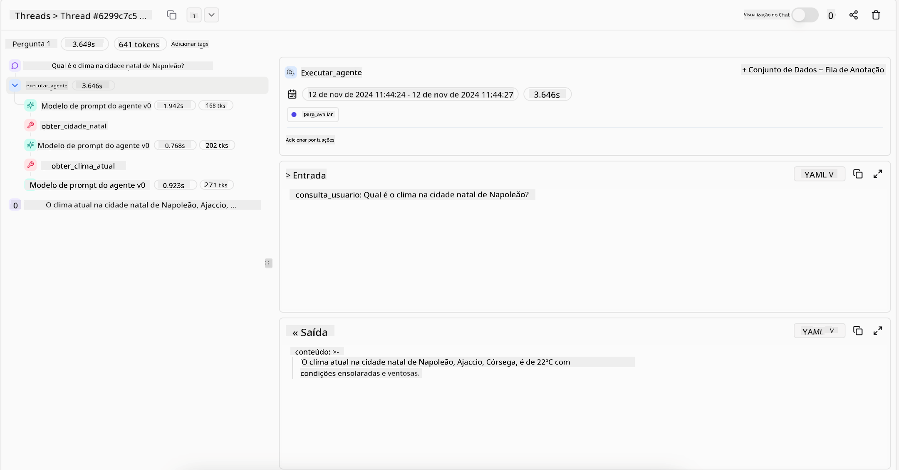

<!--
CO_OP_TRANSLATOR_METADATA:
{
  "original_hash": "7622aa72f9e676e593339f5f694ecd7d",
  "translation_date": "2025-07-12T10:00:19+00:00",
  "source_file": "05-agentic-rag/README.md",
  "language_code": "br"
}
-->

> _(Clique na imagem acima para assistir ao vídeo desta lição)_

# Agentic RAG

Esta lição oferece uma visão abrangente sobre Agentic Retrieval-Augmented Generation (Agentic RAG), um paradigma emergente de IA onde grandes modelos de linguagem (LLMs) planejam autonomamente seus próximos passos enquanto extraem informações de fontes externas. Diferente dos padrões estáticos de recuperação e leitura, o Agentic RAG envolve chamadas iterativas ao LLM, intercaladas com chamadas a ferramentas ou funções e saídas estruturadas. O sistema avalia os resultados, refina as consultas, invoca ferramentas adicionais se necessário e continua esse ciclo até alcançar uma solução satisfatória.

## Introdução

Nesta lição você irá aprender sobre

- **Entender o Agentic RAG:** Conhecer o paradigma emergente em IA onde grandes modelos de linguagem (LLMs) planejam autonomamente seus próximos passos enquanto extraem informações de fontes externas.
- **Compreender o estilo iterativo Maker-Checker:** Entender o ciclo de chamadas iterativas ao LLM, intercaladas com chamadas a ferramentas ou funções e saídas estruturadas, projetado para melhorar a precisão e lidar com consultas malformadas.
- **Explorar aplicações práticas:** Identificar cenários onde o Agentic RAG se destaca, como ambientes que priorizam a correção, interações complexas com bancos de dados e fluxos de trabalho estendidos.

## Objetivos de Aprendizagem

Após concluir esta lição, você saberá/entenderá:

- **Compreensão do Agentic RAG:** Conhecer o paradigma emergente em IA onde grandes modelos de linguagem (LLMs) planejam autonomamente seus próximos passos enquanto extraem informações de fontes externas.
- **Estilo iterativo Maker-Checker:** Entender o conceito de um ciclo de chamadas iterativas ao LLM, intercaladas com chamadas a ferramentas ou funções e saídas estruturadas, projetado para melhorar a precisão e lidar com consultas malformadas.
- **Dominar o processo de raciocínio:** Compreender a capacidade do sistema de assumir seu próprio processo de raciocínio, tomando decisões sobre como abordar problemas sem depender de caminhos pré-definidos.
- **Fluxo de trabalho:** Entender como um modelo agentic decide de forma independente recuperar relatórios de tendências de mercado, identificar dados de concorrentes, correlacionar métricas internas de vendas, sintetizar descobertas e avaliar a estratégia.
- **Ciclos iterativos, integração de ferramentas e memória:** Aprender sobre a dependência do sistema em um padrão de interação em loop, mantendo estado e memória ao longo dos passos para evitar repetições e tomar decisões mais informadas.
- **Lidando com falhas e autocorreção:** Explorar os mecanismos robustos de autocorreção do sistema, incluindo iteração e reconsulta, uso de ferramentas diagnósticas e recurso à supervisão humana.
- **Limites da agência:** Entender as limitações do Agentic RAG, focando na autonomia específica do domínio, dependência da infraestrutura e respeito às diretrizes.
- **Casos de uso práticos e valor:** Identificar cenários onde o Agentic RAG se destaca, como ambientes que priorizam a correção, interações complexas com bancos de dados e fluxos de trabalho estendidos.
- **Governança, transparência e confiança:** Conhecer a importância da governança e transparência, incluindo raciocínio explicável, controle de viés e supervisão humana.

## O que é Agentic RAG?

Agentic Retrieval-Augmented Generation (Agentic RAG) é um paradigma emergente de IA onde grandes modelos de linguagem (LLMs) planejam autonomamente seus próximos passos enquanto extraem informações de fontes externas. Diferente dos padrões estáticos de recuperação e leitura, o Agentic RAG envolve chamadas iterativas ao LLM, intercaladas com chamadas a ferramentas ou funções e saídas estruturadas. O sistema avalia os resultados, refina as consultas, invoca ferramentas adicionais se necessário e continua esse ciclo até alcançar uma solução satisfatória. Esse estilo iterativo “maker-checker” melhora a precisão, lida com consultas malformadas e garante resultados de alta qualidade.

O sistema assume ativamente seu processo de raciocínio, reescrevendo consultas que falharam, escolhendo diferentes métodos de recuperação e integrando múltiplas ferramentas — como busca vetorial no Azure AI Search, bancos de dados SQL ou APIs personalizadas — antes de finalizar sua resposta. A característica que diferencia um sistema agentic é sua capacidade de assumir seu processo de raciocínio. Implementações tradicionais de RAG dependem de caminhos pré-definidos, mas um sistema agentic determina autonomamente a sequência de passos com base na qualidade das informações encontradas.

## Definindo Agentic Retrieval-Augmented Generation (Agentic RAG)

Agentic Retrieval-Augmented Generation (Agentic RAG) é um paradigma emergente no desenvolvimento de IA onde LLMs não apenas extraem informações de fontes externas, mas também planejam autonomamente seus próximos passos. Diferente dos padrões estáticos de recuperação e leitura ou sequências cuidadosamente roteirizadas de prompts, o Agentic RAG envolve um ciclo de chamadas iterativas ao LLM, intercaladas com chamadas a ferramentas ou funções e saídas estruturadas. A cada etapa, o sistema avalia os resultados obtidos, decide se deve refinar suas consultas, invoca ferramentas adicionais se necessário e continua esse ciclo até alcançar uma solução satisfatória.

Esse estilo iterativo “maker-checker” é projetado para melhorar a precisão, lidar com consultas malformadas em bancos de dados estruturados (ex.: NL2SQL) e garantir resultados equilibrados e de alta qualidade. Em vez de depender apenas de cadeias de prompts cuidadosamente elaboradas, o sistema assume ativamente seu processo de raciocínio. Ele pode reescrever consultas que falham, escolher diferentes métodos de recuperação e integrar múltiplas ferramentas — como busca vetorial no Azure AI Search, bancos de dados SQL ou APIs personalizadas — antes de finalizar sua resposta. Isso elimina a necessidade de frameworks de orquestração excessivamente complexos. Em vez disso, um loop relativamente simples de “chamada LLM → uso de ferramenta → chamada LLM → …” pode gerar saídas sofisticadas e bem fundamentadas.

## Assumindo o Processo de Raciocínio

A qualidade que distingue um sistema como “agentic” é sua capacidade de assumir seu processo de raciocínio. Implementações tradicionais de RAG frequentemente dependem de humanos que pré-definem um caminho para o modelo: uma cadeia de pensamento que indica o que recuperar e quando.  
Mas quando um sistema é verdadeiramente agentic, ele decide internamente como abordar o problema. Não está apenas executando um script; está determinando autonomamente a sequência de passos com base na qualidade das informações encontradas.  
Por exemplo, se for solicitado a criar uma estratégia de lançamento de produto, não depende apenas de um prompt que descreve todo o fluxo de pesquisa e tomada de decisão. Em vez disso, o modelo agentic decide independentemente:

1. Recuperar relatórios atuais de tendências de mercado usando Bing Web Grounding  
2. Identificar dados relevantes de concorrentes usando Azure AI Search  
3. Correlacionar métricas históricas internas de vendas usando Azure SQL Database  
4. Sintetizar as descobertas em uma estratégia coesa orquestrada via Azure OpenAI Service  
5. Avaliar a estratégia em busca de lacunas ou inconsistências, solicitando outra rodada de recuperação se necessário  

Todos esses passos — refinar consultas, escolher fontes, iterar até ficar “satisfeito” com a resposta — são decididos pelo modelo, não pré-roteirizados por um humano.

## Ciclos Iterativos, Integração de Ferramentas e Memória

Um sistema agentic depende de um padrão de interação em loop:

- **Chamada Inicial:** O objetivo do usuário (ou seja, o prompt do usuário) é apresentado ao LLM.  
- **Invocação de Ferramenta:** Se o modelo identifica informações faltantes ou instruções ambíguas, ele seleciona uma ferramenta ou método de recuperação — como uma consulta a banco de dados vetorial (ex.: busca híbrida Azure AI Search sobre dados privados) ou uma chamada SQL estruturada — para obter mais contexto.  
- **Avaliação e Refinamento:** Após revisar os dados retornados, o modelo decide se a informação é suficiente. Caso contrário, refina a consulta, tenta uma ferramenta diferente ou ajusta sua abordagem.  
- **Repetir Até Satisfação:** Esse ciclo continua até que o modelo determine que tem clareza e evidências suficientes para entregar uma resposta final bem fundamentada.  
- **Memória e Estado:** Como o sistema mantém estado e memória ao longo dos passos, pode recordar tentativas anteriores e seus resultados, evitando loops repetitivos e tomando decisões mais informadas conforme avança.

Com o tempo, isso cria uma sensação de entendimento evolutivo, permitindo que o modelo navegue por tarefas complexas e multi-etapas sem a necessidade de intervenção humana constante ou reformulação do prompt.

## Lidando com Modos de Falha e Autocorreção

A autonomia do Agentic RAG também envolve mecanismos robustos de autocorreção. Quando o sistema encontra impasses — como recuperar documentos irrelevantes ou enfrentar consultas malformadas — ele pode:

- **Iterar e Reconsultar:** Em vez de retornar respostas de baixo valor, o modelo tenta novas estratégias de busca, reescreve consultas a bancos de dados ou examina conjuntos de dados alternativos.  
- **Usar Ferramentas Diagnósticas:** O sistema pode invocar funções adicionais projetadas para ajudar a depurar seus passos de raciocínio ou confirmar a precisão dos dados recuperados. Ferramentas como Azure AI Tracing serão importantes para permitir observabilidade e monitoramento robustos.  
- **Recurso à Supervisão Humana:** Para cenários de alto risco ou falhas repetidas, o modelo pode sinalizar incerteza e solicitar orientação humana. Uma vez que o humano fornece feedback corretivo, o modelo pode incorporar essa lição para as próximas interações.

Essa abordagem iterativa e dinâmica permite que o modelo melhore continuamente, garantindo que não seja apenas um sistema de uma única tentativa, mas sim um que aprende com seus erros durante uma sessão.

## Limites da Agência

Apesar de sua autonomia dentro de uma tarefa, o Agentic RAG não é análogo à Inteligência Artificial Geral. Suas capacidades “agentic” são limitadas às ferramentas, fontes de dados e políticas fornecidas por desenvolvedores humanos. Ele não pode inventar suas próprias ferramentas ou ultrapassar os limites do domínio estabelecidos. Em vez disso, se destaca em orquestrar dinamicamente os recursos disponíveis.  
Diferenças chave em relação a formas mais avançadas de IA incluem:

1. **Autonomia Específica do Domínio:** Sistemas Agentic RAG focam em alcançar objetivos definidos pelo usuário dentro de um domínio conhecido, empregando estratégias como reescrita de consultas ou seleção de ferramentas para melhorar os resultados.  
2. **Dependência da Infraestrutura:** As capacidades do sistema dependem das ferramentas e dados integrados pelos desenvolvedores. Ele não pode ultrapassar esses limites sem intervenção humana.  
3. **Respeito às Diretrizes:** Diretrizes éticas, regras de conformidade e políticas de negócios continuam sendo muito importantes. A liberdade do agente é sempre limitada por medidas de segurança e mecanismos de supervisão (esperançosamente).

## Casos de Uso Práticos e Valor

Agentic RAG se destaca em cenários que exigem refinamento iterativo e precisão:

1. **Ambientes que Prioritizam a Correção:** Em verificações de conformidade, análises regulatórias ou pesquisas jurídicas, o modelo agentic pode verificar fatos repetidamente, consultar múltiplas fontes e reescrever consultas até produzir uma resposta minuciosamente validada.  
2. **Interações Complexas com Bancos de Dados:** Ao lidar com dados estruturados onde consultas podem falhar ou precisar de ajustes, o sistema pode refinar autonomamente suas consultas usando Azure SQL ou Microsoft Fabric OneLake, garantindo que a recuperação final esteja alinhada com a intenção do usuário.  
3. **Fluxos de Trabalho Estendidos:** Sessões de longa duração podem evoluir conforme novas informações surgem. Agentic RAG pode incorporar continuamente novos dados, ajustando estratégias à medida que aprende mais sobre o problema.

## Governança, Transparência e Confiança

À medida que esses sistemas se tornam mais autônomos em seu raciocínio, governança e transparência são cruciais:

- **Raciocínio Explicável:** O modelo pode fornecer um registro das consultas feitas, das fontes consultadas e dos passos de raciocínio adotados para chegar à conclusão. Ferramentas como Azure AI Content Safety e Azure AI Tracing / GenAIOps ajudam a manter a transparência e mitigar riscos.  
- **Controle de Viés e Recuperação Balanceada:** Desenvolvedores podem ajustar estratégias de recuperação para garantir que fontes de dados equilibradas e representativas sejam consideradas, e auditar regularmente as saídas para detectar viés ou padrões distorcidos usando modelos personalizados para organizações avançadas de ciência de dados com Azure Machine Learning.  
- **Supervisão Humana e Conformidade:** Para tarefas sensíveis, a revisão humana continua essencial. Agentic RAG não substitui o julgamento humano em decisões críticas — ele o complementa entregando opções mais cuidadosamente validadas.

Ter ferramentas que fornecem um registro claro das ações é fundamental. Sem elas, depurar um processo multi-etapas pode ser muito difícil. Veja o exemplo a seguir da Literal AI (empresa por trás do Chainlit) para uma execução de agente:

## Conclusão

Agentic RAG representa uma evolução natural na forma como sistemas de IA lidam com tarefas complexas e intensivas em dados. Ao adotar um padrão de interação em loop, selecionar ferramentas autonomamente e refinar consultas até alcançar um resultado de alta qualidade, o sistema vai além do simples seguimento de prompts estáticos, tornando-se um tomador de decisão mais adaptativo e consciente do contexto. Embora ainda limitado por infraestruturas e diretrizes éticas definidas por humanos, essas capacidades agentic possibilitam interações de IA mais ricas, dinâmicas e, em última análise, mais úteis para empresas e usuários finais.

## Recursos Adicionais

- <a href="https://learn.microsoft.com/training/modules/use-own-data-azure-openai" target="_blank">Implementar Retrieval Augmented Generation (RAG) com Azure OpenAI Service: Aprenda a usar seus próprios dados com o Azure OpenAI Service. Este módulo do Microsoft Learn oferece um guia completo sobre a implementação do RAG</a>

- <a href="https://learn.microsoft.com/azure/ai-studio/concepts/evaluation-approach-gen-ai" target="_blank">Avaliação de aplicações de IA generativa com Azure AI Foundry: Este artigo aborda a avaliação e comparação de modelos em conjuntos de dados públicos, incluindo aplicações de IA Agentic e arquiteturas RAG</a>
- <a href="https://weaviate.io/blog/what-is-agentic-rag" target="_blank">O que é Agentic RAG | Weaviate</a>
- <a href="https://ragaboutit.com/agentic-rag-a-complete-guide-to-agent-based-retrieval-augmented-generation/" target="_blank">Agentic RAG: Um Guia Completo para Geração Aumentada por Recuperação Baseada em Agentes – Notícias sobre geração RAG</a>
- <a href="https://huggingface.co/learn/cookbook/agent_rag" target="_blank">Agentic RAG: potencialize seu RAG com reformulação de consultas e auto-consulta! Cookbook de IA Open-Source da Hugging Face</a>
- <a href="https://youtu.be/aQ4yQXeB1Ss?si=2HUqBzHoeB5tR04U" target="_blank">Adicionando Camadas Agentic ao RAG</a>
- <a href="https://www.youtube.com/watch?v=zeAyuLc_f3Q&t=244s" target="_blank">O Futuro dos Assistentes de Conhecimento: Jerry Liu</a>
- <a href="https://www.youtube.com/watch?v=AOSjiXP1jmQ" target="_blank">Como Construir Sistemas Agentic RAG</a>
- <a href="https://ignite.microsoft.com/sessions/BRK102?source=sessions" target="_blank">Usando o Azure AI Foundry Agent Service para escalar seus agentes de IA</a>

### Artigos Acadêmicos

- <a href="https://arxiv.org/abs/2303.17651" target="_blank">2303.17651 Self-Refine: Refinamento Iterativo com Auto-feedback</a>
- <a href="https://arxiv.org/abs/2303.11366" target="_blank">2303.11366 Reflexion: Agentes de Linguagem com Aprendizado por Reforço Verbal</a>
- <a href="https://arxiv.org/abs/2305.11738" target="_blank">2305.11738 CRITIC: Grandes Modelos de Linguagem Podem se Auto-Corrigir com Críticas Interativas por Ferramentas</a>
- <a href="https://arxiv.org/abs/2501.09136" target="_blank">2501.09136 Agentic Retrieval-Augmented Generation: Uma Revisão sobre Agentic RAG</a>

## Aula Anterior

[Tool Use Design Pattern](../04-tool-use/README.md)

## Próxima Aula

[Building Trustworthy AI Agents](../06-building-trustworthy-agents/README.md)

**Aviso Legal**:  
Este documento foi traduzido utilizando o serviço de tradução por IA [Co-op Translator](https://github.com/Azure/co-op-translator). Embora nos esforcemos para garantir a precisão, esteja ciente de que traduções automáticas podem conter erros ou imprecisões. O documento original em seu idioma nativo deve ser considerado a fonte autorizada. Para informações críticas, recomenda-se tradução profissional humana. Não nos responsabilizamos por quaisquer mal-entendidos ou interpretações incorretas decorrentes do uso desta tradução.