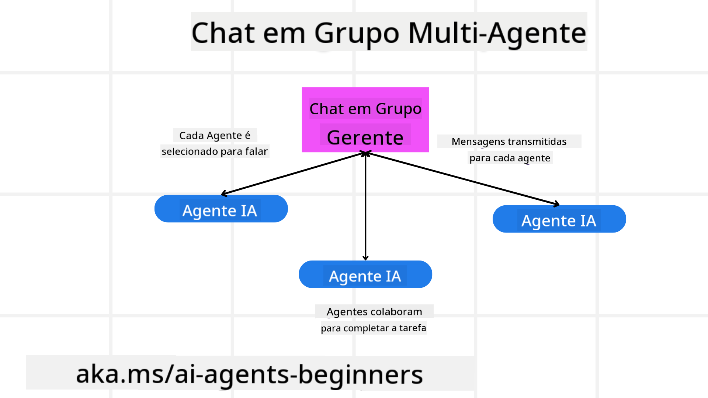
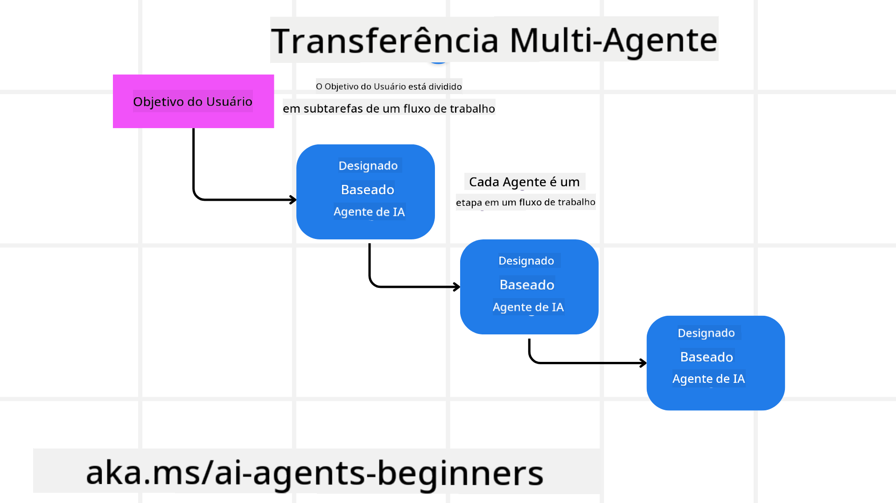

<!--
CO_OP_TRANSLATOR_METADATA:
{
  "original_hash": "c692a8975d7d5b99575a553de1c5e8a7",
  "translation_date": "2025-07-12T11:06:56+00:00",
  "source_file": "08-multi-agent/README.md",
  "language_code": "br"
}
-->

> _(Clique na imagem acima para assistir ao vídeo desta lição)_

# Padrões de design multiagente

Assim que você começar a trabalhar em um projeto que envolve múltiplos agentes, será necessário considerar o padrão de design multiagente. No entanto, pode não ser imediatamente claro quando mudar para múltiplos agentes e quais são as vantagens.

## Introdução

Nesta lição, buscamos responder às seguintes perguntas:

- Quais são os cenários em que múltiplos agentes são aplicáveis?
- Quais são as vantagens de usar múltiplos agentes em vez de um único agente realizando várias tarefas?
- Quais são os blocos de construção para implementar o padrão de design multiagente?
- Como podemos ter visibilidade de como os múltiplos agentes estão interagindo entre si?

## Objetivos de Aprendizagem

Após esta lição, você deverá ser capaz de:

- Identificar cenários onde múltiplos agentes são aplicáveis
- Reconhecer as vantagens de usar múltiplos agentes em vez de um agente singular.
- Compreender os blocos de construção para implementar o padrão de design multiagente.

Qual é o panorama geral?

*Multiagentes são um padrão de design que permite que múltiplos agentes trabalhem juntos para alcançar um objetivo comum*.

Esse padrão é amplamente utilizado em diversos campos, incluindo robótica, sistemas autônomos e computação distribuída.

## Cenários Onde Múltiplos Agentes São Aplicáveis

Então, quais cenários são um bom caso de uso para múltiplos agentes? A resposta é que existem muitos cenários onde empregar múltiplos agentes é benéfico, especialmente nos seguintes casos:

- **Grandes cargas de trabalho**: Grandes cargas de trabalho podem ser divididas em tarefas menores e atribuídas a diferentes agentes, permitindo processamento paralelo e conclusão mais rápida. Um exemplo disso é no caso de uma grande tarefa de processamento de dados.
- **Tarefas complexas**: Tarefas complexas, assim como grandes cargas de trabalho, podem ser divididas em subtarefas menores e atribuídas a diferentes agentes, cada um especializado em um aspecto específico da tarefa. Um bom exemplo disso é no caso de veículos autônomos, onde diferentes agentes gerenciam navegação, detecção de obstáculos e comunicação com outros veículos.
- **Expertise diversa**: Diferentes agentes podem ter expertise diversa, permitindo que lidem com diferentes aspectos de uma tarefa de forma mais eficaz do que um único agente. Para este caso, um bom exemplo é na área da saúde, onde agentes podem gerenciar diagnósticos, planos de tratamento e monitoramento de pacientes.

## Vantagens de Usar Múltiplos Agentes em vez de um Agente Singular

Um sistema com um único agente pode funcionar bem para tarefas simples, mas para tarefas mais complexas, usar múltiplos agentes pode oferecer várias vantagens:

- **Especialização**: Cada agente pode ser especializado para uma tarefa específica. A falta de especialização em um único agente significa que você tem um agente que pode fazer de tudo, mas pode ficar confuso sobre o que fazer quando enfrenta uma tarefa complexa. Por exemplo, ele pode acabar realizando uma tarefa para a qual não é o mais adequado.
- **Escalabilidade**: É mais fácil escalar sistemas adicionando mais agentes do que sobrecarregando um único agente.
- **Tolerância a falhas**: Se um agente falhar, os outros podem continuar funcionando, garantindo a confiabilidade do sistema.

Vamos pegar um exemplo: vamos reservar uma viagem para um usuário. Um sistema com um único agente teria que lidar com todos os aspectos do processo de reserva da viagem, desde encontrar voos até reservar hotéis e carros de aluguel. Para conseguir isso com um único agente, ele precisaria ter ferramentas para lidar com todas essas tarefas. Isso poderia levar a um sistema complexo e monolítico, difícil de manter e escalar. Um sistema multiagente, por outro lado, poderia ter diferentes agentes especializados em encontrar voos, reservar hotéis e carros de aluguel. Isso tornaria o sistema mais modular, mais fácil de manter e escalável.

Compare isso com uma agência de viagens administrada como uma loja familiar versus uma agência de viagens administrada como uma franquia. A loja familiar teria um único agente lidando com todos os aspectos do processo de reserva da viagem, enquanto a franquia teria diferentes agentes lidando com diferentes aspectos do processo.

## Blocos de Construção para Implementar o Padrão de Design Multiagente

Antes de implementar o padrão de design multiagente, você precisa entender os blocos de construção que compõem o padrão.

Vamos tornar isso mais concreto olhando novamente para o exemplo de reservar uma viagem para um usuário. Nesse caso, os blocos de construção incluiriam:

- **Comunicação entre agentes**: Agentes para encontrar voos, reservar hotéis e carros de aluguel precisam se comunicar e compartilhar informações sobre as preferências e restrições do usuário. Você precisa decidir os protocolos e métodos para essa comunicação. Concretamente, isso significa que o agente que encontra voos precisa se comunicar com o agente que reserva hotéis para garantir que o hotel seja reservado para as mesmas datas do voo. Isso significa que os agentes precisam compartilhar informações sobre as datas da viagem do usuário, ou seja, você precisa decidir *quais agentes estão compartilhando informações e como estão compartilhando*.
- **Mecanismos de coordenação**: Os agentes precisam coordenar suas ações para garantir que as preferências e restrições do usuário sejam atendidas. Uma preferência do usuário pode ser que ele queira um hotel próximo ao aeroporto, enquanto uma restrição pode ser que os carros de aluguel só estejam disponíveis no aeroporto. Isso significa que o agente que reserva hotéis precisa coordenar com o agente que reserva carros para garantir que as preferências e restrições do usuário sejam atendidas. Isso significa que você precisa decidir *como os agentes estão coordenando suas ações*.
- **Arquitetura do agente**: Os agentes precisam ter uma estrutura interna para tomar decisões e aprender com suas interações com o usuário. Isso significa que o agente que encontra voos precisa ter uma estrutura interna para decidir quais voos recomendar ao usuário. Isso significa que você precisa decidir *como os agentes estão tomando decisões e aprendendo com suas interações com o usuário*. Exemplos de como um agente aprende e melhora podem ser que o agente que encontra voos use um modelo de machine learning para recomendar voos ao usuário com base em suas preferências anteriores.
- **Visibilidade nas interações multiagente**: Você precisa ter visibilidade de como os múltiplos agentes estão interagindo entre si. Isso significa que você precisa de ferramentas e técnicas para rastrear as atividades e interações dos agentes. Isso pode ser na forma de ferramentas de logging e monitoramento, ferramentas de visualização e métricas de desempenho.
- **Padrões multiagente**: Existem diferentes padrões para implementar sistemas multiagente, como arquiteturas centralizadas, descentralizadas e híbridas. Você precisa decidir qual padrão se encaixa melhor no seu caso de uso.
- **Humano no loop**: Na maioria dos casos, haverá um humano no loop e você precisa instruir os agentes sobre quando pedir intervenção humana. Isso pode ser na forma de um usuário solicitando um hotel ou voo específico que os agentes não recomendaram ou pedindo confirmação antes de reservar um voo ou hotel.

## Visibilidade nas Interações Multiagente

É importante que você tenha visibilidade de como os múltiplos agentes estão interagindo entre si. Essa visibilidade é essencial para depuração, otimização e para garantir a eficácia geral do sistema. Para isso, você precisa de ferramentas e técnicas para rastrear as atividades e interações dos agentes. Isso pode ser na forma de ferramentas de logging e monitoramento, ferramentas de visualização e métricas de desempenho.

Por exemplo, no caso de reservar uma viagem para um usuário, você poderia ter um painel que mostra o status de cada agente, as preferências e restrições do usuário, e as interações entre os agentes. Esse painel poderia mostrar as datas da viagem do usuário, os voos recomendados pelo agente de voos, os hotéis recomendados pelo agente de hotéis e os carros de aluguel recomendados pelo agente de aluguel. Isso daria uma visão clara de como os agentes estão interagindo entre si e se as preferências e restrições do usuário estão sendo atendidas.

Vamos analisar cada um desses aspectos com mais detalhes.

- **Ferramentas de logging e monitoramento**: Você quer ter registros para cada ação tomada por um agente. Uma entrada de log pode armazenar informações sobre o agente que realizou a ação, a ação realizada, o momento em que a ação foi feita e o resultado da ação. Essas informações podem ser usadas para depuração, otimização e mais.
- **Ferramentas de visualização**: Ferramentas de visualização podem ajudar você a ver as interações entre agentes de forma mais intuitiva. Por exemplo, você poderia ter um gráfico que mostra o fluxo de informações entre os agentes. Isso pode ajudar a identificar gargalos, ineficiências e outros problemas no sistema.
- **Métricas de desempenho**: Métricas de desempenho podem ajudar a acompanhar a eficácia do sistema multiagente. Por exemplo, você poderia acompanhar o tempo para completar uma tarefa, o número de tarefas concluídas por unidade de tempo e a precisão das recomendações feitas pelos agentes. Essas informações podem ajudar a identificar áreas para melhoria e otimizar o sistema.

## Padrões Multiagente

Vamos explorar alguns padrões concretos que podemos usar para criar aplicativos multiagente. Aqui estão alguns padrões interessantes que valem a pena considerar:

### Chat em grupo

Esse padrão é útil quando você quer criar um aplicativo de chat em grupo onde múltiplos agentes podem se comunicar entre si. Casos típicos de uso para esse padrão incluem colaboração em equipe, suporte ao cliente e redes sociais.

Nesse padrão, cada agente representa um usuário no chat em grupo, e as mensagens são trocadas entre agentes usando um protocolo de mensagens. Os agentes podem enviar mensagens para o chat em grupo, receber mensagens do chat e responder a mensagens de outros agentes.

Esse padrão pode ser implementado usando uma arquitetura centralizada, onde todas as mensagens passam por um servidor central, ou uma arquitetura descentralizada, onde as mensagens são trocadas diretamente.

### Transferência de tarefas

Esse padrão é útil quando você quer criar um aplicativo onde múltiplos agentes podem transferir tarefas entre si.

Casos típicos de uso para esse padrão incluem suporte ao cliente, gerenciamento de tarefas e automação de fluxos de trabalho.

Nesse padrão, cada agente representa uma tarefa ou uma etapa em um fluxo de trabalho, e os agentes podem transferir tarefas para outros agentes com base em regras predefinidas.

### Filtragem colaborativa

Esse padrão é útil quando você quer criar um aplicativo onde múltiplos agentes podem colaborar para fazer recomendações aos usuários.

O motivo para querer que múltiplos agentes colaborem é que cada agente pode ter expertise diferente e pode contribuir para o processo de recomendação de maneiras distintas.

Vamos pegar um exemplo onde um usuário quer uma recomendação sobre a melhor ação para comprar no mercado de ações.

- **Especialista do setor**: Um agente pode ser especialista em um setor específico.
- **Análise técnica**: Outro agente pode ser especialista em análise técnica.
- **Análise fundamentalista**: E outro agente pode ser especialista em análise fundamentalista. Colaborando, esses agentes podem fornecer uma recomendação mais completa para o usuário.

## Cenário: Processo de reembolso

Considere um cenário onde um cliente está tentando obter um reembolso por um produto. Podem estar envolvidos vários agentes nesse processo, mas vamos dividir entre agentes específicos para esse processo e agentes gerais que podem ser usados em outros processos.

**Agentes específicos para o processo de reembolso**:

A seguir, alguns agentes que poderiam estar envolvidos no processo de reembolso:

- **Agente do cliente**: Este agente representa o cliente e é responsável por iniciar o processo de reembolso.
- **Agente do vendedor**: Este agente representa o vendedor e é responsável por processar o reembolso.
- **Agente de pagamento**: Este agente representa o processo de pagamento e é responsável por reembolsar o pagamento do cliente.
- **Agente de resolução**: Este agente representa o processo de resolução e é responsável por resolver quaisquer problemas que surgirem durante o processo de reembolso.
- **Agente de conformidade**: Este agente representa o processo de conformidade e é responsável por garantir que o processo de reembolso esteja em conformidade com regulamentos e políticas.

**Agentes gerais**:

Esses agentes podem ser usados por outras partes do seu negócio.

- **Agente de envio**: Este agente representa o processo de envio e é responsável por enviar o produto de volta ao vendedor. Esse agente pode ser usado tanto no processo de reembolso quanto no envio geral de um produto via compra, por exemplo.
- **Agente de feedback**: Este agente representa o processo de feedback e é responsável por coletar feedback do cliente. O feedback pode ser coletado a qualquer momento, não apenas durante o processo de reembolso.
- **Agente de escalonamento**: Este agente representa o processo de escalonamento e é responsável por escalar problemas para um nível superior de suporte. Você pode usar esse tipo de agente para qualquer processo onde seja necessário escalar um problema.
- **Agente de notificações**: Este agente representa o processo de notificações e é responsável por enviar notificações ao cliente em várias etapas do processo de reembolso.
- **Agente de análise**: Este agente representa o processo de análise e é responsável por analisar dados relacionados ao processo de reembolso.
- **Agente de auditoria**: Este agente representa o processo de auditoria e é responsável por auditar o processo de reembolso para garantir que ele está sendo realizado corretamente.
- **Agente de relatórios**: Este agente representa o processo de relatórios e é responsável por gerar relatórios sobre o processo de reembolso.
- **Agente de conhecimento**: Este agente representa o processo de conhecimento e é responsável por manter uma base de conhecimento com informações relacionadas ao processo de reembolso. Esse agente pode ter conhecimento tanto sobre reembolsos quanto sobre outras partes do seu negócio.
- **Agente de segurança**: Este agente representa o processo de segurança e é responsável por garantir a segurança do processo de reembolso.
- **Agente de qualidade**: Este agente representa o processo de qualidade e é responsável por garantir a qualidade do processo de reembolso.

Há muitos agentes listados anteriormente, tanto para o processo específico de reembolso quanto para os agentes gerais que podem ser usados em outras partes do seu negócio. Esperamos que isso lhe dê uma ideia de como decidir quais agentes usar no seu sistema multiagente.

## Tarefa
## Aula Anterior

[Planejamento de Design](../07-planning-design/README.md)

## Próxima Aula

[Metacognição em Agentes de IA](../09-metacognition/README.md)

**Aviso Legal**:  
Este documento foi traduzido utilizando o serviço de tradução por IA [Co-op Translator](https://github.com/Azure/co-op-translator). Embora nos esforcemos para garantir a precisão, esteja ciente de que traduções automáticas podem conter erros ou imprecisões. O documento original em seu idioma nativo deve ser considerado a fonte autorizada. Para informações críticas, recomenda-se tradução profissional humana. Não nos responsabilizamos por quaisquer mal-entendidos ou interpretações incorretas decorrentes do uso desta tradução.