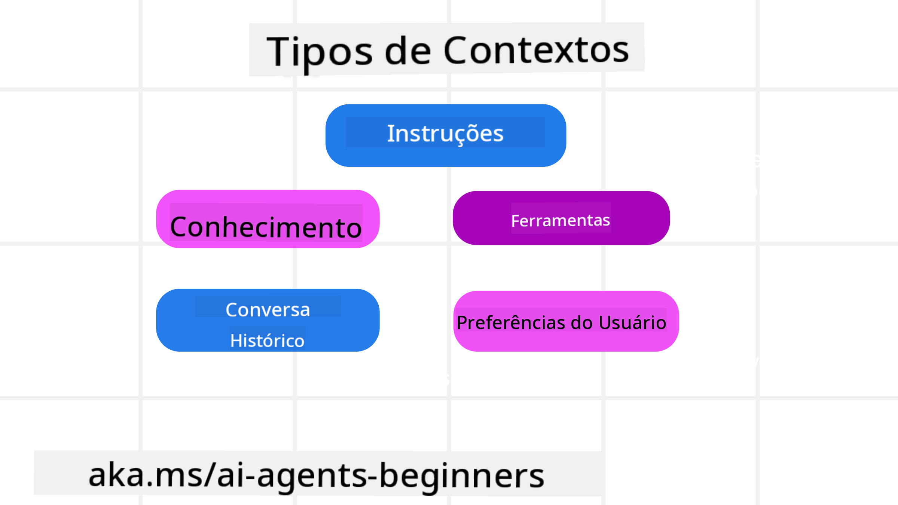

<!--
CO_OP_TRANSLATOR_METADATA:
{
  "original_hash": "cb7e50f471905ce6fdb92a30269a7a98",
  "translation_date": "2025-09-04T10:01:50+00:00",
  "source_file": "12-context-engineering/README.md",
  "language_code": "br"
}
-->
# Engenharia de Contexto para Agentes de IA

> _(Clique na imagem acima para assistir ao vídeo desta lição)_

Compreender a complexidade da aplicação para a qual você está desenvolvendo um agente de IA é essencial para criar um agente confiável. Precisamos construir agentes de IA que gerenciem informações de forma eficaz para atender a necessidades complexas, indo além da engenharia de prompts.

Nesta lição, exploraremos o que é engenharia de contexto e seu papel na construção de agentes de IA.

## Introdução

Esta lição abordará:

• **O que é Engenharia de Contexto** e por que ela é diferente da engenharia de prompts.

• **Estratégias para uma Engenharia de Contexto eficaz**, incluindo como escrever, selecionar, comprimir e isolar informações.

• **Falhas Comuns de Contexto** que podem prejudicar seu agente de IA e como corrigi-las.

## Objetivos de Aprendizado

Após concluir esta lição, você será capaz de:

• **Definir engenharia de contexto** e diferenciá-la da engenharia de prompts.

• **Identificar os principais componentes do contexto** em aplicações de Modelos de Linguagem de Grande Escala (LLM).

• **Aplicar estratégias para escrever, selecionar, comprimir e isolar o contexto** para melhorar o desempenho do agente.

• **Reconhecer falhas comuns de contexto**, como envenenamento, distração, confusão e conflito, e implementar técnicas de mitigação.

## O que é Engenharia de Contexto?

Para agentes de IA, o contexto é o que orienta o planejamento do agente para tomar certas ações. Engenharia de Contexto é a prática de garantir que o agente de IA tenha as informações corretas para completar a próxima etapa da tarefa. A janela de contexto é limitada em tamanho, então, como desenvolvedores de agentes, precisamos criar sistemas e processos para gerenciar a adição, remoção e condensação das informações na janela de contexto.

### Engenharia de Prompts vs Engenharia de Contexto

A engenharia de prompts foca em um conjunto único de instruções estáticas para orientar os agentes de IA com um conjunto de regras. A engenharia de contexto, por outro lado, trata de gerenciar um conjunto dinâmico de informações, incluindo o prompt inicial, para garantir que o agente de IA tenha o que precisa ao longo do tempo. A ideia principal da engenharia de contexto é tornar esse processo repetível e confiável.

### Tipos de Contexto

É importante lembrar que o contexto não é uma coisa única. As informações que o agente de IA precisa podem vir de várias fontes diferentes, e cabe a nós garantir que o agente tenha acesso a essas fontes:

Os tipos de contexto que um agente de IA pode precisar gerenciar incluem:

• **Instruções:** São como as "regras" do agente – prompts, mensagens do sistema, exemplos few-shot (mostrando ao agente como fazer algo) e descrições de ferramentas que ele pode usar. Aqui é onde a engenharia de prompts se combina com a engenharia de contexto.

• **Conhecimento:** Abrange fatos, informações recuperadas de bancos de dados ou memórias de longo prazo acumuladas pelo agente. Isso inclui integrar um sistema de Geração Aumentada por Recuperação (RAG) se o agente precisar acessar diferentes repositórios de conhecimento e bancos de dados.

• **Ferramentas:** São as definições de funções externas, APIs e servidores MCP que o agente pode chamar, junto com o feedback (resultados) que ele obtém ao usá-las.

• **Histórico de Conversa:** O diálogo contínuo com um usuário. Com o tempo, essas conversas se tornam mais longas e complexas, ocupando mais espaço na janela de contexto.

• **Preferências do Usuário:** Informações aprendidas sobre os gostos ou desgostos de um usuário ao longo do tempo. Essas informações podem ser armazenadas e usadas ao tomar decisões importantes para ajudar o usuário.

## Estratégias para uma Engenharia de Contexto Eficaz

### Estratégias de Planejamento

Uma boa engenharia de contexto começa com um bom planejamento. Aqui está uma abordagem que ajudará você a começar a aplicar o conceito de engenharia de contexto:

1. **Defina Resultados Claros** - Os resultados das tarefas atribuídas aos agentes de IA devem ser claramente definidos. Responda à pergunta: "Como o mundo estará quando o agente de IA concluir sua tarefa?" Em outras palavras, qual mudança, informação ou resposta o usuário deve ter após interagir com o agente de IA.

2. **Mapeie o Contexto** - Depois de definir os resultados do agente de IA, você precisa responder à pergunta: "Quais informações o agente de IA precisa para concluir essa tarefa?" Assim, você pode começar a mapear o contexto de onde essas informações podem ser localizadas.

3. **Crie Pipelines de Contexto** - Agora que você sabe onde estão as informações, precisa responder à pergunta: "Como o agente obterá essas informações?" Isso pode ser feito de várias maneiras, incluindo RAG, uso de servidores MCP e outras ferramentas.

### Estratégias Práticas

O planejamento é importante, mas, uma vez que as informações começam a fluir para a janela de contexto do agente, precisamos de estratégias práticas para gerenciá-las:

#### Gerenciando o Contexto

Embora algumas informações sejam adicionadas automaticamente à janela de contexto, a engenharia de contexto envolve um papel mais ativo nesse gerenciamento, o que pode ser feito por meio de algumas estratégias:

1. **Bloco de Notas do Agente**  
   Permite que o agente de IA faça anotações sobre informações relevantes relacionadas às tarefas atuais e interações com o usuário durante uma única sessão. Isso deve existir fora da janela de contexto, em um arquivo ou objeto em tempo de execução, que o agente possa recuperar mais tarde, se necessário.

2. **Memórias**  
   Blocos de notas são úteis para gerenciar informações fora da janela de contexto de uma única sessão. Memórias permitem que agentes armazenem e recuperem informações relevantes ao longo de várias sessões. Isso pode incluir resumos, preferências do usuário e feedback para melhorias futuras.

3. **Comprimindo o Contexto**  
   Quando a janela de contexto cresce e se aproxima do limite, técnicas como sumarização e corte podem ser usadas. Isso inclui manter apenas as informações mais relevantes ou remover mensagens mais antigas.

4. **Sistemas Multiagentes**  
   Desenvolver sistemas multiagentes é uma forma de engenharia de contexto, pois cada agente tem sua própria janela de contexto. Planejar como esse contexto será compartilhado e passado entre diferentes agentes é outro aspecto importante ao construir esses sistemas.

5. **Ambientes de Teste (Sandbox)**  
   Se um agente precisa executar algum código ou processar grandes quantidades de informações em um documento, isso pode consumir muitos tokens para processar os resultados. Em vez de armazenar tudo na janela de contexto, o agente pode usar um ambiente de teste que execute o código e leia apenas os resultados e outras informações relevantes.

6. **Objetos de Estado em Tempo de Execução**  
   Isso é feito criando contêineres de informações para gerenciar situações em que o agente precisa acessar certas informações. Para uma tarefa complexa, isso permitiria que o agente armazenasse os resultados de cada subtarefa passo a passo, mantendo o contexto conectado apenas à subtarefa específica.

### Exemplo de Engenharia de Contexto

Digamos que queremos que um agente de IA **"Reserve uma viagem para Paris."**

• Um agente simples usando apenas engenharia de prompts pode responder: **"Certo, quando você gostaria de ir para Paris?"**. Ele processa apenas a pergunta direta feita pelo usuário no momento.

• Um agente usando as estratégias de engenharia de contexto abordadas faria muito mais. Antes mesmo de responder, seu sistema poderia:

  ◦ **Verificar seu calendário** para datas disponíveis (recuperando dados em tempo real).  
  ◦ **Lembrar preferências de viagens anteriores** (de memórias de longo prazo), como sua companhia aérea preferida, orçamento ou se você prefere voos diretos.  
  ◦ **Identificar ferramentas disponíveis** para reserva de voos e hotéis.  

- Então, uma resposta exemplo poderia ser: "Olá [Seu Nome]! Vejo que você está livre na primeira semana de outubro. Devo procurar voos diretos para Paris na [Companhia Aérea Preferida] dentro do seu orçamento usual de [Orçamento]?" Essa resposta mais rica e consciente do contexto demonstra o poder da engenharia de contexto.

## Falhas Comuns de Contexto

### Envenenamento de Contexto

**O que é:** Quando uma alucinação (informação falsa gerada pelo LLM) ou um erro entra no contexto e é repetidamente referenciado, fazendo com que o agente persiga objetivos impossíveis ou desenvolva estratégias sem sentido.

**O que fazer:** Implemente **validação de contexto** e **quarentena**. Valide informações antes de adicioná-las à memória de longo prazo. Se for detectado um possível envenenamento, inicie novos threads de contexto para evitar que a informação errada se espalhe.

**Exemplo de Reserva de Viagem:** Seu agente alucina um **voo direto de um pequeno aeroporto local para uma cidade internacional distante** que não oferece voos internacionais. Esse detalhe inexistente é salvo no contexto. Mais tarde, ao pedir para reservar, o agente continua tentando encontrar passagens para essa rota impossível, levando a erros repetidos.

**Solução:** Implemente uma etapa que **valide a existência de voos e rotas com uma API em tempo real** _antes_ de adicionar o detalhe do voo ao contexto do agente. Se a validação falhar, a informação errada é "quarentenada" e não é usada novamente.

### Distração de Contexto

**O que é:** Quando o contexto se torna tão grande que o modelo foca demais no histórico acumulado, em vez de usar o que aprendeu durante o treinamento, levando a ações repetitivas ou inúteis. Modelos podem começar a cometer erros mesmo antes de a janela de contexto estar cheia.

**O que fazer:** Use **sumarização de contexto**. Periodicamente, comprima as informações acumuladas em resumos mais curtos, mantendo detalhes importantes e removendo o histórico redundante. Isso ajuda a "reiniciar" o foco.

**Exemplo de Reserva de Viagem:** Você discute vários destinos de viagem dos sonhos por um longo tempo, incluindo uma descrição detalhada de sua viagem de mochilão de dois anos atrás. Quando finalmente pede para **"encontrar um voo barato para o próximo mês"**, o agente se perde nos detalhes antigos e irrelevantes, perguntando sobre seu equipamento de mochilão ou itinerários passados, negligenciando sua solicitação atual.

**Solução:** Após um certo número de interações ou quando o contexto crescer demais, o agente deve **resumir as partes mais recentes e relevantes da conversa** – focando nas datas e no destino atuais – e usar esse resumo condensado para a próxima chamada ao LLM, descartando o histórico menos relevante.

### Confusão de Contexto

**O que é:** Quando o contexto desnecessário, muitas vezes na forma de ferramentas disponíveis em excesso, faz com que o modelo gere respostas ruins ou chame ferramentas irrelevantes. Modelos menores são especialmente propensos a isso.

**O que fazer:** Implemente **gerenciamento de ferramentas** usando técnicas RAG. Armazene descrições de ferramentas em um banco de dados vetorial e selecione _apenas_ as ferramentas mais relevantes para cada tarefa específica. Pesquisas mostram que limitar as seleções de ferramentas a menos de 30 é eficaz.

**Exemplo de Reserva de Viagem:** Seu agente tem acesso a dezenas de ferramentas: `book_flight`, `book_hotel`, `rent_car`, `find_tours`, `currency_converter`, `weather_forecast`, `restaurant_reservations`, etc. Você pergunta, **"Qual é a melhor forma de se locomover em Paris?"** Devido ao grande número de ferramentas, o agente se confunde e tenta chamar `book_flight` _dentro_ de Paris ou `rent_car`, mesmo que você prefira transporte público, porque as descrições das ferramentas podem se sobrepor ou ele simplesmente não consegue discernir a melhor opção.

**Solução:** Use **RAG sobre descrições de ferramentas**. Quando você pergunta sobre locomoção em Paris, o sistema recupera dinamicamente _apenas_ as ferramentas mais relevantes, como `rent_car` ou `public_transport_info`, com base na sua consulta, apresentando um "conjunto" focado de ferramentas ao LLM.

### Conflito de Contexto

**O que é:** Quando informações conflitantes existem dentro do contexto, levando a raciocínios inconsistentes ou respostas finais ruins. Isso geralmente acontece quando informações chegam em etapas, e suposições iniciais incorretas permanecem no contexto.

**O que fazer:** Use **poda de contexto** e **descarte**. A poda remove informações desatualizadas ou conflitantes à medida que novos detalhes chegam. O descarte dá ao modelo um "bloco de notas" separado para processar informações sem sobrecarregar o contexto principal.

**Exemplo de Reserva de Viagem:** Inicialmente, você diz ao agente, **"Quero voar na classe econômica."** Mais tarde, na conversa, você muda de ideia e diz, **"Na verdade, para esta viagem, vamos de classe executiva."** Se ambas as instruções permanecerem no contexto, o agente pode receber resultados de busca conflitantes ou se confundir sobre qual preferência priorizar.

**Solução:** Implemente **poda de contexto**. Quando uma nova instrução contradiz uma antiga, a instrução mais antiga é removida ou explicitamente substituída no contexto. Alternativamente, o agente pode usar um **bloco de notas** para reconciliar preferências conflitantes antes de decidir, garantindo que apenas a instrução final e consistente guie suas ações.

## Tem Mais Perguntas Sobre Engenharia de Contexto?

Junte-se ao [Discord do Azure AI Foundry](https://aka.ms/ai-agents/discord) para interagir com outros aprendizes, participar de horários de atendimento e tirar suas dúvidas sobre agentes de IA.

---

**Aviso Legal**:  
Este documento foi traduzido utilizando o serviço de tradução por IA [Co-op Translator](https://github.com/Azure/co-op-translator). Embora nos esforcemos para garantir a precisão, esteja ciente de que traduções automáticas podem conter erros ou imprecisões. O documento original em seu idioma nativo deve ser considerado a fonte oficial. Para informações críticas, recomenda-se a tradução profissional realizada por humanos. Não nos responsabilizamos por quaisquer mal-entendidos ou interpretações equivocadas decorrentes do uso desta tradução.