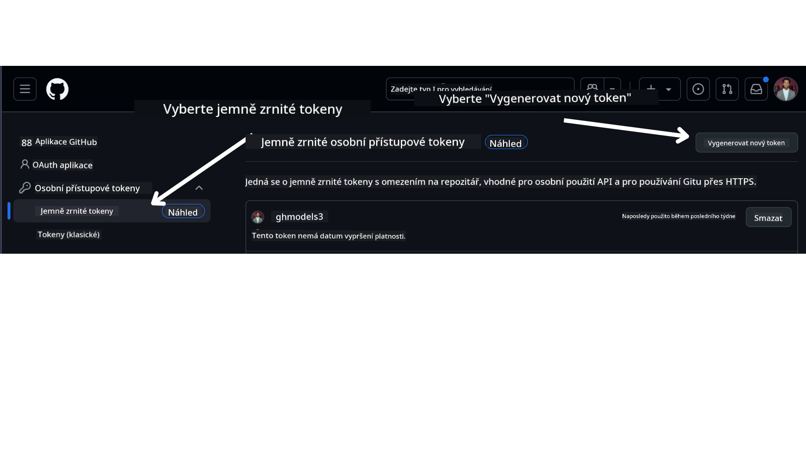

<!--
CO_OP_TRANSLATOR_METADATA:
{
  "original_hash": "76945069b52a49cd0432ae3e0b0ba22e",
  "translation_date": "2025-07-12T07:56:14+00:00",
  "source_file": "00-course-setup/README.md",
  "language_code": "cs"
}
-->
ve svém GitHub účtu.

Vyberte možnost `Fine-grained tokens` na levé straně obrazovky.

Poté vyberte `Generate new token`.



Budete vyzváni k zadání názvu tokenu, výběru doby platnosti (doporučeno: 30 dní) a výběru oprávnění pro token (veřejné repozitáře).

Je také nutné upravit oprávnění tohoto tokenu: Permissions -> Models -> Umožňuje přístup k GitHub Models

Zkopírujte svůj nově vytvořený token. Nyní jej přidáte do souboru `.env`, který je součástí tohoto kurzu.

### Krok 2: Vytvořte svůj soubor `.env`

Pro vytvoření souboru `.env` spusťte v terminálu následující příkaz.

```bash
cp .env.example .env
```

Tím se zkopíruje ukázkový soubor a vytvoří se `.env` ve vašem adresáři, kde vyplníte hodnoty pro proměnné prostředí.

S tokenem zkopírovaným otevřete soubor `.env` ve svém oblíbeném textovém editoru a vložte token do pole `GITHUB_TOKEN`.

Nyní byste měli být schopni spustit ukázkové kódy tohoto kurzu.

## Nastavení pro ukázky používající Azure AI Foundry a Azure AI Agent Service

### Krok 1: Získejte koncový bod svého Azure projektu

Postupujte podle kroků pro vytvoření hubu a projektu v Azure AI Foundry, které najdete zde: [Hub resources overview](https://learn.microsoft.com/en-us/azure/ai-foundry/concepts/ai-resources)

Jakmile vytvoříte svůj projekt, budete potřebovat získat připojovací řetězec pro svůj projekt.

To lze provést na stránce **Overview** vašeho projektu v portálu Azure AI Foundry.


### Krok 2: Vytvořte svůj soubor `.env`

Pro vytvoření souboru `.env` spusťte v terminálu následující příkaz.

```bash
cp .env.example .env
```

Tím se zkopíruje ukázkový soubor a vytvoří se `.env` ve vašem adresáři, kde vyplníte hodnoty pro proměnné prostředí.

S tokenem zkopírovaným otevřete soubor `.env` ve svém oblíbeném textovém editoru a vložte token do pole `PROJECT_ENDPOINT`.

### Krok 3: Přihlaste se do Azure

Jako bezpečnostní nejlepší praxi použijeme [keyless authentication](https://learn.microsoft.com/azure/developer/ai/keyless-connections?tabs=csharp%2Cazure-cli?WT.mc_id=academic-105485-koreyst) pro autentizaci do Azure OpenAI pomocí Microsoft Entra ID. Než to budete moci udělat, musíte nejprve nainstalovat **Azure CLI** podle [instalačních pokynů](https://learn.microsoft.com/cli/azure/install-azure-cli?WT.mc_id=academic-105485-koreyst) pro váš operační systém.

Poté otevřete terminál a spusťte `az login --use-device-code` pro přihlášení do svého Azure účtu.

Po přihlášení vyberte ve svém terminálu předplatné.

## Další proměnné prostředí - Azure Search a Azure OpenAI

Pro lekci Agentic RAG - Lekce 5 - jsou zde ukázky, které používají Azure Search a Azure OpenAI.

Pokud chcete tyto ukázky spustit, budete muset přidat následující proměnné prostředí do svého souboru `.env`:

### Stránka přehledu (projekt)

- `AZURE_SUBSCRIPTION_ID` - Zkontrolujte **Project details** na stránce **Overview** vašeho projektu.

- `AZURE_AI_PROJECT_NAME` - Najdete v horní části stránky **Overview** vašeho projektu.

- `AZURE_OPENAI_SERVICE` - Najdete na záložce **Included capabilities** pro **Azure OpenAI Service** na stránce **Overview**.

### Management Center

- `AZURE_OPENAI_RESOURCE_GROUP` - Najdete v **Project properties** na stránce **Overview** v **Management Center**.

- `GLOBAL_LLM_SERVICE` - Pod **Connected resources** najděte název připojení **Azure AI Services**. Pokud není uvedeno, zkontrolujte v **Azure portálu** ve vaší skupině prostředků název služby AI.

### Stránka modelů a koncových bodů

- `AZURE_OPENAI_EMBEDDING_DEPLOYMENT_NAME` - Vyberte svůj embedding model (např. `text-embedding-ada-002`) a poznamenejte si **Deployment name** z detailů modelu.

- `AZURE_OPENAI_CHAT_DEPLOYMENT_NAME` - Vyberte svůj chat model (např. `gpt-4o-mini`) a poznamenejte si **Deployment name** z detailů modelu.

### Azure portál

- `AZURE_OPENAI_ENDPOINT` - Najděte **Azure AI services**, klikněte na něj, poté přejděte do **Resource Management**, **Keys and Endpoint**, sjeďte dolů k "Azure OpenAI endpoints" a zkopírujte ten, který je označen jako "Language APIs".

- `AZURE_OPENAI_API_KEY` - Ze stejné obrazovky zkopírujte KLÍČ 1 nebo KLÍČ 2.

- `AZURE_SEARCH_SERVICE_ENDPOINT` - Najděte svůj zdroj **Azure AI Search**, klikněte na něj a zobrazte **Overview**.

- `AZURE_SEARCH_API_KEY` - Poté přejděte do **Settings** a pak **Keys** a zkopírujte primární nebo sekundární administrátorský klíč.

### Externí webová stránka

- `AZURE_OPENAI_API_VERSION` - Navštivte stránku [API version lifecycle](https://learn.microsoft.com/en-us/azure/ai-services/openai/api-version-deprecation#latest-ga-api-release) pod **Latest GA API release**.

### Nastavení keyless autentizace

Místo pevného zakódování přihlašovacích údajů použijeme keyless připojení s Azure OpenAI. K tomu importujeme `DefaultAzureCredential` a později zavoláme funkci `DefaultAzureCredential` pro získání přihlašovacích údajů.

```python
from azure.identity import DefaultAzureCredential, InteractiveBrowserCredential
```

## Někam jste uvízli?

Pokud máte jakékoli problémy s nastavením, připojte se do našeho

nebo

.

## Další lekce

Nyní jste připraveni spustit kód tohoto kurzu. Přejeme hodně úspěchů při objevování světa AI agentů!

[Úvod do AI agentů a jejich použití](../01-intro-to-ai-agents/README.md)

**Prohlášení o vyloučení odpovědnosti**:  
Tento dokument byl přeložen pomocí AI překladatelské služby [Co-op Translator](https://github.com/Azure/co-op-translator). I když usilujeme o přesnost, mějte prosím na paměti, že automatické překlady mohou obsahovat chyby nebo nepřesnosti. Původní dokument v jeho mateřském jazyce by měl být považován za autoritativní zdroj. Pro důležité informace se doporučuje profesionální lidský překlad. Nejsme odpovědní za jakékoliv nedorozumění nebo nesprávné výklady vyplývající z použití tohoto překladu.