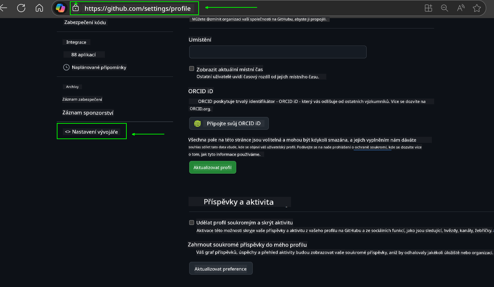
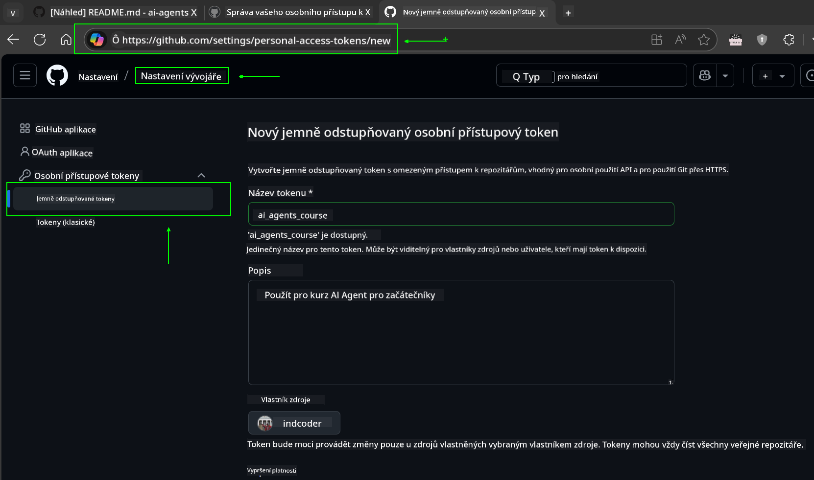
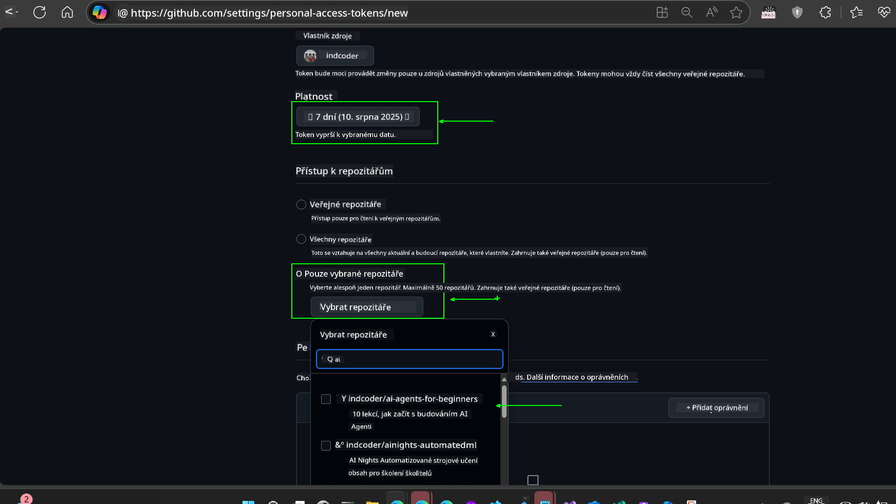
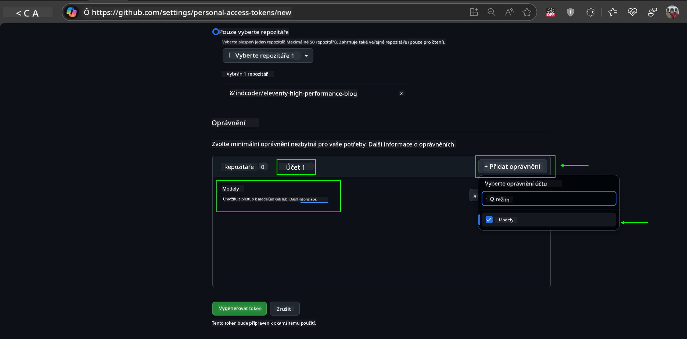
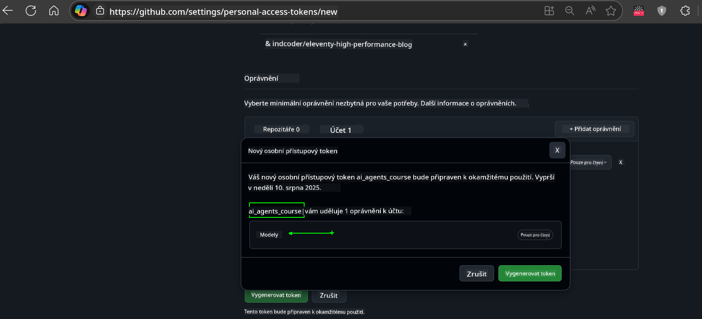
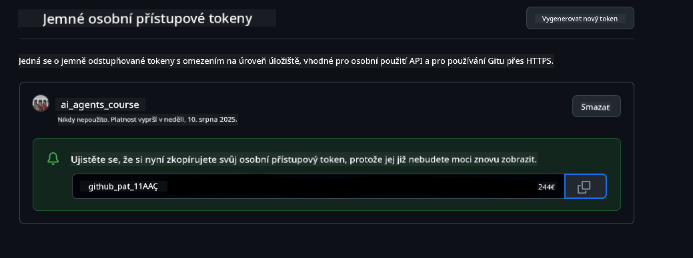
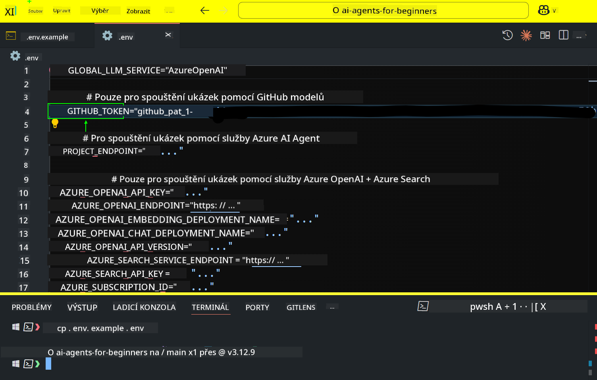

<!--
CO_OP_TRANSLATOR_METADATA:
{
  "original_hash": "c55b973b1562abf5aadf6a4028265ac5",
  "translation_date": "2025-08-29T20:24:14+00:00",
  "source_file": "00-course-setup/README.md",
  "language_code": "cs"
}
-->
# Nastavení kurzu

## Úvod

Tato lekce se zaměří na to, jak spustit ukázky kódu z tohoto kurzu.

## Připojte se k ostatním studentům a získejte pomoc

Než začnete klonovat své úložiště, připojte se k [Discord kanálu AI Agents For Beginners](https://aka.ms/ai-agents/discord), kde můžete získat pomoc s nastavením, položit otázky ohledně kurzu nebo se spojit s ostatními studenty.

## Klonování nebo forkování tohoto úložiště

Pro začátek prosím klonujte nebo forkněte GitHub úložiště. Tím si vytvoříte vlastní verzi materiálů kurzu, abyste mohli spouštět, testovat a upravovat kód!

To lze provést kliknutím na odkaz na


## Spuštění kódu

Tento kurz nabízí sérii Jupyter Notebooků, které si můžete spustit a získat praktické zkušenosti s vytvářením AI agentů.

Ukázky kódu využívají následující možnosti:

**Vyžaduje GitHub účet - zdarma**:

1) Semantic Kernel Agent Framework + GitHub Models Marketplace. Označeno jako (semantic-kernel.ipynb)  
2) AutoGen Framework + GitHub Models Marketplace. Označeno jako (autogen.ipynb)  

**Vyžaduje předplatné Azure**:  
3) Azure AI Foundry + Azure AI Agent Service. Označeno jako (azureaiagent.ipynb)  

Doporučujeme vyzkoušet všechny tři typy příkladů, abyste zjistili, který vám nejlépe vyhovuje.

Podle zvolené možnosti se budou lišit kroky nastavení, které je třeba provést níže:

## Požadavky

- Python 3.12+  
  - **POZNÁMKA**: Pokud nemáte nainstalovaný Python 3.12, ujistěte se, že jej nainstalujete. Poté vytvořte svůj virtuální prostředí pomocí python3.12, aby byly správné verze nainstalovány z requirements.txt souboru.
- GitHub účet - pro přístup k GitHub Models Marketplace
- Předplatné Azure - pro přístup k Azure AI Foundry
- Účet Azure AI Foundry - pro přístup k Azure AI Agent Service

V kořenovém adresáři tohoto úložiště jsme zahrnuli soubor `requirements.txt`, který obsahuje všechny potřebné Python balíčky pro spuštění ukázek kódu.

Můžete je nainstalovat spuštěním následujícího příkazu v terminálu v kořenovém adresáři úložiště:

```bash
pip install -r requirements.txt
```  
Doporučujeme vytvořit Python virtuální prostředí, abyste předešli konfliktům a problémům.

## Nastavení VSCode
Ujistěte se, že ve VSCode používáte správnou verzi Pythonu.


## Nastavení pro ukázky s využitím GitHub Models 

### Krok 1: Získání vašeho GitHub Personal Access Token (PAT)

Tento kurz využívá GitHub Models Marketplace, který poskytuje bezplatný přístup k velkým jazykovým modelům (LLMs), které budete používat k vytváření AI agentů.

Pro použití GitHub Models budete muset vytvořit [GitHub Personal Access Token](https://docs.github.com/en/authentication/keeping-your-account-and-data-secure/managing-your-personal-access-tokens).

To lze provést přechodem na váš GitHub účet.

Dodržujte [Princip minimálních oprávnění](https://docs.github.com/en/get-started/learning-to-code/storing-your-secrets-safely) při vytváření tokenu. To znamená, že byste tokenu měli přidělit pouze ta oprávnění, která jsou nezbytná pro spuštění ukázek kódu v tomto kurzu.

1. Na levé straně obrazovky vyberte možnost `Fine-grained tokens` v sekci **Developer settings**.  
   

   Poté vyberte `Generate new token`.

   

2. Zadejte popisný název pro váš token, který odráží jeho účel, aby bylo později snadné jej identifikovat.

    🔐 Doporučení pro dobu platnosti tokenu

    Doporučená doba platnosti: 30 dní  
    Pro větší bezpečnost můžete zvolit kratší dobu, například 7 dní 🛡️  
    Je to skvělý způsob, jak si stanovit osobní cíl a dokončit kurz, zatímco máte vysokou motivaci k učení 🚀.

    

3. Omezte rozsah tokenu na váš fork tohoto úložiště.

    

4. Omezte oprávnění tokenu: V sekci **Permissions** klikněte na záložku **Account** a poté na tlačítko "+ Add permissions". Zobrazí se rozbalovací nabídka. Vyhledejte **Models** a zaškrtněte políčko.  
    

5. Před vytvořením tokenu ověřte požadovaná oprávnění.  
   

6. Před vytvořením tokenu se ujistěte, že jste připraveni token uložit na bezpečné místo, například do správce hesel, protože po vytvoření již nebude zobrazen.  
   

Zkopírujte si nový token, který jste právě vytvořili. Nyní jej přidáte do svého `.env` souboru zahrnutého v tomto kurzu.

### Krok 2: Vytvoření vašeho `.env` souboru

Pro vytvoření `.env` souboru spusťte následující příkaz v terminálu.

```bash
cp .env.example .env
```

Tím zkopírujete příkladový soubor a vytvoříte `.env` ve svém adresáři, kde vyplníte hodnoty pro proměnné prostředí.

Se zkopírovaným tokenem otevřete `.env` soubor ve svém oblíbeném textovém editoru a vložte token do pole `GITHUB_TOKEN`.  


Nyní byste měli být schopni spustit ukázky kódu z tohoto kurzu.

## Nastavení pro ukázky s využitím Azure AI Foundry a Azure AI Agent Service

### Krok 1: Získání vašeho Azure Project Endpoint

Postupujte podle kroků pro vytvoření hubu a projektu v Azure AI Foundry, které najdete zde: [Hub resources overview](https://learn.microsoft.com/en-us/azure/ai-foundry/concepts/ai-resources)

Jakmile vytvoříte svůj projekt, budete muset získat připojovací řetězec pro váš projekt.

To lze provést na stránce **Overview** vašeho projektu v portálu Azure AI Foundry.


### Krok 2: Vytvoření vašeho `.env` souboru

Pro vytvoření `.env` souboru spusťte následující příkaz v terminálu.

```bash
cp .env.example .env
```

Tím zkopírujete příkladový soubor a vytvoříte `.env` ve svém adresáři, kde vyplníte hodnoty pro proměnné prostředí.

Se zkopírovaným tokenem otevřete `.env` soubor ve svém oblíbeném textovém editoru a vložte token do pole `PROJECT_ENDPOINT`.

### Krok 3: Přihlášení do Azure

Jako bezpečnostní nejlepší praxi použijeme [autentizaci bez klíče](https://learn.microsoft.com/azure/developer/ai/keyless-connections?tabs=csharp%2Cazure-cli?WT.mc_id=academic-105485-koreyst) pro přihlášení do Azure OpenAI pomocí Microsoft Entra ID.

Otevřete terminál a spusťte `az login --use-device-code` pro přihlášení do svého Azure účtu.

Jakmile se přihlásíte, vyberte své předplatné v terminálu.

## Další proměnné prostředí - Azure Search a Azure OpenAI 

Pro lekci Agentic RAG - Lekce 5 - jsou zde ukázky, které využívají Azure Search a Azure OpenAI.

Pokud chcete tyto ukázky spustit, budete muset přidat následující proměnné prostředí do svého `.env` souboru:

### Stránka Přehled (Projekt)

- `AZURE_SUBSCRIPTION_ID` - Zkontrolujte **Project details** na stránce **Overview** vašeho projektu.

- `AZURE_AI_PROJECT_NAME` - Podívejte se na horní část stránky **Overview** vašeho projektu.

- `AZURE_OPENAI_SERVICE` - Najděte to na záložce **Included capabilities** pro **Azure OpenAI Service** na stránce **Overview**.

### Centrum správy

- `AZURE_OPENAI_RESOURCE_GROUP` - Přejděte na **Project properties** na stránce **Overview** v **Management Center**.

- `GLOBAL_LLM_SERVICE` - V sekci **Connected resources** najděte název připojení **Azure AI Services**. Pokud není uveden, zkontrolujte **Azure portal** ve své skupině prostředků pro název zdroje AI Services.

### Stránka Modely + Koncové body

- `AZURE_OPENAI_EMBEDDING_DEPLOYMENT_NAME` - Vyberte svůj embedding model (např. `text-embedding-ada-002`) a poznamenejte si **Deployment name** z detailů modelu.

- `AZURE_OPENAI_CHAT_DEPLOYMENT_NAME` - Vyberte svůj chat model (např. `gpt-4o-mini`) a poznamenejte si **Deployment name** z detailů modelu.

### Azure Portal

- `AZURE_OPENAI_ENDPOINT` - Najděte **Azure AI services**, klikněte na něj, poté přejděte na **Resource Management**, **Keys and Endpoint**, sjeďte dolů na "Azure OpenAI endpoints" a zkopírujte ten, který říká "Language APIs".

- `AZURE_OPENAI_API_KEY` - Ze stejné obrazovky zkopírujte KLÍČ 1 nebo KLÍČ 2.

- `AZURE_SEARCH_SERVICE_ENDPOINT` - Najděte svůj zdroj **Azure AI Search**, klikněte na něj a podívejte se na **Overview**.

- `AZURE_SEARCH_API_KEY` - Poté přejděte na **Settings** a poté **Keys**, abyste zkopírovali primární nebo sekundární administrátorský klíč.

### Externí webová stránka

- `AZURE_OPENAI_API_VERSION` - Navštivte stránku [API version lifecycle](https://learn.microsoft.com/en-us/azure/ai-services/openai/api-version-deprecation#latest-ga-api-release) pod **Latest GA API release**.

### Nastavení autentizace bez klíče

Místo pevného kódování vašich přihlašovacích údajů použijeme připojení bez klíče s Azure OpenAI. K tomu importujeme `DefaultAzureCredential` a později zavoláme funkci `DefaultAzureCredential` pro získání přihlašovacích údajů.

```python
from azure.identity import DefaultAzureCredential, InteractiveBrowserCredential
```

## Máte někde problém?

Pokud máte jakékoli problémy s tímto nastavením, připojte se na náš

## Další lekce

Nyní jste připraveni spustit kód pro tento kurz. Přejeme vám hodně zábavy při objevování světa AI agentů!  

[Úvod do AI agentů a jejich využití](../01-intro-to-ai-agents/README.md)

---

**Prohlášení**:  
Tento dokument byl přeložen pomocí služby pro automatický překlad [Co-op Translator](https://github.com/Azure/co-op-translator). Ačkoli se snažíme o přesnost, mějte na paměti, že automatické překlady mohou obsahovat chyby nebo nepřesnosti. Původní dokument v jeho původním jazyce by měl být považován za autoritativní zdroj. Pro důležité informace se doporučuje profesionální lidský překlad. Neodpovídáme za žádná nedorozumění nebo nesprávné interpretace vyplývající z použití tohoto překladu.