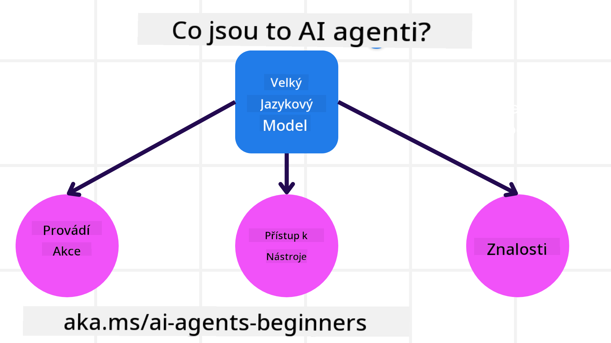
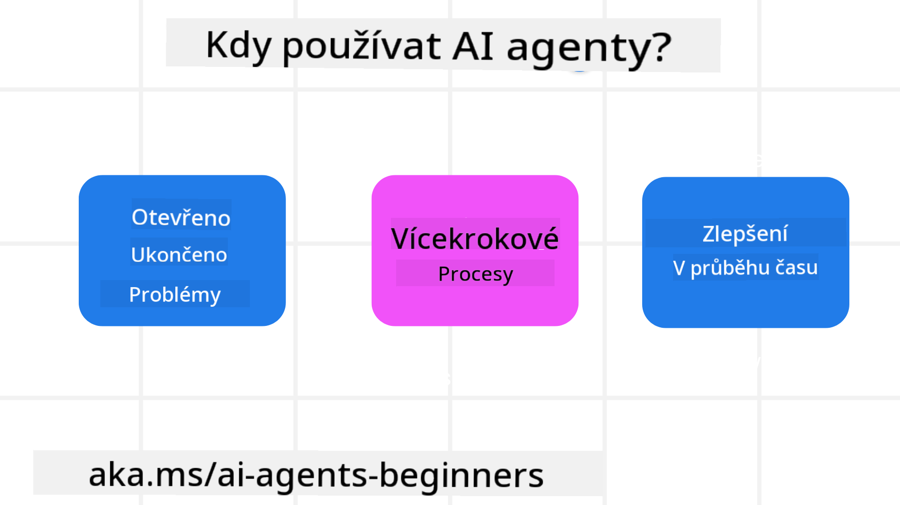

<!--
CO_OP_TRANSLATOR_METADATA:
{
  "original_hash": "d84943abc8f001ad4670418d32c2d899",
  "translation_date": "2025-07-12T08:11:24+00:00",
  "source_file": "01-intro-to-ai-agents/README.md",
  "language_code": "cs"
}
-->
se setkat s ostatními studenty a tvůrci AI agentů a položit jakékoli otázky týkající se tohoto kurzu.

Pro zahájení tohoto kurzu začneme lepším pochopením toho, co jsou AI agenti a jak je můžeme využít v aplikacích a pracovních postupech, které vytváříme.

## Úvod

Tato lekce pokrývá:

- Co jsou AI agenti a jaké jsou různé typy agentů?
- Pro jaké případy použití jsou AI agenti nejvhodnější a jak nám mohou pomoci?
- Jaké jsou základní stavební kameny při navrhování agentních řešení?

## Cíle učení
Po dokončení této lekce byste měli být schopni:

- Pochopit koncepty AI agentů a jak se liší od jiných AI řešení.
- Efektivně aplikovat AI agenty.
- Produktivně navrhovat agentní řešení jak pro uživatele, tak pro zákazníky.

## Definice AI agentů a typy AI agentů

### Co jsou AI agenti?

AI agenti jsou **systémy**, které umožňují **velkým jazykovým modelům (LLM)** **provádět akce** tím, že rozšiřují jejich schopnosti tím, že dávají LLM přístup k **nástrojům** a **znalostem**.

Pojďme si tuto definici rozdělit na menší části:

- **Systém** – Je důležité myslet na agenty ne jako na jedinou součást, ale jako na systém mnoha komponent. Na základní úrovni jsou komponenty AI agenta:
  - **Prostředí** – Definovaný prostor, ve kterém AI agent operuje. Například u AI agenta pro rezervaci cest by prostředím mohl být rezervační systém, který agent používá k plnění úkolů.
  - **Senzory** – Prostředí obsahuje informace a poskytuje zpětnou vazbu. AI agenti používají senzory k získávání a interpretaci těchto informací o aktuálním stavu prostředí. V příkladu cestovního agenta může rezervační systém poskytovat informace jako dostupnost hotelů nebo ceny letenek.
  - **Aktuátory** – Jakmile AI agent obdrží aktuální stav prostředí, určí, jakou akci provést, aby změnil prostředí. U cestovního agenta to může být rezervace dostupného pokoje pro uživatele.

**Velké jazykové modely** – Koncept agentů existoval ještě před vznikem LLM. Výhodou budování AI agentů s LLM je jejich schopnost interpretovat lidský jazyk a data. Tato schopnost umožňuje LLM interpretovat informace z prostředí a definovat plán, jak prostředí změnit.

**Provádění akcí** – Mimo systémy AI agentů jsou LLM omezeny na situace, kdy je akce generování obsahu nebo informací na základě uživatelského požadavku. V rámci systémů AI agentů mohou LLM plnit úkoly tím, že interpretují požadavek uživatele a používají nástroje dostupné v jejich prostředí.

**Přístup k nástrojům** – K jakým nástrojům má LLM přístup, je určeno 1) prostředím, ve kterém operuje, a 2) vývojářem AI agenta. V našem příkladu cestovního agenta jsou nástroje omezeny operacemi dostupnými v rezervačním systému, a/nebo vývojář může omezit přístup agenta k nástrojům pouze na lety.

**Paměť + znalosti** – Paměť může být krátkodobá v kontextu konverzace mezi uživatelem a agentem. Dlouhodobě, mimo informace poskytované prostředím, mohou AI agenti také získávat znalosti z jiných systémů, služeb, nástrojů a dokonce i od jiných agentů. V příkladu cestovního agenta by to mohly být informace o preferencích uživatele uložené v databázi zákazníků.

### Různé typy agentů

Nyní, když máme obecnou definici AI agentů, podívejme se na některé konkrétní typy agentů a jak by byly aplikovány na AI agenta pro rezervaci cest.

| **Typ agenta**                | **Popis**                                                                                                                           | **Příklad**                                                                                                                                                                                                                   |
| ----------------------------- | ----------------------------------------------------------------------------------------------------------------------------------- | ----------------------------------------------------------------------------------------------------------------------------------------------------------------------------------------------------------------------------- |
| **Jednoduchý reflexní agent** | Provádí okamžité akce na základě předdefinovaných pravidel.                                                                         | Cestovní agent interpretuje kontext e-mailu a přeposílá stížnosti na cestování zákaznickému servisu.                                                                                                                          |
| **Modelově založený reflexní agent** | Provádí akce na základě modelu světa a změn v tomto modelu.                                                                       | Cestovní agent upřednostňuje trasy s výraznými změnami cen na základě přístupu k historickým cenovým datům.                                                                                                                  |
| **Agent založený na cílech**  | Vytváří plány k dosažení konkrétních cílů tím, že interpretuje cíl a určuje akce k jeho dosažení.                                    | Cestovní agent rezervuje cestu tím, že určí potřebné cestovní uspořádání (auto, veřejná doprava, lety) z aktuálního místa do cíle.                                                                                            |
| **Agent založený na užitku**  | Zvažuje preference a váží kompromisy číselně, aby určil, jak dosáhnout cílů.                                                        | Cestovní agent maximalizuje užitek tím, že váží pohodlí proti nákladům při rezervaci cesty.                                                                                                                                  |
| **Učící se agent**            | Zlepšuje se v průběhu času na základě zpětné vazby a přizpůsobuje své akce.                                                         | Cestovní agent se zlepšuje pomocí zpětné vazby zákazníků z dotazníků po cestě a upravuje budoucí rezervace.                                                                                                                  |
| **Hierarchický agent**        | Obsahuje více agentů v hierarchickém systému, kde vyšší úroveň rozděluje úkoly na dílčí úkoly pro nižší úrovně.                     | Cestovní agent zruší cestu tím, že rozdělí úkol na dílčí úkoly (například zrušení konkrétních rezervací) a nižší úrovně agentů je dokončí a hlásí zpět vyššímu agentovi.                                                        |
| **Systémy více agentů (MAS)** | Agenti plní úkoly nezávisle, buď kooperativně, nebo soutěživě.                                                                      | Kooperativní: Více agentů rezervuje specifické cestovní služby jako hotely, lety a zábavu. Soutěživé: Více agentů spravuje a soutěží o sdílený kalendář rezervací hotelu, aby zákazníky ubytovali.                              |

## Kdy používat AI agenty

V předchozí části jsme použili případ použití cestovního agenta k vysvětlení, jak lze různé typy agentů použít v různých scénářích rezervace cest. Tento příklad budeme používat i nadále v celém kurzu.

Podívejme se na typy případů použití, pro které jsou AI agenti nejvhodnější:

- **Otevřené problémy** – umožnit LLM určit potřebné kroky k dokončení úkolu, protože to nelze vždy pevně zakódovat do pracovního postupu.
- **Vícekrokové procesy** – úkoly, které vyžadují určitou složitost, kdy AI agent potřebuje používat nástroje nebo informace přes více kroků místo jednorázového získání.
- **Zlepšování v čase** – úkoly, kde se agent může zlepšovat v průběhu času na základě zpětné vazby z prostředí nebo od uživatelů, aby poskytoval lepší užitek.

Další úvahy o používání AI agentů pokrýváme v lekci Budování důvěryhodných AI agentů.

## Základy agentních řešení

### Vývoj agentů

Prvním krokem při navrhování systému AI agenta je definovat nástroje, akce a chování. V tomto kurzu se zaměřujeme na použití **Azure AI Agent Service** k definování našich agentů. Nabízí funkce jako:

- Výběr otevřených modelů jako OpenAI, Mistral a Llama
- Použití licencovaných dat od poskytovatelů jako Tripadvisor
- Použití standardizovaných nástrojů OpenAPI 3.0

### Agentní vzory

Komunikace s LLM probíhá pomocí promptů. Vzhledem k částečně autonomní povaze AI agentů není vždy možné nebo nutné ručně znovu vyvolávat prompt LLM po změně v prostředí. Používáme **agentní vzory**, které nám umožňují promptovat LLM přes více kroků škálovatelnějším způsobem.

Tento kurz je rozdělen podle některých aktuálně populárních agentních vzorů.

### Agentní frameworky

Agentní frameworky umožňují vývojářům implementovat agentní vzory pomocí kódu. Tyto frameworky nabízejí šablony, pluginy a nástroje pro lepší spolupráci AI agentů. Tyto výhody poskytují lepší možnosti sledovatelnosti a řešení problémů v systémech AI agentů.

V tomto kurzu prozkoumáme výzkumně orientovaný framework AutoGen a produkčně připravený framework Agent od Semantic Kernel.

## Předchozí lekce

[Course Setup](../00-course-setup/README.md)

## Následující lekce

[Exploring Agentic Frameworks](../02-explore-agentic-frameworks/README.md)

**Prohlášení o vyloučení odpovědnosti**:  
Tento dokument byl přeložen pomocí AI překladatelské služby [Co-op Translator](https://github.com/Azure/co-op-translator). I když usilujeme o přesnost, mějte prosím na paměti, že automatizované překlady mohou obsahovat chyby nebo nepřesnosti. Původní dokument v jeho mateřském jazyce by měl být považován za autoritativní zdroj. Pro důležité informace se doporučuje profesionální lidský překlad. Nejsme odpovědní za jakékoliv nedorozumění nebo nesprávné výklady vyplývající z použití tohoto překladu.