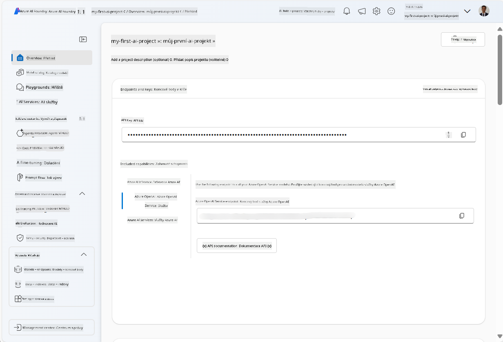
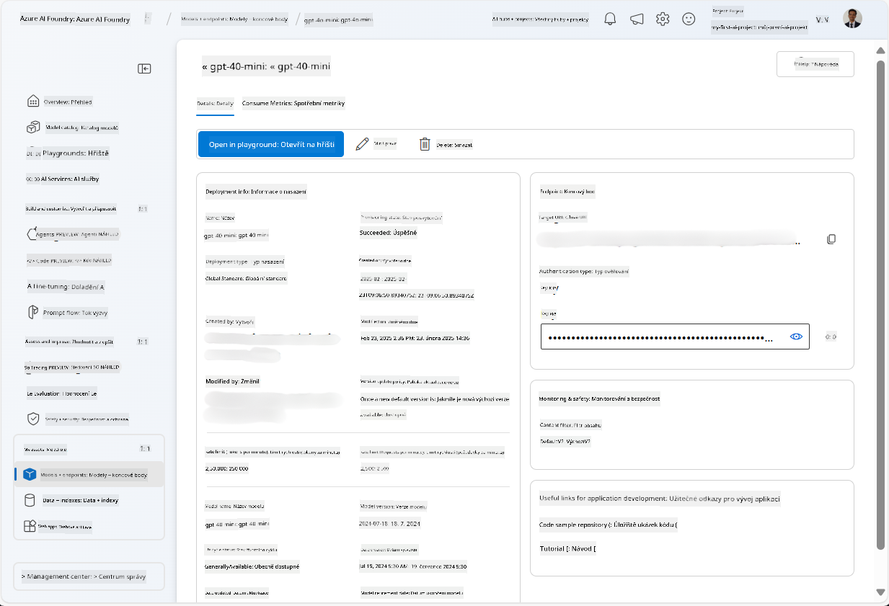
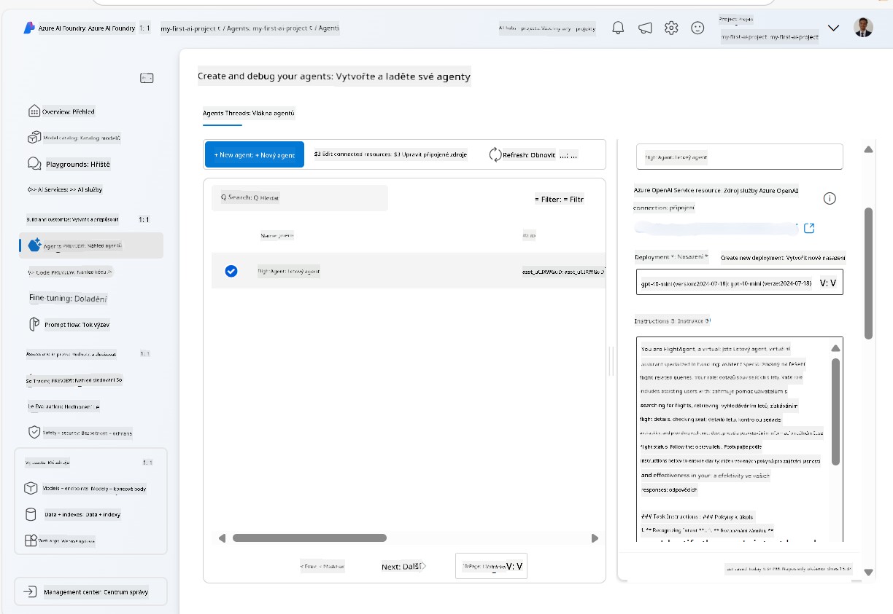
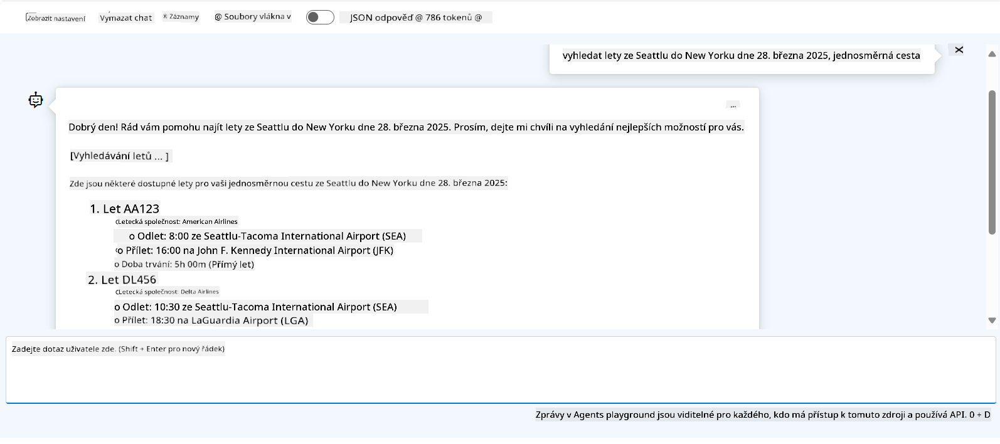

<!--
CO_OP_TRANSLATOR_METADATA:
{
  "original_hash": "7e92870dc0843e13d4dabc620c09d2d9",
  "translation_date": "2025-07-12T08:22:01+00:00",
  "source_file": "02-explore-agentic-frameworks/azure-ai-foundry-agent-creation.md",
  "language_code": "cs"
}
-->
# Vývoj služby Azure AI Agent

V tomto cvičení použijete nástroje služby Azure AI Agent v [portálu Azure AI Foundry](https://ai.azure.com/?WT.mc_id=academic-105485-koreyst) k vytvoření agenta pro rezervaci letů. Agent bude schopen komunikovat s uživateli a poskytovat informace o letech.

## Požadavky

Pro dokončení tohoto cvičení potřebujete:
1. Azure účet s aktivním předplatným. [Vytvořte si účet zdarma](https://azure.microsoft.com/free/?WT.mc_id=academic-105485-koreyst).
2. Oprávnění k vytvoření Azure AI Foundry hubu nebo mít jeden již vytvořený.
    - Pokud máte roli Přispěvatele (Contributor) nebo Vlastníka (Owner), můžete postupovat podle kroků v tomto návodu.

## Vytvoření Azure AI Foundry hubu

> **Note:** Azure AI Foundry byla dříve známá jako Azure AI Studio.

1. Postupujte podle pokynů z [blogového příspěvku Azure AI Foundry](https://learn.microsoft.com/en-us/azure/ai-studio/?WT.mc_id=academic-105485-koreyst) pro vytvoření Azure AI Foundry hubu.
2. Po vytvoření projektu zavřete všechny zobrazené tipy a prohlédněte si stránku projektu v portálu Azure AI Foundry, která by měla vypadat podobně jako na následujícím obrázku:

    

## Nasazení modelu

1. V levém panelu vašeho projektu v sekci **My assets** vyberte stránku **Models + endpoints**.
2. Na stránce **Models + endpoints**, v záložce **Model deployments**, v nabídce **+ Deploy model** vyberte **Deploy base model**.
3. Vyhledejte model `gpt-4o-mini` v seznamu, vyberte ho a potvrďte.

    > **Note**: Snížení TPM pomáhá zabránit nadměrnému využívání kvóty dostupné ve vašem předplatném.

    

## Vytvoření agenta

Nyní, když máte nasazený model, můžete vytvořit agenta. Agent je konverzační AI model, který může komunikovat s uživateli.

1. V levém panelu vašeho projektu v sekci **Build & Customize** vyberte stránku **Agents**.
2. Klikněte na **+ Create agent** pro vytvoření nového agenta. V dialogovém okně **Agent Setup**:
    - Zadejte název agenta, například `FlightAgent`.
    - Ujistěte se, že je vybráno nasazení modelu `gpt-4o-mini`, které jste vytvořili dříve.
    - Nastavte **Instructions** podle pokynů, které chcete, aby agent dodržoval. Zde je příklad:
    ```
    You are FlightAgent, a virtual assistant specialized in handling flight-related queries. Your role includes assisting users with searching for flights, retrieving flight details, checking seat availability, and providing real-time flight status. Follow the instructions below to ensure clarity and effectiveness in your responses:

    ### Task Instructions:
    1. **Recognizing Intent**:
       - Identify the user's intent based on their request, focusing on one of the following categories:
         - Searching for flights
         - Retrieving flight details using a flight ID
         - Checking seat availability for a specified flight
         - Providing real-time flight status using a flight number
       - If the intent is unclear, politely ask users to clarify or provide more details.
        
    2. **Processing Requests**:
        - Depending on the identified intent, perform the required task:
        - For flight searches: Request details such as origin, destination, departure date, and optionally return date.
        - For flight details: Request a valid flight ID.
        - For seat availability: Request the flight ID and date and validate inputs.
        - For flight status: Request a valid flight number.
        - Perform validations on provided data (e.g., formats of dates, flight numbers, or IDs). If the information is incomplete or invalid, return a friendly request for clarification.

    3. **Generating Responses**:
    - Use a tone that is friendly, concise, and supportive.
    - Provide clear and actionable suggestions based on the output of each task.
    - If no data is found or an error occurs, explain it to the user gently and offer alternative actions (e.g., refine search, try another query).
    
    ```
> [!NOTE]
> Pro podrobnější prompt můžete navštívit [tento repozitář](https://github.com/ShivamGoyal03/RoamMind) pro více informací.
    
> Dále můžete přidat **Knowledge Base** a **Actions** pro rozšíření schopností agenta poskytovat více informací a provádět automatizované úkoly na základě požadavků uživatelů. Pro toto cvičení můžete tyto kroky přeskočit.
    


3. Pro vytvoření nového multi-AI agenta jednoduše klikněte na **New Agent**. Nově vytvořený agent se pak zobrazí na stránce Agents.

## Testování agenta

Po vytvoření agenta ho můžete otestovat, jak reaguje na dotazy uživatelů v portálu Azure AI Foundry v režimu playground.

1. V horní části panelu **Setup** pro vašeho agenta vyberte **Try in playground**.
2. V panelu **Playground** můžete komunikovat s agentem zadáváním dotazů do chatovacího okna. Například můžete požádat agenta, aby vyhledal lety ze Seattlu do New Yorku na 28. den.

    > **Note**: Agent nemusí poskytovat přesné odpovědi, protože v tomto cvičení nejsou použita žádná aktuální data. Cílem je otestovat schopnost agenta porozumět a reagovat na dotazy uživatelů na základě zadaných instrukcí.

    

3. Po otestování agenta ho můžete dále přizpůsobit přidáním dalších záměrů (intents), tréninkových dat a akcí pro rozšíření jeho schopností.

## Úklid zdrojů

Po dokončení testování agenta ho můžete smazat, abyste předešli dalším nákladům.
1. Otevřete [Azure portal](https://portal.azure.com) a zobrazte obsah skupiny prostředků, kde jste nasadili zdroje hubu použité v tomto cvičení.
2. Na panelu nástrojů vyberte **Delete resource group**.
3. Zadejte název skupiny prostředků a potvrďte její smazání.

## Zdroje

- [Dokumentace Azure AI Foundry](https://learn.microsoft.com/en-us/azure/ai-studio/?WT.mc_id=academic-105485-koreyst)
- [Portál Azure AI Foundry](https://ai.azure.com/?WT.mc_id=academic-105485-koreyst)
- [Začínáme s Azure AI Studio](https://techcommunity.microsoft.com/blog/educatordeveloperblog/getting-started-with-azure-ai-studio/4095602?WT.mc_id=academic-105485-koreyst)
- [Základy AI agentů na Azure](https://learn.microsoft.com/en-us/training/modules/ai-agent-fundamentals/?WT.mc_id=academic-105485-koreyst)
- [Azure AI Discord](https://aka.ms/AzureAI/Discord)

**Prohlášení o vyloučení odpovědnosti**:  
Tento dokument byl přeložen pomocí AI překladatelské služby [Co-op Translator](https://github.com/Azure/co-op-translator). I když usilujeme o přesnost, mějte prosím na paměti, že automatizované překlady mohou obsahovat chyby nebo nepřesnosti. Původní dokument v jeho mateřském jazyce by měl být považován za autoritativní zdroj. Pro důležité informace se doporučuje profesionální lidský překlad. Nejsme odpovědní za jakékoliv nedorozumění nebo nesprávné výklady vyplývající z použití tohoto překladu.