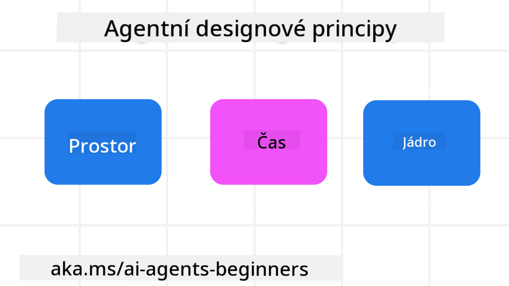

<!--
CO_OP_TRANSLATOR_METADATA:
{
  "original_hash": "4c46e4ff9e349c521e2b0b17f51afa64",
  "translation_date": "2025-08-29T20:29:35+00:00",
  "source_file": "03-agentic-design-patterns/README.md",
  "language_code": "cs"
}
-->

> _(Klikněte na obrázek výše pro zhlédnutí videa k této lekci)_
# Principy návrhu agentických AI systémů

## Úvod

Existuje mnoho způsobů, jak přistupovat k budování agentických AI systémů. Vzhledem k tomu, že nejednoznačnost je v návrhu generativní AI spíše vlastností než chybou, je pro inženýry někdy obtížné určit, kde vůbec začít. Vytvořili jsme sadu principů návrhu zaměřených na uživatele, které vývojářům umožní vytvářet systémy orientované na zákazníka a řešit jejich obchodní potřeby. Tyto principy návrhu nejsou předepsanou architekturou, ale spíše výchozím bodem pro týmy, které definují a budují agentické zkušenosti.

Obecně by agenti měli:

- Rozšiřovat a škálovat lidské schopnosti (např. brainstorming, řešení problémů, automatizace).
- Vyplňovat mezery ve znalostech (např. rychlé seznámení s obory, překlady).
- Usnadňovat a podporovat spolupráci způsoby, které odpovídají našim preferencím při práci s ostatními.
- Pomáhat nám stát se lepší verzí sebe sama (např. jako životní kouč nebo organizátor úkolů, pomáhat nám učit se emoční regulaci a dovednosti mindfulness, budovat odolnost atd.).

## Tato lekce pokryje

- Co jsou principy návrhu agentických systémů
- Jaké jsou pokyny pro implementaci těchto principů
- Příklady použití těchto principů návrhu

## Cíle učení

Po dokončení této lekce budete schopni:

1. Vysvětlit, co jsou principy návrhu agentických systémů
2. Vysvětlit pokyny pro použití těchto principů
3. Pochopit, jak vytvořit agenta pomocí těchto principů návrhu

## Principy návrhu agentických systémů

### Agent (Prostor)

Toto je prostředí, ve kterém agent operuje. Tyto principy informují o tom, jak navrhovat agenty pro zapojení do fyzických a digitálních světů.

- **Spojovat, ne nahrazovat** – pomáhat lidem spojovat se s ostatními, událostmi a využitelnými znalostmi, aby byla umožněna spolupráce a propojení.
- Agenti pomáhají propojit události, znalosti a lidi.
- Agenti přibližují lidi k sobě. Nejsou navrženi tak, aby lidi nahrazovali nebo snižovali jejich hodnotu.
- **Snadno dostupní, ale občas neviditelní** – agent většinou funguje na pozadí a upozorňuje nás pouze tehdy, když je to relevantní a vhodné.
  - Agent je snadno objevitelný a přístupný pro autorizované uživatele na jakémkoli zařízení nebo platformě.
  - Agent podporuje multimodální vstupy a výstupy (zvuk, hlas, text atd.).
  - Agent může plynule přecházet mezi popředím a pozadím; mezi proaktivním a reaktivním přístupem v závislosti na potřebách uživatele.
  - Agent může fungovat v neviditelné podobě, ale jeho procesy na pozadí a spolupráce s jinými agenty jsou pro uživatele transparentní a kontrolovatelné.

### Agent (Čas)

Toto je způsob, jakým agent funguje v čase. Tyto principy informují o tom, jak navrhovat agenty, kteří interagují napříč minulostí, přítomností a budoucností.

- **Minulost**: Reflexe historie zahrnující stav i kontext.
  - Agent poskytuje relevantnější výsledky na základě analýzy bohatších historických dat, nejen událostí, lidí nebo stavů.
  - Agent vytváří spojení z minulých událostí a aktivně reflektuje paměť, aby se zapojil do aktuálních situací.
- **Přítomnost**: Pobízení spíše než upozorňování.
  - Agent ztělesňuje komplexní přístup k interakci s lidmi. Když dojde k události, agent jde nad rámec statického upozornění nebo jiné formality. Agent může zjednodušit procesy nebo dynamicky generovat podněty, které nasměrují pozornost uživatele ve správný okamžik.
  - Agent poskytuje informace na základě kontextuálního prostředí, sociálních a kulturních změn a přizpůsobené záměru uživatele.
  - Interakce s agentem může být postupná, vyvíjející se v čase, aby dlouhodobě posilovala uživatele.
- **Budoucnost**: Přizpůsobování a vývoj.
  - Agent se přizpůsobuje různým zařízením, platformám a modalitám.
  - Agent se přizpůsobuje chování uživatele, jeho potřebám v oblasti přístupnosti a je volně přizpůsobitelný.
  - Agent je formován a vyvíjí se prostřednictvím kontinuální interakce s uživatelem.

### Agent (Jádro)

Toto jsou klíčové prvky v jádru návrhu agenta.

- **Přijmout nejistotu, ale budovat důvěru**.
  - Určitá míra nejistoty agenta je očekávaná. Nejistota je klíčovým prvkem návrhu agenta.
  - Důvěra a transparentnost jsou základní vrstvy návrhu agenta.
  - Lidé mají kontrolu nad tím, kdy je agent zapnutý/vypnutý, a stav agenta je vždy jasně viditelný.

## Pokyny pro implementaci těchto principů

Při používání výše uvedených principů návrhu dodržujte následující pokyny:

1. **Transparentnost**: Informujte uživatele, že je zapojena AI, jak funguje (včetně minulých akcí) a jak poskytnout zpětnou vazbu a upravit systém.
2. **Kontrola**: Umožněte uživateli přizpůsobit, specifikovat preference a personalizovat systém a jeho atributy (včetně možnosti zapomenutí).
3. **Konzistence**: Usilujte o konzistentní, multimodální zkušenosti napříč zařízeními a koncovými body. Používejte známé prvky UI/UX, kde je to možné (např. ikona mikrofonu pro hlasovou interakci), a co nejvíce snižte kognitivní zátěž uživatele (např. snažte se o stručné odpovědi, vizuální pomůcky a obsah „Zjistit více“).

## Jak navrhnout cestovního agenta pomocí těchto principů a pokynů

Představte si, že navrhujete cestovního agenta. Zde je, jak byste mohli přemýšlet o použití principů návrhu a pokynů:

1. **Transparentnost** – Informujte uživatele, že cestovní agent je agentem s podporou AI. Poskytněte základní instrukce, jak začít (např. uvítací zpráva, ukázkové výzvy). Jasně to zdokumentujte na produktové stránce. Zobrazte seznam výzev, které uživatel v minulosti zadal. Uveďte, jak poskytnout zpětnou vazbu (palec nahoru a dolů, tlačítko „Odeslat zpětnou vazbu“ atd.). Jasně sdělte, zda má agent nějaká omezení použití nebo témat.
2. **Kontrola** – Ujistěte se, že je jasné, jak může uživatel agenta upravit po jeho vytvoření, například pomocí systémové výzvy. Umožněte uživateli zvolit, jak podrobný má být agent, jeho styl psaní a jakákoli omezení, o čem by agent neměl mluvit. Umožněte uživateli zobrazit a smazat jakékoli přidružené soubory nebo data, výzvy a minulé konverzace.
3. **Konzistence** – Ujistěte se, že ikony pro sdílení výzvy, přidání souboru nebo fotografie a označení někoho nebo něčeho jsou standardní a rozpoznatelné. Použijte ikonu kancelářské sponky pro označení nahrávání/sdílení souborů s agentem a ikonu obrázku pro označení nahrávání grafiky.

### Máte další otázky ohledně návrhových vzorů agentických AI systémů?

Připojte se na [Azure AI Foundry Discord](https://aka.ms/ai-agents/discord), kde se můžete setkat s dalšími studenty, zúčastnit se konzultačních hodin a získat odpovědi na své otázky ohledně AI agentů.

## Další zdroje

## Předchozí lekce

[Zkoumání agentických rámců](../02-explore-agentic-frameworks/README.md)

## Další lekce

[Vzor návrhu pro použití nástrojů](../04-tool-use/README.md)

---

**Prohlášení**:  
Tento dokument byl přeložen pomocí služby pro automatický překlad [Co-op Translator](https://github.com/Azure/co-op-translator). Ačkoli se snažíme o přesnost, mějte na paměti, že automatické překlady mohou obsahovat chyby nebo nepřesnosti. Původní dokument v jeho původním jazyce by měl být považován za autoritativní zdroj. Pro důležité informace doporučujeme profesionální lidský překlad. Neodpovídáme za žádná nedorozumění nebo nesprávné interpretace vyplývající z použití tohoto překladu.