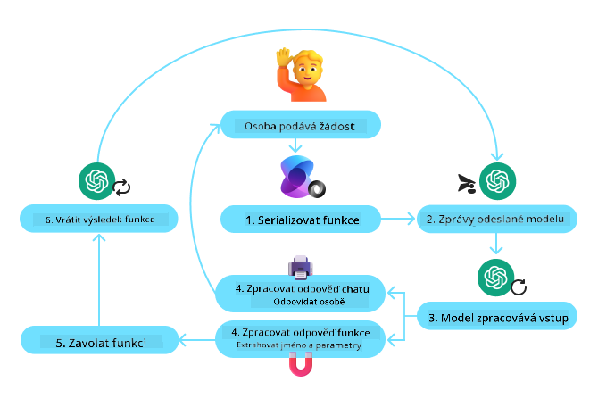
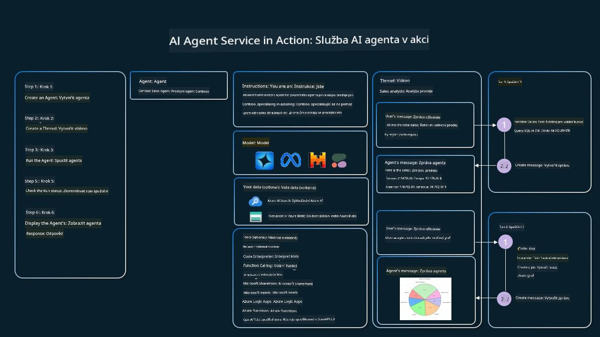

<!--
CO_OP_TRANSLATOR_METADATA:
{
  "original_hash": "88258b03f2893aa2e69eb8fb24baabbc",
  "translation_date": "2025-07-12T09:42:52+00:00",
  "source_file": "04-tool-use/README.md",
  "language_code": "cs"
}
-->
[](https://youtu.be/vieRiPRx-gI?si=cEZ8ApnT6Sus9rhn)

> _(Klikněte na obrázek výše pro zhlédnutí videa této lekce)_

# Návrhový vzor používání nástrojů

Nástroje jsou zajímavé, protože umožňují AI agentům mít širší škálu schopností. Místo toho, aby agent měl omezený soubor akcí, které může provádět, přidáním nástroje může agent nyní vykonávat širokou škálu činností. V této kapitole se podíváme na návrhový vzor používání nástrojů, který popisuje, jak AI agenti mohou využívat specifické nástroje k dosažení svých cílů.

## Úvod

V této lekci se pokusíme odpovědět na následující otázky:

- Co je návrhový vzor používání nástrojů?
- Pro jaké případy použití je tento vzor vhodný?
- Jaké prvky/stavební bloky jsou potřeba k implementaci tohoto vzoru?
- Jaká jsou speciální opatření při použití návrhového vzoru používání nástrojů pro vytváření důvěryhodných AI agentů?

## Cíle učení

Po dokončení této lekce budete schopni:

- Definovat návrhový vzor používání nástrojů a jeho účel.
- Identifikovat případy použití, kde je tento vzor aplikovatelný.
- Pochopit klíčové prvky potřebné k implementaci vzoru.
- Rozpoznat aspekty zajišťující důvěryhodnost AI agentů využívajících tento vzor.

## Co je návrhový vzor používání nástrojů?

**Návrhový vzor používání nástrojů** se zaměřuje na to, aby LLM měly schopnost interagovat s externími nástroji k dosažení konkrétních cílů. Nástroje jsou kódy, které může agent spustit k provedení akcí. Nástroj může být jednoduchá funkce, například kalkulačka, nebo volání API třetí strany, jako je vyhledávání cen akcií nebo předpověď počasí. V kontextu AI agentů jsou nástroje navrženy tak, aby je agenti spouštěli jako reakci na **funkční volání generovaná modelem**.

## Pro jaké případy použití lze tento vzor aplikovat?

AI agenti mohou využívat nástroje k dokončení složitých úkolů, získávání informací nebo rozhodování. Návrhový vzor používání nástrojů se často používá v situacích vyžadujících dynamickou interakci s externími systémy, jako jsou databáze, webové služby nebo interprety kódu. Tato schopnost je užitečná pro řadu různých případů použití, včetně:

- **Dynamické získávání informací:** Agenti mohou dotazovat externí API nebo databáze pro získání aktuálních dat (např. dotazování SQLite databáze pro analýzu dat, získávání cen akcií nebo informací o počasí).
- **Spouštění a interpretace kódu:** Agenti mohou spouštět kód nebo skripty k řešení matematických problémů, generování reportů nebo provádění simulací.
- **Automatizace pracovních postupů:** Automatizace opakujících se nebo vícestupňových procesů integrací nástrojů jako plánovače úkolů, e-mailových služeb nebo datových pipeline.
- **Zákaznická podpora:** Agenti mohou komunikovat se CRM systémy, ticketovacími platformami nebo znalostními databázemi k řešení uživatelských dotazů.
- **Generování a úprava obsahu:** Agenti mohou využívat nástroje jako kontrola gramatiky, shrnovače textu nebo hodnotitele bezpečnosti obsahu k podpoře tvorby obsahu.

## Jaké prvky/stavební bloky jsou potřeba k implementaci návrhového vzoru používání nástrojů?

Tyto stavební bloky umožňují AI agentovi vykonávat širokou škálu úkolů. Podívejme se na klíčové prvky potřebné k implementaci návrhového vzoru používání nástrojů:

- **Schémata funkcí/nástrojů**: Podrobné definice dostupných nástrojů, včetně názvu funkce, účelu, požadovaných parametrů a očekávaných výstupů. Tato schémata umožňují LLM pochopit, jaké nástroje jsou k dispozici a jak sestavit platné požadavky.

- **Logika spouštění funkcí**: Řídí, jak a kdy jsou nástroje volány na základě uživatelského záměru a kontextu konverzace. Může zahrnovat plánovací moduly, směrovací mechanismy nebo podmíněné toky, které dynamicky určují použití nástrojů.

- **Systém zpracování zpráv**: Komponenty, které spravují tok konverzace mezi uživatelskými vstupy, odpověďmi LLM, voláními nástrojů a jejich výstupy.

- **Rámec integrace nástrojů**: Infrastruktura, která propojuje agenta s různými nástroji, ať už jde o jednoduché funkce nebo složité externí služby.

- **Zpracování chyb a validace**: Mechanismy pro řešení selhání při spouštění nástrojů, ověřování parametrů a správu neočekávaných odpovědí.

- **Správa stavu**: Sleduje kontext konverzace, předchozí interakce s nástroji a perzistentní data, aby zajistila konzistenci během vícekrokových interakcí.

Nyní se podívejme podrobněji na volání funkcí/nástrojů.

### Volání funkcí/nástrojů

Volání funkcí je hlavní způsob, jak umožňujeme velkým jazykovým modelům (LLM) interagovat s nástroji. Často uvidíte, že „funkce“ a „nástroj“ jsou používány zaměnitelně, protože „funkce“ (bloky znovupoužitelného kódu) jsou nástroje, které agenti používají k vykonání úkolů. Aby bylo možné spustit kód funkce, musí LLM porovnat uživatelův požadavek s popisem funkcí. K tomu je LLM zasláno schéma obsahující popisy všech dostupných funkcí. LLM pak vybere nejvhodnější funkci pro daný úkol a vrátí její název a argumenty. Vybraná funkce je spuštěna, její odpověď je zaslána zpět LLM, které použije informace k odpovědi na uživatelův požadavek.

Pro vývojáře, kteří chtějí implementovat volání funkcí pro agenty, budete potřebovat:

1. LLM model podporující volání funkcí
2. Schéma obsahující popisy funkcí
3. Kód pro každou popsanou funkci

Použijme příklad získání aktuálního času ve městě:

1. **Inicializujte LLM, který podporuje volání funkcí:**

    Ne všechny modely volání funkcí podporují, proto je důležité ověřit, že váš LLM tuto funkci má. <a href="https://learn.microsoft.com/azure/ai-services/openai/how-to/function-calling" target="_blank">Azure OpenAI</a> volání funkcí podporuje. Můžeme začít inicializací klienta Azure OpenAI.

    ```python
    # Initialize the Azure OpenAI client
    client = AzureOpenAI(
        azure_endpoint = os.getenv("AZURE_OPENAI_ENDPOINT"), 
        api_key=os.getenv("AZURE_OPENAI_API_KEY"),  
        api_version="2024-05-01-preview"
    )
    ```

1. **Vytvořte schéma funkce:**

    Dále definujeme JSON schéma, které obsahuje název funkce, popis toho, co funkce dělá, a názvy a popisy parametrů funkce. Toto schéma pak předáme klientovi vytvořenému dříve spolu s uživatelovým požadavkem na zjištění času v San Franciscu. Důležité je poznamenat, že je vráceno **volání nástroje**, **nikoli** konečná odpověď na otázku. Jak bylo zmíněno, LLM vrací název funkce, kterou vybral pro úkol, a argumenty, které jí budou předány.

    ```python
    # Function description for the model to read
    tools = [
        {
            "type": "function",
            "function": {
                "name": "get_current_time",
                "description": "Get the current time in a given location",
                "parameters": {
                    "type": "object",
                    "properties": {
                        "location": {
                            "type": "string",
                            "description": "The city name, e.g. San Francisco",
                        },
                    },
                    "required": ["location"],
                },
            }
        }
    ]
    ```
   
    ```python
  
    # Initial user message
    messages = [{"role": "user", "content": "What's the current time in San Francisco"}] 
  
    # First API call: Ask the model to use the function
      response = client.chat.completions.create(
          model=deployment_name,
          messages=messages,
          tools=tools,
          tool_choice="auto",
      )
  
      # Process the model's response
      response_message = response.choices[0].message
      messages.append(response_message)
  
      print("Model's response:")  

      print(response_message)
  
    ```

    ```bash
    Model's response:
    ChatCompletionMessage(content=None, role='assistant', function_call=None, tool_calls=[ChatCompletionMessageToolCall(id='call_pOsKdUlqvdyttYB67MOj434b', function=Function(arguments='{"location":"San Francisco"}', name='get_current_time'), type='function')])
    ```
  
1. **Kód funkce potřebný k vykonání úkolu:**

    Jakmile LLM vybere, která funkce má být spuštěna, je potřeba implementovat a spustit kód, který úkol vykoná. Můžeme implementovat kód pro získání aktuálního času v Pythonu. Také budeme potřebovat napsat kód pro extrakci názvu a argumentů z response_message, abychom získali konečný výsledek.

    ```python
      def get_current_time(location):
        """Get the current time for a given location"""
        print(f"get_current_time called with location: {location}")  
        location_lower = location.lower()
        
        for key, timezone in TIMEZONE_DATA.items():
            if key in location_lower:
                print(f"Timezone found for {key}")  
                current_time = datetime.now(ZoneInfo(timezone)).strftime("%I:%M %p")
                return json.dumps({
                    "location": location,
                    "current_time": current_time
                })
      
        print(f"No timezone data found for {location_lower}")  
        return json.dumps({"location": location, "current_time": "unknown"})
    ```

    ```python
     # Handle function calls
      if response_message.tool_calls:
          for tool_call in response_message.tool_calls:
              if tool_call.function.name == "get_current_time":
     
                  function_args = json.loads(tool_call.function.arguments)
     
                  time_response = get_current_time(
                      location=function_args.get("location")
                  )
     
                  messages.append({
                      "tool_call_id": tool_call.id,
                      "role": "tool",
                      "name": "get_current_time",
                      "content": time_response,
                  })
      else:
          print("No tool calls were made by the model.")  
  
      # Second API call: Get the final response from the model
      final_response = client.chat.completions.create(
          model=deployment_name,
          messages=messages,
      )
  
      return final_response.choices[0].message.content
     ```

    ```bash
      get_current_time called with location: San Francisco
      Timezone found for san francisco
      The current time in San Francisco is 09:24 AM.
     ```

Volání funkcí je jádrem většiny, ne-li všech, návrhových vzorů používání nástrojů agentů, avšak jeho implementace od nuly může být někdy náročná. Jak jsme se naučili v [Lekci 2](../../../02-explore-agentic-frameworks), agentní frameworky nám poskytují předpřipravené stavební bloky pro implementaci používání nástrojů.

## Příklady používání nástrojů s agentními frameworky

Zde je několik příkladů, jak můžete implementovat návrhový vzor používání nástrojů pomocí různých agentních frameworků:

### Semantic Kernel

<a href="https://learn.microsoft.com/azure/ai-services/agents/overview" target="_blank">Semantic Kernel</a> je open-source AI framework pro vývojáře .NET, Python a Java pracující s velkými jazykovými modely (LLM). Usnadňuje proces volání funkcí tím, že automaticky popisuje vaše funkce a jejich parametry modelu pomocí procesu zvaného <a href="https://learn.microsoft.com/semantic-kernel/concepts/ai-services/chat-completion/function-calling/?pivots=programming-language-python#1-serializing-the-functions" target="_blank">serializace</a>. Také zajišťuje obousměrnou komunikaci mezi modelem a vaším kódem. Další výhodou použití agentního frameworku jako Semantic Kernel je, že umožňuje přístup k předpřipraveným nástrojům jako <a href="https://github.com/microsoft/semantic-kernel/blob/main/python/samples/getting_started_with_agents/openai_assistant/step4_assistant_tool_file_search.py" target="_blank">File Search</a> a <a href="https://github.com/microsoft/semantic-kernel/blob/main/python/samples/getting_started_with_agents/openai_assistant/step3_assistant_tool_code_interpreter.py" target="_blank">Code Interpreter</a>.

Následující diagram ilustruje proces volání funkcí se Semantic Kernel:



V Semantic Kernel jsou funkce/nástroje nazývány <a href="https://learn.microsoft.com/semantic-kernel/concepts/plugins/?pivots=programming-language-python" target="_blank">Pluginy</a>. Můžeme převést funkci `get_current_time`, kterou jsme viděli dříve, na plugin tím, že ji převedeme na třídu s touto funkcí uvnitř. Můžeme také importovat dekorátor `kernel_function`, který přijímá popis funkce. Když pak vytvoříte kernel s GetCurrentTimePlugin, kernel automaticky serializuje funkci a její parametry a vytvoří schéma, které se pošle LLM.

```python
from semantic_kernel.functions import kernel_function

class GetCurrentTimePlugin:
    async def __init__(self, location):
        self.location = location

    @kernel_function(
        description="Get the current time for a given location"
    )
    def get_current_time(location: str = ""):
        ...

```

```python 
from semantic_kernel import Kernel

# Create the kernel
kernel = Kernel()

# Create the plugin
get_current_time_plugin = GetCurrentTimePlugin(location)

# Add the plugin to the kernel
kernel.add_plugin(get_current_time_plugin)
```
  
### Azure AI Agent Service

<a href="https://learn.microsoft.com/azure/ai-services/agents/overview" target="_blank">Azure AI Agent Service</a> je novější agentní framework navržený tak, aby umožnil vývojářům bezpečně vytvářet, nasazovat a škálovat vysoce kvalitní a rozšiřitelné AI agenty bez nutnosti spravovat základní výpočetní a úložné zdroje. Je zvláště užitečný pro podnikové aplikace, protože jde o plně spravovanou službu s bezpečností na úrovni podniku.

Ve srovnání s vývojem přímo přes LLM API nabízí Azure AI Agent Service několik výhod, včetně:

- Automatické volání nástrojů – není potřeba parsovat volání nástroje, spouštět nástroj a zpracovávat odpověď; vše se nyní děje na straně serveru
- Bezpečně spravovaná data – místo správy vlastního stavu konverzace můžete spoléhat na vlákna, která uchovávají všechny potřebné informace
- Nástroje připravené k použití – nástroje, které můžete využít k interakci se zdroji dat, jako jsou Bing, Azure AI Search a Azure Functions.

Nástroje dostupné v Azure AI Agent Service lze rozdělit do dvou kategorií:

1. Nástroje pro znalosti:
    - <a href="https://learn.microsoft.com/azure/ai-services/agents/how-to/tools/bing-grounding?tabs=python&pivots=overview" target="_blank">Základní vyhledávání s Bing</a>
    - <a href="https://learn.microsoft.com/azure/ai-services/agents/how-to/tools/file-search?tabs=python&pivots=overview" target="_blank">Vyhledávání souborů</a>
    - <a href="https://learn.microsoft.com/azure/ai-services/agents/how-to/tools/azure-ai-search?tabs=azurecli%2Cpython&pivots=overview-azure-ai-search" target="_blank">Azure AI Search</a>

2. Akční nástroje:
    - <a href="https://learn.microsoft.com/azure/ai-services/agents/how-to/tools/function-calling?tabs=python&pivots=overview" target="_blank">Volání funkcí</a>
    - <a href="https://learn.microsoft.com/azure/ai-services/agents/how-to/tools/code-interpreter?tabs=python&pivots=overview" target="_blank">Code Interpreter</a>
    - <a href="https://learn.microsoft.com/azure/ai-services/agents/how-to/tools/openapi-spec?tabs=python&pivots=overview" target="_blank">Nástroje definované OpenAI</a>
    - <a href="https://learn.microsoft.com/azure/ai-services/agents/how-to/tools/azure-functions?pivots=overview" target="_blank">Azure Functions</a>

Agent Service nám umožňuje používat tyto nástroje společně jako `toolset`. Také využívá `vlákna`, která sledují historii zpráv z konkrétní konverzace.

Představte si, že jste obchodní zástupce ve firmě Contoso. Chcete vyvinout konverzačního agenta, který dokáže odpovídat na otázky týkající se vašich prodejních dat.

Následující obrázek ilustruje, jak byste mohli použít Azure AI Agent Service k analýze vašich prodejních dat:



Pro použití jakéhokoli z těchto nástrojů se službou můžeme vytvořit klienta a definovat nástroj nebo toolset. Pro praktickou implementaci můžeme použít následující Python kód. LLM bude moci prohlédnout toolset a rozhodnout, zda použije uživatelem vytvořenou funkci `fetch_sales_data_using_sqlite_query`, nebo předpřipravený Code Interpreter podle požadavku uživatele.

```python 
import os
from azure.ai.projects import AIProjectClient
from azure.identity import DefaultAzureCredential
from fecth_sales_data_functions import fetch_sales_data_using_sqlite_query # fetch_sales_data_using_sqlite_query function which can be found in a fetch_sales_data_functions.py file.
from azure.ai.projects.models import ToolSet, FunctionTool, CodeInterpreterTool

project_client = AIProjectClient.from_connection_string(
    credential=DefaultAzureCredential(),
    conn_str=os.environ["PROJECT_CONNECTION_STRING"],
)

# Initialize function calling agent with the fetch_sales_data_using_sqlite_query function and adding it to the toolset
fetch_data_function = FunctionTool(fetch_sales_data_using_sqlite_query)
toolset = ToolSet()
toolset.add(fetch_data_function)

# Initialize Code Interpreter tool and adding it to the toolset. 
code_interpreter = code_interpreter = CodeInterpreterTool()
toolset = ToolSet()
toolset.add(code_interpreter)

agent = project_client.agents.create_agent(
    model="gpt-4o-mini", name="my-agent", instructions="You are helpful agent", 
    toolset=toolset
)
```

## Jaká jsou speciální opatření při použití návrhového vzoru používání nástrojů pro vytváření důvěryhodných AI agentů?

Častým problémem u dynamicky generovaného SQL kódu LLM je bezpečnost, zejména riziko SQL injection nebo škodlivých akcí, jako je mazání či manipulace s databází. Ačkoliv jsou tyto obavy oprávněné, lze je efektivně zmírnit správnou konfigurací přístupových práv k databázi. U většiny databází to znamená nastavení databáze do režimu pouze pro čtení. U databázových služeb jako PostgreSQL nebo Azure SQL by měla aplikace mít přiřazenou roli pouze pro čtení (SELECT).

Provoz aplikace v zabezpečeném prostředí dále zvyšuje ochranu. V podnikových scénářích jsou data obvykle extrahována a transformována z provozních systémů do databáze nebo datového skladu pouze pro čtení s uživatelsky přívětivým schématem. Tento přístup zajišťuje, že data jsou bezpečná, optimalizovaná pro výkon a přístupnost, a že aplikace má omezený přístup pouze pro čtení.

## Další zdroje

-
<a href="https://microsoft.github.io/build-your-first-agent-with-azure-ai-agent-service-workshop/" target="_blank">
Azure AI Agents Service Workshop</a>
- <a href="https://github.com/Azure-Samples/contoso-creative-writer/tree/main/docs/workshop" target="_blank">Contoso Creative Writer Multi-Agent Workshop</a>
- <a href="https://learn.microsoft.com/semantic-kernel/concepts/ai-services/chat-completion/function-calling/?pivots=programming-language-python#1-serializing-the-functions" target="_blank">Návod na volání funkcí v Semantic Kernel</a>
- <a href="https://github.com/microsoft/semantic-kernel/blob/main/python/samples/getting_started_with_agents/openai_assistant/step3_assistant_tool_code_interpreter.py" target="_blank">Semantic Kernel Code Interpreter</a>
- <a href="https://microsoft.github.io/autogen/dev/user-guide/core-user-guide/components/tools.html" target="_blank">Autogen Nástroje</a>

## Předchozí lekce

[Porozumění agentním návrhovým vzorům](../03-agentic-design-patterns/README.md)

## Další lekce

[Agentic RAG](../05-agentic-rag/README.md)

**Prohlášení o vyloučení odpovědnosti**:  
Tento dokument byl přeložen pomocí AI překladatelské služby [Co-op Translator](https://github.com/Azure/co-op-translator). I když usilujeme o přesnost, mějte prosím na paměti, že automatizované překlady mohou obsahovat chyby nebo nepřesnosti. Původní dokument v jeho mateřském jazyce by měl být považován za autoritativní zdroj. Pro důležité informace se doporučuje profesionální lidský překlad. Nejsme odpovědní za jakékoliv nedorozumění nebo nesprávné výklady vyplývající z použití tohoto překladu.