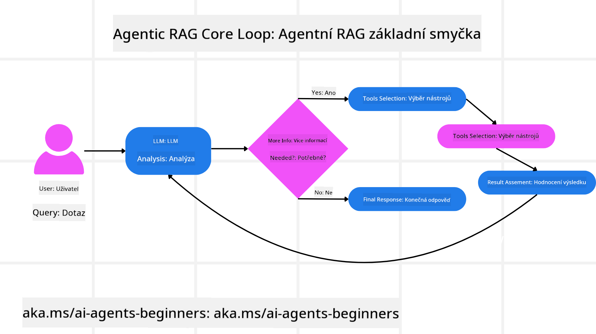
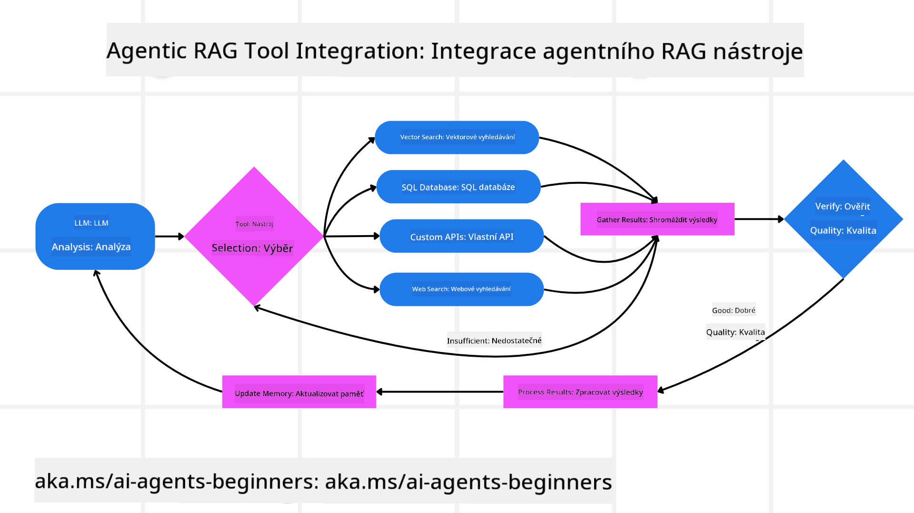
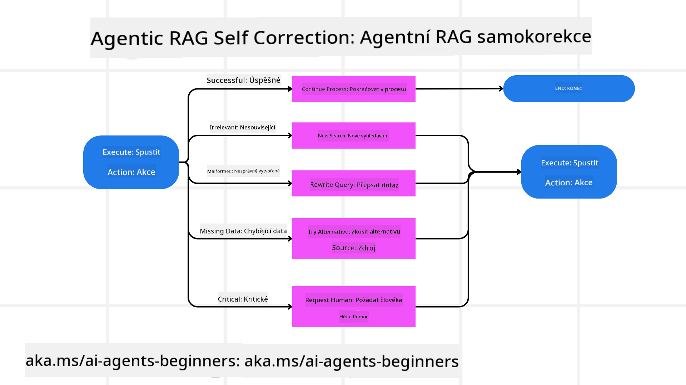
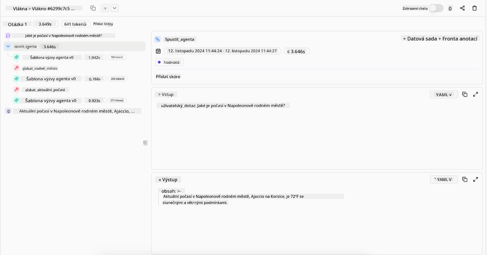

<!--
CO_OP_TRANSLATOR_METADATA:
{
  "original_hash": "7622aa72f9e676e593339f5f694ecd7d",
  "translation_date": "2025-07-12T10:11:07+00:00",
  "source_file": "05-agentic-rag/README.md",
  "language_code": "cs"
}
-->

> _(Klikněte na obrázek výše pro zhlédnutí videa této lekce)_

# Agentic RAG

Tato lekce poskytuje komplexní přehled o Agentic Retrieval-Augmented Generation (Agentic RAG), novém paradigmatu v AI, kde velké jazykové modely (LLM) samostatně plánují své další kroky a zároveň získávají informace z externích zdrojů. Na rozdíl od statických vzorců „vyhledat a poté číst“ Agentic RAG zahrnuje iterativní volání LLM, prokládané voláním nástrojů nebo funkcí a strukturovanými výstupy. Systém vyhodnocuje výsledky, zpřesňuje dotazy, v případě potřeby volá další nástroje a tento cyklus opakuje, dokud nedosáhne uspokojivého řešení.

## Úvod

Tato lekce pokryje

- **Pochopení Agentic RAG:** Seznámíte se s novým paradigmatem v AI, kde velké jazykové modely (LLM) samostatně plánují své další kroky a zároveň získávají informace z externích datových zdrojů.
- **Pochopení iterativního stylu Maker-Checker:** Porozumíte smyčce iterativních volání LLM, prokládaných voláním nástrojů nebo funkcí a strukturovanými výstupy, navrženými ke zvýšení správnosti a zvládání nesprávně formulovaných dotazů.
- **Prozkoumání praktických aplikací:** Identifikujete situace, kde Agentic RAG vyniká, například v prostředích kladoucích důraz na správnost, složité interakce s databázemi a rozšířené pracovní postupy.

## Cíle učení

Po dokončení této lekce budete umět/rozumět:

- **Pochopení Agentic RAG:** Seznámíte se s novým paradigmatem v AI, kde velké jazykové modely (LLM) samostatně plánují své další kroky a zároveň získávají informace z externích datových zdrojů.
- **Iterativní styl Maker-Checker:** Pochopíte koncept smyčky iterativních volání LLM, prokládaných voláním nástrojů nebo funkcí a strukturovanými výstupy, navrženými ke zvýšení správnosti a zvládání nesprávně formulovaných dotazů.
- **Ovládnutí procesu uvažování:** Porozumíte schopnosti systému vlastnit svůj proces uvažování, rozhodovat o přístupu k problémům bez spoléhání se na předem definované cesty.
- **Pracovní postup:** Pochopíte, jak agentní model samostatně rozhoduje o získání zpráv o tržních trendech, identifikaci dat konkurence, korelaci interních prodejních metrik, syntéze zjištění a vyhodnocení strategie.
- **Iterativní smyčky, integrace nástrojů a paměť:** Naučíte se o závislosti systému na smyčkovém vzoru interakce, udržování stavu a paměti napříč kroky, aby se zabránilo opakujícím se smyčkám a umožnilo informované rozhodování.
- **Zvládání chybových stavů a samokorekce:** Prozkoumáte robustní mechanismy samokorekce systému, včetně iterací a opětovných dotazů, využívání diagnostických nástrojů a záložního lidského dohledu.
- **Hranice agentnosti:** Pochopíte omezení Agentic RAG, zaměřující se na doménově specifickou autonomii, závislost na infrastruktuře a respektování bezpečnostních opatření.
- **Praktické případy použití a hodnota:** Identifikujete situace, kde Agentic RAG vyniká, například v prostředích kladoucích důraz na správnost, složité interakce s databázemi a rozšířené pracovní postupy.
- **Správa, transparentnost a důvěra:** Naučíte se o důležitosti správy a transparentnosti, včetně vysvětlitelného uvažování, kontroly zaujatosti a lidského dohledu.

## Co je Agentic RAG?

Agentic Retrieval-Augmented Generation (Agentic RAG) je nové paradigma v AI, kde velké jazykové modely (LLM) samostatně plánují své další kroky a zároveň získávají informace z externích zdrojů. Na rozdíl od statických vzorců „vyhledat a poté číst“ Agentic RAG zahrnuje iterativní volání LLM, prokládané voláním nástrojů nebo funkcí a strukturovanými výstupy. Systém vyhodnocuje výsledky, zpřesňuje dotazy, v případě potřeby volá další nástroje a tento cyklus opakuje, dokud nedosáhne uspokojivého řešení. Tento iterativní styl „maker-checker“ zlepšuje správnost, zvládá nesprávně formulované dotazy a zajišťuje vysoce kvalitní výsledky.

Systém aktivně vlastní svůj proces uvažování, přepisuje neúspěšné dotazy, volí různé metody vyhledávání a integruje více nástrojů — například vektorové vyhledávání v Azure AI Search, SQL databáze nebo vlastní API — před tím, než finálně odpoví. Rozlišující vlastností agentního systému je jeho schopnost vlastnit svůj proces uvažování. Tradiční implementace RAG spoléhají na předem definované cesty, ale agentní systém autonomně určuje posloupnost kroků na základě kvality nalezených informací.

## Definice Agentic Retrieval-Augmented Generation (Agentic RAG)

Agentic Retrieval-Augmented Generation (Agentic RAG) je nové paradigma ve vývoji AI, kde LLM nejen získávají informace z externích datových zdrojů, ale také samostatně plánují své další kroky. Na rozdíl od statických vzorců „vyhledat a poté číst“ nebo pečlivě napsaných sekvencí promptů, Agentic RAG zahrnuje smyčku iterativních volání LLM, prokládaných voláním nástrojů nebo funkcí a strukturovanými výstupy. Systém při každém kroku vyhodnocuje získané výsledky, rozhoduje, zda zpřesnit dotazy, v případě potřeby volá další nástroje a pokračuje v tomto cyklu, dokud nedosáhne uspokojivého řešení.

Tento iterativní styl „maker-checker“ je navržen ke zvýšení správnosti, zvládání nesprávně formulovaných dotazů do strukturovaných databází (např. NL2SQL) a zajištění vyvážených, kvalitních výsledků. Místo spoléhání se pouze na pečlivě navržené řetězce promptů systém aktivně vlastní svůj proces uvažování. Může přepisovat neúspěšné dotazy, volit různé metody vyhledávání a integrovat více nástrojů — například vektorové vyhledávání v Azure AI Search, SQL databáze nebo vlastní API — před tím, než finálně odpoví. Tím odpadá potřeba složitých orchestrací. Relativně jednoduchá smyčka „volání LLM → použití nástroje → volání LLM → …“ může přinést sofistikované a dobře podložené výstupy.

## Vlastnění procesu uvažování

Rozlišující vlastností, která činí systém „agentním“, je jeho schopnost vlastnit svůj proces uvažování. Tradiční implementace RAG často závisí na tom, že lidé předem definují cestu pro model: řetězec myšlenek, který určuje, co a kdy vyhledávat.  
Ale když je systém skutečně agentní, sám rozhoduje, jak k problému přistoupit. Nejde jen o vykonávání skriptu; autonomně určuje posloupnost kroků na základě kvality nalezených informací.  
Například pokud je požádán o vytvoření strategie uvedení produktu na trh, nespoléhá se pouze na prompt, který popisuje celý výzkumný a rozhodovací proces. Místo toho agentní model samostatně rozhodne:

1. Získat aktuální zprávy o tržních trendech pomocí Bing Web Grounding  
2. Identifikovat relevantní data o konkurenci pomocí Azure AI Search  
3. Korelovat historické interní prodejní metriky pomocí Azure SQL Database  
4. Syntetizovat zjištění do soudržné strategie orchestrující přes Azure OpenAI Service  
5. Vyhodnotit strategii na mezery nebo nesrovnalosti a v případě potřeby spustit další kolo vyhledávání  

Všechny tyto kroky — zpřesňování dotazů, výběr zdrojů, iterace dokud není odpověď „uspokojivá“ — jsou rozhodnuty modelem, nikoli předem napsány člověkem.

## Iterativní smyčky, integrace nástrojů a paměť

Agentní systém spoléhá na smyčkový vzor interakce:

- **Počáteční volání:** Cíl uživatele (tzv. uživatelský prompt) je předán LLM.  
- **Volání nástroje:** Pokud model zjistí chybějící informace nebo nejasné instrukce, vybere nástroj nebo metodu vyhledávání — například dotaz do vektorové databáze (např. Azure AI Search Hybrid search nad soukromými daty) nebo strukturovaný SQL dotaz — aby získal více kontextu.  
- **Hodnocení a zpřesnění:** Po přezkoumání vrácených dat model rozhodne, zda jsou informace dostačující. Pokud ne, zpřesní dotaz, vyzkouší jiný nástroj nebo upraví svůj přístup.  
- **Opakování dokud není spokojen:** Tento cyklus pokračuje, dokud model nerozhodne, že má dostatečnou jasnost a důkazy k poskytnutí finální, dobře odůvodněné odpovědi.  
- **Paměť a stav:** Protože systém udržuje stav a paměť napříč kroky, může si pamatovat předchozí pokusy a jejich výsledky, vyhýbat se opakujícím se smyčkám a činit informovanější rozhodnutí během postupu.

Postupem času to vytváří pocit vyvíjejícího se porozumění, umožňující modelu zvládat složité, vícekrokové úkoly bez nutnosti neustálého zásahu člověka nebo přepisování promptu.

## Zvládání chybových stavů a samokorekce

Autonomie Agentic RAG zahrnuje také robustní mechanismy samokorekce. Když systém narazí na slepé uličky — například získá nerelevantní dokumenty nebo narazí na nesprávně formulované dotazy — může:

- **Iterovat a znovu dotazovat:** Místo vrácení málo hodnotných odpovědí model zkouší nové vyhledávací strategie, přepisuje databázové dotazy nebo zkoumá alternativní datové sady.  
- **Používat diagnostické nástroje:** Systém může volat další funkce navržené k ladění jeho uvažovacích kroků nebo potvrzení správnosti získaných dat. Nástroje jako Azure AI Tracing jsou důležité pro zajištění robustní pozorovatelnosti a monitoringu.  
- **Záložní lidský dohled:** Pro vysoce rizikové nebo opakovaně selhávající scénáře může model označit nejistotu a požádat o lidské vedení. Jakmile člověk poskytne korekční zpětnou vazbu, model ji může v budoucnu zohlednit.

Tento iterativní a dynamický přístup umožňuje modelu se neustále zlepšovat, zajišťuje, že nejde o jednorázový systém, ale o systém, který se učí ze svých chyb během dané relace.

## Hranice agentnosti

Přestože má systém autonomii v rámci úkolu, Agentic RAG není ekvivalentem obecné umělé inteligence (AGI). Jeho „agentní“ schopnosti jsou omezeny na nástroje, datové zdroje a pravidla poskytnutá lidskými vývojáři. Nemůže si vymýšlet vlastní nástroje ani vystoupit mimo nastavené doménové hranice. Místo toho vyniká v dynamické orchestraci dostupných zdrojů.  
Klíčové rozdíly oproti pokročilejším formám AI zahrnují:

1. **Doménově specifická autonomie:** Agentní RAG systémy se zaměřují na dosažení uživatelem definovaných cílů v rámci známé domény, využívají strategie jako přepis dotazů nebo výběr nástrojů ke zlepšení výsledků.  
2. **Závislost na infrastruktuře:** Schopnosti systému závisí na nástrojích a datech integrovaných vývojáři. Bez lidského zásahu nemůže tyto hranice překročit.  
3. **Respektování bezpečnostních opatření:** Etické směrnice, pravidla souladu a obchodní politiky zůstávají velmi důležité. Svoboda agenta je vždy omezena bezpečnostními opatřeními a dozorčími mechanismy (doufejme).

## Praktické případy použití a hodnota

Agentic RAG vyniká v situacích vyžadujících iterativní zpřesňování a přesnost:

1. **Prostředí kladoucí důraz na správnost:** Při kontrolách souladu, regulačních analýzách nebo právním výzkumu může agentní model opakovaně ověřovat fakta, konzultovat více zdrojů a přepisovat dotazy, dokud nevytvoří důkladně prověřenou odpověď.  
2. **Složité interakce s databázemi:** Při práci se strukturovanými daty, kde dotazy často selhávají nebo je třeba je upravovat, může systém autonomně zpřesňovat dotazy pomocí Azure SQL nebo Microsoft Fabric OneLake, aby konečné vyhledávání odpovídalo záměru uživatele.  
3. **Rozšířené pracovní postupy:** Delší relace se mohou vyvíjet s přibývajícími informacemi. Agentic RAG může průběžně začleňovat nová data a měnit strategie, jak se dozvídá více o problému.

## Správa, transparentnost a důvěra

Jak se tyto systémy stávají autonomnějšími ve svém uvažování, správa a transparentnost jsou klíčové:

- **Vysvětlitelné uvažování:** Model může poskytnout auditní stopu dotazů, které provedl, zdrojů, které konzultoval, a kroků uvažování, které podnikl k dosažení závěru. Nástroje jako Azure AI Content Safety a Azure AI Tracing / GenAIOps pomáhají udržovat transparentnost a snižovat rizika.  
- **Kontrola zaujatosti a vyvážené vyhledávání:** Vývojáři mohou ladit strategie vyhledávání tak, aby byly zohledněny vyvážené a reprezentativní datové zdroje, a pravidelně auditovat výstupy, aby odhalili zaujatost nebo zkreslené vzory pomocí vlastních modelů pro pokročilé datové vědecké organizace využívající Azure Machine Learning.  
- **Lidský dohled a shoda:** Pro citlivé úkoly je lidská kontrola nezbytná. Agentic RAG nenahrazuje lidský úsudek v rozhodnutích s vysokým rizikem — doplňuje ho tím, že poskytuje důkladně prověřené možnosti.

Mít nástroje, které poskytují jasný záznam akcí, je nezbytné. Bez nich může být ladění vícekrokového procesu velmi obtížné. Níže je příklad z Literal AI (společnost stojící za Chainlit) pro běh agenta:

## Závěr

Agentic RAG představuje přirozenou evoluci v tom, jak AI systémy zvládají složité, datově náročné úkoly. Přijetím smyčkového vzoru interakce, autonomním výběrem nástrojů a zpřesňováním dotazů až do dosažení vysoce kvalitního výsledku se systém posouvá za hranice statického následování promptů k adaptivnějšímu, kontextově uvědomělému rozhodování. Přestože je stále omezen lidsky definovanou infrastrukturou a etickými pravidly, tyto agentní schopnosti umožňují bohatší, dynamičtější a nakonec užitečnější AI interakce jak pro podniky, tak pro koncové uživatele.

## Další

- <a href="https://learn.microsoft.com/azure/ai-studio/concepts/evaluation-approach-gen-ai" target="_blank">Hodnocení aplikací generativní AI s Azure AI Foundry: Tento článek se zabývá hodnocením a porovnáním modelů na veřejně dostupných datech, včetně Agentic AI aplikací a RAG architektur</a>
- <a href="https://weaviate.io/blog/what-is-agentic-rag" target="_blank">Co je Agentic RAG | Weaviate</a>
- <a href="https://ragaboutit.com/agentic-rag-a-complete-guide-to-agent-based-retrieval-augmented-generation/" target="_blank">Agentic RAG: Kompletní průvodce agentně založenou Retrieval Augmented Generation – Novinky z generace RAG</a>
- <a href="https://huggingface.co/learn/cookbook/agent_rag" target="_blank">Agentic RAG: zrychlete svůj RAG pomocí reformulace dotazů a self-query! Hugging Face Open-Source AI Cookbook</a>
- <a href="https://youtu.be/aQ4yQXeB1Ss?si=2HUqBzHoeB5tR04U" target="_blank">Přidání agentních vrstev do RAG</a>
- <a href="https://www.youtube.com/watch?v=zeAyuLc_f3Q&t=244s" target="_blank">Budoucnost znalostních asistentů: Jerry Liu</a>
- <a href="https://www.youtube.com/watch?v=AOSjiXP1jmQ" target="_blank">Jak postavit Agentic RAG systémy</a>
- <a href="https://ignite.microsoft.com/sessions/BRK102?source=sessions" target="_blank">Použití Azure AI Foundry Agent Service pro škálování vašich AI agentů</a>

### Akademické články

- <a href="https://arxiv.org/abs/2303.17651" target="_blank">2303.17651 Self-Refine: Iterativní zdokonalování s vlastním zpětným hodnocením</a>
- <a href="https://arxiv.org/abs/2303.11366" target="_blank">2303.11366 Reflexion: Jazykoví agenti s verbálním posilovacím učením</a>
- <a href="https://arxiv.org/abs/2305.11738" target="_blank">2305.11738 CRITIC: Velké jazykové modely se mohou samy opravovat pomocí nástrojově interaktivní kritiky</a>
- <a href="https://arxiv.org/abs/2501.09136" target="_blank">2501.09136 Agentic Retrieval-Augmented Generation: Přehled o Agentic RAG</a>

## Předchozí lekce

[Tool Use Design Pattern](../04-tool-use/README.md)

## Následující lekce

[Building Trustworthy AI Agents](../06-building-trustworthy-agents/README.md)

**Prohlášení o vyloučení odpovědnosti**:  
Tento dokument byl přeložen pomocí AI překladatelské služby [Co-op Translator](https://github.com/Azure/co-op-translator). I když usilujeme o přesnost, mějte prosím na paměti, že automatizované překlady mohou obsahovat chyby nebo nepřesnosti. Původní dokument v jeho mateřském jazyce by měl být považován za autoritativní zdroj. Pro důležité informace se doporučuje profesionální lidský překlad. Nejsme odpovědní za jakékoliv nedorozumění nebo nesprávné výklady vyplývající z použití tohoto překladu.