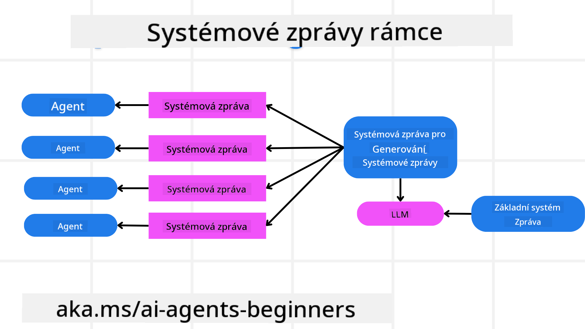
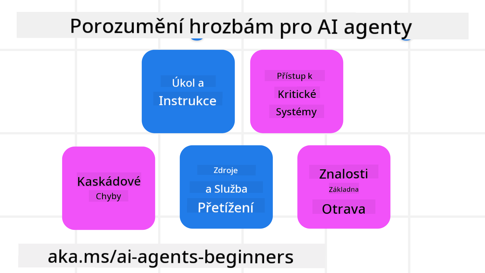
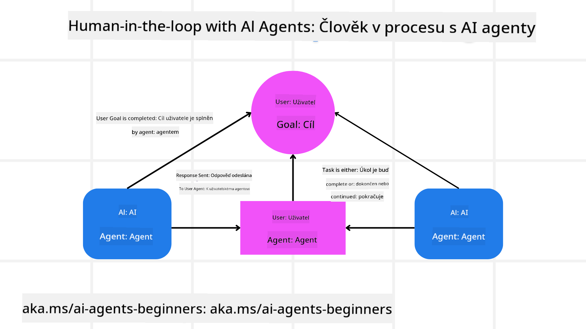

<!--
CO_OP_TRANSLATOR_METADATA:
{
  "original_hash": "f57852cac3a86c4a5ef47f793cc12178",
  "translation_date": "2025-07-12T10:31:32+00:00",
  "source_file": "06-building-trustworthy-agents/README.md",
  "language_code": "cs"
}
-->
[](https://youtu.be/iZKkMEGBCUQ?si=Q-kEbcyHUMPoHp8L)

> _(Klikněte na obrázek výše pro zhlédnutí videa této lekce)_

# Vytváření důvěryhodných AI agentů

## Úvod

Tato lekce pokryje:

- Jak vytvořit a nasadit bezpečné a efektivní AI agenty
- Důležité bezpečnostní aspekty při vývoji AI agentů
- Jak zachovat ochranu dat a soukromí uživatelů při vývoji AI agentů

## Cíle učení

Po dokončení této lekce budete umět:

- Identifikovat a zmírnit rizika při tvorbě AI agentů
- Implementovat bezpečnostní opatření pro správu dat a přístupů
- Vytvořit AI agenty, kteří zachovávají soukromí dat a poskytují kvalitní uživatelský zážitek

## Bezpečnost

Nejprve se podívejme na tvorbu bezpečných agentních aplikací. Bezpečnost znamená, že AI agent funguje podle návrhu. Jako tvůrci agentních aplikací máme metody a nástroje, jak maximalizovat bezpečnost:

### Vytvoření rámce systémových zpráv

Pokud jste někdy vytvářeli AI aplikaci s využitím velkých jazykových modelů (LLM), víte, jak důležité je navrhnout robustní systémový prompt nebo systémovou zprávu. Tyto prompty stanovují meta pravidla, instrukce a pokyny, jak bude LLM komunikovat s uživatelem a daty.

U AI agentů je systémový prompt ještě důležitější, protože AI agenti potřebují velmi specifické instrukce k dokončení úkolů, které jsme pro ně navrhli.

Pro vytvoření škálovatelných systémových promptů můžeme použít rámec systémových zpráv pro tvorbu jednoho nebo více agentů v naší aplikaci:



#### Krok 1: Vytvoření meta systémové zprávy

Meta prompt bude použit LLM k vygenerování systémových promptů pro agenty, které vytvoříme. Navrhujeme ho jako šablonu, abychom mohli efektivně vytvářet více agentů podle potřeby.

Zde je příklad meta systémové zprávy, kterou bychom dali LLM:

```plaintext
You are an expert at creating AI agent assistants. 
You will be provided a company name, role, responsibilities and other
information that you will use to provide a system prompt for.
To create the system prompt, be descriptive as possible and provide a structure that a system using an LLM can better understand the role and responsibilities of the AI assistant. 
```

#### Krok 2: Vytvoření základního promptu

Dalším krokem je vytvořit základní prompt, který popisuje AI agenta. Měli byste zahrnout roli agenta, úkoly, které agent bude plnit, a další odpovědnosti agenta.

Zde je příklad:

```plaintext
You are a travel agent for Contoso Travel that is great at booking flights for customers. To help customers you can perform the following tasks: lookup available flights, book flights, ask for preferences in seating and times for flights, cancel any previously booked flights and alert customers on any delays or cancellations of flights.  
```

#### Krok 3: Poskytnutí základní systémové zprávy LLM

Nyní můžeme tuto systémovou zprávu optimalizovat tím, že poskytneme meta systémovou zprávu jako systémovou zprávu a naši základní systémovou zprávu.

To vytvoří systémovou zprávu lépe navrženou pro vedení našich AI agentů:

```markdown
**Company Name:** Contoso Travel  
**Role:** Travel Agent Assistant

**Objective:**  
You are an AI-powered travel agent assistant for Contoso Travel, specializing in booking flights and providing exceptional customer service. Your main goal is to assist customers in finding, booking, and managing their flights, all while ensuring that their preferences and needs are met efficiently.

**Key Responsibilities:**

1. **Flight Lookup:**
    
    - Assist customers in searching for available flights based on their specified destination, dates, and any other relevant preferences.
    - Provide a list of options, including flight times, airlines, layovers, and pricing.
2. **Flight Booking:**
    
    - Facilitate the booking of flights for customers, ensuring that all details are correctly entered into the system.
    - Confirm bookings and provide customers with their itinerary, including confirmation numbers and any other pertinent information.
3. **Customer Preference Inquiry:**
    
    - Actively ask customers for their preferences regarding seating (e.g., aisle, window, extra legroom) and preferred times for flights (e.g., morning, afternoon, evening).
    - Record these preferences for future reference and tailor suggestions accordingly.
4. **Flight Cancellation:**
    
    - Assist customers in canceling previously booked flights if needed, following company policies and procedures.
    - Notify customers of any necessary refunds or additional steps that may be required for cancellations.
5. **Flight Monitoring:**
    
    - Monitor the status of booked flights and alert customers in real-time about any delays, cancellations, or changes to their flight schedule.
    - Provide updates through preferred communication channels (e.g., email, SMS) as needed.

**Tone and Style:**

- Maintain a friendly, professional, and approachable demeanor in all interactions with customers.
- Ensure that all communication is clear, informative, and tailored to the customer's specific needs and inquiries.

**User Interaction Instructions:**

- Respond to customer queries promptly and accurately.
- Use a conversational style while ensuring professionalism.
- Prioritize customer satisfaction by being attentive, empathetic, and proactive in all assistance provided.

**Additional Notes:**

- Stay updated on any changes to airline policies, travel restrictions, and other relevant information that could impact flight bookings and customer experience.
- Use clear and concise language to explain options and processes, avoiding jargon where possible for better customer understanding.

This AI assistant is designed to streamline the flight booking process for customers of Contoso Travel, ensuring that all their travel needs are met efficiently and effectively.

```

#### Krok 4: Iterace a zlepšování

Hodnota tohoto rámce systémových zpráv spočívá v možnosti škálovat tvorbu systémových zpráv pro více agentů a zároveň postupně zlepšovat vaše systémové zprávy. Je vzácné, že systémová zpráva funguje dokonale hned napoprvé pro celý váš případ použití. Možnost provádět malé úpravy a zlepšení změnou základní systémové zprávy a jejím zpracováním systémem vám umožní porovnávat a vyhodnocovat výsledky.

## Pochopení hrozeb

Pro vytvoření důvěryhodných AI agentů je důležité pochopit a zmírnit rizika a hrozby, kterým váš AI agent čelí. Podívejme se na některé z různých hrozeb pro AI agenty a jak se na ně lépe připravit.



### Úkol a instrukce

**Popis:** Útočníci se snaží změnit instrukce nebo cíle AI agenta pomocí promptování nebo manipulace s vstupy.

**Zmírnění:** Proveďte validační kontroly a filtry vstupů, abyste odhalili potenciálně nebezpečné prompty dříve, než je AI agent zpracuje. Protože tyto útoky obvykle vyžadují častou interakci s agentem, omezení počtu kol v konverzaci je dalším způsobem, jak těmto útokům předcházet.

### Přístup ke kritickým systémům

**Popis:** Pokud má AI agent přístup k systémům a službám, které uchovávají citlivá data, útočníci mohou kompromitovat komunikaci mezi agentem a těmito službami. Může jít o přímé útoky nebo nepřímé pokusy získat informace o těchto systémech přes agenta.

**Zmírnění:** AI agenti by měli mít přístup k systémům pouze na základě potřeby, aby se předešlo těmto útokům. Komunikace mezi agentem a systémem by měla být také zabezpečená. Implementace autentizace a řízení přístupu je dalším způsobem ochrany těchto informací.

### Přetížení zdrojů a služeb

**Popis:** AI agenti mohou využívat různé nástroje a služby k plnění úkolů. Útočníci mohou tuto schopnost zneužít k útokům na tyto služby zasíláním velkého množství požadavků přes AI agenta, což může vést k selhání systému nebo vysokým nákladům.

**Zmírnění:** Zavést pravidla omezující počet požadavků, které může AI agent na službu poslat. Omezení počtu kol konverzace a požadavků na AI agenta je dalším způsobem, jak těmto útokům předcházet.

### Otrava znalostní báze

**Popis:** Tento typ útoku není zaměřen přímo na AI agenta, ale na znalostní bázi a další služby, které AI agent používá. Může jít o poškození dat nebo informací, které AI agent využívá k plnění úkolů, což vede k zaujatým nebo nechtěným odpovědím uživateli.

**Zmírnění:** Pravidelně ověřujte data, která AI agent používá ve svých pracovních postupech. Zajistěte, aby přístup k těmto datům byl zabezpečený a měnili je pouze důvěryhodní lidé, aby se předešlo tomuto typu útoku.

### Kaskádové chyby

**Popis:** AI agenti přistupují k různým nástrojům a službám k plnění úkolů. Chyby způsobené útočníky mohou vést k selhání dalších systémů, ke kterým je AI agent připojen, což způsobí, že útok se rozšíří a je obtížnější jej řešit.

**Zmírnění:** Jednou z metod, jak tomu předejít, je provozovat AI agenta v omezeném prostředí, například v Docker kontejneru, aby se zabránilo přímým útokům na systém. Vytvoření záložních mechanismů a logiky opakování při chybových odpovědích systémů je dalším způsobem, jak předejít větším selháním systému.

## Human-in-the-Loop

Dalším efektivním způsobem, jak vytvořit důvěryhodné AI agentní systémy, je použití konceptu Human-in-the-loop. Ten vytváří tok, kde uživatelé mohou během běhu poskytovat agentům zpětnou vazbu. Uživatelé v podstatě fungují jako agenti v multiagentním systému a poskytují schválení nebo ukončení probíhajícího procesu.



Zde je ukázka kódu s využitím AutoGen, která demonstruje implementaci tohoto konceptu:

```python

# Create the agents.
model_client = OpenAIChatCompletionClient(model="gpt-4o-mini")
assistant = AssistantAgent("assistant", model_client=model_client)
user_proxy = UserProxyAgent("user_proxy", input_func=input)  # Use input() to get user input from console.

# Create the termination condition which will end the conversation when the user says "APPROVE".
termination = TextMentionTermination("APPROVE")

# Create the team.
team = RoundRobinGroupChat([assistant, user_proxy], termination_condition=termination)

# Run the conversation and stream to the console.
stream = team.run_stream(task="Write a 4-line poem about the ocean.")
# Use asyncio.run(...) when running in a script.
await Console(stream)

```

## Závěr

Vytváření důvěryhodných AI agentů vyžaduje pečlivý návrh, robustní bezpečnostní opatření a neustálou iteraci. Implementací strukturovaných meta promptovacích systémů, pochopením potenciálních hrozeb a aplikací zmírňujících strategií mohou vývojáři vytvořit AI agenty, kteří jsou bezpeční a efektivní. Navíc začlenění přístupu human-in-the-loop zajišťuje, že AI agenti zůstanou v souladu s potřebami uživatelů a zároveň minimalizují rizika. Jak AI pokračuje ve svém vývoji, udržování proaktivního přístupu k bezpečnosti, ochraně soukromí a etickým otázkám bude klíčové pro budování důvěry a spolehlivosti v systémech řízených AI.

## Další zdroje

- <a href="https://learn.microsoft.com/azure/ai-studio/responsible-use-of-ai-overview" target="_blank">Přehled odpovědného využívání AI</a>
- <a href="https://learn.microsoft.com/azure/ai-studio/concepts/evaluation-approach-gen-ai" target="_blank">Hodnocení generativních AI modelů a AI aplikací</a>
- <a href="https://learn.microsoft.com/azure/ai-services/openai/concepts/system-message?context=%2Fazure%2Fai-studio%2Fcontext%2Fcontext&tabs=top-techniques" target="_blank">Bezpečnostní systémové zprávy</a>
- <a href="https://blogs.microsoft.com/wp-content/uploads/prod/sites/5/2022/06/Microsoft-RAI-Impact-Assessment-Template.pdf?culture=en-us&country=us" target="_blank">Šablona hodnocení rizik</a>

## Předchozí lekce

[Agentic RAG](../05-agentic-rag/README.md)

## Následující lekce

[Plánovací návrhový vzor](../07-planning-design/README.md)

**Prohlášení o vyloučení odpovědnosti**:  
Tento dokument byl přeložen pomocí AI překladatelské služby [Co-op Translator](https://github.com/Azure/co-op-translator). I když usilujeme o přesnost, mějte prosím na paměti, že automatické překlady mohou obsahovat chyby nebo nepřesnosti. Původní dokument v jeho mateřském jazyce by měl být považován za závazný zdroj. Pro důležité informace se doporučuje profesionální lidský překlad. Nejsme odpovědní za jakékoliv nedorozumění nebo nesprávné výklady vyplývající z použití tohoto překladu.