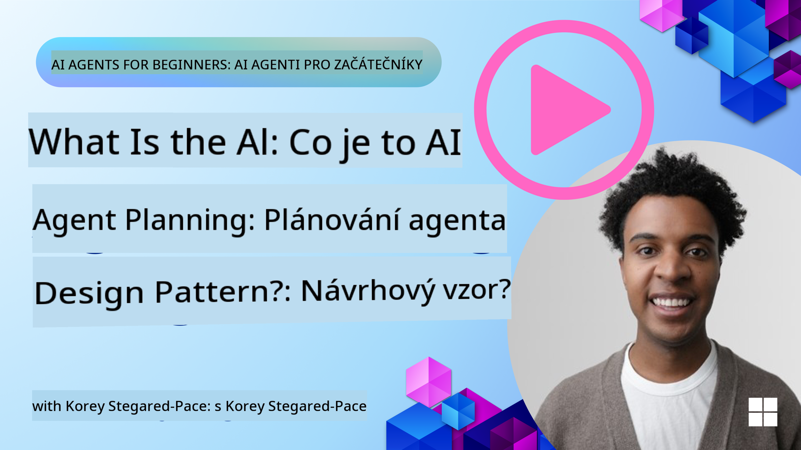
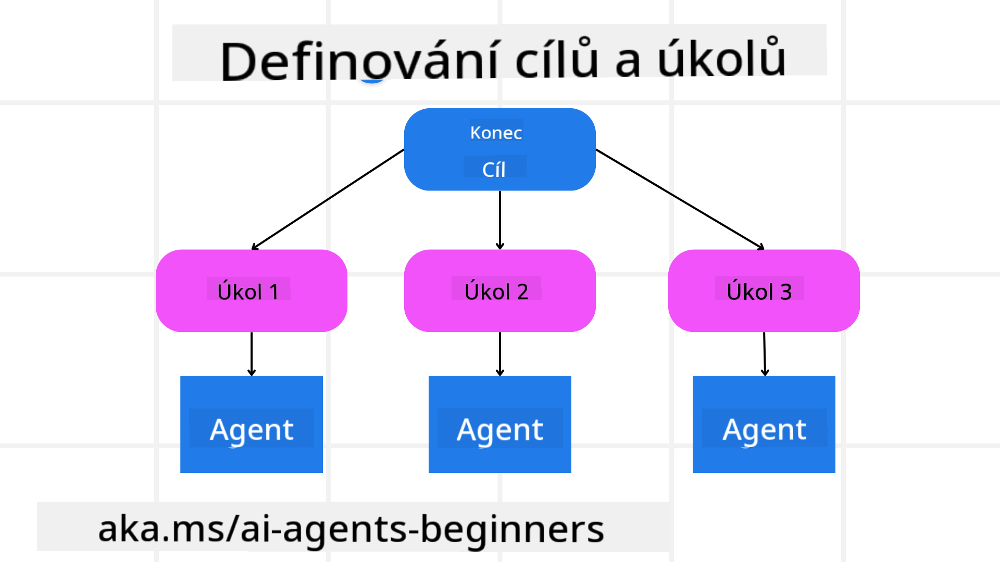

<!--
CO_OP_TRANSLATOR_METADATA:
{
  "original_hash": "a28d30590704ea13b6a08d4793cf9c2b",
  "translation_date": "2025-08-29T20:29:15+00:00",
  "source_file": "07-planning-design/README.md",
  "language_code": "cs"
}
-->
[](https://youtu.be/kPfJ2BrBCMY?si=9pYpPXp0sSbK91Dr)

> _(Klikněte na obrázek výše pro zhlédnutí videa této lekce)_

# Plánování Designu

## Úvod

Tato lekce pokryje:

* Definování jasného celkového cíle a rozdělení složitého úkolu na zvládnutelné části.
* Využití strukturovaného výstupu pro spolehlivější a strojově čitelné odpovědi.
* Použití přístupu založeného na událostech k řešení dynamických úkolů a neočekávaných vstupů.

## Cíle učení

Po dokončení této lekce budete rozumět:

* Jak identifikovat a nastavit celkový cíl pro AI agenta, aby jasně věděl, co je třeba dosáhnout.
* Jak rozložit složitý úkol na zvládnutelné dílčí úkoly a uspořádat je do logické posloupnosti.
* Jak vybavit agenty správnými nástroji (např. vyhledávacími nebo analytickými nástroji), rozhodnout, kdy a jak je použít, a zvládnout neočekávané situace.
* Jak hodnotit výsledky dílčích úkolů, měřit výkon a iterovat akce pro zlepšení konečného výstupu.

## Definování celkového cíle a rozdělení úkolu



Většina úkolů v reálném světě je příliš složitá na to, aby je bylo možné zvládnout jedním krokem. AI agent potřebuje stručný cíl, který bude řídit jeho plánování a akce. Například zvažte cíl:

    "Vytvořte třídenní cestovní itinerář."

I když je jednoduché jej formulovat, stále vyžaduje upřesnění. Čím jasnější je cíl, tím lépe se agent (a případní lidskí spolupracovníci) mohou soustředit na dosažení správného výsledku, například vytvoření komplexního itineráře s možnostmi letů, doporučeními hotelů a návrhy aktivit.

### Rozklad úkolu

Velké nebo složité úkoly se stávají zvládnutelnějšími, když jsou rozděleny na menší, cílené dílčí úkoly. 
Pro příklad cestovního itineráře byste mohli rozdělit cíl na:

* Rezervace letu
* Rezervace hotelu
* Pronájem auta
* Personalizace

Každý dílčí úkol může být řešen specializovanými agenty nebo procesy. Jeden agent se může specializovat na hledání nejlepších nabídek letů, jiný na rezervace hotelů a tak dále. Koordinující nebo „downstream“ agent pak může tyto výsledky sestavit do jednoho uceleného itineráře pro koncového uživatele.

Tento modulární přístup také umožňuje postupné vylepšování. Například můžete přidat specializované agenty pro doporučení jídel nebo návrhy místních aktivit a postupně itinerář zdokonalovat.

### Strukturovaný výstup

Velké jazykové modely (LLMs) mohou generovat strukturovaný výstup (např. JSON), který je snáze zpracovatelný pro následné agenty nebo služby. To je obzvláště užitečné v kontextu více agentů, kde můžeme tyto úkoly provést po obdržení výstupu z plánování. Pro rychlý přehled.

Následující ukázka Pythonu demonstruje jednoduchého plánovacího agenta, který rozkládá cíl na dílčí úkoly a generuje strukturovaný plán:

```python
from pydantic import BaseModel
from enum import Enum
from typing import List, Optional, Union
import json
import os
from typing import Optional
from pprint import pprint
from autogen_core.models import UserMessage, SystemMessage, AssistantMessage
from autogen_ext.models.azure import AzureAIChatCompletionClient
from azure.core.credentials import AzureKeyCredential

class AgentEnum(str, Enum):
    FlightBooking = "flight_booking"
    HotelBooking = "hotel_booking"
    CarRental = "car_rental"
    ActivitiesBooking = "activities_booking"
    DestinationInfo = "destination_info"
    DefaultAgent = "default_agent"
    GroupChatManager = "group_chat_manager"

# Travel SubTask Model
class TravelSubTask(BaseModel):
    task_details: str
    assigned_agent: AgentEnum  # we want to assign the task to the agent

class TravelPlan(BaseModel):
    main_task: str
    subtasks: List[TravelSubTask]
    is_greeting: bool

client = AzureAIChatCompletionClient(
    model="gpt-4o-mini",
    endpoint="https://models.inference.ai.azure.com",
    # To authenticate with the model you will need to generate a personal access token (PAT) in your GitHub settings.
    # Create your PAT token by following instructions here: https://docs.github.com/en/authentication/keeping-your-account-and-data-secure/managing-your-personal-access-tokens
    credential=AzureKeyCredential(os.environ["GITHUB_TOKEN"]),
    model_info={
        "json_output": False,
        "function_calling": True,
        "vision": True,
        "family": "unknown",
    },
)

# Define the user message
messages = [
    SystemMessage(content="""You are an planner agent.
    Your job is to decide which agents to run based on the user's request.
                      Provide your response in JSON format with the following structure:
{'main_task': 'Plan a family trip from Singapore to Melbourne.',
 'subtasks': [{'assigned_agent': 'flight_booking',
               'task_details': 'Book round-trip flights from Singapore to '
                               'Melbourne.'}
    Below are the available agents specialised in different tasks:
    - FlightBooking: For booking flights and providing flight information
    - HotelBooking: For booking hotels and providing hotel information
    - CarRental: For booking cars and providing car rental information
    - ActivitiesBooking: For booking activities and providing activity information
    - DestinationInfo: For providing information about destinations
    - DefaultAgent: For handling general requests""", source="system"),
    UserMessage(
        content="Create a travel plan for a family of 2 kids from Singapore to Melboune", source="user"),
]

response = await client.create(messages=messages, extra_create_args={"response_format": 'json_object'})

response_content: Optional[str] = response.content if isinstance(
    response.content, str) else None
if response_content is None:
    raise ValueError("Response content is not a valid JSON string" )

pprint(json.loads(response_content))

# # Ensure the response content is a valid JSON string before loading it
# response_content: Optional[str] = response.content if isinstance(
#     response.content, str) else None
# if response_content is None:
#     raise ValueError("Response content is not a valid JSON string")

# # Print the response content after loading it as JSON
# pprint(json.loads(response_content))

# Validate the response content with the MathReasoning model
# TravelPlan.model_validate(json.loads(response_content))
```

### Plánovací agent s orchestrací více agentů

V tomto příkladu přijímá Semantic Router Agent požadavek uživatele (např. „Potřebuji plán hotelu pro svou cestu.“).

Plánovač poté:

* Přijímá plán hotelu: Plánovač vezme zprávu uživatele a na základě systémového promptu (včetně podrobností o dostupných agentech) vytvoří strukturovaný cestovní plán.
* Uvádí seznam agentů a jejich nástrojů: Registr agentů obsahuje seznam agentů (např. pro lety, hotely, pronájem aut a aktivity) spolu s funkcemi nebo nástroji, které nabízejí.
* Směřuje plán k příslušným agentům: V závislosti na počtu dílčích úkolů plánovač buď odešle zprávu přímo specializovanému agentovi (pro scénáře s jedním úkolem), nebo koordinuje prostřednictvím správce skupinového chatu pro spolupráci více agentů.
* Shrnuje výsledek: Nakonec plánovač shrne vytvořený plán pro přehlednost.

Následující ukázka Pythonu ilustruje tyto kroky:

```python

from pydantic import BaseModel

from enum import Enum
from typing import List, Optional, Union

class AgentEnum(str, Enum):
    FlightBooking = "flight_booking"
    HotelBooking = "hotel_booking"
    CarRental = "car_rental"
    ActivitiesBooking = "activities_booking"
    DestinationInfo = "destination_info"
    DefaultAgent = "default_agent"
    GroupChatManager = "group_chat_manager"

# Travel SubTask Model

class TravelSubTask(BaseModel):
    task_details: str
    assigned_agent: AgentEnum # we want to assign the task to the agent

class TravelPlan(BaseModel):
    main_task: str
    subtasks: List[TravelSubTask]
    is_greeting: bool
import json
import os
from typing import Optional

from autogen_core.models import UserMessage, SystemMessage, AssistantMessage
from autogen_ext.models.openai import AzureOpenAIChatCompletionClient

# Create the client with type-checked environment variables

client = AzureOpenAIChatCompletionClient(
    azure_deployment=os.getenv("AZURE_OPENAI_DEPLOYMENT_NAME"),
    model=os.getenv("AZURE_OPENAI_DEPLOYMENT_NAME"),
    api_version=os.getenv("AZURE_OPENAI_API_VERSION"),
    azure_endpoint=os.getenv("AZURE_OPENAI_ENDPOINT"),
    api_key=os.getenv("AZURE_OPENAI_API_KEY"),
)

from pprint import pprint

# Define the user message

messages = [
    SystemMessage(content="""You are an planner agent.
    Your job is to decide which agents to run based on the user's request.
    Below are the available agents specialized in different tasks:
    - FlightBooking: For booking flights and providing flight information
    - HotelBooking: For booking hotels and providing hotel information
    - CarRental: For booking cars and providing car rental information
    - ActivitiesBooking: For booking activities and providing activity information
    - DestinationInfo: For providing information about destinations
    - DefaultAgent: For handling general requests""", source="system"),
    UserMessage(content="Create a travel plan for a family of 2 kids from Singapore to Melbourne", source="user"),
]

response = await client.create(messages=messages, extra_create_args={"response_format": TravelPlan})

# Ensure the response content is a valid JSON string before loading it

response_content: Optional[str] = response.content if isinstance(response.content, str) else None
if response_content is None:
    raise ValueError("Response content is not a valid JSON string")

# Print the response content after loading it as JSON

pprint(json.loads(response_content))
```

Výstup z předchozího kódu můžete použít k nasměrování na `assigned_agent` a shrnutí cestovního plánu pro koncového uživatele.

```json
{
    "is_greeting": "False",
    "main_task": "Plan a family trip from Singapore to Melbourne.",
    "subtasks": [
        {
            "assigned_agent": "flight_booking",
            "task_details": "Book round-trip flights from Singapore to Melbourne."
        },
        {
            "assigned_agent": "hotel_booking",
            "task_details": "Find family-friendly hotels in Melbourne."
        },
        {
            "assigned_agent": "car_rental",
            "task_details": "Arrange a car rental suitable for a family of four in Melbourne."
        },
        {
            "assigned_agent": "activities_booking",
            "task_details": "List family-friendly activities in Melbourne."
        },
        {
            "assigned_agent": "destination_info",
            "task_details": "Provide information about Melbourne as a travel destination."
        }
    ]
}
```

Příklad notebooku s předchozí ukázkou kódu je dostupný [zde](07-autogen.ipynb).

### Iterativní plánování

Některé úkoly vyžadují zpětnou vazbu nebo přeplánování, kdy výsledek jednoho dílčího úkolu ovlivňuje další. Například pokud agent zjistí neočekávaný formát dat při rezervaci letů, může být nutné přizpůsobit strategii před pokračováním v rezervaci hotelů.

Navíc zpětná vazba od uživatele (např. rozhodnutí člověka, že preferuje dřívější let) může vyvolat částečné přeplánování. Tento dynamický, iterativní přístup zajišťuje, že konečné řešení odpovídá reálným omezením a měnícím se preferencím uživatele.

Např. ukázkový kód:

```python
from autogen_core.models import UserMessage, SystemMessage, AssistantMessage
#.. same as previous code and pass on the user history, current plan
messages = [
    SystemMessage(content="""You are a planner agent to optimize the
    Your job is to decide which agents to run based on the user's request.
    Below are the available agents specialized in different tasks:
    - FlightBooking: For booking flights and providing flight information
    - HotelBooking: For booking hotels and providing hotel information
    - CarRental: For booking cars and providing car rental information
    - ActivitiesBooking: For booking activities and providing activity information
    - DestinationInfo: For providing information about destinations
    - DefaultAgent: For handling general requests""", source="system"),
    UserMessage(content="Create a travel plan for a family of 2 kids from Singapore to Melbourne", source="user"),
    AssistantMessage(content=f"Previous travel plan - {TravelPlan}", source="assistant")
]
# .. re-plan and send the tasks to respective agents
```

Pro komplexnější plánování se podívejte na Magnetic One pro řešení složitých úkolů.

## Shrnutí

V tomto článku jsme se podívali na příklad, jak vytvořit plánovač, který může dynamicky vybírat dostupné definované agenty. Výstup plánovače rozkládá úkoly a přiřazuje agenty, aby mohly být provedeny. Předpokládá se, že agenti mají přístup k funkcím/nástrojům potřebným k provedení úkolu. Kromě agentů můžete zahrnout další vzory, jako je reflexe, sumarizace a round robin chat, pro další přizpůsobení.

## Další zdroje

* AutoGen Magnetic One - Obecný systém více agentů pro řešení složitých úkolů, který dosáhl působivých výsledků na několika náročných benchmarkech agentů. Reference: . V této implementaci orchestrátor vytváří plán specifický pro úkol a deleguje tyto úkoly dostupným agentům. Kromě plánování orchestrátor také využívá sledovací mechanismus k monitorování pokroku úkolu a přeplánování podle potřeby.

### Máte další otázky ohledně vzoru plánování designu?

Připojte se k [Azure AI Foundry Discord](https://aka.ms/ai-agents/discord), kde se můžete setkat s dalšími studenty, zúčastnit se konzultačních hodin a získat odpovědi na své otázky ohledně AI agentů.

## Předchozí lekce

[Budování důvěryhodných AI agentů](../06-building-trustworthy-agents/README.md)

## Další lekce

[Vzor designu více agentů](../08-multi-agent/README.md)

---

**Prohlášení**:  
Tento dokument byl přeložen pomocí služby AI pro překlady [Co-op Translator](https://github.com/Azure/co-op-translator). Ačkoli se snažíme o přesnost, mějte prosím na paměti, že automatizované překlady mohou obsahovat chyby nebo nepřesnosti. Původní dokument v jeho původním jazyce by měl být považován za autoritativní zdroj. Pro důležité informace se doporučuje profesionální lidský překlad. Neodpovídáme za žádná nedorozumění nebo nesprávné interpretace vyplývající z použití tohoto překladu.