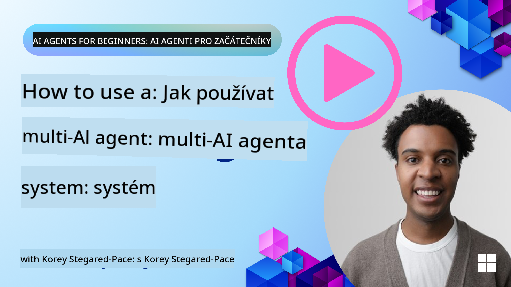
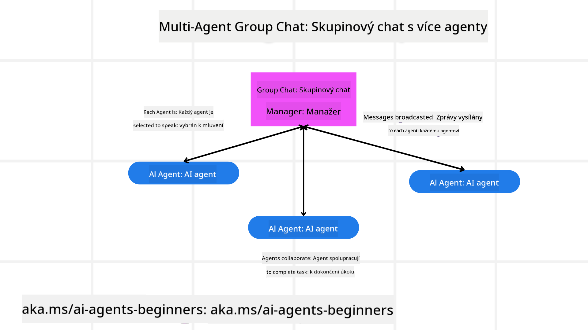
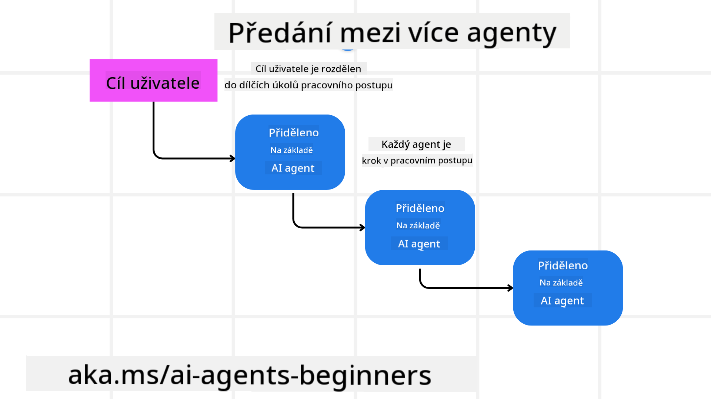
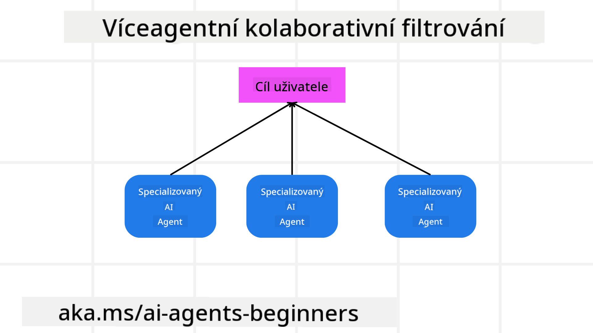

<!--
CO_OP_TRANSLATOR_METADATA:
{
  "original_hash": "c692a8975d7d5b99575a553de1c5e8a7",
  "translation_date": "2025-07-12T11:24:14+00:00",
  "source_file": "08-multi-agent/README.md",
  "language_code": "cs"
}
-->

> _(Klikněte na obrázek výše pro zhlédnutí videa této lekce)_

# Vzory návrhu pro multi-agentní systémy

Jakmile začnete pracovat na projektu, který zahrnuje více agentů, budete muset zvážit vzor návrhu pro multi-agenty. Není však vždy hned jasné, kdy přejít na multi-agenty a jaké jsou jejich výhody.

## Úvod

V této lekci se pokusíme odpovědět na následující otázky:

- V jakých situacích je vhodné použít multi-agenty?
- Jaké jsou výhody použití více agentů oproti jednomu agentovi, který vykonává více úkolů?
- Jaké jsou základní stavební kameny implementace vzoru multi-agentního návrhu?
- Jak získat přehled o tom, jak spolu jednotliví agenti komunikují a spolupracují?

## Cíle učení

Po této lekci byste měli být schopni:

- Rozpoznat situace, kde je vhodné použít multi-agenty
- Uvědomit si výhody použití více agentů oproti jednomu agentovi
- Pochopit základní stavební kameny implementace multi-agentního vzoru návrhu

Jaký je širší kontext?

*Multi-agenti jsou vzor návrhu, který umožňuje více agentům spolupracovat na dosažení společného cíle*.

Tento vzor se hojně využívá v různých oblastech, včetně robotiky, autonomních systémů a distribuovaného výpočetnictví.

## Situace, kde je použití multi-agentů vhodné

Kdy je tedy vhodné použít více agentů? Odpověď je, že existuje mnoho situací, kdy je výhodné nasadit více agentů, zejména v těchto případech:

- **Velké pracovní zatížení**: Velké úkoly lze rozdělit na menší části a přidělit různým agentům, což umožňuje paralelní zpracování a rychlejší dokončení. Příkladem může být zpracování velkého objemu dat.
- **Složitější úkoly**: Složitější úkoly, podobně jako velké pracovní zatížení, lze rozdělit na menší podúkoly a přidělit je agentům, kteří se specializují na konkrétní část úkolu. Dobrou ukázkou jsou autonomní vozidla, kde různí agenti spravují navigaci, detekci překážek a komunikaci s ostatními vozidly.
- **Různorodé odborné znalosti**: Různí agenti mohou mít odlišné odborné znalosti, což jim umožňuje efektivněji řešit různé aspekty úkolu než jeden agent. Příkladem je zdravotnictví, kde agenti mohou spravovat diagnostiku, léčebné plány a monitorování pacientů.

## Výhody použití více agentů oproti jednomu agentovi

Jednoagentní systém může fungovat dobře u jednoduchých úkolů, ale u složitějších úkolů přináší použití více agentů několik výhod:

- **Specializace**: Každý agent může být specializovaný na konkrétní úkol. Nedostatek specializace u jednoho agenta znamená, že agent může být zmateni, co má dělat při složitém úkolu, a může například vykonávat úkol, na který není nejvhodnější.
- **Škálovatelnost**: Je snazší škálovat systém přidáním dalších agentů než přetěžováním jednoho agenta.
- **Odolnost vůči chybám**: Pokud jeden agent selže, ostatní mohou pokračovat v činnosti, což zajišťuje spolehlivost systému.

Příklad: rezervujeme uživateli cestu. Jednoagentní systém by musel zvládnout všechny aspekty rezervace – od hledání letů po rezervaci hotelů a půjčení auta. Aby to zvládl, musel by mít nástroje pro všechny tyto úkoly, což by vedlo k složitému a těžko udržovatelnému systému. Multi-agentní systém by naopak mohl mít různé agenty specializované na hledání letů, rezervaci hotelů a půjčení aut. To by systém učinilo modulárnějším, snadněji udržovatelným a škálovatelným.

Porovnejte to s cestovní kanceláří provozovanou jako malý rodinný podnik versus franšízou. Rodinný podnik by měl jednoho agenta, který řeší všechny aspekty rezervace, zatímco franšíza by měla různé agenty pro různé části procesu.

## Stavební kameny implementace multi-agentního vzoru návrhu

Než začnete implementovat multi-agentní vzor, musíte pochopit jeho základní stavební kameny.

Pojďme si to ukázat na příkladu rezervace cesty pro uživatele. V tomto případě by stavební kameny zahrnovaly:

- **Komunikace agentů**: Agenti pro hledání letů, rezervaci hotelů a půjčení aut musí mezi sebou komunikovat a sdílet informace o preferencích a omezeních uživatele. Musíte rozhodnout o protokolech a metodách této komunikace. Konkrétně to znamená, že agent pro hledání letů musí komunikovat s agentem pro rezervaci hotelů, aby zajistil, že hotel bude rezervován na stejné termíny jako let. To znamená, že agenti musí sdílet informace o datech cesty uživatele, tedy musíte rozhodnout *kteří agenti si informace sdílí a jak*.
- **Koordinační mechanismy**: Agenti musí koordinovat své akce, aby byly splněny preference a omezení uživatele. Například uživatel může preferovat hotel blízko letiště, zatímco omezení může být, že půjčovna aut je pouze na letišti. To znamená, že agent pro rezervaci hotelů musí koordinovat s agentem pro půjčení aut, aby byly preference a omezení splněny. Musíte tedy rozhodnout *jak agenti koordinují své akce*.
- **Architektura agentů**: Agenti musí mít vnitřní strukturu pro rozhodování a učení se z interakcí s uživatelem. To znamená, že agent pro hledání letů musí mít schopnost rozhodovat o tom, které lety doporučit uživateli. Musíte rozhodnout *jak agenti rozhodují a učí se z interakcí s uživatelem*. Příkladem může být, že agent pro hledání letů využívá model strojového učení k doporučení letů na základě předchozích preferencí uživatele.
- **Přehled o interakcích multi-agentů**: Musíte mít přehled o tom, jak agenti mezi sebou komunikují a spolupracují. To znamená, že potřebujete nástroje a techniky pro sledování aktivit a interakcí agentů. Může jít o nástroje pro logování a monitorování, vizualizaci a metriky výkonu.
- **Multi-agentní vzory**: Existují různé vzory pro implementaci multi-agentních systémů, například centralizované, decentralizované a hybridní architektury. Musíte zvolit vzor, který nejlépe vyhovuje vašemu případu použití.
- **Člověk v procesu**: Ve většině případů bude člověk zapojen a je potřeba určit, kdy mají agenti požádat o lidský zásah. Může jít například o situaci, kdy uživatel požaduje konkrétní hotel nebo let, který agenti nedoporučili, nebo o potvrzení před rezervací.

## Přehled o interakcích multi-agentů

Je důležité mít přehled o tom, jak agenti mezi sebou komunikují a spolupracují. Tento přehled je nezbytný pro ladění, optimalizaci a zajištění efektivity celého systému. K tomu potřebujete nástroje a techniky pro sledování aktivit a interakcí agentů. Může jít o nástroje pro logování a monitorování, vizualizaci a metriky výkonu.

Například při rezervaci cesty byste mohli mít dashboard, který zobrazuje stav jednotlivých agentů, preference a omezení uživatele a interakce mezi agenty. Tento dashboard by mohl ukazovat data o cestovních termínech uživatele, letech doporučených agentem pro lety, hotelech doporučených agentem pro hotely a autech doporučených agentem pro půjčení aut. To by vám poskytlo jasný přehled o tom, jak agenti spolupracují a zda jsou preference a omezení uživatele splněny.

Podívejme se na jednotlivé aspekty podrobněji.

- **Nástroje pro logování a monitorování**: Chcete zaznamenávat každou akci, kterou agent provede. Záznam může obsahovat informace o agentovi, který akci provedl, o akci samotné, čase provedení a výsledku. Tyto informace lze využít pro ladění, optimalizaci a další účely.
- **Nástroje pro vizualizaci**: Vizualizace vám pomůže lépe pochopit interakce mezi agenty. Například můžete mít graf, který ukazuje tok informací mezi agenty. To vám pomůže identifikovat úzká místa, neefektivity a další problémy v systému.
- **Metriky výkonu**: Metriky vám pomohou sledovat efektivitu multi-agentního systému. Můžete sledovat například dobu potřebnou k dokončení úkolu, počet dokončených úkolů za jednotku času nebo přesnost doporučení agentů. Tyto informace vám pomohou identifikovat oblasti pro zlepšení a optimalizovat systém.

## Multi-agentní vzory

Pojďme se podívat na konkrétní vzory, které lze použít pro tvorbu multi-agentních aplikací. Zde jsou některé zajímavé vzory, které stojí za zvážení:

### Skupinový chat

Tento vzor je užitečný, pokud chcete vytvořit aplikaci pro skupinový chat, kde může více agentů mezi sebou komunikovat. Typické použití zahrnuje týmovou spolupráci, zákaznickou podporu a sociální sítě.

V tomto vzoru každý agent představuje uživatele ve skupinovém chatu a zprávy jsou mezi agenty vyměňovány pomocí komunikačního protokolu. Agenti mohou posílat zprávy do skupiny, přijímat zprávy od skupiny a reagovat na zprávy od ostatních agentů.

Tento vzor lze implementovat pomocí centralizované architektury, kde všechny zprávy procházejí centrálním serverem, nebo decentralizované architektury, kde si agenti zprávy vyměňují přímo.

### Předání úkolu

Tento vzor je užitečný, pokud chcete vytvořit aplikaci, kde si agenti mohou předávat úkoly.

Typické použití zahrnuje zákaznickou podporu, správu úkolů a automatizaci pracovních postupů.

V tomto vzoru každý agent představuje úkol nebo krok v pracovním postupu a agenti si mohou předávat úkoly na základě předem definovaných pravidel.

### Spolupracující filtrování

Tento vzor je užitečný, pokud chcete vytvořit aplikaci, kde více agentů spolupracuje na doporučování uživatelům.

Důvodem, proč chtít, aby agenti spolupracovali, je, že každý agent může mít jinou odbornost a může přispět k doporučovacímu procesu různými způsoby.

Příklad: uživatel chce doporučení nejlepší akcie k nákupu na burze.

- **Odborník na odvětví**: Jeden agent může být odborníkem na konkrétní odvětví.
- **Technická analýza**: Další agent může být odborníkem na technickou analýzu.
- **Fundamentální analýza**: A další agent může být odborníkem na fundamentální analýzu. Spoluprací mohou tito agenti poskytnout uživateli komplexnější doporučení.

## Scénář: Proces vrácení peněz

Představte si situaci, kdy zákazník žádá o vrácení peněz za produkt. V tomto procesu může být zapojeno několik agentů, rozdělme je na agenty specifické pro tento proces a obecné agenty, kteří mohou být využiti i v jiných procesech.

**Agenti specificky pro proces vrácení peněz**:

Následující agenti by mohli být zapojeni do procesu vrácení peněz:

- **Agent zákazníka**: Tento agent zastupuje zákazníka a je zodpovědný za zahájení procesu vrácení peněz.
- **Agent prodejce**: Tento agent zastupuje prodejce a zajišťuje zpracování vrácení peněz.
- **Agent platby**: Tento agent spravuje platební proces a zajišťuje vrácení peněz zákazníkovi.
- **Agent řešení problémů**: Tento agent řeší případné problémy, které během procesu vrácení vzniknou.
- **Agent souladu**: Tento agent zajišťuje, že proces vrácení peněz je v souladu s předpisy a politikami.

**Obecní agenti**:

Tito agenti mohou být využiti i v jiných částech vašeho podnikání.

- **Agent dopravy**: Tento agent spravuje proces dopravy a zajišťuje odeslání produktu zpět prodejci. Může být využit jak v procesu vrácení, tak i při běžné dopravě produktu při nákupu.
- **Agent zpětné vazby**: Tento agent sbírá zpětnou vazbu od zákazníka. Zpětná vazba může být sbírána kdykoliv, nejen během procesu vrácení.
- **Agent eskalace**: Tento agent zajišťuje eskalaci problémů na vyšší úroveň podpory. Tento typ agenta lze využít v jakémkoli procesu, kde je potřeba eskalovat problém.
- **Agent notifikací**: Tento agent zajišťuje zasílání oznámení zákazníkovi v různých fázích procesu vrácení peněz.
- **Agent analytiky**: Tento agent analyzuje data související s procesem vrácení peněz.
- **Agent auditu**: Tento agent provádí audit procesu vrácení peněz, aby zajistil jeho správné provádění.
- **Agent reportingu**: Tento agent generuje zprávy o procesu vrácení peněz.
- **Agent znalostí**: Tento agent spravuje znalostní bázi informací souvisejících s procesem vrácení peněz. Může mít znalosti jak o vráceních, tak i o dalších částech vašeho podnikání.
- **Agent bezpečnosti**: Tento agent zajišťuje bezpečnost procesu vrácení peněz.
- **Agent kvality**: Tento agent zajišťuje kvalitu procesu vrácení peněz.

Jak vidíte, je zde poměrně mnoho agentů, a to jak specifických pro proces vrácení, tak i obecných, kteří mohou být využiti v jiných částech vašeho podnikání. Doufejme, že vám to dává představu, jak se rozhodnout, které agenty použít ve vašem multi-agentním systému.

## Zadání
## Předchozí lekce

[Plánování návrhu](../07-planning-design/README.md)

## Následující lekce

[Metakognice u AI agentů](../09-metacognition/README.md)

**Prohlášení o vyloučení odpovědnosti**:  
Tento dokument byl přeložen pomocí AI překladatelské služby [Co-op Translator](https://github.com/Azure/co-op-translator). I když usilujeme o přesnost, mějte prosím na paměti, že automatické překlady mohou obsahovat chyby nebo nepřesnosti. Původní dokument v jeho mateřském jazyce by měl být považován za autoritativní zdroj. Pro důležité informace se doporučuje profesionální lidský překlad. Nejsme odpovědní za jakékoliv nedorozumění nebo nesprávné výklady vyplývající z použití tohoto překladu.