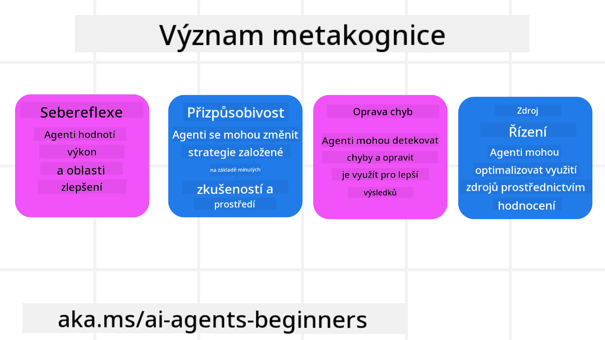
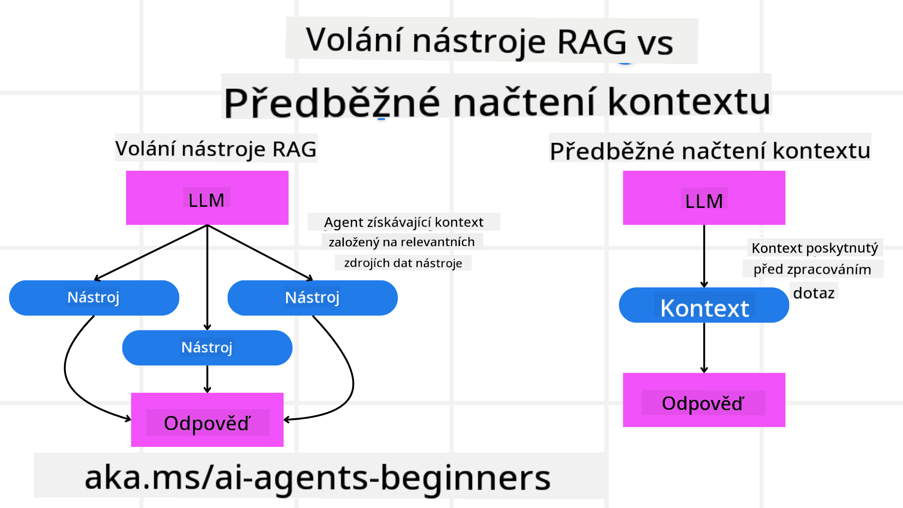

<!--
CO_OP_TRANSLATOR_METADATA:
{
  "original_hash": "8cbf460468c802c7994aa62e0e0779c9",
  "translation_date": "2025-07-12T13:11:56+00:00",
  "source_file": "09-metacognition/README.md",
  "language_code": "cs"
}
-->
[](https://youtu.be/His9R6gw6Ec?si=3_RMb8VprNvdLRhX)

> _(Klikněte na obrázek výše pro zhlédnutí videa této lekce)_
# Metakognice u AI agentů

## Úvod

Vítejte u lekce o metakognici u AI agentů! Tato kapitola je určena pro začátečníky, kteří se zajímají o to, jak mohou AI agenti přemýšlet o vlastních myšlenkových procesech. Na konci této lekce porozumíte klíčovým konceptům a budete vybaveni praktickými příklady, jak metakognici využít při návrhu AI agentů.

## Cíle učení

Po dokončení této lekce budete schopni:

1. Pochopit důsledky smyček uvažování v definicích agentů.
2. Používat techniky plánování a hodnocení k podpoře agentů schopných se samokorigovat.
3. Vytvořit vlastní agenty, kteří dokážou manipulovat s kódem k plnění úkolů.

## Úvod do metakognice

Metakognice označuje vyšší úroveň kognitivních procesů, které zahrnují přemýšlení o vlastním myšlení. Pro AI agenty to znamená schopnost hodnotit a upravovat své akce na základě sebeuvědomění a minulých zkušeností. Metakognice, neboli „přemýšlení o přemýšlení“, je důležitý koncept při vývoji agentních AI systémů. Zahrnuje to, že AI systémy jsou si vědomy svých vlastních vnitřních procesů a dokážou monitorovat, regulovat a přizpůsobovat své chování. Podobně jako my, když čteme situaci nebo se díváme na problém. Toto sebeuvědomění může AI systémům pomoci činit lepší rozhodnutí, identifikovat chyby a zlepšovat svůj výkon v průběhu času – což opět souvisí s Turingovým testem a debatou o tom, zda AI převezme kontrolu.

V kontextu agentních AI systémů může metakognice pomoci řešit několik výzev, jako jsou:
- Transparentnost: Zajištění, že AI systémy dokážou vysvětlit své uvažování a rozhodnutí.
- Uvažování: Zlepšení schopnosti AI systémů syntetizovat informace a činit rozumná rozhodnutí.
- Adaptace: Umožnění AI systémům přizpůsobit se novému prostředí a měnícím se podmínkám.
- Vnímání: Zvýšení přesnosti AI systémů při rozpoznávání a interpretaci dat z okolí.

### Co je metakognice?

Metakognice, neboli „přemýšlení o přemýšlení“, je vyšší kognitivní proces zahrnující sebeuvědomění a seberegulaci vlastních kognitivních procesů. V oblasti AI metakognice umožňuje agentům hodnotit a přizpůsobovat své strategie a akce, což vede ke zlepšení schopností řešení problémů a rozhodování. Porozuměním metakognici můžete navrhnout AI agenty, kteří nejsou jen inteligentnější, ale také adaptabilnější a efektivnější. V pravé metakognici by AI explicitně uvažovala o svém vlastním uvažování.

Příklad: „Upřednostnil jsem levnější lety, protože… možná přicházím o přímé lety, tak to znovu zkontroluji.“
Sledování, jak a proč si vybrala určitou trasu.
- Zaznamenání, že udělala chybu, protože příliš spoléhala na uživatelské preference z minulosti, a proto upravuje svou strategii rozhodování, ne jen konečné doporučení.
- Diagnostika vzorců jako: „Kdykoli uživatel zmíní ‚příliš přeplněno‘, neměl bych jen odstranit některé atrakce, ale také reflektovat, že moje metoda výběru ‚nejlepších atrakcí‘ je chybná, pokud vždy řadím podle popularity.“

### Význam metakognice u AI agentů

Metakognice hraje klíčovou roli v návrhu AI agentů z několika důvodů:



- Sebereflexe: Agenti mohou hodnotit svůj vlastní výkon a identifikovat oblasti ke zlepšení.
- Adaptabilita: Agenti mohou upravovat své strategie na základě minulých zkušeností a měnících se podmínek.
- Korekce chyb: Agenti mohou autonomně detekovat a opravovat chyby, což vede k přesnějším výsledkům.
- Správa zdrojů: Agenti mohou optimalizovat využití zdrojů, jako je čas a výpočetní výkon, plánováním a hodnocením svých akcí.

## Komponenty AI agenta

Než se pustíme do metakognitivních procesů, je důležité pochopit základní komponenty AI agenta. AI agent obvykle sestává z:

- Persona: Osobnost a charakteristiky agenta, které definují, jak komunikuje s uživateli.
- Nástroje: Schopnosti a funkce, které agent může vykonávat.
- Dovednosti: Znalosti a odborné znalosti, které agent má.

Tyto komponenty spolupracují a vytvářejí „jednotku odbornosti“, která dokáže plnit specifické úkoly.

**Příklad**:
Představte si cestovního agenta, službu agenta, která nejen plánuje vaši dovolenou, ale také upravuje svůj plán na základě aktuálních dat a zkušeností z předchozích cest zákazníků.

### Příklad: Metakognice v cestovní agentuře

Představte si, že navrhujete službu cestovního agenta poháněnou AI. Tento agent, „Travel Agent“, pomáhá uživatelům plánovat dovolenou. Aby zahrnul metakognici, musí Travel Agent hodnotit a upravovat své akce na základě sebeuvědomění a minulých zkušeností. Zde je, jak by metakognice mohla hrát roli:

#### Aktuální úkol

Aktuálním úkolem je pomoci uživateli naplánovat cestu do Paříže.

#### Kroky k dokončení úkolu

1. **Získání uživatelských preferencí**: Zeptat se uživatele na termíny cesty, rozpočet, zájmy (např. muzea, gastronomie, nakupování) a specifické požadavky.
2. **Získání informací**: Vyhledat možnosti letů, ubytování, atrakcí a restaurací odpovídajících preferencím uživatele.
3. **Vytvoření doporučení**: Poskytnout personalizovaný itinerář s detaily letů, rezervacemi hotelů a navrženými aktivitami.
4. **Úprava na základě zpětné vazby**: Zeptat se uživatele na zpětnou vazbu k doporučením a provést potřebné úpravy.

#### Potřebné zdroje

- Přístup k databázím letů a hotelových rezervací.
- Informace o pařížských atrakcích a restauracích.
- Data o zpětné vazbě uživatelů z předchozích interakcí.

#### Zkušenosti a sebereflexe

Travel Agent využívá metakognici k hodnocení svého výkonu a učení se z minulých zkušeností. Například:

1. **Analýza uživatelské zpětné vazby**: Travel Agent přezkoumává zpětnou vazbu uživatelů, aby zjistil, která doporučení byla dobře přijata a která ne. Podle toho upravuje budoucí návrhy.
2. **Adaptabilita**: Pokud uživatel dříve zmínil, že nemá rád přeplněná místa, Travel Agent se v budoucnu vyhne doporučování populárních turistických atrakcí v době špičky.
3. **Korekce chyb**: Pokud Travel Agent udělal chybu v předchozí rezervaci, například navrhl hotel, který byl plně obsazený, naučí se důkladněji kontrolovat dostupnost před dalším doporučením.

#### Praktický příklad pro vývojáře

Zde je zjednodušený příklad kódu Travel Agent, který zahrnuje metakognici:

```python
class Travel_Agent:
    def __init__(self):
        self.user_preferences = {}
        self.experience_data = []

    def gather_preferences(self, preferences):
        self.user_preferences = preferences

    def retrieve_information(self):
        # Search for flights, hotels, and attractions based on preferences
        flights = search_flights(self.user_preferences)
        hotels = search_hotels(self.user_preferences)
        attractions = search_attractions(self.user_preferences)
        return flights, hotels, attractions

    def generate_recommendations(self):
        flights, hotels, attractions = self.retrieve_information()
        itinerary = create_itinerary(flights, hotels, attractions)
        return itinerary

    def adjust_based_on_feedback(self, feedback):
        self.experience_data.append(feedback)
        # Analyze feedback and adjust future recommendations
        self.user_preferences = adjust_preferences(self.user_preferences, feedback)

# Example usage
travel_agent = Travel_Agent()
preferences = {
    "destination": "Paris",
    "dates": "2025-04-01 to 2025-04-10",
    "budget": "moderate",
    "interests": ["museums", "cuisine"]
}
travel_agent.gather_preferences(preferences)
itinerary = travel_agent.generate_recommendations()
print("Suggested Itinerary:", itinerary)
feedback = {"liked": ["Louvre Museum"], "disliked": ["Eiffel Tower (too crowded)"]}
travel_agent.adjust_based_on_feedback(feedback)
```

#### Proč je metakognice důležitá

- **Sebereflexe**: Agenti mohou analyzovat svůj výkon a identifikovat oblasti ke zlepšení.
- **Adaptabilita**: Agenti mohou upravovat strategie na základě zpětné vazby a měnících se podmínek.
- **Korekce chyb**: Agenti mohou autonomně detekovat a opravovat chyby.
- **Správa zdrojů**: Agenti mohou optimalizovat využití zdrojů, jako je čas a výpočetní výkon.

Začleněním metakognice může Travel Agent poskytovat personalizovanější a přesnější cestovní doporučení, čímž zlepší celkový uživatelský zážitek.

---

## 2. Plánování u agentů

Plánování je klíčovou součástí chování AI agenta. Zahrnuje vymezení kroků potřebných k dosažení cíle s ohledem na aktuální stav, zdroje a možné překážky.

### Prvky plánování

- **Aktuální úkol**: Jasně definovat úkol.
- **Kroky k dokončení úkolu**: Rozdělit úkol na zvládnutelné kroky.
- **Potřebné zdroje**: Identifikovat nezbytné zdroje.
- **Zkušenosti**: Využít minulé zkušenosti k informování plánování.

**Příklad**:
Zde jsou kroky, které Travel Agent musí podniknout, aby efektivně pomohl uživateli s plánováním cesty:

### Kroky pro Travel Agent

1. **Získání uživatelských preferencí**
   - Zeptat se uživatele na detaily ohledně termínů cesty, rozpočtu, zájmů a specifických požadavků.
   - Příklady: „Kdy plánujete cestovat?“ „Jaký máte rozpočet?“ „Jaké aktivity si na dovolené užíváte?“

2. **Získání informací**
   - Vyhledat relevantní možnosti cestování na základě uživatelských preferencí.
   - **Lety**: Najít dostupné lety v rámci rozpočtu a preferovaných termínů.
   - **Ubytování**: Najít hotely nebo pronájmy odpovídající preferencím uživatele co do lokality, ceny a vybavení.
   - **Atrakce a restaurace**: Identifikovat populární atrakce, aktivity a restaurace, které odpovídají zájmům uživatele.

3. **Vytvoření doporučení**
   - Sestavit získané informace do personalizovaného itineráře.
   - Poskytnout detaily jako možnosti letů, rezervace hotelů a navržené aktivity, přizpůsobené preferencím uživatele.

4. **Předložení itineráře uživateli**
   - Sdílet navržený itinerář k posouzení uživatelem.
   - Příklad: „Tady je navržený itinerář pro vaši cestu do Paříže. Obsahuje detaily letů, rezervace hotelů a seznam doporučených aktivit a restaurací. Co na to říkáte?“

5. **Sbírání zpětné vazby**
   - Zeptat se uživatele na zpětnou vazbu k navrženému itineráři.
   - Příklady: „Líbí se vám možnosti letů?“ „Je hotel vhodný pro vaše potřeby?“ „Chtěli byste něco přidat nebo odebrat?“

6. **Úprava na základě zpětné vazby**
   - Upravit itinerář podle uživatelských připomínek.
   - Pro provedení změn v doporučeních letů, ubytování a aktivit tak, aby lépe odpovídaly preferencím uživatele.

7. **Konečné potvrzení**
   - Předložit aktualizovaný itinerář uživateli ke konečnému schválení.
   - Příklad: „Provedl jsem úpravy podle vaší zpětné vazby. Tady je aktualizovaný itinerář. Vypadá to dobře?“

8. **Rezervace a potvrzení**
   - Po schválení itineráře uživatelem provést rezervace letů, ubytování a předem plánovaných aktivit.
   - Poslat uživateli potvrzovací údaje.

9. **Poskytování průběžné podpory**
   - Být k dispozici pro pomoc s jakýmikoli změnami nebo dalšími požadavky před a během cesty.
   - Příklad: „Pokud budete během cesty potřebovat další pomoc, neváhejte se na mě kdykoli obrátit!“

### Příklad interakce

```python
class Travel_Agent:
    def __init__(self):
        self.user_preferences = {}
        self.experience_data = []

    def gather_preferences(self, preferences):
        self.user_preferences = preferences

    def retrieve_information(self):
        flights = search_flights(self.user_preferences)
        hotels = search_hotels(self.user_preferences)
        attractions = search_attractions(self.user_preferences)
        return flights, hotels, attractions

    def generate_recommendations(self):
        flights, hotels, attractions = self.retrieve_information()
        itinerary = create_itinerary(flights, hotels, attractions)
        return itinerary

    def adjust_based_on_feedback(self, feedback):
        self.experience_data.append(feedback)
        self.user_preferences = adjust_preferences(self.user_preferences, feedback)

# Example usage within a booing request
travel_agent = Travel_Agent()
preferences = {
    "destination": "Paris",
    "dates": "2025-04-01 to 2025-04-10",
    "budget": "moderate",
    "interests": ["museums", "cuisine"]
}
travel_agent.gather_preferences(preferences)
itinerary = travel_agent.generate_recommendations()
print("Suggested Itinerary:", itinerary)
feedback = {"liked": ["Louvre Museum"], "disliked": ["Eiffel Tower (too crowded)"]}
travel_agent.adjust_based_on_feedback(feedback)
```

## 3. Korektivní RAG systém

Nejprve si vysvětleme rozdíl mezi RAG nástrojem a předběžným načítáním kontextu.



### Retrieval-Augmented Generation (RAG)

RAG kombinuje systém vyhledávání s generativním modelem. Když je zadán dotaz, vyhledávací systém získá relevantní dokumenty nebo data z externího zdroje a tyto získané informace se použijí k rozšíření vstupu generativního modelu. To pomáhá modelu generovat přesnější a kontextově relevantnější odpovědi.

V RAG systému agent vyhledává relevantní informace v databázi znalostí a používá je k vytváření vhodných odpovědí nebo akcí.

### Korektivní RAG přístup

Korektivní RAG přístup se zaměřuje na využití RAG technik k opravě chyb a zlepšení přesnosti AI agentů. To zahrnuje:

1. **Techniku promptování**: Použití specifických promptů k nasměrování agenta při vyhledávání relevantních informací.
2. **Nástroj**: Implementaci algoritmů a mechanismů, které umožňují agentovi hodnotit relevanci získaných informací a generovat přesné odpovědi.
3. **Hodnocení**: Neustálé posuzování výkonu agenta a provádění úprav ke zlepšení přesnosti a efektivity.

#### Příklad: Korektivní RAG u vyhledávacího agenta

Představte si vyhledávacího agenta, který získává informace z webu pro odpovědi na uživatelské dotazy. Korektivní RAG přístup může zahrnovat:

1. **Techniku promptování**: Formulování vyhledávacích dotazů na základě vstupu uživatele.
2. **Nástroj**: Použití zpracování přirozeného jazyka a algoritmů strojového učení k řazení a filtrování výsledků vyhledávání.
3. **Hodnocení**: Analýzu zpětné vazby uživatelů k identifikaci a opravě nepřesností ve získaných informacích.

### Korektivní RAG v Travel Agent

Korektivní RAG (Retrieval-Augmented Generation) zlepšuje schopnost AI získávat a generovat informace a zároveň opravovat případné nepřesnosti. Podívejme se, jak může Travel Agent využít korektivní RAG přístup k poskytování přesnějších a relevantnějších cestovních doporučení.

To zahrnuje:

- **Techniku promptování:** Použití specifických promptů k nasměrování agenta při vyhledávání relevantních informací.
- **Nástroj:** Implementaci algoritmů a mechanismů, které umožňují agentovi hodnotit relevanci získaných informací a generovat přesné odpovědi.
- **Hodnocení:** Neustálé posuzování výkonu agenta a provádění úprav ke zlepšení přesnosti a efektivity.

#### Kroky implementace korektivního RAG v Travel Agent

1. **Počáteční interakce s uživatelem**
   - Travel Agent získává počáteční preference uživatele, jako je destinace, termíny cesty, rozpočet a zájmy.
   - Příklad:

     ```python
     preferences = {
         "destination": "Paris",
         "dates": "2025-04-01 to 2025-04-10",
         "budget": "moderate",
         "interests": ["museums", "cuisine"]
     }
     ```

2. **Získávání informací**
   - Travel Agent vyhledává informace o letech, ubytování, atrakcích a restauracích na základě uživatelských preferencí.
   - Příklad:

     ```python
     flights = search_flights(preferences)
     hotels = search_hotels(preferences)
     attractions = search_attractions(preferences)
     ```

3. **Generování počátečních doporučení**
   - Travel Agent využívá získané informace k vytvoření personalizovaného itineráře.
   - Příklad:

     ```python
     itinerary = create_itinerary(flights, hotels, attractions)
     print("Suggested Itinerary:", itinerary)
     ```

4. **Sbírání zpětné vazby od uživatele**
   - Travel Agent žádá uživatele o zpětnou vazbu k počátečním doporučením.
   - Příklad:

     ```python
     feedback = {
         "liked": ["Louvre Museum"],
         "disliked": ["Eiffel Tower (too crowded)"]
     }
     ```

5. **Proces korektivního RAG**
   - **Technika promptování**: Travel Agent formuluje nové vyhledávací dotazy na základě uživatelské zpětné vazby.
     - Příklad:

       @@
### Předběžné načtení kontextu

Předběžné načtení kontextu znamená, že se do modelu načtou relevantní informace nebo pozadí ještě před zpracováním dotazu. Model tak má tyto informace k dispozici od začátku, což mu pomáhá generovat informovanější odpovědi, aniž by během procesu musel vyhledávat další data.

Zde je zjednodušený příklad, jak by mohlo vypadat předběžné načtení kontextu pro aplikaci cestovní kanceláře v Pythonu:

```python
class TravelAgent:
    def __init__(self):
        # Pre-load popular destinations and their information
        self.context = {
            "Paris": {"country": "France", "currency": "Euro", "language": "French", "attractions": ["Eiffel Tower", "Louvre Museum"]},
            "Tokyo": {"country": "Japan", "currency": "Yen", "language": "Japanese", "attractions": ["Tokyo Tower", "Shibuya Crossing"]},
            "New York": {"country": "USA", "currency": "Dollar", "language": "English", "attractions": ["Statue of Liberty", "Times Square"]},
            "Sydney": {"country": "Australia", "currency": "Dollar", "language": "English", "attractions": ["Sydney Opera House", "Bondi Beach"]}
        }

    def get_destination_info(self, destination):
        # Fetch destination information from pre-loaded context
        info = self.context.get(destination)
        if info:
            return f"{destination}:\nCountry: {info['country']}\nCurrency: {info['currency']}\nLanguage: {info['language']}\nAttractions: {', '.join(info['attractions'])}"
        else:
            return f"Sorry, we don't have information on {destination}."

# Example usage
travel_agent = TravelAgent()
print(travel_agent.get_destination_info("Paris"))
print(travel_agent.get_destination_info("Tokyo"))
```

#### Vysvětlení

1. **Inicializace (metoda `__init__`)**: Třída `TravelAgent` přednačte slovník obsahující informace o populárních destinacích jako Paříž, Tokio, New York a Sydney. Tento slovník zahrnuje detaily jako země, měna, jazyk a hlavní atrakce každé destinace.

2. **Získávání informací (metoda `get_destination_info`)**: Když uživatel položí dotaz na konkrétní destinaci, metoda `get_destination_info` získá příslušné informace ze slovníku přednačteného kontextu.

Díky přednačtení kontextu může aplikace cestovní kanceláře rychle reagovat na dotazy uživatelů, aniž by musela v reálném čase vyhledávat informace z externího zdroje. To zvyšuje efektivitu a rychlost aplikace.

### Inicializace plánu s cílem před iterací

Inicializace plánu s cílem znamená začít s jasným cílem nebo požadovaným výsledkem. Definováním tohoto cíle na začátku může model používat tento cíl jako vodítko během celého iterativního procesu. To pomáhá zajistit, že každá iterace přibližuje plán k dosažení požadovaného výsledku, čímž se proces stává efektivnějším a cílenějším.

Zde je příklad, jak můžete inicializovat cestovní plán s cílem před iterací pro cestovní kancelář v Pythonu:

### Scénář

Cestovní agent chce naplánovat na míru šitou dovolenou pro klienta. Cílem je vytvořit itinerář, který maximalizuje spokojenost klienta na základě jeho preferencí a rozpočtu.

### Kroky

1. Definovat preference klienta a rozpočet.
2. Inicializovat počáteční plán na základě těchto preferencí.
3. Iterovat a vylepšovat plán s cílem optimalizovat spokojenost klienta.

#### Python kód

```python
class TravelAgent:
    def __init__(self, destinations):
        self.destinations = destinations

    def bootstrap_plan(self, preferences, budget):
        plan = []
        total_cost = 0

        for destination in self.destinations:
            if total_cost + destination['cost'] <= budget and self.match_preferences(destination, preferences):
                plan.append(destination)
                total_cost += destination['cost']

        return plan

    def match_preferences(self, destination, preferences):
        for key, value in preferences.items():
            if destination.get(key) != value:
                return False
        return True

    def iterate_plan(self, plan, preferences, budget):
        for i in range(len(plan)):
            for destination in self.destinations:
                if destination not in plan and self.match_preferences(destination, preferences) and self.calculate_cost(plan, destination) <= budget:
                    plan[i] = destination
                    break
        return plan

    def calculate_cost(self, plan, new_destination):
        return sum(destination['cost'] for destination in plan) + new_destination['cost']

# Example usage
destinations = [
    {"name": "Paris", "cost": 1000, "activity": "sightseeing"},
    {"name": "Tokyo", "cost": 1200, "activity": "shopping"},
    {"name": "New York", "cost": 900, "activity": "sightseeing"},
    {"name": "Sydney", "cost": 1100, "activity": "beach"},
]

preferences = {"activity": "sightseeing"}
budget = 2000

travel_agent = TravelAgent(destinations)
initial_plan = travel_agent.bootstrap_plan(preferences, budget)
print("Initial Plan:", initial_plan)

refined_plan = travel_agent.iterate_plan(initial_plan, preferences, budget)
print("Refined Plan:", refined_plan)
```

#### Vysvětlení kódu

1. **Inicializace (metoda `__init__`)**: Třída `TravelAgent` je inicializována s seznamem potenciálních destinací, z nichž každá má atributy jako název, cena a typ aktivity.

2. **Inicializace plánu (metoda `bootstrap_plan`)**: Tato metoda vytvoří počáteční cestovní plán na základě preferencí klienta a rozpočtu. Prochází seznam destinací a přidává je do plánu, pokud odpovídají preferencím klienta a vejdou se do rozpočtu.

3. **Kontrola shody preferencí (metoda `match_preferences`)**: Tato metoda ověřuje, zda destinace odpovídá preferencím klienta.

4. **Iterace plánu (metoda `iterate_plan`)**: Tato metoda vylepšuje počáteční plán tím, že se snaží nahradit každou destinaci v plánu lepší volbou, přičemž bere v úvahu preference klienta a rozpočtová omezení.

5. **Výpočet nákladů (metoda `calculate_cost`)**: Tato metoda vypočítá celkové náklady aktuálního plánu včetně případné nové destinace.

#### Příklad použití

- **Počáteční plán**: Cestovní agent vytvoří počáteční plán na základě klientových preferencí na prohlídky památek a rozpočtu 2000 dolarů.
- **Vylepšený plán**: Cestovní agent iteruje plán a optimalizuje ho podle preferencí a rozpočtu klienta.

Díky inicializaci plánu s jasným cílem (např. maximalizace spokojenosti klienta) a následné iteraci může cestovní agent vytvořit na míru šitý a optimalizovaný itinerář. Tento přístup zajišťuje, že plán odpovídá preferencím a rozpočtu klienta od začátku a s každou iterací se zlepšuje.

### Využití LLM pro přehodnocení a skórování

Velké jazykové modely (LLM) lze využít k přehodnocení a skórování tím, že hodnotí relevanci a kvalitu získaných dokumentů nebo generovaných odpovědí. Jak to funguje:

**Vyhledávání:** Počáteční krok vyhledávání získá sadu kandidátních dokumentů nebo odpovědí na základě dotazu.

**Přehodnocení:** LLM tyto kandidáty vyhodnotí a přehodnotí jejich pořadí podle relevance a kvality. Tento krok zajistí, že nejrelevantnější a nejkvalitnější informace jsou zobrazeny jako první.

**Skórování:** LLM přiřadí každému kandidátovi skóre, které odráží jeho relevanci a kvalitu. To pomáhá vybrat nejlepší odpověď nebo dokument pro uživatele.

Využitím LLM pro přehodnocení a skórování může systém poskytovat přesnější a kontextově relevantnější informace, což zlepšuje celkový uživatelský zážitek.

Zde je příklad, jak by cestovní agent mohl využít LLM pro přehodnocení a skórování cestovních destinací na základě uživatelských preferencí v Pythonu:

#### Scénář – Cestování podle preferencí

Cestovní agent chce doporučit nejlepší destinace klientovi na základě jeho preferencí. LLM pomůže přehodnotit a ohodnotit destinace, aby byly zobrazeny ty nejrelevantnější možnosti.

#### Kroky:

1. Shromáždit uživatelské preference.
2. Získat seznam potenciálních cestovních destinací.
3. Použít LLM k přehodnocení a skórování destinací podle uživatelských preferencí.

Zde je, jak můžete upravit předchozí příklad pro použití Azure OpenAI služeb:

#### Požadavky

1. Musíte mít předplatné Azure.
2. Vytvořit Azure OpenAI zdroj a získat API klíč.

#### Příklad Python kódu

```python
import requests
import json

class TravelAgent:
    def __init__(self, destinations):
        self.destinations = destinations

    def get_recommendations(self, preferences, api_key, endpoint):
        # Generate a prompt for the Azure OpenAI
        prompt = self.generate_prompt(preferences)
        
        # Define headers and payload for the request
        headers = {
            'Content-Type': 'application/json',
            'Authorization': f'Bearer {api_key}'
        }
        payload = {
            "prompt": prompt,
            "max_tokens": 150,
            "temperature": 0.7
        }
        
        # Call the Azure OpenAI API to get the re-ranked and scored destinations
        response = requests.post(endpoint, headers=headers, json=payload)
        response_data = response.json()
        
        # Extract and return the recommendations
        recommendations = response_data['choices'][0]['text'].strip().split('\n')
        return recommendations

    def generate_prompt(self, preferences):
        prompt = "Here are the travel destinations ranked and scored based on the following user preferences:\n"
        for key, value in preferences.items():
            prompt += f"{key}: {value}\n"
        prompt += "\nDestinations:\n"
        for destination in self.destinations:
            prompt += f"- {destination['name']}: {destination['description']}\n"
        return prompt

# Example usage
destinations = [
    {"name": "Paris", "description": "City of lights, known for its art, fashion, and culture."},
    {"name": "Tokyo", "description": "Vibrant city, famous for its modernity and traditional temples."},
    {"name": "New York", "description": "The city that never sleeps, with iconic landmarks and diverse culture."},
    {"name": "Sydney", "description": "Beautiful harbour city, known for its opera house and stunning beaches."},
]

preferences = {"activity": "sightseeing", "culture": "diverse"}
api_key = 'your_azure_openai_api_key'
endpoint = 'https://your-endpoint.com/openai/deployments/your-deployment-name/completions?api-version=2022-12-01'

travel_agent = TravelAgent(destinations)
recommendations = travel_agent.get_recommendations(preferences, api_key, endpoint)
print("Recommended Destinations:")
for rec in recommendations:
    print(rec)
```

#### Vysvětlení kódu – Preference Booker

1. **Inicializace**: Třída `TravelAgent` je inicializována se seznamem potenciálních cestovních destinací, z nichž každá má atributy jako název a popis.

2. **Získání doporučení (metoda `get_recommendations`)**: Tato metoda vytvoří prompt pro Azure OpenAI službu na základě uživatelských preferencí a provede HTTP POST požadavek na Azure OpenAI API, aby získala přehodnocené a ohodnocené destinace.

3. **Generování promptu (metoda `generate_prompt`)**: Tato metoda sestaví prompt pro Azure OpenAI, který obsahuje uživatelské preference a seznam destinací. Prompt vede model k přehodnocení a ohodnocení destinací podle zadaných preferencí.

4. **Volání API**: Knihovna `requests` se používá k odeslání HTTP POST požadavku na Azure OpenAI API. Odpověď obsahuje přehodnocené a ohodnocené destinace.

5. **Příklad použití**: Cestovní agent shromáždí uživatelské preference (např. zájem o památky a rozmanitou kulturu) a použije Azure OpenAI službu k získání přehodnocených a ohodnocených doporučení cestovních destinací.

Nezapomeňte nahradit `your_azure_openai_api_key` vaším skutečným API klíčem Azure OpenAI a `https://your-endpoint.com/...` skutečnou URL koncového bodu vaší Azure OpenAI instance.

Využitím LLM pro přehodnocení a skórování může cestovní agent poskytovat klientům personalizovanější a relevantnější cestovní doporučení, čímž zlepší jejich celkový zážitek.

### RAG: Technika promptování vs nástroj

Retrieval-Augmented Generation (RAG) může být jak technikou promptování, tak nástrojem při vývoji AI agentů. Pochopení rozdílu mezi nimi vám pomůže efektivněji využít RAG ve vašich projektech.

#### RAG jako technika promptování

**Co to je?**

- Jako technika promptování RAG zahrnuje formulaci specifických dotazů nebo promptů, které vedou k vyhledání relevantních informací z rozsáhlého korpusu nebo databáze. Tyto informace se pak použijí k generování odpovědí nebo akcí.

**Jak to funguje:**

1. **Formulace promptů**: Vytvořit dobře strukturované prompty nebo dotazy na základě úkolu nebo vstupu uživatele.
2. **Vyhledání informací**: Použít prompty k vyhledání relevantních dat z existující znalostní báze nebo datasetu.
3. **Generování odpovědi**: Kombinovat získané informace s generativními AI modely pro vytvoření komplexní a koherentní odpovědi.

**Příklad v cestovní kanceláři**:

- Uživatelský vstup: „Chci navštívit muzea v Paříži.“
- Prompt: „Najdi nejlepší muzea v Paříži.“
- Získané informace: Detaily o Louvru, Musée d'Orsay atd.
- Generovaná odpověď: „Zde jsou některá z nejlepších muzeí v Paříži: Louvre, Musée d'Orsay a Centre Pompidou.“

#### RAG jako nástroj

**Co to je?**

- Jako nástroj je RAG integrovaný systém, který automatizuje proces vyhledávání a generování, což vývojářům usnadňuje implementaci složitých AI funkcí bez nutnosti ručně vytvářet prompty pro každý dotaz.

**Jak to funguje:**

1. **Integrace**: Vložit RAG do architektury AI agenta, aby automaticky zvládal vyhledávání a generování.
2. **Automatizace**: Nástroj řídí celý proces od přijetí uživatelského vstupu až po generování finální odpovědi, bez potřeby explicitních promptů pro každý krok.
3. **Efektivita**: Zlepšuje výkon agenta tím, že zjednodušuje proces vyhledávání a generování, což umožňuje rychlejší a přesnější odpovědi.

**Příklad v cestovní kanceláři**:

- Uživatelský vstup: „Chci navštívit muzea v Paříži.“
- RAG nástroj: Automaticky vyhledá informace o muzeích a vygeneruje odpověď.
- Generovaná odpověď: „Zde jsou některá z nejlepších muzeí v Paříži: Louvre, Musée d'Orsay a Centre Pompidou.“

### Porovnání

| Aspekt                 | Technika promptování                                      | Nástroj                                               |
|------------------------|-----------------------------------------------------------|-------------------------------------------------------|
| **Manuální vs Automatické** | Manuální tvorba promptů pro každý dotaz.                 | Automatizovaný proces vyhledávání a generování.       |
| **Kontrola**            | Nabízí větší kontrolu nad procesem vyhledávání.           | Zjednodušuje a automatizuje vyhledávání a generování.|
| **Flexibilita**         | Umožňuje přizpůsobené prompty podle specifických potřeb. | Efektivnější pro rozsáhlé implementace.              |
| **Složitost**           | Vyžaduje tvorbu a ladění promptů.                         | Snadnější integrace do architektury AI agenta.        |

### Praktické příklady

**Příklad techniky promptování:**

```python
def search_museums_in_paris():
    prompt = "Find top museums in Paris"
    search_results = search_web(prompt)
    return search_results

museums = search_museums_in_paris()
print("Top Museums in Paris:", museums)
```

**Příklad nástroje:**

```python
class Travel_Agent:
    def __init__(self):
        self.rag_tool = RAGTool()

    def get_museums_in_paris(self):
        user_input = "I want to visit museums in Paris."
        response = self.rag_tool.retrieve_and_generate(user_input)
        return response

travel_agent = Travel_Agent()
museums = travel_agent.get_museums_in_paris()
print("Top Museums in Paris:", museums)
```

### Hodnocení relevance

Hodnocení relevance je klíčovým aspektem výkonu AI agenta. Zajišťuje, že informace získané a generované agentem jsou vhodné, přesné a užitečné pro uživatele. Podívejme se, jak hodnotit relevanci v AI agentech, včetně praktických příkladů a technik.

#### Klíčové pojmy při hodnocení relevance

1. **Povědomí o kontextu**:
   - Agent musí rozumět kontextu uživatelova dotazu, aby získal a generoval relevantní informace.
   - Příklad: Pokud uživatel hledá „nejlepší restaurace v Paříži“, agent by měl zohlednit uživatelovy preference, jako je typ kuchyně a rozpočet.

2. **Přesnost**:
   - Informace poskytnuté agentem by měly být fakticky správné a aktuální.
   - Příklad: Doporučit aktuálně otevřené restaurace s dobrými recenzemi, nikoli zastaralé nebo zavřené možnosti.

3. **Úmysl uživatele**:
   - Agent by měl odhadnout úmysl uživatele za dotazem, aby poskytl co nejrelevantnější informace.
   - Příklad: Pokud uživatel hledá „hotely vhodné pro rozpočet“, agent by měl upřednostnit cenově dostupné možnosti.

4. **Zpětná vazba**:
   - Neustálé sbírání a analýza uživatelské zpětné vazby pomáhá agentovi zlepšovat proces hodnocení relevance.
   - Příklad: Začlenění hodnocení a zpětné vazby uživatelů na předchozí doporučení pro lepší budoucí odpovědi.

#### Praktické techniky hodnocení relevance

1. **Skórování relevance**:
   - Přiřadit každé získané položce skóre relevance na základě toho, jak dobře odpovídá dotazu a preferencím uživatele.
   - Příklad:

     ```python
     def relevance_score(item, query):
         score = 0
         if item['category'] in query['interests']:
             score += 1
         if item['price'] <= query['budget']:
             score += 1
         if item['location'] == query['destination']:
             score += 1
         return score
     ```

2. **Filtrování a řazení**:
   - Odfiltrovat nerelevantní položky a zbytek seřadit podle skóre relevance.
   - Příklad:

     ```python
     def filter_and_rank(items, query):
         ranked_items = sorted(items, key=lambda item: relevance_score(item, query), reverse=True)
         return ranked_items[:10]  # Return top 10 relevant items
     ```

3. **Zpracování přirozeného jazyka (NLP)**:
   - Použít NLP techniky k pochopení uživatelského dotazu a získání relevantních informací.
   - Příklad:

     ```python
     def process_query(query):
         # Use NLP to extract key information from the user's query
         processed_query = nlp(query)
         return processed_query
     ```

4. **Integrace uživatelské zpětné vazby**:
   - Sbírat zpětnou vazbu na poskytnutá doporučení a využívat ji k úpravě budoucího hodnocení relevance.
   - Příklad:

     ```python
     def adjust_based_on_feedback(feedback, items):
         for item in items:
             if item['name'] in feedback['liked']:
                 item['relevance'] += 1
             if item['name'] in feedback['disliked']:
                 item['relevance'] -= 1
         return items
     ```

#### Příklad: Hodnocení relevance v cestovní kanceláři

Zde je praktický příklad, jak může cestovní agent hodnotit relevanci cestovních doporučení:

```python
class Travel_Agent:
    def __init__(self):
        self.user_preferences = {}
        self.experience_data = []

    def gather_preferences(self, preferences):
        self.user_preferences = preferences

    def retrieve_information(self):
        flights = search_flights(self.user_preferences)
        hotels = search_hotels(self.user_preferences)
        attractions = search_attractions(self.user_preferences)
        return flights, hotels, attractions

    def generate_recommendations(self):
        flights, hotels, attractions = self.retrieve_information()
        ranked_hotels = self.filter_and_rank(hotels, self.user_preferences)
        itinerary = create_itinerary(flights, ranked_hotels, attractions)
        return itinerary

    def filter_and_rank(self, items, query):
        ranked_items = sorted(items, key=lambda item: self.relevance_score(item, query), reverse=True)
        return ranked_items[:10]  # Return top 10 relevant items

    def relevance_score(self, item, query):
        score = 0
        if item['category'] in query['interests']:
            score += 1
        if item['price'] <= query['budget']:
            score += 1
        if item['location'] == query['destination']:
            score += 1
        return score

    def adjust_based_on_feedback(self, feedback, items):
        for item in items:
            if item['name'] in feedback['liked']:
                item['relevance'] += 1
            if item['name'] in feedback['disliked']:
                item['relevance'] -= 1
        return items

# Example usage
travel_agent = Travel_Agent()
preferences = {
    "destination": "Paris",
    "dates": "2025-04-01 to 2025-04-10",
    "budget": "moderate",
    "interests": ["museums", "cuisine"]
}
travel_agent.gather_preferences(preferences)
itinerary = travel_agent.generate_recommendations()
print("Suggested Itinerary:", itinerary)
feedback = {"liked": ["Louvre Museum"], "disliked": ["Eiffel Tower (too crowded)"]}
updated_items = travel_agent.adjust_based_on_feedback(feedback, itinerary['hotels'])
print("Updated Itinerary with Feedback:", updated_items)
```

### Vyhledávání s ohledem na úmysl

Vyhledávání s ohledem na úmysl znamená pochopení a interpretaci skutečného cíle nebo záměru uživatele za dotazem, aby bylo možné získat a generovat co nejrelevantnější a nejpřínosnější informace. Tento přístup jde nad rámec pouhého shody klíčových slov a zaměřuje se na skutečné potřeby a kontext uživatele.

#### Klíčové pojmy ve vyhledávání s ohledem na úmysl

1. **Pochopení úmyslu uživatele**:
   - Úmysl uživatele lze rozdělit do tří hlavních typů: informační, navigační a transakční.
     - **Informační úmysl**: Uživatel hledá informace o tématu (např. „Jaká jsou nejlepší muzea v Paříži?“).
     - **Navigační úmysl**: Uživatel chce přejít na konkrétní web nebo stránku (např. „Oficiální web Louvru“).
     - **Transakční úmysl**: Uživatel chce provést transakci, například rezervovat let nebo nákup (např. „Rezervovat let do Paříže“).

2. **Povědomí o kontextu**:
   - Analýza kontextu uživatelského dotazu pomáhá přesně identifikovat jeho úmysl. Zahrnuje to zohlednění předchozích interakcí, uživatelských preferencí a konkrétních detailů aktuálního dotazu.

3. **Zpracování přirozeného jazyka (NLP)**:
   - NLP techniky se používají k pochopení a interpretaci přirozených jazykových dotazů uživatelů. Zahrnuje to úkoly jako rozpoznávání entit, analýzu sentimentu a parsování dotazů.

4. **Personalizace**:
   - Personalizace výsledků vyhledávání na základě historie uživatele, preferencí a zpětné vazby zvyšuje relevanci získaných informací.
#### Praktický příklad: Vyhledávání s úmyslem v Travel Agent

Jako příklad si vezměme Travel Agent, abychom ukázali, jak lze implementovat vyhledávání s úmyslem.

1. **Shromažďování uživatelských preferencí**

   ```python
   class Travel_Agent:
       def __init__(self):
           self.user_preferences = {}

       def gather_preferences(self, preferences):
           self.user_preferences = preferences
   ```

2. **Porozumění uživatelskému úmyslu**

   ```python
   def identify_intent(query):
       if "book" in query or "purchase" in query:
           return "transactional"
       elif "website" in query or "official" in query:
           return "navigational"
       else:
           return "informational"
   ```

3. **Vědomí kontextu**

   ```python
   def analyze_context(query, user_history):
       # Combine current query with user history to understand context
       context = {
           "current_query": query,
           "user_history": user_history
       }
       return context
   ```

4. **Vyhledávání a personalizace výsledků**

   ```python
   def search_with_intent(query, preferences, user_history):
       intent = identify_intent(query)
       context = analyze_context(query, user_history)
       if intent == "informational":
           search_results = search_information(query, preferences)
       elif intent == "navigational":
           search_results = search_navigation(query)
       elif intent == "transactional":
           search_results = search_transaction(query, preferences)
       personalized_results = personalize_results(search_results, user_history)
       return personalized_results

   def search_information(query, preferences):
       # Example search logic for informational intent
       results = search_web(f"best {preferences['interests']} in {preferences['destination']}")
       return results

   def search_navigation(query):
       # Example search logic for navigational intent
       results = search_web(query)
       return results

   def search_transaction(query, preferences):
       # Example search logic for transactional intent
       results = search_web(f"book {query} to {preferences['destination']}")
       return results

   def personalize_results(results, user_history):
       # Example personalization logic
       personalized = [result for result in results if result not in user_history]
       return personalized[:10]  # Return top 10 personalized results
   ```

5. **Příklad použití**

   ```python
   travel_agent = Travel_Agent()
   preferences = {
       "destination": "Paris",
       "interests": ["museums", "cuisine"]
   }
   travel_agent.gather_preferences(preferences)
   user_history = ["Louvre Museum website", "Book flight to Paris"]
   query = "best museums in Paris"
   results = search_with_intent(query, preferences, user_history)
   print("Search Results:", results)
   ```

---

## 4. Generování kódu jako nástroj

Agenti generující kód využívají AI modely k psaní a spouštění kódu, čímž řeší složité problémy a automatizují úkoly.

### Agenti generující kód

Agenti generující kód používají generativní AI modely k psaní a spouštění kódu. Tito agenti dokážou řešit složité problémy, automatizovat úkoly a poskytovat cenné poznatky tím, že generují a spouštějí kód v různých programovacích jazycích.

#### Praktické využití

1. **Automatizované generování kódu**: Vytváření kódových útržků pro konkrétní úkoly, jako je analýza dat, web scraping nebo strojové učení.
2. **SQL jako RAG**: Použití SQL dotazů k získávání a manipulaci s daty z databází.
3. **Řešení problémů**: Vytváření a spouštění kódu k řešení specifických problémů, například optimalizace algoritmů nebo analýza dat.

#### Příklad: Agent generující kód pro analýzu dat

Představte si, že navrhujete agenta generujícího kód. Takto by mohl fungovat:

1. **Úkol**: Analyzovat datovou sadu a identifikovat trendy a vzory.
2. **Kroky**:
   - Načíst datovou sadu do nástroje pro analýzu dat.
   - Vygenerovat SQL dotazy pro filtrování a agregaci dat.
   - Spustit dotazy a získat výsledky.
   - Použít výsledky k vytvoření vizualizací a poznatků.
3. **Potřebné zdroje**: Přístup k datové sadě, nástroje pro analýzu dat a schopnosti SQL.
4. **Zkušenosti**: Využít předchozí výsledky analýz ke zlepšení přesnosti a relevance budoucích analýz.

### Příklad: Agent generující kód pro Travel Agent

V tomto příkladu navrhneme agenta generujícího kód, Travel Agent, který pomáhá uživatelům plánovat cestu generováním a spouštěním kódu. Tento agent zvládne úkoly jako získávání cestovních možností, filtrování výsledků a sestavení itineráře pomocí generativní AI.

#### Přehled agenta generujícího kód

1. **Shromažďování uživatelských preferencí**: Sbírá vstupy od uživatele, jako je destinace, data cesty, rozpočet a zájmy.
2. **Generování kódu pro získání dat**: Vytváří kódové útržky pro získání informací o letech, hotelech a atrakcích.
3. **Spouštění vygenerovaného kódu**: Spouští vygenerovaný kód pro získání aktuálních informací.
4. **Generování itineráře**: Sestavuje získaná data do personalizovaného cestovního plánu.
5. **Úpravy na základě zpětné vazby**: Přijímá uživatelskou zpětnou vazbu a v případě potřeby kód regeneruje, aby výsledky vylepšil.

#### Krok za krokem implementace

1. **Shromažďování uživatelských preferencí**

   ```python
   class Travel_Agent:
       def __init__(self):
           self.user_preferences = {}

       def gather_preferences(self, preferences):
           self.user_preferences = preferences
   ```

2. **Generování kódu pro získání dat**

   ```python
   def generate_code_to_fetch_data(preferences):
       # Example: Generate code to search for flights based on user preferences
       code = f"""
       def search_flights():
           import requests
           response = requests.get('https://api.example.com/flights', params={preferences})
           return response.json()
       """
       return code

   def generate_code_to_fetch_hotels(preferences):
       # Example: Generate code to search for hotels
       code = f"""
       def search_hotels():
           import requests
           response = requests.get('https://api.example.com/hotels', params={preferences})
           return response.json()
       """
       return code
   ```

3. **Spouštění vygenerovaného kódu**

   ```python
   def execute_code(code):
       # Execute the generated code using exec
       exec(code)
       result = locals()
       return result

   travel_agent = Travel_Agent()
   preferences = {
       "destination": "Paris",
       "dates": "2025-04-01 to 2025-04-10",
       "budget": "moderate",
       "interests": ["museums", "cuisine"]
   }
   travel_agent.gather_preferences(preferences)
   
   flight_code = generate_code_to_fetch_data(preferences)
   hotel_code = generate_code_to_fetch_hotels(preferences)
   
   flights = execute_code(flight_code)
   hotels = execute_code(hotel_code)

   print("Flight Options:", flights)
   print("Hotel Options:", hotels)
   ```

4. **Generování itineráře**

   ```python
   def generate_itinerary(flights, hotels, attractions):
       itinerary = {
           "flights": flights,
           "hotels": hotels,
           "attractions": attractions
       }
       return itinerary

   attractions = search_attractions(preferences)
   itinerary = generate_itinerary(flights, hotels, attractions)
   print("Suggested Itinerary:", itinerary)
   ```

5. **Úpravy na základě zpětné vazby**

   ```python
   def adjust_based_on_feedback(feedback, preferences):
       # Adjust preferences based on user feedback
       if "liked" in feedback:
           preferences["favorites"] = feedback["liked"]
       if "disliked" in feedback:
           preferences["avoid"] = feedback["disliked"]
       return preferences

   feedback = {"liked": ["Louvre Museum"], "disliked": ["Eiffel Tower (too crowded)"]}
   updated_preferences = adjust_based_on_feedback(feedback, preferences)
   
   # Regenerate and execute code with updated preferences
   updated_flight_code = generate_code_to_fetch_data(updated_preferences)
   updated_hotel_code = generate_code_to_fetch_hotels(updated_preferences)
   
   updated_flights = execute_code(updated_flight_code)
   updated_hotels = execute_code(updated_hotel_code)
   
   updated_itinerary = generate_itinerary(updated_flights, updated_hotels, attractions)
   print("Updated Itinerary:", updated_itinerary)
   ```

### Využití povědomí o prostředí a uvažování

Využití schématu tabulky může skutečně zlepšit proces generování dotazů díky povědomí o prostředí a uvažování.

Zde je příklad, jak to lze provést:

1. **Porozumění schématu**: Systém pochopí schéma tabulky a použije tyto informace k zakotvení generování dotazů.
2. **Úpravy na základě zpětné vazby**: Systém upraví uživatelské preference podle zpětné vazby a zváží, která pole ve schématu je třeba aktualizovat.
3. **Generování a spouštění dotazů**: Systém vygeneruje a spustí dotazy pro získání aktualizovaných dat o letech a hotelech na základě nových preferencí.

Zde je aktualizovaný příklad Python kódu, který tyto koncepty zahrnuje:

```python
def adjust_based_on_feedback(feedback, preferences, schema):
    # Adjust preferences based on user feedback
    if "liked" in feedback:
        preferences["favorites"] = feedback["liked"]
    if "disliked" in feedback:
        preferences["avoid"] = feedback["disliked"]
    # Reasoning based on schema to adjust other related preferences
    for field in schema:
        if field in preferences:
            preferences[field] = adjust_based_on_environment(feedback, field, schema)
    return preferences

def adjust_based_on_environment(feedback, field, schema):
    # Custom logic to adjust preferences based on schema and feedback
    if field in feedback["liked"]:
        return schema[field]["positive_adjustment"]
    elif field in feedback["disliked"]:
        return schema[field]["negative_adjustment"]
    return schema[field]["default"]

def generate_code_to_fetch_data(preferences):
    # Generate code to fetch flight data based on updated preferences
    return f"fetch_flights(preferences={preferences})"

def generate_code_to_fetch_hotels(preferences):
    # Generate code to fetch hotel data based on updated preferences
    return f"fetch_hotels(preferences={preferences})"

def execute_code(code):
    # Simulate execution of code and return mock data
    return {"data": f"Executed: {code}"}

def generate_itinerary(flights, hotels, attractions):
    # Generate itinerary based on flights, hotels, and attractions
    return {"flights": flights, "hotels": hotels, "attractions": attractions}

# Example schema
schema = {
    "favorites": {"positive_adjustment": "increase", "negative_adjustment": "decrease", "default": "neutral"},
    "avoid": {"positive_adjustment": "decrease", "negative_adjustment": "increase", "default": "neutral"}
}

# Example usage
preferences = {"favorites": "sightseeing", "avoid": "crowded places"}
feedback = {"liked": ["Louvre Museum"], "disliked": ["Eiffel Tower (too crowded)"]}
updated_preferences = adjust_based_on_feedback(feedback, preferences, schema)

# Regenerate and execute code with updated preferences
updated_flight_code = generate_code_to_fetch_data(updated_preferences)
updated_hotel_code = generate_code_to_fetch_hotels(updated_preferences)

updated_flights = execute_code(updated_flight_code)
updated_hotels = execute_code(updated_hotel_code)

updated_itinerary = generate_itinerary(updated_flights, updated_hotels, feedback["liked"])
print("Updated Itinerary:", updated_itinerary)
```

#### Vysvětlení – Rezervace na základě zpětné vazby

1. **Povědomí o schématu**: Slovník `schema` definuje, jak by měly být preference upravovány na základě zpětné vazby. Obsahuje pole jako `favorites` a `avoid` s odpovídajícími úpravami.
2. **Úprava preferencí (`adjust_based_on_feedback` metoda)**: Tato metoda upravuje preference podle uživatelské zpětné vazby a schématu.
3. **Úpravy založené na prostředí (`adjust_based_on_environment` metoda)**: Tato metoda přizpůsobuje úpravy na základě schématu a zpětné vazby.
4. **Generování a spouštění dotazů**: Systém generuje kód pro získání aktualizovaných dat o letech a hotelech na základě upravených preferencí a simuluje spuštění těchto dotazů.
5. **Generování itineráře**: Systém vytvoří aktualizovaný itinerář na základě nových dat o letech, hotelech a atrakcích.

Díky tomu, že je systém povědomý o prostředí a uvažuje na základě schématu, dokáže generovat přesnější a relevantnější dotazy, což vede k lepším cestovním doporučením a personalizovanějšímu uživatelskému zážitku.

### Použití SQL jako techniky Retrieval-Augmented Generation (RAG)

SQL (Structured Query Language) je mocný nástroj pro práci s databázemi. Když se používá jako součást přístupu Retrieval-Augmented Generation (RAG), SQL dokáže získávat relevantní data z databází, která pomáhají generovat odpovědi nebo akce v AI agentech. Podívejme se, jak lze SQL využít jako RAG techniku v kontextu Travel Agent.

#### Klíčové koncepty

1. **Interakce s databází**:
   - SQL se používá k dotazování databází, získávání relevantních informací a manipulaci s daty.
   - Příklad: Získání informací o letech, hotelech a atrakcích z cestovní databáze.

2. **Integrace s RAG**:
   - SQL dotazy jsou generovány na základě uživatelských vstupů a preferencí.
   - Získaná data se pak používají k tvorbě personalizovaných doporučení nebo akcí.

3. **Dynamické generování dotazů**:
   - AI agent generuje dynamické SQL dotazy podle kontextu a potřeb uživatele.
   - Příklad: Přizpůsobení SQL dotazů pro filtrování výsledků podle rozpočtu, termínů a zájmů.

#### Aplikace

- **Automatizované generování kódu**: Vytváření kódových útržků pro konkrétní úkoly.
- **SQL jako RAG**: Použití SQL dotazů k manipulaci s daty.
- **Řešení problémů**: Vytváření a spouštění kódu k řešení problémů.

**Příklad**: Agent pro analýzu dat:

1. **Úkol**: Analyzovat datovou sadu a najít trendy.
2. **Kroky**:
   - Načíst datovou sadu.
   - Vygenerovat SQL dotazy pro filtrování dat.
   - Spustit dotazy a získat výsledky.
   - Vytvořit vizualizace a poznatky.
3. **Zdroje**: Přístup k datové sadě, schopnosti SQL.
4. **Zkušenosti**: Využít předchozí výsledky ke zlepšení budoucích analýz.

#### Praktický příklad: Použití SQL v Travel Agent

1. **Shromažďování uživatelských preferencí**

   ```python
   class Travel_Agent:
       def __init__(self):
           self.user_preferences = {}

       def gather_preferences(self, preferences):
           self.user_preferences = preferences
   ```

2. **Generování SQL dotazů**

   ```python
   def generate_sql_query(table, preferences):
       query = f"SELECT * FROM {table} WHERE "
       conditions = []
       for key, value in preferences.items():
           conditions.append(f"{key}='{value}'")
       query += " AND ".join(conditions)
       return query
   ```

3. **Spouštění SQL dotazů**

   ```python
   import sqlite3

   def execute_sql_query(query, database="travel.db"):
       connection = sqlite3.connect(database)
       cursor = connection.cursor()
       cursor.execute(query)
       results = cursor.fetchall()
       connection.close()
       return results
   ```

4. **Generování doporučení**

   ```python
   def generate_recommendations(preferences):
       flight_query = generate_sql_query("flights", preferences)
       hotel_query = generate_sql_query("hotels", preferences)
       attraction_query = generate_sql_query("attractions", preferences)
       
       flights = execute_sql_query(flight_query)
       hotels = execute_sql_query(hotel_query)
       attractions = execute_sql_query(attraction_query)
       
       itinerary = {
           "flights": flights,
           "hotels": hotels,
           "attractions": attractions
       }
       return itinerary

   travel_agent = Travel_Agent()
   preferences = {
       "destination": "Paris",
       "dates": "2025-04-01 to 2025-04-10",
       "budget": "moderate",
       "interests": ["museums", "cuisine"]
   }
   travel_agent.gather_preferences(preferences)
   itinerary = generate_recommendations(preferences)
   print("Suggested Itinerary:", itinerary)
   ```

#### Příklad SQL dotazů

1. **Dotaz na lety**

   ```sql
   SELECT * FROM flights WHERE destination='Paris' AND dates='2025-04-01 to 2025-04-10' AND budget='moderate';
   ```

2. **Dotaz na hotely**

   ```sql
   SELECT * FROM hotels WHERE destination='Paris' AND budget='moderate';
   ```

3. **Dotaz na atrakce**

   ```sql
   SELECT * FROM attractions WHERE destination='Paris' AND interests='museums, cuisine';
   ```

Díky využití SQL jako součásti techniky Retrieval-Augmented Generation (RAG) mohou AI agenti jako Travel Agent dynamicky získávat a využívat relevantní data k poskytování přesných a personalizovaných doporučení.

### Příklad metakognice

Abychom ukázali implementaci metakognice, vytvoříme jednoduchého agenta, který *reflektuje svůj rozhodovací proces* při řešení problému. V tomto příkladu postavíme systém, kde agent optimalizuje výběr hotelu, ale zároveň hodnotí své uvažování a upravuje strategii, pokud udělá chyby nebo neoptimální volby.

Simulujeme to na základním příkladu, kdy agent vybírá hotely podle kombinace ceny a kvality, ale „reflektuje“ svá rozhodnutí a podle toho se přizpůsobuje.

#### Jak to ilustruje metakognici:

1. **Počáteční rozhodnutí**: Agent vybere nejlevnější hotel, aniž by bral v potaz kvalitu.
2. **Reflexe a hodnocení**: Po prvním výběru agent zkontroluje, zda hotel nebyl „špatnou“ volbou na základě uživatelské zpětné vazby. Pokud zjistí, že kvalita byla příliš nízká, reflektuje své uvažování.
3. **Úprava strategie**: Agent upraví svou strategii na základě reflexe a přepne se z „nejlevnějšího“ na „nejkvalitnější“, čímž zlepší své rozhodování v dalších kolech.

Zde je příklad:

```python
class HotelRecommendationAgent:
    def __init__(self):
        self.previous_choices = []  # Stores the hotels chosen previously
        self.corrected_choices = []  # Stores the corrected choices
        self.recommendation_strategies = ['cheapest', 'highest_quality']  # Available strategies

    def recommend_hotel(self, hotels, strategy):
        """
        Recommend a hotel based on the chosen strategy.
        The strategy can either be 'cheapest' or 'highest_quality'.
        """
        if strategy == 'cheapest':
            recommended = min(hotels, key=lambda x: x['price'])
        elif strategy == 'highest_quality':
            recommended = max(hotels, key=lambda x: x['quality'])
        else:
            recommended = None
        self.previous_choices.append((strategy, recommended))
        return recommended

    def reflect_on_choice(self):
        """
        Reflect on the last choice made and decide if the agent should adjust its strategy.
        The agent considers if the previous choice led to a poor outcome.
        """
        if not self.previous_choices:
            return "No choices made yet."

        last_choice_strategy, last_choice = self.previous_choices[-1]
        # Let's assume we have some user feedback that tells us whether the last choice was good or not
        user_feedback = self.get_user_feedback(last_choice)

        if user_feedback == "bad":
            # Adjust strategy if the previous choice was unsatisfactory
            new_strategy = 'highest_quality' if last_choice_strategy == 'cheapest' else 'cheapest'
            self.corrected_choices.append((new_strategy, last_choice))
            return f"Reflecting on choice. Adjusting strategy to {new_strategy}."
        else:
            return "The choice was good. No need to adjust."

    def get_user_feedback(self, hotel):
        """
        Simulate user feedback based on hotel attributes.
        For simplicity, assume if the hotel is too cheap, the feedback is "bad".
        If the hotel has quality less than 7, feedback is "bad".
        """
        if hotel['price'] < 100 or hotel['quality'] < 7:
            return "bad"
        return "good"

# Simulate a list of hotels (price and quality)
hotels = [
    {'name': 'Budget Inn', 'price': 80, 'quality': 6},
    {'name': 'Comfort Suites', 'price': 120, 'quality': 8},
    {'name': 'Luxury Stay', 'price': 200, 'quality': 9}
]

# Create an agent
agent = HotelRecommendationAgent()

# Step 1: The agent recommends a hotel using the "cheapest" strategy
recommended_hotel = agent.recommend_hotel(hotels, 'cheapest')
print(f"Recommended hotel (cheapest): {recommended_hotel['name']}")

# Step 2: The agent reflects on the choice and adjusts strategy if necessary
reflection_result = agent.reflect_on_choice()
print(reflection_result)

# Step 3: The agent recommends again, this time using the adjusted strategy
adjusted_recommendation = agent.recommend_hotel(hotels, 'highest_quality')
print(f"Adjusted hotel recommendation (highest_quality): {adjusted_recommendation['name']}")
```

#### Metakognitivní schopnosti agenta

Klíčové je, že agent dokáže:
- Vyhodnotit svá předchozí rozhodnutí a proces rozhodování.
- Upravit svou strategii na základě této reflexe, tedy metakognici v praxi.

Jde o jednoduchou formu metakognice, kdy systém dokáže upravovat své uvažování na základě vnitřní zpětné vazby.

### Závěr

Metakognice je silný nástroj, který může výrazně zlepšit schopnosti AI agentů. Začleněním metakognitivních procesů můžete navrhnout agenty, kteří jsou inteligentnější, přizpůsobivější a efektivnější. Využijte další zdroje k hlubšímu prozkoumání fascinujícího světa metakognice v AI agentech.

## Předchozí lekce

[Multi-Agent Design Pattern](../08-multi-agent/README.md)

## Následující lekce

[AI Agents in Production](../10-ai-agents-production/README.md)

**Prohlášení o vyloučení odpovědnosti**:  
Tento dokument byl přeložen pomocí AI překladatelské služby [Co-op Translator](https://github.com/Azure/co-op-translator). I když usilujeme o přesnost, mějte prosím na paměti, že automatizované překlady mohou obsahovat chyby nebo nepřesnosti. Původní dokument v jeho mateřském jazyce by měl být považován za autoritativní zdroj. Pro důležité informace se doporučuje profesionální lidský překlad. Nejsme odpovědní za jakékoliv nedorozumění nebo nesprávné výklady vyplývající z použití tohoto překladu.