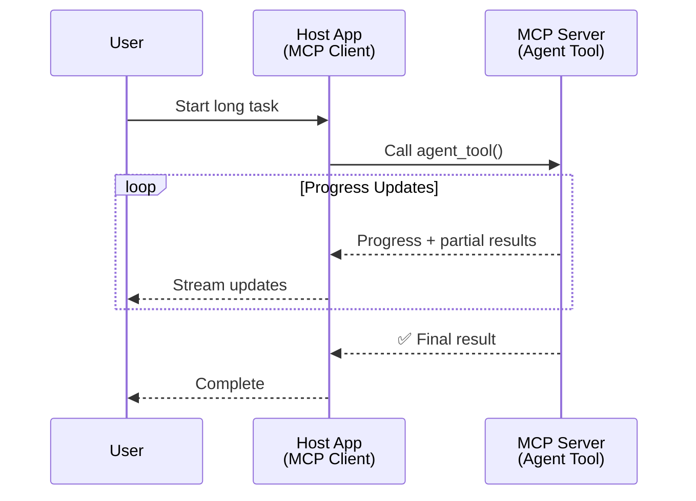
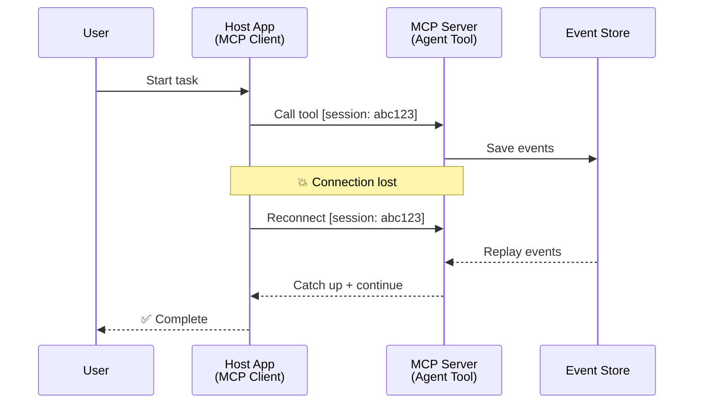
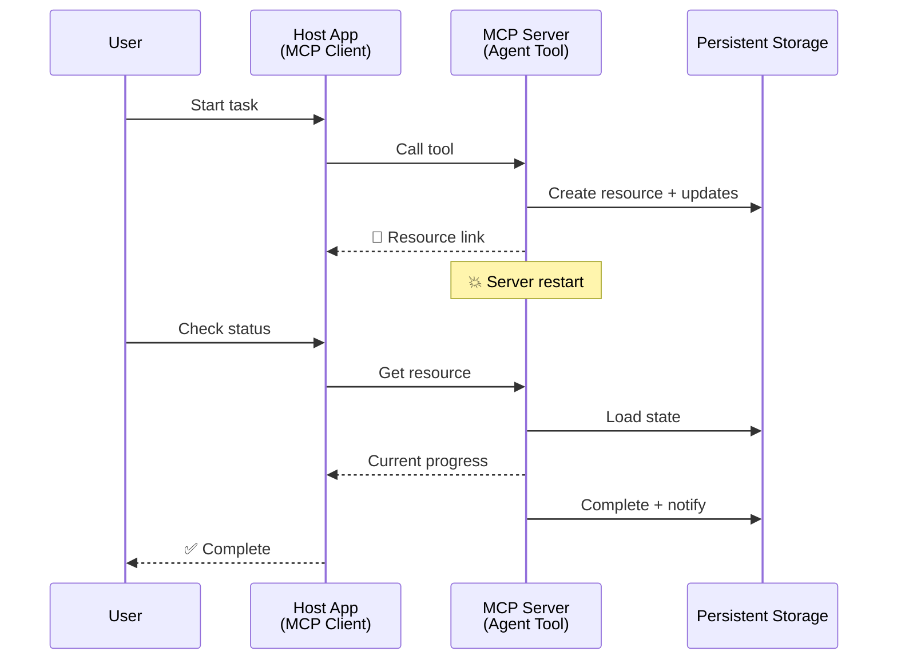
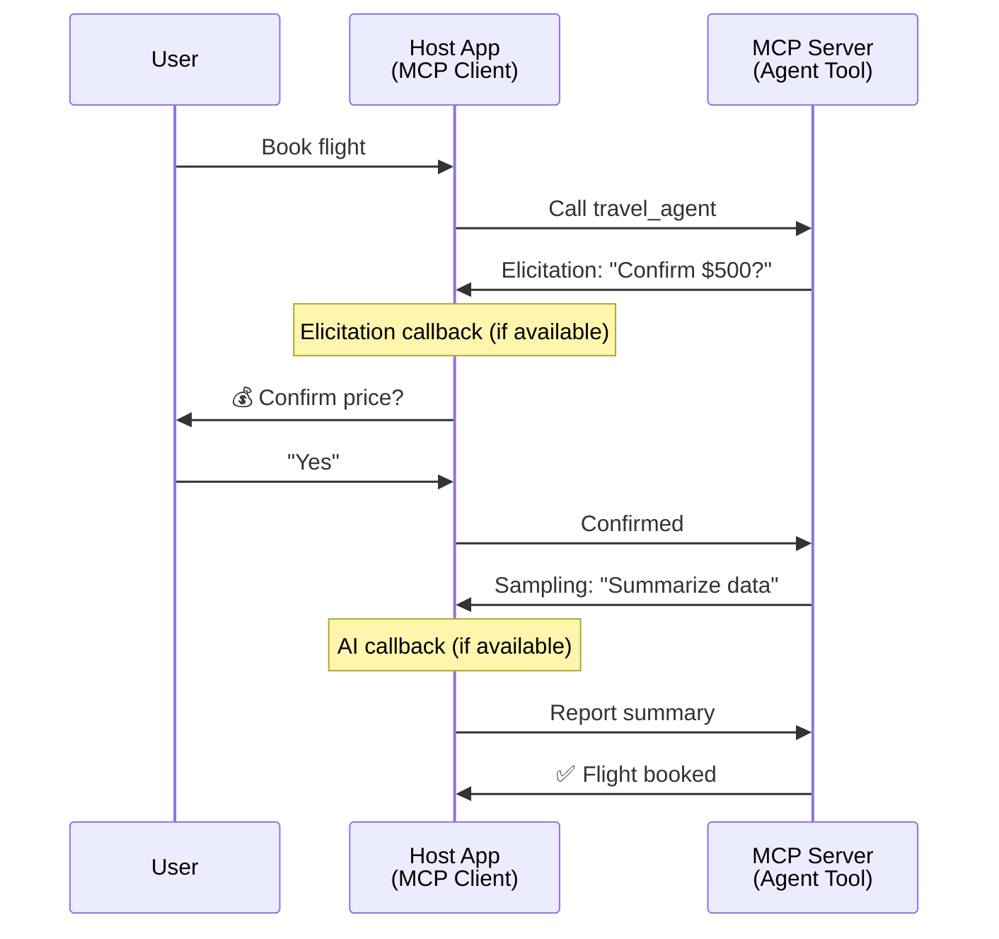
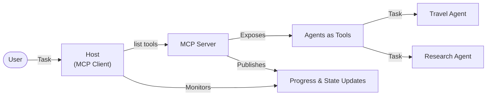

<!--
CO_OP_TRANSLATOR_METADATA:
{
  "original_hash": "5cc6836626047aa055e8960c8484a7d0",
  "translation_date": "2025-08-21T14:52:47+00:00",
  "source_file": "11-mcp/code_samples/mcp-agents/README.md",
  "language_code": "cs"
}
-->
# Budování systémů komunikace mezi agenty pomocí MCP

> Shrnutí - Můžete vytvořit komunikaci Agent2Agent na MCP? Ano!

MCP se výrazně vyvinul nad rámec svého původního cíle „poskytovat kontext LLM“. Díky nedávným vylepšením, jako jsou [obnovitelné streamy](https://modelcontextprotocol.io/docs/concepts/transports#resumability-and-redelivery), [vyžádání](https://modelcontextprotocol.io/specification/2025-06-18/client/elicitation), [sampling](https://modelcontextprotocol.io/specification/2025-06-18/client/sampling) a notifikace ([pokrok](https://modelcontextprotocol.io/specification/2025-06-18/basic/utilities/progress) a [zdroje](https://modelcontextprotocol.io/specification/2025-06-18/schema#resourceupdatednotification)), MCP nyní poskytuje robustní základ pro budování komplexních systémů komunikace mezi agenty.

## Mylná představa o agenta/nástroji

Jak stále více vývojářů zkoumá nástroje s agentními chováními (dlouhodobý běh, potřeba dodatečných vstupů během provádění atd.), často se objevuje mylná představa, že MCP není vhodný, zejména kvůli tomu, že rané příklady jeho primitivních nástrojů se zaměřovaly na jednoduché vzory požadavek-odpověď.

Tento pohled je zastaralý. Specifikace MCP byla v posledních měsících výrazně vylepšena o funkce, které uzavírají mezeru pro budování dlouhodobého agentního chování:

- **Streamování a částečné výsledky**: Aktualizace pokroku v reálném čase během provádění
- **Obnovitelnost**: Klienti se mohou znovu připojit a pokračovat po odpojení
- **Trvanlivost**: Výsledky přežijí restart serveru (např. prostřednictvím odkazů na zdroje)
- **Vícekolové interakce**: Interaktivní vstupy během provádění prostřednictvím vyžádání a sampling

Tyto funkce lze kombinovat k umožnění komplexních agentních a multi-agentních aplikací, vše nasazené na protokolu MCP.

Pro referenci budeme označovat agenta jako „nástroj“, který je dostupný na MCP serveru. To předpokládá existenci hostitelské aplikace, která implementuje MCP klienta, jenž navazuje relaci s MCP serverem a může volat agenta.

## Co dělá MCP nástroj „agentním“?

Než se pustíme do implementace, pojďme si ujasnit, jaké infrastrukturní schopnosti jsou potřebné k podpoře dlouhodobých agentů.

> Definujeme agenta jako entitu, která může autonomně fungovat po delší dobu, schopnou zvládat složité úkoly, které mohou vyžadovat více interakcí nebo úprav na základě zpětné vazby v reálném čase.

### 1. Streamování a částečné výsledky

Tradiční vzory požadavek-odpověď nefungují pro dlouhodobé úkoly. Agenti potřebují poskytovat:

- Aktualizace pokroku v reálném čase
- Mezičlánkové výsledky

**Podpora MCP**: Notifikace o aktualizaci zdrojů umožňují streamování částečných výsledků, i když to vyžaduje pečlivý návrh, aby se předešlo konfliktům s modelem 1:1 požadavek/odpověď JSON-RPC.

| Funkce                     | Případ použití                                                                                                                                                                       | Podpora MCP                                                                                |
| -------------------------- | ----------------------------------------------------------------------------------------------------------------------------------------------------------------------------------- | ------------------------------------------------------------------------------------------ |
| Aktualizace pokroku v reálném čase | Uživatel požádá o úkol migrace kódu. Agent streamuje pokrok: „10 % - Analýza závislostí... 25 % - Konverze TypeScript souborů... 50 % - Aktualizace importů...“          | ✅ Notifikace o pokroku                                                                  |
| Částečné výsledky            | Úkol „Vytvořit knihu“ streamuje částečné výsledky, např. 1) Náčrt dějové linie, 2) Seznam kapitol, 3) Každou kapitolu po dokončení. Hostitel může kontrolovat, zrušit nebo přesměrovat v jakékoli fázi. | ✅ Notifikace mohou být „rozšířeny“ o částečné výsledky viz návrhy na PR 383, 776 |

<div align="center" style="font-style: italic; font-size: 0.95em; margin-bottom: 0.5em;">
<strong>Obrázek 1:</strong> Tento diagram ilustruje, jak MCP agent streamuje aktualizace pokroku v reálném čase a částečné výsledky do hostitelské aplikace během dlouhodobého úkolu, což umožňuje uživateli sledovat provádění v reálném čase.
</div>



### 2. Obnovitelnost

Agenti musí zvládat přerušení sítě bez problémů:

- Znovu se připojit po odpojení klienta
- Pokračovat tam, kde skončili (znovu doručení zpráv)

**Podpora MCP**: MCP StreamableHTTP transport dnes podporuje obnovení relace a znovu doručení zpráv pomocí ID relace a ID poslední události. Důležitá poznámka zde je, že server musí implementovat EventStore, který umožňuje přehrávání událostí při opětovném připojení klienta.  
Poznámka: Existuje komunitní návrh (PR #975), který zkoumá transportně nezávislé obnovitelné streamy.

| Funkce      | Případ použití                                                                                                                                                   | Podpora MCP                                                                |
| ------------ | ---------------------------------------------------------------------------------------------------------------------------------------------------------- | -------------------------------------------------------------------------- |
| Obnovitelnost | Klient se odpojí během dlouhodobého úkolu. Po opětovném připojení relace pokračuje s přehráním zmeškaných událostí, pokračuje bez problémů tam, kde skončila. | ✅ StreamableHTTP transport s ID relace, přehráním událostí a EventStore |

<div align="center" style="font-style: italic; font-size: 0.95em; margin-bottom: 0.5em;">
<strong>Obrázek 2:</strong> Tento diagram ukazuje, jak MCP StreamableHTTP transport a EventStore umožňují bezproblémové obnovení relace: pokud se klient odpojí, může se znovu připojit a přehrát zmeškané události, pokračovat v úkolu bez ztráty pokroku.
</div>



### 3. Trvanlivost

Dlouhodobí agenti potřebují trvalý stav:

- Výsledky přežijí restart serveru
- Stav lze získat mimo relaci
- Sledování pokroku napříč relacemi

**Podpora MCP**: MCP nyní podporuje návratový typ Resource link pro volání nástrojů. Dnes je možný vzor navrhnout nástroj, který vytvoří zdroj a okamžitě vrátí odkaz na zdroj. Nástroj může pokračovat v řešení úkolu na pozadí a aktualizovat zdroj. Klient může na oplátku zvolit dotazování na stav tohoto zdroje, aby získal částečné nebo úplné výsledky (na základě toho, jaké aktualizace zdrojů server poskytuje) nebo se přihlásit k odběru zdroje pro aktualizace.

Jedno omezení zde je, že dotazování na zdroje nebo přihlášení k odběru aktualizací může spotřebovávat zdroje s dopady na škálování. Existuje otevřený komunitní návrh (včetně #992), který zkoumá možnost zahrnutí webhooků nebo triggerů, které server může volat, aby upozornil klienta/hostitelskou aplikaci na aktualizace.

| Funkce    | Případ použití                                                                                                                                        | Podpora MCP                                                        |
| ---------- | ----------------------------------------------------------------------------------------------------------------------------------------------- | ------------------------------------------------------------------ |
| Trvanlivost | Server se zhroutí během úkolu migrace dat. Výsledky a pokrok přežijí restart, klient může zkontrolovat stav a pokračovat z trvalého zdroje. | ✅ Odkazy na zdroje s trvalým úložištěm a notifikacemi o stavu |

Dnes je běžný vzor navrhnout nástroj, který vytvoří zdroj a okamžitě vrátí odkaz na zdroj. Nástroj může na pozadí řešit úkol, vydávat notifikace o zdrojích, které slouží jako aktualizace pokroku nebo zahrnují částečné výsledky, a aktualizovat obsah ve zdroji podle potřeby.

<div align="center" style="font-style: italic; font-size: 0.95em; margin-bottom: 0.5em;">
<strong>Obrázek 3:</strong> Tento diagram demonstruje, jak MCP agenti používají trvalé zdroje a notifikace o stavu k zajištění, že dlouhodobé úkoly přežijí restart serveru, což umožňuje klientům kontrolovat pokrok a získávat výsledky i po selhání.
</div>



### 4. Vícekolové interakce

Agenti často potřebují dodatečný vstup během provádění:

- Lidské upřesnění nebo schválení
- AI asistence pro složitá rozhodnutí
- Dynamické úpravy parametrů

**Podpora MCP**: Plně podporováno prostřednictvím sampling (pro AI vstup) a vyžádání (pro lidský vstup).

| Funkce                 | Případ použití                                                                                                                                     | Podpora MCP                                           |
| ----------------------- | -------------------------------------------------------------------------------------------------------------------------------------------- | ----------------------------------------------------- |
| Vícekolové interakce | Agent pro rezervaci cestování požádá uživatele o potvrzení ceny, poté požádá AI o shrnutí cestovních dat před dokončením transakce rezervace. | ✅ Vyžádání pro lidský vstup, sampling pro AI vstup |

<div align="center" style="font-style: italic; font-size: 0.95em; margin-bottom: 0.5em;">
<strong>Obrázek 4:</strong> Tento diagram ukazuje, jak MCP agenti mohou interaktivně vyžádat lidský vstup nebo požádat o AI asistenci během provádění, podporující složité, vícekolové pracovní postupy, jako jsou potvrzení a dynamické rozhodování.
</div>



## Implementace dlouhodobých agentů na MCP - Přehled kódu

V rámci tohoto článku poskytujeme [repozitář kódu](https://github.com/victordibia/ai-tutorials/tree/main/MCP%20Agents), který obsahuje kompletní implementaci dlouhodobých agentů pomocí MCP Python SDK s transportem StreamableHTTP pro obnovení relace a znovu doručení zpráv. Implementace demonstruje, jak lze schopnosti MCP kombinovat k umožnění sofistikovaných agentních chování.

Konkrétně implementujeme server se dvěma primárními nástroji agentů:

- **Agent pro cestování** - Simuluje službu rezervace cestování s potvrzením ceny prostřednictvím vyžádání
- **Agent pro výzkum** - Provádí výzkumné úkoly s AI asistovanými shrnutími prostřednictvím sampling

Oba agenti demonstrují aktualizace pokroku v reálném čase, interaktivní potvrzení a plné schopnosti obnovení relace.

### Klíčové koncepty implementace

Následující sekce ukazují implementaci agenta na straně serveru a zpracování hostitele na straně klienta pro každou schopnost:

#### Streamování a aktualizace pokroku - Stav úkolu v reálném čase

Streamování umožňuje agentům poskytovat aktualizace pokroku v reálném čase během dlouhodobých úkolů, udržovat uživatele informované o stavu úkolu a mezičlánkových výsledcích.

**Implementace na serveru (agent posílá notifikace o pokroku):**

```python
# From server/server.py - Travel agent sending progress updates
for i, step in enumerate(steps):
    await ctx.session.send_progress_notification(
        progress_token=ctx.request_id,
        progress=i * 25,
        total=100,
        message=step,
        related_request_id=str(ctx.request_id)
    )
    await anyio.sleep(2)  # Simulate work

# Alternative: Log messages for detailed step-by-step updates
await ctx.session.send_log_message(
    level="info",
    data=f"Processing step {current_step}/{steps} ({progress_percent}%)",
    logger="long_running_agent",
    related_request_id=ctx.request_id,
)
```

**Implementace na klientovi (hostitel přijímá aktualizace pokroku):**

```python
# From client/client.py - Client handling real-time notifications
async def message_handler(message) -> None:
    if isinstance(message, types.ServerNotification):
        if isinstance(message.root, types.LoggingMessageNotification):
            console.print(f"📡 [dim]{message.root.params.data}[/dim]")
        elif isinstance(message.root, types.ProgressNotification):
            progress = message.root.params
            console.print(f"🔄 [yellow]{progress.message} ({progress.progress}/{progress.total})[/yellow]")

# Register message handler when creating session
async with ClientSession(
    read_stream, write_stream,
    message_handler=message_handler
) as session:
```

#### Vyžádání - Požadování vstupu uživatele

Vyžádání umožňuje agentům požadovat vstup uživatele během provádění. To je zásadní pro potvrzení, upřesnění nebo schválení během dlouhodobých úkolů.

**Implementace na serveru (agent požaduje potvrzení):**

```python
# From server/server.py - Travel agent requesting price confirmation
elicit_result = await ctx.session.elicit(
    message=f"Please confirm the estimated price of $1200 for your trip to {destination}",
    requestedSchema=PriceConfirmationSchema.model_json_schema(),
    related_request_id=ctx.request_id,
)

if elicit_result and elicit_result.action == "accept":
    # Continue with booking
    logger.info(f"User confirmed price: {elicit_result.content}")
elif elicit_result and elicit_result.action == "decline":
    # Cancel the booking
    booking_cancelled = True
```

**Implementace na klientovi (hostitel poskytuje callback pro vyžádání):**

```python
# From client/client.py - Client handling elicitation requests
async def elicitation_callback(context, params):
    console.print(f"💬 Server is asking for confirmation:")
    console.print(f"   {params.message}")

    response = console.input("Do you accept? (y/n): ").strip().lower()

    if response in ['y', 'yes']:
        return types.ElicitResult(
            action="accept",
            content={"confirm": True, "notes": "Confirmed by user"}
        )
    else:
        return types.ElicitResult(
            action="decline",
            content={"confirm": False, "notes": "Declined by user"}
        )

# Register the callback when creating the session
async with ClientSession(
    read_stream, write_stream,
    elicitation_callback=elicitation_callback
) as session:
```

#### Sampling - Požadování AI asistence

Sampling umožňuje agentům požadovat asistenci LLM pro složitá rozhodnutí nebo generování obsahu během provádění. To umožňuje hybridní pracovní postupy člověk-AI.

**Implementace na serveru (agent požaduje AI asistenci):**

```python
# From server/server.py - Research agent requesting AI summary
sampling_result = await ctx.session.create_message(
    messages=[
        SamplingMessage(
            role="user",
            content=TextContent(type="text", text=f"Please summarize the key findings for research on: {topic}")
        )
    ],
    max_tokens=100,
    related_request_id=ctx.request_id,
)

if sampling_result and sampling_result.content:
    if sampling_result.content.type == "text":
        sampling_summary = sampling_result.content.text
        logger.info(f"Received sampling summary: {sampling_summary}")
```

**Implementace na klientovi (hostitel poskytuje callback pro sampling):**

```python
# From client/client.py - Client handling sampling requests
async def sampling_callback(context, params):
    message_text = params.messages[0].content.text if params.messages else 'No message'
    console.print(f"🧠 Server requested sampling: {message_text}")

    # In a real application, this could call an LLM API
    # For demo purposes, we provide a mock response
    mock_response = "Based on current research, MCP has evolved significantly..."

    return types.CreateMessageResult(
        role="assistant",
        content=types.TextContent(type="text", text=mock_response),
        model="interactive-client",
        stopReason="endTurn"
    )

# Register the callback when creating the session
async with ClientSession(
    read_stream, write_stream,
    sampling_callback=sampling_callback,
    elicitation_callback=elicitation_callback
) as session:
```

#### Obnovitelnost - Kontinuita relace při odpojení

Obnovitelnost zajišťuje, že dlouhodobé úkoly agentů mohou přežít odpojení klienta a pokračovat bez problémů při opětovném připojení. To je implementováno prostřednictvím EventStore a tokenů pro obnovení.

**Implementace EventStore (server uchovává stav relace):**

```python
# From server/event_store.py - Simple in-memory event store
class SimpleEventStore(EventStore):
    def __init__(self):
        self._events: list[tuple[StreamId, EventId, JSONRPCMessage]] = []
        self._event_id_counter = 0

    async def store_event(self, stream_id: StreamId, message: JSONRPCMessage) -> EventId:
        """Store an event and return its ID."""
        self._event_id_counter += 1
        event_id = str(self._event_id_counter)
        self._events.append((stream_id, event_id, message))
        return event_id

    async def replay_events_after(self, last_event_id: EventId, send_callback: EventCallback) -> StreamId | None:
        """Replay events after the specified ID for resumption."""
        # Find events after the last known event and replay them
        for _, event_id, message in self._events[start_index:]:
            await send_callback(EventMessage(message, event_id))

# From server/server.py - Passing event store to session manager
def create_server_app(event_store: Optional[EventStore] = None) -> Starlette:
    server = ResumableServer()

    # Create session manager with event store for resumption
    session_manager = StreamableHTTPSessionManager(
        app=server,
        event_store=event_store,  # Event store enables session resumption
        json_response=False,
        security_settings=security_settings,
    )

    return Starlette(routes=[Mount("/mcp", app=session_manager.handle_request)])

# Usage: Initialize with event store
event_store = SimpleEventStore()
app = create_server_app(event_store)
```

**Metadata klienta s tokenem pro obnovení (klient se znovu připojuje pomocí uloženého stavu):**

```python
# From client/client.py - Client resumption with metadata
if existing_tokens and existing_tokens.get("resumption_token"):
    # Use existing resumption token to continue where we left off
    metadata = ClientMessageMetadata(
        resumption_token=existing_tokens["resumption_token"],
    )
else:
    # Create callback to save resumption token when received
    def enhanced_callback(token: str):
        protocol_version = getattr(session, 'protocol_version', None)
        token_manager.save_tokens(session_id, token, protocol_version, command, args)

    metadata = ClientMessageMetadata(
        on_resumption_token_update=enhanced_callback,
    )

# Send request with resumption metadata
result = await session.send_request(
    types.ClientRequest(
        types.CallToolRequest(
            method="tools/call",
            params=types.CallToolRequestParams(name=command, arguments=args)
        )
    ),
    types.CallToolResult,
    metadata=metadata,
)
```

Hostitelská aplikace uchovává ID relace a tokeny pro obnovení lokálně, což jí umožňuje znovu se připojit k existujícím relacím bez ztráty pokroku nebo stavu.

### Organizace kódu

<div align="center" style="font-style: italic; font-size: 0.95em; margin-bottom: 0.5em;">
<strong>Obrázek 5:</strong> Architektura systému agentů založeného na MCP
</div>



**Klíčové soubory:**

- **`server/server.py`** - Obnovitelný MCP server s agenty pro cestování a výzkum, kteří demonstrují vyžádání, sampling a aktualizace pokroku
- **`client/client.py`** - Interaktivní hostitelská aplikace s podporou obnovení, callback handlery a správou tokenů
- **`server/event_store.py`** - Implementace EventStore umožňující obnovení relace a znovu doručení zpráv

## Rozšíření na komunikaci mezi více agenty na MCP

Výše uvedenou implementaci lze rozšířit na systémy více agentů vylepšením inteligence a rozsahu hostitelské aplikace:

- **Inteligentní rozklad úkolů**: Hostitel analyzuje složité požadavky uživatele a rozděluje je na dílčí úkoly pro různé specializované agenty
- **Koordinace mezi servery**: Hostitel udržuje připojení k více MCP serverům, z nichž každý poskytuje různé schopnosti agentů
- **Správa stavu úkolů**: Hostitel sleduje pokrok napříč více současnými úkoly agentů, zpracovává závislosti a sekvencování
- **Odolnost a opakování**: Hostitel spravuje selhání, implementuje logiku opakování a přesměrovává úkoly, když se agenti stanou nedostupnými
- **Syntéza výsledků**: Hostitel kombinuje výstupy od více agentů do koherentních konečných výsledků

Hostitel se vyvíjí z jednoduchého klienta na inteligentního orchestrátora, který koordinuje distribuované schopnosti agentů při zachování stejného základu protokolu MCP.

## Závěr

Vylepšené schopnosti MCP - notifikace o zdrojích, vyžádání/sampling, obnovitelné streamy a trvalé zdroje - umožňují komplexní interakce mezi agenty při zachování jednoduchosti protokolu.

## Začínáme

Připraveni vytvořit vlastní systém agent2agent? Postupujte podle těchto kroků:

### 1. Spusťte demo

```bash
# Start the server with event store for resumption
python -m server.server --port 8006

# In another terminal, run the interactive client
python -m client.client --url http://127.0.0.1:8006/mcp
```

**Dostupné příkazy v interaktivním režimu:**

- `travel_agent` - Rezervace cestování s potvrzením ceny prostřednictvím vyžádání
- `research_agent` - Výzkum témat s AI asistovanými shrnutími prostřednictvím sampling
- `list` - Zobrazit všechny dostupné nástroje
- `clean-tokens` - Vymazat tokeny pro obnovení
- `help` - Zobrazit podrobnou nápovědu k příkazům
- `quit` - Ukončit klienta

### 2. Otestujte schopnosti obnovení

- Spusťte dlouhodobého agenta (např. `travel_agent`)
- Přerušte klienta během provádění (Ctrl+C)
- Restartujte klienta - automat

**Prohlášení**:  
Tento dokument byl přeložen pomocí služby pro automatický překlad [Co-op Translator](https://github.com/Azure/co-op-translator). I když se snažíme o přesnost, mějte prosím na paměti, že automatické překlady mohou obsahovat chyby nebo nepřesnosti. Původní dokument v jeho původním jazyce by měl být považován za závazný zdroj. Pro důležité informace doporučujeme profesionální lidský překlad. Neodpovídáme za žádná nedorozumění nebo nesprávné interpretace vyplývající z použití tohoto překladu.