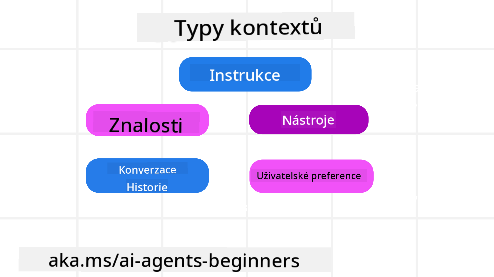
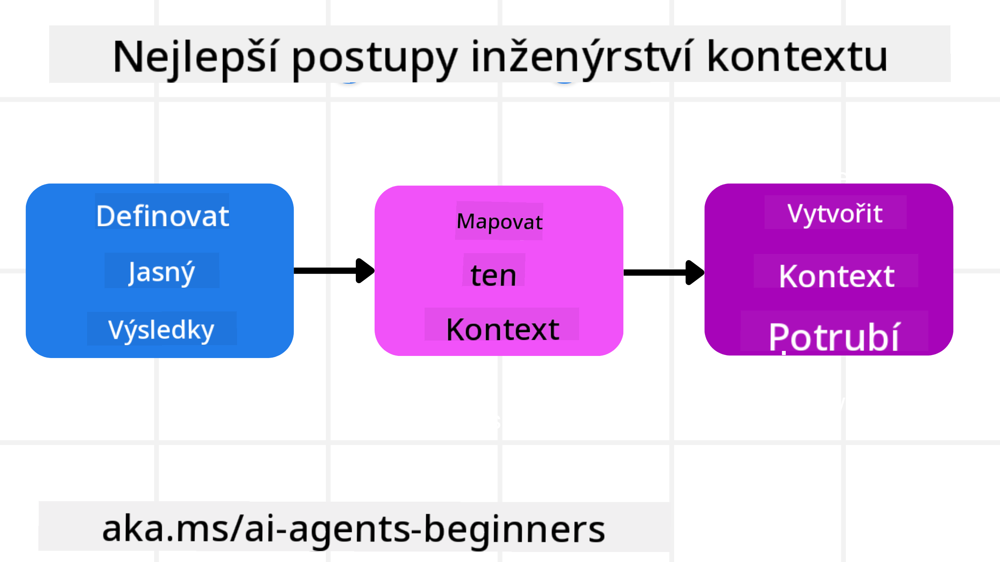

<!--
CO_OP_TRANSLATOR_METADATA:
{
  "original_hash": "cb7e50f471905ce6fdb92a30269a7a98",
  "translation_date": "2025-09-04T10:24:56+00:00",
  "source_file": "12-context-engineering/README.md",
  "language_code": "cs"
}
-->
# Kontextové inženýrství pro AI agenty

> _(Klikněte na obrázek výše pro zhlédnutí videa k této lekci)_

Pochopení složitosti aplikace, pro kterou vytváříte AI agenta, je klíčové pro vytvoření spolehlivého systému. Potřebujeme budovat AI agenty, kteří efektivně spravují informace, aby mohli řešit složité potřeby, které přesahují rámec pouhého návrhu promptů.

V této lekci se podíváme na to, co je kontextové inženýrství a jakou roli hraje při budování AI agentů.

## Úvod

Tato lekce pokryje:

• **Co je kontextové inženýrství** a proč se liší od návrhu promptů.

• **Strategie pro efektivní kontextové inženýrství**, včetně psaní, výběru, komprese a izolace informací.

• **Běžné chyby v kontextu**, které mohou vykolejit vašeho AI agenta, a jak je opravit.

## Cíle učení

Po dokončení této lekce budete rozumět tomu, jak:

• **Definovat kontextové inženýrství** a odlišit ho od návrhu promptů.

• **Identifikovat klíčové komponenty kontextu** v aplikacích s velkými jazykovými modely (LLM).

• **Aplikovat strategie pro psaní, výběr, kompresi a izolaci kontextu**, aby se zlepšil výkon agenta.

• **Rozpoznat běžné chyby v kontextu**, jako je otrava, rozptýlení, zmatení a konflikt, a implementovat techniky jejich zmírnění.

## Co je kontextové inženýrství?

Pro AI agenty je kontext tím, co řídí plánování jejich akcí. Kontextové inženýrství je praxe zajištění, že AI agent má správné informace k dokončení dalšího kroku úkolu. Kontextové okno je omezené svou velikostí, a proto jako tvůrci agentů musíme budovat systémy a procesy pro správu přidávání, odstraňování a zhušťování informací v tomto okně.

### Návrh promptů vs. Kontextové inženýrství

Návrh promptů se zaměřuje na jednu sadu statických instrukcí, které efektivně vedou AI agenty pomocí pravidel. Kontextové inženýrství se naopak zabývá správou dynamické sady informací, včetně počátečního promptu, aby agent měl v průběhu času vše, co potřebuje. Hlavní myšlenkou kontextového inženýrství je učinit tento proces opakovatelným a spolehlivým.

### Typy kontextu

Je důležité si uvědomit, že kontext není jen jedna věc. Informace, které AI agent potřebuje, mohou pocházet z různých zdrojů, a je na nás zajistit, aby měl agent k těmto zdrojům přístup:

Typy kontextu, které AI agent může potřebovat spravovat, zahrnují:

• **Instrukce:** To jsou "pravidla" agenta – prompty, systémové zprávy, příklady few-shot (ukázky, jak něco udělat) a popisy nástrojů, které může použít. Zde se návrh promptů prolíná s kontextovým inženýrstvím.

• **Znalosti:** Zahrnují fakta, informace získané z databází nebo dlouhodobé vzpomínky, které agent nashromáždil. To zahrnuje integraci systému Retrieval Augmented Generation (RAG), pokud agent potřebuje přístup k různým úložištím znalostí a databázím.

• **Nástroje:** Definice externích funkcí, API a MCP serverů, které agent může volat, spolu s výsledky, které z jejich použití získá.

• **Historie konverzace:** Probíhající dialog s uživatelem. Jak čas plyne, tyto konverzace se stávají delšími a složitějšími, což znamená, že zabírají více místa v kontextovém okně.

• **Preference uživatele:** Informace získané o uživatelových preferencích v průběhu času. Tyto informace mohou být využity při klíčových rozhodnutích, aby agent lépe vyhověl uživateli.

## Strategie pro efektivní kontextové inženýrství

### Plánovací strategie

Dobré kontextové inženýrství začíná dobrým plánováním. Zde je přístup, který vám pomůže začít přemýšlet o tom, jak aplikovat koncept kontextového inženýrství:

1. **Definujte jasné výsledky** – Výsledky úkolů, které budou AI agentům přiděleny, by měly být jasně definovány. Odpovězte na otázku: "Jak bude svět vypadat, až AI agent dokončí svůj úkol?" Jinými slovy, jakou změnu, informaci nebo odpověď by měl uživatel po interakci s AI agentem získat?

2. **Zmapujte kontext** – Jakmile definujete výsledky AI agenta, musíte odpovědět na otázku: "Jaké informace AI agent potřebuje k dokončení tohoto úkolu?" Tímto způsobem můžete začít mapovat kontext a určit, kde lze tyto informace nalézt.

3. **Vytvořte kontextové pipeline** – Nyní, když víte, kde se informace nacházejí, musíte odpovědět na otázku: "Jak agent tyto informace získá?" To lze provést různými způsoby, včetně RAG, použití MCP serverů a dalších nástrojů.

### Praktické strategie

Plánování je důležité, ale jakmile informace začnou proudit do kontextového okna agenta, je třeba mít praktické strategie pro jejich správu:

#### Správa kontextu

Zatímco některé informace budou do kontextového okna přidávány automaticky, kontextové inženýrství znamená aktivnější přístup k těmto informacím, což lze provést několika strategiemi:

1. **Agentův zápisník**  
Umožňuje AI agentovi zapisovat si relevantní informace o aktuálních úkolech a interakcích s uživatelem během jedné relace. Tyto informace by měly existovat mimo kontextové okno, například v souboru nebo runtime objektu, který agent může později během této relace znovu načíst, pokud to bude potřeba.

2. **Vzpomínky**  
Zápisníky jsou dobré pro správu informací mimo kontextové okno jedné relace. Vzpomínky umožňují agentům ukládat a načítat relevantní informace napříč více relacemi. To může zahrnovat souhrny, uživatelské preference a zpětnou vazbu pro budoucí zlepšení.

3. **Kompresování kontextu**  
Jakmile kontextové okno naroste a blíží se svému limitu, lze použít techniky jako sumarizace a ořezávání. To zahrnuje buď ponechání pouze nejrelevantnějších informací, nebo odstranění starších zpráv.

4. **Systémy s více agenty**  
Vývoj systému s více agenty je formou kontextového inženýrství, protože každý agent má své vlastní kontextové okno. Plánování, jak bude tento kontext sdílen a předáván mezi různými agenty, je dalším důležitým aspektem při budování těchto systémů.

5. **Sandboxová prostředí**  
Pokud agent potřebuje spustit nějaký kód nebo zpracovat velké množství informací v dokumentu, může to zabrat velké množství tokenů. Místo toho, aby byly všechny tyto informace uloženy v kontextovém okně, může agent použít sandboxové prostředí, které tento kód spustí, a do kontextu přidá pouze výsledky a další relevantní informace.

6. **Objekty runtime stavu**  
Toto se provádí vytvořením kontejnerů informací pro správu situací, kdy agent potřebuje přístup k určitým informacím. Pro složitý úkol by to umožnilo agentovi ukládat výsledky jednotlivých dílčích kroků, což by zajistilo, že kontext zůstane propojen pouze s konkrétním dílčím úkolem.

### Příklad kontextového inženýrství

Představme si, že chceme, aby AI agent **"zarezervoval výlet do Paříže."**

• Jednoduchý agent využívající pouze návrh promptů by mohl odpovědět: **"Dobře, kdy byste chtěli jet do Paříže?"**. Zpracoval by pouze váš přímý dotaz v okamžiku, kdy jste ho položili.

• Agent využívající strategie kontextového inženýrství by udělal mnohem více. Jeho systém by mohl před odpovědí:

  ◦ **Zkontrolovat váš kalendář** pro dostupné termíny (získání dat v reálném čase).

  ◦ **Připomenout si vaše minulé cestovní preference** (z dlouhodobé paměti), jako je preferovaná letecká společnost, rozpočet nebo preference přímých letů.

  ◦ **Identifikovat dostupné nástroje** pro rezervaci letů a hotelů.

- Poté by mohl odpovědět například: **"Ahoj [Vaše jméno]! Vidím, že máte volno první týden v říjnu. Mám hledat přímé lety do Paříže s [Preferovanou leteckou společností] v rámci vašeho obvyklého rozpočtu [Rozpočet]?"** Tento bohatší, kontextově uvědomělý přístup ukazuje sílu kontextového inženýrství.

## Běžné chyby v kontextu

### Otrava kontextu

**Co to je:** Když se do kontextu dostane halucinace (nepravdivá informace generovaná LLM) nebo chyba a opakovaně se na ni odkazuje, což způsobí, že agent sleduje nemožné cíle nebo vyvíjí nesmyslné strategie.

**Co dělat:** Implementujte **validaci kontextu** a **karanténu**. Validujte informace před jejich přidáním do dlouhodobé paměti. Pokud je detekována možná otrava, začněte nové kontextové vlákno, aby se špatné informace dále nešířily.

**Příklad rezervace cesty:** Váš agent si vymyslí **přímý let z malého místního letiště do vzdáleného mezinárodního města**, které ve skutečnosti nenabízí mezinárodní lety. Tento neexistující let se uloží do kontextu. Později, když požádáte agenta o rezervaci, stále se snaží najít letenky na tuto nemožnou trasu, což vede k opakovaným chybám.

**Řešení:** Implementujte krok, který **validuje existenci letu a tras pomocí API v reálném čase** _před_ přidáním detailů letu do pracovního kontextu agenta. Pokud validace selže, chybná informace je "dána do karantény" a dále se nepoužívá.

### Rozptýlení kontextu

**Co to je:** Když se kontext stane tak velkým, že se model příliš zaměřuje na nahromaděnou historii místo na to, co se naučil během tréninku, což vede k opakujícím se nebo neefektivním akcím. Modely mohou začít dělat chyby ještě před tím, než se kontextové okno naplní.

**Co dělat:** Použijte **sumarizaci kontextu**. Pravidelně komprimujte nahromaděné informace do kratších souhrnů, které zachovávají důležité detaily a odstraňují redundantní historii. To pomáhá "resetovat" zaměření.

**Příklad rezervace cesty:** Dlouho diskutujete o různých vysněných cestovních destinacích, včetně podrobného popisu vašeho batůžkářského výletu před dvěma lety. Když nakonec požádáte o **"najdi mi levný let na příští měsíc"**, agent se ztratí ve starých, irelevantních detailech a stále se ptá na vaše batůžkářské vybavení nebo minulé itineráře, místo aby se soustředil na váš aktuální požadavek.

**Řešení:** Po určitém počtu interakcí nebo když kontext naroste příliš, by měl agent **shrnovat nejnovější a nejrelevantnější části konverzace** – zaměřit se na vaše aktuální cestovní termíny a destinaci – a použít tento zhuštěný souhrn pro další volání LLM, přičemž méně relevantní historický chat odstraní.

### Zmatení kontextu

**Co to je:** Když nadbytečný kontext, často ve formě příliš mnoha dostupných nástrojů, způsobí, že model generuje špatné odpovědi nebo volá irelevantní nástroje. Menší modely jsou na to obzvláště náchylné.

**Co dělat:** Implementujte **správu nástrojového vybavení** pomocí technik RAG. Ukládejte popisy nástrojů do vektorové databáze a vybírejte _pouze_ ty nejrelevantnější nástroje pro konkrétní úkol. Výzkumy ukazují, že omezení výběru nástrojů na méně než 30 zlepšuje výkon.

**Příklad rezervace cesty:** Váš agent má přístup k desítkám nástrojů: `book_flight`, `book_hotel`, `rent_car`, `find_tours`, `currency_converter`, `weather_forecast`, `restaurant_reservations` atd. Požádáte: **"Jaký je nejlepší způsob, jak se pohybovat po Paříži?"** Kvůli velkému množství nástrojů se agent zmate a pokusí se volat `book_flight` _v rámci_ Paříže nebo `rent_car`, i když preferujete veřejnou dopravu, protože popisy nástrojů se mohou překrývat nebo agent jednoduše nedokáže rozlišit ten nejlepší.

**Řešení:** Použijte **RAG nad popisy nástrojů**. Když se ptáte na pohyb po Paříži, systém dynamicky načte _pouze_ ty nejrelevantnější nástroje, jako `rent_car` nebo `public_transport_info`, na základě vašeho dotazu, a předloží LLM zúžený "výběr" nástrojů.

### Konflikt v kontextu

**Co to je:** Když v kontextu existují protichůdné informace, což vede k nekonzistentnímu uvažování nebo špatným konečným odpovědím. To se často stává, když informace přicházejí ve fázích a počáteční, nesprávné předpoklady zůstávají v kontextu.

**Co dělat:** Použijte **prořezávání kontextu** a **odkládání**. Prořezávání znamená odstranění zastaralých nebo protichůdných informací, jakmile přijdou nové detaily. Odkládání poskytuje modelu samostatný "pracovní prostor" pro zpracování informací, aniž by zahlcoval hlavní kontext.

**Příklad rezervace cesty:** Nejprve řeknete agentovi: **"Chci letět ekonomickou třídou."** Později v konverzaci změníte názor a řeknete: **"Vlastně pro tento výlet zvolme byznys třídu."** Pokud obě instrukce zůstanou v kontextu, agent může obdržet protichůdné výsledky vyhledávání nebo se zmást, kterou preferenci upřednostnit.

**Řešení:** Implementujte **prořezávání kontextu**. Když nová instrukce odporuje staré, starší instrukce je odstraněna nebo explicitně přepsána v kontextu. Alternativně může agent použít **pracovní prostor**, aby nejprve vyřešil konfliktní preference, než rozhodne, a zajistil, že pouze konečná, konzistentní instrukce bude řídit jeho akce.

## Máte další otázky ohledně kontextového inženýrství?

Připojte se k [Azure AI Foundry Discord](https://aka.ms/ai-agents/discord), kde se můžete setkat s dalšími studenty, zúčastnit se konzultačních hodin a získat odpovědi na své otázky ohledně AI agentů.

---

**Prohlášení**:  
Tento dokument byl přeložen pomocí služby AI pro překlady [Co-op Translator](https://github.com/Azure/co-op-translator). Ačkoli se snažíme o přesnost, mějte prosím na paměti, že automatizované překlady mohou obsahovat chyby nebo nepřesnosti. Původní dokument v jeho původním jazyce by měl být považován za autoritativní zdroj. Pro důležité informace se doporučuje profesionální lidský překlad. Neodpovídáme za žádná nedorozumění nebo nesprávné interpretace vyplývající z použití tohoto překladu.