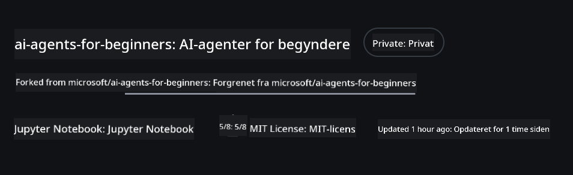
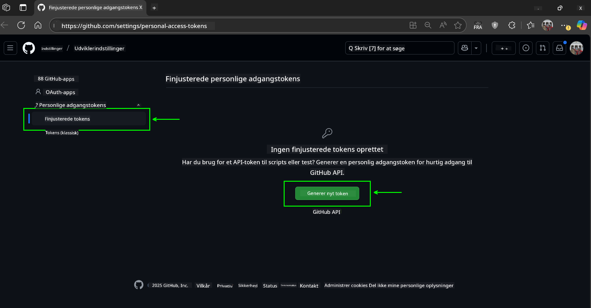
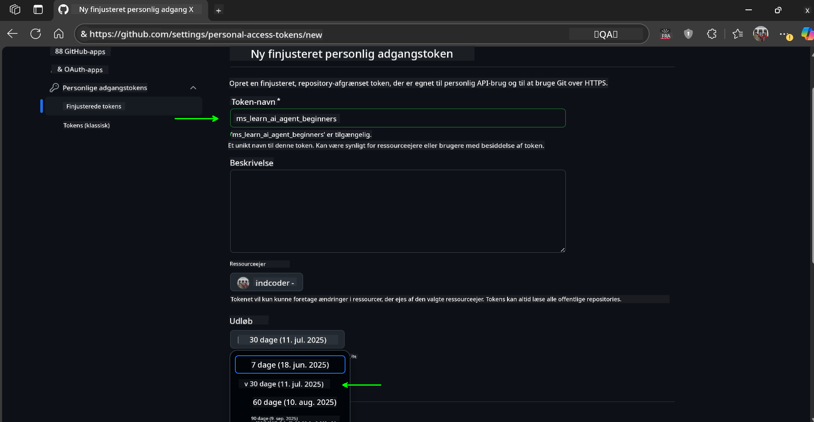
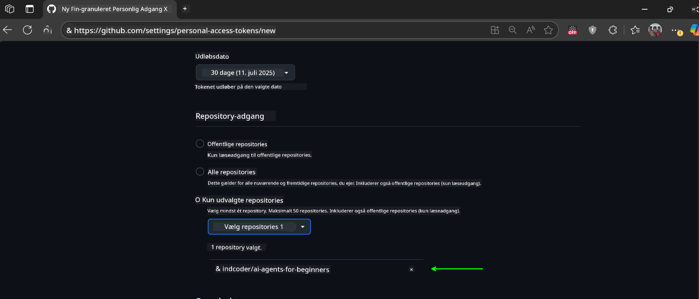
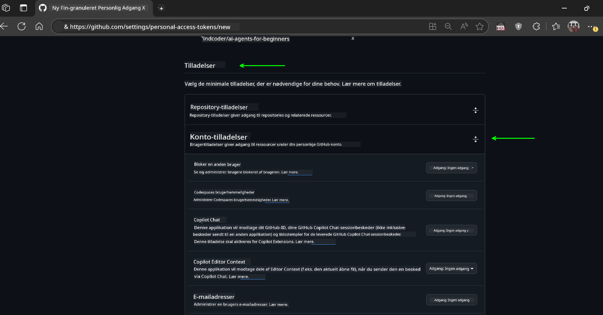
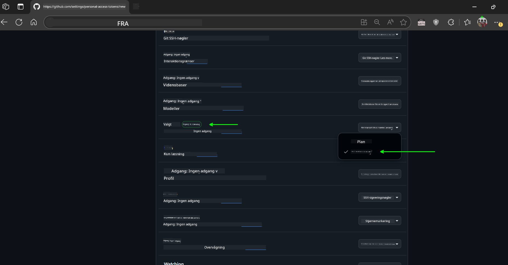
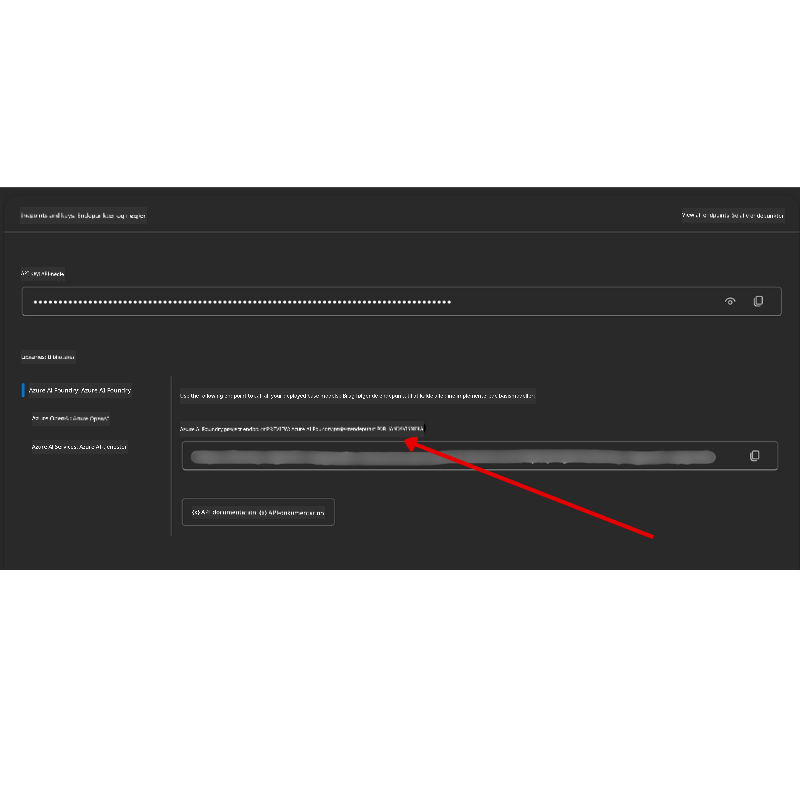

<!--
CO_OP_TRANSLATOR_METADATA:
{
  "original_hash": "c6a79c8f2b56a80370ff7e447765524f",
  "translation_date": "2025-07-23T08:50:04+00:00",
  "source_file": "00-course-setup/README.md",
  "language_code": "da"
}
-->
# Kursusopsætning

## Introduktion

Denne lektion dækker, hvordan du kan køre kodeeksemplerne fra dette kursus.

## Klon eller fork dette repo

For at komme i gang skal du klone eller forke GitHub-repositoriet. Dette giver dig din egen version af kursusmaterialet, så du kan køre, teste og tilpasse koden!

Dette kan gøres ved at klikke på linket til

Du bør nu have din egen forkede version af dette kursus på følgende link:



## Kør koden

Dette kursus tilbyder en række Jupyter Notebooks, som du kan køre for at få praktisk erfaring med at bygge AI-agenter.

Kodeeksemplerne bruger enten:

**Kræver GitHub-konto - Gratis**:

1) Semantic Kernel Agent Framework + GitHub Models Marketplace. Mærket som (semantic-kernel.ipynb)
2) AutoGen Framework + GitHub Models Marketplace. Mærket som (autogen.ipynb)

**Kræver Azure-abonnement**:
3) Azure AI Foundry + Azure AI Agent Service. Mærket som (azureaiagent.ipynb)

Vi opfordrer dig til at prøve alle tre typer eksempler for at se, hvilken der fungerer bedst for dig.

Uanset hvilken mulighed du vælger, vil det afgøre, hvilke opsætningsskridt du skal følge nedenfor:

## Krav

- Python 3.12+
  - **NOTE**: Hvis du ikke har Python 3.12 installeret, skal du sørge for at installere det. Opret derefter din venv ved hjælp af python3.12 for at sikre, at de korrekte versioner installeres fra requirements.txt-filen.
- En GitHub-konto - For adgang til GitHub Models Marketplace
- Azure-abonnement - For adgang til Azure AI Foundry
- Azure AI Foundry-konto - For adgang til Azure AI Agent Service

Vi har inkluderet en `requirements.txt`-fil i roden af dette repository, som indeholder alle de nødvendige Python-pakker for at køre kodeeksemplerne.

Du kan installere dem ved at køre følgende kommando i din terminal i roden af repositoriet:

```bash
pip install -r requirements.txt
```
Vi anbefaler at oprette et Python-virtuelt miljø for at undgå konflikter og problemer.

## Opsætning af VSCode
Sørg for, at du bruger den korrekte version af Python i VSCode.


## Opsætning til eksempler med GitHub-modeller

### Trin 1: Hent din GitHub Personal Access Token (PAT)

Dette kursus bruger GitHub Models Marketplace, som giver gratis adgang til Large Language Models (LLMs), som du vil bruge til at bygge AI-agenter.

For at bruge GitHub-modellerne skal du oprette en [GitHub Personal Access Token](https://docs.github.com/en/authentication/keeping-your-account-and-data-secure/managing-your-personal-access-tokens).

Dette kan gøres ved at gå til din GitHub-konto.

Følg venligst [Principle of Least Privilege](https://docs.github.com/en/get-started/learning-to-code/storing-your-secrets-safely), når du opretter din token. Det betyder, at du kun skal give tokenet de tilladelser, det har brug for til at køre kodeeksemplerne i dette kursus.

1. Vælg `Fine-grained tokens`-muligheden i venstre side af skærmen.

    Vælg derefter `Generate new token`.

    

1. Indtast et beskrivende navn til din token, der afspejler dens formål, så den er nem at identificere senere. Angiv en udløbsdato (anbefalet: 30 dage; du kan vælge en kortere periode som 7 dage, hvis du foretrækker en mere sikker tilgang).

    

1. Begræns tokenets rækkevidde til din fork af dette repository.

    

1. Begræns tokenets tilladelser: Under **Permissions**, aktiver **Account Permissions**, gå til **Models**, og aktiver kun den læseadgang, der kræves for GitHub-modeller.

    

    

Kopiér din nye token, som du lige har oprettet. Du skal nu tilføje denne til din `.env`-fil, der er inkluderet i dette kursus.

### Trin 2: Opret din `.env`-fil

For at oprette din `.env`-fil skal du køre følgende kommando i din terminal.

```bash
cp .env.example .env
```

Dette vil kopiere eksempel-filen og oprette en `.env` i din mappe, hvor du udfylder værdierne for miljøvariablerne.

Med din token kopieret, skal du åbne `.env`-filen i din foretrukne teksteditor og indsætte din token i `GITHUB_TOKEN`-feltet.

Du bør nu kunne køre kodeeksemplerne fra dette kursus.

## Opsætning til eksempler med Azure AI Foundry og Azure AI Agent Service

### Trin 1: Hent din Azure-projektendepunkt

Følg trinnene til at oprette en hub og et projekt i Azure AI Foundry, som findes her: [Hub resources overview](https://learn.microsoft.com/en-us/azure/ai-foundry/concepts/ai-resources)

Når du har oprettet dit projekt, skal du hente forbindelsesstrengen til dit projekt.

Dette kan gøres ved at gå til **Overview**-siden for dit projekt i Azure AI Foundry-portalen.



### Trin 2: Opret din `.env`-fil

For at oprette din `.env`-fil skal du køre følgende kommando i din terminal.

```bash
cp .env.example .env
```

Dette vil kopiere eksempel-filen og oprette en `.env` i din mappe, hvor du udfylder værdierne for miljøvariablerne.

Med din token kopieret, skal du åbne `.env`-filen i din foretrukne teksteditor og indsætte din token i `PROJECT_ENDPOINT`-feltet.

### Trin 3: Log ind på Azure

Som en sikkerhedsbedste praksis vil vi bruge [keyless authentication](https://learn.microsoft.com/azure/developer/ai/keyless-connections?tabs=csharp%2Cazure-cli?WT.mc_id=academic-105485-koreyst) til at autentificere til Azure OpenAI med Microsoft Entra ID.

Åbn derefter en terminal og kør `az login --use-device-code` for at logge ind på din Azure-konto.

Når du er logget ind, skal du vælge dit abonnement i terminalen.

## Yderligere miljøvariabler - Azure Search og Azure OpenAI

Til Agentic RAG-lektionen - Lektion 5 - er der eksempler, der bruger Azure Search og Azure OpenAI.

Hvis du vil køre disse eksempler, skal du tilføje følgende miljøvariabler til din `.env`-fil:

### Oversigtsside (Projekt)

- `AZURE_SUBSCRIPTION_ID` - Tjek **Project details** på **Overview**-siden for dit projekt.

- `AZURE_AI_PROJECT_NAME` - Se øverst på **Overview**-siden for dit projekt.

- `AZURE_OPENAI_SERVICE` - Find dette under **Included capabilities**-fanen for **Azure OpenAI Service** på **Overview**-siden.

### Management Center

- `AZURE_OPENAI_RESOURCE_GROUP` - Gå til **Project properties** på **Overview**-siden for **Management Center**.

- `GLOBAL_LLM_SERVICE` - Under **Connected resources**, find **Azure AI Services**-forbindelsesnavnet. Hvis det ikke er angivet, skal du tjekke **Azure portal** under din ressourcegruppe for AI Services-ressourcenavnet.

### Models + Endpoints Page

- `AZURE_OPENAI_EMBEDDING_DEPLOYMENT_NAME` - Vælg din embedding-model (f.eks. `text-embedding-ada-002`) og noter **Deployment name** fra modeldetaljerne.

- `AZURE_OPENAI_CHAT_DEPLOYMENT_NAME` - Vælg din chat-model (f.eks. `gpt-4o-mini`) og noter **Deployment name** fra modeldetaljerne.

### Azure Portal

- `AZURE_OPENAI_ENDPOINT` - Find **Azure AI services**, klik på det, gå derefter til **Resource Management**, **Keys and Endpoint**, scroll ned til "Azure OpenAI endpoints", og kopier den, der siger "Language APIs".

- `AZURE_OPENAI_API_KEY` - Fra samme skærm, kopier KEY 1 eller KEY 2.

- `AZURE_SEARCH_SERVICE_ENDPOINT` - Find din **Azure AI Search**-ressource, klik på den, og se **Overview**.

- `AZURE_SEARCH_API_KEY` - Gå derefter til **Settings** og derefter **Keys** for at kopiere den primære eller sekundære admin-nøgle.

### Ekstern webside

- `AZURE_OPENAI_API_VERSION` - Besøg [API version lifecycle](https://learn.microsoft.com/en-us/azure/ai-services/openai/api-version-deprecation#latest-ga-api-release)-siden under **Latest GA API release**.

### Opsætning af keyless authentication

I stedet for at hardkode dine legitimationsoplysninger, vil vi bruge en nøglefri forbindelse med Azure OpenAI. For at gøre dette vil vi importere `DefaultAzureCredential` og senere kalde `DefaultAzureCredential`-funktionen for at få legitimationsoplysningerne.

```python
from azure.identity import DefaultAzureCredential, InteractiveBrowserCredential
```

## Sidder du fast?

Hvis du har problemer med at køre denne opsætning, så hop ind i vores

## Næste lektion

Du er nu klar til at køre koden for dette kursus. God fornøjelse med at lære mere om AI-agenter!

[Introduktion til AI-agenter og agentanvendelser](../01-intro-to-ai-agents/README.md)

**Ansvarsfraskrivelse**:  
Dette dokument er blevet oversat ved hjælp af AI-oversættelsestjenesten [Co-op Translator](https://github.com/Azure/co-op-translator). Selvom vi bestræber os på nøjagtighed, skal det bemærkes, at automatiserede oversættelser kan indeholde fejl eller unøjagtigheder. Det originale dokument på dets oprindelige sprog bør betragtes som den autoritative kilde. For kritisk information anbefales professionel menneskelig oversættelse. Vi påtager os ikke ansvar for eventuelle misforståelser eller fejltolkninger, der måtte opstå som følge af brugen af denne oversættelse.