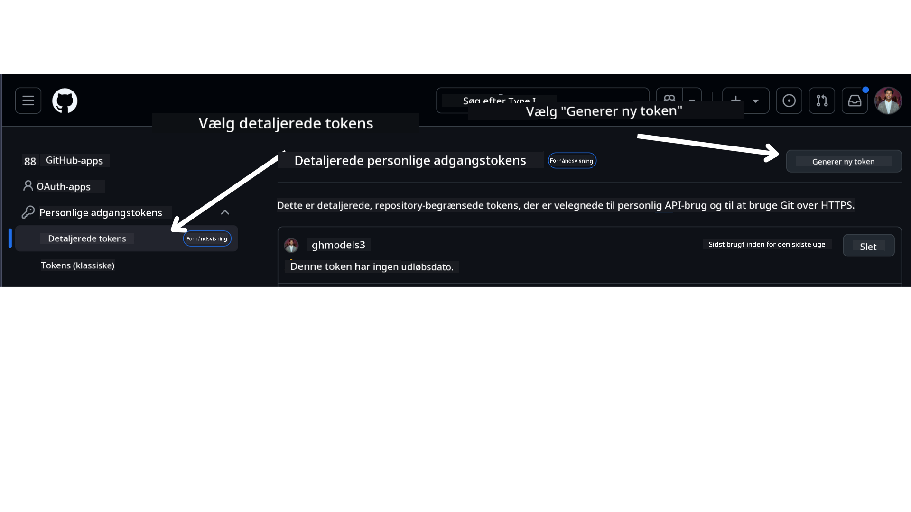

<!--
CO_OP_TRANSLATOR_METADATA:
{
  "original_hash": "76945069b52a49cd0432ae3e0b0ba22e",
  "translation_date": "2025-07-12T07:51:49+00:00",
  "source_file": "00-course-setup/README.md",
  "language_code": "da"
}
-->
i din GitHub-konto.

Vælg `Fine-grained tokens`-muligheden i venstre side af skærmen.

Vælg derefter `Generate new token`.



Du vil blive bedt om at indtaste et navn til din token, vælge udløbsdato (Anbefalet: 30 dage) og vælge omfanget for din token (Public Repositories).

Det er også nødvendigt at redigere tilladelserne for denne token: Permissions -> Models -> Tillader adgang til GitHub Models

Kopier din nye token, som du netop har oprettet. Du skal nu tilføje denne til din `.env`-fil, som er inkluderet i dette kursus.

### Trin 2: Opret din `.env`-fil

For at oprette din `.env`-fil skal du køre følgende kommando i din terminal.

```bash
cp .env.example .env
```

Dette kopierer eksempel-filen og opretter en `.env` i din mappe, hvor du kan udfylde værdierne for miljøvariablerne.

Når du har kopieret din token, skal du åbne `.env`-filen i din foretrukne teksteditor og indsætte din token i `GITHUB_TOKEN`-feltet.

Du burde nu kunne køre kodeeksemplerne i dette kursus.

## Opsætning til eksempler, der bruger Azure AI Foundry og Azure AI Agent Service

### Trin 1: Hent din Azure Project Endpoint

Følg trinene til at oprette et hub og projekt i Azure AI Foundry, som findes her: [Hub resources overview](https://learn.microsoft.com/en-us/azure/ai-foundry/concepts/ai-resources)

Når du har oprettet dit projekt, skal du hente forbindelsesstrengen til dit projekt.

Dette kan gøres ved at gå til **Overview**-siden for dit projekt i Azure AI Foundry-portalen.


### Trin 2: Opret din `.env`-fil

For at oprette din `.env`-fil skal du køre følgende kommando i din terminal.

```bash
cp .env.example .env
```

Dette kopierer eksempel-filen og opretter en `.env` i din mappe, hvor du kan udfylde værdierne for miljøvariablerne.

Når du har kopieret din token, skal du åbne `.env`-filen i din foretrukne teksteditor og indsætte din token i `PROJECT_ENDPOINT`-feltet.

### Trin 3: Log ind på Azure

Som en sikkerhedspraksis vil vi bruge [keyless authentication](https://learn.microsoft.com/azure/developer/ai/keyless-connections?tabs=csharp%2Cazure-cli?WT.mc_id=academic-105485-koreyst) til at autentificere mod Azure OpenAI med Microsoft Entra ID. Før du kan gøre dette, skal du først installere **Azure CLI** i henhold til [installationsvejledningen](https://learn.microsoft.com/cli/azure/install-azure-cli?WT.mc_id=academic-105485-koreyst) for dit operativsystem.

Åbn derefter en terminal og kør `az login --use-device-code` for at logge ind på din Azure-konto.

Når du er logget ind, skal du vælge dit abonnement i terminalen.

## Yderligere miljøvariabler - Azure Search og Azure OpenAI

For Agentic RAG-lektionen - Lektion 5 - findes der eksempler, der bruger Azure Search og Azure OpenAI.

Hvis du vil køre disse eksempler, skal du tilføje følgende miljøvariabler til din `.env`-fil:

### Oversigtsside (Projekt)

- `AZURE_SUBSCRIPTION_ID` - Findes under **Project details** på **Overview**-siden for dit projekt.

- `AZURE_AI_PROJECT_NAME` - Findes øverst på **Overview**-siden for dit projekt.

- `AZURE_OPENAI_SERVICE` - Findes under fanen **Included capabilities** for **Azure OpenAI Service** på **Overview**-siden.

### Management Center

- `AZURE_OPENAI_RESOURCE_GROUP` - Findes under **Project properties** på **Overview**-siden i **Management Center**.

- `GLOBAL_LLM_SERVICE` - Under **Connected resources** finder du navnet på forbindelsen til **Azure AI Services**. Hvis det ikke er opført, kan du tjekke i **Azure-portalen** under din resource group for navnet på AI Services-ressourcen.

### Models + Endpoints-side

- `AZURE_OPENAI_EMBEDDING_DEPLOYMENT_NAME` - Vælg din embedding-model (f.eks. `text-embedding-ada-002`) og noter **Deployment name** fra modeloplysningerne.

- `AZURE_OPENAI_CHAT_DEPLOYMENT_NAME` - Vælg din chat-model (f.eks. `gpt-4o-mini`) og noter **Deployment name** fra modeloplysningerne.

### Azure Portal

- `AZURE_OPENAI_ENDPOINT` - Find **Azure AI services**, klik på det, gå til **Resource Management**, **Keys and Endpoint**, rul ned til "Azure OpenAI endpoints" og kopier den, der hedder "Language APIs".

- `AZURE_OPENAI_API_KEY` - Fra samme skærm kopierer du NØGLE 1 eller NØGLE 2.

- `AZURE_SEARCH_SERVICE_ENDPOINT` - Find din **Azure AI Search**-ressource, klik på den, og se **Overview**.

- `AZURE_SEARCH_API_KEY` - Gå derefter til **Settings** og derefter **Keys** for at kopiere den primære eller sekundære admin-nøgle.

### Ekstern webside

- `AZURE_OPENAI_API_VERSION` - Besøg siden [API version lifecycle](https://learn.microsoft.com/en-us/azure/ai-services/openai/api-version-deprecation#latest-ga-api-release) under **Latest GA API release**.

### Opsæt keyless authentication

I stedet for at hardkode dine legitimationsoplysninger, bruger vi en keyless-forbindelse med Azure OpenAI. Til dette importerer vi `DefaultAzureCredential` og kalder senere funktionen `DefaultAzureCredential` for at hente legitimationsoplysningerne.

```python
from azure.identity import DefaultAzureCredential, InteractiveBrowserCredential
```

## Sidder du fast et sted?

Hvis du har problemer med at køre denne opsætning, så hop ind i vores

eller

.

## Næste lektion

Du er nu klar til at køre koden for dette kursus. God fornøjelse med at lære mere om AI-agenter!

[Introduction to AI Agents and Agent Use Cases](../01-intro-to-ai-agents/README.md)

**Ansvarsfraskrivelse**:  
Dette dokument er blevet oversat ved hjælp af AI-oversættelsestjenesten [Co-op Translator](https://github.com/Azure/co-op-translator). Selvom vi bestræber os på nøjagtighed, bedes du være opmærksom på, at automatiserede oversættelser kan indeholde fejl eller unøjagtigheder. Det oprindelige dokument på dets oprindelige sprog bør betragtes som den autoritative kilde. For kritisk information anbefales professionel menneskelig oversættelse. Vi påtager os intet ansvar for misforståelser eller fejltolkninger, der opstår som følge af brugen af denne oversættelse.