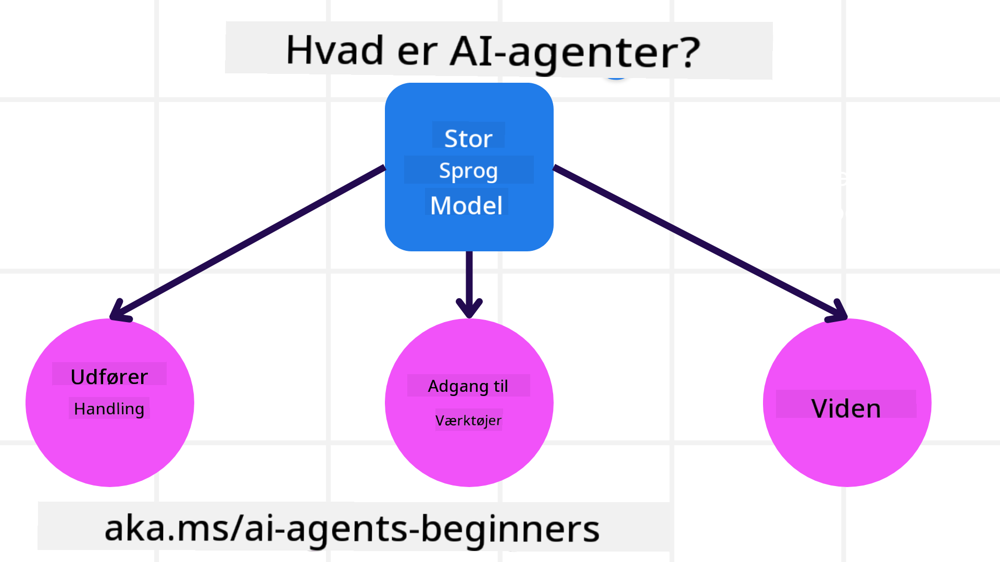
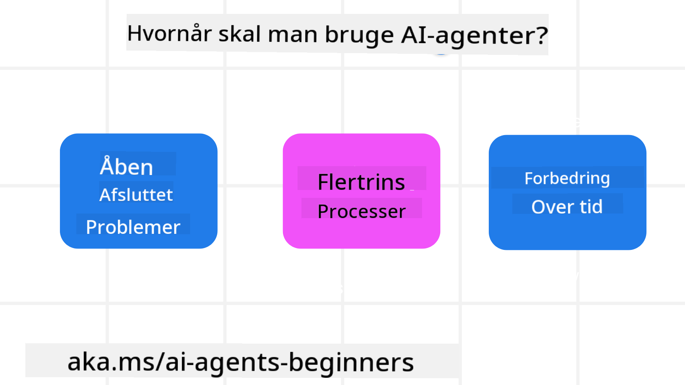

<!--
CO_OP_TRANSLATOR_METADATA:
{
  "original_hash": "d84943abc8f001ad4670418d32c2d899",
  "translation_date": "2025-07-12T08:07:58+00:00",
  "source_file": "01-intro-to-ai-agents/README.md",
  "language_code": "da"
}
-->
for at møde andre elever og AI Agent-udviklere og stille spørgsmål om dette kursus.

For at starte dette kursus begynder vi med at få en bedre forståelse af, hvad AI Agents er, og hvordan vi kan bruge dem i de applikationer og arbejdsgange, vi bygger.

## Introduktion

Denne lektion dækker:

- Hvad er AI Agents, og hvilke forskellige typer agenter findes der?
- Hvilke anvendelsestilfælde er bedst egnet til AI Agents, og hvordan kan de hjælpe os?
- Hvad er nogle af de grundlæggende byggesten, når man designer Agentiske løsninger?

## Læringsmål
Efter at have gennemført denne lektion bør du kunne:

- Forstå AI Agent-konceptet og hvordan det adskiller sig fra andre AI-løsninger.
- Anvende AI Agents mest effektivt.
- Designe Agentiske løsninger produktivt for både brugere og kunder.

## Definition af AI Agents og typer af AI Agents

### Hvad er AI Agents?

AI Agents er **systemer**, der gør det muligt for **Large Language Models (LLMs)** at **udføre handlinger** ved at udvide deres kapaciteter ved at give LLMs **adgang til værktøjer** og **viden**.

Lad os bryde denne definition ned i mindre dele:

- **System** - Det er vigtigt at tænke på agenter ikke bare som en enkelt komponent, men som et system bestående af mange komponenter. På det grundlæggende niveau består komponenterne i en AI Agent af:
  - **Miljø** - Det definerede rum, hvor AI Agenten opererer. For eksempel, hvis vi havde en rejsebookings-AI Agent, kunne miljøet være rejsebookingsystemet, som AI Agenten bruger til at udføre opgaver.
  - **Sensorer** - Miljøer indeholder information og giver feedback. AI Agents bruger sensorer til at indsamle og fortolke denne information om den aktuelle tilstand i miljøet. I rejsebookingsagent-eksemplet kan rejsebookingsystemet give information som hoteltilgængelighed eller flypriser.
  - **Aktuatorer** - Når AI Agenten modtager den aktuelle tilstand i miljøet, bestemmer agenten for den aktuelle opgave, hvilken handling der skal udføres for at ændre miljøet. For rejsebookingsagenten kan det være at booke et ledigt værelse til brugeren.

**Large Language Models** - Konceptet med agenter eksisterede før skabelsen af LLMs. Fordelen ved at bygge AI Agents med LLMs er deres evne til at fortolke menneskesprog og data. Denne evne gør det muligt for LLMs at fortolke miljøinformation og definere en plan for at ændre miljøet.

**Udføre handlinger** - Uden for AI Agent-systemer er LLMs begrænset til situationer, hvor handlingen er at generere indhold eller information baseret på en brugers prompt. Inden for AI Agent-systemer kan LLMs udføre opgaver ved at fortolke brugerens anmodning og bruge de værktøjer, der er tilgængelige i deres miljø.

**Adgang til værktøjer** - Hvilke værktøjer LLM har adgang til, defineres af 1) det miljø, det opererer i, og 2) udvikleren af AI Agenten. I vores rejseagent-eksempel er agentens værktøjer begrænset af de operationer, der er tilgængelige i bookingsystemet, og/eller kan udvikleren begrænse agentens adgang til værktøjer til flyrejser.

**Hukommelse + Viden** - Hukommelse kan være kortvarig i konteksten af samtalen mellem brugeren og agenten. På lang sigt, ud over den information, der leveres af miljøet, kan AI Agents også hente viden fra andre systemer, tjenester, værktøjer og endda andre agenter. I rejseagent-eksemplet kunne denne viden være information om brugerens rejsepræferencer, som findes i en kundedatabase.

### De forskellige typer agenter

Nu hvor vi har en generel definition af AI Agents, lad os se på nogle specifikke agenttyper og hvordan de kunne anvendes i en rejsebookings-AI agent.

| **Agenttype**                 | **Beskrivelse**                                                                                                                      | **Eksempel**                                                                                                                                                                                                                  |
| ----------------------------- | ----------------------------------------------------------------------------------------------------------------------------------- | ---------------------------------------------------------------------------------------------------------------------------------------------------------------------------------------------------------------------------- |
| **Simple Reflex Agents**      | Udfører øjeblikkelige handlinger baseret på foruddefinerede regler.                                                                 | Rejseagenten fortolker konteksten i en e-mail og videresender rejseklager til kundeservice.                                                                                                                                    |
| **Model-Based Reflex Agents** | Udfører handlinger baseret på en model af verden og ændringer i denne model.                                                        | Rejseagenten prioriterer ruter med betydelige prisændringer baseret på adgang til historiske prisdata.                                                                                                                       |
| **Goal-Based Agents**         | Laver planer for at nå specifikke mål ved at fortolke målet og bestemme handlinger for at nå det.                                  | Rejseagenten booker en rejse ved at bestemme nødvendige rejsearrangementer (bil, offentlig transport, fly) fra den aktuelle placering til destinationen.                                                                       |
| **Utility-Based Agents**      | Overvejer præferencer og vejer afvejninger numerisk for at bestemme, hvordan mål bedst opnås.                                       | Rejseagenten maksimerer nytte ved at veje bekvemmelighed op mod pris ved booking af rejse.                                                                                                                                   |
| **Learning Agents**           | Forbedrer sig over tid ved at reagere på feedback og justere handlinger derefter.                                                  | Rejseagenten forbedres ved at bruge kundefeedback fra spørgeskemaer efter rejsen til at justere fremtidige bookinger.                                                                                                        |
| **Hierarchical Agents**       | Indeholder flere agenter i et lagdelt system, hvor højere niveau agenter opdeler opgaver i delopgaver for lavere niveau agenter.   | Rejseagenten annullerer en rejse ved at opdele opgaven i delopgaver (f.eks. annullering af specifikke bookinger) og lade lavere niveau agenter udføre dem, som rapporterer tilbage til den højere niveau agent.                  |
| **Multi-Agent Systems (MAS)** | Agenter udfører opgaver uafhængigt, enten samarbejdende eller konkurrerende.                                                       | Samarbejdende: Flere agenter booker specifikke rejsetjenester som hoteller, fly og underholdning. Konkurrerende: Flere agenter administrerer og konkurrerer om en delt hotelbookingskalender for at booke kunder ind på hotellet. |

## Hvornår skal man bruge AI Agents

I det tidligere afsnit brugte vi rejseagent-eksemplet til at forklare, hvordan de forskellige typer agenter kan bruges i forskellige scenarier inden for rejsebooking. Vi vil fortsætte med at bruge denne applikation gennem hele kurset.

Lad os se på de typer anvendelsestilfælde, som AI Agents er bedst egnet til:

- **Åbne problemer** - hvor LLM får lov til at bestemme de nødvendige trin for at fuldføre en opgave, fordi det ikke altid kan hardkodes i en arbejdsgang.
- **Flertrinsprocesser** - opgaver, der kræver et niveau af kompleksitet, hvor AI Agenten skal bruge værktøjer eller information over flere omgange i stedet for enkeltstående opslag.
- **Forbedring over tid** - opgaver, hvor agenten kan forbedre sig over tid ved at modtage feedback fra enten sit miljø eller brugere for at levere bedre nytte.

Vi dækker flere overvejelser ved brug af AI Agents i lektionen om at bygge pålidelige AI Agents.

## Grundlæggende om Agentiske løsninger

### Agentudvikling

Det første skridt i designet af et AI Agent-system er at definere værktøjer, handlinger og adfærd. I dette kursus fokuserer vi på at bruge **Azure AI Agent Service** til at definere vores agenter. Det tilbyder funktioner som:

- Valg af åbne modeller som OpenAI, Mistral og Llama
- Brug af licenserede data gennem leverandører som Tripadvisor
- Brug af standardiserede OpenAPI 3.0-værktøjer

### Agentiske mønstre

Kommunikation med LLMs foregår via prompts. Givet AI Agents' semi-autonome natur er det ikke altid muligt eller nødvendigt manuelt at genprompt'e LLM efter en ændring i miljøet. Vi bruger **Agentiske mønstre**, der tillader os at prompt'e LLM over flere trin på en mere skalerbar måde.

Dette kursus er opdelt i nogle af de nuværende populære Agentiske mønstre.

### Agentiske frameworks

Agentiske frameworks giver udviklere mulighed for at implementere agentiske mønstre gennem kode. Disse frameworks tilbyder skabeloner, plugins og værktøjer til bedre samarbejde mellem AI Agents. Disse fordele giver bedre muligheder for overvågning og fejlfinding af AI Agent-systemer.

I dette kursus vil vi udforske det forskningsdrevne AutoGen-framework og det produktionsklare Agent-framework fra Semantic Kernel.

## Forrige lektion

[Course Setup](../00-course-setup/README.md)

## Næste lektion

[Exploring Agentic Frameworks](../02-explore-agentic-frameworks/README.md)

**Ansvarsfraskrivelse**:  
Dette dokument er blevet oversat ved hjælp af AI-oversættelsestjenesten [Co-op Translator](https://github.com/Azure/co-op-translator). Selvom vi bestræber os på nøjagtighed, bedes du være opmærksom på, at automatiserede oversættelser kan indeholde fejl eller unøjagtigheder. Det oprindelige dokument på dets oprindelige sprog bør betragtes som den autoritative kilde. For kritisk information anbefales professionel menneskelig oversættelse. Vi påtager os intet ansvar for misforståelser eller fejltolkninger, der opstår som følge af brugen af denne oversættelse.