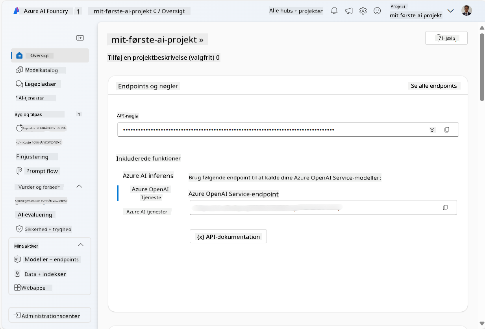
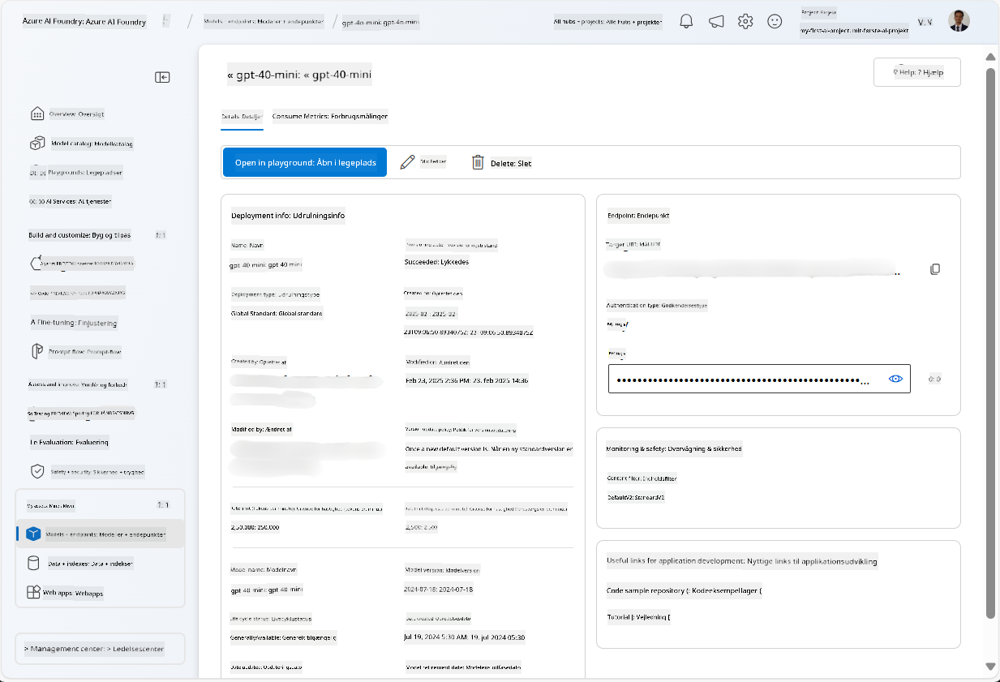
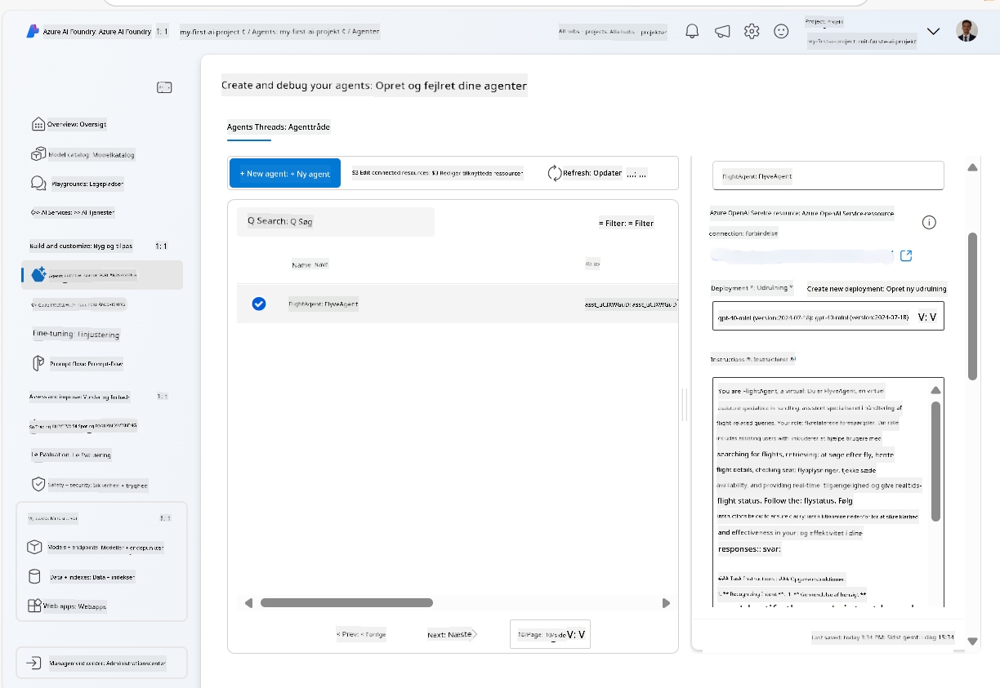
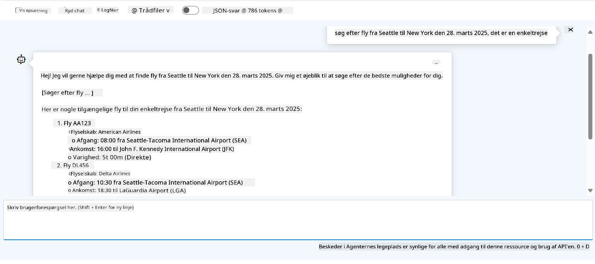

<!--
CO_OP_TRANSLATOR_METADATA:
{
  "original_hash": "7e92870dc0843e13d4dabc620c09d2d9",
  "translation_date": "2025-07-12T08:19:51+00:00",
  "source_file": "02-explore-agentic-frameworks/azure-ai-foundry-agent-creation.md",
  "language_code": "da"
}
-->
# Azure AI Agent Service Udvikling

I denne øvelse bruger du Azure AI Agent serviceværktøjerne i [Azure AI Foundry-portalen](https://ai.azure.com/?WT.mc_id=academic-105485-koreyst) til at oprette en agent til flybooking. Agenten vil kunne interagere med brugere og give information om flyrejser.

## Forudsætninger

For at gennemføre denne øvelse skal du have følgende:
1. En Azure-konto med et aktivt abonnement. [Opret en konto gratis](https://azure.microsoft.com/free/?WT.mc_id=academic-105485-koreyst).
2. Du skal have tilladelser til at oprette et Azure AI Foundry-hub eller have et oprettet for dig.
    - Hvis din rolle er Contributor eller Owner, kan du følge trinnene i denne vejledning.

## Opret et Azure AI Foundry-hub

> **Note:** Azure AI Foundry hed tidligere Azure AI Studio.

1. Følg disse retningslinjer fra [Azure AI Foundry](https://learn.microsoft.com/en-us/azure/ai-studio/?WT.mc_id=academic-105485-koreyst) blogindlægget for at oprette et Azure AI Foundry-hub.
2. Når dit projekt er oprettet, luk eventuelle tips, der vises, og gennemgå projektets side i Azure AI Foundry-portalen, som bør ligne billedet herunder:

    

## Udrul en model

1. I venstre rude for dit projekt, under **My assets**, vælg siden **Models + endpoints**.
2. På siden **Models + endpoints**, under fanen **Model deployments**, vælg i menuen **+ Deploy model** muligheden **Deploy base model**.
3. Søg efter modellen `gpt-4o-mini` i listen, vælg den og bekræft.

    > **Note**: At reducere TPM hjælper med at undgå overforbrug af den kvote, der er tilgængelig i det abonnement, du bruger.

    

## Opret en agent

Nu hvor du har udrullet en model, kan du oprette en agent. En agent er en samtale-AI-model, der kan bruges til at interagere med brugere.

1. I venstre rude for dit projekt, under **Build & Customize**, vælg siden **Agents**.
2. Klik på **+ Create agent** for at oprette en ny agent. Under dialogboksen **Agent Setup**:
    - Indtast et navn til agenten, f.eks. `FlightAgent`.
    - Sørg for, at den tidligere oprettede modeludrulning `gpt-4o-mini` er valgt.
    - Indstil **Instructions** i henhold til den prompt, du ønsker, at agenten skal følge. Her er et eksempel:
    ```
    You are FlightAgent, a virtual assistant specialized in handling flight-related queries. Your role includes assisting users with searching for flights, retrieving flight details, checking seat availability, and providing real-time flight status. Follow the instructions below to ensure clarity and effectiveness in your responses:

    ### Task Instructions:
    1. **Recognizing Intent**:
       - Identify the user's intent based on their request, focusing on one of the following categories:
         - Searching for flights
         - Retrieving flight details using a flight ID
         - Checking seat availability for a specified flight
         - Providing real-time flight status using a flight number
       - If the intent is unclear, politely ask users to clarify or provide more details.
        
    2. **Processing Requests**:
        - Depending on the identified intent, perform the required task:
        - For flight searches: Request details such as origin, destination, departure date, and optionally return date.
        - For flight details: Request a valid flight ID.
        - For seat availability: Request the flight ID and date and validate inputs.
        - For flight status: Request a valid flight number.
        - Perform validations on provided data (e.g., formats of dates, flight numbers, or IDs). If the information is incomplete or invalid, return a friendly request for clarification.

    3. **Generating Responses**:
    - Use a tone that is friendly, concise, and supportive.
    - Provide clear and actionable suggestions based on the output of each task.
    - If no data is found or an error occurs, explain it to the user gently and offer alternative actions (e.g., refine search, try another query).
    
    ```
> [!NOTE]
> For en detaljeret prompt kan du tjekke [dette repository](https://github.com/ShivamGoyal03/RoamMind) for mere information.
    
> Derudover kan du tilføje **Knowledge Base** og **Actions** for at forbedre agentens evner til at give mere information og udføre automatiserede opgaver baseret på brugerforespørgsler. Til denne øvelse kan du springe disse trin over.
    


3. For at oprette en ny multi-AI agent skal du blot klikke på **New Agent**. Den nyoprettede agent vises derefter på Agents-siden.

## Test agenten

Efter at have oprettet agenten kan du teste, hvordan den reagerer på brugerforespørgsler i Azure AI Foundry-portalen i playground.

1. Øverst i **Setup**-ruden for din agent, vælg **Try in playground**.
2. I **Playground**-ruden kan du interagere med agenten ved at skrive forespørgsler i chatvinduet. For eksempel kan du bede agenten om at søge efter fly fra Seattle til New York den 28.

    > **Note**: Agenten giver muligvis ikke præcise svar, da der ikke bruges realtidsdata i denne øvelse. Formålet er at teste agentens evne til at forstå og svare på brugerforespørgsler baseret på de givne instruktioner.

    

3. Efter test af agenten kan du yderligere tilpasse den ved at tilføje flere intents, træningsdata og handlinger for at forbedre dens funktionalitet.

## Ryd op i ressourcer

Når du er færdig med at teste agenten, kan du slette den for at undgå yderligere omkostninger.
1. Åbn [Azure-portalen](https://portal.azure.com) og se indholdet af den ressourcegruppe, hvor du har udrullet hub-ressourcerne, der blev brugt i denne øvelse.
2. På værktøjslinjen vælg **Delete resource group**.
3. Indtast navnet på ressourcegruppen og bekræft, at du vil slette den.

## Ressourcer

- [Azure AI Foundry dokumentation](https://learn.microsoft.com/en-us/azure/ai-studio/?WT.mc_id=academic-105485-koreyst)
- [Azure AI Foundry portal](https://ai.azure.com/?WT.mc_id=academic-105485-koreyst)
- [Kom godt i gang med Azure AI Studio](https://techcommunity.microsoft.com/blog/educatordeveloperblog/getting-started-with-azure-ai-studio/4095602?WT.mc_id=academic-105485-koreyst)
- [Grundlæggende om AI-agenter på Azure](https://learn.microsoft.com/en-us/training/modules/ai-agent-fundamentals/?WT.mc_id=academic-105485-koreyst)
- [Azure AI Discord](https://aka.ms/AzureAI/Discord)

**Ansvarsfraskrivelse**:  
Dette dokument er blevet oversat ved hjælp af AI-oversættelsestjenesten [Co-op Translator](https://github.com/Azure/co-op-translator). Selvom vi bestræber os på nøjagtighed, bedes du være opmærksom på, at automatiserede oversættelser kan indeholde fejl eller unøjagtigheder. Det oprindelige dokument på dets oprindelige sprog bør betragtes som den autoritative kilde. For kritisk information anbefales professionel menneskelig oversættelse. Vi påtager os intet ansvar for misforståelser eller fejltolkninger, der opstår som følge af brugen af denne oversættelse.