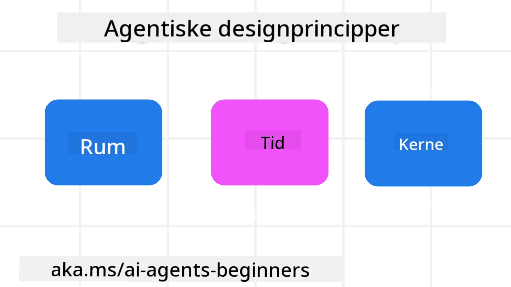

<!--
CO_OP_TRANSLATOR_METADATA:
{
  "original_hash": "4c46e4ff9e349c521e2b0b17f51afa64",
  "translation_date": "2025-08-29T15:44:38+00:00",
  "source_file": "03-agentic-design-patterns/README.md",
  "language_code": "da"
}
-->

> _(Klik på billedet ovenfor for at se videoen til denne lektion)_
# Principper for design af AI-agenter

## Introduktion

Der er mange måder at tænke på, når det gælder opbygning af AI-agent-systemer. Da tvetydighed er en funktion og ikke en fejl i designet af generativ AI, kan det nogle gange være svært for ingeniører at finde ud af, hvor de skal starte. Vi har skabt et sæt menneskecentrerede UX-designprincipper for at gøre det muligt for udviklere at bygge kundecentrerede agentsystemer, der kan løse deres forretningsbehov. Disse designprincipper er ikke en fastlagt arkitektur, men snarere et udgangspunkt for teams, der definerer og udvikler agentoplevelser.

Generelt bør agenter:

- Udvide og skalere menneskelige evner (idéudvikling, problemløsning, automatisering osv.)
- Udfylde videnshuller (hjælpe med at forstå vidensområder, oversættelse osv.)
- Fremme og understøtte samarbejde på de måder, vi som individer foretrækker at arbejde sammen med andre
- Gøre os til bedre versioner af os selv (f.eks. livscoach/opgavemester, hjælpe os med at lære følelsesmæssig regulering og mindfulness-færdigheder, opbygge modstandskraft osv.)

## Denne lektion vil dække

- Hvad er principperne for design af agenter
- Hvilke retningslinjer skal følges, når disse designprincipper implementeres
- Eksempler på brug af designprincipperne

## Læringsmål

Efter at have gennemført denne lektion vil du kunne:

1. Forklare, hvad principperne for design af agenter er
2. Forklare retningslinjerne for brug af principperne for design af agenter
3. Forstå, hvordan man bygger en agent ved hjælp af principperne for design af agenter

## Principperne for design af agenter

### Agent (Rum)

Dette er det miljø, hvor agenten opererer. Disse principper informerer om, hvordan vi designer agenter til at engagere sig i fysiske og digitale verdener.

- **Forbinder, ikke erstatter** – hjælper med at forbinde mennesker med andre mennesker, begivenheder og handlingsorienteret viden for at muliggøre samarbejde og forbindelse.
- Agenter hjælper med at forbinde begivenheder, viden og mennesker.
- Agenter bringer mennesker tættere sammen. De er ikke designet til at erstatte eller nedgøre mennesker.
- **Let tilgængelig, men lejlighedsvis usynlig** – agenten opererer hovedsageligt i baggrunden og giver kun et skub, når det er relevant og passende.
  - Agenten er let at finde og tilgængelig for autoriserede brugere på enhver enhed eller platform.
  - Agenten understøtter multimodale input og output (lyd, stemme, tekst osv.).
  - Agenten kan problemfrit skifte mellem forgrund og baggrund; mellem proaktiv og reaktiv, afhængigt af dens vurdering af brugerens behov.
  - Agenten kan operere i en usynlig form, men dens baggrundsproces og samarbejde med andre agenter er gennemsigtige og kontrollerbare for brugeren.

### Agent (Tid)

Dette handler om, hvordan agenten opererer over tid. Disse principper informerer om, hvordan vi designer agenter, der interagerer på tværs af fortid, nutid og fremtid.

- **Fortid**: Reflekterer over historik, der inkluderer både tilstand og kontekst.
  - Agenten leverer mere relevante resultater baseret på analyse af rigere historiske data ud over kun begivenheder, mennesker eller tilstande.
  - Agenten skaber forbindelser fra tidligere begivenheder og reflekterer aktivt over hukommelse for at engagere sig i aktuelle situationer.
- **Nutid**: Skubber mere end blot at notificere.
  - Agenten har en omfattende tilgang til at interagere med mennesker. Når en begivenhed sker, går agenten ud over statiske notifikationer eller andre formelle meddelelser. Agenten kan forenkle flows eller dynamisk generere signaler for at rette brugerens opmærksomhed på det rette tidspunkt.
  - Agenten leverer information baseret på kontekstuelle miljøer, sociale og kulturelle ændringer og tilpasset brugerens intention.
  - Agentens interaktion kan være gradvis, udvikle sig i kompleksitet for at styrke brugeren på lang sigt.
- **Fremtid**: Tilpasser sig og udvikler sig.
  - Agenten tilpasser sig forskellige enheder, platforme og modaliteter.
  - Agenten tilpasser sig brugeradfærd, tilgængelighedsbehov og er frit tilpasselig.
  - Agenten formes af og udvikler sig gennem kontinuerlig brugerinteraktion.

### Agent (Kerne)

Dette er de centrale elementer i en agents design.

- **Omfavn usikkerhed, men skab tillid**.
  - En vis grad af usikkerhed fra agenten er forventet. Usikkerhed er et nøgleelement i agentdesign.
  - Tillid og gennemsigtighed er fundamentale lag i agentdesign.
  - Mennesker har kontrol over, hvornår agenten er tændt/slukket, og agentens status er altid tydeligt synlig.

## Retningslinjer for implementering af disse principper

Når du bruger de tidligere designprincipper, skal du følge disse retningslinjer:

1. **Gennemsigtighed**: Informer brugeren om, at AI er involveret, hvordan det fungerer (inklusive tidligere handlinger), og hvordan man giver feedback og ændrer systemet.
2. **Kontrol**: Giv brugeren mulighed for at tilpasse, angive præferencer og personliggøre samt have kontrol over systemet og dets attributter (inklusive muligheden for at glemme).
3. **Konsistens**: Stræb efter konsistente, multimodale oplevelser på tværs af enheder og endepunkter. Brug velkendte UI/UX-elementer, hvor det er muligt (f.eks. mikrofonikon til stemmeinteraktion), og reducer kundens kognitive belastning så meget som muligt (f.eks. stræb efter korte svar, visuelle hjælpemidler og 'Lær mere'-indhold).

## Sådan designer du en rejseagent ved hjælp af disse principper og retningslinjer

Forestil dig, at du designer en rejseagent. Her er, hvordan du kunne tænke på at bruge designprincipperne og retningslinjerne:

1. **Gennemsigtighed** – Lad brugeren vide, at rejseagenten er en AI-drevet agent. Giv nogle grundlæggende instruktioner om, hvordan man kommer i gang (f.eks. en “Hej”-besked, eksempler på prompts). Dokumentér dette tydeligt på produktsiden. Vis listen over prompts, som brugeren tidligere har stillet. Gør det klart, hvordan man giver feedback (thumbs up og thumbs down, Send Feedback-knap osv.). Angiv tydeligt, hvis agenten har begrænsninger i brug eller emner.
2. **Kontrol** – Sørg for, at det er klart, hvordan brugeren kan ændre agenten, efter den er blevet oprettet, med ting som systemprompten. Giv brugeren mulighed for at vælge, hvor detaljeret agenten skal være, dens skrivestil, og eventuelle forbehold for, hvad agenten ikke skal tale om. Giv brugeren mulighed for at se og slette eventuelle tilknyttede filer eller data, prompts og tidligere samtaler.
3. **Konsistens** – Sørg for, at ikonerne for Del prompt, tilføj en fil eller et foto og tag en person eller noget er standard og genkendelige. Brug papirklipsikonet til at indikere filupload/deling med agenten og et billedeikon til at indikere grafikupload.

### Har du flere spørgsmål om designmønstre for AI-agenter?

Deltag i [Azure AI Foundry Discord](https://aka.ms/ai-agents/discord) for at møde andre lærende, deltage i kontortid og få svar på dine spørgsmål om AI-agenter.

## Yderligere ressourcer

- 

## Forrige lektion

[Udforskning af agentiske rammer](../02-explore-agentic-frameworks/README.md)

## Næste lektion

[Designmønster for værktøjsbrug](../04-tool-use/README.md)

---

**Ansvarsfraskrivelse**:  
Dette dokument er blevet oversat ved hjælp af AI-oversættelsestjenesten [Co-op Translator](https://github.com/Azure/co-op-translator). Selvom vi bestræber os på at sikre nøjagtighed, skal du være opmærksom på, at automatiserede oversættelser kan indeholde fejl eller unøjagtigheder. Det originale dokument på dets oprindelige sprog bør betragtes som den autoritative kilde. For kritisk information anbefales professionel menneskelig oversættelse. Vi påtager os ikke ansvar for eventuelle misforståelser eller fejltolkninger, der måtte opstå som følge af brugen af denne oversættelse.