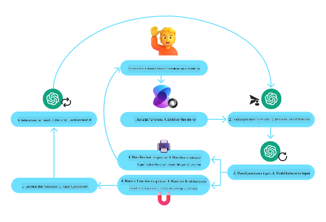
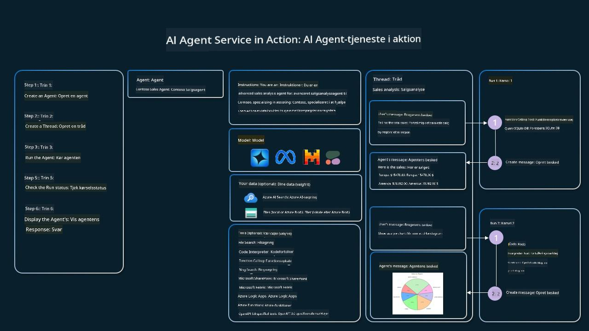

<!--
CO_OP_TRANSLATOR_METADATA:
{
  "original_hash": "88258b03f2893aa2e69eb8fb24baabbc",
  "translation_date": "2025-07-12T09:36:28+00:00",
  "source_file": "04-tool-use/README.md",
  "language_code": "da"
}
-->
[](https://youtu.be/vieRiPRx-gI?si=cEZ8ApnT6Sus9rhn)

> _(Klik på billedet ovenfor for at se videoen til denne lektion)_

# Tool Use Design Pattern

Værktøjer er interessante, fordi de giver AI-agenter en bredere vifte af muligheder. I stedet for at agenten kun har et begrænset sæt handlinger, den kan udføre, kan agenten med et værktøj nu udføre mange forskellige handlinger. I dette kapitel vil vi se på Tool Use Design Pattern, som beskriver, hvordan AI-agenter kan bruge specifikke værktøjer til at nå deres mål.

## Introduktion

I denne lektion vil vi besvare følgende spørgsmål:

- Hvad er tool use design pattern?
- Hvilke anvendelsestilfælde kan det bruges til?
- Hvilke elementer/byggesten er nødvendige for at implementere designmønstret?
- Hvilke særlige overvejelser er der ved brug af Tool Use Design Pattern til at bygge pålidelige AI-agenter?

## Læringsmål

Efter at have gennemført denne lektion vil du kunne:

- Definere Tool Use Design Pattern og dets formål.
- Identificere anvendelsestilfælde, hvor Tool Use Design Pattern er relevant.
- Forstå de vigtigste elementer, der er nødvendige for at implementere designmønstret.
- Genkende overvejelser for at sikre pålidelighed i AI-agenter, der bruger dette designmønster.

## Hvad er Tool Use Design Pattern?

**Tool Use Design Pattern** fokuserer på at give LLM’er mulighed for at interagere med eksterne værktøjer for at nå specifikke mål. Værktøjer er kode, som en agent kan udføre for at udføre handlinger. Et værktøj kan være en simpel funktion som en lommeregner eller et API-kald til en tredjepartstjeneste som aktiekursopslag eller vejrudsigt. I forbindelse med AI-agenter er værktøjer designet til at blive udført af agenter som svar på **modelgenererede funktionskald**.

## Hvilke anvendelsestilfælde kan det bruges til?

AI-agenter kan bruge værktøjer til at løse komplekse opgaver, hente information eller træffe beslutninger. Tool use design pattern anvendes ofte i scenarier, der kræver dynamisk interaktion med eksterne systemer som databaser, webtjenester eller kodefortolkere. Denne evne er nyttig i en række forskellige anvendelsestilfælde, herunder:

- **Dynamisk informationshentning:** Agenter kan forespørge eksterne API’er eller databaser for at hente opdaterede data (f.eks. forespørgsler til en SQLite-database til dataanalyse, hente aktiekurser eller vejrinformation).
- **Kodeudførelse og fortolkning:** Agenter kan køre kode eller scripts for at løse matematiske problemer, generere rapporter eller udføre simuleringer.
- **Automatisering af arbejdsgange:** Automatisering af gentagne eller flertrins arbejdsgange ved at integrere værktøjer som opgavestyring, e-mailtjenester eller datapipelines.
- **Kundesupport:** Agenter kan interagere med CRM-systemer, supportsystemer eller vidensdatabaser for at løse brugerhenvendelser.
- **Indholdsgenerering og redigering:** Agenter kan bruge værktøjer som grammatikkontrol, tekstopsummering eller indholdssikkerhedsvurdering til at hjælpe med opgaver inden for indholdsskabelse.

## Hvilke elementer/byggesten er nødvendige for at implementere tool use design pattern?

Disse byggesten gør det muligt for AI-agenten at udføre en bred vifte af opgaver. Lad os se på de vigtigste elementer, der er nødvendige for at implementere Tool Use Design Pattern:

- **Function/Tool Schemas**: Detaljerede definitioner af tilgængelige værktøjer, inklusive funktionsnavn, formål, nødvendige parametre og forventede output. Disse skemaer gør det muligt for LLM at forstå, hvilke værktøjer der er tilgængelige, og hvordan man konstruerer gyldige forespørgsler.

- **Function Execution Logic**: Styrer, hvordan og hvornår værktøjer kaldes baseret på brugerens intention og samtalekontekst. Dette kan inkludere planlægningsmoduler, routingmekanismer eller betingede flows, der dynamisk bestemmer brugen af værktøjer.

- **Message Handling System**: Komponenter, der håndterer samtaleforløbet mellem brugerinput, LLM-svar, værktøjskald og værktøjsoutput.

- **Tool Integration Framework**: Infrastruktur, der forbinder agenten med forskellige værktøjer, uanset om det er simple funktioner eller komplekse eksterne tjenester.

- **Error Handling & Validation**: Mekanismer til at håndtere fejl i værktøjsudførelse, validere parametre og håndtere uventede svar.

- **State Management**: Holder styr på samtalekontekst, tidligere værktøjsinteraktioner og vedvarende data for at sikre konsistens i flertrinsinteraktioner.

Lad os nu se nærmere på Function/Tool Calling.

### Function/Tool Calling

Funktionskald er den primære måde, hvorpå vi giver Large Language Models (LLM’er) mulighed for at interagere med værktøjer. Du vil ofte se 'Function' og 'Tool' brugt om hinanden, fordi 'funktioner' (genanvendelige kodeblokke) er de 'værktøjer', som agenter bruger til at udføre opgaver. For at en funktionskode kan blive kaldt, skal en LLM sammenligne brugerens forespørgsel med funktionens beskrivelse. Til dette sendes et skema med beskrivelser af alle tilgængelige funktioner til LLM’en. LLM’en vælger derefter den mest passende funktion til opgaven og returnerer dens navn og argumenter. Den valgte funktion kaldes, og dens svar sendes tilbage til LLM’en, som bruger informationen til at svare på brugerens forespørgsel.

For at udviklere kan implementere funktionskald for agenter, skal du bruge:

1. En LLM-model, der understøtter funktionskald
2. Et skema med funktionsbeskrivelser
3. Koden til hver beskrevet funktion

Lad os bruge eksemplet med at få det aktuelle klokkeslæt i en by til at illustrere:

1. **Initialiser en LLM, der understøtter funktionskald:**

    Ikke alle modeller understøtter funktionskald, så det er vigtigt at sikre, at den LLM, du bruger, gør det. <a href="https://learn.microsoft.com/azure/ai-services/openai/how-to/function-calling" target="_blank">Azure OpenAI</a> understøtter funktionskald. Vi kan starte med at initialisere Azure OpenAI-klienten.

    ```python
    # Initialize the Azure OpenAI client
    client = AzureOpenAI(
        azure_endpoint = os.getenv("AZURE_OPENAI_ENDPOINT"), 
        api_key=os.getenv("AZURE_OPENAI_API_KEY"),  
        api_version="2024-05-01-preview"
    )
    ```

1. **Opret et Function Schema**:

    Dernæst definerer vi et JSON-skema, der indeholder funktionsnavn, beskrivelse af hvad funktionen gør, samt navne og beskrivelser af funktionsparametrene. Vi sender derefter dette skema til klienten, som vi oprettede tidligere, sammen med brugerens forespørgsel om at finde tiden i San Francisco. Det vigtige at bemærke er, at et **tool call** er det, der returneres, **ikke** det endelige svar på spørgsmålet. Som nævnt tidligere returnerer LLM navnet på den funktion, den har valgt til opgaven, samt argumenterne, der skal sendes til den.

    ```python
    # Function description for the model to read
    tools = [
        {
            "type": "function",
            "function": {
                "name": "get_current_time",
                "description": "Get the current time in a given location",
                "parameters": {
                    "type": "object",
                    "properties": {
                        "location": {
                            "type": "string",
                            "description": "The city name, e.g. San Francisco",
                        },
                    },
                    "required": ["location"],
                },
            }
        }
    ]
    ```
   
    ```python
  
    # Initial user message
    messages = [{"role": "user", "content": "What's the current time in San Francisco"}] 
  
    # First API call: Ask the model to use the function
      response = client.chat.completions.create(
          model=deployment_name,
          messages=messages,
          tools=tools,
          tool_choice="auto",
      )
  
      # Process the model's response
      response_message = response.choices[0].message
      messages.append(response_message)
  
      print("Model's response:")  

      print(response_message)
  
    ```

    ```bash
    Model's response:
    ChatCompletionMessage(content=None, role='assistant', function_call=None, tool_calls=[ChatCompletionMessageToolCall(id='call_pOsKdUlqvdyttYB67MOj434b', function=Function(arguments='{"location":"San Francisco"}', name='get_current_time'), type='function')])
    ```
  
1. **Funktionskoden, der skal udføre opgaven:**

    Nu hvor LLM har valgt, hvilken funktion der skal køres, skal koden, der udfører opgaven, implementeres og eksekveres. Vi kan implementere koden til at hente det aktuelle klokkeslæt i Python. Vi skal også skrive koden til at udtrække navn og argumenter fra response_message for at få det endelige resultat.

    ```python
      def get_current_time(location):
        """Get the current time for a given location"""
        print(f"get_current_time called with location: {location}")  
        location_lower = location.lower()
        
        for key, timezone in TIMEZONE_DATA.items():
            if key in location_lower:
                print(f"Timezone found for {key}")  
                current_time = datetime.now(ZoneInfo(timezone)).strftime("%I:%M %p")
                return json.dumps({
                    "location": location,
                    "current_time": current_time
                })
      
        print(f"No timezone data found for {location_lower}")  
        return json.dumps({"location": location, "current_time": "unknown"})
    ```

    ```python
     # Handle function calls
      if response_message.tool_calls:
          for tool_call in response_message.tool_calls:
              if tool_call.function.name == "get_current_time":
     
                  function_args = json.loads(tool_call.function.arguments)
     
                  time_response = get_current_time(
                      location=function_args.get("location")
                  )
     
                  messages.append({
                      "tool_call_id": tool_call.id,
                      "role": "tool",
                      "name": "get_current_time",
                      "content": time_response,
                  })
      else:
          print("No tool calls were made by the model.")  
  
      # Second API call: Get the final response from the model
      final_response = client.chat.completions.create(
          model=deployment_name,
          messages=messages,
      )
  
      return final_response.choices[0].message.content
     ```

    ```bash
      get_current_time called with location: San Francisco
      Timezone found for san francisco
      The current time in San Francisco is 09:24 AM.
     ```

Funktionskald er kernen i de fleste, hvis ikke alle, agentværktøjsdesign, men det kan nogle gange være udfordrende at implementere det fra bunden. Som vi lærte i [Lesson 2](../../../02-explore-agentic-frameworks) giver agentiske frameworks os færdigbyggede byggesten til at implementere værktøjsbrug.

## Eksempler på Tool Use med agentiske frameworks

Her er nogle eksempler på, hvordan du kan implementere Tool Use Design Pattern ved hjælp af forskellige agentiske frameworks:

### Semantic Kernel

<a href="https://learn.microsoft.com/azure/ai-services/agents/overview" target="_blank">Semantic Kernel</a> er et open source AI-framework til .NET, Python og Java-udviklere, der arbejder med Large Language Models (LLM’er). Det forenkler processen med at bruge funktionskald ved automatisk at beskrive dine funktioner og deres parametre til modellen gennem en proces kaldet <a href="https://learn.microsoft.com/semantic-kernel/concepts/ai-services/chat-completion/function-calling/?pivots=programming-language-python#1-serializing-the-functions" target="_blank">serialisering</a>. Det håndterer også kommunikationen frem og tilbage mellem modellen og din kode. En anden fordel ved at bruge et agentisk framework som Semantic Kernel er, at det giver adgang til færdigbyggede værktøjer som <a href="https://github.com/microsoft/semantic-kernel/blob/main/python/samples/getting_started_with_agents/openai_assistant/step4_assistant_tool_file_search.py" target="_blank">File Search</a> og <a href="https://github.com/microsoft/semantic-kernel/blob/main/python/samples/getting_started_with_agents/openai_assistant/step3_assistant_tool_code_interpreter.py" target="_blank">Code Interpreter</a>.

Følgende diagram illustrerer processen med funktionskald i Semantic Kernel:



I Semantic Kernel kaldes funktioner/værktøjer <a href="https://learn.microsoft.com/semantic-kernel/concepts/plugins/?pivots=programming-language-python" target="_blank">Plugins</a>. Vi kan konvertere `get_current_time`-funktionen, vi så tidligere, til en plugin ved at gøre den til en klasse med funktionen indeni. Vi kan også importere `kernel_function`-dekorationen, som tager beskrivelsen af funktionen. Når du så opretter en kernel med GetCurrentTimePlugin, vil kernen automatisk serialisere funktionen og dens parametre og dermed skabe skemaet, der sendes til LLM’en.

```python
from semantic_kernel.functions import kernel_function

class GetCurrentTimePlugin:
    async def __init__(self, location):
        self.location = location

    @kernel_function(
        description="Get the current time for a given location"
    )
    def get_current_time(location: str = ""):
        ...

```

```python 
from semantic_kernel import Kernel

# Create the kernel
kernel = Kernel()

# Create the plugin
get_current_time_plugin = GetCurrentTimePlugin(location)

# Add the plugin to the kernel
kernel.add_plugin(get_current_time_plugin)
```
  
### Azure AI Agent Service

<a href="https://learn.microsoft.com/azure/ai-services/agents/overview" target="_blank">Azure AI Agent Service</a> er et nyere agentisk framework, der er designet til at give udviklere mulighed for sikkert at bygge, implementere og skalere AI-agenter af høj kvalitet og med udvidelsesmuligheder uden at skulle håndtere de underliggende compute- og lagringsressourcer. Det er særligt nyttigt til virksomhedsapplikationer, da det er en fuldt administreret service med sikkerhed på virksomhedsniveau.

Sammenlignet med at udvikle direkte med LLM API’en tilbyder Azure AI Agent Service nogle fordele, herunder:

- Automatisk værktøjskald – ingen grund til at parse et værktøjskald, kalde værktøjet og håndtere svaret; alt dette sker nu server-side
- Sikkert administrerede data – i stedet for at håndtere din egen samtalestatus kan du stole på threads til at gemme alle nødvendige oplysninger
- Værktøjer klar til brug – værktøjer, som du kan bruge til at interagere med dine datakilder, såsom Bing, Azure AI Search og Azure Functions.

De værktøjer, der er tilgængelige i Azure AI Agent Service, kan opdeles i to kategorier:

1. Knowledge Tools:
    - <a href="https://learn.microsoft.com/azure/ai-services/agents/how-to/tools/bing-grounding?tabs=python&pivots=overview" target="_blank">Grounding med Bing Search</a>
    - <a href="https://learn.microsoft.com/azure/ai-services/agents/how-to/tools/file-search?tabs=python&pivots=overview" target="_blank">File Search</a>
    - <a href="https://learn.microsoft.com/azure/ai-services/agents/how-to/tools/azure-ai-search?tabs=azurecli%2Cpython&pivots=overview-azure-ai-search" target="_blank">Azure AI Search</a>

2. Action Tools:
    - <a href="https://learn.microsoft.com/azure/ai-services/agents/how-to/tools/function-calling?tabs=python&pivots=overview" target="_blank">Function Calling</a>
    - <a href="https://learn.microsoft.com/azure/ai-services/agents/how-to/tools/code-interpreter?tabs=python&pivots=overview" target="_blank">Code Interpreter</a>
    - <a href="https://learn.microsoft.com/azure/ai-services/agents/how-to/tools/openapi-spec?tabs=python&pivots=overview" target="_blank">OpenAI definerede værktøjer</a>
    - <a href="https://learn.microsoft.com/azure/ai-services/agents/how-to/tools/azure-functions?pivots=overview" target="_blank">Azure Functions</a>

Agent Service gør det muligt at bruge disse værktøjer sammen som et `toolset`. Det benytter også `threads`, som holder styr på historikken af beskeder fra en bestemt samtale.

Forestil dig, at du er salgsagent hos et firma kaldet Contoso. Du ønsker at udvikle en samtaleagent, der kan besvare spørgsmål om dine salgsdata.

Følgende billede illustrerer, hvordan du kan bruge Azure AI Agent Service til at analysere dine salgsdata:



For at bruge nogle af disse værktøjer med servicen kan vi oprette en klient og definere et værktøj eller toolset. For at implementere dette praktisk kan vi bruge følgende Python-kode. LLM’en vil kunne se på toolset og beslutte, om den skal bruge den brugerdefinerede funktion `fetch_sales_data_using_sqlite_query` eller den færdigbyggede Code Interpreter, afhængigt af brugerens forespørgsel.

```python 
import os
from azure.ai.projects import AIProjectClient
from azure.identity import DefaultAzureCredential
from fecth_sales_data_functions import fetch_sales_data_using_sqlite_query # fetch_sales_data_using_sqlite_query function which can be found in a fetch_sales_data_functions.py file.
from azure.ai.projects.models import ToolSet, FunctionTool, CodeInterpreterTool

project_client = AIProjectClient.from_connection_string(
    credential=DefaultAzureCredential(),
    conn_str=os.environ["PROJECT_CONNECTION_STRING"],
)

# Initialize function calling agent with the fetch_sales_data_using_sqlite_query function and adding it to the toolset
fetch_data_function = FunctionTool(fetch_sales_data_using_sqlite_query)
toolset = ToolSet()
toolset.add(fetch_data_function)

# Initialize Code Interpreter tool and adding it to the toolset. 
code_interpreter = code_interpreter = CodeInterpreterTool()
toolset = ToolSet()
toolset.add(code_interpreter)

agent = project_client.agents.create_agent(
    model="gpt-4o-mini", name="my-agent", instructions="You are helpful agent", 
    toolset=toolset
)
```

## Hvilke særlige overvejelser er der ved brug af Tool Use Design Pattern til at bygge pålidelige AI-agenter?

En almindelig bekymring ved dynamisk genereret SQL fra LLM’er er sikkerhed, især risikoen for SQL-injektion eller ondsindede handlinger som at slette eller manipulere databasen. Selvom disse bekymringer er berettigede, kan de effektivt afbødes ved korrekt konfiguration af databaseadgangstilladelser. For de fleste databaser indebærer det at konfigurere databasen som skrivebeskyttet. For databaseservices som PostgreSQL eller Azure SQL bør appen tildeles en skrivebeskyttet (SELECT) rolle.

At køre appen i et sikkert miljø øger beskyttelsen yderligere. I virksomhedsscenarier udtrækkes og transformeres data typisk fra operationelle systemer til en skrivebeskyttet database eller datalager med et brugervenligt skema. Denne tilgang sikrer, at data er sikre, optimeret til ydeevne og tilgængelighed, og at appen har begrænset, skrivebeskyttet adgang.

## Yderligere ressourcer

-
<a href="https://microsoft.github.io/build-your-first-agent-with-azure-ai-agent-service-workshop/" target="_blank">
Azure AI Agents Service Workshop</a>
- <a href="https://github.com/Azure-Samples/contoso-creative-writer/tree/main/docs/workshop" target="_blank">Contoso Creative Writer Multi-Agent Workshop</a>
- <a href="https://learn.microsoft.com/semantic-kernel/concepts/ai-services/chat-completion/function-calling/?pivots=programming-language-python#1-serializing-the-functions" target="_blank">Semantic Kernel Function Calling Tutorial</a>
- <a href="https://github.com/microsoft/semantic-kernel/blob/main/python/samples/getting_started_with_agents/openai_assistant/step3_assistant_tool_code_interpreter.py" target="_blank">Semantic Kernel Code Interpreter</a>
- <a href="https://microsoft.github.io/autogen/dev/user-guide/core-user-guide/components/tools.html" target="_blank">Autogen Tools</a>

## Forrige lektion

[Forståelse af Agentic Design Patterns](../03-agentic-design-patterns/README.md)

## Næste lektion

[Agentic RAG](../05-agentic-rag/README.md)

**Ansvarsfraskrivelse**:  
Dette dokument er blevet oversat ved hjælp af AI-oversættelsestjenesten [Co-op Translator](https://github.com/Azure/co-op-translator). Selvom vi bestræber os på nøjagtighed, bedes du være opmærksom på, at automatiserede oversættelser kan indeholde fejl eller unøjagtigheder. Det oprindelige dokument på dets oprindelige sprog bør betragtes som den autoritative kilde. For kritisk information anbefales professionel menneskelig oversættelse. Vi påtager os intet ansvar for misforståelser eller fejltolkninger, der opstår som følge af brugen af denne oversættelse.