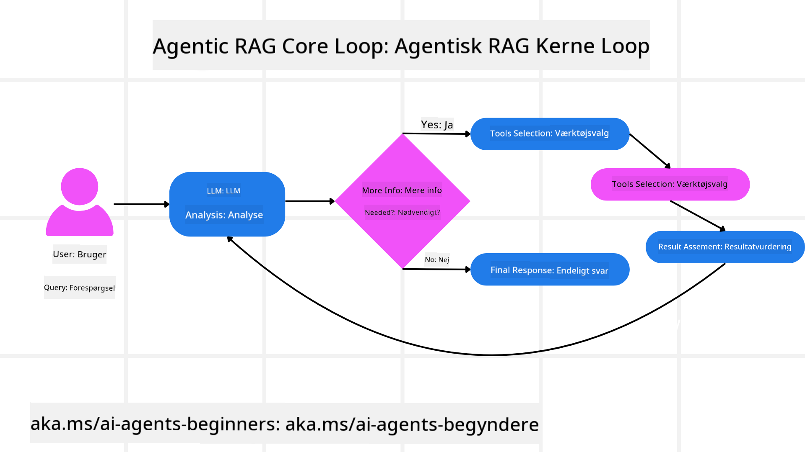
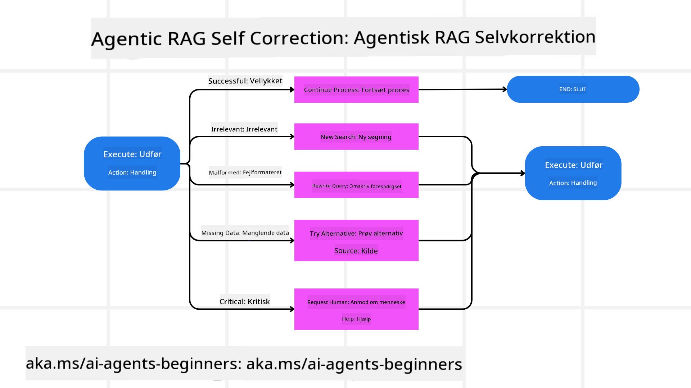
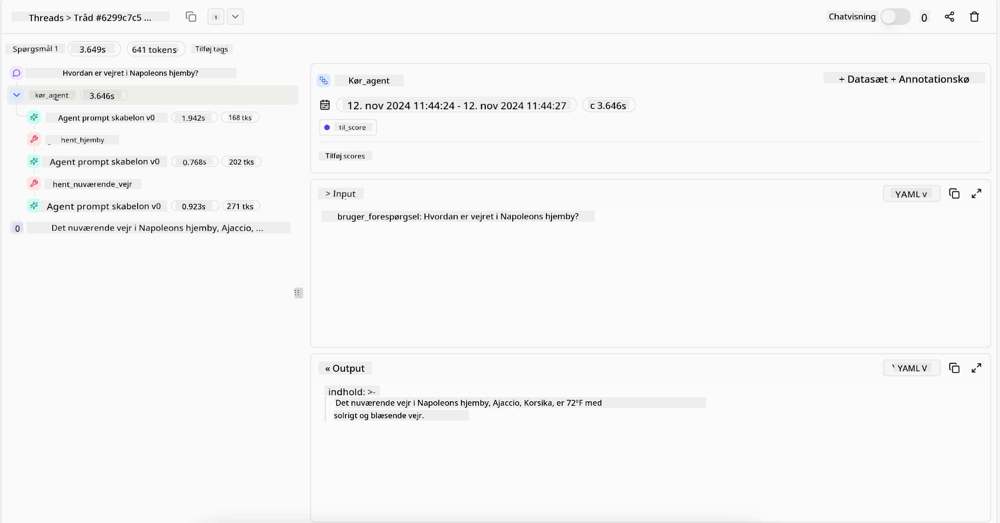
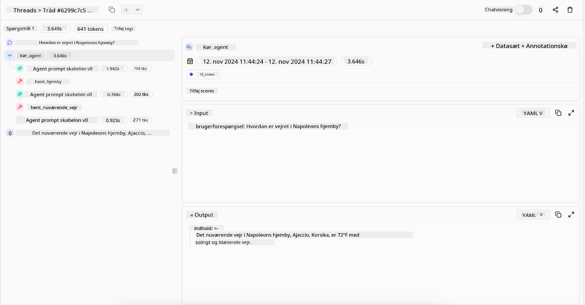

<!--
CO_OP_TRANSLATOR_METADATA:
{
  "original_hash": "7622aa72f9e676e593339f5f694ecd7d",
  "translation_date": "2025-07-12T10:04:48+00:00",
  "source_file": "05-agentic-rag/README.md",
  "language_code": "da"
}
-->

> _(Klik på billedet ovenfor for at se videoen til denne lektion)_

# Agentic RAG

Denne lektion giver en grundig gennemgang af Agentic Retrieval-Augmented Generation (Agentic RAG), et nyt AI-paradigme, hvor store sprogmodeller (LLMs) selvstændigt planlægger deres næste skridt, mens de henter information fra eksterne kilder. I modsætning til statiske retrieval-then-read mønstre involverer Agentic RAG iterative kald til LLM’en, afbrudt af værktøjs- eller funktionskald og strukturerede output. Systemet evaluerer resultater, forfiner forespørgsler, kalder yderligere værktøjer om nødvendigt og fortsætter denne cyklus, indtil en tilfredsstillende løsning er opnået.

## Introduktion

Denne lektion vil dække

- **Forstå Agentic RAG:** Lær om det nye paradigme i AI, hvor store sprogmodeller (LLMs) selvstændigt planlægger deres næste skridt, mens de henter information fra eksterne datakilder.
- **Forstå Iterativ Maker-Checker Stil:** Forstå løkken med iterative kald til LLM’en, afbrudt af værktøjs- eller funktionskald og strukturerede output, designet til at forbedre korrekthed og håndtere fejlbehæftede forespørgsler.
- **Udforsk Praktiske Anvendelser:** Identificer scenarier, hvor Agentic RAG udmærker sig, såsom miljøer med fokus på korrekthed, komplekse databaseinteraktioner og længerevarende workflows.

## Læringsmål

Efter at have gennemført denne lektion vil du kunne/forstå:

- **Forståelse af Agentic RAG:** Lær om det nye paradigme i AI, hvor store sprogmodeller (LLMs) selvstændigt planlægger deres næste skridt, mens de henter information fra eksterne datakilder.
- **Iterativ Maker-Checker Stil:** Forstå konceptet med en løkke af iterative kald til LLM’en, afbrudt af værktøjs- eller funktionskald og strukturerede output, designet til at forbedre korrekthed og håndtere fejlbehæftede forespørgsler.
- **At eje ræsonneringsprocessen:** Forstå systemets evne til at eje sin ræsonneringsproces og træffe beslutninger om, hvordan problemer skal angribes uden at være afhængig af foruddefinerede veje.
- **Workflow:** Forstå, hvordan en agentisk model selvstændigt beslutter at hente markedsrapporteringer, identificere konkurrentdata, korrelere interne salgsdata, syntetisere fund og evaluere strategien.
- **Iterative løkker, værktøjsintegration og hukommelse:** Lær om systemets afhængighed af et loopet interaktionsmønster, der opretholder tilstand og hukommelse på tværs af trin for at undgå gentagne løkker og træffe informerede beslutninger.
- **Håndtering af fejltilstande og selvkorrektion:** Udforsk systemets robuste selvkorrektionsmekanismer, herunder iteration og genforespørgsel, brug af diagnostiske værktøjer og tilbagefald til menneskelig overvågning.
- **Grænser for agency:** Forstå begrænsningerne ved Agentic RAG med fokus på domænespecifik autonomi, infrastrukturafhængighed og respekt for sikkerhedsforanstaltninger.
- **Praktiske anvendelsestilfælde og værdi:** Identificer scenarier, hvor Agentic RAG udmærker sig, såsom miljøer med fokus på korrekthed, komplekse databaseinteraktioner og længerevarende workflows.
- **Styring, gennemsigtighed og tillid:** Lær om vigtigheden af styring og gennemsigtighed, herunder forklarbar ræsonnering, bias-kontrol og menneskelig overvågning.

## Hvad er Agentic RAG?

Agentic Retrieval-Augmented Generation (Agentic RAG) er et nyt AI-paradigme, hvor store sprogmodeller (LLMs) selvstændigt planlægger deres næste skridt, mens de henter information fra eksterne kilder. I modsætning til statiske retrieval-then-read mønstre involverer Agentic RAG iterative kald til LLM’en, afbrudt af værktøjs- eller funktionskald og strukturerede output. Systemet evaluerer resultater, forfiner forespørgsler, kalder yderligere værktøjer om nødvendigt og fortsætter denne cyklus, indtil en tilfredsstillende løsning er opnået. Denne iterative “maker-checker” stil forbedrer korrekthed, håndterer fejlbehæftede forespørgsler og sikrer resultater af høj kvalitet.

Systemet ejer aktivt sin ræsonneringsproces, omskriver fejlede forespørgsler, vælger forskellige retrieval-metoder og integrerer flere værktøjer — såsom vektorsøgning i Azure AI Search, SQL-databaser eller brugerdefinerede API’er — før det færdiggør sit svar. Den afgørende egenskab ved et agentisk system er dets evne til at eje sin ræsonneringsproces. Traditionelle RAG-implementeringer er afhængige af foruddefinerede veje, men et agentisk system bestemmer selvstændigt rækkefølgen af skridt baseret på kvaliteten af den information, det finder.

## Definition af Agentic Retrieval-Augmented Generation (Agentic RAG)

Agentic Retrieval-Augmented Generation (Agentic RAG) er et nyt paradigme inden for AI-udvikling, hvor LLM’er ikke blot henter information fra eksterne datakilder, men også selvstændigt planlægger deres næste skridt. I modsætning til statiske retrieval-then-read mønstre eller nøje scriptede promptsekvenser involverer Agentic RAG en løkke af iterative kald til LLM’en, afbrudt af værktøjs- eller funktionskald og strukturerede output. Ved hvert trin evaluerer systemet de opnåede resultater, beslutter om det skal forfine sine forespørgsler, kalder yderligere værktøjer om nødvendigt og fortsætter denne cyklus, indtil det opnår en tilfredsstillende løsning.

Denne iterative “maker-checker” driftsstil er designet til at forbedre korrekthed, håndtere fejlbehæftede forespørgsler til strukturerede databaser (f.eks. NL2SQL) og sikre balancerede, resultater af høj kvalitet. I stedet for kun at stole på nøje udformede promptkæder ejer systemet aktivt sin ræsonneringsproces. Det kan omskrive forespørgsler, der fejler, vælge forskellige retrieval-metoder og integrere flere værktøjer — såsom vektorsøgning i Azure AI Search, SQL-databaser eller brugerdefinerede API’er — før det færdiggør sit svar. Dette fjerner behovet for alt for komplekse orkestreringsrammer. I stedet kan en relativt simpel løkke af “LLM-kald → værktøjsbrug → LLM-kald → …” give sofistikerede og velbegrundede output.

## At eje ræsonneringsprocessen

Den afgørende egenskab, der gør et system “agentisk”, er dets evne til at eje sin ræsonneringsproces. Traditionelle RAG-implementeringer er ofte afhængige af, at mennesker foruddefinerer en sti for modellen: en tankekæde, der skitserer, hvad der skal hentes og hvornår.  
Men når et system er virkelig agentisk, beslutter det internt, hvordan det skal angribe problemet. Det udfører ikke bare et script; det bestemmer selvstændigt rækkefølgen af skridt baseret på kvaliteten af den information, det finder.  
For eksempel, hvis det bliver bedt om at skabe en produktlanceringsstrategi, er det ikke kun afhængigt af en prompt, der beskriver hele forsknings- og beslutningsworkflowet. I stedet beslutter den agentiske model selvstændigt at:

1. Hente aktuelle markedsrapporteringer ved hjælp af Bing Web Grounding  
2. Identificere relevante konkurrentdata ved hjælp af Azure AI Search  
3. Koble historiske interne salgsdata sammen ved hjælp af Azure SQL Database  
4. Syntetisere fundene til en sammenhængende strategi orkestreret via Azure OpenAI Service  
5. Evaluere strategien for mangler eller inkonsistenser og om nødvendigt igangsætte endnu en runde retrieval  

Alle disse trin — forfining af forespørgsler, valg af kilder, iteration indtil “tilfredshed” med svaret — besluttes af modellen, ikke forudskrevet af et menneske.

## Iterative løkker, værktøjsintegration og hukommelse

Et agentisk system er afhængigt af et loopet interaktionsmønster:

- **Første kald:** Brugerens mål (dvs. brugerprompten) præsenteres for LLM’en.  
- **Værktøjskald:** Hvis modellen identificerer manglende information eller tvetydige instruktioner, vælger den et værktøj eller en retrieval-metode — som en vektordatabaseforespørgsel (f.eks. Azure AI Search Hybrid search over private data) eller et struktureret SQL-kald — for at indsamle mere kontekst.  
- **Vurdering & Forfining:** Efter at have gennemgået de returnerede data beslutter modellen, om informationen er tilstrækkelig. Hvis ikke, forfiner den forespørgslen, prøver et andet værktøj eller justerer sin tilgang.  
- **Gentag indtil tilfreds:** Denne cyklus fortsætter, indtil modellen vurderer, at den har nok klarhed og beviser til at levere et endeligt, velbegrundet svar.  
- **Hukommelse & Tilstand:** Fordi systemet opretholder tilstand og hukommelse på tværs af trin, kan det huske tidligere forsøg og deres resultater, undgå gentagne løkker og træffe mere informerede beslutninger undervejs.

Over tid skaber dette en følelse af en udviklende forståelse, der gør det muligt for modellen at navigere i komplekse, flertrinsopgaver uden konstant menneskelig indgriben eller behov for at omforme prompten.

## Håndtering af fejltilstande og selvkorrektion

Agentic RAG’s autonomi omfatter også robuste selvkorrektionsmekanismer. Når systemet støder på blindgyder — som at hente irrelevante dokumenter eller møde fejlbehæftede forespørgsler — kan det:

- **Iterere og genforespørge:** I stedet for at returnere lavværdige svar forsøger modellen nye søgestrategier, omskriver databaseforespørgsler eller undersøger alternative datasæt.  
- **Brug af diagnostiske værktøjer:** Systemet kan kalde yderligere funktioner designet til at hjælpe med at debugge ræsonneringstrin eller bekræfte korrektheden af hentede data. Værktøjer som Azure AI Tracing vil være vigtige for at muliggøre robust observabilitet og overvågning.  
- **Tilbagefald til menneskelig overvågning:** For højrisiko- eller gentagne fejlscenarier kan modellen markere usikkerhed og anmode om menneskelig vejledning. Når mennesket giver korrigerende feedback, kan modellen inkorporere denne læring fremadrettet.

Denne iterative og dynamiske tilgang gør det muligt for modellen løbende at forbedre sig og sikrer, at det ikke blot er et engangssystem, men et, der lærer af sine fejl under en given session.

## Grænser for agency

På trods af sin autonomi inden for en opgave er Agentic RAG ikke det samme som Artificial General Intelligence. Dets “agentiske” evner er begrænset til de værktøjer, datakilder og politikker, som menneskelige udviklere stiller til rådighed. Det kan ikke opfinde sine egne værktøjer eller træde uden for de domænegrænser, der er sat. I stedet excellerer det i dynamisk at orkestrere de tilgængelige ressourcer.  
Vigtige forskelle fra mere avancerede AI-former inkluderer:

1. **Domænespecifik autonomi:** Agentic RAG-systemer fokuserer på at nå brugerdefinerede mål inden for et kendt domæne og anvender strategier som omskrivning af forespørgsler eller valg af værktøj for at forbedre resultater.  
2. **Infrastrukturafhængighed:** Systemets evner afhænger af de værktøjer og data, som udviklerne integrerer. Det kan ikke overskride disse grænser uden menneskelig indgriben.  
3. **Respekt for sikkerhedsforanstaltninger:** Etiske retningslinjer, overholdelsesregler og forretningspolitikker er stadig meget vigtige. Agentens frihed er altid begrænset af sikkerhedsforanstaltninger og overvågningsmekanismer (forhåbentlig).

## Praktiske anvendelsestilfælde og værdi

Agentic RAG udmærker sig i scenarier, der kræver iterativ forfining og præcision:

1. **Miljøer med fokus på korrekthed:** Ved compliance-tjek, regulatoriske analyser eller juridisk forskning kan den agentiske model gentagne gange verificere fakta, konsultere flere kilder og omskrive forespørgsler, indtil den leverer et grundigt gennemgået svar.  
2. **Komplekse databaseinteraktioner:** Når der arbejdes med strukturerede data, hvor forespørgsler ofte kan fejle eller kræve justering, kan systemet selvstændigt forfine sine forespørgsler ved hjælp af Azure SQL eller Microsoft Fabric OneLake og sikre, at den endelige retrieval stemmer overens med brugerens hensigt.  
3. **Længerevarende workflows:** Længere sessioner kan udvikle sig, efterhånden som ny information dukker op. Agentic RAG kan løbende inkorporere nye data og ændre strategier, efterhånden som den lærer mere om problemstillingen.

## Styring, gennemsigtighed og tillid

Efterhånden som disse systemer bliver mere autonome i deres ræsonnering, er styring og gennemsigtighed afgørende:

- **Forklarbar ræsonnering:** Modellen kan levere en revisionssti over de forespørgsler, den har foretaget, de kilder den har konsulteret, og ræsonneringstrinene den har fulgt for at nå sin konklusion. Værktøjer som Azure AI Content Safety og Azure AI Tracing / GenAIOps kan hjælpe med at opretholde gennemsigtighed og mindske risici.  
- **Bias-kontrol og balanceret retrieval:** Udviklere kan justere retrieval-strategier for at sikre, at balancerede og repræsentative datakilder overvejes, og regelmæssigt revidere output for at opdage bias eller skæve mønstre ved hjælp af brugerdefinerede modeller til avancerede data science-organisationer, der bruger Azure Machine Learning.  
- **Menneskelig overvågning og compliance:** For følsomme opgaver er menneskelig gennemgang stadig essentiel. Agentic RAG erstatter ikke menneskelig dømmekraft i højrisikobeslutninger — det supplerer den ved at levere mere grundigt gennemgåede muligheder.

At have værktøjer, der giver en klar registrering af handlinger, er afgørende. Uden dem kan det være meget vanskeligt at fejlfinde en flertrinsproces. Se følgende eksempel fra Literal AI (firmaet bag Chainlit) for en Agent-kørsel:

## Konklusion

Agentic RAG repræsenterer en naturlig udvikling i, hvordan AI-systemer håndterer komplekse, dataintensive opgaver. Ved at anvende et loopet interaktionsmønster, selvstændigt vælge værktøjer og forfine forespørgsler, indtil der opnås et resultat af høj kvalitet, bevæger systemet sig ud over statisk prompt-efterlevelse til en mere adaptiv, kontekstbevidst beslutningstager. Selvom det stadig er begrænset af menneskedefinerede infrastrukturer og etiske retningslinjer, muliggør disse agentiske evner rigere, mere dynamiske og i sidste ende mere nyttige AI-interaktioner for både virksomheder og slutbrugere.

## Yderligere ressourcer

- <a href="https://learn.microsoft.com/training/modules/use-own-data-azure-openai" target="_blank">Implement Retrieval Augmented Generation (RAG) with Azure OpenAI Service: Learn how to use your own data with the Azure OpenAI Service. This Microsoft Learn module provides a comprehensive guide on implementing RAG

- <a href="https://learn.microsoft.com/azure/ai-studio/concepts/evaluation-approach-gen-ai" target="_blank">Evaluering af generative AI-applikationer med Azure AI Foundry: Denne artikel omhandler evaluering og sammenligning af modeller på offentligt tilgængelige datasæt, inklusive Agentic AI-applikationer og RAG-arkitekturer</a>
- <a href="https://weaviate.io/blog/what-is-agentic-rag" target="_blank">Hvad er Agentic RAG | Weaviate</a>
- <a href="https://ragaboutit.com/agentic-rag-a-complete-guide-to-agent-based-retrieval-augmented-generation/" target="_blank">Agentic RAG: En komplet guide til agentbaseret retrieval-augmented generation – Nyheder fra generation RAG</a>
- <a href="https://huggingface.co/learn/cookbook/agent_rag" target="_blank">Agentic RAG: boost din RAG med forespørgselsomformulering og selvforespørgsel! Hugging Face Open-Source AI Cookbook</a>
- <a href="https://youtu.be/aQ4yQXeB1Ss?si=2HUqBzHoeB5tR04U" target="_blank">Tilføjelse af Agentic Layers til RAG</a>
- <a href="https://www.youtube.com/watch?v=zeAyuLc_f3Q&t=244s" target="_blank">Fremtiden for vidensassistenter: Jerry Liu</a>
- <a href="https://www.youtube.com/watch?v=AOSjiXP1jmQ" target="_blank">Sådan bygger du Agentic RAG-systemer</a>
- <a href="https://ignite.microsoft.com/sessions/BRK102?source=sessions" target="_blank">Brug af Azure AI Foundry Agent Service til at skalere dine AI-agenter</a>

### Akademiske artikler

- <a href="https://arxiv.org/abs/2303.17651" target="_blank">2303.17651 Self-Refine: Iterativ forbedring med selvfeedback</a>
- <a href="https://arxiv.org/abs/2303.11366" target="_blank">2303.11366 Reflexion: Sprogagenter med verbal forstærkningslæring</a>
- <a href="https://arxiv.org/abs/2305.11738" target="_blank">2305.11738 CRITIC: Store sprogmodeller kan selvkorrigere med værktøjsinteraktiv kritik</a>
- <a href="https://arxiv.org/abs/2501.09136" target="_blank">2501.09136 Agentic Retrieval-Augmented Generation: En undersøgelse af Agentic RAG</a>

## Forrige lektion

[Tool Use Design Pattern](../04-tool-use/README.md)

## Næste lektion

[Building Trustworthy AI Agents](../06-building-trustworthy-agents/README.md)

**Ansvarsfraskrivelse**:  
Dette dokument er blevet oversat ved hjælp af AI-oversættelsestjenesten [Co-op Translator](https://github.com/Azure/co-op-translator). Selvom vi bestræber os på nøjagtighed, bedes du være opmærksom på, at automatiserede oversættelser kan indeholde fejl eller unøjagtigheder. Det oprindelige dokument på dets oprindelige sprog bør betragtes som den autoritative kilde. For kritisk information anbefales professionel menneskelig oversættelse. Vi påtager os intet ansvar for misforståelser eller fejltolkninger, der opstår som følge af brugen af denne oversættelse.