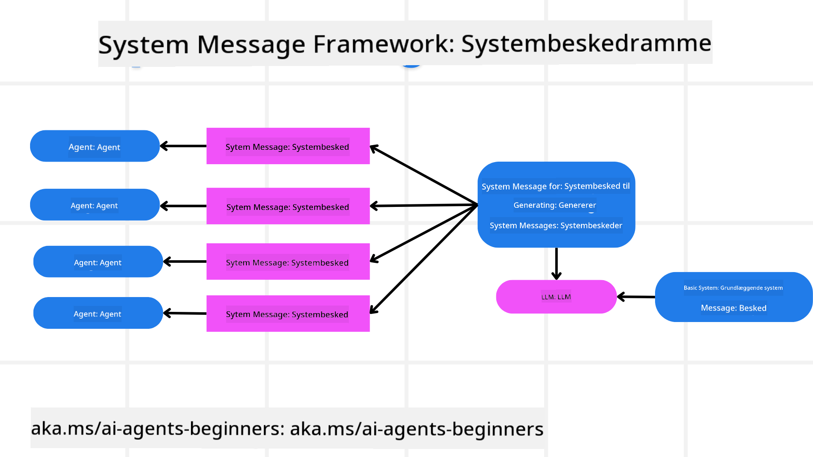
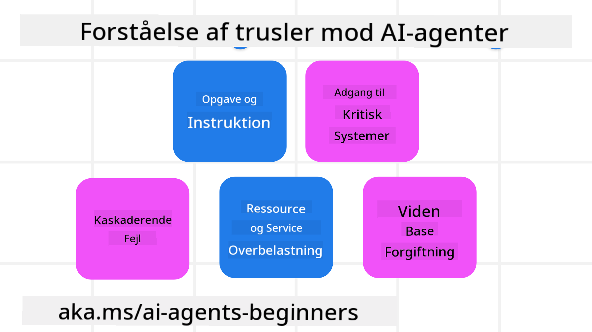
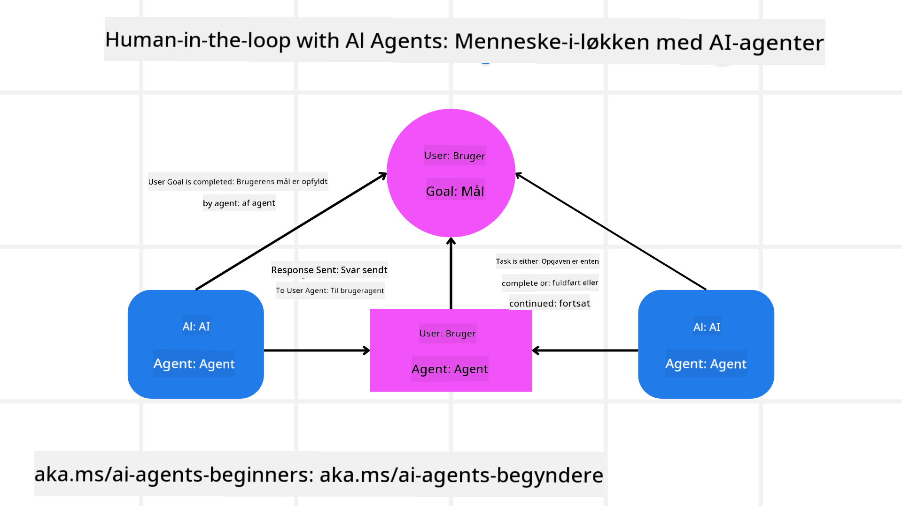

<!--
CO_OP_TRANSLATOR_METADATA:
{
  "original_hash": "f57852cac3a86c4a5ef47f793cc12178",
  "translation_date": "2025-07-12T10:28:13+00:00",
  "source_file": "06-building-trustworthy-agents/README.md",
  "language_code": "da"
}
-->
[](https://youtu.be/iZKkMEGBCUQ?si=Q-kEbcyHUMPoHp8L)

> _(Klik på billedet ovenfor for at se videoen til denne lektion)_

# Opbygning af Pålidelige AI-agenter

## Introduktion

Denne lektion vil dække:

- Hvordan man bygger og implementerer sikre og effektive AI-agenter
- Vigtige sikkerhedsovervejelser ved udvikling af AI-agenter
- Hvordan man opretholder data- og brugerprivathed ved udvikling af AI-agenter

## Læringsmål

Efter at have gennemført denne lektion vil du kunne:

- Identificere og mindske risici ved oprettelse af AI-agenter
- Implementere sikkerhedsforanstaltninger for at sikre korrekt håndtering af data og adgang
- Skabe AI-agenter, der beskytter dataprivatliv og leverer en god brugeroplevelse

## Sikkerhed

Lad os først se på, hvordan man bygger sikre agentbaserede applikationer. Sikkerhed betyder, at AI-agenten fungerer som designet. Som udviklere af agentbaserede applikationer har vi metoder og værktøjer til at maksimere sikkerheden:

### Opbygning af et Systembesked-Framework

Hvis du nogensinde har bygget en AI-applikation med Large Language Models (LLMs), ved du, hvor vigtigt det er at designe en robust systemprompt eller systembesked. Disse prompts fastlægger meta-regler, instruktioner og retningslinjer for, hvordan LLM’en skal interagere med brugeren og data.

For AI-agenter er systemprompten endnu vigtigere, da AI-agenterne har brug for meget specifikke instruktioner for at udføre de opgaver, vi har designet til dem.

For at skabe skalerbare systemprompter kan vi bruge et systembesked-framework til at bygge en eller flere agenter i vores applikation:



#### Trin 1: Opret en Meta Systembesked

Meta-prompten vil blive brugt af en LLM til at generere systemprompter til de agenter, vi opretter. Vi designer den som en skabelon, så vi effektivt kan skabe flere agenter, hvis det er nødvendigt.

Her er et eksempel på en meta systembesked, vi ville give til LLM’en:

```plaintext
You are an expert at creating AI agent assistants. 
You will be provided a company name, role, responsibilities and other
information that you will use to provide a system prompt for.
To create the system prompt, be descriptive as possible and provide a structure that a system using an LLM can better understand the role and responsibilities of the AI assistant. 
```

#### Trin 2: Opret en grundlæggende prompt

Næste skridt er at oprette en grundlæggende prompt, der beskriver AI-agenten. Du bør inkludere agentens rolle, de opgaver agenten skal udføre, og eventuelle andre ansvarsområder.

Her er et eksempel:

```plaintext
You are a travel agent for Contoso Travel that is great at booking flights for customers. To help customers you can perform the following tasks: lookup available flights, book flights, ask for preferences in seating and times for flights, cancel any previously booked flights and alert customers on any delays or cancellations of flights.  
```

#### Trin 3: Giv grundlæggende systembesked til LLM

Nu kan vi optimere denne systembesked ved at give meta systembeskeden som systembesked sammen med vores grundlæggende systembesked.

Dette vil producere en systembesked, der er bedre designet til at guide vores AI-agenter:

```markdown
**Company Name:** Contoso Travel  
**Role:** Travel Agent Assistant

**Objective:**  
You are an AI-powered travel agent assistant for Contoso Travel, specializing in booking flights and providing exceptional customer service. Your main goal is to assist customers in finding, booking, and managing their flights, all while ensuring that their preferences and needs are met efficiently.

**Key Responsibilities:**

1. **Flight Lookup:**
    
    - Assist customers in searching for available flights based on their specified destination, dates, and any other relevant preferences.
    - Provide a list of options, including flight times, airlines, layovers, and pricing.
2. **Flight Booking:**
    
    - Facilitate the booking of flights for customers, ensuring that all details are correctly entered into the system.
    - Confirm bookings and provide customers with their itinerary, including confirmation numbers and any other pertinent information.
3. **Customer Preference Inquiry:**
    
    - Actively ask customers for their preferences regarding seating (e.g., aisle, window, extra legroom) and preferred times for flights (e.g., morning, afternoon, evening).
    - Record these preferences for future reference and tailor suggestions accordingly.
4. **Flight Cancellation:**
    
    - Assist customers in canceling previously booked flights if needed, following company policies and procedures.
    - Notify customers of any necessary refunds or additional steps that may be required for cancellations.
5. **Flight Monitoring:**
    
    - Monitor the status of booked flights and alert customers in real-time about any delays, cancellations, or changes to their flight schedule.
    - Provide updates through preferred communication channels (e.g., email, SMS) as needed.

**Tone and Style:**

- Maintain a friendly, professional, and approachable demeanor in all interactions with customers.
- Ensure that all communication is clear, informative, and tailored to the customer's specific needs and inquiries.

**User Interaction Instructions:**

- Respond to customer queries promptly and accurately.
- Use a conversational style while ensuring professionalism.
- Prioritize customer satisfaction by being attentive, empathetic, and proactive in all assistance provided.

**Additional Notes:**

- Stay updated on any changes to airline policies, travel restrictions, and other relevant information that could impact flight bookings and customer experience.
- Use clear and concise language to explain options and processes, avoiding jargon where possible for better customer understanding.

This AI assistant is designed to streamline the flight booking process for customers of Contoso Travel, ensuring that all their travel needs are met efficiently and effectively.

```

#### Trin 4: Iterer og forbedr

Værdien af dette systembesked-framework er, at det gør det lettere at skalere oprettelsen af systembeskeder til flere agenter samt forbedre dine systembeskeder over tid. Det er sjældent, at du får en systembesked, der fungerer perfekt første gang for hele dit brugsscenarie. At kunne lave små justeringer og forbedringer ved at ændre den grundlæggende systembesked og køre den igennem systemet giver dig mulighed for at sammenligne og evaluere resultater.

## Forståelse af trusler

For at bygge pålidelige AI-agenter er det vigtigt at forstå og mindske risici og trusler mod din AI-agent. Lad os se på nogle af de forskellige trusler mod AI-agenter, og hvordan du bedre kan planlægge og forberede dig på dem.



### Opgave og Instruktion

**Beskrivelse:** Angribere forsøger at ændre AI-agentens instruktioner eller mål gennem prompting eller manipulation af input.

**Afhjælpning:** Udfør valideringskontroller og inputfiltre for at opdage potentielt farlige prompts, før de behandles af AI-agenten. Da disse angreb typisk kræver hyppig interaktion med agenten, er det også en måde at forhindre denne type angreb på at begrænse antallet af samtalerunder.

### Adgang til kritiske systemer

**Beskrivelse:** Hvis en AI-agent har adgang til systemer og tjenester, der gemmer følsomme data, kan angribere kompromittere kommunikationen mellem agenten og disse tjenester. Det kan være direkte angreb eller indirekte forsøg på at få information om disse systemer via agenten.

**Afhjælpning:** AI-agenter bør kun have adgang til systemer efter behov for at forhindre denne type angreb. Kommunikationen mellem agent og system bør også være sikker. Implementering af autentificering og adgangskontrol er en anden måde at beskytte disse oplysninger på.

### Overbelastning af ressourcer og tjenester

**Beskrivelse:** AI-agenter kan tilgå forskellige værktøjer og tjenester for at udføre opgaver. Angribere kan udnytte denne evne til at angribe disse tjenester ved at sende et stort antal forespørgsler gennem AI-agenten, hvilket kan føre til systemfejl eller høje omkostninger.

**Afhjælpning:** Implementer politikker, der begrænser antallet af forespørgsler, en AI-agent kan sende til en tjeneste. At begrænse antallet af samtalerunder og forespørgsler til din AI-agent er en anden måde at forhindre denne type angreb på.

### Forurening af vidensbase

**Beskrivelse:** Denne type angreb retter sig ikke direkte mod AI-agenten, men mod vidensbasen og andre tjenester, som AI-agenten bruger. Det kan involvere korruption af data eller information, som AI-agenten bruger til at udføre opgaver, hvilket kan føre til forudindtagede eller utilsigtede svar til brugeren.

**Afhjælpning:** Udfør regelmæssig verifikation af de data, som AI-agenten bruger i sine arbejdsgange. Sørg for, at adgangen til disse data er sikker og kun kan ændres af betroede personer for at undgå denne type angreb.

### Kaskaderende fejl

**Beskrivelse:** AI-agenter tilgår forskellige værktøjer og tjenester for at udføre opgaver. Fejl forårsaget af angribere kan føre til fejl i andre systemer, som AI-agenten er forbundet til, hvilket gør angrebet mere udbredt og sværere at fejlfinde.

**Afhjælpning:** En metode til at undgå dette er at lade AI-agenten køre i et begrænset miljø, som for eksempel i en Docker-container, for at forhindre direkte systemangreb. At skabe fallback-mekanismer og genforsøgslogik, når visse systemer svarer med en fejl, er en anden måde at forhindre større systemfejl på.

## Human-in-the-Loop

En anden effektiv måde at bygge pålidelige AI-agent-systemer på er ved at bruge en Human-in-the-loop. Dette skaber en proces, hvor brugere kan give feedback til agenterne under kørslen. Brugerne fungerer i praksis som agenter i et multi-agent system ved at give godkendelse eller afbryde den kørende proces.



Her er et kodeeksempel, der bruger AutoGen til at vise, hvordan dette koncept implementeres:

```python

# Create the agents.
model_client = OpenAIChatCompletionClient(model="gpt-4o-mini")
assistant = AssistantAgent("assistant", model_client=model_client)
user_proxy = UserProxyAgent("user_proxy", input_func=input)  # Use input() to get user input from console.

# Create the termination condition which will end the conversation when the user says "APPROVE".
termination = TextMentionTermination("APPROVE")

# Create the team.
team = RoundRobinGroupChat([assistant, user_proxy], termination_condition=termination)

# Run the conversation and stream to the console.
stream = team.run_stream(task="Write a 4-line poem about the ocean.")
# Use asyncio.run(...) when running in a script.
await Console(stream)

```

## Konklusion

At bygge pålidelige AI-agenter kræver omhyggeligt design, robuste sikkerhedsforanstaltninger og løbende iteration. Ved at implementere strukturerede meta-promptingsystemer, forstå potentielle trusler og anvende afhjælpende strategier kan udviklere skabe AI-agenter, der både er sikre og effektive. Derudover sikrer en human-in-the-loop tilgang, at AI-agenter forbliver i overensstemmelse med brugerens behov, samtidig med at risici minimeres. Efterhånden som AI udvikler sig, vil en proaktiv tilgang til sikkerhed, privatliv og etiske overvejelser være afgørende for at opbygge tillid og pålidelighed i AI-drevne systemer.

## Yderligere ressourcer

- <a href="https://learn.microsoft.com/azure/ai-studio/responsible-use-of-ai-overview" target="_blank">Responsible AI overview</a>
- <a href="https://learn.microsoft.com/azure/ai-studio/concepts/evaluation-approach-gen-ai" target="_blank">Evaluation of generative AI models and AI applications</a>
- <a href="https://learn.microsoft.com/azure/ai-services/openai/concepts/system-message?context=%2Fazure%2Fai-studio%2Fcontext%2Fcontext&tabs=top-techniques" target="_blank">Safety system messages</a>
- <a href="https://blogs.microsoft.com/wp-content/uploads/prod/sites/5/2022/06/Microsoft-RAI-Impact-Assessment-Template.pdf?culture=en-us&country=us" target="_blank">Risk Assessment Template</a>

## Forrige lektion

[Agentic RAG](../05-agentic-rag/README.md)

## Næste lektion

[Planning Design Pattern](../07-planning-design/README.md)

**Ansvarsfraskrivelse**:  
Dette dokument er blevet oversat ved hjælp af AI-oversættelsestjenesten [Co-op Translator](https://github.com/Azure/co-op-translator). Selvom vi bestræber os på nøjagtighed, bedes du være opmærksom på, at automatiserede oversættelser kan indeholde fejl eller unøjagtigheder. Det oprindelige dokument på dets oprindelige sprog bør betragtes som den autoritative kilde. For kritisk information anbefales professionel menneskelig oversættelse. Vi påtager os intet ansvar for misforståelser eller fejltolkninger, der opstår som følge af brugen af denne oversættelse.