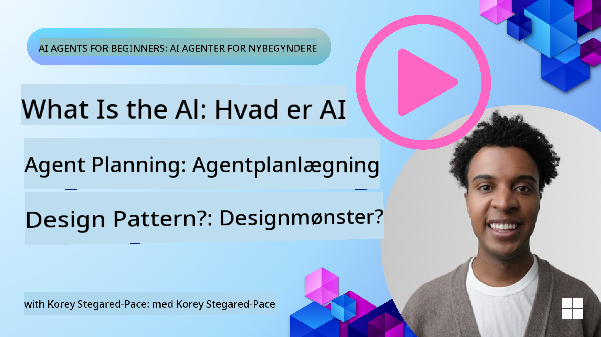

<!--
CO_OP_TRANSLATOR_METADATA:
{
  "original_hash": "e4e06d3b5d6207459a019c05fee5eb4b",
  "translation_date": "2025-07-12T10:42:35+00:00",
  "source_file": "07-planning-design/README.md",
  "language_code": "da"
}
-->
[](https://youtu.be/kPfJ2BrBCMY?si=9pYpPXp0sSbK91Dr)

> _(Klik på billedet ovenfor for at se videoen til denne lektion)_

# Planlægningsdesign

## Introduktion

Denne lektion vil dække

* At definere et klart overordnet mål og opdele en kompleks opgave i håndterbare delopgaver.
* At udnytte struktureret output for mere pålidelige og maskinlæsbare svar.
* At anvende en hændelsesdrevet tilgang til at håndtere dynamiske opgaver og uventede input.

## Læringsmål

Efter at have gennemført denne lektion vil du have forståelse for:

* At identificere og sætte et overordnet mål for en AI-agent, så den tydeligt ved, hvad der skal opnås.
* At opdele en kompleks opgave i håndterbare delopgaver og organisere dem i en logisk rækkefølge.
* At udstyre agenter med de rette værktøjer (f.eks. søgeværktøjer eller dataanalyseværktøjer), beslutte hvornår og hvordan de skal bruges, og håndtere uventede situationer, der opstår.
* At evaluere delopgavers resultater, måle ydeevne og gentage handlinger for at forbedre det endelige output.

## Definere det overordnede mål og opdele en opgave


De fleste opgaver i den virkelige verden er for komplekse til at løse i ét trin. En AI-agent har brug for et præcist mål for at styre sin planlægning og handlinger. For eksempel kan målet være:

    "Generer en rejseplan for 3 dage."

Selvom det er enkelt at formulere, kræver det stadig præcisering. Jo klarere målet er, desto bedre kan agenten (og eventuelle menneskelige samarbejdspartnere) fokusere på at opnå det rette resultat, såsom at skabe en omfattende rejseplan med flymuligheder, hotelanbefalinger og aktivitetsforslag.

### Opdeling af opgaver

Store eller komplekse opgaver bliver mere håndterbare, når de opdeles i mindre, målrettede delopgaver.
For rejseplan-eksemplet kan målet opdeles i:

* Flybooking
* Hotelbooking
* Biludlejning
* Personalisering

Hver delopgave kan derefter håndteres af dedikerede agenter eller processer. Én agent kan specialisere sig i at finde de bedste flytilbud, en anden fokuserer på hotelbooking osv. En koordinerende eller "downstream" agent kan så samle disse resultater til én sammenhængende rejseplan til slutbrugeren.

Denne modulære tilgang muliggør også løbende forbedringer. For eksempel kan du tilføje specialiserede agenter til madanbefalinger eller lokale aktivitetsforslag og forfine rejseplanen over tid.

### Struktureret output

Store sprogmodeller (LLMs) kan generere struktureret output (f.eks. JSON), som er lettere for downstream-agenter eller tjenester at analysere og behandle. Dette er især nyttigt i en multi-agent kontekst, hvor vi kan handle på disse opgaver, efter planlægningsoutputtet er modtaget. Se dette for en hurtig oversigt.

Følgende Python-eksempel viser en simpel planlægningsagent, der opdeler et mål i delopgaver og genererer en struktureret plan:

```python
from pydantic import BaseModel
from enum import Enum
from typing import List, Optional, Union
import json
import os
from typing import Optional
from pprint import pprint
from autogen_core.models import UserMessage, SystemMessage, AssistantMessage
from autogen_ext.models.azure import AzureAIChatCompletionClient
from azure.core.credentials import AzureKeyCredential

class AgentEnum(str, Enum):
    FlightBooking = "flight_booking"
    HotelBooking = "hotel_booking"
    CarRental = "car_rental"
    ActivitiesBooking = "activities_booking"
    DestinationInfo = "destination_info"
    DefaultAgent = "default_agent"
    GroupChatManager = "group_chat_manager"

# Travel SubTask Model
class TravelSubTask(BaseModel):
    task_details: str
    assigned_agent: AgentEnum  # we want to assign the task to the agent

class TravelPlan(BaseModel):
    main_task: str
    subtasks: List[TravelSubTask]
    is_greeting: bool

client = AzureAIChatCompletionClient(
    model="gpt-4o-mini",
    endpoint="https://models.inference.ai.azure.com",
    # To authenticate with the model you will need to generate a personal access token (PAT) in your GitHub settings.
    # Create your PAT token by following instructions here: https://docs.github.com/en/authentication/keeping-your-account-and-data-secure/managing-your-personal-access-tokens
    credential=AzureKeyCredential(os.environ["GITHUB_TOKEN"]),
    model_info={
        "json_output": False,
        "function_calling": True,
        "vision": True,
        "family": "unknown",
    },
)

# Define the user message
messages = [
    SystemMessage(content="""You are an planner agent.
    Your job is to decide which agents to run based on the user's request.
                      Provide your response in JSON format with the following structure:
{'main_task': 'Plan a family trip from Singapore to Melbourne.',
 'subtasks': [{'assigned_agent': 'flight_booking',
               'task_details': 'Book round-trip flights from Singapore to '
                               'Melbourne.'}
    Below are the available agents specialised in different tasks:
    - FlightBooking: For booking flights and providing flight information
    - HotelBooking: For booking hotels and providing hotel information
    - CarRental: For booking cars and providing car rental information
    - ActivitiesBooking: For booking activities and providing activity information
    - DestinationInfo: For providing information about destinations
    - DefaultAgent: For handling general requests""", source="system"),
    UserMessage(
        content="Create a travel plan for a family of 2 kids from Singapore to Melboune", source="user"),
]

response = await client.create(messages=messages, extra_create_args={"response_format": 'json_object'})

response_content: Optional[str] = response.content if isinstance(
    response.content, str) else None
if response_content is None:
    raise ValueError("Response content is not a valid JSON string" )

pprint(json.loads(response_content))

# # Ensure the response content is a valid JSON string before loading it
# response_content: Optional[str] = response.content if isinstance(
#     response.content, str) else None
# if response_content is None:
#     raise ValueError("Response content is not a valid JSON string")

# # Print the response content after loading it as JSON
# pprint(json.loads(response_content))

# Validate the response content with the MathReasoning model
# TravelPlan.model_validate(json.loads(response_content))
```

### Planlægningsagent med multi-agent orkestrering

I dette eksempel modtager en Semantic Router Agent en brugerforespørgsel (f.eks. "Jeg har brug for en hotelplan til min rejse.").

Planlæggeren gør derefter:

* Modtager hotelplanen: Planlæggeren tager brugerens besked og, baseret på et systemprompt (inklusive tilgængelige agentdetaljer), genererer en struktureret rejseplan.
* Lister agenter og deres værktøjer: Agentregistret indeholder en liste over agenter (f.eks. til fly, hotel, biludlejning og aktiviteter) sammen med de funktioner eller værktøjer, de tilbyder.
* Ruter planen til de respektive agenter: Afhængigt af antallet af delopgaver sender planlæggeren enten beskeden direkte til en dedikeret agent (for enkeltopgave-scenarier) eller koordinerer via en gruppechatmanager for multi-agent samarbejde.
* Opsummerer resultatet: Til sidst opsummerer planlæggeren den genererede plan for klarhed.
Følgende Python-kodeeksempel illustrerer disse trin:

```python

from pydantic import BaseModel

from enum import Enum
from typing import List, Optional, Union

class AgentEnum(str, Enum):
    FlightBooking = "flight_booking"
    HotelBooking = "hotel_booking"
    CarRental = "car_rental"
    ActivitiesBooking = "activities_booking"
    DestinationInfo = "destination_info"
    DefaultAgent = "default_agent"
    GroupChatManager = "group_chat_manager"

# Travel SubTask Model

class TravelSubTask(BaseModel):
    task_details: str
    assigned_agent: AgentEnum # we want to assign the task to the agent

class TravelPlan(BaseModel):
    main_task: str
    subtasks: List[TravelSubTask]
    is_greeting: bool
import json
import os
from typing import Optional

from autogen_core.models import UserMessage, SystemMessage, AssistantMessage
from autogen_ext.models.openai import AzureOpenAIChatCompletionClient

# Create the client with type-checked environment variables

client = AzureOpenAIChatCompletionClient(
    azure_deployment=os.getenv("AZURE_OPENAI_DEPLOYMENT_NAME"),
    model=os.getenv("AZURE_OPENAI_DEPLOYMENT_NAME"),
    api_version=os.getenv("AZURE_OPENAI_API_VERSION"),
    azure_endpoint=os.getenv("AZURE_OPENAI_ENDPOINT"),
    api_key=os.getenv("AZURE_OPENAI_API_KEY"),
)

from pprint import pprint

# Define the user message

messages = [
    SystemMessage(content="""You are an planner agent.
    Your job is to decide which agents to run based on the user's request.
    Below are the available agents specialized in different tasks:
    - FlightBooking: For booking flights and providing flight information
    - HotelBooking: For booking hotels and providing hotel information
    - CarRental: For booking cars and providing car rental information
    - ActivitiesBooking: For booking activities and providing activity information
    - DestinationInfo: For providing information about destinations
    - DefaultAgent: For handling general requests""", source="system"),
    UserMessage(content="Create a travel plan for a family of 2 kids from Singapore to Melbourne", source="user"),
]

response = await client.create(messages=messages, extra_create_args={"response_format": TravelPlan})

# Ensure the response content is a valid JSON string before loading it

response_content: Optional[str] = response.content if isinstance(response.content, str) else None
if response_content is None:
    raise ValueError("Response content is not a valid JSON string")

# Print the response content after loading it as JSON

pprint(json.loads(response_content))
```

Det følgende er outputtet fra den tidligere kode, og du kan derefter bruge dette strukturerede output til at rute til `assigned_agent` og opsummere rejseplanen til slutbrugeren.

```json
{
    "is_greeting": "False",
    "main_task": "Plan a family trip from Singapore to Melbourne.",
    "subtasks": [
        {
            "assigned_agent": "flight_booking",
            "task_details": "Book round-trip flights from Singapore to Melbourne."
        },
        {
            "assigned_agent": "hotel_booking",
            "task_details": "Find family-friendly hotels in Melbourne."
        },
        {
            "assigned_agent": "car_rental",
            "task_details": "Arrange a car rental suitable for a family of four in Melbourne."
        },
        {
            "assigned_agent": "activities_booking",
            "task_details": "List family-friendly activities in Melbourne."
        },
        {
            "assigned_agent": "destination_info",
            "task_details": "Provide information about Melbourne as a travel destination."
        }
    ]
}
```

Et eksempel-notebook med det tidligere kodeeksempel er tilgængeligt [her](../../../07-planning-design/07-autogen.ipynb).

### Iterativ planlægning

Nogle opgaver kræver en frem og tilbage eller omplanlægning, hvor resultatet af en delopgave påvirker den næste. For eksempel, hvis agenten opdager et uventet dataformat under flybookingen, kan den være nødt til at tilpasse sin strategi, før den går videre til hotelbookingen.

Derudover kan brugerfeedback (f.eks. en person, der beslutter sig for, at de foretrækker et tidligere fly) udløse en delvis omplanlægning. Denne dynamiske, iterative tilgang sikrer, at den endelige løsning stemmer overens med virkelige begrænsninger og brugernes skiftende præferencer.

f.eks. eksempel kode

```python
from autogen_core.models import UserMessage, SystemMessage, AssistantMessage
#.. same as previous code and pass on the user history, current plan
messages = [
    SystemMessage(content="""You are a planner agent to optimize the
    Your job is to decide which agents to run based on the user's request.
    Below are the available agents specialized in different tasks:
    - FlightBooking: For booking flights and providing flight information
    - HotelBooking: For booking hotels and providing hotel information
    - CarRental: For booking cars and providing car rental information
    - ActivitiesBooking: For booking activities and providing activity information
    - DestinationInfo: For providing information about destinations
    - DefaultAgent: For handling general requests""", source="system"),
    UserMessage(content="Create a travel plan for a family of 2 kids from Singapore to Melbourne", source="user"),
    AssistantMessage(content=f"Previous travel plan - {TravelPlan}", source="assistant")
]
# .. re-plan and send the tasks to respective agents
```

For mere omfattende planlægning kan du tjekke Magnetic One

for at løse komplekse opgaver.

## Resumé

I denne artikel har vi set et eksempel på, hvordan vi kan skabe en planlægger, der dynamisk kan vælge de tilgængelige agenter, der er defineret. Planlæggerens output opdeler opgaverne og tildeler agenterne, så de kan udføres. Det antages, at agenterne har adgang til de funktioner/værktøjer, der kræves for at udføre opgaven. Ud over agenterne kan du inkludere andre mønstre som refleksion, opsummering og round robin chat for yderligere tilpasning.

## Yderligere ressourcer

* AutoGen Magnetic One - Et generalist multi-agent system til løsning af komplekse opgaver, som har opnået imponerende resultater på flere udfordrende agentiske benchmarks. Reference:

. I denne implementering skaber orkestratoren en opgavespecifik plan og delegerer disse opgaver til de tilgængelige agenter. Ud over planlægning anvender orkestratoren også en sporingsmekanisme til at overvåge opgavens fremdrift og omplanlægger efter behov.

## Forrige lektion

[Bygning af pålidelige AI-agenter](../06-building-trustworthy-agents/README.md)

## Næste lektion

[Multi-Agent Design Pattern](../08-multi-agent/README.md)

**Ansvarsfraskrivelse**:  
Dette dokument er blevet oversat ved hjælp af AI-oversættelsestjenesten [Co-op Translator](https://github.com/Azure/co-op-translator). Selvom vi bestræber os på nøjagtighed, bedes du være opmærksom på, at automatiserede oversættelser kan indeholde fejl eller unøjagtigheder. Det oprindelige dokument på dets oprindelige sprog bør betragtes som den autoritative kilde. For kritisk information anbefales professionel menneskelig oversættelse. Vi påtager os intet ansvar for misforståelser eller fejltolkninger, der opstår som følge af brugen af denne oversættelse.