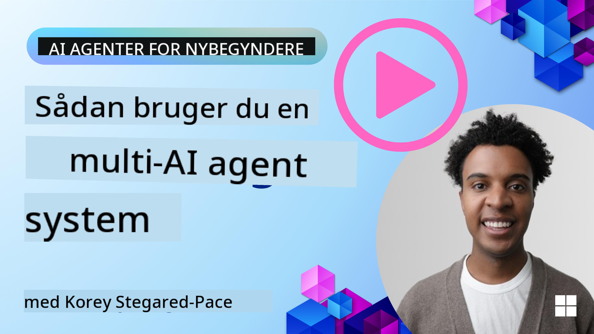
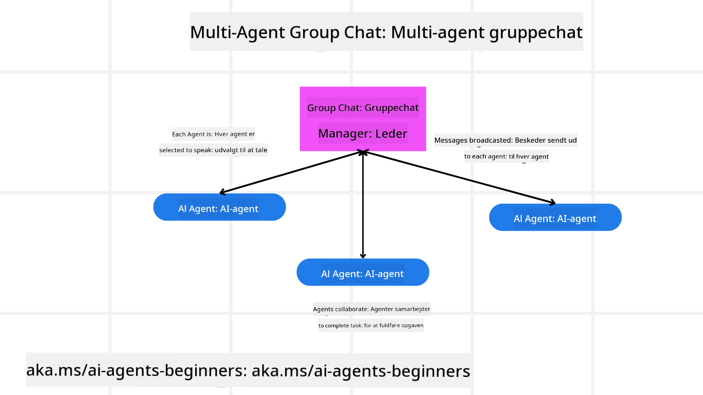
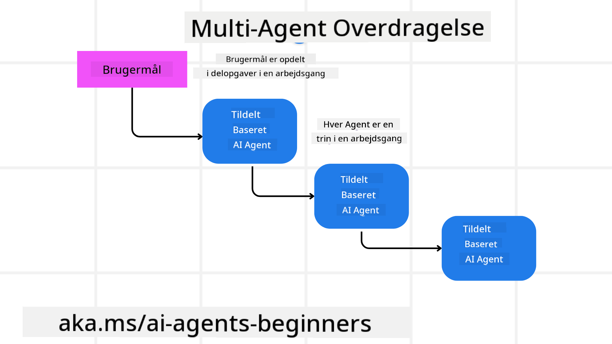
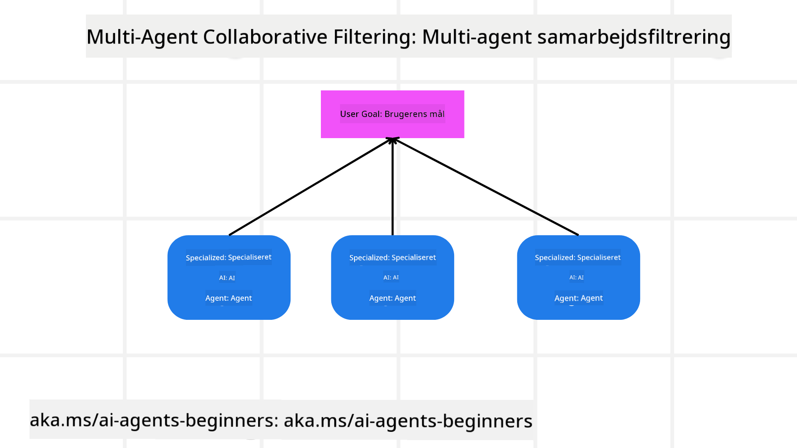

<!--
CO_OP_TRANSLATOR_METADATA:
{
  "original_hash": "c692a8975d7d5b99575a553de1c5e8a7",
  "translation_date": "2025-07-12T11:13:48+00:00",
  "source_file": "08-multi-agent/README.md",
  "language_code": "da"
}
-->

> _(Klik på billedet ovenfor for at se videoen til denne lektion)_

# Multi-agent designmønstre

Så snart du begynder at arbejde på et projekt, der involverer flere agenter, skal du overveje multi-agent designmønsteret. Det er dog ikke altid umiddelbart klart, hvornår man skal skifte til multi-agenter, og hvad fordelene er.

## Introduktion

I denne lektion vil vi besvare følgende spørgsmål:

- Hvilke scenarier er relevante for multi-agenter?
- Hvad er fordelene ved at bruge multi-agenter frem for kun én enkelt agent, der udfører flere opgaver?
- Hvad er byggestenene til implementering af multi-agent designmønsteret?
- Hvordan får vi indsigt i, hvordan de flere agenter interagerer med hinanden?

## Læringsmål

Efter denne lektion bør du kunne:

- Identificere scenarier, hvor multi-agenter er relevante
- Genkende fordelene ved at bruge multi-agenter frem for en enkelt agent
- Forstå byggestenene til implementering af multi-agent designmønsteret

Hvad er det store billede?

*Multi-agenter er et designmønster, der tillader flere agenter at arbejde sammen for at nå et fælles mål*.

Dette mønster anvendes bredt inden for forskellige områder, herunder robotteknologi, autonome systemer og distribueret databehandling.

## Scenarier hvor multi-agenter er relevante

Hvilke scenarier er gode eksempler på brug af multi-agenter? Svaret er, at der er mange situationer, hvor det er fordelagtigt at anvende flere agenter, især i følgende tilfælde:

- **Store arbejdsbyrder**: Store arbejdsbyrder kan opdeles i mindre opgaver og tildeles forskellige agenter, hvilket muliggør parallel behandling og hurtigere færdiggørelse. Et eksempel er ved store databehandlingsopgaver.
- **Komplekse opgaver**: Komplekse opgaver, ligesom store arbejdsbyrder, kan opdeles i mindre delopgaver og tildeles forskellige agenter, der hver specialiserer sig i en bestemt del af opgaven. Et godt eksempel er autonome køretøjer, hvor forskellige agenter håndterer navigation, forhindringsdetektion og kommunikation med andre køretøjer.
- **Forskellig ekspertise**: Forskellige agenter kan have forskellig ekspertise, hvilket gør dem i stand til at håndtere forskellige aspekter af en opgave mere effektivt end en enkelt agent. Et godt eksempel er inden for sundhedssektoren, hvor agenter kan håndtere diagnostik, behandlingsplaner og patientovervågning.

## Fordele ved at bruge multi-agenter frem for en enkelt agent

Et enkelt agentsystem kan fungere godt til simple opgaver, men til mere komplekse opgaver kan brugen af flere agenter give flere fordele:

- **Specialisering**: Hver agent kan specialisere sig i en bestemt opgave. Manglende specialisering i en enkelt agent betyder, at agenten kan gøre alt, men kan blive forvirret, når den står over for en kompleks opgave. Den kan for eksempel ende med at udføre en opgave, den ikke er bedst egnet til.
- **Skalerbarhed**: Det er lettere at skalere systemer ved at tilføje flere agenter frem for at overbelaste en enkelt agent.
- **Fejltolerance**: Hvis en agent fejler, kan de andre fortsætte med at fungere, hvilket sikrer systemets pålidelighed.

Lad os tage et eksempel: Vi skal booke en rejse for en bruger. Et enkelt agentsystem ville skulle håndtere alle aspekter af rejsebookingen, fra at finde fly til at booke hoteller og lejebiler. For at opnå dette med en enkelt agent, skulle agenten have værktøjer til at håndtere alle disse opgaver. Det kunne føre til et komplekst og monolitisk system, der er svært at vedligeholde og skalere. Et multi-agent system kunne derimod have forskellige agenter, der er specialiserede i at finde fly, booke hoteller og lejebiler. Det ville gøre systemet mere modulært, lettere at vedligeholde og skalerbart.

Sammenlign dette med et rejsebureau drevet som en lille lokal butik versus et rejsebureau drevet som en franchise. Den lille butik ville have en enkelt agent, der håndterer alle aspekter af rejsebookingen, mens franchisen ville have forskellige agenter, der håndterer forskellige dele af processen.

## Byggesten til implementering af multi-agent designmønsteret

Før du kan implementere multi-agent designmønsteret, skal du forstå de byggesten, der udgør mønsteret.

Lad os gøre det mere konkret ved igen at se på eksemplet med at booke en rejse for en bruger. I dette tilfælde vil byggestenene inkludere:

- **Agentkommunikation**: Agenter til at finde fly, booke hoteller og lejebiler skal kunne kommunikere og dele information om brugerens præferencer og begrænsninger. Du skal beslutte protokoller og metoder til denne kommunikation. Konkret betyder det, at agenten, der finder fly, skal kommunikere med agenten, der booker hoteller, for at sikre, at hotellet er booket til de samme datoer som flyet. Det betyder, at agenterne skal dele information om brugerens rejsedatoer, og du skal beslutte *hvilke agenter der deler information, og hvordan de deler den*.
- **Koordineringsmekanismer**: Agenter skal koordinere deres handlinger for at sikre, at brugerens præferencer og begrænsninger overholdes. En brugerpræference kunne være, at de ønsker et hotel tæt på lufthavnen, mens en begrænsning kunne være, at lejebiler kun er tilgængelige i lufthavnen. Det betyder, at agenten, der booker hoteller, skal koordinere med agenten, der booker lejebiler, for at sikre, at brugerens ønsker og begrænsninger opfyldes. Du skal altså beslutte *hvordan agenterne koordinerer deres handlinger*.
- **Agentarkitektur**: Agenter skal have en intern struktur til at træffe beslutninger og lære af deres interaktioner med brugeren. Det betyder, at agenten, der finder fly, skal have en intern struktur til at beslutte, hvilke fly der skal anbefales til brugeren. Du skal beslutte *hvordan agenterne træffer beslutninger og lærer af deres interaktioner med brugeren*. Et eksempel på, hvordan en agent lærer og forbedrer sig, kunne være, at agenten til flysøgning bruger en maskinlæringsmodel til at anbefale fly baseret på brugerens tidligere præferencer.
- **Indsigt i multi-agent interaktioner**: Du skal have indsigt i, hvordan de flere agenter interagerer med hinanden. Det betyder, at du skal have værktøjer og teknikker til at spore agentaktiviteter og interaktioner. Det kan være i form af logning og overvågningsværktøjer, visualiseringsværktøjer og præstationsmålinger.
- **Multi-agent mønstre**: Der findes forskellige mønstre til implementering af multi-agent systemer, såsom centraliserede, decentraliserede og hybride arkitekturer. Du skal vælge det mønster, der passer bedst til dit brugsscenarie.
- **Menneske i loop**: I de fleste tilfælde vil der være et menneske involveret, og du skal instruere agenterne om, hvornår de skal bede om menneskelig indgriben. Det kan være i form af, at en bruger beder om et specifikt hotel eller fly, som agenterne ikke har anbefalet, eller beder om bekræftelse, før en fly- eller hotelbooking gennemføres.

## Indsigt i multi-agent interaktioner

Det er vigtigt, at du har indsigt i, hvordan de flere agenter interagerer med hinanden. Denne indsigt er afgørende for fejlfinding, optimering og for at sikre systemets overordnede effektivitet. For at opnå dette skal du have værktøjer og teknikker til at spore agentaktiviteter og interaktioner. Det kan være i form af logning og overvågningsværktøjer, visualiseringsværktøjer og præstationsmålinger.

For eksempel, i forbindelse med booking af en rejse for en bruger, kunne du have et dashboard, der viser status for hver agent, brugerens præferencer og begrænsninger samt interaktionerne mellem agenterne. Dette dashboard kunne vise brugerens rejsedatoer, de fly, som flyagenten anbefaler, de hoteller, som hotelagenten anbefaler, og de lejebiler, som lejebilagenten anbefaler. Det ville give dig et klart overblik over, hvordan agenterne interagerer, og om brugerens ønsker og begrænsninger bliver opfyldt.

Lad os se nærmere på disse aspekter:

- **Logning og overvågningsværktøjer**: Du ønsker at logge hver handling, en agent udfører. En logpost kan indeholde information om, hvilken agent der udførte handlingen, hvilken handling der blev udført, tidspunktet for handlingen og resultatet af handlingen. Denne information kan bruges til fejlfinding, optimering og mere.
- **Visualiseringsværktøjer**: Visualiseringsværktøjer kan hjælpe dig med at se interaktionerne mellem agenter på en mere intuitiv måde. For eksempel kunne du have en graf, der viser informationsflowet mellem agenterne. Det kan hjælpe med at identificere flaskehalse, ineffektiviteter og andre problemer i systemet.
- **Præstationsmålinger**: Præstationsmålinger kan hjælpe dig med at følge effektiviteten af multi-agent systemet. For eksempel kan du måle den tid, det tager at fuldføre en opgave, antallet af opgaver fuldført pr. tidsenhed og nøjagtigheden af de anbefalinger, agenterne giver. Denne information kan hjælpe dig med at identificere forbedringsområder og optimere systemet.

## Multi-agent mønstre

Lad os dykke ned i nogle konkrete mønstre, vi kan bruge til at skabe multi-agent applikationer. Her er nogle interessante mønstre, der er værd at overveje:

### Gruppechat

Dette mønster er nyttigt, når du vil skabe en gruppechat-applikation, hvor flere agenter kan kommunikere med hinanden. Typiske anvendelser inkluderer teamsamarbejde, kundesupport og sociale netværk.

I dette mønster repræsenterer hver agent en bruger i gruppechatten, og beskeder udveksles mellem agenter ved hjælp af en beskedprotokol. Agenterne kan sende beskeder til gruppechatten, modtage beskeder fra gruppechatten og svare på beskeder fra andre agenter.

Dette mønster kan implementeres ved hjælp af en centraliseret arkitektur, hvor alle beskeder rutes gennem en central server, eller en decentraliseret arkitektur, hvor beskeder udveksles direkte.

### Overdragelse

Dette mønster er nyttigt, når du vil skabe en applikation, hvor flere agenter kan overdrage opgaver til hinanden.

Typiske anvendelser inkluderer kundesupport, opgavestyring og workflow-automatisering.

I dette mønster repræsenterer hver agent en opgave eller et trin i en arbejdsproces, og agenter kan overdrage opgaver til andre agenter baseret på foruddefinerede regler.

### Samarbejdende filtrering

Dette mønster er nyttigt, når du vil skabe en applikation, hvor flere agenter kan samarbejde om at give anbefalinger til brugere.

Grunden til, at man ønsker flere agenter til at samarbejde, er, at hver agent kan have forskellig ekspertise og kan bidrage til anbefalingsprocessen på forskellige måder.

Lad os tage et eksempel, hvor en bruger ønsker en anbefaling om den bedste aktie at købe på aktiemarkedet.

- **Brancheekspert**: En agent kunne være ekspert i en specifik branche.
- **Teknisk analyse**: En anden agent kunne være ekspert i teknisk analyse.
- **Fundamental analyse**: Og en tredje agent kunne være ekspert i fundamental analyse. Ved at samarbejde kan disse agenter give en mere omfattende anbefaling til brugeren.

## Scenario: Refusionsproces

Forestil dig et scenarie, hvor en kunde forsøger at få refunderet et produkt. Der kan være flere agenter involveret i denne proces, men lad os opdele dem i agenter specifikke for denne proces og generelle agenter, der kan bruges i andre processer.

**Agenter specifikke for refusionsprocessen**:

Følgende er nogle agenter, der kunne være involveret i refusionsprocessen:

- **Kundeagent**: Denne agent repræsenterer kunden og er ansvarlig for at igangsætte refusionsprocessen.
- **Sælgeragent**: Denne agent repræsenterer sælgeren og er ansvarlig for at behandle refusionen.
- **Betalingsagent**: Denne agent repræsenterer betalingsprocessen og er ansvarlig for at refundere kundens betaling.
- **Løsningsagent**: Denne agent repræsenterer løsningsprocessen og er ansvarlig for at løse eventuelle problemer, der opstår under refusionsprocessen.
- **Overholdelsesagent**: Denne agent repræsenterer overholdelsesprocessen og sikrer, at refusionsprocessen overholder regler og politikker.

**Generelle agenter**:

Disse agenter kan bruges i andre dele af din forretning.

- **Forsendelsesagent**: Denne agent repræsenterer forsendelsesprocessen og er ansvarlig for at sende produktet tilbage til sælgeren. Denne agent kan bruges både til refusionsprocessen og til generel forsendelse af et produkt ved køb.
- **Feedbackagent**: Denne agent repræsenterer feedbackprocessen og er ansvarlig for at indsamle feedback fra kunden. Feedback kan indsamles når som helst og ikke kun under refusionsprocessen.
- **Eskaleringsagent**: Denne agent repræsenterer eskaleringsprocessen og er ansvarlig for at eskalere problemer til et højere supportniveau. Denne type agent kan bruges i enhver proces, hvor der er behov for at eskalere et problem.
- **Notifikationsagent**: Denne agent repræsenterer notifikationsprocessen og er ansvarlig for at sende beskeder til kunden på forskellige stadier af refusionsprocessen.
- **Analyseagent**: Denne agent repræsenterer analyseprocessen og er ansvarlig for at analysere data relateret til refusionsprocessen.
- **Revisionsagent**: Denne agent repræsenterer revisionsprocessen og er ansvarlig for at revidere refusionsprocessen for at sikre, at den udføres korrekt.
- **Rapporteringsagent**: Denne agent repræsenterer rapporteringsprocessen og er ansvarlig for at generere rapporter om refusionsprocessen.
- **Vidensagent**: Denne agent repræsenterer vidensprocessen og er ansvarlig for at vedligeholde en vidensbase med information relateret til refusionsprocessen. Denne agent kan have viden både om refusioner og andre dele af din forretning.
- **Sikkerhedsagent**: Denne agent repræsenterer sikkerhedsprocessen og er ansvarlig for at sikre sikkerheden i refusionsprocessen.
- **Kvalitetsagent**: Denne agent repræsenterer kvalitetsprocessen og er ansvarlig for at sikre kvaliteten af refusionsprocessen.

Der er altså en del agenter nævnt ovenfor, både specifikt for refusionsprocessen, men også generelle agenter, der kan bruges i andre dele af din forretning. Forhåbentlig giver det dig en idé om, hvordan du kan beslutte, hvilke agenter du skal bruge i dit multi-agent system.

## Opgave
## Forrige lektion

[Planlægningsdesign](../07-planning-design/README.md)

## Næste lektion

[Metakognition i AI-agenter](../09-metacognition/README.md)

**Ansvarsfraskrivelse**:  
Dette dokument er blevet oversat ved hjælp af AI-oversættelsestjenesten [Co-op Translator](https://github.com/Azure/co-op-translator). Selvom vi bestræber os på nøjagtighed, bedes du være opmærksom på, at automatiserede oversættelser kan indeholde fejl eller unøjagtigheder. Det oprindelige dokument på dets oprindelige sprog bør betragtes som den autoritative kilde. For kritisk information anbefales professionel menneskelig oversættelse. Vi påtager os intet ansvar for misforståelser eller fejltolkninger, der opstår som følge af brugen af denne oversættelse.