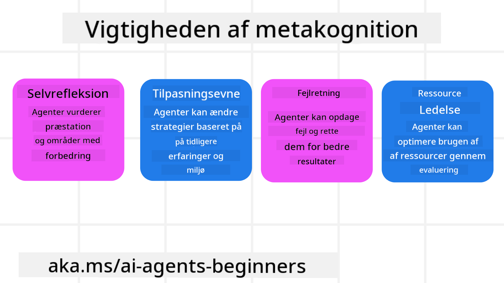
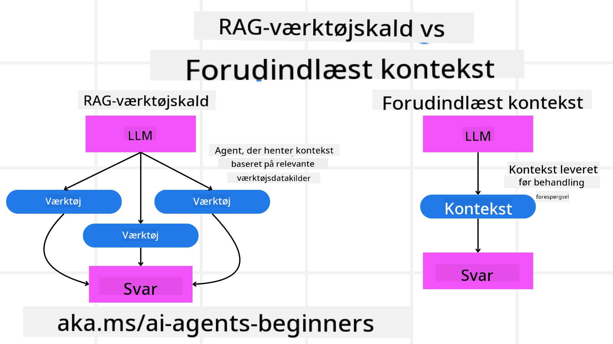

<!--
CO_OP_TRANSLATOR_METADATA:
{
  "original_hash": "5f0deef171fc3a68d5d3d770a8bfb03d",
  "translation_date": "2025-08-29T15:34:26+00:00",
  "source_file": "09-metacognition/README.md",
  "language_code": "da"
}
-->
[](https://youtu.be/His9R6gw6Ec?si=3_RMb8VprNvdLRhX)

> _(Klik på billedet ovenfor for at se videoen til denne lektion)_
# Metakognition i AI-agenter

## Introduktion

Velkommen til lektionen om metakognition i AI-agenter! Dette kapitel er designet til begyndere, der er nysgerrige på, hvordan AI-agenter kan tænke over deres egne tankeprocesser. Ved slutningen af denne lektion vil du forstå nøglebegreber og have praktiske eksempler på, hvordan metakognition kan anvendes i designet af AI-agenter.

## Læringsmål

Efter at have gennemført denne lektion vil du kunne:

1. Forstå konsekvenserne af ræsonneringssløjfer i agentdefinitioner.
2. Anvende planlægnings- og evalueringsteknikker til at hjælpe selvkorrigerende agenter.
3. Skabe dine egne agenter, der kan manipulere kode for at udføre opgaver.

## Introduktion til metakognition

Metakognition refererer til de højere kognitive processer, der indebærer at tænke over ens egne tanker. For AI-agenter betyder det at kunne evaluere og justere deres handlinger baseret på selvindsigt og tidligere erfaringer. Metakognition, eller "at tænke over at tænke," er et vigtigt koncept i udviklingen af agentbaserede AI-systemer. Det indebærer, at AI-systemer er bevidste om deres egne interne processer og kan overvåge, regulere og tilpasse deres adfærd derefter. Lidt ligesom vi gør, når vi vurderer en situation eller analyserer et problem. Denne selvbevidsthed kan hjælpe AI-systemer med at træffe bedre beslutninger, identificere fejl og forbedre deres præstation over tid – igen med henvisning til Turing-testen og debatten om, hvorvidt AI vil overtage.

I konteksten af agentbaserede AI-systemer kan metakognition hjælpe med at tackle flere udfordringer, såsom:
- Gennemsigtighed: Sikre, at AI-systemer kan forklare deres ræsonnement og beslutninger.
- Ræsonnement: Forbedre AI-systemers evne til at syntetisere information og træffe velovervejede beslutninger.
- Tilpasning: Give AI-systemer mulighed for at tilpasse sig nye miljøer og skiftende forhold.
- Perception: Forbedre AI-systemers nøjagtighed i at genkende og fortolke data fra deres omgivelser.

### Hvad er metakognition?

Metakognition, eller "at tænke over at tænke," er en højere kognitiv proces, der indebærer selvbevidsthed og selvregulering af ens kognitive processer. Inden for AI giver metakognition agenter mulighed for at evaluere og tilpasse deres strategier og handlinger, hvilket fører til forbedrede problemløsnings- og beslutningsevner. Ved at forstå metakognition kan du designe AI-agenter, der ikke kun er mere intelligente, men også mere tilpasningsdygtige og effektive. I ægte metakognition vil AI eksplicit ræsonnere over sin egen ræsonnering.

Eksempel: “Jeg prioriterede billigere fly, fordi… Jeg kunne måske overse direkte fly, så lad mig tjekke igen.”
Holde styr på, hvordan eller hvorfor den valgte en bestemt rute.
- Bemærke, at den lavede fejl, fordi den overfokuserede på brugerpræferencer fra sidste gang, og derfor ændrer sin beslutningsstrategi, ikke kun den endelige anbefaling.
- Diagnosticere mønstre som: “Når brugeren nævner ‘for overfyldt,’ bør jeg ikke kun fjerne visse attraktioner, men også erkende, at min metode til at vælge ‘topattraktioner’ er mangelfuld, hvis jeg altid rangerer efter popularitet.”

### Vigtigheden af metakognition i AI-agenter

Metakognition spiller en afgørende rolle i designet af AI-agenter af flere grunde:



- Selvrefleksion: Agenter kan vurdere deres egen præstation og identificere områder, der kan forbedres.
- Tilpasningsevne: Agenter kan ændre deres strategier baseret på tidligere erfaringer og skiftende miljøer.
- Fejlkorrektion: Agenter kan opdage og rette fejl autonomt, hvilket fører til mere præcise resultater.
- Ressourcestyring: Agenter kan optimere brugen af ressourcer, såsom tid og beregningskraft, ved at planlægge og evaluere deres handlinger.

## Komponenter i en AI-agent

Før vi dykker ned i metakognitive processer, er det vigtigt at forstå de grundlæggende komponenter i en AI-agent. En AI-agent består typisk af:

- Persona: Agentens personlighed og karakteristika, som definerer, hvordan den interagerer med brugere.
- Værktøjer: De evner og funktioner, som agenten kan udføre.
- Færdigheder: Den viden og ekspertise, som agenten besidder.

Disse komponenter arbejder sammen for at skabe en "ekspertisenhed," der kan udføre specifikke opgaver.

**Eksempel**:
Forestil dig en rejseagent, der ikke kun planlægger din ferie, men også justerer sin tilgang baseret på realtidsdata og tidligere kundeoplevelser.

### Eksempel: Metakognition i en rejseagenttjeneste

Forestil dig, at du designer en rejseagenttjeneste drevet af AI. Denne agent, "Rejseagent," hjælper brugere med at planlægge deres ferier. For at inkorporere metakognition skal Rejseagent evaluere og justere sine handlinger baseret på selvindsigt og tidligere erfaringer. Her er, hvordan metakognition kunne spille en rolle:

#### Aktuel opgave

Den aktuelle opgave er at hjælpe en bruger med at planlægge en rejse til Paris.

#### Trin til at fuldføre opgaven

1. **Indsamle brugerpræferencer**: Spørg brugeren om deres rejsedatoer, budget, interesser (f.eks. museer, mad, shopping) og eventuelle specifikke krav.
2. **Hente information**: Søg efter flymuligheder, overnatningssteder, attraktioner og restauranter, der matcher brugerens præferencer.
3. **Generere anbefalinger**: Tilbyd en personlig rejseplan med flydetaljer, hotelreservationer og foreslåede aktiviteter.
4. **Justere baseret på feedback**: Spørg brugeren om feedback på anbefalingerne og foretag nødvendige justeringer.

#### Nødvendige ressourcer

- Adgang til databaser for fly- og hotelreservationer.
- Information om attraktioner og restauranter i Paris.
- Brugerfeedbackdata fra tidligere interaktioner.

#### Erfaring og selvrefleksion

Rejseagent bruger metakognition til at evaluere sin præstation og lære af tidligere erfaringer. For eksempel:

1. **Analysere brugerfeedback**: Rejseagent gennemgår brugerfeedback for at afgøre, hvilke anbefalinger der blev godt modtaget, og hvilke der ikke gjorde. Den justerer sine fremtidige forslag derefter.
2. **Tilpasningsevne**: Hvis en bruger tidligere har nævnt en modvilje mod overfyldte steder, vil Rejseagent undgå at anbefale populære turiststeder i myldretiden fremover.
3. **Fejlkorrektion**: Hvis Rejseagent tidligere har lavet en fejl, som at foreslå et hotel, der var fuldt booket, lærer den at tjekke tilgængelighed mere grundigt, før den giver anbefalinger.

#### Praktisk udviklereksempel

Her er et forenklet eksempel på, hvordan Rejseagents kode kunne se ud, når den inkorporerer metakognition:

```python
class Travel_Agent:
    def __init__(self):
        self.user_preferences = {}
        self.experience_data = []

    def gather_preferences(self, preferences):
        self.user_preferences = preferences

    def retrieve_information(self):
        # Search for flights, hotels, and attractions based on preferences
        flights = search_flights(self.user_preferences)
        hotels = search_hotels(self.user_preferences)
        attractions = search_attractions(self.user_preferences)
        return flights, hotels, attractions

    def generate_recommendations(self):
        flights, hotels, attractions = self.retrieve_information()
        itinerary = create_itinerary(flights, hotels, attractions)
        return itinerary

    def adjust_based_on_feedback(self, feedback):
        self.experience_data.append(feedback)
        # Analyze feedback and adjust future recommendations
        self.user_preferences = adjust_preferences(self.user_preferences, feedback)

# Example usage
travel_agent = Travel_Agent()
preferences = {
    "destination": "Paris",
    "dates": "2025-04-01 to 2025-04-10",
    "budget": "moderate",
    "interests": ["museums", "cuisine"]
}
travel_agent.gather_preferences(preferences)
itinerary = travel_agent.generate_recommendations()
print("Suggested Itinerary:", itinerary)
feedback = {"liked": ["Louvre Museum"], "disliked": ["Eiffel Tower (too crowded)"]}
travel_agent.adjust_based_on_feedback(feedback)
```

#### Hvorfor metakognition er vigtig

- **Selvrefleksion**: Agenter kan analysere deres præstation og identificere områder, der kan forbedres.
- **Tilpasningsevne**: Agenter kan ændre strategier baseret på feedback og skiftende forhold.
- **Fejlkorrektion**: Agenter kan autonomt opdage og rette fejl.
- **Ressourcestyring**: Agenter kan optimere ressourceforbrug, såsom tid og beregningskraft.

Ved at inkorporere metakognition kan Rejseagent levere mere personlige og præcise rejseanbefalinger, hvilket forbedrer den samlede brugeroplevelse.

---

## 2. Planlægning i agenter

Planlægning er en kritisk komponent i AI-agenters adfærd. Det indebærer at skitsere de trin, der er nødvendige for at nå et mål, under hensyntagen til den aktuelle tilstand, ressourcer og mulige forhindringer.

### Elementer i planlægning

- **Aktuel opgave**: Definer opgaven klart.
- **Trin til at fuldføre opgaven**: Opdel opgaven i håndterbare trin.
- **Nødvendige ressourcer**: Identificer nødvendige ressourcer.
- **Erfaring**: Brug tidligere erfaringer til at informere planlægningen.

**Eksempel**:
Her er de trin, Rejseagent skal tage for effektivt at hjælpe en bruger med at planlægge deres rejse:

### Trin for Rejseagent

1. **Indsamle brugerpræferencer**
   - Spørg brugeren om detaljer som rejsedatoer, budget, interesser og specifikke krav.
   - Eksempler: "Hvornår planlægger du at rejse?" "Hvad er dit budget?" "Hvilke aktiviteter nyder du på ferie?"

2. **Hente information**
   - Søg efter relevante rejsemuligheder baseret på brugerens præferencer.
   - **Fly**: Find tilgængelige fly inden for brugerens budget og foretrukne rejsedatoer.
   - **Overnatning**: Find hoteller eller udlejningssteder, der matcher brugerens præferencer for beliggenhed, pris og faciliteter.
   - **Attraktioner og restauranter**: Identificer populære attraktioner, aktiviteter og spisesteder, der passer til brugerens interesser.

3. **Generere anbefalinger**
   - Saml den indhentede information i en personlig rejseplan.
   - Giv detaljer som flymuligheder, hotelreservationer og foreslåede aktiviteter, og sørg for at tilpasse anbefalingerne til brugerens præferencer.

4. **Præsentere rejseplan for brugeren**
   - Del den foreslåede rejseplan med brugeren til gennemgang.
   - Eksempel: "Her er en foreslået rejseplan for din tur til Paris. Den inkluderer flydetaljer, hotelbookinger og en liste over anbefalede aktiviteter og restauranter. Lad mig høre dine tanker!"

5. **Indsamle feedback**
   - Spørg brugeren om feedback på den foreslåede rejseplan.
   - Eksempler: "Kan du lide flymulighederne?" "Er hotellet passende til dine behov?" "Er der aktiviteter, du gerne vil tilføje eller fjerne?"

6. **Justere baseret på feedback**
   - Tilpas rejseplanen baseret på brugerens feedback.
   - Foretag nødvendige ændringer i fly-, overnatnings- og aktivitetsanbefalinger for bedre at matche brugerens præferencer.

7. **Endelig bekræftelse**
   - Præsenter den opdaterede rejseplan for brugeren til endelig bekræftelse.
   - Eksempel: "Jeg har foretaget ændringerne baseret på din feedback. Her er den opdaterede rejseplan. Ser alt godt ud for dig?"

8. **Booke og bekræfte reservationer**
   - Når brugeren godkender rejseplanen, fortsæt med at booke fly, overnatning og eventuelle planlagte aktiviteter.
   - Send bekræftelsesdetaljer til brugeren.

9. **Yde løbende support**
   - Vær tilgængelig for at hjælpe brugeren med eventuelle ændringer eller yderligere forespørgsler før og under deres rejse.
   - Eksempel: "Hvis du har brug for yderligere hjælp under din rejse, er du velkommen til at kontakte mig når som helst!"

### Eksempel på interaktion

```python
class Travel_Agent:
    def __init__(self):
        self.user_preferences = {}
        self.experience_data = []

    def gather_preferences(self, preferences):
        self.user_preferences = preferences

    def retrieve_information(self):
        flights = search_flights(self.user_preferences)
        hotels = search_hotels(self.user_preferences)
        attractions = search_attractions(self.user_preferences)
        return flights, hotels, attractions

    def generate_recommendations(self):
        flights, hotels, attractions = self.retrieve_information()
        itinerary = create_itinerary(flights, hotels, attractions)
        return itinerary

    def adjust_based_on_feedback(self, feedback):
        self.experience_data.append(feedback)
        self.user_preferences = adjust_preferences(self.user_preferences, feedback)

# Example usage within a booing request
travel_agent = Travel_Agent()
preferences = {
    "destination": "Paris",
    "dates": "2025-04-01 to 2025-04-10",
    "budget": "moderate",
    "interests": ["museums", "cuisine"]
}
travel_agent.gather_preferences(preferences)
itinerary = travel_agent.generate_recommendations()
print("Suggested Itinerary:", itinerary)
feedback = {"liked": ["Louvre Museum"], "disliked": ["Eiffel Tower (too crowded)"]}
travel_agent.adjust_based_on_feedback(feedback)
```

## 3. Korrigerende RAG-system

Lad os først forstå forskellen mellem RAG-værktøjet og præventiv kontekstindlæsning.



### Retrieval-Augmented Generation (RAG)

RAG kombinerer et hentningssystem med en generativ model. Når en forespørgsel foretages, henter hentningssystemet relevante dokumenter eller data fra en ekstern kilde, og denne hentede information bruges til at udvide inputtet til den generative model. Dette hjælper modellen med at generere mere præcise og kontekstuelt relevante svar.

I et RAG-system henter agenten relevant information fra en vidensbase og bruger det til at generere passende svar eller handlinger.

### Korrigerende RAG-tilgang

Den korrigerende RAG-tilgang fokuserer på at bruge RAG-teknikker til at rette fejl og forbedre AI-agenters nøjagtighed. Dette indebærer:

1. **Promptteknik**: Brug af specifikke prompts til at guide agenten i at hente relevant information.
2. **Værktøj**: Implementering af algoritmer og mekanismer, der gør det muligt for agenten at evaluere relevansen af den hentede information og generere præcise svar.
3. **Evaluering**: Løbende vurdering af agentens præstation og foretagelse af justeringer for at forbedre dens nøjagtighed og effektivitet.

#### Eksempel: Korrigerende RAG i en søgeagent

Forestil dig en søgeagent, der henter information fra internettet for at besvare brugerforespørgsler. Den korrigerende RAG-tilgang kunne indebære:

1. **Promptteknik**: Formulering af søgeforespørgsler baseret på brugerens input.
2. **Værktøj**: Brug af naturlig sprogbehandling og maskinlæringsalgoritmer til at rangere og filtrere søgeresultater.
3. **Evaluering**: Analyse af brugerfeedback for at identificere og rette unøjagtigheder i den hentede information.

### Korrigerende RAG i Rejseagent

Korrigerende RAG (Retrieval-Augmented Generation) forbedrer en AI's evne til at hente og generere information, samtidig med at den retter eventuelle unøjagtigheder. Lad os se, hvordan Rejseagent kan bruge den korrigerende RAG-tilgang til at levere mere præcise og relevante rejseanbefalinger.

Dette indebærer:

- **Promptteknik:** Brug af specifikke prompts til at guide agenten i at hente relevant information.
- **Værktøj:** Implementering af algoritmer og mekanismer, der gør det muligt for agenten at evaluere relevansen af den hentede information og generere præcise svar.
- **Evaluering:** Løbende vurdering af agentens præstation og foretagelse af justeringer for at forbedre dens nøjagtighed og effektivitet.

#### Trin til implementering af korrigerende RAG i Rejseagent

1. **Indledende brugerinteraktion**
   - Rejseagent indsamler indledende præferencer fra brugeren, såsom destination, rejsedatoer, budget og interesser.
   - Eksempel:

     ```python
     preferences = {
         "destination": "Paris",
         "dates": "2025-04-01 to 2025-04-10",
         "budget": "moderate",
         "interests": ["museums", "cuisine"]
     }
     ```

2. **Hentning af information**
   - Rejseagent henter information om fly, overnatning, attraktioner og restauranter baseret på brugerpræferencer.
   - Eksempel:

     ```python
     flights = search_flights(preferences)
     hotels = search_hotels(preferences)
     attractions = search_attractions(preferences)
     ```

3. **Generering af indledende anbefalinger**
   - Rejseagent bruger den hentede information til at generere en personlig rejseplan.
   - Eksempel:

     ```python
     itinerary = create_itinerary(flights, hotels, attractions)
     print("Suggested Itinerary:", itinerary)
     ```

4. **Indsamling af brugerfeedback**
   - Rejseagent beder brugeren om feedback på de indledende anbefalinger.
   - Eksempel:

     ```python
     feedback = {
         "liked": ["Louvre Museum"],
         "disliked": ["Eiffel Tower (too crowded)"]
     }
     ```

5. **Korrigerende RAG-proces**
   - **Promptteknik**: Rejseagent formulerer nye søgeforespørgsler baseret på brugerfeedback.
     - Eksempel:

       ```python
       if "disliked" in feedback:
           preferences["avoid"] = feedback["disliked"]
       ```

   - **Værktøj**: Rejseagent bruger algoritmer til at rangere og filtrere nye søgeresultater med vægt på relevans baseret på brugerfeedback.
     - Eksempel:

       ```python
       new_attractions = search_attractions(preferences)
       new_itinerary = create_itinerary(flights, hotels, new_attractions)
       print("Updated Itinerary:", new_itinerary)
       ```

   - **Evaluering**: Rejseagent vurderer løbende relevansen og nøjagtigheden af sine anbefalinger ved at analysere brugerfeedback og foretage nødvendige justeringer.
     - Eksempel:

       ```python
       def adjust_preferences(preferences, feedback):
           if "liked" in feedback:
               preferences["favorites"] = feedback["liked"]
           if "disliked" in feedback:
               preferences["avoid"] = feedback["disliked"]
           return preferences

       preferences = adjust_preferences(preferences, feedback)
       ```

#### Praktisk eksempel

Her er et forenklet Python-kodeeksempel, der inkorporerer den korrigerende RAG-tilgang i Rejseagent:
```python
class Travel_Agent:
    def __init__(self):
        self.user_preferences = {}
        self.experience_data = []

    def gather_preferences(self, preferences):
        self.user_preferences = preferences

    def retrieve_information(self):
        flights = search_flights(self.user_preferences)
        hotels = search_hotels(self.user_preferences)
        attractions = search_attractions(self.user_preferences)
        return flights, hotels, attractions

    def generate_recommendations(self):
        flights, hotels, attractions = self.retrieve_information()
        itinerary = create_itinerary(flights, hotels, attractions)
        return itinerary

    def adjust_based_on_feedback(self, feedback):
        self.experience_data.append(feedback)
        self.user_preferences = adjust_preferences(self.user_preferences, feedback)
        new_itinerary = self.generate_recommendations()
        return new_itinerary

# Example usage
travel_agent = Travel_Agent()
preferences = {
    "destination": "Paris",
    "dates": "2025-04-01 to 2025-04-10",
    "budget": "moderate",
    "interests": ["museums", "cuisine"]
}
travel_agent.gather_preferences(preferences)
itinerary = travel_agent.generate_recommendations()
print("Suggested Itinerary:", itinerary)
feedback = {"liked": ["Louvre Museum"], "disliked": ["Eiffel Tower (too crowded)"]}
new_itinerary = travel_agent.adjust_based_on_feedback(feedback)
print("Updated Itinerary:", new_itinerary)
```

### Forudindlæst Kontekst

Forudindlæst kontekst indebærer at indlæse relevant baggrundsinformation i modellen, før en forespørgsel behandles. Det betyder, at modellen har adgang til denne information fra starten, hvilket kan hjælpe den med at generere mere velinformerede svar uden at skulle hente yderligere data undervejs.

Her er et forenklet eksempel på, hvordan forudindlæst kontekst kan se ud for en rejseagent-applikation i Python:

```python
class TravelAgent:
    def __init__(self):
        # Pre-load popular destinations and their information
        self.context = {
            "Paris": {"country": "France", "currency": "Euro", "language": "French", "attractions": ["Eiffel Tower", "Louvre Museum"]},
            "Tokyo": {"country": "Japan", "currency": "Yen", "language": "Japanese", "attractions": ["Tokyo Tower", "Shibuya Crossing"]},
            "New York": {"country": "USA", "currency": "Dollar", "language": "English", "attractions": ["Statue of Liberty", "Times Square"]},
            "Sydney": {"country": "Australia", "currency": "Dollar", "language": "English", "attractions": ["Sydney Opera House", "Bondi Beach"]}
        }

    def get_destination_info(self, destination):
        # Fetch destination information from pre-loaded context
        info = self.context.get(destination)
        if info:
            return f"{destination}:\nCountry: {info['country']}\nCurrency: {info['currency']}\nLanguage: {info['language']}\nAttractions: {', '.join(info['attractions'])}"
        else:
            return f"Sorry, we don't have information on {destination}."

# Example usage
travel_agent = TravelAgent()
print(travel_agent.get_destination_info("Paris"))
print(travel_agent.get_destination_info("Tokyo"))
```

#### Forklaring

1. **Initialisering (`__init__` metode)**: `TravelAgent`-klassen forudindlæser en ordbog med information om populære destinationer som Paris, Tokyo, New York og Sydney. Denne ordbog indeholder detaljer som land, valuta, sprog og hovedattraktioner for hver destination.

2. **Hentning af information (`get_destination_info` metode)**: Når en bruger spørger om en specifik destination, henter `get_destination_info`-metoden den relevante information fra den forudindlæste kontekst-ordbog.

Ved at forudindlæse konteksten kan rejseagent-applikationen hurtigt svare på brugerforespørgsler uden at skulle hente denne information fra en ekstern kilde i realtid. Dette gør applikationen mere effektiv og responsiv.

### Opstart af Planen med et Mål Før Iteration

Opstart af en plan med et mål indebærer at starte med et klart defineret mål eller ønsket resultat. Ved at definere dette mål på forhånd kan modellen bruge det som en rettesnor gennem hele den iterative proces. Dette sikrer, at hver iteration bevæger sig tættere på at opnå det ønskede resultat, hvilket gør processen mere effektiv og fokuseret.

Her er et eksempel på, hvordan man kan opstarte en rejseplan med et mål før iteration for en rejseagent i Python:

### Scenario

En rejseagent ønsker at planlægge en skræddersyet ferie for en klient. Målet er at skabe en rejseplan, der maksimerer klientens tilfredshed baseret på deres præferencer og budget.

### Trin

1. Definer klientens præferencer og budget.
2. Opstart den indledende plan baseret på disse præferencer.
3. Iterer for at finjustere planen og optimere for klientens tilfredshed.

#### Python-kode

```python
class TravelAgent:
    def __init__(self, destinations):
        self.destinations = destinations

    def bootstrap_plan(self, preferences, budget):
        plan = []
        total_cost = 0

        for destination in self.destinations:
            if total_cost + destination['cost'] <= budget and self.match_preferences(destination, preferences):
                plan.append(destination)
                total_cost += destination['cost']

        return plan

    def match_preferences(self, destination, preferences):
        for key, value in preferences.items():
            if destination.get(key) != value:
                return False
        return True

    def iterate_plan(self, plan, preferences, budget):
        for i in range(len(plan)):
            for destination in self.destinations:
                if destination not in plan and self.match_preferences(destination, preferences) and self.calculate_cost(plan, destination) <= budget:
                    plan[i] = destination
                    break
        return plan

    def calculate_cost(self, plan, new_destination):
        return sum(destination['cost'] for destination in plan) + new_destination['cost']

# Example usage
destinations = [
    {"name": "Paris", "cost": 1000, "activity": "sightseeing"},
    {"name": "Tokyo", "cost": 1200, "activity": "shopping"},
    {"name": "New York", "cost": 900, "activity": "sightseeing"},
    {"name": "Sydney", "cost": 1100, "activity": "beach"},
]

preferences = {"activity": "sightseeing"}
budget = 2000

travel_agent = TravelAgent(destinations)
initial_plan = travel_agent.bootstrap_plan(preferences, budget)
print("Initial Plan:", initial_plan)

refined_plan = travel_agent.iterate_plan(initial_plan, preferences, budget)
print("Refined Plan:", refined_plan)
```

#### Forklaring af Koden

1. **Initialisering (`__init__` metode)**: `TravelAgent`-klassen initialiseres med en liste over potentielle destinationer, som hver har attributter som navn, pris og aktivitetstype.

2. **Opstart af Planen (`bootstrap_plan` metode)**: Denne metode skaber en indledende rejseplan baseret på klientens præferencer og budget. Den gennemgår listen over destinationer og tilføjer dem til planen, hvis de matcher klientens præferencer og passer inden for budgettet.

3. **Matchning af Præferencer (`match_preferences` metode)**: Denne metode kontrollerer, om en destination matcher klientens præferencer.

4. **Iteration af Planen (`iterate_plan` metode)**: Denne metode finjusterer den indledende plan ved at forsøge at erstatte hver destination i planen med et bedre match, der tager hensyn til klientens præferencer og budgetbegrænsninger.

5. **Beregning af Omkostninger (`calculate_cost` metode)**: Denne metode beregner de samlede omkostninger for den aktuelle plan, inklusive en potentiel ny destination.

#### Eksempel på Brug

- **Indledende Plan**: Rejseagenten skaber en indledende plan baseret på klientens præferencer for sightseeing og et budget på $2000.
- **Finjusteret Plan**: Rejseagenten itererer planen og optimerer den for klientens præferencer og budget.

Ved at opstarte planen med et klart mål (f.eks. at maksimere klientens tilfredshed) og iterere for at finjustere planen kan rejseagenten skabe en skræddersyet og optimeret rejseplan for klienten. Denne tilgang sikrer, at rejseplanen fra starten stemmer overens med klientens præferencer og budget og forbedres med hver iteration.

### Udnyttelse af LLM til Genrangering og Scoring

Store Sproglige Modeller (LLMs) kan bruges til genrangering og scoring ved at evaluere relevansen og kvaliteten af hentede dokumenter eller genererede svar. Sådan fungerer det:

**Hentning:** Det indledende hentningstrin henter et sæt kandidater (dokumenter eller svar) baseret på forespørgslen.

**Genrangering:** LLM evaluerer disse kandidater og genrangerer dem baseret på deres relevans og kvalitet. Dette trin sikrer, at den mest relevante og højeste kvalitet præsenteres først.

**Scoring:** LLM tildeler scorer til hver kandidat, der afspejler deres relevans og kvalitet. Dette hjælper med at vælge det bedste svar eller dokument til brugeren.

Ved at udnytte LLMs til genrangering og scoring kan systemet levere mere præcis og kontekstuelt relevant information, hvilket forbedrer den samlede brugeroplevelse.

Her er et eksempel på, hvordan en rejseagent kan bruge en Stor Sproglig Model (LLM) til genrangering og scoring af rejsemål baseret på brugerpræferencer i Python:

#### Scenario - Rejse baseret på Præferencer

En rejseagent ønsker at anbefale de bedste rejsemål til en klient baseret på deres præferencer. LLM vil hjælpe med at genrangere og score destinationerne for at sikre, at de mest relevante muligheder præsenteres.

#### Trin:

1. Indsamle brugerpræferencer.
2. Hente en liste over potentielle rejsemål.
3. Bruge LLM til at genrangere og score destinationerne baseret på brugerpræferencer.

Sådan kan du opdatere det tidligere eksempel til at bruge Azure OpenAI Services:

#### Krav

1. Du skal have et Azure-abonnement.
2. Opret en Azure OpenAI-ressource og få din API-nøgle.

#### Eksempel på Python-kode

```python
import requests
import json

class TravelAgent:
    def __init__(self, destinations):
        self.destinations = destinations

    def get_recommendations(self, preferences, api_key, endpoint):
        # Generate a prompt for the Azure OpenAI
        prompt = self.generate_prompt(preferences)
        
        # Define headers and payload for the request
        headers = {
            'Content-Type': 'application/json',
            'Authorization': f'Bearer {api_key}'
        }
        payload = {
            "prompt": prompt,
            "max_tokens": 150,
            "temperature": 0.7
        }
        
        # Call the Azure OpenAI API to get the re-ranked and scored destinations
        response = requests.post(endpoint, headers=headers, json=payload)
        response_data = response.json()
        
        # Extract and return the recommendations
        recommendations = response_data['choices'][0]['text'].strip().split('\n')
        return recommendations

    def generate_prompt(self, preferences):
        prompt = "Here are the travel destinations ranked and scored based on the following user preferences:\n"
        for key, value in preferences.items():
            prompt += f"{key}: {value}\n"
        prompt += "\nDestinations:\n"
        for destination in self.destinations:
            prompt += f"- {destination['name']}: {destination['description']}\n"
        return prompt

# Example usage
destinations = [
    {"name": "Paris", "description": "City of lights, known for its art, fashion, and culture."},
    {"name": "Tokyo", "description": "Vibrant city, famous for its modernity and traditional temples."},
    {"name": "New York", "description": "The city that never sleeps, with iconic landmarks and diverse culture."},
    {"name": "Sydney", "description": "Beautiful harbour city, known for its opera house and stunning beaches."},
]

preferences = {"activity": "sightseeing", "culture": "diverse"}
api_key = 'your_azure_openai_api_key'
endpoint = 'https://your-endpoint.com/openai/deployments/your-deployment-name/completions?api-version=2022-12-01'

travel_agent = TravelAgent(destinations)
recommendations = travel_agent.get_recommendations(preferences, api_key, endpoint)
print("Recommended Destinations:")
for rec in recommendations:
    print(rec)
```

#### Forklaring af Koden - Præference Booker

1. **Initialisering**: `TravelAgent`-klassen initialiseres med en liste over potentielle rejsemål, som hver har attributter som navn og beskrivelse.

2. **Hentning af Anbefalinger (`get_recommendations` metode)**: Denne metode genererer en prompt til Azure OpenAI-tjenesten baseret på brugerens præferencer og sender en HTTP POST-anmodning til Azure OpenAI API for at få genrangerede og scorede destinationer.

3. **Generering af Prompt (`generate_prompt` metode)**: Denne metode konstruerer en prompt til Azure OpenAI, inklusive brugerens præferencer og listen over destinationer. Prompten guider modellen til at genrangere og score destinationerne baseret på de angivne præferencer.

4. **API-kald**: `requests`-biblioteket bruges til at sende en HTTP POST-anmodning til Azure OpenAI API-endpointet. Svaret indeholder de genrangerede og scorede destinationer.

5. **Eksempel på Brug**: Rejseagenten indsamler brugerpræferencer (f.eks. interesse for sightseeing og mangfoldig kultur) og bruger Azure OpenAI-tjenesten til at få genrangerede og scorede anbefalinger for rejsemål.

Sørg for at erstatte `your_azure_openai_api_key` med din faktiske Azure OpenAI API-nøgle og `https://your-endpoint.com/...` med den faktiske endpoint-URL for din Azure OpenAI-implementering.

Ved at udnytte LLM til genrangering og scoring kan rejseagenten levere mere personlige og relevante rejseanbefalinger til klienter, hvilket forbedrer deres samlede oplevelse.

### RAG: Promptteknik vs Værktøj

Retrieval-Augmented Generation (RAG) kan både være en promptteknik og et værktøj i udviklingen af AI-agenter. At forstå forskellen mellem de to kan hjælpe dig med at udnytte RAG mere effektivt i dine projekter.

#### RAG som Promptteknik

**Hvad er det?**

- Som en promptteknik indebærer RAG at formulere specifikke forespørgsler eller prompts for at guide hentningen af relevant information fra en stor korpus eller database. Denne information bruges derefter til at generere svar eller handlinger.

**Hvordan fungerer det:**

1. **Formulér Prompts**: Skab velstrukturerede prompts eller forespørgsler baseret på opgaven eller brugerens input.
2. **Hent Information**: Brug prompts til at søge efter relevant data fra en eksisterende vidensbase eller datasæt.
3. **Generér Svar**: Kombinér den hentede information med generative AI-modeller for at producere et omfattende og sammenhængende svar.

**Eksempel i Rejseagent**:

- Brugerinput: "Jeg vil besøge museer i Paris."
- Prompt: "Find de bedste museer i Paris."
- Hentet Information: Detaljer om Louvre Museum, Musée d'Orsay osv.
- Genereret Svar: "Her er nogle af de bedste museer i Paris: Louvre Museum, Musée d'Orsay og Centre Pompidou."

#### RAG som Værktøj

**Hvad er det?**

- Som et værktøj er RAG et integreret system, der automatiserer hentnings- og genereringsprocessen, hvilket gør det lettere for udviklere at implementere komplekse AI-funktioner uden manuelt at udforme prompts for hver forespørgsel.

**Hvordan fungerer det:**

1. **Integration**: Indlejrer RAG i AI-agentens arkitektur, så den automatisk kan håndtere hentnings- og genereringsopgaver.
2. **Automatisering**: Værktøjet styrer hele processen fra modtagelse af brugerinput til generering af det endelige svar uden at kræve eksplicitte prompts for hvert trin.
3. **Effektivitet**: Forbedrer agentens ydeevne ved at strømline hentnings- og genereringsprocessen, hvilket muliggør hurtigere og mere præcise svar.

**Eksempel i Rejseagent**:

- Brugerinput: "Jeg vil besøge museer i Paris."
- RAG-værktøj: Henter automatisk information om museer og genererer et svar.
- Genereret Svar: "Her er nogle af de bedste museer i Paris: Louvre Museum, Musée d'Orsay og Centre Pompidou."

### Sammenligning

| Aspekt                 | Promptteknik                                              | Værktøj                                                |
|------------------------|-----------------------------------------------------------|-------------------------------------------------------|
| **Manuel vs Automatisk**| Manuel formulering af prompts for hver forespørgsel.      | Automatiseret proces for hentning og generering.      |
| **Kontrol**            | Giver mere kontrol over hentningsprocessen.               | Strømliner og automatiserer hentning og generering.   |
| **Fleksibilitet**      | Muliggør tilpassede prompts baseret på specifikke behov.  | Mere effektiv til storskala-implementeringer.         |
| **Kompleksitet**       | Kræver udformning og justering af prompts.                | Lettere at integrere i en AI-agents arkitektur.       |

### Praktiske Eksempler

**Eksempel på Promptteknik:**

```python
def search_museums_in_paris():
    prompt = "Find top museums in Paris"
    search_results = search_web(prompt)
    return search_results

museums = search_museums_in_paris()
print("Top Museums in Paris:", museums)
```

**Eksempel på Værktøj:**

```python
class Travel_Agent:
    def __init__(self):
        self.rag_tool = RAGTool()

    def get_museums_in_paris(self):
        user_input = "I want to visit museums in Paris."
        response = self.rag_tool.retrieve_and_generate(user_input)
        return response

travel_agent = Travel_Agent()
museums = travel_agent.get_museums_in_paris()
print("Top Museums in Paris:", museums)
```

### Evaluering af Relevans

Evaluering af relevans er en afgørende del af AI-agentens ydeevne. Det sikrer, at den information, agenten henter og genererer, er passende, korrekt og nyttig for brugeren. Lad os udforske, hvordan man evaluerer relevans i AI-agenter, inklusive praktiske eksempler og teknikker.

#### Centrale Begreber i Evaluering af Relevans

1. **Kontekstbevidsthed**:
   - Agenten skal forstå konteksten af brugerens forespørgsel for at hente og generere relevant information.
   - Eksempel: Hvis en bruger spørger om "bedste restauranter i Paris," bør agenten tage højde for brugerens præferencer, såsom køkkentype og budget.

2. **Nøjagtighed**:
   - Den information, agenten leverer, skal være faktuelt korrekt og opdateret.
   - Eksempel: Anbefale restauranter, der aktuelt er åbne og har gode anmeldelser frem for forældede eller lukkede muligheder.

3. **Brugerintention**:
   - Agenten skal udlede brugerens intention bag forespørgslen for at levere den mest relevante information.
   - Eksempel: Hvis en bruger spørger om "budgetvenlige hoteller," bør agenten prioritere prisvenlige muligheder.

4. **Feedback-loop**:
   - Løbende indsamling og analyse af brugerfeedback hjælper agenten med at forbedre sin relevansevalueringsproces.
   - Eksempel: Indarbejde brugerbedømmelser og feedback på tidligere anbefalinger for at forbedre fremtidige svar.

#### Praktiske Teknikker til Evaluering af Relevans

1. **Relevansscoring**:
   - Tildel en relevansscore til hvert hentet element baseret på, hvor godt det matcher brugerens forespørgsel og præferencer.
   - Eksempel:

     ```python
     def relevance_score(item, query):
         score = 0
         if item['category'] in query['interests']:
             score += 1
         if item['price'] <= query['budget']:
             score += 1
         if item['location'] == query['destination']:
             score += 1
         return score
     ```

2. **Filtrering og Rangering**:
   - Filtrer irrelevante elementer fra og ranger de resterende baseret på deres relevansscorer.
   - Eksempel:

     ```python
     def filter_and_rank(items, query):
         ranked_items = sorted(items, key=lambda item: relevance_score(item, query), reverse=True)
         return ranked_items[:10]  # Return top 10 relevant items
     ```

3. **Naturlig Sprogbehandling (NLP)**:
   - Brug NLP-teknikker til at forstå brugerens forespørgsel og hente relevant information.
   - Eksempel:

     ```python
     def process_query(query):
         # Use NLP to extract key information from the user's query
         processed_query = nlp(query)
         return processed_query
     ```

4. **Integration af Brugerfeedback**:
   - Indsamle brugerfeedback på de leverede anbefalinger og bruge det til at justere fremtidige relevansevalueringer.
   - Eksempel:

     ```python
     def adjust_based_on_feedback(feedback, items):
         for item in items:
             if item['name'] in feedback['liked']:
                 item['relevance'] += 1
             if item['name'] in feedback['disliked']:
                 item['relevance'] -= 1
         return items
     ```

#### Eksempel: Evaluering af Relevans i Rejseagent

Her er et praktisk eksempel på, hvordan en rejseagent kan evaluere relevansen af rejseanbefalinger:

```python
class Travel_Agent:
    def __init__(self):
        self.user_preferences = {}
        self.experience_data = []

    def gather_preferences(self, preferences):
        self.user_preferences = preferences

    def retrieve_information(self):
        flights = search_flights(self.user_preferences)
        hotels = search_hotels(self.user_preferences)
        attractions = search_attractions(self.user_preferences)
        return flights, hotels, attractions

    def generate_recommendations(self):
        flights, hotels, attractions = self.retrieve_information()
        ranked_hotels = self.filter_and_rank(hotels, self.user_preferences)
        itinerary = create_itinerary(flights, ranked_hotels, attractions)
        return itinerary

    def filter_and_rank(self, items, query):
        ranked_items = sorted(items, key=lambda item: self.relevance_score(item, query), reverse=True)
        return ranked_items[:10]  # Return top 10 relevant items

    def relevance_score(self, item, query):
        score = 0
        if item['category'] in query['interests']:
            score += 1
        if item['price'] <= query['budget']:
            score += 1
        if item['location'] == query['destination']:
            score += 1
        return score

    def adjust_based_on_feedback(self, feedback, items):
        for item in items:
            if item['name'] in feedback['liked']:
                item['relevance'] += 1
            if item['name'] in feedback['disliked']:
                item['relevance'] -= 1
        return items

# Example usage
travel_agent = Travel_Agent()
preferences = {
    "destination": "Paris",
    "dates": "2025-04-01 to 2025-04-10",
    "budget": "moderate",
    "interests": ["museums", "cuisine"]
}
travel_agent.gather_preferences(preferences)
itinerary = travel_agent.generate_recommendations()
print("Suggested Itinerary:", itinerary)
feedback = {"liked": ["Louvre Museum"], "disliked": ["Eiffel Tower (too crowded)"]}
updated_items = travel_agent.adjust_based_on_feedback(feedback, itinerary['hotels'])
print("Updated Itinerary with Feedback:", updated_items)
```

### Søgning med Intention

Søgning med intention indebærer at forstå og tolke den underliggende hensigt eller det mål, der ligger bag en brugers forespørgsel, for at hente og generere den mest relevante og nyttige information. Denne tilgang går ud over blot at matche nøgleord og fokuserer på at forstå brugerens egentlige behov og kontekst.

#### Centrale Begreber i Søgning med Intention

1. **Forståelse af Brugerintention**:
   - Brugerintention kan kategoriseres i tre hovedtyper: informationssøgning, navigationssøgning og transaktionssøgning.
     - **Informationssøgning**: Brugeren søger information om et emne (f.eks. "Hvad er de bedste museer i Paris?").
     - **Navigationssøgning**: Brugeren ønsker at navigere til en specifik hjemmeside eller side (f.eks. "Louvre Museums officielle hjemmeside").
     - **Transaktionssøgning**: Brugeren ønsker at udføre en transaktion, såsom at booke en flyrejse eller foretage et køb (f.eks. "Book en flyrejse til Paris").

2. **Kontekstbevidsthed**:
   - Analyse af konteksten i brugerens forespørgsel hjælper med nøjagtigt at identificere deres intention. Dette inkluderer tidligere interaktioner, brugerpræferencer og de specifikke detaljer i den aktuelle forespørgsel.

3. **Naturlig Sprogbehandling (NLP)**:
   - NLP-teknikker anvendes til at forstå og tolke de naturlige sprogforespørgsler, som brugerne leverer. Dette inkluderer opgaver som entitetsgenkendelse, sentimentanalyse og forespørgselsparsing.

4. **Personalisering**:
   - Personalisering af søgeresultaterne baseret på brugerens historik, præferencer og feedback forbedrer relevansen af den hentede information.
#### Praktisk Eksempel: Søgning med Intention i Rejseagent

Lad os tage Rejseagent som et eksempel for at se, hvordan søgning med intention kan implementeres.

1. **Indsamling af Brugerpræferencer**

   ```python
   class Travel_Agent:
       def __init__(self):
           self.user_preferences = {}

       def gather_preferences(self, preferences):
           self.user_preferences = preferences
   ```

2. **Forståelse af Brugerintention**

   ```python
   def identify_intent(query):
       if "book" in query or "purchase" in query:
           return "transactional"
       elif "website" in query or "official" in query:
           return "navigational"
       else:
           return "informational"
   ```

3. **Kontekstbevidsthed**

   ```python
   def analyze_context(query, user_history):
       # Combine current query with user history to understand context
       context = {
           "current_query": query,
           "user_history": user_history
       }
       return context
   ```

4. **Søgning og Personalisering af Resultater**

   ```python
   def search_with_intent(query, preferences, user_history):
       intent = identify_intent(query)
       context = analyze_context(query, user_history)
       if intent == "informational":
           search_results = search_information(query, preferences)
       elif intent == "navigational":
           search_results = search_navigation(query)
       elif intent == "transactional":
           search_results = search_transaction(query, preferences)
       personalized_results = personalize_results(search_results, user_history)
       return personalized_results

   def search_information(query, preferences):
       # Example search logic for informational intent
       results = search_web(f"best {preferences['interests']} in {preferences['destination']}")
       return results

   def search_navigation(query):
       # Example search logic for navigational intent
       results = search_web(query)
       return results

   def search_transaction(query, preferences):
       # Example search logic for transactional intent
       results = search_web(f"book {query} to {preferences['destination']}")
       return results

   def personalize_results(results, user_history):
       # Example personalization logic
       personalized = [result for result in results if result not in user_history]
       return personalized[:10]  # Return top 10 personalized results
   ```

5. **Eksempel på Brug**

   ```python
   travel_agent = Travel_Agent()
   preferences = {
       "destination": "Paris",
       "interests": ["museums", "cuisine"]
   }
   travel_agent.gather_preferences(preferences)
   user_history = ["Louvre Museum website", "Book flight to Paris"]
   query = "best museums in Paris"
   results = search_with_intent(query, preferences, user_history)
   print("Search Results:", results)
   ```

---

## 4. Generering af Kode som et Værktøj

Kodegenererende agenter bruger AI-modeller til at skrive og udføre kode, løse komplekse problemer og automatisere opgaver.

### Kodegenererende Agenter

Kodegenererende agenter anvender generative AI-modeller til at skrive og udføre kode. Disse agenter kan løse komplekse problemer, automatisere opgaver og levere værdifulde indsigter ved at generere og køre kode i forskellige programmeringssprog.

#### Praktiske Anvendelser

1. **Automatisk Kodegenerering**: Generer kodeudsnit til specifikke opgaver, såsom dataanalyse, webscraping eller maskinlæring.
2. **SQL som RAG**: Brug SQL-forespørgsler til at hente og manipulere data fra databaser.
3. **Problemløsning**: Skab og udfør kode for at løse specifikke problemer, såsom optimering af algoritmer eller analyse af data.

#### Eksempel: Kodegenererende Agent til Dataanalyse

Forestil dig, at du designer en kodegenererende agent. Sådan kunne det fungere:

1. **Opgave**: Analysér et datasæt for at identificere tendenser og mønstre.
2. **Trin**:
   - Indlæs datasættet i et dataanalyseværktøj.
   - Generer SQL-forespørgsler til at filtrere og aggregere data.
   - Udfør forespørgslerne og hent resultaterne.
   - Brug resultaterne til at generere visualiseringer og indsigter.
3. **Nødvendige Ressourcer**: Adgang til datasættet, dataanalyseværktøjer og SQL-funktioner.
4. **Erfaring**: Brug tidligere analyseresultater til at forbedre nøjagtigheden og relevansen af fremtidige analyser.

### Eksempel: Kodegenererende Agent til Rejseagent

I dette eksempel designer vi en kodegenererende agent, Rejseagent, der hjælper brugere med at planlægge deres rejse ved at generere og udføre kode. Denne agent kan håndtere opgaver som at hente rejsemuligheder, filtrere resultater og sammensætte en rejseplan ved hjælp af generativ AI.

#### Oversigt over Kodegenererende Agent

1. **Indsamling af Brugerpræferencer**: Indsamler brugerinput såsom destination, rejsedatoer, budget og interesser.
2. **Generering af Kode til Datahentning**: Genererer kodeudsnit til at hente data om fly, hoteller og attraktioner.
3. **Udførelse af Genereret Kode**: Kører den genererede kode for at hente realtidsinformation.
4. **Generering af Rejseplan**: Sammensætter de hentede data til en personlig rejseplan.
5. **Justering Baseret på Feedback**: Modtager brugerfeedback og genererer kode igen, hvis det er nødvendigt for at forbedre resultaterne.

#### Trin-for-Trin Implementering

1. **Indsamling af Brugerpræferencer**

   ```python
   class Travel_Agent:
       def __init__(self):
           self.user_preferences = {}

       def gather_preferences(self, preferences):
           self.user_preferences = preferences
   ```

2. **Generering af Kode til Datahentning**

   ```python
   def generate_code_to_fetch_data(preferences):
       # Example: Generate code to search for flights based on user preferences
       code = f"""
       def search_flights():
           import requests
           response = requests.get('https://api.example.com/flights', params={preferences})
           return response.json()
       """
       return code

   def generate_code_to_fetch_hotels(preferences):
       # Example: Generate code to search for hotels
       code = f"""
       def search_hotels():
           import requests
           response = requests.get('https://api.example.com/hotels', params={preferences})
           return response.json()
       """
       return code
   ```

3. **Udførelse af Genereret Kode**

   ```python
   def execute_code(code):
       # Execute the generated code using exec
       exec(code)
       result = locals()
       return result

   travel_agent = Travel_Agent()
   preferences = {
       "destination": "Paris",
       "dates": "2025-04-01 to 2025-04-10",
       "budget": "moderate",
       "interests": ["museums", "cuisine"]
   }
   travel_agent.gather_preferences(preferences)
   
   flight_code = generate_code_to_fetch_data(preferences)
   hotel_code = generate_code_to_fetch_hotels(preferences)
   
   flights = execute_code(flight_code)
   hotels = execute_code(hotel_code)

   print("Flight Options:", flights)
   print("Hotel Options:", hotels)
   ```

4. **Generering af Rejseplan**

   ```python
   def generate_itinerary(flights, hotels, attractions):
       itinerary = {
           "flights": flights,
           "hotels": hotels,
           "attractions": attractions
       }
       return itinerary

   attractions = search_attractions(preferences)
   itinerary = generate_itinerary(flights, hotels, attractions)
   print("Suggested Itinerary:", itinerary)
   ```

5. **Justering Baseret på Feedback**

   ```python
   def adjust_based_on_feedback(feedback, preferences):
       # Adjust preferences based on user feedback
       if "liked" in feedback:
           preferences["favorites"] = feedback["liked"]
       if "disliked" in feedback:
           preferences["avoid"] = feedback["disliked"]
       return preferences

   feedback = {"liked": ["Louvre Museum"], "disliked": ["Eiffel Tower (too crowded)"]}
   updated_preferences = adjust_based_on_feedback(feedback, preferences)
   
   # Regenerate and execute code with updated preferences
   updated_flight_code = generate_code_to_fetch_data(updated_preferences)
   updated_hotel_code = generate_code_to_fetch_hotels(updated_preferences)
   
   updated_flights = execute_code(updated_flight_code)
   updated_hotels = execute_code(updated_hotel_code)
   
   updated_itinerary = generate_itinerary(updated_flights, updated_hotels, attractions)
   print("Updated Itinerary:", updated_itinerary)
   ```

### Udnyttelse af miljøbevidsthed og ræsonnement

At basere forespørgselsgenerering på skemaet for tabellen kan forbedre processen ved at udnytte miljøbevidsthed og ræsonnement.

Her er et eksempel på, hvordan dette kan gøres:

1. **Forståelse af Skemaet**: Systemet vil forstå skemaet for tabellen og bruge denne information til at forankre forespørgselsgenereringen.
2. **Justering Baseret på Feedback**: Systemet vil justere brugerpræferencer baseret på feedback og ræsonnere over, hvilke felter i skemaet der skal opdateres.
3. **Generering og Udførelse af Forespørgsler**: Systemet vil generere og udføre forespørgsler for at hente opdaterede fly- og hoteldata baseret på de nye præferencer.

Her er et opdateret Python-eksempel, der inkorporerer disse koncepter:

```python
def adjust_based_on_feedback(feedback, preferences, schema):
    # Adjust preferences based on user feedback
    if "liked" in feedback:
        preferences["favorites"] = feedback["liked"]
    if "disliked" in feedback:
        preferences["avoid"] = feedback["disliked"]
    # Reasoning based on schema to adjust other related preferences
    for field in schema:
        if field in preferences:
            preferences[field] = adjust_based_on_environment(feedback, field, schema)
    return preferences

def adjust_based_on_environment(feedback, field, schema):
    # Custom logic to adjust preferences based on schema and feedback
    if field in feedback["liked"]:
        return schema[field]["positive_adjustment"]
    elif field in feedback["disliked"]:
        return schema[field]["negative_adjustment"]
    return schema[field]["default"]

def generate_code_to_fetch_data(preferences):
    # Generate code to fetch flight data based on updated preferences
    return f"fetch_flights(preferences={preferences})"

def generate_code_to_fetch_hotels(preferences):
    # Generate code to fetch hotel data based on updated preferences
    return f"fetch_hotels(preferences={preferences})"

def execute_code(code):
    # Simulate execution of code and return mock data
    return {"data": f"Executed: {code}"}

def generate_itinerary(flights, hotels, attractions):
    # Generate itinerary based on flights, hotels, and attractions
    return {"flights": flights, "hotels": hotels, "attractions": attractions}

# Example schema
schema = {
    "favorites": {"positive_adjustment": "increase", "negative_adjustment": "decrease", "default": "neutral"},
    "avoid": {"positive_adjustment": "decrease", "negative_adjustment": "increase", "default": "neutral"}
}

# Example usage
preferences = {"favorites": "sightseeing", "avoid": "crowded places"}
feedback = {"liked": ["Louvre Museum"], "disliked": ["Eiffel Tower (too crowded)"]}
updated_preferences = adjust_based_on_feedback(feedback, preferences, schema)

# Regenerate and execute code with updated preferences
updated_flight_code = generate_code_to_fetch_data(updated_preferences)
updated_hotel_code = generate_code_to_fetch_hotels(updated_preferences)

updated_flights = execute_code(updated_flight_code)
updated_hotels = execute_code(updated_hotel_code)

updated_itinerary = generate_itinerary(updated_flights, updated_hotels, feedback["liked"])
print("Updated Itinerary:", updated_itinerary)
```

#### Forklaring - Booking Baseret på Feedback

1. **Skemabevidsthed**: `schema`-ordbogen definerer, hvordan præferencer skal justeres baseret på feedback. Den inkluderer felter som `favorites` og `avoid` med tilsvarende justeringer.
2. **Justering af Præferencer (`adjust_based_on_feedback` metode)**: Denne metode justerer præferencer baseret på brugerfeedback og skemaet.
3. **Miljøbaserede Justeringer (`adjust_based_on_environment` metode)**: Denne metode tilpasser justeringerne baseret på skemaet og feedback.
4. **Generering og Udførelse af Forespørgsler**: Systemet genererer kode for at hente opdaterede fly- og hoteldata baseret på de justerede præferencer og simulerer udførelsen af disse forespørgsler.
5. **Generering af Rejseplan**: Systemet skaber en opdateret rejseplan baseret på de nye fly-, hotel- og attraktionsdata.

Ved at gøre systemet miljøbevidst og ræsonnere baseret på skemaet kan det generere mere præcise og relevante forespørgsler, hvilket fører til bedre rejseanbefalinger og en mere personlig brugeroplevelse.

### Brug af SQL som en Retrieval-Augmented Generation (RAG) Teknik

SQL (Structured Query Language) er et kraftfuldt værktøj til at interagere med databaser. Når det bruges som en del af en Retrieval-Augmented Generation (RAG)-tilgang, kan SQL hente relevante data fra databaser for at informere og generere svar eller handlinger i AI-agenter. Lad os udforske, hvordan SQL kan bruges som en RAG-teknik i konteksten af Rejseagent.

#### Centrale Koncepter

1. **Databaseinteraktion**:
   - SQL bruges til at forespørge databaser, hente relevant information og manipulere data.
   - Eksempel: Hente flyoplysninger, hotelinformation og attraktioner fra en rejse-database.

2. **Integration med RAG**:
   - SQL-forespørgsler genereres baseret på brugerinput og præferencer.
   - De hentede data bruges derefter til at generere personlige anbefalinger eller handlinger.

3. **Dynamisk Forespørgselsgenerering**:
   - AI-agenten genererer dynamiske SQL-forespørgsler baseret på konteksten og brugerens behov.
   - Eksempel: Tilpasning af SQL-forespørgsler for at filtrere resultater baseret på budget, datoer og interesser.

#### Anvendelser

- **Automatisk Kodegenerering**: Generer kodeudsnit til specifikke opgaver.
- **SQL som RAG**: Brug SQL-forespørgsler til at manipulere data.
- **Problemløsning**: Skab og udfør kode for at løse problemer.

**Eksempel**:
En dataanalyseagent:

1. **Opgave**: Analysér et datasæt for at finde tendenser.
2. **Trin**:
   - Indlæs datasættet.
   - Generer SQL-forespørgsler til at filtrere data.
   - Udfør forespørgsler og hent resultater.
   - Generer visualiseringer og indsigter.
3. **Ressourcer**: Adgang til datasæt, SQL-funktioner.
4. **Erfaring**: Brug tidligere resultater til at forbedre fremtidige analyser.

#### Praktisk Eksempel: Brug af SQL i Rejseagent

1. **Indsamling af Brugerpræferencer**

   ```python
   class Travel_Agent:
       def __init__(self):
           self.user_preferences = {}

       def gather_preferences(self, preferences):
           self.user_preferences = preferences
   ```

2. **Generering af SQL-forespørgsler**

   ```python
   def generate_sql_query(table, preferences):
       query = f"SELECT * FROM {table} WHERE "
       conditions = []
       for key, value in preferences.items():
           conditions.append(f"{key}='{value}'")
       query += " AND ".join(conditions)
       return query
   ```

3. **Udførelse af SQL-forespørgsler**

   ```python
   import sqlite3

   def execute_sql_query(query, database="travel.db"):
       connection = sqlite3.connect(database)
       cursor = connection.cursor()
       cursor.execute(query)
       results = cursor.fetchall()
       connection.close()
       return results
   ```

4. **Generering af Anbefalinger**

   ```python
   def generate_recommendations(preferences):
       flight_query = generate_sql_query("flights", preferences)
       hotel_query = generate_sql_query("hotels", preferences)
       attraction_query = generate_sql_query("attractions", preferences)
       
       flights = execute_sql_query(flight_query)
       hotels = execute_sql_query(hotel_query)
       attractions = execute_sql_query(attraction_query)
       
       itinerary = {
           "flights": flights,
           "hotels": hotels,
           "attractions": attractions
       }
       return itinerary

   travel_agent = Travel_Agent()
   preferences = {
       "destination": "Paris",
       "dates": "2025-04-01 to 2025-04-10",
       "budget": "moderate",
       "interests": ["museums", "cuisine"]
   }
   travel_agent.gather_preferences(preferences)
   itinerary = generate_recommendations(preferences)
   print("Suggested Itinerary:", itinerary)
   ```

#### Eksempel på SQL-forespørgsler

1. **Flyforespørgsel**

   ```sql
   SELECT * FROM flights WHERE destination='Paris' AND dates='2025-04-01 to 2025-04-10' AND budget='moderate';
   ```

2. **Hotelforespørgsel**

   ```sql
   SELECT * FROM hotels WHERE destination='Paris' AND budget='moderate';
   ```

3. **Attraktionsforespørgsel**

   ```sql
   SELECT * FROM attractions WHERE destination='Paris' AND interests='museums, cuisine';
   ```

Ved at udnytte SQL som en del af Retrieval-Augmented Generation (RAG)-teknikken kan AI-agenter som Rejseagent dynamisk hente og bruge relevante data til at levere præcise og personlige anbefalinger.

### Eksempel på Metakognition

For at demonstrere en implementering af metakognition, lad os skabe en simpel agent, der *reflekterer over sin beslutningsproces* under løsning af et problem. I dette eksempel vil vi bygge et system, hvor en agent forsøger at optimere valget af et hotel, men derefter evaluerer sin egen ræsonnement og justerer sin strategi, hvis den begår fejl eller vælger suboptimalt.

Vi simulerer dette med et grundlæggende eksempel, hvor agenten vælger hoteller baseret på en kombination af pris og kvalitet, men "reflekterer" over sine beslutninger og justerer derefter.

#### Hvordan dette illustrerer metakognition:

1. **Indledende Beslutning**: Agenten vælger det billigste hotel uden at forstå kvalitetens betydning.
2. **Refleksion og Evaluering**: Efter det første valg tjekker agenten, om hotellet er et "dårligt" valg baseret på brugerfeedback. Hvis kvaliteten er for lav, reflekterer den over sin ræsonnement.
3. **Justering af Strategi**: Agenten justerer sin strategi baseret på refleksion og skifter fra "billigst" til "højeste kvalitet", hvilket forbedrer dens beslutningsproces i fremtidige iterationer.

Her er et eksempel:

```python
class HotelRecommendationAgent:
    def __init__(self):
        self.previous_choices = []  # Stores the hotels chosen previously
        self.corrected_choices = []  # Stores the corrected choices
        self.recommendation_strategies = ['cheapest', 'highest_quality']  # Available strategies

    def recommend_hotel(self, hotels, strategy):
        """
        Recommend a hotel based on the chosen strategy.
        The strategy can either be 'cheapest' or 'highest_quality'.
        """
        if strategy == 'cheapest':
            recommended = min(hotels, key=lambda x: x['price'])
        elif strategy == 'highest_quality':
            recommended = max(hotels, key=lambda x: x['quality'])
        else:
            recommended = None
        self.previous_choices.append((strategy, recommended))
        return recommended

    def reflect_on_choice(self):
        """
        Reflect on the last choice made and decide if the agent should adjust its strategy.
        The agent considers if the previous choice led to a poor outcome.
        """
        if not self.previous_choices:
            return "No choices made yet."

        last_choice_strategy, last_choice = self.previous_choices[-1]
        # Let's assume we have some user feedback that tells us whether the last choice was good or not
        user_feedback = self.get_user_feedback(last_choice)

        if user_feedback == "bad":
            # Adjust strategy if the previous choice was unsatisfactory
            new_strategy = 'highest_quality' if last_choice_strategy == 'cheapest' else 'cheapest'
            self.corrected_choices.append((new_strategy, last_choice))
            return f"Reflecting on choice. Adjusting strategy to {new_strategy}."
        else:
            return "The choice was good. No need to adjust."

    def get_user_feedback(self, hotel):
        """
        Simulate user feedback based on hotel attributes.
        For simplicity, assume if the hotel is too cheap, the feedback is "bad".
        If the hotel has quality less than 7, feedback is "bad".
        """
        if hotel['price'] < 100 or hotel['quality'] < 7:
            return "bad"
        return "good"

# Simulate a list of hotels (price and quality)
hotels = [
    {'name': 'Budget Inn', 'price': 80, 'quality': 6},
    {'name': 'Comfort Suites', 'price': 120, 'quality': 8},
    {'name': 'Luxury Stay', 'price': 200, 'quality': 9}
]

# Create an agent
agent = HotelRecommendationAgent()

# Step 1: The agent recommends a hotel using the "cheapest" strategy
recommended_hotel = agent.recommend_hotel(hotels, 'cheapest')
print(f"Recommended hotel (cheapest): {recommended_hotel['name']}")

# Step 2: The agent reflects on the choice and adjusts strategy if necessary
reflection_result = agent.reflect_on_choice()
print(reflection_result)

# Step 3: The agent recommends again, this time using the adjusted strategy
adjusted_recommendation = agent.recommend_hotel(hotels, 'highest_quality')
print(f"Adjusted hotel recommendation (highest_quality): {adjusted_recommendation['name']}")
```

#### Agentens Metakognitive Evner

Det centrale her er agentens evne til:
- Evaluere sine tidligere valg og beslutningsproces.
- Justere sin strategi baseret på refleksion, dvs. metakognition i praksis.

Dette er en simpel form for metakognition, hvor systemet er i stand til at justere sin ræsonnement baseret på intern feedback.

### Konklusion

Metakognition er et kraftfuldt værktøj, der kan forbedre AI-agenters evner betydeligt. Ved at inkorporere metakognitive processer kan du designe agenter, der er mere intelligente, tilpasningsdygtige og effektive. Brug de ekstra ressourcer til at udforske den fascinerende verden af metakognition i AI-agenter.

### Har du Flere Spørgsmål om Metakognitions Designmønster?

Deltag i [Azure AI Foundry Discord](https://aka.ms/ai-agents/discord) for at møde andre lærende, deltage i kontortid og få svar på dine spørgsmål om AI-agenter.

## Forrige Lektion

[Multi-Agent Design Pattern](../08-multi-agent/README.md)

## Næste Lektion

[AI Agents in Production](../10-ai-agents-production/README.md)

---

**Ansvarsfraskrivelse**:  
Dette dokument er blevet oversat ved hjælp af AI-oversættelsestjenesten [Co-op Translator](https://github.com/Azure/co-op-translator). Selvom vi bestræber os på at sikre nøjagtighed, skal det bemærkes, at automatiserede oversættelser kan indeholde fejl eller unøjagtigheder. Det originale dokument på dets oprindelige sprog bør betragtes som den autoritative kilde. For kritisk information anbefales professionel menneskelig oversættelse. Vi påtager os ikke ansvar for eventuelle misforståelser eller fejltolkninger, der måtte opstå som følge af brugen af denne oversættelse.