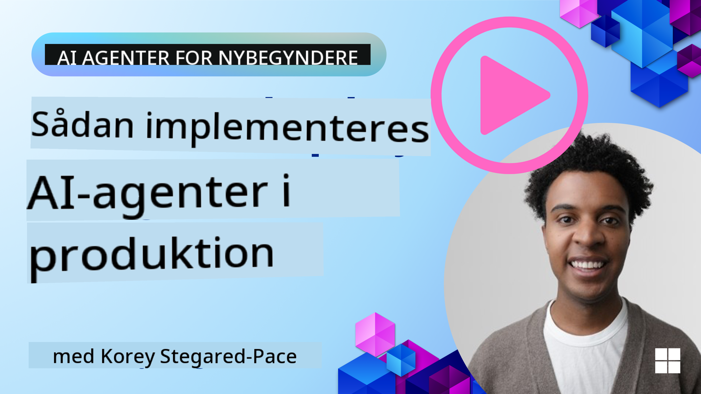

<!--
CO_OP_TRANSLATOR_METADATA:
{
  "original_hash": "cdfd0acc8592c1af14f8637833450375",
  "translation_date": "2025-08-29T15:37:16+00:00",
  "source_file": "10-ai-agents-production/README.md",
  "language_code": "da"
}
-->
# AI-agenter i produktion: Observabilitet & Evaluering

[](https://youtu.be/l4TP6IyJxmQ?si=reGOyeqjxFevyDq9)

Når AI-agenter går fra eksperimentelle prototyper til virkelige applikationer, bliver evnen til at forstå deres adfærd, overvåge deres præstationer og systematisk evaluere deres output afgørende.

## Læringsmål

Efter at have gennemført denne lektion vil du vide hvordan/forstå:
- Grundlæggende begreber inden for agentobservabilitet og evaluering
- Teknikker til at forbedre agenters ydeevne, omkostninger og effektivitet
- Hvad og hvordan du systematisk evaluerer dine AI-agenter
- Hvordan du styrer omkostninger ved at implementere AI-agenter i produktion
- Hvordan du instrumenterer agenter bygget med AutoGen

Målet er at give dig viden til at omdanne dine "black box"-agenter til transparente, håndterbare og pålidelige systemer.

_**Bemærk:** Det er vigtigt at implementere AI-agenter, der er sikre og pålidelige. Se lektionen [Bygning af pålidelige AI-agenter](./06-building-trustworthy-agents/README.md) for mere information._

## Traces og Spans

Observabilitetsværktøjer som [Langfuse](https://langfuse.com/) eller [Azure AI Foundry](https://learn.microsoft.com/en-us/azure/ai-foundry/what-is-azure-ai-foundry) repræsenterer typisk agentkørsler som traces og spans.

- **Trace** repræsenterer en komplet agentopgave fra start til slut (som at håndtere en brugerforespørgsel).
- **Spans** er individuelle trin inden for trace (som at kalde en sprogmodel eller hente data).


Uden observabilitet kan en AI-agent føles som en "black box" – dens interne tilstand og ræsonnement er uigennemsigtige, hvilket gør det svært at diagnosticere problemer eller optimere ydeevnen. Med observabilitet bliver agenter "glass boxes," der tilbyder den gennemsigtighed, der er afgørende for at opbygge tillid og sikre, at de fungerer som tiltænkt.

## Hvorfor observabilitet er vigtigt i produktionsmiljøer

Overgangen af AI-agenter til produktionsmiljøer introducerer en række nye udfordringer og krav. Observabilitet er ikke længere en "nice-to-have," men en kritisk funktion:

*   **Fejlfinding og årsagsanalyse**: Når en agent fejler eller producerer et uventet output, giver observabilitetsværktøjer de traces, der er nødvendige for at finde kilden til fejlen. Dette er især vigtigt i komplekse agenter, der kan involvere flere LLM-kald, værktøjsinteraktioner og betinget logik.
*   **Latens- og omkostningsstyring**: AI-agenter er ofte afhængige af LLM'er og andre eksterne API'er, der faktureres pr. token eller pr. kald. Observabilitet muliggør præcis sporing af disse kald, hvilket hjælper med at identificere operationer, der er unødvendigt langsomme eller dyre. Dette gør det muligt for teams at optimere prompts, vælge mere effektive modeller eller redesigne workflows for at styre driftsomkostninger og sikre en god brugeroplevelse.
*   **Tillid, sikkerhed og overholdelse**: I mange applikationer er det vigtigt at sikre, at agenter opfører sig sikkert og etisk. Observabilitet giver en revisionsspor af agentens handlinger og beslutninger. Dette kan bruges til at opdage og afhjælpe problemer som prompt-injektion, generering af skadeligt indhold eller forkert håndtering af personligt identificerbare oplysninger (PII). For eksempel kan du gennemgå traces for at forstå, hvorfor en agent gav et bestemt svar eller brugte et specifikt værktøj.
*   **Kontinuerlige forbedringssløjfer**: Observabilitetsdata er fundamentet for en iterativ udviklingsproces. Ved at overvåge, hvordan agenter klarer sig i den virkelige verden, kan teams identificere områder til forbedring, indsamle data til finjustering af modeller og validere effekten af ændringer. Dette skaber en feedback-sløjfe, hvor produktionsindsigter fra online evaluering informerer offline eksperimenter og forbedringer, hvilket fører til gradvist bedre agentpræstation.

## Vigtige metrics at spore

For at overvåge og forstå agentadfærd bør en række metrics og signaler spores. Selvom de specifikke metrics kan variere afhængigt af agentens formål, er nogle universelt vigtige.

Her er nogle af de mest almindelige metrics, som observabilitetsværktøjer overvåger:

**Latens:** Hvor hurtigt reagerer agenten? Lange ventetider påvirker brugeroplevelsen negativt. Du bør måle latens for opgaver og individuelle trin ved at spore agentkørsler. For eksempel kan en agent, der tager 20 sekunder for alle modelkald, accelereres ved at bruge en hurtigere model eller ved at køre modelkald parallelt.

**Omkostninger:** Hvad er udgiften pr. agentkørsel? AI-agenter er afhængige af LLM-kald, der faktureres pr. token eller eksterne API'er. Hyppig værktøjsbrug eller flere prompts kan hurtigt øge omkostningerne. For eksempel, hvis en agent kalder en LLM fem gange for marginal kvalitetsforbedring, skal du vurdere, om omkostningen er berettiget, eller om du kan reducere antallet af kald eller bruge en billigere model. Overvågning i realtid kan også hjælpe med at identificere uventede stigninger (f.eks. fejl, der forårsager overdrevne API-løkker).

**Forespørgselsfejl:** Hvor mange forespørgsler fejlede agenten? Dette kan inkludere API-fejl eller mislykkede værktøjskald. For at gøre din agent mere robust mod disse i produktion kan du opsætte fallback-mekanismer eller retries. F.eks. hvis LLM-udbyder A er nede, kan du skifte til LLM-udbyder B som backup.

**Brugerfeedback:** Implementering af direkte bruger-evalueringer giver værdifulde indsigter. Dette kan inkludere eksplicitte vurderinger (👍thumbs-up/👎down, ⭐1-5 stjerner) eller tekstkommentarer. Konsistent negativ feedback bør advare dig, da det er et tegn på, at agenten ikke fungerer som forventet.

**Implicit brugerfeedback:** Brugeradfærd giver indirekte feedback, selv uden eksplicitte vurderinger. Dette kan inkludere øjeblikkelig omformulering af spørgsmål, gentagne forespørgsler eller klik på en retry-knap. F.eks. hvis du ser, at brugere gentagne gange stiller det samme spørgsmål, er det et tegn på, at agenten ikke fungerer som forventet.

**Nøjagtighed:** Hvor ofte producerer agenten korrekte eller ønskede output? Definitionen af nøjagtighed varierer (f.eks. korrekthed i problemløsning, informationshentning, bruger-tilfredshed). Det første skridt er at definere, hvad succes betyder for din agent. Du kan spore nøjagtighed via automatiske checks, evalueringsscorer eller opgavemærkater. For eksempel kan traces markeres som "lykkedes" eller "mislykkedes."

**Automatiske evalueringsmetrics:** Du kan også opsætte automatiske evalueringer. For eksempel kan du bruge en LLM til at score agentens output, f.eks. om det er nyttigt, nøjagtigt eller ej. Der findes også flere open source-biblioteker, der hjælper med at score forskellige aspekter af agenten. F.eks. [RAGAS](https://docs.ragas.io/) for RAG-agenter eller [LLM Guard](https://llm-guard.com/) til at opdage skadeligt sprog eller prompt-injektion.

I praksis giver en kombination af disse metrics den bedste dækning af en AI-agents sundhed. I dette kapitels [eksempelsnotebook](./code_samples/10_autogen_evaluation.ipynb) viser vi, hvordan disse metrics ser ud i virkelige eksempler, men først lærer vi, hvordan en typisk evalueringsworkflow ser ud.

## Instrumentér din agent

For at indsamle tracing-data skal du instrumentere din kode. Målet er at instrumentere agentkoden til at udsende traces og metrics, der kan indsamles, behandles og visualiseres af en observabilitetsplatform.

**OpenTelemetry (OTel):** [OpenTelemetry](https://opentelemetry.io/) er blevet en industristandard for LLM-observabilitet. Det tilbyder et sæt API'er, SDK'er og værktøjer til generering, indsamling og eksport af telemetridata.

Der findes mange instrumenteringsbiblioteker, der wrapper eksisterende agentframeworks og gør det nemt at eksportere OpenTelemetry-spans til et observabilitetsværktøj. Nedenfor er et eksempel på instrumentering af en AutoGen-agent med [OpenLit-instrumenteringsbiblioteket](https://github.com/openlit/openlit):

```python
import openlit

openlit.init(tracer = langfuse._otel_tracer, disable_batch = True)
```

[Eksempelsnotebooken](./code_samples/10_autogen_evaluation.ipynb) i dette kapitel vil demonstrere, hvordan du instrumenterer din AutoGen-agent.

**Manuel oprettelse af spans:** Mens instrumenteringsbiblioteker giver en god baseline, er der ofte tilfælde, hvor mere detaljeret eller tilpasset information er nødvendig. Du kan manuelt oprette spans for at tilføje tilpasset applikationslogik. Endnu vigtigere kan de berige automatisk eller manuelt oprettede spans med brugerdefinerede attributter (også kendt som tags eller metadata). Disse attributter kan inkludere forretningsspecifikke data, mellemregninger eller enhver kontekst, der kan være nyttig til fejlfinding eller analyse, såsom `user_id`, `session_id` eller `model_version`.

Eksempel på manuel oprettelse af traces og spans med [Langfuse Python SDK](https://langfuse.com/docs/sdk/python/sdk-v3):

```python
from langfuse import get_client
 
langfuse = get_client()
 
span = langfuse.start_span(name="my-span")
 
span.end()
```

## Agent-evaluering

Observabilitet giver os metrics, men evaluering er processen med at analysere disse data (og udføre tests) for at afgøre, hvor godt en AI-agent klarer sig, og hvordan den kan forbedres. Med andre ord, når du har disse traces og metrics, hvordan bruger du dem til at bedømme agenten og træffe beslutninger?

Regelmæssig evaluering er vigtig, fordi AI-agenter ofte er ikke-deterministiske og kan udvikle sig (gennem opdateringer eller ændringer i modeladfærd) – uden evaluering ville du ikke vide, om din "smarte agent" faktisk gør sit job godt eller om den er blevet dårligere.

Der er to kategorier af evalueringer for AI-agenter: **online evaluering** og **offline evaluering**. Begge er værdifulde og supplerer hinanden. Vi begynder normalt med offline evaluering, da dette er det minimum nødvendige skridt, før en agent implementeres.

### Offline evaluering


Dette indebærer evaluering af agenten i et kontrolleret miljø, typisk ved hjælp af testdatasæt, ikke live brugerforespørgsler. Du bruger kuraterede datasæt, hvor du ved, hvad det forventede output eller korrekte adfærd er, og derefter kører din agent på disse.

For eksempel, hvis du har bygget en agent til matematiske tekstproblemer, kan du have et [testdatasæt](https://huggingface.co/datasets/gsm8k) med 100 problemer med kendte svar. Offline evaluering udføres ofte under udvikling (og kan være en del af CI/CD-pipelines) for at kontrollere forbedringer eller beskytte mod regressioner. Fordelen er, at det er **gentageligt, og du kan få klare nøjagtighedsmetrics, da du har ground truth**. Du kan også simulere brugerforespørgsler og måle agentens svar mod ideelle svar eller bruge automatiske metrics som beskrevet ovenfor.

Den største udfordring med offline evaluering er at sikre, at dit testdatasæt er omfattende og forbliver relevant – agenten kan klare sig godt på et fast testdatasæt, men støde på meget forskellige forespørgsler i produktion. Derfor bør du holde testdatasæt opdateret med nye edge cases og eksempler, der afspejler virkelige scenarier​. En blanding af små "smoke test"-cases og større evalueringssæt er nyttig: små sæt til hurtige checks og større til bredere præstationsmetrics​.

### Online evaluering


Dette refererer til evaluering af agenten i et live, virkeligt miljø, dvs. under faktisk brug i produktion. Online evaluering indebærer overvågning af agentens præstation på rigtige brugerinteraktioner og kontinuerlig analyse af resultater.

For eksempel kan du spore succesrater, bruger-tilfredshedsscorer eller andre metrics på live trafik. Fordelen ved online evaluering er, at det **fanger ting, du måske ikke forudser i et laboratoriemiljø** – du kan observere modeldrift over tid (hvis agentens effektivitet forringes, når inputmønstre ændrer sig) og fange uventede forespørgsler eller situationer, der ikke var i dit testdatasæt​. Det giver et sandt billede af, hvordan agenten opfører sig i praksis.

Online evaluering indebærer ofte indsamling af implicit og eksplicit brugerfeedback, som diskuteret, og muligvis kørsel af shadow tests eller A/B-tests (hvor en ny version af agenten kører parallelt for at sammenligne med den gamle). Udfordringen er, at det kan være vanskeligt at få pålidelige labels eller scorer for live interaktioner – du kan være afhængig af brugerfeedback eller downstream metrics (som om brugeren klikkede på resultatet).

### Kombination af de to

Online og offline evalueringer udelukker ikke hinanden; de supplerer hinanden. Indsigter fra online overvågning (f.eks. nye typer brugerforespørgsler, hvor agenten klarer sig dårligt) kan bruges til at udvide og forbedre offline testdatasæt. Omvendt kan agenter, der klarer sig godt i offline tests, derefter implementeres mere selvsikkert og overvåges online.

Faktisk adopterer mange teams en sløjfe:

_evaluér offline -> implementér -> overvåg online -> indsamle nye fejltilfælde -> tilføj til offline datasæt -> forbedr agent -> gentag_.

## Almindelige problemer

Når du implementerer AI-agenter i produktion, kan du støde på forskellige udfordringer. Her er nogle almindelige problemer og deres potentielle løsninger:

| **Problem**    | **Potentiel løsning**   |
| ------------- | ------------------ |
| AI-agent udfører ikke opgaver konsekvent | - Forfin prompten, der gives til AI-agenten; vær klar omkring målene.<br>- Identificér, hvor opdeling af opgaver i delopgaver og håndtering af dem af flere agenter kan hjælpe. |
| AI-agent ender i kontinuerlige løkker  | - Sørg for, at du har klare afslutningsbetingelser, så agenten ved, hvornår processen skal stoppe. |

## Fejlfinding af AI-agenter i produktion

Når AI-agenter er implementeret i produktion, kan der opstå en række problemer. Her er nogle almindelige udfordringer og forslag til, hvordan de kan løses:

| **Problem** | **Løsning** |
|-------------|-------------|
| Agenten giver forkerte eller ufuldstændige svar | - Juster prompten for at give mere kontekst eller specifikke instruktioner.<br>- Brug en større model, hvis den nuværende model ikke er i stand til at håndtere komplekse opgaver. |
| Agenten er langsom til at svare | - Optimer prompten for at reducere kompleksiteten.<br>- Brug en mindre model til enklere opgaver.<br>- Implementer caching for at genbruge svar på gentagne forespørgsler. |
| Agenten misforstår input | - Forbedr inputvalidering og normalisering.<br>- Brug en model, der er bedre til at forstå den specifikke type input.<br>- Implementer en forbehandlingspipeline for at standardisere input. |
| For komplekse opgaver, der kræver ræsonnement og planlægning | - Brug en større model, der er specialiseret i opgaver, der kræver avanceret ræsonnement. |
| AI-agentens værktøjskald fungerer ikke optimalt | - Test og valider værktøjets output uden for agentsystemet.<br>- Forfin de definerede parametre, prompts og navngivning af værktøjer. |
| Multi-agent-systemet fungerer ikke konsekvent | - Forfin prompts til hver agent for at sikre, at de er specifikke og adskiller sig fra hinanden.<br>- Byg et hierarkisk system med en "routing"- eller controller-agent, der kan afgøre, hvilken agent der er den rette. |

Mange af disse problemer kan identificeres mere effektivt, hvis der er observabilitet på plads. De spor og metrikker, vi diskuterede tidligere, hjælper med at lokalisere præcis, hvor i agentens arbejdsgang problemer opstår, hvilket gør fejlfinding og optimering langt mere effektivt.

## Håndtering af omkostninger

Her er nogle strategier til at håndtere omkostningerne ved at implementere AI-agenter i produktion:

**Brug af mindre modeller:** Små sproglige modeller (SLMs) kan klare sig godt i visse agentbaserede brugsscenarier og vil reducere omkostningerne betydeligt. Som nævnt tidligere er det bedste værktøj til at forstå, hvordan en SLM vil klare sig i din brugssituation, at opbygge et evalueringssystem til at sammenligne ydeevne med større modeller. Overvej at bruge SLMs til enklere opgaver som klassificering af hensigt eller parameterudtrækning, mens større modeller reserveres til komplekse ræsonnementer.

**Brug af en router-model:** En lignende strategi er at bruge en diversitet af modeller og størrelser. Du kan bruge en LLM/SLM eller serverless funktion til at dirigere forespørgsler baseret på kompleksitet til de bedst egnede modeller. Dette vil også hjælpe med at reducere omkostningerne, samtidig med at ydeevnen sikres på de rette opgaver. For eksempel kan simple forespørgsler dirigeres til mindre, hurtigere modeller, mens dyre store modeller kun bruges til komplekse ræsonnementer.

**Caching af svar:** Identificer almindelige forespørgsler og opgaver og lever svarene, før de går gennem dit agentsystem. Du kan endda implementere en proces til at identificere, hvor lignende en forespørgsel er med dine cachede forespørgsler ved hjælp af mere basale AI-modeller. Denne strategi kan reducere omkostningerne betydeligt for ofte stillede spørgsmål eller almindelige arbejdsgange.

## Lad os se, hvordan dette fungerer i praksis

I [eksempelsnotebooken for denne sektion](./code_samples/10_autogen_evaluation.ipynb) vil vi se eksempler på, hvordan vi kan bruge observabilitetsværktøjer til at overvåge og evaluere vores agent.

### Har du flere spørgsmål om AI-agenter i produktion?

Deltag i [Azure AI Foundry Discord](https://aka.ms/ai-agents/discord) for at møde andre lærende, deltage i kontortid og få svar på dine spørgsmål om AI-agenter.

## Forrige lektion

[Metakognitivt designmønster](../09-metacognition/README.md)

## Næste lektion

[Agentiske protokoller](../11-agentic-protocols/README.md)

---

**Ansvarsfraskrivelse**:  
Dette dokument er blevet oversat ved hjælp af AI-oversættelsestjenesten [Co-op Translator](https://github.com/Azure/co-op-translator). Selvom vi bestræber os på nøjagtighed, skal du være opmærksom på, at automatiserede oversættelser kan indeholde fejl eller unøjagtigheder. Det originale dokument på dets oprindelige sprog bør betragtes som den autoritative kilde. For kritisk information anbefales professionel menneskelig oversættelse. Vi påtager os intet ansvar for misforståelser eller fejltolkninger, der måtte opstå som følge af brugen af denne oversættelse.