<!--
CO_OP_TRANSLATOR_METADATA:
{
  "original_hash": "5cc6836626047aa055e8960c8484a7d0",
  "translation_date": "2025-08-29T16:06:57+00:00",
  "source_file": "11-agentic-protocols/code_samples/mcp-agents/README.md",
  "language_code": "da"
}
-->
# Bygning af Agent-til-Agent Kommunikationssystemer med MCP

> TL;DR - Kan du bygge Agent2Agent kommunikation på MCP? Ja!

MCP har udviklet sig betydeligt ud over sit oprindelige mål om "at give kontekst til LLM'er". Med de seneste forbedringer, herunder [genoptagelige streams](https://modelcontextprotocol.io/docs/concepts/transports#resumability-and-redelivery), [elicitation](https://modelcontextprotocol.io/specification/2025-06-18/client/elicitation), [sampling](https://modelcontextprotocol.io/specification/2025-06-18/client/sampling) og notifikationer ([fremskridt](https://modelcontextprotocol.io/specification/2025-06-18/basic/utilities/progress) og [ressourcer](https://modelcontextprotocol.io/specification/2025-06-18/schema#resourceupdatednotification)), giver MCP nu et robust fundament for at bygge komplekse agent-til-agent kommunikationssystemer.

## Misforståelsen om Agent/Værktøj

Efterhånden som flere udviklere udforsker værktøjer med agentiske adfærdsmønstre (kører i længere perioder, kan kræve yderligere input under udførelse osv.), er en almindelig misforståelse, at MCP er uegnet, primært fordi tidlige eksempler på dets værktøjsprimitive fokuserede på simple forespørgsel-svar mønstre.

Denne opfattelse er forældet. MCP-specifikationen er blevet betydeligt forbedret over de seneste måneder med funktioner, der lukker hullet for at bygge langvarig agentisk adfærd:

- **Streaming & Delvise Resultater**: Opdateringer i realtid under udførelse
- **Genoptagelighed**: Klienter kan genoprette forbindelse og fortsætte efter afbrydelse
- **Holdbarhed**: Resultater overlever servergenstarter (f.eks. via ressourcelinks)
- **Multi-turn**: Interaktivt input under udførelse via elicitation og sampling

Disse funktioner kan kombineres for at muliggøre komplekse agentiske og multi-agent applikationer, alle implementeret på MCP-protokollen.

Til reference vil vi referere til en agent som et "værktøj", der er tilgængeligt på en MCP-server. Dette indebærer eksistensen af en værtsapplikation, der implementerer en MCP-klient, som etablerer en session med MCP-serveren og kan kalde agenten.

## Hvad gør et MCP-værktøj "agentisk"?

Før vi dykker ned i implementeringen, lad os fastlægge, hvilke infrastrukturegenskaber der er nødvendige for at understøtte langvarige agenter.

> Vi vil definere en agent som en enhed, der kan operere autonomt over længere perioder, i stand til at håndtere komplekse opgaver, der kan kræve flere interaktioner eller justeringer baseret på feedback i realtid.

### 1. Streaming & Delvise Resultater

Traditionelle forespørgsel-svar mønstre fungerer ikke for langvarige opgaver. Agenter skal kunne levere:

- Opdateringer i realtid
- Mellemliggende resultater

**MCP Support**: Ressourceopdateringsnotifikationer muliggør streaming af delvise resultater, selvom dette kræver omhyggelig design for at undgå konflikter med JSON-RPC's 1:1 forespørgsel/svar-model.

| Funktion                  | Brugsscenarie                                                                                                                                                                       | MCP Support                                                                                |
| ------------------------- | ---------------------------------------------------------------------------------------------------------------------------------------------------------------------------------- | ------------------------------------------------------------------------------------------ |
| Opdateringer i realtid    | Bruger anmoder om en kodebase-migrationsopgave. Agenten streamer fremskridt: "10% - Analyserer afhængigheder... 25% - Konverterer TypeScript-filer... 50% - Opdaterer imports..." | ✅ Fremskridtsnotifikationer                                                              |
| Delvise Resultater        | "Generer en bog"-opgave streamer delvise resultater, f.eks. 1) Historiebueoversigt, 2) Kapiteloversigt, 3) Hvert kapitel, når det er færdigt. Værten kan inspicere, annullere eller omdirigere på ethvert stadie. | ✅ Notifikationer kan "udvides" til at inkludere delvise resultater, se forslag på PR 383, 776 |

```mermaid
sequenceDiagram
    participant User
    participant Host as Host App<br/>(MCP Client)
    participant Server as MCP Server<br/>(Agent Tool)

    User->>Host: Start long task
    Host->>Server: Call agent_tool()

    loop Progress Updates
        Server-->>Host: Progress + partial results
        Host-->>User: Stream updates
    end

    Server-->>Host: ✅ Final result
    Host-->>User: Complete
```

<div align="center" style="font-style: italic; font-size: 0.95em; margin-bottom: 0.5em;">
<strong>Figur 1:</strong> Dette diagram illustrerer, hvordan en MCP-agent streamer opdateringer i realtid og delvise resultater til værtsapplikationen under en langvarig opgave, hvilket gør det muligt for brugeren at overvåge udførelsen i realtid.
</div>



### 2. Genoptagelighed

Agenter skal håndtere netværksafbrydelser på en smidig måde:

- Genoprette forbindelse efter (klient) afbrydelse
- Fortsætte fra, hvor de slap (meddelelsesgenlevering)

**MCP Support**: MCP StreamableHTTP transport understøtter i dag session genoptagelse og meddelelsesgenlevering med session-ID'er og sidste event-ID'er. Det vigtige her er, at serveren skal implementere en EventStore, der muliggør event-genafspilning ved klientens genoprettelse.  
Bemærk, at der er et fællesskabsforslag (PR #975), der udforsker transport-agnostiske genoptagelige streams.

| Funktion      | Brugsscenarie                                                                                                                                                   | MCP Support                                                                |
| ------------- | --------------------------------------------------------------------------------------------------------------------------------------------------------------- | -------------------------------------------------------------------------- |
| Genoptagelighed | Klient afbrydes under langvarig opgave. Ved genoprettelse genoptages sessionen med manglende events genafspillet, fortsætter problemfrit fra, hvor den slap. | ✅ StreamableHTTP transport med session-ID'er, event-genafspilning og EventStore |

```mermaid
sequenceDiagram
    participant User
    participant Host as Host App<br/>(MCP Client)
    participant Server as MCP Server<br/>(Agent Tool)
    participant Store as Event Store

    User->>Host: Start task
    Host->>Server: Call tool [session: abc123]
    Server->>Store: Save events

    Note over Host,Server: 💥 Connection lost

    Host->>Server: Reconnect [session: abc123]
    Store-->>Server: Replay events
    Server-->>Host: Catch up + continue
    Host-->>User: ✅ Complete
```

<div align="center" style="font-style: italic; font-size: 0.95em; margin-bottom: 0.5em;">
<strong>Figur 2:</strong> Dette diagram viser, hvordan MCP's StreamableHTTP transport og event store muliggør problemfri session genoptagelse: hvis klienten afbrydes, kan den genoprette forbindelse og genafspille manglende events, fortsætte opgaven uden tab af fremskridt.
</div>



### 3. Holdbarhed

Langvarige agenter har brug for vedvarende tilstand:

- Resultater overlever servergenstarter
- Status kan hentes uden for sessionen
- Fremskridt kan spores på tværs af sessioner

**MCP Support**: MCP understøtter nu en Ressource-link returtype for værktøjskald. I dag er et muligt mønster at designe et værktøj, der opretter en ressource og straks returnerer et ressourcelink. Værktøjet kan fortsætte med at adressere opgaven i baggrunden og opdatere ressourcen. Klienten kan vælge at afsøge tilstanden af denne ressource for at få delvise eller fulde resultater (baseret på hvilke ressourceopdateringer serveren leverer) eller abonnere på ressourcen for opdateringsnotifikationer.

En begrænsning her er, at afsøgning af ressourcer eller abonnement på opdateringer kan forbruge ressourcer med implikationer i stor skala. Der er et åbent fællesskabsforslag (inklusive #992), der udforsker muligheden for at inkludere webhooks eller triggere, som serveren kan kalde for at underrette klienten/værtsapplikationen om opdateringer.

| Funktion    | Brugsscenarie                                                                                                                                        | MCP Support                                                        |
| ----------- | --------------------------------------------------------------------------------------------------------------------------------------------------- | ------------------------------------------------------------------ |
| Holdbarhed  | Serveren går ned under data-migrationsopgave. Resultater og fremskridt overlever genstart, klienten kan tjekke status og fortsætte fra vedvarende ressource. | ✅ Ressourcelinks med vedvarende lagring og statusnotifikationer |

I dag er et almindeligt mønster at designe et værktøj, der opretter en ressource og straks returnerer et ressourcelink. Værktøjet kan i baggrunden adressere opgaven, udsende ressourcenotifikationer, der fungerer som fremskridtsopdateringer eller inkluderer delvise resultater, og opdatere indholdet i ressourcen efter behov.

<div align="center" style="font-style: italic; font-size: 0.95em; margin-bottom: 0.5em;">
<strong>Figur 3:</strong> Dette diagram demonstrerer, hvordan MCP-agenter bruger vedvarende ressourcer og statusnotifikationer til at sikre, at langvarige opgaver overlever servergenstarter, hvilket gør det muligt for klienter at tjekke fremskridt og hente resultater selv efter fejl.
</div>


### 4. Multi-Turn Interaktioner

Agenter har ofte brug for yderligere input under udførelse:

- Menneskelig afklaring eller godkendelse
- AI-assistance til komplekse beslutninger
- Dynamisk parameterjustering

**MCP Support**: Fuldt understøttet via sampling (til AI-input) og elicitation (til menneskeligt input).

| Funktion                 | Brugsscenarie                                                                                                                                     | MCP Support                                           |
| ------------------------ | ------------------------------------------------------------------------------------------------------------------------------------------------- | ----------------------------------------------------- |
| Multi-Turn Interaktioner | Rejsebooking-agent anmoder om prisbekræftelse fra bruger, og beder derefter AI om at opsummere rejseoplysninger, før bookingtransaktionen fuldføres. | ✅ Elicitation for menneskeligt input, sampling for AI-input |

```mermaid
sequenceDiagram
    participant User
    participant Host as Host App<br/>(MCP Client)
    participant Server as MCP Server<br/>(Agent Tool)

    User->>Host: Book flight
    Host->>Server: Call travel_agent

    Server->>Host: Elicitation: "Confirm $500?"
    Note over Host: Elicitation callback (if available)
    Host->>User: 💰 Confirm price?
    User->>Host: "Yes"
    Host->>Server: Confirmed

    Server->>Host: Sampling: "Summarize data"
    Note over Host: AI callback (if available)
    Host->>Server: Report summary

    Server->>Host: ✅ Flight booked
```

<div align="center" style="font-style: italic; font-size: 0.95em; margin-bottom: 0.5em;">
<strong>Figur 4:</strong> Dette diagram viser, hvordan MCP-agenter interaktivt kan anmode om menneskeligt input eller AI-assistance under udførelse, hvilket understøtter komplekse, multi-turn arbejdsgange såsom bekræftelser og dynamisk beslutningstagning.
</div>



## Implementering af Langvarige Agenter på MCP - Kodeoversigt

Som en del af denne artikel leverer vi et [kodebibliotek](https://github.com/victordibia/ai-tutorials/tree/main/MCP%20Agents), der indeholder en komplet implementering af langvarige agenter ved hjælp af MCP Python SDK med StreamableHTTP transport til session genoptagelse og meddelelsesgenlevering. Implementeringen demonstrerer, hvordan MCP-funktioner kan kombineres for at muliggøre sofistikerede agent-lignende adfærdsmønstre.

Specifikt implementerer vi en server med to primære agentværktøjer:

- **Rejseagent** - Simulerer en rejsebookingtjeneste med prisbekræftelse via elicitation
- **Forskningsagent** - Udfører forskningsopgaver med AI-assisterede opsummeringer via sampling

Begge agenter demonstrerer opdateringer i realtid, interaktive bekræftelser og fulde session genoptagelsesfunktioner.

### Centrale Implementeringskoncepter

De følgende sektioner viser server-side agentimplementering og klient-side værtsbehandling for hver funktion:

#### Streaming & Fremskridtsopdateringer - Status for opgave i realtid

Streaming gør det muligt for agenter at levere opdateringer i realtid under langvarige opgaver, hvilket holder brugerne informeret om opgavestatus og mellemliggende resultater.

**Serverimplementering (agent sender fremskridtsnotifikationer):**

```python
# From server/server.py - Travel agent sending progress updates
for i, step in enumerate(steps):
    await ctx.session.send_progress_notification(
        progress_token=ctx.request_id,
        progress=i * 25,
        total=100,
        message=step,
        related_request_id=str(ctx.request_id)
    )
    await anyio.sleep(2)  # Simulate work

# Alternative: Log messages for detailed step-by-step updates
await ctx.session.send_log_message(
    level="info",
    data=f"Processing step {current_step}/{steps} ({progress_percent}%)",
    logger="long_running_agent",
    related_request_id=ctx.request_id,
)
```

**Klientimplementering (vært modtager fremskridtsopdateringer):**

```python
# From client/client.py - Client handling real-time notifications
async def message_handler(message) -> None:
    if isinstance(message, types.ServerNotification):
        if isinstance(message.root, types.LoggingMessageNotification):
            console.print(f"📡 [dim]{message.root.params.data}[/dim]")
        elif isinstance(message.root, types.ProgressNotification):
            progress = message.root.params
            console.print(f"🔄 [yellow]{progress.message} ({progress.progress}/{progress.total})[/yellow]")

# Register message handler when creating session
async with ClientSession(
    read_stream, write_stream,
    message_handler=message_handler
) as session:
```

#### Elicitation - Anmodning om brugerinput

Elicitation gør det muligt for agenter at anmode om brugerinput under udførelse. Dette er essentielt for bekræftelser, afklaringer eller godkendelser under langvarige opgaver.

**Serverimplementering (agent anmoder om bekræftelse):**

```python
# From server/server.py - Travel agent requesting price confirmation
elicit_result = await ctx.session.elicit(
    message=f"Please confirm the estimated price of $1200 for your trip to {destination}",
    requestedSchema=PriceConfirmationSchema.model_json_schema(),
    related_request_id=ctx.request_id,
)

if elicit_result and elicit_result.action == "accept":
    # Continue with booking
    logger.info(f"User confirmed price: {elicit_result.content}")
elif elicit_result and elicit_result.action == "decline":
    # Cancel the booking
    booking_cancelled = True
```

**Klientimplementering (vært leverer elicitation callback):**

```python
# From client/client.py - Client handling elicitation requests
async def elicitation_callback(context, params):
    console.print(f"💬 Server is asking for confirmation:")
    console.print(f"   {params.message}")

    response = console.input("Do you accept? (y/n): ").strip().lower()

    if response in ['y', 'yes']:
        return types.ElicitResult(
            action="accept",
            content={"confirm": True, "notes": "Confirmed by user"}
        )
    else:
        return types.ElicitResult(
            action="decline",
            content={"confirm": False, "notes": "Declined by user"}
        )

# Register the callback when creating the session
async with ClientSession(
    read_stream, write_stream,
    elicitation_callback=elicitation_callback
) as session:
```

#### Sampling - Anmodning om AI-assistance

Sampling gør det muligt for agenter at anmode om LLM-assistance til komplekse beslutninger eller indholdsgenerering under udførelse. Dette muliggør hybride menneske-AI arbejdsgange.

**Serverimplementering (agent anmoder om AI-assistance):**

```python
# From server/server.py - Research agent requesting AI summary
sampling_result = await ctx.session.create_message(
    messages=[
        SamplingMessage(
            role="user",
            content=TextContent(type="text", text=f"Please summarize the key findings for research on: {topic}")
        )
    ],
    max_tokens=100,
    related_request_id=ctx.request_id,
)

if sampling_result and sampling_result.content:
    if sampling_result.content.type == "text":
        sampling_summary = sampling_result.content.text
        logger.info(f"Received sampling summary: {sampling_summary}")
```

**Klientimplementering (vært leverer sampling callback):**

```python
# From client/client.py - Client handling sampling requests
async def sampling_callback(context, params):
    message_text = params.messages[0].content.text if params.messages else 'No message'
    console.print(f"🧠 Server requested sampling: {message_text}")

    # In a real application, this could call an LLM API
    # For demo purposes, we provide a mock response
    mock_response = "Based on current research, MCP has evolved significantly..."

    return types.CreateMessageResult(
        role="assistant",
        content=types.TextContent(type="text", text=mock_response),
        model="interactive-client",
        stopReason="endTurn"
    )

# Register the callback when creating the session
async with ClientSession(
    read_stream, write_stream,
    sampling_callback=sampling_callback,
    elicitation_callback=elicitation_callback
) as session:
```

#### Genoptagelighed - Sessionkontinuitet på tværs af afbrydelser

Genoptagelighed sikrer, at langvarige agentopgaver kan overleve klientafbrydelser og fortsætte problemfrit ved genoprettelse. Dette implementeres gennem event stores og genoptagelsestokens.

**Event Store Implementering (server holder sessiontilstand):**

```python
# From server/event_store.py - Simple in-memory event store
class SimpleEventStore(EventStore):
    def __init__(self):
        self._events: list[tuple[StreamId, EventId, JSONRPCMessage]] = []
        self._event_id_counter = 0

    async def store_event(self, stream_id: StreamId, message: JSONRPCMessage) -> EventId:
        """Store an event and return its ID."""
        self._event_id_counter += 1
        event_id = str(self._event_id_counter)
        self._events.append((stream_id, event_id, message))
        return event_id

    async def replay_events_after(self, last_event_id: EventId, send_callback: EventCallback) -> StreamId | None:
        """Replay events after the specified ID for resumption."""
        # Find events after the last known event and replay them
        for _, event_id, message in self._events[start_index:]:
            await send_callback(EventMessage(message, event_id))

# From server/server.py - Passing event store to session manager
def create_server_app(event_store: Optional[EventStore] = None) -> Starlette:
    server = ResumableServer()

    # Create session manager with event store for resumption
    session_manager = StreamableHTTPSessionManager(
        app=server,
        event_store=event_store,  # Event store enables session resumption
        json_response=False,
        security_settings=security_settings,
    )

    return Starlette(routes=[Mount("/mcp", app=session_manager.handle_request)])

# Usage: Initialize with event store
event_store = SimpleEventStore()
app = create_server_app(event_store)
```

**Klientmetadata med genoptagelsestoken (klient genopretter forbindelse ved hjælp af gemt tilstand):**

```python
# From client/client.py - Client resumption with metadata
if existing_tokens and existing_tokens.get("resumption_token"):
    # Use existing resumption token to continue where we left off
    metadata = ClientMessageMetadata(
        resumption_token=existing_tokens["resumption_token"],
    )
else:
    # Create callback to save resumption token when received
    def enhanced_callback(token: str):
        protocol_version = getattr(session, 'protocol_version', None)
        token_manager.save_tokens(session_id, token, protocol_version, command, args)

    metadata = ClientMessageMetadata(
        on_resumption_token_update=enhanced_callback,
    )

# Send request with resumption metadata
result = await session.send_request(
    types.ClientRequest(
        types.CallToolRequest(
            method="tools/call",
            params=types.CallToolRequestParams(name=command, arguments=args)
        )
    ),
    types.CallToolResult,
    metadata=metadata,
)
```

Værtsapplikationen opretholder session-ID'er og genoptagelsestokens lokalt, hvilket gør det muligt at genoprette forbindelse til eksisterende sessioner uden at miste fremskridt eller tilstand.

### Kodeorganisation

<div align="center" style="font-style: italic; font-size: 0.95em; margin-bottom: 0.5em;">
<strong>Figur 5:</strong> MCP-baseret agentsystemarkitektur
</div>


**Nøglefiler:**

- **`server/server.py`** - Genoptagelig MCP-server med rejse- og forskningsagenter, der demonstrerer elicitation, sampling og fremskridtsopdateringer
- **`client/client.py`** - Interaktiv værtsapplikation med genoptagelsesstøtte, callback-håndtering og tokenadministration
- **`server/event_store.py`** - Event store implementering, der muliggør session genoptagelse og meddelelsesgenlevering

## Udvidelse til Multi-Agent Kommunikation på MCP

Implementeringen ovenfor kan udvides til multi-agent systemer ved at forbedre værtsapplikationens intelligens og omfang:

- **Intelligent Opgavedecomposition**: Vært analyserer komplekse brugerforespørgsler og opdeler dem i delopgaver for forskellige specialiserede agenter
- **Multi-Server Koordination**: Vært opretholder forbindelser til flere MCP-servere, hver med forskellige agentkapaciteter
- **Opgavetilstandshåndtering**: Vært sporer fremskridt på tværs af flere samtidige agentopgaver, håndterer afhængigheder og sekvensering
- **Robusthed & Genforsøg**: Vært håndterer fejl, implementerer genforsøgslogik og omdirigerer opgaver, når agenter bliver utilgængelige
- **Resultatsyntese**: Vært kombinerer output fra flere agenter til sammenhængende endelige resultater

Værten udvikler sig fra en simpel klient til en intelligent orkestrator, der koordinerer distribuerede agentkapaciteter, mens den opretholder den samme MCP-protokol som fundament.

## Konklusion

MCP's forbedrede funktioner - ressourcenotifikationer, elicitation/sampling, genoptagelige streams og vedvarende ressourcer - muliggør komplekse agent-til-agent interaktioner, samtidig med at protokolsimpliciteten opretholdes.

## Kom godt i gang

Klar til at bygge dit eget agent2agent system? Følg disse trin:

### 1. Kør Demoen

```bash
# Start the server with event store for resumption
python -m server.server --port 8006

# In another terminal, run the interactive client
python -m client.client --url http://127.0.0.1:8006/mcp
```

**Tilgængelige kommandoer i interaktiv tilstand:**

- `travel_agent` - Book rejser med prisbekræftelse via elicitation
- `research_agent` - Forskningsemner med AI-assisterede opsummeringer via sampling
- `list` - Vis alle tilgængelige værktøjer
- `clean-tokens` - Ryd genoptagelsestokens
- `help` - Vis detaljeret kommandohjælp
- `quit` - Afslut klienten

### 2. Test Genoptagelsesfunktioner

- Start en langvarig agent (f.eks. `travel_agent`)
- Afbryd klienten under udførelse (Ctrl+C)
- Genstart klienten - den vil automatisk genoptage fra, hvor den slap

### 3. Udforsk og Udvid

- **Udforsk eksemplerne**: Tjek dette [mcp-agents](https://github.com/victordibia/ai-tutorials/tree/main/MCP%20Agents)
- **Deltag i fællesskabet**: Deltag i MCP-diskussioner på GitHub
- **Eksperimenter**: Start med en simpel langvarig opgave og tilføj gradvist streaming, genoptagelighed og multi-agent koordination

Dette demonstrerer, hvordan MCP muliggør intelligente agentadfærdsmønstre, samtidig med at værktøjsbaseret enkelhed opretholdes.

Samlet set udvikler MCP-protokolspecifikationen sig hurtigt; læseren opfordres til at gennemgå den officielle dokumentationsside for de nyeste opdateringer - https://modelcontextprotocol.io/introduction

---

**Ansvarsfraskrivelse**:  
Dette dokument er blevet oversat ved hjælp af AI-oversættelsestjenesten [Co-op Translator](https://github.com/Azure/co-op-translator). Selvom vi bestræber os på at sikre nøjagtighed, skal du være opmærksom på, at automatiserede oversættelser kan indeholde fejl eller unøjagtigheder. Det originale dokument på dets oprindelige sprog bør betragtes som den autoritative kilde. For kritisk information anbefales professionel menneskelig oversættelse. Vi påtager os ikke ansvar for eventuelle misforståelser eller fejltolkninger, der måtte opstå som følge af brugen af denne oversættelse.