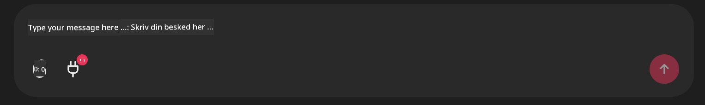

<!--
CO_OP_TRANSLATOR_METADATA:
{
  "original_hash": "9bf0395cbc541ce8db2a9699c8678dfc",
  "translation_date": "2025-07-12T14:22:57+00:00",
  "source_file": "11-mcp/code_samples/github-mcp/README.md",
  "language_code": "da"
}
-->
# Github MCP Server Eksempel

## Beskrivelse

Dette var en demo lavet til AI Agents Hackathon, som blev afholdt gennem Microsoft Reactor.

Værktøjet bruges til at anbefale hackathon-projekter baseret på en brugers Github-repositorier.  
Dette sker ved:

1. **Github Agent** - Bruger Github MCP Server til at hente repositorier og information om disse repositorier.  
2. **Hackathon Agent** - Tager data fra Github Agent og kommer med kreative hackathon-projektidéer baseret på projekterne, de sprog brugeren anvender, og projektsporene for AI Agents hackathon.  
3. **Events Agent** - Baseret på hackathon-agentens forslag vil events agenten anbefale relevante events fra AI Agent Hackathon-serien.  

## Kørsel af koden

### Miljøvariabler

Denne demo bruger Azure Open AI Service, Semantic Kernel, Github MCP Server og Azure AI Search.

Sørg for, at du har de korrekte miljøvariabler sat op for at kunne bruge disse værktøjer:

```python
AZURE_OPENAI_CHAT_DEPLOYMENT_NAME=""
AZURE_OPENAI_EMBEDDING_DEPLOYMENT_NAME=""
AZURE_OPENAI_ENDPOINT=""
AZURE_OPENAI_API_KEY=""
AZURE_OPENAI_API_VERSION=""
AZURE_SEARCH_SERVICE_ENDPOINT=""
AZURE_SEARCH_API_KEY=""
```

## Kørsel af Chainlit Serveren

For at forbinde til MCP serveren bruger denne demo Chainlit som chat-interface.

For at starte serveren, brug følgende kommando i din terminal:

```bash
chainlit run app.py -w
```

Dette skulle starte din Chainlit server på `localhost:8000` samt fylde din Azure AI Search Index med indholdet fra `event-descriptions.md`.

## Forbindelse til MCP Serveren

For at forbinde til Github MCP Server, vælg "stik"-ikonet under chatboksen "Type your message here..":



Derfra kan du klikke på "Connect an MCP" for at tilføje kommandoen til at forbinde til Github MCP Server:

```bash
npx -y @modelcontextprotocol/server-github --env GITHUB_PERSONAL_ACCESS_TOKEN=[YOUR PERSONAL ACCESS TOKEN]
```

Erstat "[YOUR PERSONAL ACCESS TOKEN]" med din faktiske Personal Access Token.

Efter forbindelsen skulle du se et (1) ved siden af stik-ikonet for at bekræfte, at forbindelsen er oprettet. Hvis ikke, prøv at genstarte chainlit serveren med `chainlit run app.py -w`.

## Brug af Demoen

For at starte agent-workflowet med at anbefale hackathon-projekter, kan du skrive en besked som:

"Recommend hackathon projects for the Github user koreyspace"

Router Agent vil analysere din forespørgsel og afgøre, hvilken kombination af agenter (GitHub, Hackathon og Events) der er bedst egnet til at håndtere din forespørgsel. Agenternes samarbejde sikrer omfattende anbefalinger baseret på analyse af Github-repositorier, projektidéudvikling og relevante tech-events.

**Ansvarsfraskrivelse**:  
Dette dokument er blevet oversat ved hjælp af AI-oversættelsestjenesten [Co-op Translator](https://github.com/Azure/co-op-translator). Selvom vi bestræber os på nøjagtighed, bedes du være opmærksom på, at automatiserede oversættelser kan indeholde fejl eller unøjagtigheder. Det oprindelige dokument på dets oprindelige sprog bør betragtes som den autoritative kilde. For kritisk information anbefales professionel menneskelig oversættelse. Vi påtager os intet ansvar for misforståelser eller fejltolkninger, der opstår som følge af brugen af denne oversættelse.