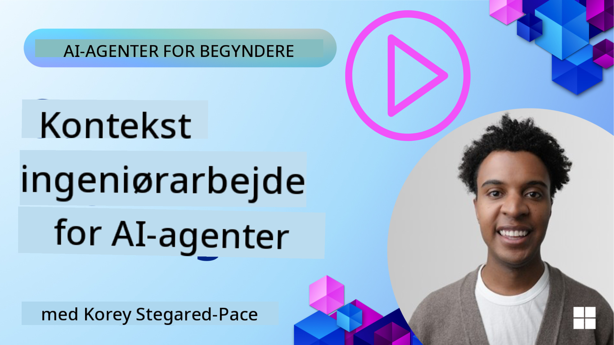
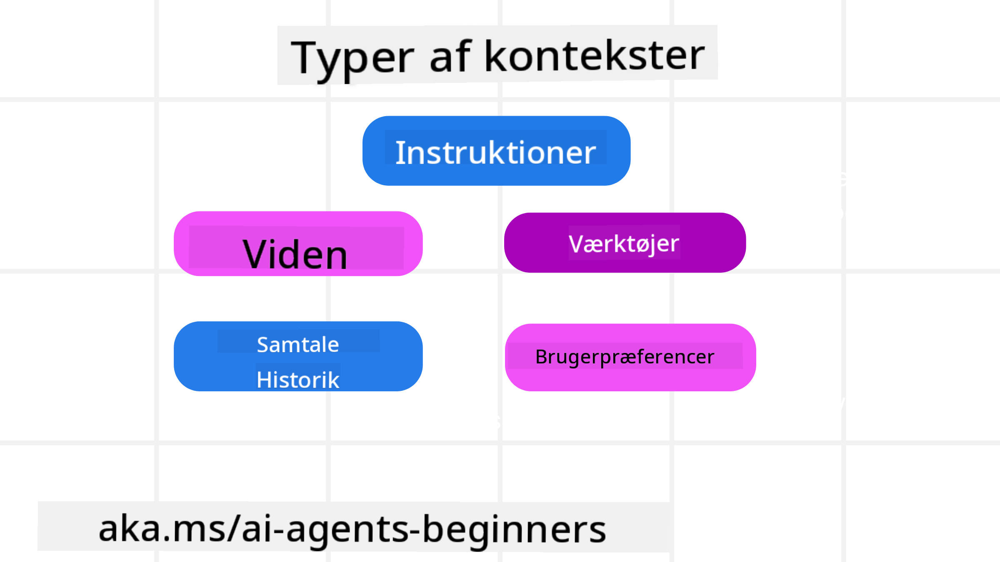
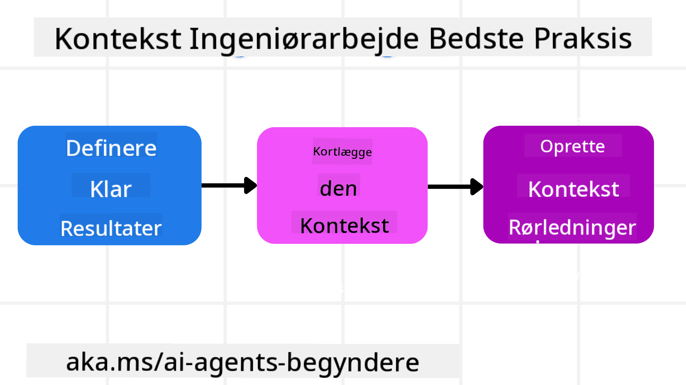

<!--
CO_OP_TRANSLATOR_METADATA:
{
  "original_hash": "cb7e50f471905ce6fdb92a30269a7a98",
  "translation_date": "2025-09-04T10:09:20+00:00",
  "source_file": "12-context-engineering/README.md",
  "language_code": "da"
}
-->
# Kontekst Engineering for AI-agenter

> _(Klik på billedet ovenfor for at se videoen til denne lektion)_

At forstå kompleksiteten af den applikation, du bygger en AI-agent til, er vigtigt for at skabe en pålidelig løsning. Vi skal bygge AI-agenter, der effektivt håndterer information for at imødekomme komplekse behov, der går ud over prompt engineering.

I denne lektion vil vi se på, hvad kontekst engineering er, og hvilken rolle det spiller i opbygningen af AI-agenter.

## Introduktion

Denne lektion vil dække:

• **Hvad kontekst engineering er**, og hvorfor det adskiller sig fra prompt engineering.

• **Strategier for effektiv kontekst engineering**, herunder hvordan man skriver, vælger, komprimerer og isolerer information.

• **Almindelige fejl i kontekst**, der kan afspore din AI-agent, og hvordan man løser dem.

## Læringsmål

Efter at have gennemført denne lektion vil du forstå, hvordan man:

• **Definerer kontekst engineering** og skelner det fra prompt engineering.

• **Identificerer de vigtigste komponenter i kontekst** i applikationer med store sprogmodeller (LLM).

• **Anvender strategier til at skrive, vælge, komprimere og isolere kontekst** for at forbedre agentens ydeevne.

• **Genkender almindelige fejl i kontekst**, såsom forgiftning, distraktion, forvirring og konflikt, og implementerer teknikker til at afhjælpe dem.

## Hvad er Kontekst Engineering?

For AI-agenter er kontekst det, der styrer planlægningen af en AI-agent til at tage bestemte handlinger. Kontekst engineering er praksissen med at sikre, at AI-agenten har den rette information til at fuldføre næste trin i opgaven. Kontekstvinduet har en begrænset størrelse, så som agentbyggere skal vi udvikle systemer og processer til at administrere tilføjelse, fjernelse og kondensering af information i kontekstvinduet.

### Prompt Engineering vs Kontekst Engineering

Prompt engineering fokuserer på et enkelt sæt statiske instruktioner for effektivt at guide AI-agenter med et sæt regler. Kontekst engineering handler om at administrere et dynamisk sæt information, inklusive den oprindelige prompt, for at sikre, at AI-agenten har det, den har brug for over tid. Hovedideen bag kontekst engineering er at gøre denne proces gentagelig og pålidelig.

### Typer af Kontekst

Det er vigtigt at huske, at kontekst ikke bare er én ting. Den information, som AI-agenten har brug for, kan komme fra en række forskellige kilder, og det er op til os at sikre, at agenten har adgang til disse kilder:

De typer af kontekst, en AI-agent kan have brug for at administrere, inkluderer:

• **Instruktioner:** Disse er som agentens "regler" – prompts, systemmeddelelser, få-skud-eksempler (der viser AI'en, hvordan man gør noget) og beskrivelser af værktøjer, den kan bruge. Her kombineres fokus på prompt engineering med kontekst engineering.

• **Viden:** Dette dækker fakta, information hentet fra databaser eller langtidshukommelser, som agenten har akkumuleret. Dette inkluderer integration af et Retrieval Augmented Generation (RAG)-system, hvis en agent har brug for adgang til forskellige videnslagre og databaser.

• **Værktøjer:** Dette er definitioner af eksterne funktioner, API'er og MCP-servere, som agenten kan kalde, sammen med den feedback (resultater), den får ved at bruge dem.

• **Samtalehistorik:** Den løbende dialog med en bruger. Over tid bliver disse samtaler længere og mere komplekse, hvilket betyder, at de optager plads i kontekstvinduet.

• **Brugerpræferencer:** Information, der er lært om en brugers præferencer over tid. Disse kan gemmes og bruges, når der skal træffes vigtige beslutninger for at hjælpe brugeren.

## Strategier for Effektiv Kontekst Engineering

### Planlægningsstrategier

God kontekst engineering starter med god planlægning. Her er en tilgang, der kan hjælpe dig med at begynde at tænke over, hvordan du anvender konceptet kontekst engineering:

1. **Definer klare resultater** - Resultaterne af de opgaver, som AI-agenter vil blive tildelt, bør være klart defineret. Besvar spørgsmålet - "Hvordan vil verden se ud, når AI-agenten er færdig med sin opgave?" Med andre ord, hvilken ændring, information eller respons skal brugeren have efter at have interageret med AI-agenten.

2. **Kortlæg konteksten** - Når du har defineret resultaterne af AI-agenten, skal du besvare spørgsmålet "Hvilken information har AI-agenten brug for for at fuldføre denne opgave?". På denne måde kan du begynde at kortlægge konteksten for, hvor denne information kan findes.

3. **Opret kontekst pipelines** - Nu hvor du ved, hvor informationen er, skal du besvare spørgsmålet "Hvordan vil agenten få denne information?". Dette kan gøres på forskellige måder, inklusive RAG, brug af MCP-servere og andre værktøjer.

### Praktiske Strategier

Planlægning er vigtigt, men når informationen begynder at strømme ind i agentens kontekstvindue, skal vi have praktiske strategier til at administrere det:

#### Håndtering af Kontekst

Mens noget information automatisk vil blive tilføjet til kontekstvinduet, handler kontekst engineering om at tage en mere aktiv rolle i denne information, hvilket kan gøres med nogle få strategier:

1. **Agentens Notatblok**  
   Dette giver en AI-agent mulighed for at tage noter om relevant information om de aktuelle opgaver og brugerinteraktioner under en enkelt session. Dette bør eksistere uden for kontekstvinduet i en fil eller runtime-objekt, som agenten senere kan hente under denne session, hvis det er nødvendigt.

2. **Hukommelser**  
   Notatblokke er gode til at administrere information uden for kontekstvinduet i en enkelt session. Hukommelser gør det muligt for agenter at gemme og hente relevant information på tværs af flere sessioner. Dette kan inkludere resuméer, brugerpræferencer og feedback til forbedringer i fremtiden.

3. **Komprimering af Kontekst**  
   Når kontekstvinduet vokser og nærmer sig sin grænse, kan teknikker som opsummering og beskæring bruges. Dette inkluderer enten at beholde kun den mest relevante information eller fjerne ældre meddelelser.

4. **Multi-agent Systemer**  
   Udvikling af multi-agent systemer er en form for kontekst engineering, fordi hver agent har sit eget kontekstvindue. Hvordan denne kontekst deles og overføres til forskellige agenter er en anden ting at planlægge, når man bygger disse systemer.

5. **Sandbox Miljøer**  
   Hvis en agent skal køre noget kode eller behandle store mængder information i et dokument, kan dette tage en stor mængde tokens for at behandle resultaterne. I stedet for at have dette alt sammen gemt i kontekstvinduet, kan agenten bruge et sandbox-miljø, der er i stand til at køre denne kode og kun læse resultaterne og anden relevant information.

6. **Runtime State Objects**  
   Dette gøres ved at oprette containere med information til at administrere situationer, hvor agenten skal have adgang til bestemt information. For en kompleks opgave vil dette gøre det muligt for agenten at gemme resultaterne af hver delopgave trin for trin, hvilket gør det muligt for konteksten kun at forblive forbundet til den specifikke delopgave.

### Eksempel på Kontekst Engineering

Lad os sige, at vi vil have en AI-agent til at **"Booke mig en rejse til Paris."**

• En simpel agent, der kun bruger prompt engineering, kunne bare svare: **"Okay, hvornår vil du gerne tage til Paris?"** Den behandler kun dit direkte spørgsmål på det tidspunkt, hvor brugeren spørger.

• En agent, der bruger de kontekst engineering-strategier, vi har dækket, ville gøre meget mere. Før den overhovedet svarer, kunne dens system:

  ◦ **Tjekke din kalender** for ledige datoer (henter realtidsdata).

 ◦ **Huske tidligere rejsepræferencer** (fra langtidshukommelse) som dit foretrukne flyselskab, budget eller om du foretrækker direkte fly.

 ◦ **Identificere tilgængelige værktøjer** til fly- og hotelbooking.

- Derefter kunne et eksempel på et svar være: "Hej [Dit Navn]! Jeg kan se, at du er ledig den første uge i oktober. Skal jeg kigge efter direkte fly til Paris med [Foretrukket Flyselskab] inden for dit sædvanlige budget på [Budget]?" Denne rigere, kontekstbevidste respons demonstrerer styrken ved kontekst engineering.

## Almindelige Fejl i Kontekst

### Kontekst Forgiftning

**Hvad det er:** Når en hallucination (falsk information genereret af LLM) eller en fejl kommer ind i konteksten og gentagne gange refereres, hvilket får agenten til at forfølge umulige mål eller udvikle meningsløse strategier.

**Hvad man skal gøre:** Implementer **kontekstvalidering** og **karantæne**. Valider information, før den tilføjes til langtidshukommelsen. Hvis potentiel forgiftning opdages, start nye konteksttråde for at forhindre, at den dårlige information spreder sig.

**Eksempel på Rejsebooking:** Din agent hallucinerer en **direkte flyvning fra en lille lokal lufthavn til en fjern international by**, der faktisk ikke tilbyder internationale flyvninger. Denne ikke-eksisterende flyvningsdetalje gemmes i konteksten. Senere, når du beder agenten om at booke, forsøger den gentagne gange at finde billetter til denne umulige rute, hvilket fører til gentagne fejl.

**Løsning:** Implementer et trin, der **validerer flyvningens eksistens og ruter med en realtids-API** _før_ flyvningsdetaljen tilføjes til agentens arbejdskontekst. Hvis valideringen fejler, "karantænes" den fejlagtige information og bruges ikke yderligere.

### Kontekst Distraktion

**Hvad det er:** Når konteksten bliver så stor, at modellen fokuserer for meget på den akkumulerede historik i stedet for at bruge det, den lærte under træningen, hvilket fører til gentagne eller ubrugelige handlinger. Modeller kan begynde at lave fejl, selv før kontekstvinduet er fyldt.

**Hvad man skal gøre:** Brug **kontekstopsummering**. Komprimer periodisk akkumuleret information til kortere resuméer, der bevarer vigtige detaljer, mens redundant historik fjernes. Dette hjælper med at "nulstille" fokus.

**Eksempel på Rejsebooking:** Du har diskuteret forskellige drømmerejsemål i lang tid, inklusive en detaljeret genfortælling af din backpacking-tur for to år siden. Når du endelig beder om at **"finde mig en billig flyvning til næste måned"**, bliver agenten fanget i de gamle, irrelevante detaljer og bliver ved med at spørge om dit backpacking-udstyr eller tidligere rejseplaner, i stedet for at fokusere på din aktuelle anmodning.

**Løsning:** Efter et vist antal vendinger eller når konteksten bliver for stor, bør agenten **opsummere de mest nylige og relevante dele af samtalen** – med fokus på dine aktuelle rejsedatoer og destination – og bruge det kondenserede resumé til næste LLM-opkald, mens den kasserer den mindre relevante historiske chat.

### Kontekst Forvirring

**Hvad det er:** Når unødvendig kontekst, ofte i form af for mange tilgængelige værktøjer, får modellen til at generere dårlige svar eller kalde irrelevante værktøjer. Mindre modeller er især tilbøjelige til dette.

**Hvad man skal gøre:** Implementer **værktøjsstyring** ved hjælp af RAG-teknikker. Gem værktøjsbeskrivelser i en vektordatabase og vælg _kun_ de mest relevante værktøjer til hver specifik opgave. Forskning viser, at det er bedst at begrænse værktøjsvalg til færre end 30.

**Eksempel på Rejsebooking:** Din agent har adgang til dusinvis af værktøjer: `book_flight`, `book_hotel`, `rent_car`, `find_tours`, `currency_converter`, `weather_forecast`, `restaurant_reservations` osv. Du spørger, **"Hvad er den bedste måde at komme rundt i Paris?"** På grund af det store antal værktøjer bliver agenten forvirret og forsøger at kalde `book_flight` _indenfor_ Paris eller `rent_car`, selvom du foretrækker offentlig transport, fordi værktøjsbeskrivelserne måske overlapper eller den simpelthen ikke kan skelne det bedste.

**Løsning:** Brug **RAG over værktøjsbeskrivelser**. Når du spørger om at komme rundt i Paris, henter systemet dynamisk _kun_ de mest relevante værktøjer som `rent_car` eller `public_transport_info` baseret på din forespørgsel og præsenterer en fokuseret "værktøjsopsætning" til LLM.

### Kontekst Konflikt

**Hvad det er:** Når modstridende information findes inden for konteksten, hvilket fører til inkonsekvent ræsonnement eller dårlige endelige svar. Dette sker ofte, når information ankommer i etaper, og tidlige, forkerte antagelser forbliver i konteksten.

**Hvad man skal gøre:** Brug **kontekstbeskæring** og **offloading**. Beskæring betyder at fjerne forældet eller modstridende information, når nye detaljer ankommer. Offloading giver modellen et separat "notatblok"-arbejdsområde til at behandle information uden at overbelaste hovedkonteksten.

**Eksempel på Rejsebooking:** Du fortæller først din agent, **"Jeg vil flyve på økonomiklasse."** Senere i samtalen ændrer du mening og siger, **"Faktisk, til denne tur, lad os tage business class."** Hvis begge instruktioner forbliver i konteksten, kan agenten modtage modstridende søgeresultater eller blive forvirret over, hvilken præference der skal prioriteres.

**Løsning:** Implementer **kontekstbeskæring**. Når en ny instruktion modsiger en gammel, fjernes den ældre instruktion eller eksplicit overskrives i konteksten. Alternativt kan agenten bruge en **notatblok** til at afstemme modstridende præferencer, før den beslutter sig, og sikre, at kun den endelige, konsistente instruktion styrer dens handlinger.

## Har du flere spørgsmål om Kontekst Engineering?

Deltag i [Azure AI Foundry Discord](https://aka.ms/ai-agents/discord) for at møde andre lærende, deltage i kontortimer og få svar på dine spørgsmål om AI-agenter.

---

**Ansvarsfraskrivelse**:  
Dette dokument er blevet oversat ved hjælp af AI-oversættelsestjenesten [Co-op Translator](https://github.com/Azure/co-op-translator). Selvom vi bestræber os på nøjagtighed, skal du være opmærksom på, at automatiserede oversættelser kan indeholde fejl eller unøjagtigheder. Det originale dokument på dets oprindelige sprog bør betragtes som den autoritative kilde. For kritisk information anbefales professionel menneskelig oversættelse. Vi påtager os intet ansvar for misforståelser eller fejltolkninger, der måtte opstå som følge af brugen af denne oversættelse.