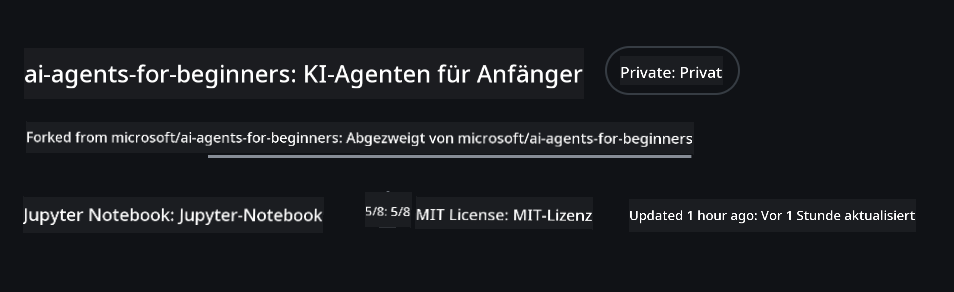
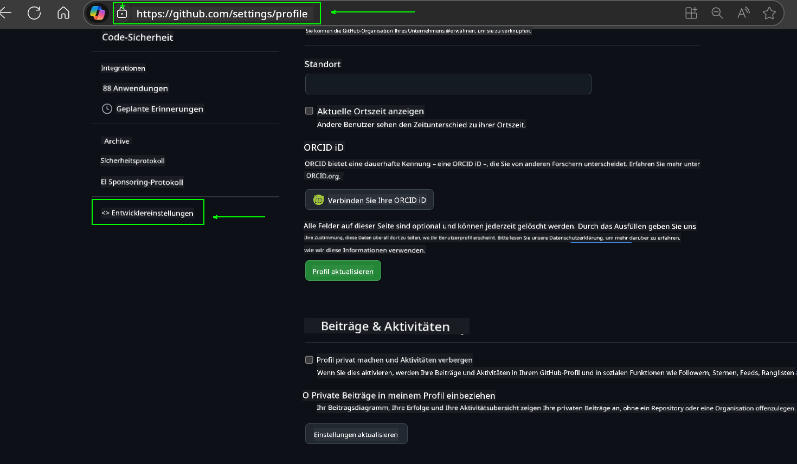
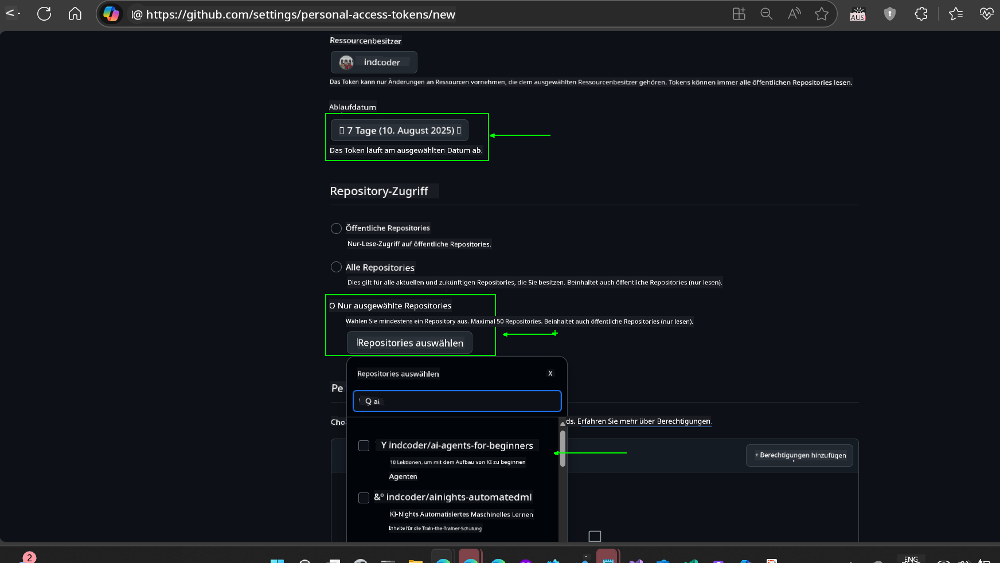
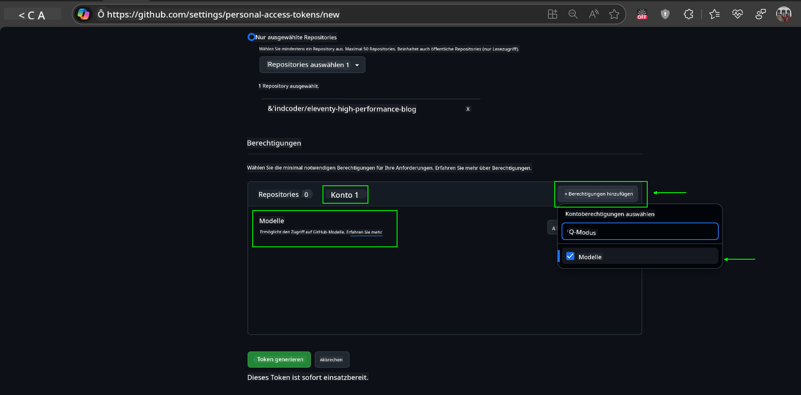
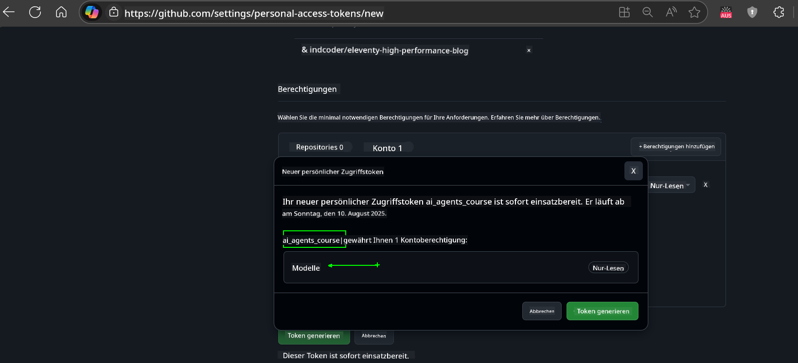
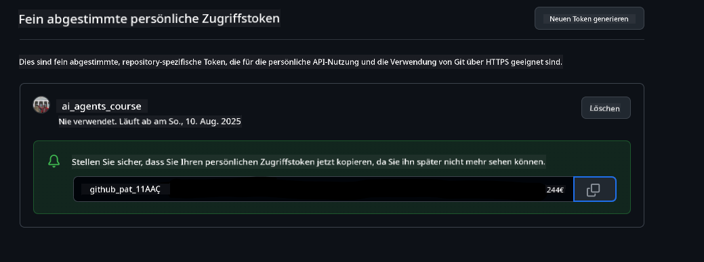
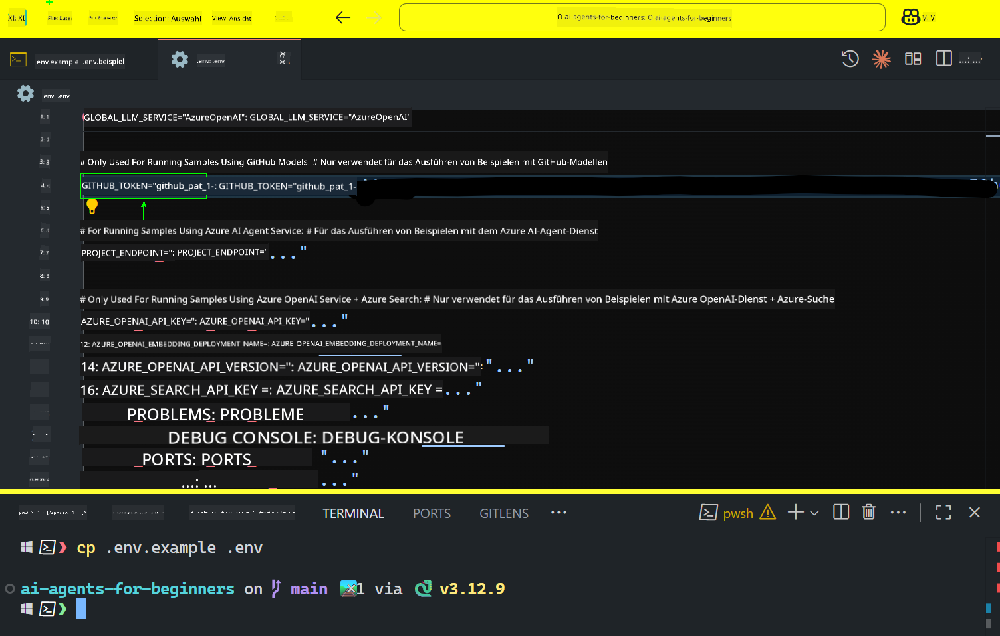
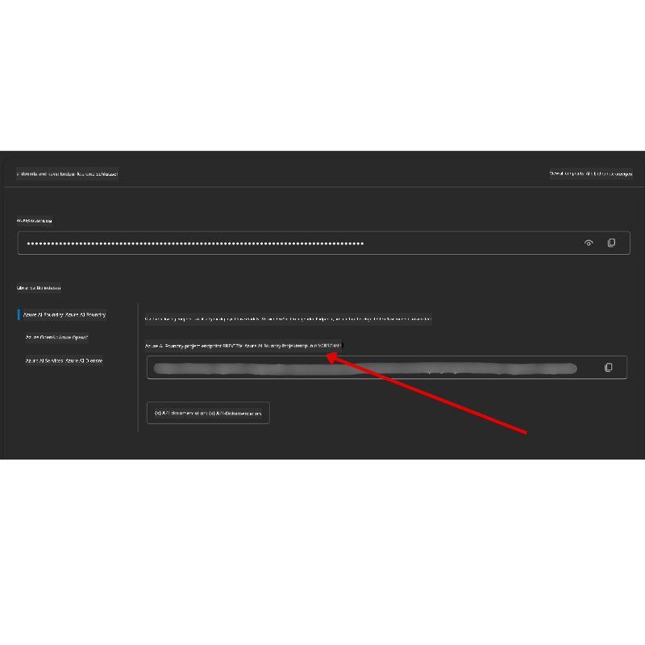

<!--
CO_OP_TRANSLATOR_METADATA:
{
  "original_hash": "c55b973b1562abf5aadf6a4028265ac5",
  "translation_date": "2025-08-30T13:25:08+00:00",
  "source_file": "00-course-setup/README.md",
  "language_code": "de"
}
-->
# Kursvorbereitung

## Einführung

In dieser Lektion erfahren Sie, wie Sie die Codebeispiele dieses Kurses ausführen können.

## Treten Sie anderen Lernenden bei und holen Sie sich Unterstützung

Bevor Sie Ihr Repository klonen, treten Sie dem [AI Agents For Beginners Discord-Kanal](https://aka.ms/ai-agents/discord) bei, um Unterstützung bei der Einrichtung zu erhalten, Fragen zum Kurs zu stellen oder sich mit anderen Lernenden zu vernetzen.

## Klonen oder Forken dieses Repos

Um zu beginnen, klonen oder forken Sie bitte das GitHub-Repository. Dadurch erstellen Sie Ihre eigene Version des Kursmaterials, sodass Sie den Code ausführen, testen und anpassen können!

Dies kann durch Klicken auf den Link erfolgen, um

Sie sollten nun Ihre eigene geforkte Version dieses Kurses unter folgendem Link haben:



## Den Code ausführen

Dieser Kurs bietet eine Reihe von Jupyter Notebooks, die Sie ausführen können, um praktische Erfahrungen beim Erstellen von KI-Agenten zu sammeln.

Die Codebeispiele verwenden entweder:

**Erfordert ein kostenloses GitHub-Konto**:

1) Semantic Kernel Agent Framework + GitHub Models Marketplace. Gekennzeichnet als (semantic-kernel.ipynb)  
2) AutoGen Framework + GitHub Models Marketplace. Gekennzeichnet als (autogen.ipynb)  

**Erfordert ein Azure-Abonnement**:  
3) Azure AI Foundry + Azure AI Agent Service. Gekennzeichnet als (azureaiagent.ipynb)  

Wir empfehlen Ihnen, alle drei Arten von Beispielen auszuprobieren, um herauszufinden, welche für Sie am besten geeignet ist.

Die von Ihnen gewählte Option bestimmt, welche Einrichtungsschritte Sie im Folgenden ausführen müssen:

## Anforderungen

- Python 3.12+  
  - **HINWEIS**: Falls Python 3.12 nicht installiert ist, stellen Sie sicher, dass Sie es installieren. Erstellen Sie dann Ihre virtuelle Umgebung (venv) mit python3.12, um sicherzustellen, dass die richtigen Versionen aus der Datei requirements.txt installiert werden.  
- Ein GitHub-Konto – für den Zugriff auf den GitHub Models Marketplace  
- Ein Azure-Abonnement – für den Zugriff auf Azure AI Foundry  
- Ein Azure AI Foundry-Konto – für den Zugriff auf den Azure AI Agent Service  

Wir haben eine `requirements.txt`-Datei im Stammverzeichnis dieses Repositories bereitgestellt, die alle erforderlichen Python-Pakete enthält, um die Codebeispiele auszuführen.

Sie können diese installieren, indem Sie den folgenden Befehl in Ihrem Terminal im Stammverzeichnis des Repositories ausführen:

```bash
pip install -r requirements.txt
```  
Wir empfehlen, eine Python-virtuelle Umgebung zu erstellen, um Konflikte und Probleme zu vermeiden.

## VSCode einrichten

Stellen Sie sicher, dass Sie die richtige Python-Version in VSCode verwenden.


## Einrichtung für Beispiele mit GitHub-Modellen

### Schritt 1: Abrufen Ihres GitHub Personal Access Token (PAT)

Dieser Kurs nutzt den GitHub Models Marketplace, der kostenlosen Zugang zu großen Sprachmodellen (LLMs) bietet, die Sie zum Erstellen von KI-Agenten verwenden werden.

Um die GitHub-Modelle zu nutzen, müssen Sie ein [GitHub Personal Access Token](https://docs.github.com/en/authentication/keeping-your-account-and-data-secure/managing-your-personal-access-tokens) erstellen.

Dies kann in Ihrem GitHub-Konto erfolgen.

Bitte befolgen Sie das [Prinzip der minimalen Rechtevergabe](https://docs.github.com/en/get-started/learning-to-code/storing-your-secrets-safely), wenn Sie Ihr Token erstellen. Das bedeutet, dass Sie dem Token nur die Berechtigungen geben sollten, die es benötigt, um die Codebeispiele in diesem Kurs auszuführen.

1. Wählen Sie die Option `Fine-grained tokens` auf der linken Seite Ihres Bildschirms, indem Sie zu den **Entwicklereinstellungen** navigieren.  
   

   Wählen Sie dann `Generate new token`.  

   

2. Geben Sie einen beschreibenden Namen für Ihr Token ein, der seinen Zweck widerspiegelt, damit es später leicht zu identifizieren ist.

    🔐 **Empfohlene Token-Dauer**  

    Empfohlene Dauer: 30 Tage  
    Für eine sicherere Vorgehensweise können Sie eine kürzere Dauer wählen – z. B. 7 Tage 🛡️  
    Das ist eine großartige Möglichkeit, sich ein persönliches Ziel zu setzen und den Kurs abzuschließen, während Ihre Lernmotivation hoch ist 🚀.  

    

3. Beschränken Sie den Geltungsbereich des Tokens auf Ihren Fork dieses Repositories.

    

4. Beschränken Sie die Berechtigungen des Tokens: Unter **Permissions** klicken Sie auf den Tab **Account** und dann auf die Schaltfläche "+ Add permissions". Ein Dropdown-Menü erscheint. Suchen Sie nach **Models** und aktivieren Sie das Kästchen dafür.  
    

5. Überprüfen Sie die erforderlichen Berechtigungen, bevor Sie das Token generieren.  
   

6. Bevor Sie das Token generieren, stellen Sie sicher, dass Sie bereit sind, das Token an einem sicheren Ort wie einem Passwort-Manager-Tresor zu speichern, da es nach der Erstellung nicht erneut angezeigt wird.  
   

Kopieren Sie Ihr neu erstelltes Token. Sie werden es nun in Ihre `.env`-Datei einfügen, die in diesem Kurs enthalten ist.

### Schritt 2: Erstellen Ihrer `.env`-Datei

Um Ihre `.env`-Datei zu erstellen, führen Sie den folgenden Befehl in Ihrem Terminal aus:

```bash
cp .env.example .env
```

Dies kopiert die Beispieldatei und erstellt eine `.env`-Datei in Ihrem Verzeichnis, in der Sie die Werte für die Umgebungsvariablen eintragen.

Öffnen Sie Ihre `.env`-Datei in Ihrem bevorzugten Texteditor und fügen Sie Ihr kopiertes Token in das Feld `GITHUB_TOKEN` ein.  


Sie sollten nun in der Lage sein, die Codebeispiele dieses Kurses auszuführen.

## Einrichtung für Beispiele mit Azure AI Foundry und Azure AI Agent Service

### Schritt 1: Abrufen Ihres Azure-Projektendpunkts

Befolgen Sie die Schritte zur Erstellung eines Hubs und Projekts in Azure AI Foundry, die hier beschrieben sind: [Hub-Ressourcenübersicht](https://learn.microsoft.com/en-us/azure/ai-foundry/concepts/ai-resources)

Sobald Sie Ihr Projekt erstellt haben, müssen Sie die Verbindungszeichenfolge für Ihr Projekt abrufen.

Dies kann auf der **Übersichtsseite** Ihres Projekts im Azure AI Foundry-Portal erfolgen.



### Schritt 2: Erstellen Ihrer `.env`-Datei

Um Ihre `.env`-Datei zu erstellen, führen Sie den folgenden Befehl in Ihrem Terminal aus:

```bash
cp .env.example .env
```

Dies kopiert die Beispieldatei und erstellt eine `.env`-Datei in Ihrem Verzeichnis, in der Sie die Werte für die Umgebungsvariablen eintragen.

Öffnen Sie Ihre `.env`-Datei in Ihrem bevorzugten Texteditor und fügen Sie Ihre Verbindungszeichenfolge in das Feld `PROJECT_ENDPOINT` ein.

### Schritt 3: Anmeldung bei Azure

Als Sicherheitsbest-Practice verwenden wir [schlüssellose Authentifizierung](https://learn.microsoft.com/azure/developer/ai/keyless-connections?tabs=csharp%2Cazure-cli?WT.mc_id=academic-105485-koreyst), um uns bei Azure OpenAI mit Microsoft Entra ID zu authentifizieren.

Öffnen Sie anschließend ein Terminal und führen Sie `az login --use-device-code` aus, um sich bei Ihrem Azure-Konto anzumelden.

Sobald Sie sich angemeldet haben, wählen Sie Ihr Abonnement im Terminal aus.

## Zusätzliche Umgebungsvariablen – Azure Search und Azure OpenAI

Für die Agentic RAG-Lektion – Lektion 5 – gibt es Beispiele, die Azure Search und Azure OpenAI verwenden.

Wenn Sie diese Beispiele ausführen möchten, müssen Sie die folgenden Umgebungsvariablen zu Ihrer `.env`-Datei hinzufügen:

### Übersichtsseite (Projekt)

- `AZURE_SUBSCRIPTION_ID` – Überprüfen Sie **Projektdetails** auf der **Übersichtsseite** Ihres Projekts.  
- `AZURE_AI_PROJECT_NAME` – Schauen Sie oben auf der **Übersichtsseite** Ihres Projekts nach.  
- `AZURE_OPENAI_SERVICE` – Finden Sie dies im Tab **Eingeschlossene Funktionen** für **Azure OpenAI Service** auf der **Übersichtsseite**.

### Verwaltungszentrum

- `AZURE_OPENAI_RESOURCE_GROUP` – Gehen Sie zu **Projekteigenschaften** auf der **Übersichtsseite** des **Verwaltungszentrums**.  
- `GLOBAL_LLM_SERVICE` – Unter **Verbundene Ressourcen** finden Sie den Verbindungsnamen für **Azure AI Services**. Falls nicht aufgeführt, überprüfen Sie das **Azure-Portal** unter Ihrer Ressourcengruppe nach dem Ressourcennamen der KI-Dienste.

### Seite Modelle + Endpunkte

- `AZURE_OPENAI_EMBEDDING_DEPLOYMENT_NAME` – Wählen Sie Ihr Einbettungsmodell (z. B. `text-embedding-ada-002`) und notieren Sie den **Bereitstellungsnamen** aus den Modelldetails.  
- `AZURE_OPENAI_CHAT_DEPLOYMENT_NAME` – Wählen Sie Ihr Chat-Modell (z. B. `gpt-4o-mini`) und notieren Sie den **Bereitstellungsnamen** aus den Modelldetails.

### Azure-Portal

- `AZURE_OPENAI_ENDPOINT` – Suchen Sie nach **Azure AI Services**, klicken Sie darauf, gehen Sie dann zu **Ressourcenverwaltung**, **Schlüssel und Endpunkt**, scrollen Sie zu den "Azure OpenAI-Endpunkten" und kopieren Sie denjenigen, der "Language APIs" sagt.  
- `AZURE_OPENAI_API_KEY` – Kopieren Sie auf demselben Bildschirm SCHLÜSSEL 1 oder SCHLÜSSEL 2.  
- `AZURE_SEARCH_SERVICE_ENDPOINT` – Finden Sie Ihre **Azure AI Search**-Ressource, klicken Sie darauf und sehen Sie **Übersicht**.  
- `AZURE_SEARCH_API_KEY` – Gehen Sie dann zu **Einstellungen** und dann **Schlüssel**, um den primären oder sekundären Administrationsschlüssel zu kopieren.

### Externe Webseite

- `AZURE_OPENAI_API_VERSION` – Besuchen Sie die Seite [API-Version-Lebenszyklus](https://learn.microsoft.com/en-us/azure/ai-services/openai/api-version-deprecation#latest-ga-api-release) unter **Neueste GA-API-Version**.

### Schlüssellose Authentifizierung einrichten

Anstatt Ihre Anmeldedaten fest zu codieren, verwenden wir eine schlüssellose Verbindung mit Azure OpenAI. Dazu importieren wir `DefaultAzureCredential` und rufen später die Funktion `DefaultAzureCredential` auf, um die Anmeldedaten abzurufen.

```python
from azure.identity import DefaultAzureCredential, InteractiveBrowserCredential
```

## Irgendwo festgefahren?

Falls Sie Probleme bei der Einrichtung haben, treten Sie unserem

oder

## Nächste Lektion

Sie sind nun bereit, den Code für diesen Kurs auszuführen. Viel Spaß beim Lernen über die Welt der KI-Agenten!

[Einführung in KI-Agenten und Anwendungsfälle](../01-intro-to-ai-agents/README.md)

---

**Haftungsausschluss**:  
Dieses Dokument wurde mit dem KI-Übersetzungsdienst [Co-op Translator](https://github.com/Azure/co-op-translator) übersetzt. Obwohl wir uns um Genauigkeit bemühen, beachten Sie bitte, dass automatisierte Übersetzungen Fehler oder Ungenauigkeiten enthalten können. Das Originaldokument in seiner ursprünglichen Sprache sollte als maßgebliche Quelle betrachtet werden. Für kritische Informationen wird eine professionelle menschliche Übersetzung empfohlen. Wir übernehmen keine Haftung für Missverständnisse oder Fehlinterpretationen, die sich aus der Nutzung dieser Übersetzung ergeben.