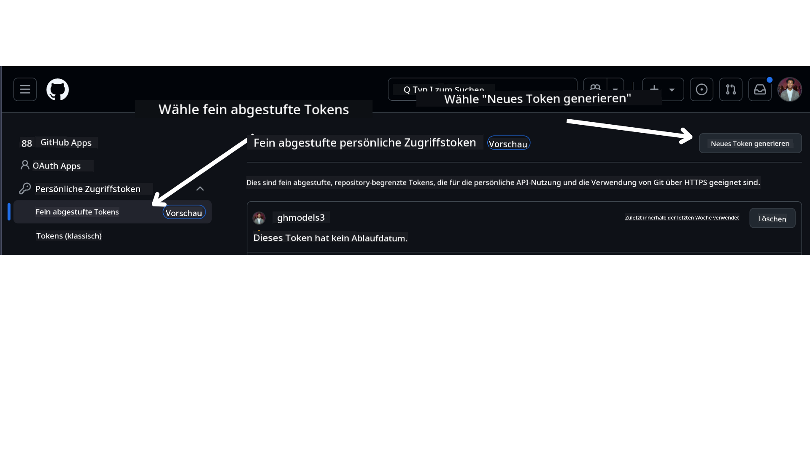

<!--
CO_OP_TRANSLATOR_METADATA:
{
  "original_hash": "76945069b52a49cd0432ae3e0b0ba22e",
  "translation_date": "2025-07-12T07:42:40+00:00",
  "source_file": "00-course-setup/README.md",
  "language_code": "de"
}
-->
in deinem GitHub-Konto.

Wähle auf der linken Seite deines Bildschirms die Option `Fine-grained tokens` aus.

Dann wähle `Generate new token`.



Du wirst aufgefordert, einen Namen für dein Token einzugeben, das Ablaufdatum auszuwählen (Empfohlen: 30 Tage) und die Berechtigungen für dein Token festzulegen (öffentliche Repositories).

Es ist außerdem notwendig, die Berechtigungen dieses Tokens zu bearbeiten: Permissions -> Models -> Ermöglicht den Zugriff auf GitHub Models

Kopiere dein neu erstelltes Token. Dieses fügst du nun in deine `.env`-Datei ein, die in diesem Kurs enthalten ist.

### Schritt 2: Erstelle deine `.env`-Datei

Um deine `.env`-Datei zu erstellen, führe den folgenden Befehl in deinem Terminal aus.

```bash
cp .env.example .env
```

Dies kopiert die Beispieldatei und erstellt eine `.env` in deinem Verzeichnis, in der du die Werte für die Umgebungsvariablen einträgst.

Nachdem du dein Token kopiert hast, öffne die `.env`-Datei in deinem bevorzugten Texteditor und füge dein Token in das Feld `GITHUB_TOKEN` ein.

Du solltest jetzt in der Lage sein, die Codebeispiele dieses Kurses auszuführen.

## Einrichtung für Beispiele mit Azure AI Foundry und Azure AI Agent Service

### Schritt 1: Hole deinen Azure-Projekt-Endpunkt

Folge den Schritten zur Erstellung eines Hubs und Projekts in Azure AI Foundry, die hier beschrieben sind: [Hub resources overview](https://learn.microsoft.com/en-us/azure/ai-foundry/concepts/ai-resources)

Sobald du dein Projekt erstellt hast, musst du die Verbindungszeichenfolge für dein Projekt abrufen.

Dies kannst du tun, indem du auf der **Übersichtsseite** deines Projekts im Azure AI Foundry-Portal nachsiehst.


### Schritt 2: Erstelle deine `.env`-Datei

Um deine `.env`-Datei zu erstellen, führe den folgenden Befehl in deinem Terminal aus.

```bash
cp .env.example .env
```

Dies kopiert die Beispieldatei und erstellt eine `.env` in deinem Verzeichnis, in der du die Werte für die Umgebungsvariablen einträgst.

Nachdem du deinen Token kopiert hast, öffne die `.env`-Datei in deinem bevorzugten Texteditor und füge deinen Token in das Feld `PROJECT_ENDPOINT` ein.

### Schritt 3: Melde dich bei Azure an

Als Sicherheitsbest Practice verwenden wir [keyless authentication](https://learn.microsoft.com/azure/developer/ai/keyless-connections?tabs=csharp%2Cazure-cli?WT.mc_id=academic-105485-koreyst), um uns mit Microsoft Entra ID bei Azure OpenAI zu authentifizieren. Bevor du dies tun kannst, musst du zunächst die **Azure CLI** gemäß den [Installationsanweisungen](https://learn.microsoft.com/cli/azure/install-azure-cli?WT.mc_id=academic-105485-koreyst) für dein Betriebssystem installieren.

Öffne anschließend ein Terminal und führe `az login --use-device-code` aus, um dich bei deinem Azure-Konto anzumelden.

Nachdem du dich angemeldet hast, wähle dein Abonnement im Terminal aus.

## Zusätzliche Umgebungsvariablen – Azure Search und Azure OpenAI

Für die Agentic RAG Lektion – Lektion 5 – gibt es Beispiele, die Azure Search und Azure OpenAI verwenden.

Wenn du diese Beispiele ausführen möchtest, musst du die folgenden Umgebungsvariablen zu deiner `.env`-Datei hinzufügen:

### Übersichtsseite (Projekt)

- `AZURE_SUBSCRIPTION_ID` – Sieh unter **Projektdetails** auf der **Übersichtsseite** deines Projekts nach.

- `AZURE_AI_PROJECT_NAME` – Oben auf der **Übersichtsseite** deines Projekts zu finden.

- `AZURE_OPENAI_SERVICE` – Im Tab **Enthaltene Funktionen** für **Azure OpenAI Service** auf der **Übersichtsseite**.

### Management Center

- `AZURE_OPENAI_RESOURCE_GROUP` – Unter **Projekteigenschaften** auf der **Übersichtsseite** des **Management Centers**.

- `GLOBAL_LLM_SERVICE` – Unter **Verbundene Ressourcen** findest du den Verbindungsnamen für **Azure AI Services**. Falls nicht aufgeführt, prüfe im **Azure-Portal** unter deiner Ressourcengruppe den Namen der AI Services-Ressource.

### Modelle + Endpunkte Seite

- `AZURE_OPENAI_EMBEDDING_DEPLOYMENT_NAME` – Wähle dein Embedding-Modell (z. B. `text-embedding-ada-002`) aus und notiere den **Bereitstellungsnamen** aus den Modelldetails.

- `AZURE_OPENAI_CHAT_DEPLOYMENT_NAME` – Wähle dein Chat-Modell (z. B. `gpt-4o-mini`) aus und notiere den **Bereitstellungsnamen** aus den Modelldetails.

### Azure-Portal

- `AZURE_OPENAI_ENDPOINT` – Suche nach **Azure AI Services**, klicke darauf, gehe zu **Ressourcenverwaltung**, **Schlüssel und Endpunkt**, scrolle zu den "Azure OpenAI Endpunkten" und kopiere den, der mit "Language APIs" bezeichnet ist.

- `AZURE_OPENAI_API_KEY` – Kopiere auf derselben Seite SCHLÜSSEL 1 oder SCHLÜSSEL 2.

- `AZURE_SEARCH_SERVICE_ENDPOINT` – Finde deine **Azure AI Search**-Ressource, klicke darauf und sieh dir die **Übersicht** an.

- `AZURE_SEARCH_API_KEY` – Gehe dann zu **Einstellungen** und anschließend zu **Schlüssel**, um den primären oder sekundären Administratorschlüssel zu kopieren.

### Externe Webseite

- `AZURE_OPENAI_API_VERSION` – Besuche die Seite [API version lifecycle](https://learn.microsoft.com/en-us/azure/ai-services/openai/api-version-deprecation#latest-ga-api-release) unter **Latest GA API release**.

### Einrichtung der keyless authentication

Anstatt deine Zugangsdaten fest zu codieren, verwenden wir eine keyless Verbindung mit Azure OpenAI. Dazu importieren wir `DefaultAzureCredential` und rufen später die Funktion `DefaultAzureCredential` auf, um die Anmeldeinformationen zu erhalten.

```python
from azure.identity import DefaultAzureCredential, InteractiveBrowserCredential
```

## Bist du irgendwo stecken geblieben?

Wenn du Probleme bei der Einrichtung hast, komm gerne in unser

oder

.

## Nächste Lektion

Du bist jetzt bereit, den Code für diesen Kurs auszuführen. Viel Spaß beim weiteren Lernen über die Welt der AI Agents!

[Einführung in AI Agents und Anwendungsfälle](../01-intro-to-ai-agents/README.md)

**Haftungsausschluss**:  
Dieses Dokument wurde mit dem KI-Übersetzungsdienst [Co-op Translator](https://github.com/Azure/co-op-translator) übersetzt. Obwohl wir uns um Genauigkeit bemühen, beachten Sie bitte, dass automatisierte Übersetzungen Fehler oder Ungenauigkeiten enthalten können. Das Originaldokument in seiner Ursprungssprache ist als maßgebliche Quelle zu betrachten. Für wichtige Informationen wird eine professionelle menschliche Übersetzung empfohlen. Wir übernehmen keine Haftung für Missverständnisse oder Fehlinterpretationen, die aus der Nutzung dieser Übersetzung entstehen.