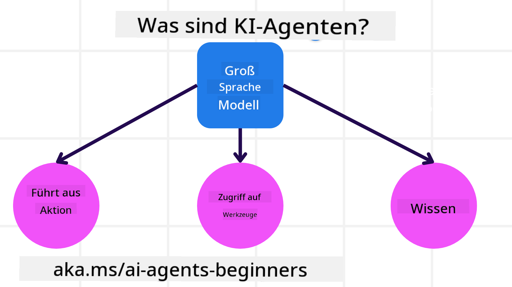
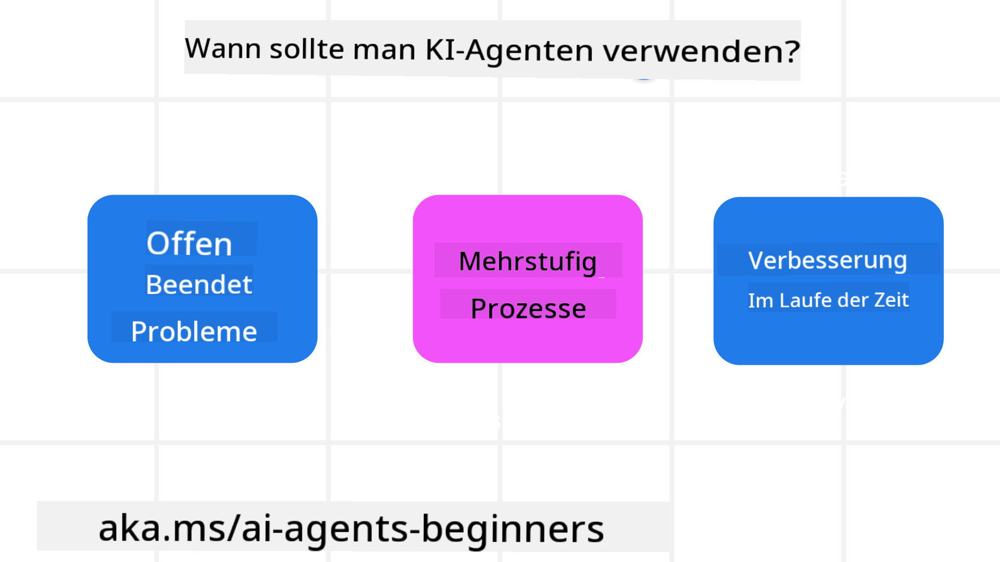

<!--
CO_OP_TRANSLATOR_METADATA:
{
  "original_hash": "d84943abc8f001ad4670418d32c2d899",
  "translation_date": "2025-07-12T08:00:43+00:00",
  "source_file": "01-intro-to-ai-agents/README.md",
  "language_code": "de"
}
-->
um andere Lernende und AI-Agenten-Entwickler zu treffen und alle Fragen zu diesem Kurs zu stellen.

Um diesen Kurs zu beginnen, starten wir mit einem besseren Verständnis davon, was AI-Agenten sind und wie wir sie in den Anwendungen und Arbeitsabläufen, die wir erstellen, einsetzen können.

## Einführung

Diese Lektion behandelt:

- Was sind AI-Agenten und welche verschiedenen Agententypen gibt es?
- Für welche Anwendungsfälle eignen sich AI-Agenten am besten und wie können sie uns helfen?
- Was sind einige der grundlegenden Bausteine bei der Gestaltung agentischer Lösungen?

## Lernziele
Nach Abschluss dieser Lektion solltest du in der Lage sein:

- Die Konzepte von AI-Agenten zu verstehen und wie sie sich von anderen AI-Lösungen unterscheiden.
- AI-Agenten effizient anzuwenden.
- Agentische Lösungen produktiv für Nutzer und Kunden zu entwerfen.

## Definition von AI-Agenten und Typen von AI-Agenten

### Was sind AI-Agenten?

AI-Agenten sind **Systeme**, die **Large Language Models (LLMs)** ermöglichen, **Handlungen auszuführen**, indem sie deren Fähigkeiten erweitern, indem sie LLMs **Zugang zu Werkzeugen** und **Wissen** geben.

Lass uns diese Definition in kleinere Teile zerlegen:

- **System** – Es ist wichtig, Agenten nicht nur als einzelne Komponente zu betrachten, sondern als ein System aus vielen Komponenten. Auf der grundlegenden Ebene bestehen die Komponenten eines AI-Agenten aus:
  - **Umgebung** – Der definierte Raum, in dem der AI-Agent operiert. Zum Beispiel könnte bei einem Reisebuchungs-AI-Agenten die Umgebung das Reisebuchungssystem sein, das der AI-Agent nutzt, um Aufgaben zu erledigen.
  - **Sensoren** – Umgebungen enthalten Informationen und liefern Rückmeldungen. AI-Agenten nutzen Sensoren, um diese Informationen über den aktuellen Zustand der Umgebung zu sammeln und zu interpretieren. Im Beispiel des Reisebuchungsagenten kann das Buchungssystem Informationen wie Hotelverfügbarkeiten oder Flugpreise bereitstellen.
  - **Aktuatoren** – Sobald der AI-Agent den aktuellen Zustand der Umgebung erhält, bestimmt er für die aktuelle Aufgabe, welche Handlung ausgeführt werden soll, um die Umgebung zu verändern. Für den Reisebuchungsagenten könnte das bedeuten, ein verfügbares Zimmer für den Nutzer zu buchen.

**Large Language Models** – Das Konzept der Agenten existierte bereits vor der Entstehung von LLMs. Der Vorteil, AI-Agenten mit LLMs zu bauen, liegt in deren Fähigkeit, menschliche Sprache und Daten zu interpretieren. Diese Fähigkeit ermöglicht es LLMs, Umweltinformationen zu verstehen und einen Plan zu erstellen, um die Umgebung zu verändern.

**Handlungen ausführen** – Außerhalb von AI-Agenten-Systemen sind LLMs darauf beschränkt, Inhalte oder Informationen basierend auf einer Nutzereingabe zu generieren. Innerhalb von AI-Agenten-Systemen können LLMs Aufgaben erfüllen, indem sie die Anfrage des Nutzers interpretieren und Werkzeuge nutzen, die in ihrer Umgebung verfügbar sind.

**Zugang zu Werkzeugen** – Welche Werkzeuge das LLM nutzen kann, wird definiert durch 1) die Umgebung, in der es operiert, und 2) den Entwickler des AI-Agenten. Im Beispiel des Reiseagenten sind die Werkzeuge des Agenten durch die im Buchungssystem verfügbaren Operationen begrenzt, und/oder der Entwickler kann den Zugriff des Agenten auf Werkzeuge wie Flüge einschränken.

**Speicher + Wissen** – Der Speicher kann kurzfristig im Kontext des Gesprächs zwischen Nutzer und Agent sein. Langfristig, über die Informationen der Umgebung hinaus, können AI-Agenten auch Wissen aus anderen Systemen, Diensten, Werkzeugen und sogar anderen Agenten abrufen. Im Beispiel des Reiseagenten könnte dieses Wissen Informationen über die Reisepräferenzen des Nutzers aus einer Kundendatenbank sein.

### Die verschiedenen Agententypen

Nachdem wir eine allgemeine Definition von AI-Agenten haben, schauen wir uns einige spezifische Agententypen an und wie sie auf einen Reisebuchungs-AI-Agenten angewendet werden könnten.

| **Agententyp**                | **Beschreibung**                                                                                                                       | **Beispiel**                                                                                                                                                                                                                   |
| ----------------------------- | ------------------------------------------------------------------------------------------------------------------------------------- | ----------------------------------------------------------------------------------------------------------------------------------------------------------------------------------------------------------------------------- |
| **Einfache Reflexagenten**    | Führen sofortige Aktionen basierend auf vordefinierten Regeln aus.                                                                     | Reiseagent interpretiert den Kontext einer E-Mail und leitet Reisebeschwerden an den Kundenservice weiter.                                                                                                                    |
| **Modellbasierte Reflexagenten** | Führen Aktionen basierend auf einem Weltmodell und Änderungen an diesem Modell aus.                                                    | Reiseagent priorisiert Routen mit signifikanten Preisänderungen basierend auf historische Preisdaten.                                                                                                                        |
| **Zielorientierte Agenten**   | Erstellen Pläne, um spezifische Ziele zu erreichen, indem sie das Ziel interpretieren und Aktionen zur Erreichung bestimmen.           | Reiseagent bucht eine Reise, indem er notwendige Reisevorbereitungen (Auto, öffentliche Verkehrsmittel, Flüge) vom aktuellen Standort zum Zielort bestimmt.                                                                   |
| **Nutzenorientierte Agenten** | Berücksichtigen Präferenzen und wägen Kompromisse numerisch ab, um Ziele zu erreichen.                                                 | Reiseagent maximiert den Nutzen, indem er Bequemlichkeit gegen Kosten bei der Reisebuchung abwägt.                                                                                                                            |
| **Lernende Agenten**          | Verbessern sich im Laufe der Zeit durch Feedback und passen ihre Aktionen entsprechend an.                                             | Reiseagent verbessert sich durch Kundenfeedback aus Nachreiseumfragen, um zukünftige Buchungen anzupassen.                                                                                                                    |
| **Hierarchische Agenten**     | Bestehen aus mehreren Agenten in einem gestuften System, wobei höherstufige Agenten Aufgaben in Teilaufgaben für niedrigstufige Agenten aufteilen. | Reiseagent storniert eine Reise, indem er die Aufgabe in Teilaufgaben (z. B. Stornierung einzelner Buchungen) aufteilt und niedrigstufige Agenten diese ausführen lässt, die dann an den höherstufigen Agenten berichten.          |
| **Multi-Agenten-Systeme (MAS)** | Agenten erledigen Aufgaben unabhängig, entweder kooperativ oder wettbewerbsorientiert.                                                | Kooperativ: Mehrere Agenten buchen spezifische Reisedienstleistungen wie Hotels, Flüge und Unterhaltung. Wettbewerbsorientiert: Mehrere Agenten verwalten und konkurrieren um einen gemeinsamen Hotelbuchungskalender, um Kunden zu buchen. |

## Wann man AI-Agenten einsetzt

Im vorherigen Abschnitt haben wir den Anwendungsfall des Reiseagenten genutzt, um zu erklären, wie die verschiedenen Agententypen in unterschiedlichen Szenarien der Reisebuchung eingesetzt werden können. Wir werden diese Anwendung im gesamten Kurs weiter verwenden.

Schauen wir uns die Arten von Anwendungsfällen an, für die AI-Agenten am besten geeignet sind:

- **Offene Probleme** – das LLM bestimmt die notwendigen Schritte zur Erledigung einer Aufgabe, da diese nicht immer fest in einem Workflow kodiert werden können.
- **Mehrstufige Prozesse** – Aufgaben, die eine Komplexität erfordern, bei der der AI-Agent Werkzeuge oder Informationen über mehrere Schritte hinweg nutzen muss, anstatt nur einmalig abzurufen.
- **Verbesserung über Zeit** – Aufgaben, bei denen sich der Agent durch Feedback aus seiner Umgebung oder von Nutzern verbessern kann, um einen besseren Nutzen zu bieten.

Weitere Überlegungen zum Einsatz von AI-Agenten behandeln wir in der Lektion „Vertrauenswürdige AI-Agenten bauen“.

## Grundlagen agentischer Lösungen

### Agentenentwicklung

Der erste Schritt bei der Gestaltung eines AI-Agenten-Systems ist die Definition der Werkzeuge, Aktionen und Verhaltensweisen. In diesem Kurs konzentrieren wir uns auf die Nutzung des **Azure AI Agent Service**, um unsere Agenten zu definieren. Dieser bietet Funktionen wie:

- Auswahl offener Modelle wie OpenAI, Mistral und Llama
- Nutzung lizenzierter Daten über Anbieter wie Tripadvisor
- Verwendung standardisierter OpenAPI 3.0-Werkzeuge

### Agentische Muster

Die Kommunikation mit LLMs erfolgt über Prompts. Aufgrund der halbautonomen Natur von AI-Agenten ist es nicht immer möglich oder erforderlich, das LLM manuell nach einer Änderung in der Umgebung erneut anzusprechen. Wir verwenden **agentische Muster**, die es ermöglichen, das LLM über mehrere Schritte hinweg auf skalierbare Weise anzusprechen.

Dieser Kurs ist in einige der derzeit populären agentischen Muster unterteilt.

### Agentische Frameworks

Agentische Frameworks ermöglichen Entwicklern, agentische Muster durch Code umzusetzen. Diese Frameworks bieten Vorlagen, Plugins und Werkzeuge für eine bessere Zusammenarbeit von AI-Agenten. Diese Vorteile bieten bessere Möglichkeiten zur Beobachtbarkeit und Fehlerbehebung von AI-Agenten-Systemen.

In diesem Kurs werden wir das forschungsgetriebene AutoGen-Framework und das produktionsreife Agent-Framework von Semantic Kernel erkunden.

## Vorherige Lektion

[Kurzeinrichtung](../00-course-setup/README.md)

## Nächste Lektion

[Erkundung agentischer Frameworks](../02-explore-agentic-frameworks/README.md)

**Haftungsausschluss**:  
Dieses Dokument wurde mit dem KI-Übersetzungsdienst [Co-op Translator](https://github.com/Azure/co-op-translator) übersetzt. Obwohl wir uns um Genauigkeit bemühen, beachten Sie bitte, dass automatisierte Übersetzungen Fehler oder Ungenauigkeiten enthalten können. Das Originaldokument in seiner Ursprungssprache ist als maßgebliche Quelle zu betrachten. Für wichtige Informationen wird eine professionelle menschliche Übersetzung empfohlen. Wir übernehmen keine Haftung für Missverständnisse oder Fehlinterpretationen, die aus der Nutzung dieser Übersetzung entstehen.