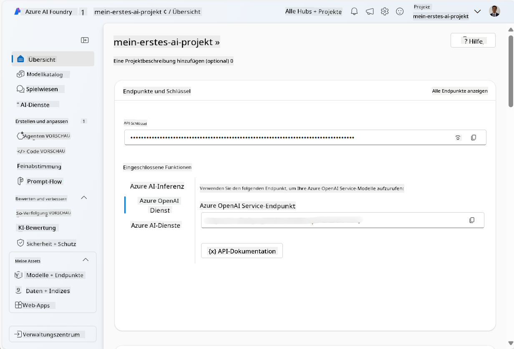
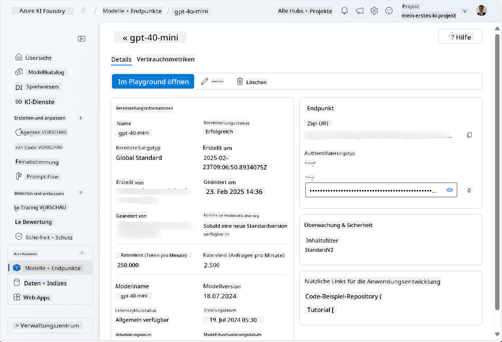
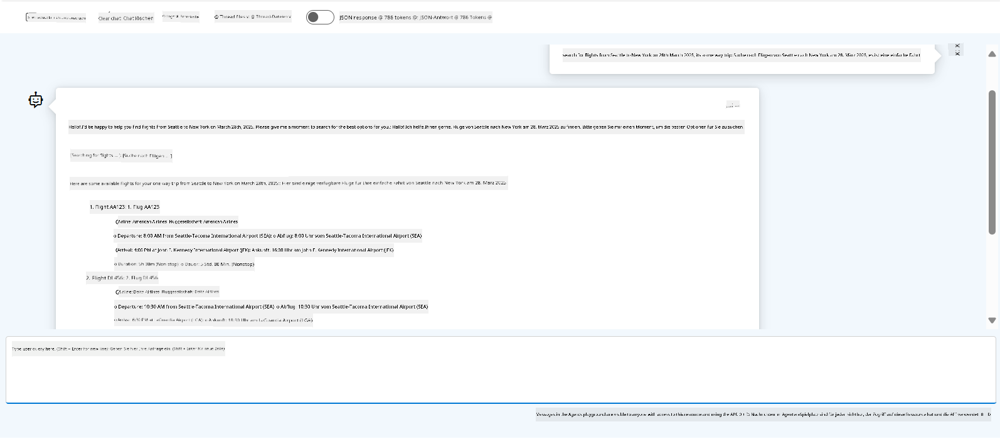

<!--
CO_OP_TRANSLATOR_METADATA:
{
  "original_hash": "7e92870dc0843e13d4dabc620c09d2d9",
  "translation_date": "2025-07-12T08:14:55+00:00",
  "source_file": "02-explore-agentic-frameworks/azure-ai-foundry-agent-creation.md",
  "language_code": "de"
}
-->
# Azure AI Agent Service Entwicklung

In dieser Übung verwenden Sie die Azure AI Agent Service-Tools im [Azure AI Foundry Portal](https://ai.azure.com/?WT.mc_id=academic-105485-koreyst), um einen Agenten für Flugbuchungen zu erstellen. Der Agent kann mit Nutzern interagieren und Informationen zu Flügen bereitstellen.

## Voraussetzungen

Um diese Übung abzuschließen, benötigen Sie Folgendes:
1. Ein Azure-Konto mit einem aktiven Abonnement. [Erstellen Sie kostenlos ein Konto](https://azure.microsoft.com/free/?WT.mc_id=academic-105485-koreyst).
2. Sie benötigen Berechtigungen, um ein Azure AI Foundry Hub zu erstellen oder es muss für Sie erstellt worden sein.
    - Wenn Ihre Rolle Contributor oder Owner ist, können Sie den Schritten in diesem Tutorial folgen.

## Erstellen eines Azure AI Foundry Hubs

> **Note:** Azure AI Foundry war früher als Azure AI Studio bekannt.

1. Folgen Sie den Anleitungen im [Azure AI Foundry](https://learn.microsoft.com/en-us/azure/ai-studio/?WT.mc_id=academic-105485-koreyst) Blogbeitrag zum Erstellen eines Azure AI Foundry Hubs.
2. Wenn Ihr Projekt erstellt wurde, schließen Sie alle angezeigten Tipps und überprüfen Sie die Projektseite im Azure AI Foundry Portal, die etwa wie im folgenden Bild aussehen sollte:

    

## Modell bereitstellen

1. Wählen Sie im linken Bereich Ihres Projekts im Abschnitt **My assets** die Seite **Models + endpoints** aus.
2. Auf der Seite **Models + endpoints** wählen Sie im Tab **Model deployments** im Menü **+ Deploy model** die Option **Deploy base model**.
3. Suchen Sie in der Liste nach dem Modell `gpt-4o-mini`, wählen Sie es aus und bestätigen Sie die Auswahl.

    > **Note**: Das Reduzieren des TPM hilft, eine Übernutzung des in Ihrem Abonnement verfügbaren Kontingents zu vermeiden.

    

## Einen Agenten erstellen

Nachdem Sie ein Modell bereitgestellt haben, können Sie einen Agenten erstellen. Ein Agent ist ein konversationelles KI-Modell, das zur Interaktion mit Nutzern verwendet werden kann.

1. Wählen Sie im linken Bereich Ihres Projekts im Abschnitt **Build & Customize** die Seite **Agents** aus.
2. Klicken Sie auf **+ Create agent**, um einen neuen Agenten zu erstellen. Im Dialogfeld **Agent Setup**:
    - Geben Sie einen Namen für den Agenten ein, z. B. `FlightAgent`.
    - Stellen Sie sicher, dass die zuvor erstellte Modellbereitstellung `gpt-4o-mini` ausgewählt ist.
    - Legen Sie die **Instructions** entsprechend der Aufforderung fest, der der Agent folgen soll. Hier ein Beispiel:
    ```
    You are FlightAgent, a virtual assistant specialized in handling flight-related queries. Your role includes assisting users with searching for flights, retrieving flight details, checking seat availability, and providing real-time flight status. Follow the instructions below to ensure clarity and effectiveness in your responses:

    ### Task Instructions:
    1. **Recognizing Intent**:
       - Identify the user's intent based on their request, focusing on one of the following categories:
         - Searching for flights
         - Retrieving flight details using a flight ID
         - Checking seat availability for a specified flight
         - Providing real-time flight status using a flight number
       - If the intent is unclear, politely ask users to clarify or provide more details.
        
    2. **Processing Requests**:
        - Depending on the identified intent, perform the required task:
        - For flight searches: Request details such as origin, destination, departure date, and optionally return date.
        - For flight details: Request a valid flight ID.
        - For seat availability: Request the flight ID and date and validate inputs.
        - For flight status: Request a valid flight number.
        - Perform validations on provided data (e.g., formats of dates, flight numbers, or IDs). If the information is incomplete or invalid, return a friendly request for clarification.

    3. **Generating Responses**:
    - Use a tone that is friendly, concise, and supportive.
    - Provide clear and actionable suggestions based on the output of each task.
    - If no data is found or an error occurs, explain it to the user gently and offer alternative actions (e.g., refine search, try another query).
    
    ```
> [!NOTE]
> Für eine detaillierte Aufforderung können Sie [dieses Repository](https://github.com/ShivamGoyal03/RoamMind) für weitere Informationen ansehen.
    
> Außerdem können Sie eine **Knowledge Base** und **Actions** hinzufügen, um die Fähigkeiten des Agenten zu erweitern, damit er mehr Informationen bereitstellen und automatisierte Aufgaben basierend auf Benutzeranfragen ausführen kann. Für diese Übung können Sie diese Schritte überspringen.
    


3. Um einen neuen Multi-AI-Agenten zu erstellen, klicken Sie einfach auf **New Agent**. Der neu erstellte Agent wird dann auf der Seite Agents angezeigt.

## Den Agenten testen

Nachdem Sie den Agenten erstellt haben, können Sie testen, wie er auf Benutzeranfragen im Azure AI Foundry Portal Playground reagiert.

1. Wählen Sie oben im **Setup**-Bereich Ihres Agenten **Try in playground** aus.
2. Im **Playground**-Bereich können Sie mit dem Agenten interagieren, indem Sie Anfragen im Chatfenster eingeben. Zum Beispiel können Sie den Agenten bitten, Flüge von Seattle nach New York am 28. zu suchen.

    > **Note**: Der Agent liefert möglicherweise keine genauen Antworten, da in dieser Übung keine Echtzeitdaten verwendet werden. Ziel ist es, die Fähigkeit des Agenten zu testen, Benutzeranfragen basierend auf den gegebenen Anweisungen zu verstehen und zu beantworten.

    

3. Nach dem Testen können Sie den Agenten weiter anpassen, indem Sie weitere Intents, Trainingsdaten und Aktionen hinzufügen, um seine Fähigkeiten zu verbessern.

## Ressourcen bereinigen

Wenn Sie mit dem Testen des Agenten fertig sind, können Sie ihn löschen, um zusätzliche Kosten zu vermeiden.
1. Öffnen Sie das [Azure-Portal](https://portal.azure.com) und sehen Sie sich den Inhalt der Ressourcengruppe an, in der Sie die Hub-Ressourcen für diese Übung bereitgestellt haben.
2. Wählen Sie in der Symbolleiste **Delete resource group** aus.
3. Geben Sie den Namen der Ressourcengruppe ein und bestätigen Sie, dass Sie sie löschen möchten.

## Ressourcen

- [Azure AI Foundry Dokumentation](https://learn.microsoft.com/en-us/azure/ai-studio/?WT.mc_id=academic-105485-koreyst)
- [Azure AI Foundry Portal](https://ai.azure.com/?WT.mc_id=academic-105485-koreyst)
- [Erste Schritte mit Azure AI Studio](https://techcommunity.microsoft.com/blog/educatordeveloperblog/getting-started-with-azure-ai-studio/4095602?WT.mc_id=academic-105485-koreyst)
- [Grundlagen von KI-Agenten auf Azure](https://learn.microsoft.com/en-us/training/modules/ai-agent-fundamentals/?WT.mc_id=academic-105485-koreyst)
- [Azure AI Discord](https://aka.ms/AzureAI/Discord)

**Haftungsausschluss**:  
Dieses Dokument wurde mit dem KI-Übersetzungsdienst [Co-op Translator](https://github.com/Azure/co-op-translator) übersetzt. Obwohl wir uns um Genauigkeit bemühen, beachten Sie bitte, dass automatisierte Übersetzungen Fehler oder Ungenauigkeiten enthalten können. Das Originaldokument in seiner Ursprungssprache ist als maßgebliche Quelle zu betrachten. Für wichtige Informationen wird eine professionelle menschliche Übersetzung empfohlen. Wir übernehmen keine Haftung für Missverständnisse oder Fehlinterpretationen, die aus der Nutzung dieser Übersetzung entstehen.