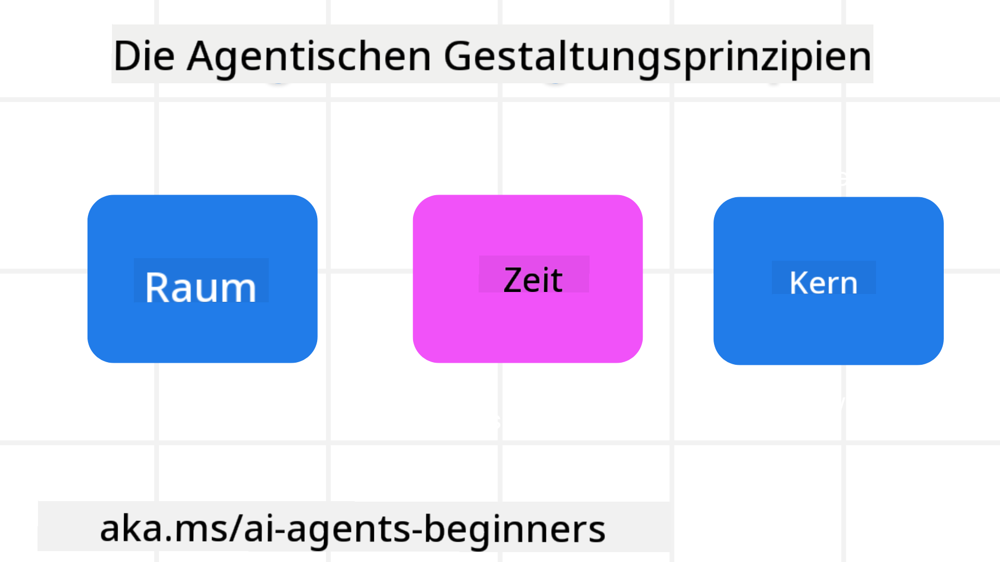

<!--
CO_OP_TRANSLATOR_METADATA:
{
  "original_hash": "4c46e4ff9e349c521e2b0b17f51afa64",
  "translation_date": "2025-08-30T13:29:44+00:00",
  "source_file": "03-agentic-design-patterns/README.md",
  "language_code": "de"
}
-->

> _(Klicken Sie auf das Bild oben, um das Video zu dieser Lektion anzusehen)_
# Prinzipien des agentischen Designs für KI

## Einführung

Es gibt viele Ansätze, um KI-Agentensysteme zu entwickeln. Da Mehrdeutigkeit in der Gestaltung generativer KI eher ein Merkmal als ein Fehler ist, fällt es Ingenieuren manchmal schwer, herauszufinden, wo sie überhaupt anfangen sollen. Wir haben eine Reihe von menschenzentrierten UX-Designprinzipien erstellt, um Entwicklern zu ermöglichen, kundenorientierte agentische Systeme zu entwickeln, die ihre geschäftlichen Anforderungen erfüllen. Diese Designprinzipien sind keine verbindliche Architektur, sondern vielmehr ein Ausgangspunkt für Teams, die Agentenerfahrungen definieren und entwickeln.

Im Allgemeinen sollten Agenten:

- Menschliche Fähigkeiten erweitern und skalieren (Brainstorming, Problemlösung, Automatisierung usw.)
- Wissenslücken schließen (mich auf den neuesten Stand bringen in Wissensbereichen, Übersetzung usw.)
- Zusammenarbeit erleichtern und unterstützen, auf die Weise, wie wir als Individuen bevorzugt mit anderen arbeiten
- Uns zu besseren Versionen unserer selbst machen (z. B. Lebenscoach/Aufgabenmeister, uns helfen, emotionale Regulation und Achtsamkeitsfähigkeiten zu erlernen, Resilienz aufzubauen usw.)

## Diese Lektion behandelt

- Was sind die Prinzipien des agentischen Designs
- Welche Richtlinien sollten bei der Umsetzung dieser Designprinzipien beachtet werden
- Beispiele für die Anwendung der Designprinzipien

## Lernziele

Nach Abschluss dieser Lektion können Sie:

1. Erklären, was die Prinzipien des agentischen Designs sind
2. Die Richtlinien für die Anwendung der Prinzipien des agentischen Designs erläutern
3. Verstehen, wie man einen Agenten basierend auf den Prinzipien des agentischen Designs entwickelt

## Die Prinzipien des agentischen Designs

### Agent (Raum)

Dies ist die Umgebung, in der der Agent agiert. Diese Prinzipien geben vor, wie wir Agenten für die Interaktion in physischen und digitalen Welten gestalten.

- **Verbinden, nicht ersetzen** – helfen, Menschen mit anderen Menschen, Ereignissen und umsetzbarem Wissen zu verbinden, um Zusammenarbeit und Verbindung zu ermöglichen.
- Agenten helfen, Ereignisse, Wissen und Menschen zu verknüpfen.
- Agenten bringen Menschen näher zusammen. Sie sind nicht dazu gedacht, Menschen zu ersetzen oder herabzusetzen.
- **Leicht zugänglich, aber gelegentlich unsichtbar** – der Agent agiert größtenteils im Hintergrund und gibt uns nur dann Hinweise, wenn es relevant und angemessen ist.
  - Der Agent ist für autorisierte Benutzer auf jedem Gerät oder jeder Plattform leicht auffindbar und zugänglich.
  - Der Agent unterstützt multimodale Eingaben und Ausgaben (Ton, Stimme, Text usw.).
  - Der Agent kann nahtlos zwischen Vordergrund und Hintergrund wechseln; zwischen proaktiv und reaktiv, je nach Wahrnehmung der Benutzerbedürfnisse.
  - Der Agent kann unsichtbar agieren, doch sein Hintergrundprozess und die Zusammenarbeit mit anderen Agenten sind für den Benutzer transparent und kontrollierbar.

### Agent (Zeit)

Dies beschreibt, wie der Agent im Laufe der Zeit agiert. Diese Prinzipien geben vor, wie wir Agenten gestalten, die über Vergangenheit, Gegenwart und Zukunft hinweg interagieren.

- **Vergangenheit**: Reflexion über die Geschichte, die sowohl Zustand als auch Kontext umfasst.
  - Der Agent liefert relevantere Ergebnisse basierend auf der Analyse umfangreicher historischer Daten, die über das Ereignis, die Personen oder Zustände hinausgehen.
  - Der Agent stellt Verbindungen zu vergangenen Ereignissen her und reflektiert aktiv Erinnerungen, um mit aktuellen Situationen zu interagieren.
- **Jetzt**: Anstoßen statt nur benachrichtigen.
  - Der Agent verkörpert einen umfassenden Ansatz für die Interaktion mit Menschen. Wenn ein Ereignis eintritt, geht der Agent über statische Benachrichtigungen oder andere formale Statik hinaus. Der Agent kann Abläufe vereinfachen oder dynamisch Hinweise generieren, um die Aufmerksamkeit des Benutzers im richtigen Moment zu lenken.
  - Der Agent liefert Informationen basierend auf dem Kontext der Umgebung, sozialen und kulturellen Veränderungen und abgestimmt auf die Absicht des Benutzers.
  - Die Interaktion mit dem Agenten kann schrittweise erfolgen, sich entwickeln und an Komplexität zunehmen, um Benutzer langfristig zu stärken.
- **Zukunft**: Anpassung und Weiterentwicklung.
  - Der Agent passt sich an verschiedene Geräte, Plattformen und Modalitäten an.
  - Der Agent passt sich dem Benutzerverhalten, den Barrierefreiheitsanforderungen an und ist frei anpassbar.
  - Der Agent wird durch kontinuierliche Benutzerinteraktion geformt und weiterentwickelt.

### Agent (Kern)

Dies sind die Schlüsselelemente im Kern des Agentendesigns.

- **Unsicherheit akzeptieren, aber Vertrauen schaffen**.
  - Ein gewisses Maß an Unsicherheit des Agenten wird erwartet. Unsicherheit ist ein Schlüsselelement des Agentendesigns.
  - Vertrauen und Transparenz sind grundlegende Schichten des Agentendesigns.
  - Menschen haben die Kontrolle darüber, wann der Agent ein- oder ausgeschaltet ist, und der Status des Agenten ist jederzeit klar sichtbar.

## Die Richtlinien zur Umsetzung dieser Prinzipien

Wenn Sie die vorherigen Designprinzipien verwenden, beachten Sie die folgenden Richtlinien:

1. **Transparenz**: Informieren Sie den Benutzer darüber, dass KI beteiligt ist, wie sie funktioniert (einschließlich vergangener Aktionen) und wie Feedback gegeben und das System modifiziert werden kann.
2. **Kontrolle**: Ermöglichen Sie dem Benutzer, das System zu personalisieren, Präferenzen festzulegen und zu spezifizieren sowie Kontrolle über das System und seine Attribute zu haben (einschließlich der Möglichkeit, zu vergessen).
3. **Konsistenz**: Streben Sie konsistente, multimodale Erlebnisse über Geräte und Endpunkte hinweg an. Verwenden Sie vertraute UI/UX-Elemente, wo möglich (z. B. Mikrofon-Symbol für Sprachinteraktion), und reduzieren Sie die kognitive Belastung des Kunden so weit wie möglich (z. B. durch prägnante Antworten, visuelle Hilfsmittel und „Mehr erfahren“-Inhalte).

## Wie man einen Reiseagenten basierend auf diesen Prinzipien und Richtlinien entwirft

Stellen Sie sich vor, Sie entwerfen einen Reiseagenten. So könnten Sie die Designprinzipien und Richtlinien anwenden:

1. **Transparenz** – Informieren Sie den Benutzer darüber, dass der Reiseagent ein KI-gestützter Agent ist. Geben Sie einige grundlegende Anweisungen, wie man anfängt (z. B. eine „Hallo“-Nachricht, Beispielaufforderungen). Dokumentieren Sie dies klar auf der Produktseite. Zeigen Sie die Liste der Aufforderungen, die ein Benutzer in der Vergangenheit gestellt hat. Machen Sie deutlich, wie Feedback gegeben werden kann (Daumen hoch und runter, Feedback senden-Button usw.). Artikulieren Sie klar, ob der Agent Einschränkungen bei der Nutzung oder den Themen hat.
2. **Kontrolle** – Stellen Sie sicher, dass klar ist, wie der Benutzer den Agenten nach seiner Erstellung ändern kann, z. B. mit dem System-Prompt. Ermöglichen Sie dem Benutzer, zu wählen, wie ausführlich der Agent ist, seinen Schreibstil und etwaige Einschränkungen, worüber der Agent nicht sprechen sollte. Ermöglichen Sie dem Benutzer, alle zugehörigen Dateien oder Daten, Aufforderungen und vergangene Gespräche einzusehen und zu löschen.
3. **Konsistenz** – Stellen Sie sicher, dass die Symbole für „Aufforderung teilen“, „Datei oder Foto hinzufügen“ und „jemanden oder etwas markieren“ standardisiert und erkennbar sind. Verwenden Sie das Büroklammer-Symbol, um das Hochladen/Teilen von Dateien mit dem Agenten anzuzeigen, und ein Bildsymbol, um den Upload von Grafiken anzuzeigen.

### Haben Sie weitere Fragen zu agentischen Designmustern für KI?

Treten Sie dem [Azure AI Foundry Discord](https://aka.ms/ai-agents/discord) bei, um sich mit anderen Lernenden auszutauschen, Sprechstunden zu besuchen und Ihre Fragen zu KI-Agenten beantwortet zu bekommen.

## Zusätzliche Ressourcen

## Vorherige Lektion

[Agentische Frameworks erkunden](../02-explore-agentic-frameworks/README.md)

## Nächste Lektion

[Designmuster für Werkzeugnutzung](../04-tool-use/README.md)

---

**Haftungsausschluss**:  
Dieses Dokument wurde mithilfe des KI-Übersetzungsdienstes [Co-op Translator](https://github.com/Azure/co-op-translator) übersetzt. Obwohl wir uns um Genauigkeit bemühen, weisen wir darauf hin, dass automatisierte Übersetzungen Fehler oder Ungenauigkeiten enthalten können. Das Originaldokument in seiner ursprünglichen Sprache sollte als maßgebliche Quelle betrachtet werden. Für kritische Informationen wird eine professionelle menschliche Übersetzung empfohlen. Wir übernehmen keine Haftung für Missverständnisse oder Fehlinterpretationen, die aus der Nutzung dieser Übersetzung entstehen.