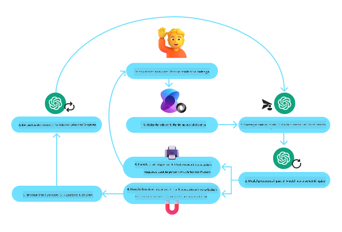
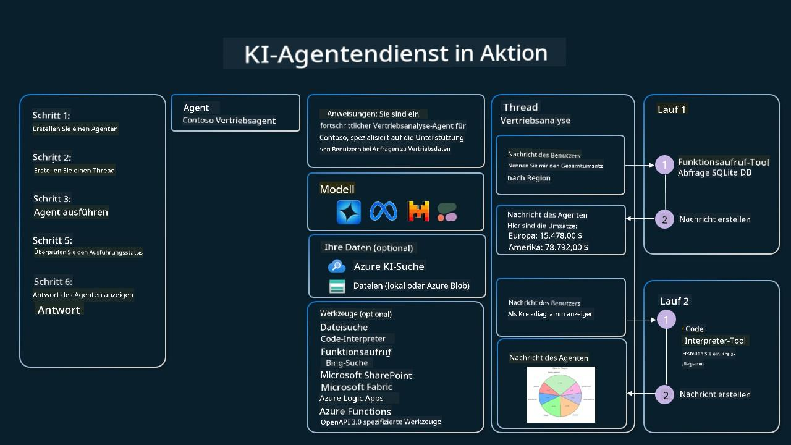

<!--
CO_OP_TRANSLATOR_METADATA:
{
  "original_hash": "88258b03f2893aa2e69eb8fb24baabbc",
  "translation_date": "2025-07-12T09:23:06+00:00",
  "source_file": "04-tool-use/README.md",
  "language_code": "de"
}
-->
[](https://youtu.be/vieRiPRx-gI?si=cEZ8ApnT6Sus9rhn)

> _(Klicken Sie auf das Bild oben, um das Video zu dieser Lektion anzusehen)_

# Tool Use Design Pattern

Tools sind interessant, weil sie KI-Agenten eine größere Bandbreite an Fähigkeiten ermöglichen. Anstatt dass der Agent nur eine begrenzte Anzahl von Aktionen ausführen kann, kann er durch das Hinzufügen eines Tools nun eine Vielzahl von Aktionen durchführen. In diesem Kapitel betrachten wir das Tool Use Design Pattern, das beschreibt, wie KI-Agenten bestimmte Tools nutzen können, um ihre Ziele zu erreichen.

## Einführung

In dieser Lektion wollen wir folgende Fragen beantworten:

- Was ist das Tool Use Design Pattern?
- Für welche Anwendungsfälle kann es eingesetzt werden?
- Welche Elemente/Bausteine sind notwendig, um das Design Pattern umzusetzen?
- Welche besonderen Überlegungen gibt es bei der Verwendung des Tool Use Design Pattern, um vertrauenswürdige KI-Agenten zu bauen?

## Lernziele

Nach Abschluss dieser Lektion werden Sie in der Lage sein:

- Das Tool Use Design Pattern und seinen Zweck zu definieren.
- Anwendungsfälle zu erkennen, in denen das Tool Use Design Pattern anwendbar ist.
- Die wichtigsten Elemente zu verstehen, die zur Implementierung des Design Patterns benötigt werden.
- Überlegungen zu erkennen, die für die Vertrauenswürdigkeit von KI-Agenten bei der Nutzung dieses Design Patterns wichtig sind.

## Was ist das Tool Use Design Pattern?

Das **Tool Use Design Pattern** konzentriert sich darauf, LLMs die Fähigkeit zu geben, mit externen Tools zu interagieren, um bestimmte Ziele zu erreichen. Tools sind Code, der von einem Agenten ausgeführt werden kann, um Aktionen durchzuführen. Ein Tool kann eine einfache Funktion wie ein Taschenrechner sein oder ein API-Aufruf zu einem Drittanbieterdienst, z. B. zur Abfrage von Aktienkursen oder Wettervorhersagen. Im Kontext von KI-Agenten sind Tools so konzipiert, dass sie als Reaktion auf **modellgenerierte Funktionsaufrufe** von Agenten ausgeführt werden.

## Für welche Anwendungsfälle kann es eingesetzt werden?

KI-Agenten können Tools nutzen, um komplexe Aufgaben zu erledigen, Informationen abzurufen oder Entscheidungen zu treffen. Das Tool Use Design Pattern wird häufig in Szenarien eingesetzt, die eine dynamische Interaktion mit externen Systemen erfordern, wie Datenbanken, Webservices oder Code-Interpreter. Diese Fähigkeit ist für verschiedene Anwendungsfälle nützlich, darunter:

- **Dynamische Informationsabfrage:** Agenten können externe APIs oder Datenbanken abfragen, um aktuelle Daten zu erhalten (z. B. Abfrage einer SQLite-Datenbank für Datenanalysen, Abruf von Aktienkursen oder Wetterinformationen).
- **Code-Ausführung und Interpretation:** Agenten können Code oder Skripte ausführen, um mathematische Probleme zu lösen, Berichte zu erstellen oder Simulationen durchzuführen.
- **Workflow-Automatisierung:** Automatisierung von sich wiederholenden oder mehrstufigen Arbeitsabläufen durch Integration von Tools wie Aufgabenplanern, E-Mail-Diensten oder Datenpipelines.
- **Kundensupport:** Agenten können mit CRM-Systemen, Ticketplattformen oder Wissensdatenbanken interagieren, um Benutzeranfragen zu lösen.
- **Inhaltserstellung und -bearbeitung:** Agenten können Tools wie Grammatikprüfer, Textzusammenfasser oder Inhaltsbewertungswerkzeuge nutzen, um bei der Erstellung von Inhalten zu unterstützen.

## Welche Elemente/Bausteine sind notwendig, um das Tool Use Design Pattern umzusetzen?

Diese Bausteine ermöglichen es dem KI-Agenten, eine Vielzahl von Aufgaben auszuführen. Schauen wir uns die wichtigsten Elemente an, die zur Implementierung des Tool Use Design Patterns benötigt werden:

- **Funktion-/Tool-Schemata**: Detaillierte Definitionen der verfügbaren Tools, einschließlich Funktionsname, Zweck, erforderliche Parameter und erwartete Ausgaben. Diese Schemata ermöglichen es dem LLM zu verstehen, welche Tools verfügbar sind und wie gültige Anfragen aufgebaut werden.

- **Logik zur Funktionsausführung**: Regelt, wie und wann Tools basierend auf der Absicht des Nutzers und dem Gesprächskontext aufgerufen werden. Dies kann Planungsmodule, Routing-Mechanismen oder bedingte Abläufe umfassen, die die Tool-Nutzung dynamisch steuern.

- **Nachrichtenverwaltungssystem**: Komponenten, die den Gesprächsfluss zwischen Benutzereingaben, LLM-Antworten, Tool-Aufrufen und Tool-Ausgaben steuern.

- **Tool-Integrationsframework**: Infrastruktur, die den Agenten mit verschiedenen Tools verbindet, egal ob einfache Funktionen oder komplexe externe Dienste.

- **Fehlerbehandlung & Validierung**: Mechanismen zur Handhabung von Fehlern bei der Tool-Ausführung, zur Validierung von Parametern und zum Umgang mit unerwarteten Antworten.

- **Zustandsverwaltung**: Verfolgt den Gesprächskontext, vorherige Tool-Interaktionen und persistente Daten, um Konsistenz über mehrstufige Interaktionen hinweg sicherzustellen.

Als Nächstes betrachten wir den Funktions-/Tool-Aufruf etwas genauer.

### Funktions-/Tool-Aufruf

Der Funktionsaufruf ist der Hauptweg, wie wir Large Language Models (LLMs) ermöglichen, mit Tools zu interagieren. Oft werden „Funktion“ und „Tool“ synonym verwendet, da „Funktionen“ (wiederverwendbare Codeblöcke) die „Tools“ sind, die Agenten zur Ausführung von Aufgaben verwenden. Damit der Code einer Funktion aufgerufen werden kann, muss ein LLM die Benutzeranfrage mit der Funktionsbeschreibung abgleichen. Dazu wird ein Schema mit den Beschreibungen aller verfügbaren Funktionen an das LLM gesendet. Das LLM wählt dann die passendste Funktion für die Aufgabe aus und gibt deren Namen und Argumente zurück. Die ausgewählte Funktion wird aufgerufen, ihre Antwort wird an das LLM zurückgesendet, das diese Informationen nutzt, um auf die Benutzeranfrage zu reagieren.

Für Entwickler, die Funktionsaufrufe für Agenten implementieren möchten, benötigen Sie:

1. Ein LLM-Modell, das Funktionsaufrufe unterstützt
2. Ein Schema mit Funktionsbeschreibungen
3. Den Code für jede beschriebene Funktion

Zur Veranschaulichung nehmen wir das Beispiel, die aktuelle Uhrzeit in einer Stadt abzurufen:

1. **Initialisieren eines LLM, das Funktionsaufrufe unterstützt:**

    Nicht alle Modelle unterstützen Funktionsaufrufe, daher ist es wichtig zu prüfen, ob das verwendete LLM dies tut. <a href="https://learn.microsoft.com/azure/ai-services/openai/how-to/function-calling" target="_blank">Azure OpenAI</a> unterstützt Funktionsaufrufe. Wir können mit der Initialisierung des Azure OpenAI-Clients beginnen.

    ```python
    # Initialize the Azure OpenAI client
    client = AzureOpenAI(
        azure_endpoint = os.getenv("AZURE_OPENAI_ENDPOINT"), 
        api_key=os.getenv("AZURE_OPENAI_API_KEY"),  
        api_version="2024-05-01-preview"
    )
    ```

1. **Erstellen eines Funktionsschemas:**

    Als Nächstes definieren wir ein JSON-Schema, das den Funktionsnamen, eine Beschreibung der Funktion und die Namen sowie Beschreibungen der Funktionsparameter enthält. Dieses Schema übergeben wir dann zusammen mit der Benutzeranfrage an den zuvor erstellten Client, um die Uhrzeit in San Francisco zu ermitteln. Wichtig ist, dass ein **Tool-Aufruf** zurückgegeben wird, **nicht** die endgültige Antwort auf die Frage. Wie bereits erwähnt, gibt das LLM den Namen der für die Aufgabe ausgewählten Funktion und die Argumente zurück, die an sie übergeben werden.

    ```python
    # Function description for the model to read
    tools = [
        {
            "type": "function",
            "function": {
                "name": "get_current_time",
                "description": "Get the current time in a given location",
                "parameters": {
                    "type": "object",
                    "properties": {
                        "location": {
                            "type": "string",
                            "description": "The city name, e.g. San Francisco",
                        },
                    },
                    "required": ["location"],
                },
            }
        }
    ]
    ```
   
    ```python
  
    # Initial user message
    messages = [{"role": "user", "content": "What's the current time in San Francisco"}] 
  
    # First API call: Ask the model to use the function
      response = client.chat.completions.create(
          model=deployment_name,
          messages=messages,
          tools=tools,
          tool_choice="auto",
      )
  
      # Process the model's response
      response_message = response.choices[0].message
      messages.append(response_message)
  
      print("Model's response:")  

      print(response_message)
  
    ```

    ```bash
    Model's response:
    ChatCompletionMessage(content=None, role='assistant', function_call=None, tool_calls=[ChatCompletionMessageToolCall(id='call_pOsKdUlqvdyttYB67MOj434b', function=Function(arguments='{"location":"San Francisco"}', name='get_current_time'), type='function')])
    ```
  
1. **Der Funktionscode zur Ausführung der Aufgabe:**

    Nachdem das LLM entschieden hat, welche Funktion ausgeführt werden soll, muss der Code zur Durchführung der Aufgabe implementiert und ausgeführt werden. Wir können den Code zur Ermittlung der aktuellen Uhrzeit in Python schreiben. Außerdem müssen wir den Code schreiben, der den Namen und die Argumente aus der response_message extrahiert, um das endgültige Ergebnis zu erhalten.

    ```python
      def get_current_time(location):
        """Get the current time for a given location"""
        print(f"get_current_time called with location: {location}")  
        location_lower = location.lower()
        
        for key, timezone in TIMEZONE_DATA.items():
            if key in location_lower:
                print(f"Timezone found for {key}")  
                current_time = datetime.now(ZoneInfo(timezone)).strftime("%I:%M %p")
                return json.dumps({
                    "location": location,
                    "current_time": current_time
                })
      
        print(f"No timezone data found for {location_lower}")  
        return json.dumps({"location": location, "current_time": "unknown"})
    ```

    ```python
     # Handle function calls
      if response_message.tool_calls:
          for tool_call in response_message.tool_calls:
              if tool_call.function.name == "get_current_time":
     
                  function_args = json.loads(tool_call.function.arguments)
     
                  time_response = get_current_time(
                      location=function_args.get("location")
                  )
     
                  messages.append({
                      "tool_call_id": tool_call.id,
                      "role": "tool",
                      "name": "get_current_time",
                      "content": time_response,
                  })
      else:
          print("No tool calls were made by the model.")  
  
      # Second API call: Get the final response from the model
      final_response = client.chat.completions.create(
          model=deployment_name,
          messages=messages,
      )
  
      return final_response.choices[0].message.content
     ```

    ```bash
      get_current_time called with location: San Francisco
      Timezone found for san francisco
      The current time in San Francisco is 09:24 AM.
     ```

Funktionsaufrufe sind das Herzstück der meisten, wenn nicht aller Agent-Tool-Designs, aber die Implementierung von Grund auf kann manchmal herausfordernd sein. Wie wir in [Lektion 2](../../../02-explore-agentic-frameworks) gelernt haben, bieten agentische Frameworks vorgefertigte Bausteine zur Umsetzung von Tool Use.

## Tool Use Beispiele mit agentischen Frameworks

Hier einige Beispiele, wie Sie das Tool Use Design Pattern mit verschiedenen agentischen Frameworks umsetzen können:

### Semantic Kernel

<a href="https://learn.microsoft.com/azure/ai-services/agents/overview" target="_blank">Semantic Kernel</a> ist ein Open-Source-KI-Framework für .NET-, Python- und Java-Entwickler, die mit Large Language Models (LLMs) arbeiten. Es vereinfacht die Nutzung von Funktionsaufrufen, indem es Ihre Funktionen und deren Parameter automatisch über einen Prozess namens <a href="https://learn.microsoft.com/semantic-kernel/concepts/ai-services/chat-completion/function-calling/?pivots=programming-language-python#1-serializing-the-functions" target="_blank">Serialisierung</a> für das Modell beschreibt. Außerdem übernimmt es die Kommunikation zwischen Modell und Ihrem Code. Ein weiterer Vorteil eines agentischen Frameworks wie Semantic Kernel ist, dass Sie auf vorgefertigte Tools wie <a href="https://github.com/microsoft/semantic-kernel/blob/main/python/samples/getting_started_with_agents/openai_assistant/step4_assistant_tool_file_search.py" target="_blank">Dateisuche</a> und <a href="https://github.com/microsoft/semantic-kernel/blob/main/python/samples/getting_started_with_agents/openai_assistant/step3_assistant_tool_code_interpreter.py" target="_blank">Code-Interpreter</a> zugreifen können.

Das folgende Diagramm veranschaulicht den Prozess des Funktionsaufrufs mit Semantic Kernel:



In Semantic Kernel werden Funktionen/Tools als <a href="https://learn.microsoft.com/semantic-kernel/concepts/plugins/?pivots=programming-language-python" target="_blank">Plugins</a> bezeichnet. Wir können die zuvor gezeigte Funktion `get_current_time` in ein Plugin umwandeln, indem wir sie in eine Klasse mit der Funktion darin verwandeln. Außerdem können wir den `kernel_function`-Decorator importieren, der die Beschreibung der Funktion übernimmt. Wenn Sie dann einen Kernel mit dem GetCurrentTimePlugin erstellen, serialisiert der Kernel automatisch die Funktion und ihre Parameter und erstellt dabei das Schema, das an das LLM gesendet wird.

```python
from semantic_kernel.functions import kernel_function

class GetCurrentTimePlugin:
    async def __init__(self, location):
        self.location = location

    @kernel_function(
        description="Get the current time for a given location"
    )
    def get_current_time(location: str = ""):
        ...

```

```python 
from semantic_kernel import Kernel

# Create the kernel
kernel = Kernel()

# Create the plugin
get_current_time_plugin = GetCurrentTimePlugin(location)

# Add the plugin to the kernel
kernel.add_plugin(get_current_time_plugin)
```
  
### Azure AI Agent Service

<a href="https://learn.microsoft.com/azure/ai-services/agents/overview" target="_blank">Azure AI Agent Service</a> ist ein neueres agentisches Framework, das Entwicklern ermöglicht, sicher hochwertige, erweiterbare KI-Agenten zu erstellen, bereitzustellen und zu skalieren, ohne sich um die zugrunde liegenden Rechen- und Speicherressourcen kümmern zu müssen. Es ist besonders nützlich für Unternehmensanwendungen, da es ein vollständig verwalteter Dienst mit Sicherheitsstandards auf Unternehmensniveau ist.

Im Vergleich zur direkten Entwicklung mit der LLM-API bietet Azure AI Agent Service einige Vorteile, darunter:

- Automatischer Tool-Aufruf – kein Parsen eines Tool-Aufrufs, kein manuelles Ausführen des Tools und keine manuelle Verarbeitung der Antwort mehr; all das geschieht jetzt serverseitig
- Sicher verwaltete Daten – anstatt den eigenen Gesprächszustand zu verwalten, können Sie sich auf Threads verlassen, die alle benötigten Informationen speichern
- Fertige Tools – Tools, mit denen Sie auf Ihre Datenquellen zugreifen können, wie Bing, Azure AI Search und Azure Functions.

Die in Azure AI Agent Service verfügbaren Tools lassen sich in zwei Kategorien einteilen:

1. Wissens-Tools:
    - <a href="https://learn.microsoft.com/azure/ai-services/agents/how-to/tools/bing-grounding?tabs=python&pivots=overview" target="_blank">Grounding mit Bing Search</a>
    - <a href="https://learn.microsoft.com/azure/ai-services/agents/how-to/tools/file-search?tabs=python&pivots=overview" target="_blank">Dateisuche</a>
    - <a href="https://learn.microsoft.com/azure/ai-services/agents/how-to/tools/azure-ai-search?tabs=azurecli%2Cpython&pivots=overview-azure-ai-search" target="_blank">Azure AI Search</a>

2. Aktions-Tools:
    - <a href="https://learn.microsoft.com/azure/ai-services/agents/how-to/tools/function-calling?tabs=python&pivots=overview" target="_blank">Funktionsaufruf</a>
    - <a href="https://learn.microsoft.com/azure/ai-services/agents/how-to/tools/code-interpreter?tabs=python&pivots=overview" target="_blank">Code-Interpreter</a>
    - <a href="https://learn.microsoft.com/azure/ai-services/agents/how-to/tools/openapi-spec?tabs=python&pivots=overview" target="_blank">OpenAI definierte Tools</a>
    - <a href="https://learn.microsoft.com/azure/ai-services/agents/how-to/tools/azure-functions?pivots=overview" target="_blank">Azure Functions</a>

Der Agent Service ermöglicht es uns, diese Tools gemeinsam als `toolset` zu verwenden. Außerdem nutzt er `threads`, die den Nachrichtenverlauf eines bestimmten Gesprächs verfolgen.

Stellen Sie sich vor, Sie sind Vertriebsmitarbeiter bei einem Unternehmen namens Contoso. Sie möchten einen konversationellen Agenten entwickeln, der Fragen zu Ihren Verkaufsdaten beantworten kann.

Das folgende Bild zeigt, wie Sie Azure AI Agent Service nutzen könnten, um Ihre Verkaufsdaten zu analysieren:



Um eines dieser Tools mit dem Service zu verwenden, können wir einen Client erstellen und ein Tool oder Toolset definieren. Zur praktischen Umsetzung können wir den folgenden Python-Code verwenden. Das LLM kann das Toolset betrachten und je nach Benutzeranfrage entscheiden, ob es die benutzerdefinierte Funktion `fetch_sales_data_using_sqlite_query` oder den vorgefertigten Code Interpreter verwendet.

```python 
import os
from azure.ai.projects import AIProjectClient
from azure.identity import DefaultAzureCredential
from fecth_sales_data_functions import fetch_sales_data_using_sqlite_query # fetch_sales_data_using_sqlite_query function which can be found in a fetch_sales_data_functions.py file.
from azure.ai.projects.models import ToolSet, FunctionTool, CodeInterpreterTool

project_client = AIProjectClient.from_connection_string(
    credential=DefaultAzureCredential(),
    conn_str=os.environ["PROJECT_CONNECTION_STRING"],
)

# Initialize function calling agent with the fetch_sales_data_using_sqlite_query function and adding it to the toolset
fetch_data_function = FunctionTool(fetch_sales_data_using_sqlite_query)
toolset = ToolSet()
toolset.add(fetch_data_function)

# Initialize Code Interpreter tool and adding it to the toolset. 
code_interpreter = code_interpreter = CodeInterpreterTool()
toolset = ToolSet()
toolset.add(code_interpreter)

agent = project_client.agents.create_agent(
    model="gpt-4o-mini", name="my-agent", instructions="You are helpful agent", 
    toolset=toolset
)
```

## Welche besonderen Überlegungen gibt es bei der Verwendung des Tool Use Design Pattern, um vertrauenswürdige KI-Agenten zu bauen?

Ein häufiges Anliegen bei dynamisch von LLMs generiertem SQL ist die Sicherheit, insbesondere das Risiko von SQL-Injection oder böswilligen Aktionen wie dem Löschen oder Manipulieren der Datenbank. Obwohl diese Bedenken berechtigt sind, können sie durch eine korrekte Konfiguration der Datenbankzugriffsrechte effektiv gemindert werden. Für die meisten Datenbanken bedeutet dies, die Datenbank als schreibgeschützt zu konfigurieren. Bei Datenbankdiensten wie PostgreSQL oder Azure SQL sollte der App eine schreibgeschützte (SELECT) Rolle zugewiesen werden.

Der Betrieb der App in einer sicheren Umgebung erhöht den Schutz zusätzlich. In Unternehmensszenarien werden Daten typischerweise aus operativen Systemen extrahiert und in eine schreibgeschützte Datenbank oder ein Data Warehouse mit benutzerfreundlichem Schema transformiert. Dieser Ansatz stellt sicher, dass die Daten sicher, leistungsoptimiert und zugänglich sind und dass die App nur eingeschränkten, schreibgeschützten Zugriff hat.

## Zusätzliche Ressourcen

-
<a href="https://microsoft.github.io/build-your-first-agent-with-azure-ai-agent-service-workshop/" target="_blank">
Azure AI Agents Service Workshop</a>
- <a href="https://github.com/Azure-Samples/contoso-creative-writer/tree/main/docs/workshop" target="_blank">Contoso Creative Writer Multi-Agent Workshop</a>
- <a href="https://learn.microsoft.com/semantic-kernel/concepts/ai-services/chat-completion/function-calling/?pivots=programming-language-python#1-serializing-the-functions" target="_blank">Semantic Kernel Function Calling Tutorial</a>
- <a href="https://github.com/microsoft/semantic-kernel/blob/main/python/samples/getting_started_with_agents/openai_assistant/step3_assistant_tool_code_interpreter.py" target="_blank">Semantic Kernel Code Interpreter</a>
- <a href="https://microsoft.github.io/autogen/dev/user-guide/core-user-guide/components/tools.html" target="_blank">Autogen Tools</a>

## Vorherige Lektion

[Verstehen von Agentic Design Patterns](../03-agentic-design-patterns/README.md)

## Nächste Lektion

[Agentic RAG](../05-agentic-rag/README.md)

**Haftungsausschluss**:  
Dieses Dokument wurde mit dem KI-Übersetzungsdienst [Co-op Translator](https://github.com/Azure/co-op-translator) übersetzt. Obwohl wir uns um Genauigkeit bemühen, beachten Sie bitte, dass automatisierte Übersetzungen Fehler oder Ungenauigkeiten enthalten können. Das Originaldokument in seiner Ursprungssprache ist als maßgebliche Quelle zu betrachten. Für wichtige Informationen wird eine professionelle menschliche Übersetzung empfohlen. Wir übernehmen keine Haftung für Missverständnisse oder Fehlinterpretationen, die aus der Nutzung dieser Übersetzung entstehen.