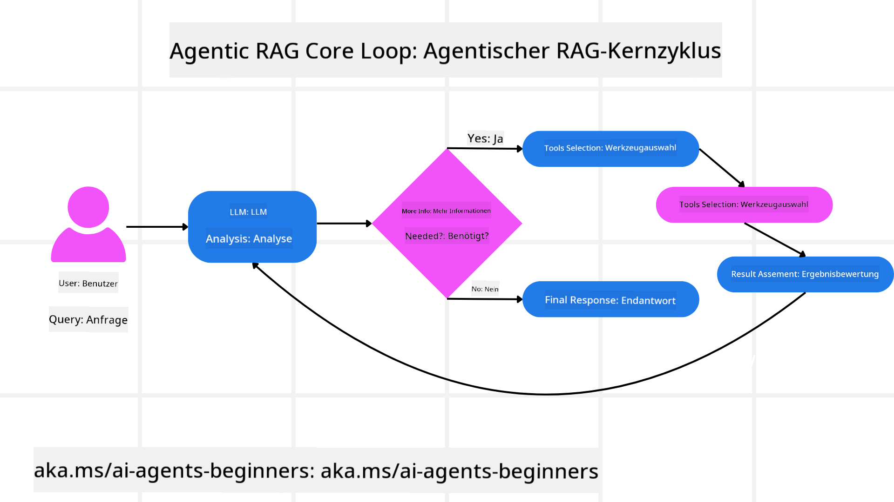
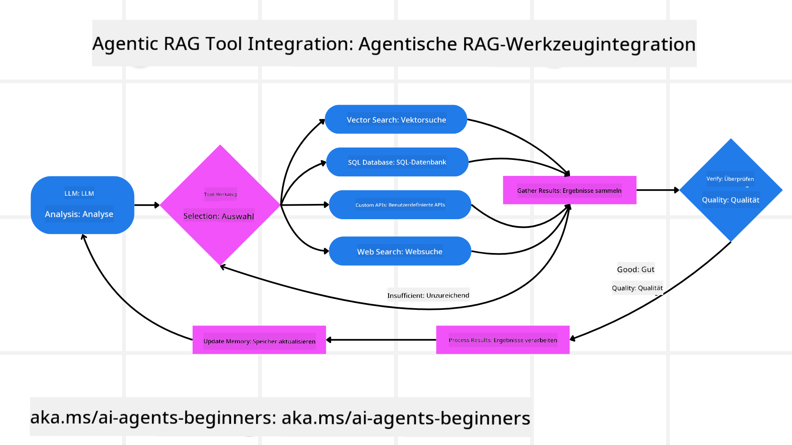
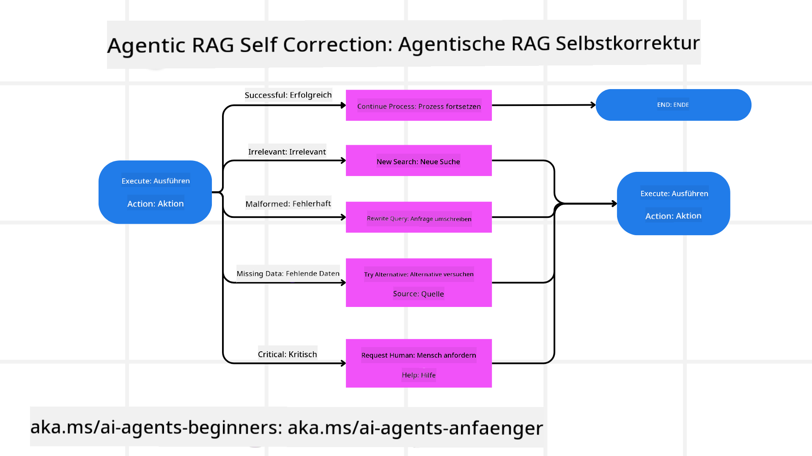
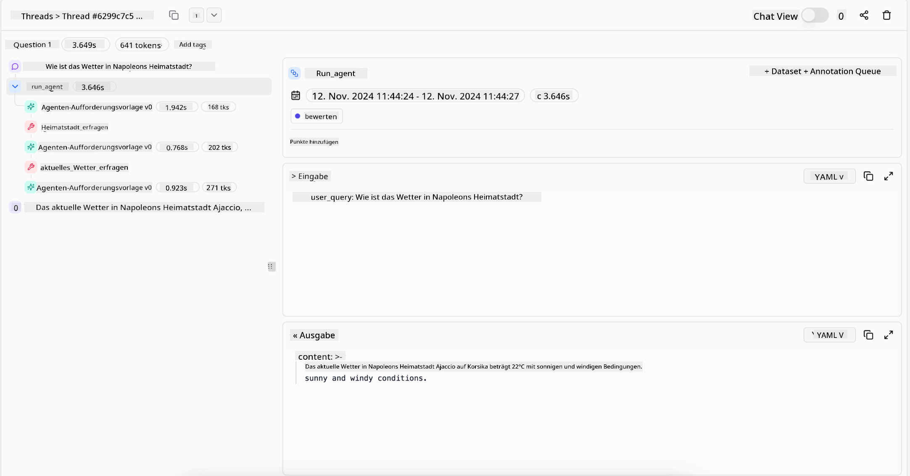

<!--
CO_OP_TRANSLATOR_METADATA:
{
  "original_hash": "7622aa72f9e676e593339f5f694ecd7d",
  "translation_date": "2025-07-12T09:50:05+00:00",
  "source_file": "05-agentic-rag/README.md",
  "language_code": "de"
}
-->

> _(Klicken Sie auf das Bild oben, um das Video zu dieser Lektion anzusehen)_

# Agentic RAG

Diese Lektion bietet einen umfassenden Überblick über Agentic Retrieval-Augmented Generation (Agentic RAG), ein aufkommendes KI-Paradigma, bei dem große Sprachmodelle (LLMs) eigenständig ihre nächsten Schritte planen und dabei Informationen aus externen Quellen abrufen. Im Gegensatz zu statischen Retrieval-then-Read-Mustern umfasst Agentic RAG iterative Aufrufe an das LLM, die mit Werkzeug- oder Funktionsaufrufen und strukturierten Ausgaben durchsetzt sind. Das System bewertet die Ergebnisse, verfeinert Anfragen, ruft bei Bedarf zusätzliche Werkzeuge auf und setzt diesen Zyklus fort, bis eine zufriedenstellende Lösung erreicht ist.

## Einführung

Diese Lektion behandelt

- **Agentic RAG verstehen:** Lernen Sie das aufkommende Paradigma in der KI kennen, bei dem große Sprachmodelle (LLMs) eigenständig ihre nächsten Schritte planen und dabei Informationen aus externen Datenquellen abrufen.
- **Iterativen Maker-Checker-Stil erfassen:** Verstehen Sie die Schleife iterativer Aufrufe an das LLM, durchsetzt mit Werkzeug- oder Funktionsaufrufen und strukturierten Ausgaben, die darauf ausgelegt ist, die Korrektheit zu verbessern und fehlerhafte Anfragen zu behandeln.
- **Praktische Anwendungen erkunden:** Identifizieren Sie Szenarien, in denen Agentic RAG besonders glänzt, wie z. B. Umgebungen mit Fokus auf Korrektheit, komplexe Datenbankinteraktionen und erweiterte Workflows.

## Lernziele

Nach Abschluss dieser Lektion werden Sie wissen/verstehen:

- **Agentic RAG verstehen:** Lernen Sie das aufkommende Paradigma in der KI kennen, bei dem große Sprachmodelle (LLMs) eigenständig ihre nächsten Schritte planen und dabei Informationen aus externen Datenquellen abrufen.
- **Iterativer Maker-Checker-Stil:** Verstehen Sie das Konzept einer Schleife iterativer Aufrufe an das LLM, durchsetzt mit Werkzeug- oder Funktionsaufrufen und strukturierten Ausgaben, die darauf ausgelegt ist, die Korrektheit zu verbessern und fehlerhafte Anfragen zu behandeln.
- **Den Denkprozess selbst steuern:** Verstehen Sie die Fähigkeit des Systems, seinen Denkprozess selbst zu steuern und Entscheidungen darüber zu treffen, wie Probleme angegangen werden, ohne auf vordefinierte Pfade angewiesen zu sein.
- **Workflow:** Verstehen Sie, wie ein agentisches Modell eigenständig entscheidet, Markttrendberichte abzurufen, Wettbewerberdaten zu identifizieren, interne Verkaufskennzahlen zu korrelieren, Erkenntnisse zu synthetisieren und die Strategie zu bewerten.
- **Iterative Schleifen, Werkzeugintegration und Gedächtnis:** Lernen Sie das auf einer Schleifeninteraktion basierende System kennen, das Zustand und Gedächtnis über die Schritte hinweg aufrechterhält, um Wiederholungen zu vermeiden und fundierte Entscheidungen zu treffen.
- **Umgang mit Fehlerfällen und Selbstkorrektur:** Erkunden Sie die robusten Selbstkorrekturmechanismen des Systems, einschließlich Iteration und erneuter Abfragen, Nutzung diagnostischer Werkzeuge und Rückgriff auf menschliche Aufsicht.
- **Grenzen der Autonomie:** Verstehen Sie die Grenzen von Agentic RAG, mit Fokus auf domänenspezifische Autonomie, Infrastrukturabhängigkeit und Einhaltung von Schutzmaßnahmen.
- **Praktische Anwendungsfälle und Nutzen:** Identifizieren Sie Szenarien, in denen Agentic RAG besonders effektiv ist, wie z. B. Umgebungen mit Fokus auf Korrektheit, komplexe Datenbankinteraktionen und erweiterte Workflows.
- **Governance, Transparenz und Vertrauen:** Lernen Sie die Bedeutung von Governance und Transparenz kennen, einschließlich erklärbarer Entscheidungsfindung, Bias-Kontrolle und menschlicher Aufsicht.

## Was ist Agentic RAG?

Agentic Retrieval-Augmented Generation (Agentic RAG) ist ein aufkommendes KI-Paradigma, bei dem große Sprachmodelle (LLMs) eigenständig ihre nächsten Schritte planen und dabei Informationen aus externen Quellen abrufen. Im Gegensatz zu statischen Retrieval-then-Read-Mustern umfasst Agentic RAG iterative Aufrufe an das LLM, die mit Werkzeug- oder Funktionsaufrufen und strukturierten Ausgaben durchsetzt sind. Das System bewertet die Ergebnisse, verfeinert Anfragen, ruft bei Bedarf zusätzliche Werkzeuge auf und setzt diesen Zyklus fort, bis eine zufriedenstellende Lösung erreicht ist. Dieser iterative „Maker-Checker“-Stil verbessert die Korrektheit, behandelt fehlerhafte Anfragen und sorgt für hochwertige Ergebnisse.

Das System steuert aktiv seinen Denkprozess, schreibt fehlgeschlagene Anfragen um, wählt unterschiedliche Abrufmethoden und integriert mehrere Werkzeuge – wie Vektorsuche in Azure AI Search, SQL-Datenbanken oder benutzerdefinierte APIs – bevor es seine Antwort finalisiert. Die herausragende Eigenschaft eines agentischen Systems ist seine Fähigkeit, den Denkprozess selbst zu steuern. Traditionelle RAG-Implementierungen verlassen sich auf vordefinierte Pfade, während ein agentisches System die Abfolge der Schritte autonom basierend auf der Qualität der gefundenen Informationen bestimmt.

## Definition von Agentic Retrieval-Augmented Generation (Agentic RAG)

Agentic Retrieval-Augmented Generation (Agentic RAG) ist ein aufkommendes Paradigma in der KI-Entwicklung, bei dem LLMs nicht nur Informationen aus externen Datenquellen abrufen, sondern auch eigenständig ihre nächsten Schritte planen. Im Gegensatz zu statischen Retrieval-then-Read-Mustern oder sorgfältig geskripteten Prompt-Sequenzen umfasst Agentic RAG eine Schleife iterativer Aufrufe an das LLM, durchsetzt mit Werkzeug- oder Funktionsaufrufen und strukturierten Ausgaben. Bei jedem Schritt bewertet das System die erhaltenen Ergebnisse, entscheidet, ob es seine Anfragen verfeinern soll, ruft bei Bedarf zusätzliche Werkzeuge auf und setzt diesen Zyklus fort, bis eine zufriedenstellende Lösung erreicht ist.

Dieser iterative „Maker-Checker“-Betriebsstil ist darauf ausgelegt, die Korrektheit zu verbessern, fehlerhafte Anfragen an strukturierte Datenbanken (z. B. NL2SQL) zu behandeln und ausgewogene, hochwertige Ergebnisse sicherzustellen. Anstatt sich ausschließlich auf sorgfältig entwickelte Prompt-Ketten zu verlassen, steuert das System aktiv seinen Denkprozess. Es kann fehlgeschlagene Anfragen umschreiben, unterschiedliche Abrufmethoden wählen und mehrere Werkzeuge integrieren – wie Vektorsuche in Azure AI Search, SQL-Datenbanken oder benutzerdefinierte APIs – bevor es seine Antwort finalisiert. Dadurch entfällt die Notwendigkeit für übermäßig komplexe Orchestrierungsframeworks. Stattdessen kann eine relativ einfache Schleife von „LLM-Aufruf → Werkzeugnutzung → LLM-Aufruf → …“ ausgefeilte und fundierte Ausgaben erzeugen.

## Den Denkprozess selbst steuern

Die herausragende Eigenschaft, die ein System „agentisch“ macht, ist seine Fähigkeit, den Denkprozess selbst zu steuern. Traditionelle RAG-Implementierungen sind oft darauf angewiesen, dass Menschen einen Pfad für das Modell vorgeben: eine Chain-of-Thought, die beschreibt, was wann abgerufen werden soll.  
Wenn ein System jedoch wirklich agentisch ist, entscheidet es intern, wie es das Problem angeht. Es führt nicht nur ein Skript aus, sondern bestimmt autonom die Abfolge der Schritte basierend auf der Qualität der gefundenen Informationen.  
Beispielsweise, wenn es gebeten wird, eine Produktlaunch-Strategie zu erstellen, verlässt es sich nicht nur auf einen Prompt, der den gesamten Recherche- und Entscheidungsworkflow vorgibt. Stattdessen entscheidet das agentische Modell eigenständig:

1. Aktuelle Markttrendberichte mithilfe von Bing Web Grounding abzurufen  
2. Relevante Wettbewerberdaten mit Azure AI Search zu identifizieren  
3. Historische interne Verkaufskennzahlen mit Azure SQL Database zu korrelieren  
4. Die Erkenntnisse zu einer kohärenten Strategie zu synthetisieren, orchestriert über Azure OpenAI Service  
5. Die Strategie auf Lücken oder Inkonsistenzen zu prüfen und bei Bedarf eine weitere Abrufrunde einzuleiten  

All diese Schritte – Anfragen verfeinern, Quellen auswählen, iterieren bis zur Zufriedenheit mit der Antwort – werden vom Modell entschieden, nicht von einem Menschen vordefiniert.

## Iterative Schleifen, Werkzeugintegration und Gedächtnis

Ein agentisches System basiert auf einem Schleifen-Interaktionsmuster:

- **Erster Aufruf:** Das Ziel des Nutzers (auch Nutzerprompt genannt) wird dem LLM präsentiert.  
- **Werkzeugaufruf:** Erkennt das Modell fehlende Informationen oder unklare Anweisungen, wählt es ein Werkzeug oder eine Abrufmethode aus – wie eine Vektordatenbankabfrage (z. B. Azure AI Search Hybrid-Suche über private Daten) oder einen strukturierten SQL-Aufruf – um mehr Kontext zu sammeln.  
- **Bewertung & Verfeinerung:** Nach Durchsicht der zurückgegebenen Daten entscheidet das Modell, ob die Informationen ausreichen. Falls nicht, verfeinert es die Anfrage, probiert ein anderes Werkzeug oder passt seinen Ansatz an.  
- **Wiederholung bis zur Zufriedenheit:** Dieser Zyklus wird fortgesetzt, bis das Modell feststellt, dass es genügend Klarheit und Belege hat, um eine finale, gut begründete Antwort zu liefern.  
- **Gedächtnis & Zustand:** Da das System Zustand und Gedächtnis über die Schritte hinweg aufrechterhält, kann es sich an frühere Versuche und deren Ergebnisse erinnern, Wiederholungen vermeiden und fundiertere Entscheidungen treffen.  

Im Laufe der Zeit entsteht so ein Gefühl von wachsendem Verständnis, das es dem Modell ermöglicht, komplexe, mehrstufige Aufgaben zu bewältigen, ohne dass ein Mensch ständig eingreifen oder den Prompt umgestalten muss.

## Umgang mit Fehlerfällen und Selbstkorrektur

Die Autonomie von Agentic RAG umfasst auch robuste Selbstkorrekturmechanismen. Wenn das System auf Sackgassen stößt – etwa irrelevante Dokumente abruft oder fehlerhafte Anfragen erhält – kann es:

- **Iterieren und erneut abfragen:** Anstatt minderwertige Antworten zu liefern, versucht das Modell neue Suchstrategien, schreibt Datenbankanfragen um oder betrachtet alternative Datensätze.  
- **Diagnosewerkzeuge nutzen:** Das System kann zusätzliche Funktionen aufrufen, die ihm helfen, seine Denkprozesse zu debuggen oder die Korrektheit der abgerufenen Daten zu bestätigen. Werkzeuge wie Azure AI Tracing sind wichtig, um eine robuste Beobachtbarkeit und Überwachung zu ermöglichen.  
- **Auf menschliche Aufsicht zurückgreifen:** Bei kritischen oder wiederholt fehlerhaften Szenarien kann das Modell Unsicherheiten melden und menschliche Unterstützung anfordern. Sobald der Mensch korrigierendes Feedback gibt, kann das Modell diese Lektion für zukünftige Durchläufe übernehmen.  

Dieser iterative und dynamische Ansatz ermöglicht es dem Modell, sich kontinuierlich zu verbessern und sicherzustellen, dass es sich nicht nur um ein einmaliges System handelt, sondern eines, das aus seinen Fehlern während einer Sitzung lernt.

## Grenzen der Autonomie

Trotz seiner Autonomie innerhalb einer Aufgabe ist Agentic RAG nicht mit Artificial General Intelligence vergleichbar. Seine „agentischen“ Fähigkeiten beschränken sich auf die Werkzeuge, Datenquellen und Richtlinien, die von menschlichen Entwicklern bereitgestellt werden. Es kann keine eigenen Werkzeuge erfinden oder die gesetzten Domänengrenzen überschreiten. Stattdessen glänzt es darin, die verfügbaren Ressourcen dynamisch zu orchestrieren.  
Wesentliche Unterschiede zu fortgeschritteneren KI-Formen sind:

1. **Domänenspezifische Autonomie:** Agentic RAG-Systeme konzentrieren sich darauf, benutzerdefinierte Ziele innerhalb einer bekannten Domäne zu erreichen, indem sie Strategien wie Anfrageumschreibung oder Werkzeugauswahl zur Verbesserung der Ergebnisse einsetzen.  
2. **Infrastrukturabhängigkeit:** Die Fähigkeiten des Systems hängen von den von Entwicklern integrierten Werkzeugen und Daten ab. Ohne menschliches Eingreifen kann es diese Grenzen nicht überschreiten.  
3. **Einhaltung von Schutzmaßnahmen:** Ethische Richtlinien, Compliance-Regeln und Unternehmensrichtlinien bleiben sehr wichtig. Die Freiheit des Agenten ist stets durch Sicherheitsmaßnahmen und Überwachungsmechanismen eingeschränkt (hoffentlich).

## Praktische Anwendungsfälle und Nutzen

Agentic RAG zeigt seine Stärken in Szenarien, die iterative Verfeinerung und Präzision erfordern:

1. **Korrektheitsorientierte Umgebungen:** Bei Compliance-Prüfungen, regulatorischen Analysen oder juristischer Recherche kann das agentische Modell Fakten wiederholt überprüfen, mehrere Quellen konsultieren und Anfragen so lange umschreiben, bis eine gründlich geprüfte Antwort vorliegt.  
2. **Komplexe Datenbankinteraktionen:** Beim Umgang mit strukturierten Daten, bei denen Anfragen oft fehlschlagen oder angepasst werden müssen, kann das System eigenständig seine Anfragen mit Azure SQL oder Microsoft Fabric OneLake verfeinern, um sicherzustellen, dass die endgültige Abfrage der Nutzerintention entspricht.  
3. **Erweiterte Workflows:** Länger laufende Sitzungen können sich weiterentwickeln, wenn neue Informationen auftauchen. Agentic RAG kann kontinuierlich neue Daten einbeziehen und seine Strategien anpassen, während es mehr über das Problem lernt.

## Governance, Transparenz und Vertrauen

Da diese Systeme immer autonomer in ihrem Denken werden, sind Governance und Transparenz entscheidend:

- **Erklärbare Entscheidungsfindung:** Das Modell kann eine Prüfspur der gestellten Anfragen, der konsultierten Quellen und der getroffenen Denkentscheidungen bereitstellen. Werkzeuge wie Azure AI Content Safety und Azure AI Tracing / GenAIOps helfen, Transparenz zu gewährleisten und Risiken zu mindern.  
- **Bias-Kontrolle und ausgewogener Abruf:** Entwickler können Abrufstrategien so anpassen, dass ausgewogene und repräsentative Datenquellen berücksichtigt werden, und Ausgaben regelmäßig prüfen, um Verzerrungen oder einseitige Muster mit benutzerdefinierten Modellen für fortgeschrittene Data-Science-Organisationen unter Verwendung von Azure Machine Learning zu erkennen.  
- **Menschliche Aufsicht und Compliance:** Bei sensiblen Aufgaben bleibt die menschliche Überprüfung unerlässlich. Agentic RAG ersetzt nicht das menschliche Urteilsvermögen bei kritischen Entscheidungen, sondern ergänzt es durch gründlich geprüfte Optionen.

Werkzeuge, die eine klare Aufzeichnung der Aktionen liefern, sind unerlässlich. Ohne sie kann das Debuggen eines mehrstufigen Prozesses sehr schwierig sein. Sehen Sie sich das folgende Beispiel von Literal AI (Firma hinter Chainlit) für einen Agentenlauf an:

## Fazit

Agentic RAG stellt eine natürliche Weiterentwicklung dar, wie KI-Systeme komplexe, datenintensive Aufgaben bewältigen. Durch die Einführung eines Schleifen-Interaktionsmusters, die autonome Auswahl von Werkzeugen und die Verfeinerung von Anfragen bis zum Erreichen eines hochwertigen Ergebnisses geht das System über statisches Prompt-Following hinaus und wird zu einem anpassungsfähigen, kontextbewussten Entscheider. Obwohl es weiterhin durch menschlich definierte Infrastrukturen und ethische Richtlinien begrenzt ist, ermöglichen diese agentischen Fähigkeiten reichhaltigere, dynamischere und letztlich nützlichere KI-Interaktionen für Unternehmen und Endnutzer.

## Zusätzliche Ressourcen

- <a href="https://learn.microsoft.com/training/modules/use-own-data-azure-openai" target="_blank">Implement Retrieval Augmented Generation (RAG) with Azure OpenAI Service: Learn how to use your own data with the Azure OpenAI Service. This Microsoft Learn module provides a comprehensive guide on implementing RAG

- <a href="https://learn.microsoft.com/azure/ai-studio/concepts/evaluation-approach-gen-ai" target="_blank">Bewertung generativer KI-Anwendungen mit Azure AI Foundry: Dieser Artikel behandelt die Bewertung und den Vergleich von Modellen anhand öffentlich verfügbarer Datensätze, einschließlich Agentic KI-Anwendungen und RAG-Architekturen</a>
- <a href="https://weaviate.io/blog/what-is-agentic-rag" target="_blank">Was ist Agentic RAG | Weaviate</a>
- <a href="https://ragaboutit.com/agentic-rag-a-complete-guide-to-agent-based-retrieval-augmented-generation/" target="_blank">Agentic RAG: Ein vollständiger Leitfaden zur agentenbasierten Retrieval Augmented Generation – Neuigkeiten aus der Generation RAG</a>
- <a href="https://huggingface.co/learn/cookbook/agent_rag" target="_blank">Agentic RAG: Beschleunige dein RAG mit Abfrageumformulierung und Selbstabfrage! Hugging Face Open-Source AI Cookbook</a>
- <a href="https://youtu.be/aQ4yQXeB1Ss?si=2HUqBzHoeB5tR04U" target="_blank">Agentic Layers zu RAG hinzufügen</a>
- <a href="https://www.youtube.com/watch?v=zeAyuLc_f3Q&t=244s" target="_blank">Die Zukunft der Wissensassistenten: Jerry Liu</a>
- <a href="https://www.youtube.com/watch?v=AOSjiXP1jmQ" target="_blank">Wie man Agentic RAG Systeme baut</a>
- <a href="https://ignite.microsoft.com/sessions/BRK102?source=sessions" target="_blank">Azure AI Foundry Agent Service zur Skalierung deiner KI-Agenten nutzen</a>

### Wissenschaftliche Veröffentlichungen

- <a href="https://arxiv.org/abs/2303.17651" target="_blank">2303.17651 Self-Refine: Iterative Verfeinerung mit Selbst-Feedback</a>
- <a href="https://arxiv.org/abs/2303.11366" target="_blank">2303.11366 Reflexion: Sprachagenten mit verbalem Reinforcement Learning</a>
- <a href="https://arxiv.org/abs/2305.11738" target="_blank">2305.11738 CRITIC: Große Sprachmodelle können sich mit tool-interaktivem Kritisieren selbst korrigieren</a>
- <a href="https://arxiv.org/abs/2501.09136" target="_blank">2501.09136 Agentic Retrieval-Augmented Generation: Eine Übersicht zu Agentic RAG</a>

## Vorherige Lektion

[Tool Use Design Pattern](../04-tool-use/README.md)

## Nächste Lektion

[Building Trustworthy AI Agents](../06-building-trustworthy-agents/README.md)

**Haftungsausschluss**:  
Dieses Dokument wurde mit dem KI-Übersetzungsdienst [Co-op Translator](https://github.com/Azure/co-op-translator) übersetzt. Obwohl wir uns um Genauigkeit bemühen, beachten Sie bitte, dass automatisierte Übersetzungen Fehler oder Ungenauigkeiten enthalten können. Das Originaldokument in seiner Ursprungssprache gilt als maßgebliche Quelle. Für wichtige Informationen wird eine professionelle menschliche Übersetzung empfohlen. Wir übernehmen keine Haftung für Missverständnisse oder Fehlinterpretationen, die aus der Nutzung dieser Übersetzung entstehen.