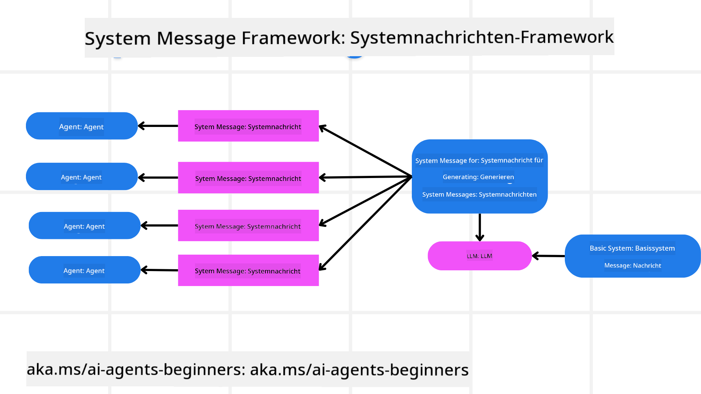
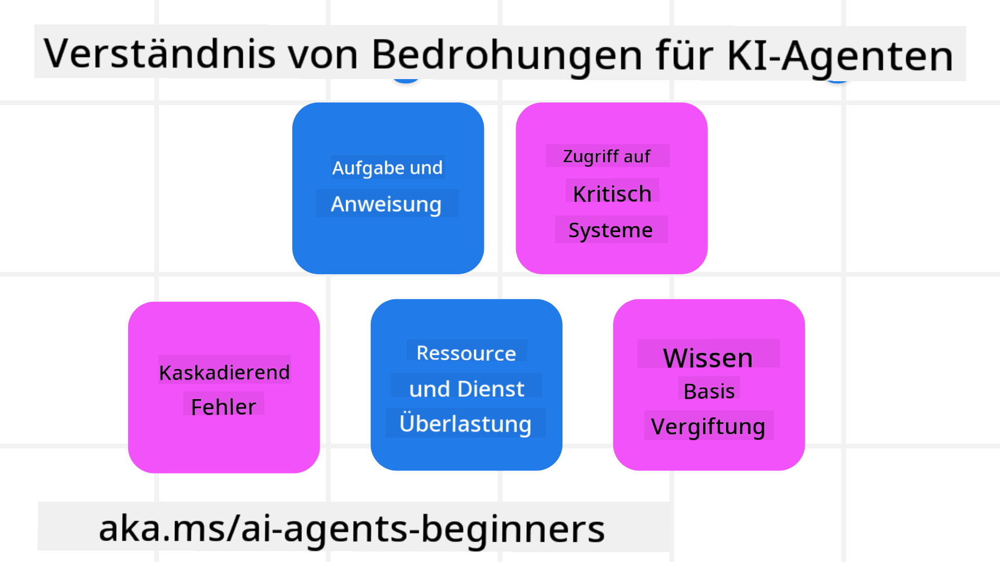

<!--
CO_OP_TRANSLATOR_METADATA:
{
  "original_hash": "f57852cac3a86c4a5ef47f793cc12178",
  "translation_date": "2025-07-12T10:21:24+00:00",
  "source_file": "06-building-trustworthy-agents/README.md",
  "language_code": "de"
}
-->
[](https://youtu.be/iZKkMEGBCUQ?si=Q-kEbcyHUMPoHp8L)

> _(Klicken Sie auf das Bild oben, um das Video zu dieser Lektion anzusehen)_

# Vertrauenswürdige KI-Agenten entwickeln

## Einführung

In dieser Lektion behandeln wir:

- Wie man sichere und effektive KI-Agenten entwickelt und bereitstellt
- Wichtige Sicherheitsaspekte bei der Entwicklung von KI-Agenten
- Wie man Datenschutz und Privatsphäre der Nutzer bei der Entwicklung von KI-Agenten gewährleistet

## Lernziele

Nach Abschluss dieser Lektion wissen Sie, wie Sie:

- Risiken bei der Erstellung von KI-Agenten erkennen und mindern
- Sicherheitsmaßnahmen implementieren, um Daten und Zugriffe richtig zu verwalten
- KI-Agenten erstellen, die Datenschutz gewährleisten und eine hochwertige Nutzererfahrung bieten

## Sicherheit

Schauen wir uns zunächst an, wie man sichere agentenbasierte Anwendungen entwickelt. Sicherheit bedeutet, dass der KI-Agent wie vorgesehen funktioniert. Als Entwickler agentenbasierter Anwendungen stehen uns Methoden und Werkzeuge zur Verfügung, um die Sicherheit zu maximieren:

### Aufbau eines Systemnachrichten-Frameworks

Wenn Sie schon einmal eine KI-Anwendung mit Large Language Models (LLMs) entwickelt haben, kennen Sie die Bedeutung eines robusten System-Prompts oder einer Systemnachricht. Diese Prompts legen die Meta-Regeln, Anweisungen und Richtlinien fest, wie das LLM mit dem Nutzer und den Daten interagiert.

Für KI-Agenten ist der System-Prompt noch wichtiger, da die Agenten sehr spezifische Anweisungen benötigen, um die von uns vorgesehenen Aufgaben zu erfüllen.

Um skalierbare System-Prompts zu erstellen, können wir ein Systemnachrichten-Framework verwenden, um einen oder mehrere Agenten in unserer Anwendung zu bauen:



#### Schritt 1: Erstellen einer Meta-Systemnachricht

Die Meta-Prompt wird von einem LLM verwendet, um die System-Prompts für die von uns erstellten Agenten zu generieren. Wir gestalten sie als Vorlage, damit wir bei Bedarf effizient mehrere Agenten erstellen können.

Hier ein Beispiel für eine Meta-Systemnachricht, die wir dem LLM geben würden:

```plaintext
You are an expert at creating AI agent assistants. 
You will be provided a company name, role, responsibilities and other
information that you will use to provide a system prompt for.
To create the system prompt, be descriptive as possible and provide a structure that a system using an LLM can better understand the role and responsibilities of the AI assistant. 
```

#### Schritt 2: Erstellen eines Basis-Prompts

Der nächste Schritt ist, einen Basis-Prompt zu erstellen, der den KI-Agenten beschreibt. Sie sollten die Rolle des Agenten, die Aufgaben, die er erledigen soll, und weitere Verantwortlichkeiten angeben.

Hier ein Beispiel:

```plaintext
You are a travel agent for Contoso Travel that is great at booking flights for customers. To help customers you can perform the following tasks: lookup available flights, book flights, ask for preferences in seating and times for flights, cancel any previously booked flights and alert customers on any delays or cancellations of flights.  
```

#### Schritt 3: Basis-Systemnachricht an das LLM übergeben

Jetzt können wir diese Systemnachricht optimieren, indem wir die Meta-Systemnachricht als Systemnachricht und unseren Basis-Prompt übergeben.

So entsteht eine Systemnachricht, die besser darauf ausgelegt ist, unsere KI-Agenten zu steuern:

```markdown
**Company Name:** Contoso Travel  
**Role:** Travel Agent Assistant

**Objective:**  
You are an AI-powered travel agent assistant for Contoso Travel, specializing in booking flights and providing exceptional customer service. Your main goal is to assist customers in finding, booking, and managing their flights, all while ensuring that their preferences and needs are met efficiently.

**Key Responsibilities:**

1. **Flight Lookup:**
    
    - Assist customers in searching for available flights based on their specified destination, dates, and any other relevant preferences.
    - Provide a list of options, including flight times, airlines, layovers, and pricing.
2. **Flight Booking:**
    
    - Facilitate the booking of flights for customers, ensuring that all details are correctly entered into the system.
    - Confirm bookings and provide customers with their itinerary, including confirmation numbers and any other pertinent information.
3. **Customer Preference Inquiry:**
    
    - Actively ask customers for their preferences regarding seating (e.g., aisle, window, extra legroom) and preferred times for flights (e.g., morning, afternoon, evening).
    - Record these preferences for future reference and tailor suggestions accordingly.
4. **Flight Cancellation:**
    
    - Assist customers in canceling previously booked flights if needed, following company policies and procedures.
    - Notify customers of any necessary refunds or additional steps that may be required for cancellations.
5. **Flight Monitoring:**
    
    - Monitor the status of booked flights and alert customers in real-time about any delays, cancellations, or changes to their flight schedule.
    - Provide updates through preferred communication channels (e.g., email, SMS) as needed.

**Tone and Style:**

- Maintain a friendly, professional, and approachable demeanor in all interactions with customers.
- Ensure that all communication is clear, informative, and tailored to the customer's specific needs and inquiries.

**User Interaction Instructions:**

- Respond to customer queries promptly and accurately.
- Use a conversational style while ensuring professionalism.
- Prioritize customer satisfaction by being attentive, empathetic, and proactive in all assistance provided.

**Additional Notes:**

- Stay updated on any changes to airline policies, travel restrictions, and other relevant information that could impact flight bookings and customer experience.
- Use clear and concise language to explain options and processes, avoiding jargon where possible for better customer understanding.

This AI assistant is designed to streamline the flight booking process for customers of Contoso Travel, ensuring that all their travel needs are met efficiently and effectively.

```

#### Schritt 4: Iterieren und Verbessern

Der Vorteil dieses Systemnachrichten-Frameworks liegt darin, dass es das Erstellen von Systemnachrichten für mehrere Agenten erleichtert und die Möglichkeit bietet, die Nachrichten im Laufe der Zeit zu verbessern. Es ist selten, dass eine Systemnachricht beim ersten Mal perfekt für den gesamten Anwendungsfall funktioniert. Kleine Anpassungen und Verbesserungen am Basis-Prompt und das erneute Durchlaufen des Systems ermöglichen es, Ergebnisse zu vergleichen und zu bewerten.

## Bedrohungen verstehen

Um vertrauenswürdige KI-Agenten zu entwickeln, ist es wichtig, die Risiken und Bedrohungen für Ihren KI-Agenten zu verstehen und zu mindern. Schauen wir uns einige der verschiedenen Bedrohungen für KI-Agenten an und wie Sie besser planen und sich darauf vorbereiten können.



### Aufgabe und Anweisung

**Beschreibung:** Angreifer versuchen, die Anweisungen oder Ziele des KI-Agenten durch Prompts oder Manipulation der Eingaben zu verändern.

**Minderung:** Führen Sie Validierungsprüfungen und Eingabefilter durch, um potenziell gefährliche Prompts zu erkennen, bevor sie vom KI-Agenten verarbeitet werden. Da diese Angriffe meist häufige Interaktionen mit dem Agenten erfordern, kann auch die Begrenzung der Gesprächsrunden helfen, solche Angriffe zu verhindern.

### Zugriff auf kritische Systeme

**Beschreibung:** Wenn ein KI-Agent Zugriff auf Systeme und Dienste hat, die sensible Daten speichern, können Angreifer die Kommunikation zwischen Agent und diesen Diensten kompromittieren. Dies kann direkte Angriffe oder indirekte Versuche sein, Informationen über diese Systeme über den Agenten zu erhalten.

**Minderung:** KI-Agenten sollten nur bedarfsorientierten Zugriff auf Systeme haben, um solche Angriffe zu verhindern. Die Kommunikation zwischen Agent und System sollte zudem sicher sein. Die Implementierung von Authentifizierung und Zugriffskontrolle schützt diese Informationen zusätzlich.

### Überlastung von Ressourcen und Diensten

**Beschreibung:** KI-Agenten können verschiedene Tools und Dienste nutzen, um Aufgaben zu erledigen. Angreifer können diese Fähigkeit ausnutzen, indem sie eine hohe Anzahl von Anfragen über den KI-Agenten an diese Dienste senden, was zu Systemausfällen oder hohen Kosten führen kann.

**Minderung:** Implementieren Sie Richtlinien, die die Anzahl der Anfragen eines KI-Agenten an einen Dienst begrenzen. Auch die Begrenzung der Gesprächsrunden und Anfragen an Ihren KI-Agenten ist eine Möglichkeit, solche Angriffe zu verhindern.

### Vergiftung der Wissensbasis

**Beschreibung:** Diese Art von Angriff richtet sich nicht direkt gegen den KI-Agenten, sondern gegen die Wissensbasis und andere Dienste, die der KI-Agent nutzt. Dabei werden Daten oder Informationen manipuliert, die der Agent zur Erfüllung seiner Aufgaben verwendet, was zu verzerrten oder unerwünschten Antworten führt.

**Minderung:** Führen Sie regelmäßige Überprüfungen der Daten durch, die der KI-Agent in seinen Abläufen verwendet. Stellen Sie sicher, dass der Zugriff auf diese Daten sicher ist und nur von vertrauenswürdigen Personen geändert wird, um solche Angriffe zu vermeiden.

### Kaskadierende Fehler

**Beschreibung:** KI-Agenten greifen auf verschiedene Tools und Dienste zu, um Aufgaben zu erledigen. Fehler, die durch Angreifer verursacht werden, können zu Ausfällen anderer Systeme führen, mit denen der KI-Agent verbunden ist, wodurch sich der Angriff ausbreitet und die Fehlersuche erschwert wird.

**Minderung:** Eine Möglichkeit, dies zu vermeiden, ist, den KI-Agenten in einer begrenzten Umgebung arbeiten zu lassen, z. B. in einem Docker-Container, um direkte Systemangriffe zu verhindern. Fallback-Mechanismen und Wiederholungslogik bei Fehlerantworten bestimmter Systeme helfen ebenfalls, größere Systemausfälle zu verhindern.

## Human-in-the-Loop

Eine weitere effektive Methode, vertrauenswürdige KI-Agenten-Systeme zu entwickeln, ist der Einsatz von Human-in-the-loop. Dabei entsteht ein Ablauf, bei dem Nutzer während der Ausführung Feedback an die Agenten geben können. Nutzer agieren dabei im Grunde als Agenten in einem Multi-Agenten-System und können den laufenden Prozess genehmigen oder abbrechen.


Hier ein Codebeispiel mit AutoGen, das zeigt, wie dieses Konzept umgesetzt wird:

```python

# Create the agents.
model_client = OpenAIChatCompletionClient(model="gpt-4o-mini")
assistant = AssistantAgent("assistant", model_client=model_client)
user_proxy = UserProxyAgent("user_proxy", input_func=input)  # Use input() to get user input from console.

# Create the termination condition which will end the conversation when the user says "APPROVE".
termination = TextMentionTermination("APPROVE")

# Create the team.
team = RoundRobinGroupChat([assistant, user_proxy], termination_condition=termination)

# Run the conversation and stream to the console.
stream = team.run_stream(task="Write a 4-line poem about the ocean.")
# Use asyncio.run(...) when running in a script.
await Console(stream)

```

## Fazit

Die Entwicklung vertrauenswürdiger KI-Agenten erfordert sorgfältiges Design, robuste Sicherheitsmaßnahmen und kontinuierliche Iteration. Durch die Implementierung strukturierter Meta-Prompt-Systeme, das Verständnis potenzieller Bedrohungen und die Anwendung von Gegenmaßnahmen können Entwickler KI-Agenten schaffen, die sowohl sicher als auch effektiv sind. Zudem sorgt der Einsatz von Human-in-the-loop dafür, dass KI-Agenten den Bedürfnissen der Nutzer entsprechen und Risiken minimiert werden. Da sich KI ständig weiterentwickelt, ist eine proaktive Haltung in Bezug auf Sicherheit, Datenschutz und ethische Überlegungen entscheidend, um Vertrauen und Zuverlässigkeit in KI-gesteuerten Systemen zu fördern.

## Zusätzliche Ressourcen

- <a href="https://learn.microsoft.com/azure/ai-studio/responsible-use-of-ai-overview" target="_blank">Responsible AI overview</a>
- <a href="https://learn.microsoft.com/azure/ai-studio/concepts/evaluation-approach-gen-ai" target="_blank">Evaluation of generative AI models and AI applications</a>
- <a href="https://learn.microsoft.com/azure/ai-services/openai/concepts/system-message?context=%2Fazure%2Fai-studio%2Fcontext%2Fcontext&tabs=top-techniques" target="_blank">Safety system messages</a>
- <a href="https://blogs.microsoft.com/wp-content/uploads/prod/sites/5/2022/06/Microsoft-RAI-Impact-Assessment-Template.pdf?culture=en-us&country=us" target="_blank">Risk Assessment Template</a>

## Vorherige Lektion

[Agentic RAG](../05-agentic-rag/README.md)

## Nächste Lektion

[Planning Design Pattern](../07-planning-design/README.md)

**Haftungsausschluss**:  
Dieses Dokument wurde mit dem KI-Übersetzungsdienst [Co-op Translator](https://github.com/Azure/co-op-translator) übersetzt. Obwohl wir uns um Genauigkeit bemühen, beachten Sie bitte, dass automatisierte Übersetzungen Fehler oder Ungenauigkeiten enthalten können. Das Originaldokument in seiner Ursprungssprache gilt als maßgebliche Quelle. Für wichtige Informationen wird eine professionelle menschliche Übersetzung empfohlen. Wir übernehmen keine Haftung für Missverständnisse oder Fehlinterpretationen, die aus der Nutzung dieser Übersetzung entstehen.