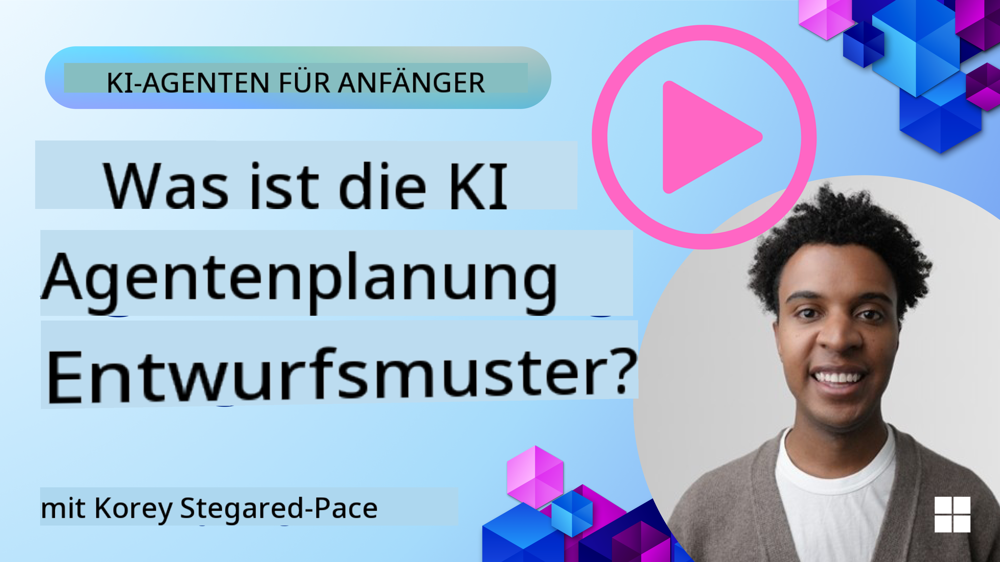
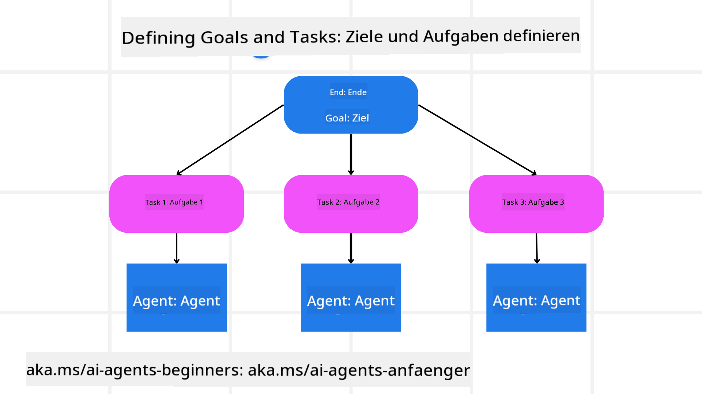

<!--
CO_OP_TRANSLATOR_METADATA:
{
  "original_hash": "a28d30590704ea13b6a08d4793cf9c2b",
  "translation_date": "2025-08-30T13:29:23+00:00",
  "source_file": "07-planning-design/README.md",
  "language_code": "de"
}
-->
[](https://youtu.be/kPfJ2BrBCMY?si=9pYpPXp0sSbK91Dr)

> _(Klicken Sie auf das Bild oben, um das Video zu dieser Lektion anzusehen)_

# Planungs-Design

## Einführung

Diese Lektion behandelt:

* Das Definieren eines klaren Gesamtziels und das Zerlegen einer komplexen Aufgabe in handhabbare Teilaufgaben.
* Die Nutzung strukturierter Ausgaben für zuverlässigere und maschinenlesbare Antworten.
* Die Anwendung eines ereignisgesteuerten Ansatzes, um dynamische Aufgaben und unerwartete Eingaben zu bewältigen.

## Lernziele

Nach Abschluss dieser Lektion werden Sie verstehen:

* Wie man ein Gesamtziel für einen KI-Agenten definiert, damit dieser genau weiß, was erreicht werden soll.
* Wie man eine komplexe Aufgabe in handhabbare Teilaufgaben zerlegt und diese in eine logische Reihenfolge bringt.
* Wie man Agenten mit den richtigen Werkzeugen (z. B. Such- oder Datenanalysetools) ausstattet, entscheidet, wann und wie diese verwendet werden, und unerwartete Situationen bewältigt.
* Wie man die Ergebnisse von Teilaufgaben bewertet, die Leistung misst und Maßnahmen iteriert, um das Endergebnis zu verbessern.

## Das Gesamtziel definieren und eine Aufgabe zerlegen



Die meisten Aufgaben in der realen Welt sind zu komplex, um sie in einem einzigen Schritt zu bewältigen. Ein KI-Agent benötigt ein prägnantes Ziel, das seine Planung und Aktionen leitet. Betrachten wir beispielsweise das Ziel:

    "Erstelle einen 3-tägigen Reiseplan."

Obwohl es einfach zu formulieren ist, bedarf es dennoch einer Verfeinerung. Je klarer das Ziel, desto besser können sich der Agent (und eventuelle menschliche Mitarbeiter) darauf konzentrieren, das richtige Ergebnis zu erzielen, wie z. B. die Erstellung eines umfassenden Reiseplans mit Flugoptionen, Hotelempfehlungen und Vorschlägen für Aktivitäten.

### Aufgabenzerlegung

Große oder komplexe Aufgaben werden überschaubarer, wenn sie in kleinere, zielgerichtete Teilaufgaben zerlegt werden.
Für das Beispiel des Reiseplans könnte man das Ziel wie folgt zerlegen:

* Flugbuchung
* Hotelbuchung
* Mietwagen
* Personalisierung

Jede Teilaufgabe kann dann von spezialisierten Agenten oder Prozessen bearbeitet werden. Ein Agent könnte sich auf die Suche nach den besten Flugangeboten spezialisieren, ein anderer auf Hotelbuchungen usw. Ein koordinierender oder „nachgelagerter“ Agent kann diese Ergebnisse dann zu einem zusammenhängenden Reiseplan für den Endnutzer zusammenstellen.

Dieser modulare Ansatz ermöglicht auch schrittweise Verbesserungen. Beispielsweise könnten spezialisierte Agenten für Essensempfehlungen oder lokale Aktivitätsvorschläge hinzugefügt werden, um den Reiseplan im Laufe der Zeit zu verfeinern.

### Strukturierte Ausgabe

Große Sprachmodelle (LLMs) können strukturierte Ausgaben (z. B. JSON) generieren, die für nachgelagerte Agenten oder Dienste leichter zu analysieren und zu verarbeiten sind. Dies ist besonders nützlich in einem Multi-Agenten-Kontext, in dem diese Aufgaben nach Erhalt der Planungs-Ausgabe ausgeführt werden können. Siehe hierzu eine kurze Übersicht.

Der folgende Python-Codeausschnitt zeigt, wie ein einfacher Planungs-Agent ein Ziel in Teilaufgaben zerlegt und einen strukturierten Plan erstellt:

```python
from pydantic import BaseModel
from enum import Enum
from typing import List, Optional, Union
import json
import os
from typing import Optional
from pprint import pprint
from autogen_core.models import UserMessage, SystemMessage, AssistantMessage
from autogen_ext.models.azure import AzureAIChatCompletionClient
from azure.core.credentials import AzureKeyCredential

class AgentEnum(str, Enum):
    FlightBooking = "flight_booking"
    HotelBooking = "hotel_booking"
    CarRental = "car_rental"
    ActivitiesBooking = "activities_booking"
    DestinationInfo = "destination_info"
    DefaultAgent = "default_agent"
    GroupChatManager = "group_chat_manager"

# Travel SubTask Model
class TravelSubTask(BaseModel):
    task_details: str
    assigned_agent: AgentEnum  # we want to assign the task to the agent

class TravelPlan(BaseModel):
    main_task: str
    subtasks: List[TravelSubTask]
    is_greeting: bool

client = AzureAIChatCompletionClient(
    model="gpt-4o-mini",
    endpoint="https://models.inference.ai.azure.com",
    # To authenticate with the model you will need to generate a personal access token (PAT) in your GitHub settings.
    # Create your PAT token by following instructions here: https://docs.github.com/en/authentication/keeping-your-account-and-data-secure/managing-your-personal-access-tokens
    credential=AzureKeyCredential(os.environ["GITHUB_TOKEN"]),
    model_info={
        "json_output": False,
        "function_calling": True,
        "vision": True,
        "family": "unknown",
    },
)

# Define the user message
messages = [
    SystemMessage(content="""You are an planner agent.
    Your job is to decide which agents to run based on the user's request.
                      Provide your response in JSON format with the following structure:
{'main_task': 'Plan a family trip from Singapore to Melbourne.',
 'subtasks': [{'assigned_agent': 'flight_booking',
               'task_details': 'Book round-trip flights from Singapore to '
                               'Melbourne.'}
    Below are the available agents specialised in different tasks:
    - FlightBooking: For booking flights and providing flight information
    - HotelBooking: For booking hotels and providing hotel information
    - CarRental: For booking cars and providing car rental information
    - ActivitiesBooking: For booking activities and providing activity information
    - DestinationInfo: For providing information about destinations
    - DefaultAgent: For handling general requests""", source="system"),
    UserMessage(
        content="Create a travel plan for a family of 2 kids from Singapore to Melboune", source="user"),
]

response = await client.create(messages=messages, extra_create_args={"response_format": 'json_object'})

response_content: Optional[str] = response.content if isinstance(
    response.content, str) else None
if response_content is None:
    raise ValueError("Response content is not a valid JSON string" )

pprint(json.loads(response_content))

# # Ensure the response content is a valid JSON string before loading it
# response_content: Optional[str] = response.content if isinstance(
#     response.content, str) else None
# if response_content is None:
#     raise ValueError("Response content is not a valid JSON string")

# # Print the response content after loading it as JSON
# pprint(json.loads(response_content))

# Validate the response content with the MathReasoning model
# TravelPlan.model_validate(json.loads(response_content))
```

### Planungs-Agent mit Multi-Agenten-Orchestrierung

In diesem Beispiel erhält ein Semantic Router Agent eine Benutzeranfrage (z. B. „Ich brauche einen Hotelplan für meine Reise.“).

Der Planer führt dann folgende Schritte aus:

* Empfang des Hotelplans: Der Planer nimmt die Nachricht des Benutzers entgegen und erstellt basierend auf einer Systemaufforderung (einschließlich Details zu verfügbaren Agenten) einen strukturierten Reiseplan.
* Auflistung der Agenten und ihrer Werkzeuge: Das Agenten-Register enthält eine Liste von Agenten (z. B. für Flüge, Hotels, Mietwagen und Aktivitäten) sowie die Funktionen oder Werkzeuge, die sie anbieten.
* Weiterleitung des Plans an die jeweiligen Agenten: Je nach Anzahl der Teilaufgaben sendet der Planer die Nachricht entweder direkt an einen dedizierten Agenten (bei Einzelaufgaben) oder koordiniert über einen Gruppen-Chat-Manager für die Zusammenarbeit mehrerer Agenten.
* Zusammenfassung des Ergebnisses: Schließlich fasst der Planer den erstellten Plan zur besseren Übersicht zusammen.

Der folgende Python-Codeausschnitt illustriert diese Schritte:

```python

from pydantic import BaseModel

from enum import Enum
from typing import List, Optional, Union

class AgentEnum(str, Enum):
    FlightBooking = "flight_booking"
    HotelBooking = "hotel_booking"
    CarRental = "car_rental"
    ActivitiesBooking = "activities_booking"
    DestinationInfo = "destination_info"
    DefaultAgent = "default_agent"
    GroupChatManager = "group_chat_manager"

# Travel SubTask Model

class TravelSubTask(BaseModel):
    task_details: str
    assigned_agent: AgentEnum # we want to assign the task to the agent

class TravelPlan(BaseModel):
    main_task: str
    subtasks: List[TravelSubTask]
    is_greeting: bool
import json
import os
from typing import Optional

from autogen_core.models import UserMessage, SystemMessage, AssistantMessage
from autogen_ext.models.openai import AzureOpenAIChatCompletionClient

# Create the client with type-checked environment variables

client = AzureOpenAIChatCompletionClient(
    azure_deployment=os.getenv("AZURE_OPENAI_DEPLOYMENT_NAME"),
    model=os.getenv("AZURE_OPENAI_DEPLOYMENT_NAME"),
    api_version=os.getenv("AZURE_OPENAI_API_VERSION"),
    azure_endpoint=os.getenv("AZURE_OPENAI_ENDPOINT"),
    api_key=os.getenv("AZURE_OPENAI_API_KEY"),
)

from pprint import pprint

# Define the user message

messages = [
    SystemMessage(content="""You are an planner agent.
    Your job is to decide which agents to run based on the user's request.
    Below are the available agents specialized in different tasks:
    - FlightBooking: For booking flights and providing flight information
    - HotelBooking: For booking hotels and providing hotel information
    - CarRental: For booking cars and providing car rental information
    - ActivitiesBooking: For booking activities and providing activity information
    - DestinationInfo: For providing information about destinations
    - DefaultAgent: For handling general requests""", source="system"),
    UserMessage(content="Create a travel plan for a family of 2 kids from Singapore to Melbourne", source="user"),
]

response = await client.create(messages=messages, extra_create_args={"response_format": TravelPlan})

# Ensure the response content is a valid JSON string before loading it

response_content: Optional[str] = response.content if isinstance(response.content, str) else None
if response_content is None:
    raise ValueError("Response content is not a valid JSON string")

# Print the response content after loading it as JSON

pprint(json.loads(response_content))
```

Das Ergebnis des vorherigen Codes kann dann verwendet werden, um an `assigned_agent` weiterzuleiten und den Reiseplan für den Endnutzer zusammenzufassen.

```json
{
    "is_greeting": "False",
    "main_task": "Plan a family trip from Singapore to Melbourne.",
    "subtasks": [
        {
            "assigned_agent": "flight_booking",
            "task_details": "Book round-trip flights from Singapore to Melbourne."
        },
        {
            "assigned_agent": "hotel_booking",
            "task_details": "Find family-friendly hotels in Melbourne."
        },
        {
            "assigned_agent": "car_rental",
            "task_details": "Arrange a car rental suitable for a family of four in Melbourne."
        },
        {
            "assigned_agent": "activities_booking",
            "task_details": "List family-friendly activities in Melbourne."
        },
        {
            "assigned_agent": "destination_info",
            "task_details": "Provide information about Melbourne as a travel destination."
        }
    ]
}
```

Ein Beispiel-Notebook mit dem vorherigen Codeausschnitt ist [hier](07-autogen.ipynb) verfügbar.

### Iterative Planung

Einige Aufgaben erfordern ein Hin und Her oder eine erneute Planung, bei der das Ergebnis einer Teilaufgabe die nächste beeinflusst. Wenn der Agent beispielsweise ein unerwartetes Datenformat bei der Flugbuchung entdeckt, muss er möglicherweise seine Strategie anpassen, bevor er mit der Hotelbuchung fortfährt.

Darüber hinaus kann Benutzerfeedback (z. B. wenn ein Mensch entscheidet, dass er einen früheren Flug bevorzugt) eine teilweise Neuplanung auslösen. Dieser dynamische, iterative Ansatz stellt sicher, dass die endgültige Lösung mit realen Einschränkungen und sich entwickelnden Benutzerpräferenzen übereinstimmt.

Beispielcode:

```python
from autogen_core.models import UserMessage, SystemMessage, AssistantMessage
#.. same as previous code and pass on the user history, current plan
messages = [
    SystemMessage(content="""You are a planner agent to optimize the
    Your job is to decide which agents to run based on the user's request.
    Below are the available agents specialized in different tasks:
    - FlightBooking: For booking flights and providing flight information
    - HotelBooking: For booking hotels and providing hotel information
    - CarRental: For booking cars and providing car rental information
    - ActivitiesBooking: For booking activities and providing activity information
    - DestinationInfo: For providing information about destinations
    - DefaultAgent: For handling general requests""", source="system"),
    UserMessage(content="Create a travel plan for a family of 2 kids from Singapore to Melbourne", source="user"),
    AssistantMessage(content=f"Previous travel plan - {TravelPlan}", source="assistant")
]
# .. re-plan and send the tasks to respective agents
```

Für eine umfassendere Planung schauen Sie sich Magnetic One an, um komplexe Aufgaben zu lösen.

## Zusammenfassung

In diesem Artikel haben wir ein Beispiel dafür betrachtet, wie wir einen Planer erstellen können, der dynamisch die verfügbaren definierten Agenten auswählt. Die Ausgabe des Planers zerlegt die Aufgaben und weist die Agenten zu, damit sie ausgeführt werden können. Es wird davon ausgegangen, dass die Agenten Zugriff auf die Funktionen/Werkzeuge haben, die zur Erfüllung der Aufgabe erforderlich sind. Zusätzlich zu den Agenten können Sie andere Muster wie Reflexion, Zusammenfassung und Round-Robin-Chat einbinden, um weitere Anpassungen vorzunehmen.

## Zusätzliche Ressourcen

* AutoGen Magnetic One - Ein generalistisches Multi-Agenten-System zur Lösung komplexer Aufgaben, das beeindruckende Ergebnisse bei mehreren anspruchsvollen agentischen Benchmarks erzielt hat. Referenz:

In dieser Implementierung erstellt der Orchestrator einen aufgabenspezifischen Plan und delegiert diese Aufgaben an die verfügbaren Agenten. Neben der Planung verwendet der Orchestrator auch einen Tracking-Mechanismus, um den Fortschritt der Aufgabe zu überwachen und bei Bedarf neu zu planen.

### Haben Sie weitere Fragen zum Planungs-Design-Muster?

Treten Sie dem [Azure AI Foundry Discord](https://aka.ms/ai-agents/discord) bei, um andere Lernende zu treffen, Sprechstunden zu besuchen und Ihre Fragen zu KI-Agenten beantwortet zu bekommen.

## Vorherige Lektion

[Vertrauenswürdige KI-Agenten erstellen](../06-building-trustworthy-agents/README.md)

## Nächste Lektion

[Multi-Agenten-Design-Muster](../08-multi-agent/README.md)

---

**Haftungsausschluss**:  
Dieses Dokument wurde mithilfe des KI-Übersetzungsdienstes [Co-op Translator](https://github.com/Azure/co-op-translator) übersetzt. Obwohl wir uns um Genauigkeit bemühen, weisen wir darauf hin, dass automatisierte Übersetzungen Fehler oder Ungenauigkeiten enthalten können. Das Originaldokument in seiner ursprünglichen Sprache sollte als maßgebliche Quelle betrachtet werden. Für kritische Informationen wird eine professionelle menschliche Übersetzung empfohlen. Wir übernehmen keine Haftung für Missverständnisse oder Fehlinterpretationen, die aus der Nutzung dieser Übersetzung entstehen.