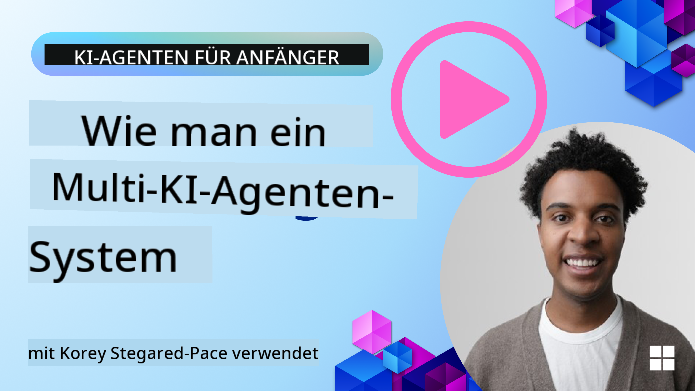
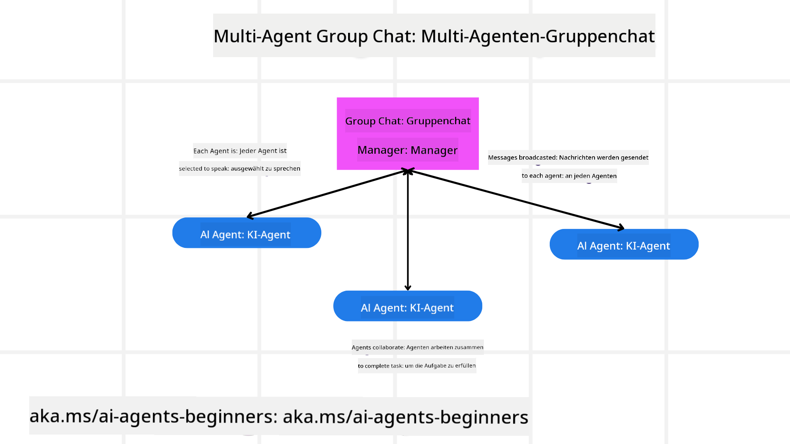
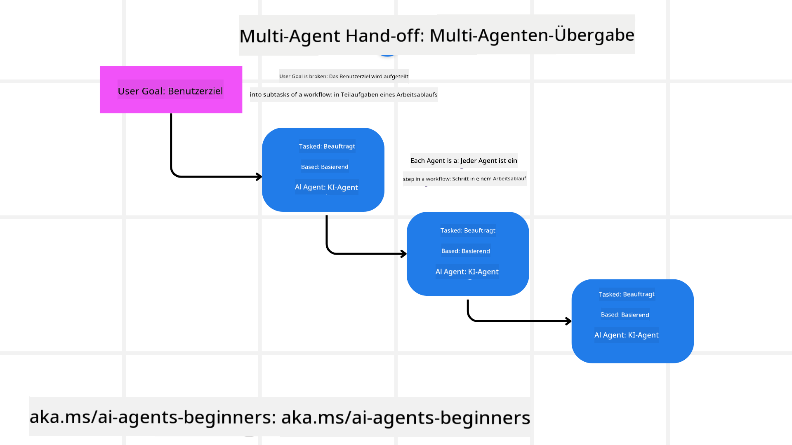
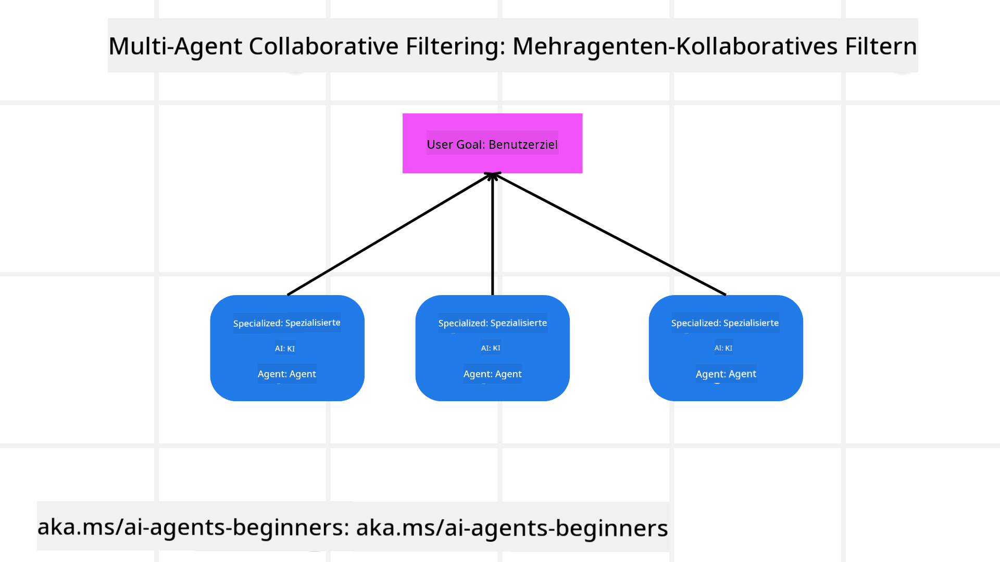

<!--
CO_OP_TRANSLATOR_METADATA:
{
  "original_hash": "c692a8975d7d5b99575a553de1c5e8a7",
  "translation_date": "2025-07-12T10:51:19+00:00",
  "source_file": "08-multi-agent/README.md",
  "language_code": "de"
}
-->

> _(Klicken Sie auf das Bild oben, um das Video zu dieser Lektion anzusehen)_

# Multi-Agent Designmuster

Sobald Sie an einem Projekt arbeiten, das mehrere Agenten umfasst, müssen Sie das Multi-Agent Designmuster berücksichtigen. Es ist jedoch nicht immer sofort klar, wann man auf mehrere Agenten umsteigen sollte und welche Vorteile dies bringt.

## Einführung

In dieser Lektion wollen wir folgende Fragen beantworten:

- In welchen Szenarien sind Multi-Agenten anwendbar?
- Welche Vorteile bietet die Nutzung von Multi-Agenten gegenüber einem einzelnen Agenten, der mehrere Aufgaben übernimmt?
- Was sind die Bausteine zur Implementierung des Multi-Agent Designmusters?
- Wie behalten wir den Überblick darüber, wie die verschiedenen Agenten miteinander interagieren?

## Lernziele

Nach dieser Lektion sollten Sie in der Lage sein:

- Szenarien zu erkennen, in denen Multi-Agenten sinnvoll sind
- Die Vorteile von Multi-Agenten gegenüber einem einzelnen Agenten zu verstehen
- Die Bausteine zur Implementierung des Multi-Agent Designmusters zu erfassen

Was ist das große Ganze?

*Multi-Agenten sind ein Designmuster, das es mehreren Agenten ermöglicht, zusammenzuarbeiten, um ein gemeinsames Ziel zu erreichen.*

Dieses Muster wird in vielen Bereichen eingesetzt, darunter Robotik, autonome Systeme und verteiltes Rechnen.

## Szenarien, in denen Multi-Agenten anwendbar sind

Welche Szenarien eignen sich also gut für den Einsatz von Multi-Agenten? Die Antwort ist, dass es viele Situationen gibt, in denen der Einsatz mehrerer Agenten besonders vorteilhaft ist, insbesondere in folgenden Fällen:

- **Große Arbeitslasten**: Große Arbeitslasten können in kleinere Aufgaben aufgeteilt und verschiedenen Agenten zugewiesen werden, was parallele Verarbeitung und schnellere Fertigstellung ermöglicht. Ein Beispiel hierfür ist die Verarbeitung großer Datenmengen.
- **Komplexe Aufgaben**: Komplexe Aufgaben können, ähnlich wie große Arbeitslasten, in kleinere Teilaufgaben zerlegt und verschiedenen Agenten zugewiesen werden, die jeweils auf einen bestimmten Aspekt spezialisiert sind. Ein gutes Beispiel sind autonome Fahrzeuge, bei denen unterschiedliche Agenten Navigation, Hinderniserkennung und Kommunikation mit anderen Fahrzeugen übernehmen.
- **Vielfältige Expertise**: Verschiedene Agenten können unterschiedliche Fachkenntnisse besitzen, wodurch sie verschiedene Aspekte einer Aufgabe effektiver bearbeiten können als ein einzelner Agent. Ein Beispiel hierfür ist das Gesundheitswesen, wo Agenten Diagnostik, Behandlungspläne und Patientenüberwachung übernehmen.

## Vorteile der Nutzung von Multi-Agenten gegenüber einem einzelnen Agenten

Ein einzelnes Agentensystem kann für einfache Aufgaben gut funktionieren, aber bei komplexeren Aufgaben bietet der Einsatz mehrerer Agenten mehrere Vorteile:

- **Spezialisierung**: Jeder Agent kann auf eine bestimmte Aufgabe spezialisiert sein. Fehlt diese Spezialisierung bei einem einzelnen Agenten, hat man einen Agenten, der alles machen kann, aber bei komplexen Aufgaben möglicherweise nicht weiß, was er tun soll. Er könnte zum Beispiel eine Aufgabe übernehmen, für die er nicht optimal geeignet ist.
- **Skalierbarkeit**: Systeme lassen sich leichter skalieren, indem man weitere Agenten hinzufügt, anstatt einen einzelnen Agenten zu überlasten.
- **Fehlertoleranz**: Fällt ein Agent aus, können die anderen weiterhin funktionieren, was die Zuverlässigkeit des Systems erhöht.

Nehmen wir ein Beispiel: Wir wollen eine Reise für einen Nutzer buchen. Ein einzelner Agent müsste alle Aspekte des Buchungsprozesses übernehmen – von der Flug- über die Hotel- bis zur Mietwagenbuchung. Um das mit einem einzelnen Agenten zu schaffen, müsste dieser alle Werkzeuge für diese Aufgaben besitzen. Das kann zu einem komplexen und monolithischen System führen, das schwer zu warten und zu skalieren ist. Ein Multi-Agent-System hingegen könnte verschiedene Agenten haben, die jeweils auf Flugsuche, Hotelbuchung und Mietwagen spezialisiert sind. Das macht das System modularer, leichter wartbar und skalierbar.

Vergleichen Sie das mit einem Reisebüro, das als Familienbetrieb geführt wird, gegenüber einem Franchise-Reisebüro. Das Familienbetrieb-Reisebüro hätte einen einzelnen Agenten, der alle Aspekte der Reisebuchung übernimmt, während das Franchise verschiedene Agenten für unterschiedliche Aufgaben einsetzt.

## Bausteine zur Implementierung des Multi-Agent Designmusters

Bevor Sie das Multi-Agent Designmuster implementieren können, müssen Sie die Bausteine verstehen, aus denen das Muster besteht.

Machen wir das anhand des Beispiels der Reisebuchung für einen Nutzer konkreter. Die Bausteine umfassen:

- **Agentenkommunikation**: Agenten für Flugsuche, Hotel- und Mietwagenbuchung müssen kommunizieren und Informationen über die Präferenzen und Einschränkungen des Nutzers austauschen. Sie müssen die Protokolle und Methoden für diese Kommunikation festlegen. Konkret bedeutet das, dass der Agent für Flugsuche mit dem Agenten für Hotelbuchung kommunizieren muss, um sicherzustellen, dass das Hotel für dieselben Daten gebucht wird wie der Flug. Die Agenten müssen also Informationen über die Reisedaten des Nutzers teilen, was bedeutet, dass Sie entscheiden müssen, *welche Agenten Informationen austauschen und wie sie das tun*.
- **Koordinationsmechanismen**: Agenten müssen ihre Aktionen koordinieren, um sicherzustellen, dass die Präferenzen und Einschränkungen des Nutzers eingehalten werden. Eine Nutzerpräferenz könnte sein, dass das Hotel in Flughafennähe liegt, während eine Einschränkung sein könnte, dass Mietwagen nur am Flughafen verfügbar sind. Das bedeutet, dass der Hotelbuchungsagent mit dem Mietwagenagenten koordinieren muss, um die Nutzerwünsche zu erfüllen. Sie müssen also entscheiden, *wie die Agenten ihre Aktionen koordinieren*.
- **Agentenarchitektur**: Agenten benötigen eine interne Struktur, um Entscheidungen zu treffen und aus ihren Interaktionen mit dem Nutzer zu lernen. Das bedeutet, dass der Flugsuche-Agent eine interne Struktur haben muss, um zu entscheiden, welche Flüge dem Nutzer empfohlen werden. Sie müssen also entscheiden, *wie die Agenten Entscheidungen treffen und aus den Interaktionen mit dem Nutzer lernen*. Ein Beispiel wäre, dass der Flugsuche-Agent ein Machine-Learning-Modell nutzt, um basierend auf den bisherigen Präferenzen des Nutzers Flüge zu empfehlen.
- **Transparenz der Multi-Agent-Interaktionen**: Sie müssen nachvollziehen können, wie die verschiedenen Agenten miteinander interagieren. Dazu benötigen Sie Werkzeuge und Techniken zur Nachverfolgung der Aktivitäten und Interaktionen der Agenten. Das kann in Form von Protokollierungs- und Überwachungstools, Visualisierungstools und Leistungskennzahlen erfolgen.
- **Multi-Agent-Muster**: Es gibt verschiedene Muster zur Implementierung von Multi-Agent-Systemen, wie zentralisierte, dezentralisierte und hybride Architekturen. Sie müssen das Muster auswählen, das am besten zu Ihrem Anwendungsfall passt.
- **Mensch in der Schleife**: In den meisten Fällen ist ein Mensch in der Schleife, und Sie müssen den Agenten Anweisungen geben, wann sie menschliche Eingriffe anfordern sollen. Das kann zum Beispiel der Fall sein, wenn ein Nutzer ein bestimmtes Hotel oder einen Flug wünscht, den die Agenten nicht empfohlen haben, oder wenn vor der Buchung eine Bestätigung eingeholt werden soll.

## Transparenz der Multi-Agent-Interaktionen

Es ist wichtig, dass Sie nachvollziehen können, wie die verschiedenen Agenten miteinander interagieren. Diese Transparenz ist entscheidend für das Debugging, die Optimierung und die Sicherstellung der Effektivität des Gesamtsystems. Um dies zu erreichen, benötigen Sie Werkzeuge und Techniken zur Nachverfolgung der Aktivitäten und Interaktionen der Agenten. Das kann in Form von Protokollierungs- und Überwachungstools, Visualisierungstools und Leistungskennzahlen erfolgen.

Beispielsweise könnten Sie im Fall der Reisebuchung ein Dashboard haben, das den Status jedes Agenten, die Präferenzen und Einschränkungen des Nutzers sowie die Interaktionen zwischen den Agenten anzeigt. Dieses Dashboard könnte die Reisedaten des Nutzers, die vom Flugsuche-Agent empfohlenen Flüge, die vom Hotel-Agent empfohlenen Hotels und die vom Mietwagen-Agent empfohlenen Fahrzeuge zeigen. So erhalten Sie einen klaren Überblick darüber, wie die Agenten miteinander interagieren und ob die Nutzerwünsche erfüllt werden.

Schauen wir uns diese Aspekte genauer an:

- **Protokollierungs- und Überwachungstools**: Sie sollten für jede Aktion eines Agenten eine Protokollierung vornehmen. Ein Protokolleintrag könnte Informationen über den Agenten, die ausgeführte Aktion, den Zeitpunkt der Aktion und das Ergebnis enthalten. Diese Informationen können dann für Debugging, Optimierung und mehr genutzt werden.
- **Visualisierungstools**: Visualisierungstools helfen dabei, die Interaktionen zwischen Agenten anschaulicher darzustellen. Zum Beispiel könnten Sie einen Graphen haben, der den Informationsfluss zwischen den Agenten zeigt. Das kann helfen, Engpässe, Ineffizienzen und andere Probleme im System zu erkennen.
- **Leistungskennzahlen**: Leistungskennzahlen helfen dabei, die Effektivität des Multi-Agent-Systems zu überwachen. Beispielsweise könnten Sie die Zeit messen, die zur Erledigung einer Aufgabe benötigt wird, die Anzahl der pro Zeiteinheit abgeschlossenen Aufgaben und die Genauigkeit der Empfehlungen der Agenten. Diese Informationen helfen, Verbesserungsmöglichkeiten zu identifizieren und das System zu optimieren.

## Multi-Agent-Muster

Schauen wir uns einige konkrete Muster an, die wir zur Erstellung von Multi-Agent-Anwendungen nutzen können. Hier sind einige interessante Muster, die es wert sind, betrachtet zu werden:

### Gruppenchat

Dieses Muster ist nützlich, wenn Sie eine Gruppenchat-Anwendung erstellen möchten, in der mehrere Agenten miteinander kommunizieren können. Typische Anwendungsfälle sind Teamarbeit, Kundensupport und soziale Netzwerke.

In diesem Muster repräsentiert jeder Agent einen Nutzer im Gruppenchat, und Nachrichten werden zwischen den Agenten über ein Nachrichtenprotokoll ausgetauscht. Die Agenten können Nachrichten an den Gruppenchat senden, Nachrichten vom Gruppenchat empfangen und auf Nachrichten anderer Agenten antworten.

Dieses Muster kann mit einer zentralisierten Architektur umgesetzt werden, bei der alle Nachrichten über einen zentralen Server geleitet werden, oder mit einer dezentralisierten Architektur, bei der Nachrichten direkt ausgetauscht werden.

### Übergabe

Dieses Muster ist nützlich, wenn Sie eine Anwendung erstellen möchten, in der mehrere Agenten Aufgaben aneinander übergeben können.

Typische Anwendungsfälle sind Kundensupport, Aufgabenmanagement und Workflow-Automatisierung.

In diesem Muster repräsentiert jeder Agent eine Aufgabe oder einen Schritt in einem Workflow, und Agenten können Aufgaben basierend auf vordefinierten Regeln an andere Agenten übergeben.

### Kollaborative Filterung

Dieses Muster ist nützlich, wenn Sie eine Anwendung erstellen möchten, in der mehrere Agenten zusammenarbeiten, um Empfehlungen für Nutzer zu erstellen.

Der Grund, warum mehrere Agenten zusammenarbeiten sollten, ist, dass jeder Agent unterschiedliche Fachkenntnisse hat und auf unterschiedliche Weise zum Empfehlungsprozess beitragen kann.

Nehmen wir als Beispiel einen Nutzer, der eine Empfehlung für die beste Aktie am Aktienmarkt möchte.

- **Branchenexperte**: Ein Agent könnte Experte für eine bestimmte Branche sein.
- **Technische Analyse**: Ein anderer Agent könnte Experte für technische Analysen sein.
- **Fundamentalanalyse**: Ein weiterer Agent könnte Experte für Fundamentalanalysen sein. Durch die Zusammenarbeit können diese Agenten dem Nutzer eine umfassendere Empfehlung geben.

## Szenario: Rückerstattungsprozess

Betrachten wir ein Szenario, in dem ein Kunde eine Rückerstattung für ein Produkt beantragt. Dabei können mehrere Agenten beteiligt sein. Wir unterteilen sie in spezifische Agenten für diesen Prozess und allgemeine Agenten, die auch in anderen Prozessen eingesetzt werden können.

**Spezifische Agenten für den Rückerstattungsprozess**:

Folgende Agenten könnten im Rückerstattungsprozess beteiligt sein:

- **Kundenagent**: Dieser Agent repräsentiert den Kunden und ist für die Einleitung des Rückerstattungsprozesses zuständig.
- **Verkäuferagent**: Dieser Agent repräsentiert den Verkäufer und ist für die Bearbeitung der Rückerstattung verantwortlich.
- **Zahlungsagent**: Dieser Agent repräsentiert den Zahlungsprozess und ist für die Rückzahlung an den Kunden zuständig.
- **Lösungsagent**: Dieser Agent repräsentiert den Lösungsprozess und ist für die Klärung von Problemen während des Rückerstattungsprozesses verantwortlich.
- **Compliance-Agent**: Dieser Agent stellt sicher, dass der Rückerstattungsprozess den Vorschriften und Richtlinien entspricht.

**Allgemeine Agenten**:

Diese Agenten können in anderen Bereichen Ihres Unternehmens eingesetzt werden.

- **Versandagent**: Dieser Agent repräsentiert den Versandprozess und ist für den Rückversand des Produkts an den Verkäufer zuständig. Er kann sowohl im Rückerstattungsprozess als auch für den allgemeinen Versand von Produkten, z. B. bei einem Kauf, verwendet werden.
- **Feedback-Agent**: Dieser Agent sammelt Feedback vom Kunden. Feedback kann jederzeit eingeholt werden, nicht nur während des Rückerstattungsprozesses.
- **Eskaltionsagent**: Dieser Agent ist für die Eskalation von Problemen an eine höhere Support-Ebene zuständig. Sie können diesen Agenten in jedem Prozess einsetzen, in dem eine Eskalation notwendig ist.
- **Benachrichtigungsagent**: Dieser Agent versendet Benachrichtigungen an den Kunden in verschiedenen Phasen des Rückerstattungsprozesses.
- **Analyseagent**: Dieser Agent analysiert Daten, die mit dem Rückerstattungsprozess zusammenhängen.
- **Audit-Agent**: Dieser Agent prüft den Rückerstattungsprozess, um sicherzustellen, dass er korrekt durchgeführt wird.
- **Berichtsagent**: Dieser Agent erstellt Berichte über den Rückerstattungsprozess.
- **Wissensagent**: Dieser Agent verwaltet eine Wissensdatenbank mit Informationen zum Rückerstattungsprozess. Er könnte sowohl über Rückerstattungen als auch über andere Geschäftsbereiche Bescheid wissen.
- **Sicherheitsagent**: Dieser Agent sorgt für die Sicherheit des Rückerstattungsprozesses.
- **Qualitätsagent**: Dieser Agent stellt die Qualität des Rückerstattungsprozesses sicher.

Es gibt also eine ganze Reihe von Agenten, sowohl für den spezifischen Rückerstattungsprozess als auch für allgemeine Aufgaben, die in anderen Bereichen Ihres Unternehmens eingesetzt werden können. Hoffentlich gibt Ihnen das eine Vorstellung davon, wie Sie entscheiden können, welche Agenten Sie in Ihrem Multi-Agent-System einsetzen.

## Aufgabe
## Vorherige Lektion

[Planungsdesign](../07-planning-design/README.md)

## Nächste Lektion

[Metakognition bei KI-Agenten](../09-metacognition/README.md)

**Haftungsausschluss**:  
Dieses Dokument wurde mit dem KI-Übersetzungsdienst [Co-op Translator](https://github.com/Azure/co-op-translator) übersetzt. Obwohl wir uns um Genauigkeit bemühen, beachten Sie bitte, dass automatisierte Übersetzungen Fehler oder Ungenauigkeiten enthalten können. Das Originaldokument in seiner Ursprungssprache ist als maßgebliche Quelle zu betrachten. Für wichtige Informationen wird eine professionelle menschliche Übersetzung empfohlen. Wir übernehmen keine Haftung für Missverständnisse oder Fehlinterpretationen, die aus der Nutzung dieser Übersetzung entstehen.