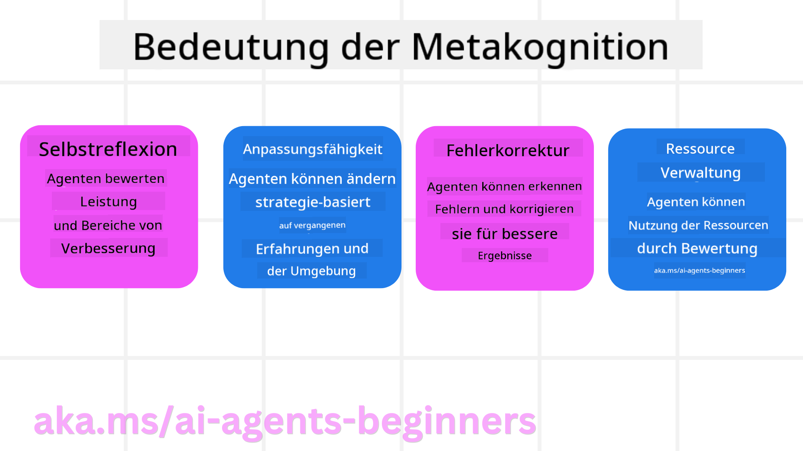
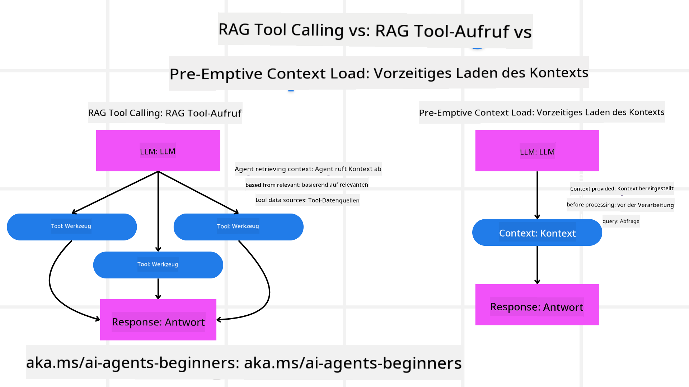

<!--
CO_OP_TRANSLATOR_METADATA:
{
  "original_hash": "8cbf460468c802c7994aa62e0e0779c9",
  "translation_date": "2025-07-12T11:48:39+00:00",
  "source_file": "09-metacognition/README.md",
  "language_code": "de"
}
-->
[](https://youtu.be/His9R6gw6Ec?si=3_RMb8VprNvdLRhX)

> _(Klicke auf das Bild oben, um das Video zu dieser Lektion anzusehen)_
# Metakognition bei KI-Agenten

## Einführung

Willkommen zur Lektion über Metakognition bei KI-Agenten! Dieses Kapitel richtet sich an Einsteiger, die neugierig darauf sind, wie KI-Agenten über ihre eigenen Denkprozesse nachdenken können. Am Ende dieser Lektion wirst du die wichtigsten Konzepte verstehen und praktische Beispiele kennen, um Metakognition im Design von KI-Agenten anzuwenden.

## Lernziele

Nach Abschluss dieser Lektion wirst du in der Lage sein:

1. Die Auswirkungen von Denk-Schleifen in Agentendefinitionen zu verstehen.
2. Planungs- und Bewertungstechniken zu nutzen, um selbstkorrigierende Agenten zu unterstützen.
3. Eigene Agenten zu erstellen, die in der Lage sind, Code zu manipulieren, um Aufgaben zu erfüllen.

## Einführung in die Metakognition

Metakognition bezeichnet kognitive Prozesse höherer Ordnung, die das Nachdenken über das eigene Denken umfassen. Für KI-Agenten bedeutet das, ihre Handlungen basierend auf Selbstwahrnehmung und vergangenen Erfahrungen bewerten und anpassen zu können. Metakognition, also „über das Denken nachdenken“, ist ein wichtiger Begriff bei der Entwicklung agentischer KI-Systeme. Dabei sind KI-Systeme sich ihrer eigenen internen Prozesse bewusst und können ihr Verhalten überwachen, regulieren und entsprechend anpassen. Ähnlich wie wir es tun, wenn wir die Stimmung im Raum erfassen oder ein Problem betrachten. Diese Selbstwahrnehmung hilft KI-Systemen, bessere Entscheidungen zu treffen, Fehler zu erkennen und ihre Leistung im Laufe der Zeit zu verbessern – was wiederum an den Turing-Test und die Debatte erinnert, ob KI die Kontrolle übernehmen wird.

Im Kontext agentischer KI-Systeme kann Metakognition helfen, verschiedene Herausforderungen zu bewältigen, wie zum Beispiel:
- Transparenz: Sicherstellen, dass KI-Systeme ihre Überlegungen und Entscheidungen erklären können.
- Schlussfolgerungen: Die Fähigkeit der KI-Systeme verbessern, Informationen zu verknüpfen und fundierte Entscheidungen zu treffen.
- Anpassungsfähigkeit: KI-Systeme befähigen, sich an neue Umgebungen und veränderte Bedingungen anzupassen.
- Wahrnehmung: Die Genauigkeit der KI-Systeme bei der Erkennung und Interpretation von Umgebungsdaten verbessern.

### Was ist Metakognition?

Metakognition, also „über das Denken nachdenken“, ist ein kognitiver Prozess höherer Ordnung, der Selbstbewusstsein und Selbstregulierung der eigenen Denkprozesse umfasst. Im Bereich der KI befähigt Metakognition Agenten dazu, ihre Strategien und Handlungen zu bewerten und anzupassen, was zu besseren Problemlösungs- und Entscheidungsfähigkeiten führt. Wenn du Metakognition verstehst, kannst du KI-Agenten entwerfen, die nicht nur intelligenter, sondern auch anpassungsfähiger und effizienter sind. Echte Metakognition zeigt sich darin, dass die KI explizit über ihr eigenes Denken reflektiert.

Beispiel: „Ich habe günstigere Flüge priorisiert, aber vielleicht verpasse ich Direktflüge, also überprüfe ich das nochmal.“
Nachverfolgen, wie oder warum eine bestimmte Route gewählt wurde.
- Feststellen, dass Fehler entstanden sind, weil zu sehr auf Nutzerpräferenzen vom letzten Mal vertraut wurde, und deshalb die Entscheidungsstrategie angepasst wird – nicht nur die finale Empfehlung.
- Muster erkennen wie: „Immer wenn der Nutzer ‚zu voll‘ erwähnt, sollte ich nicht nur bestimmte Attraktionen streichen, sondern auch reflektieren, dass meine Methode, ‚Top-Attraktionen‘ auszuwählen, fehlerhaft ist, wenn ich immer nach Beliebtheit sortiere.“

### Bedeutung der Metakognition bei KI-Agenten

Metakognition spielt aus mehreren Gründen eine entscheidende Rolle im Design von KI-Agenten:



- Selbstreflexion: Agenten können ihre eigene Leistung bewerten und Verbesserungsmöglichkeiten erkennen.
- Anpassungsfähigkeit: Agenten können ihre Strategien basierend auf Erfahrungen und veränderten Umgebungen anpassen.
- Fehlerkorrektur: Agenten können Fehler selbstständig erkennen und korrigieren, was zu genaueren Ergebnissen führt.
- Ressourcenmanagement: Agenten können den Einsatz von Ressourcen wie Zeit und Rechenleistung durch Planung und Bewertung optimieren.

## Komponenten eines KI-Agenten

Bevor wir in metakognitive Prozesse eintauchen, ist es wichtig, die grundlegenden Komponenten eines KI-Agenten zu verstehen. Ein KI-Agent besteht typischerweise aus:

- Persona: Die Persönlichkeit und Eigenschaften des Agenten, die definieren, wie er mit Nutzern interagiert.
- Werkzeuge: Die Fähigkeiten und Funktionen, die der Agent ausführen kann.
- Fertigkeiten: Das Wissen und die Expertise, die der Agent besitzt.

Diese Komponenten arbeiten zusammen, um eine „Expertise-Einheit“ zu schaffen, die spezifische Aufgaben ausführen kann.

**Beispiel**:
Denke an einen Reiseberater, einen Agentenservice, der nicht nur deinen Urlaub plant, sondern seinen Weg auch basierend auf Echtzeitdaten und vergangenen Kundenerfahrungen anpasst.

### Beispiel: Metakognition in einem Reiseberater-Service

Stell dir vor, du entwirfst einen KI-gestützten Reiseberater-Service. Dieser Agent, „Travel Agent“, unterstützt Nutzer bei der Urlaubsplanung. Um Metakognition einzubauen, muss Travel Agent seine Handlungen basierend auf Selbstwahrnehmung und vergangenen Erfahrungen bewerten und anpassen. So könnte Metakognition eine Rolle spielen:

#### Aktuelle Aufgabe

Die aktuelle Aufgabe ist, einem Nutzer bei der Planung einer Reise nach Paris zu helfen.

#### Schritte zur Erfüllung der Aufgabe

1. **Nutzerpräferenzen erfassen**: Den Nutzer nach Reisedaten, Budget, Interessen (z. B. Museen, Kulinarik, Shopping) und speziellen Anforderungen fragen.
2. **Informationen abrufen**: Nach Flügen, Unterkünften, Sehenswürdigkeiten und Restaurants suchen, die zu den Präferenzen passen.
3. **Empfehlungen erstellen**: Einen personalisierten Reiseplan mit Flugdaten, Hotelreservierungen und vorgeschlagenen Aktivitäten bereitstellen.
4. **Anpassung basierend auf Feedback**: Den Nutzer um Rückmeldung zu den Empfehlungen bitten und notwendige Anpassungen vornehmen.

#### Benötigte Ressourcen

- Zugriff auf Flug- und Hotelbuchungsdatenbanken.
- Informationen zu Pariser Sehenswürdigkeiten und Restaurants.
- Nutzerrückmeldungen aus vorherigen Interaktionen.

#### Erfahrung und Selbstreflexion

Travel Agent nutzt Metakognition, um seine Leistung zu bewerten und aus vergangenen Erfahrungen zu lernen. Zum Beispiel:

1. **Analyse von Nutzerfeedback**: Travel Agent überprüft das Feedback, um zu erkennen, welche Empfehlungen gut ankamen und welche nicht, und passt zukünftige Vorschläge entsprechend an.
2. **Anpassungsfähigkeit**: Wenn ein Nutzer zuvor über Menschenmengen geklagt hat, vermeidet Travel Agent künftig, beliebte Touristenorte zu Stoßzeiten zu empfehlen.
3. **Fehlerkorrektur**: Wenn Travel Agent in der Vergangenheit einen Fehler gemacht hat, etwa ein ausgebuchtes Hotel vorgeschlagen hat, lernt er, die Verfügbarkeit vor der Empfehlung gründlicher zu prüfen.

#### Praktisches Entwicklerbeispiel

Hier ein vereinfachtes Beispiel, wie der Code von Travel Agent mit Metakognition aussehen könnte:

```python
class Travel_Agent:
    def __init__(self):
        self.user_preferences = {}
        self.experience_data = []

    def gather_preferences(self, preferences):
        self.user_preferences = preferences

    def retrieve_information(self):
        # Search for flights, hotels, and attractions based on preferences
        flights = search_flights(self.user_preferences)
        hotels = search_hotels(self.user_preferences)
        attractions = search_attractions(self.user_preferences)
        return flights, hotels, attractions

    def generate_recommendations(self):
        flights, hotels, attractions = self.retrieve_information()
        itinerary = create_itinerary(flights, hotels, attractions)
        return itinerary

    def adjust_based_on_feedback(self, feedback):
        self.experience_data.append(feedback)
        # Analyze feedback and adjust future recommendations
        self.user_preferences = adjust_preferences(self.user_preferences, feedback)

# Example usage
travel_agent = Travel_Agent()
preferences = {
    "destination": "Paris",
    "dates": "2025-04-01 to 2025-04-10",
    "budget": "moderate",
    "interests": ["museums", "cuisine"]
}
travel_agent.gather_preferences(preferences)
itinerary = travel_agent.generate_recommendations()
print("Suggested Itinerary:", itinerary)
feedback = {"liked": ["Louvre Museum"], "disliked": ["Eiffel Tower (too crowded)"]}
travel_agent.adjust_based_on_feedback(feedback)
```

#### Warum Metakognition wichtig ist

- **Selbstreflexion**: Agenten können ihre Leistung analysieren und Verbesserungsmöglichkeiten erkennen.
- **Anpassungsfähigkeit**: Agenten können Strategien basierend auf Feedback und veränderten Bedingungen anpassen.
- **Fehlerkorrektur**: Agenten können Fehler eigenständig erkennen und beheben.
- **Ressourcenmanagement**: Agenten können den Ressourceneinsatz wie Zeit und Rechenleistung optimieren.

Durch die Integration von Metakognition kann Travel Agent persönlichere und genauere Reiseempfehlungen geben und so das Nutzererlebnis verbessern.

---

## 2. Planung bei Agenten

Planung ist ein entscheidender Bestandteil des Verhaltens von KI-Agenten. Dabei werden die notwendigen Schritte zur Zielerreichung unter Berücksichtigung des aktuellen Zustands, der Ressourcen und möglicher Hindernisse festgelegt.

### Elemente der Planung

- **Aktuelle Aufgabe**: Die Aufgabe klar definieren.
- **Schritte zur Erfüllung der Aufgabe**: Die Aufgabe in überschaubare Schritte unterteilen.
- **Benötigte Ressourcen**: Notwendige Ressourcen identifizieren.
- **Erfahrung**: Frühere Erfahrungen zur Planung nutzen.

**Beispiel**:
Hier sind die Schritte, die Travel Agent unternehmen muss, um einem Nutzer effektiv bei der Reiseplanung zu helfen:

### Schritte für Travel Agent

1. **Nutzerpräferenzen erfassen**
   - Den Nutzer nach Reisedaten, Budget, Interessen und speziellen Anforderungen fragen.
   - Beispiele: „Wann möchtest du reisen?“ „Wie hoch ist dein Budget?“ „Welche Aktivitäten magst du im Urlaub?“

2. **Informationen abrufen**
   - Relevante Reiseoptionen basierend auf den Nutzerpräferenzen suchen.
   - **Flüge**: Verfügbare Flüge innerhalb des Budgets und der bevorzugten Reisedaten finden.
   - **Unterkünfte**: Hotels oder Ferienwohnungen suchen, die den Präferenzen bezüglich Lage, Preis und Ausstattung entsprechen.
   - **Sehenswürdigkeiten und Restaurants**: Beliebte Attraktionen, Aktivitäten und Restaurants identifizieren, die zu den Interessen passen.

3. **Empfehlungen erstellen**
   - Die gesammelten Informationen zu einem personalisierten Reiseplan zusammenstellen.
   - Details wie Flugoptionen, Hotelreservierungen und vorgeschlagene Aktivitäten bereitstellen und auf die Nutzerpräferenzen abstimmen.

4. **Reiseplan dem Nutzer präsentieren**
   - Den vorgeschlagenen Reiseplan dem Nutzer zur Überprüfung vorlegen.
   - Beispiel: „Hier ist ein Vorschlag für deine Reise nach Paris. Er enthält Flugdaten, Hotelbuchungen und eine Liste empfohlener Aktivitäten und Restaurants. Was hältst du davon?“

5. **Feedback einholen**
   - Den Nutzer um Rückmeldung zum vorgeschlagenen Reiseplan bitten.
   - Beispiele: „Gefällt dir die Flugauswahl?“ „Passt das Hotel zu deinen Bedürfnissen?“ „Möchtest du Aktivitäten hinzufügen oder entfernen?“

6. **Anpassung basierend auf Feedback**
   - Den Reiseplan entsprechend dem Nutzerfeedback anpassen.
   - Notwendige Änderungen bei Flug-, Unterkunfts- und Aktivitätsempfehlungen vornehmen, um besser auf die Präferenzen einzugehen.

7. **Endgültige Bestätigung**
   - Den aktualisierten Reiseplan dem Nutzer zur finalen Bestätigung vorlegen.
   - Beispiel: „Ich habe die Änderungen basierend auf deinem Feedback vorgenommen. Hier ist der aktualisierte Plan. Passt alles für dich?“

8. **Buchung und Bestätigung**
   - Nach Zustimmung des Nutzers Flüge, Unterkünfte und geplante Aktivitäten buchen.
   - Bestätigungsdetails an den Nutzer senden.

9. **Fortlaufende Unterstützung bieten**
   - Für Änderungen oder weitere Wünsche vor und während der Reise erreichbar bleiben.
   - Beispiel: „Wenn du während deiner Reise weitere Hilfe brauchst, kannst du dich jederzeit an mich wenden!“

### Beispielinteraktion

```python
class Travel_Agent:
    def __init__(self):
        self.user_preferences = {}
        self.experience_data = []

    def gather_preferences(self, preferences):
        self.user_preferences = preferences

    def retrieve_information(self):
        flights = search_flights(self.user_preferences)
        hotels = search_hotels(self.user_preferences)
        attractions = search_attractions(self.user_preferences)
        return flights, hotels, attractions

    def generate_recommendations(self):
        flights, hotels, attractions = self.retrieve_information()
        itinerary = create_itinerary(flights, hotels, attractions)
        return itinerary

    def adjust_based_on_feedback(self, feedback):
        self.experience_data.append(feedback)
        self.user_preferences = adjust_preferences(self.user_preferences, feedback)

# Example usage within a booing request
travel_agent = Travel_Agent()
preferences = {
    "destination": "Paris",
    "dates": "2025-04-01 to 2025-04-10",
    "budget": "moderate",
    "interests": ["museums", "cuisine"]
}
travel_agent.gather_preferences(preferences)
itinerary = travel_agent.generate_recommendations()
print("Suggested Itinerary:", itinerary)
feedback = {"liked": ["Louvre Museum"], "disliked": ["Eiffel Tower (too crowded)"]}
travel_agent.adjust_based_on_feedback(feedback)
```

## 3. Korrektives RAG-System

Zunächst wollen wir den Unterschied zwischen RAG-Tool und präventivem Kontextladen verstehen.



### Retrieval-Augmented Generation (RAG)

RAG kombiniert ein Retrieval-System mit einem generativen Modell. Bei einer Anfrage holt das Retrieval-System relevante Dokumente oder Daten aus einer externen Quelle, und diese Informationen werden genutzt, um die Eingabe für das generative Modell zu erweitern. Das hilft dem Modell, genauere und kontextbezogenere Antworten zu erzeugen.

In einem RAG-System ruft der Agent relevante Informationen aus einer Wissensdatenbank ab und nutzt diese, um passende Antworten oder Aktionen zu generieren.

### Korrektiver RAG-Ansatz

Der korrektive RAG-Ansatz konzentriert sich darauf, RAG-Techniken zu verwenden, um Fehler zu korrigieren und die Genauigkeit von KI-Agenten zu verbessern. Dies umfasst:

1. **Prompting-Technik**: Spezifische Eingabeaufforderungen verwenden, um den Agenten bei der Informationssuche zu leiten.
2. **Werkzeug**: Algorithmen und Mechanismen implementieren, die es dem Agenten ermöglichen, die Relevanz der abgerufenen Informationen zu bewerten und genaue Antworten zu generieren.
3. **Evaluation**: Die Leistung des Agenten kontinuierlich bewerten und Anpassungen vornehmen, um Genauigkeit und Effizienz zu steigern.

#### Beispiel: Korrektives RAG in einem Suchagenten

Betrachte einen Suchagenten, der Informationen aus dem Web abruft, um Nutzeranfragen zu beantworten. Der korrektive RAG-Ansatz könnte Folgendes beinhalten:

1. **Prompting-Technik**: Suchanfragen basierend auf der Nutzereingabe formulieren.
2. **Werkzeug**: Natürliche Sprachverarbeitung und maschinelle Lernalgorithmen verwenden, um Suchergebnisse zu bewerten und zu filtern.
3. **Evaluation**: Nutzerfeedback analysieren, um Ungenauigkeiten in den abgerufenen Informationen zu erkennen und zu korrigieren.

### Korrektives RAG im Travel Agent

Korrektives RAG (Retrieval-Augmented Generation) verbessert die Fähigkeit einer KI, Informationen abzurufen und zu generieren, während Fehler korrigiert werden. Schauen wir, wie Travel Agent den korrektiven RAG-Ansatz nutzen kann, um genauere und relevantere Reiseempfehlungen zu geben.

Dies umfasst:

- **Prompting-Technik:** Spezifische Eingabeaufforderungen verwenden, um den Agenten bei der Informationssuche zu leiten.
- **Werkzeug:** Algorithmen und Mechanismen implementieren, die es dem Agenten ermöglichen, die Relevanz der abgerufenen Informationen zu bewerten und genaue Antworten zu generieren.
- **Evaluation:** Die Leistung des Agenten kontinuierlich bewerten und Anpassungen vornehmen, um Genauigkeit und Effizienz zu steigern.

#### Schritte zur Implementierung von Korrektivem RAG im Travel Agent

1. **Erste Nutzerinteraktion**
   - Travel Agent erfasst erste Präferenzen des Nutzers, wie Zielort, Reisedaten, Budget und Interessen.
   - Beispiel:

     ```python
     preferences = {
         "destination": "Paris",
         "dates": "2025-04-01 to 2025-04-10",
         "budget": "moderate",
         "interests": ["museums", "cuisine"]
     }
     ```

2. **Informationsabruf**
   - Travel Agent ruft Informationen zu Flügen, Unterkünften, Sehenswürdigkeiten und Restaurants basierend auf den Nutzerpräferenzen ab.
   - Beispiel:

     ```python
     flights = search_flights(preferences)
     hotels = search_hotels(preferences)
     attractions = search_attractions(preferences)
     ```

3. **Erstellung erster Empfehlungen**
   - Travel Agent nutzt die abgerufenen Informationen, um einen personalisierten Reiseplan zu erstellen.
   - Beispiel:

     ```python
     itinerary = create_itinerary(flights, hotels, attractions)
     print("Suggested Itinerary:", itinerary)
     ```

4. **Einholung von Nutzerfeedback**
   - Travel Agent bittet den Nutzer um Rückmeldung zu den ersten Empfehlungen.
   - Beispiel:

     ```python
     feedback = {
         "liked": ["Louvre Museum"],
         "disliked": ["Eiffel Tower (too crowded)"]
     }
     ```

5. **Korrektiver RAG-Prozess**
   - **Prompting-Technik**: Travel Agent formuliert neue Suchanfragen basierend auf dem Nutzerfeedback.
     - Beispiel:

       ```python
       if "disliked" in feedback:
           preferences["avoid"] = feedback["disliked"]
       ```

   - **Werkzeug**: Travel Agent verwendet Algorithmen, um neue Suchergebnisse zu bewerten und zu filtern, wobei die Relevanz basierend auf dem Nutzerfeedback betont wird.
     - Beispiel:

       ```python
       new_attractions = search_attractions(preferences)
       new_itinerary = create_itinerary(flights, hotels, new_attractions)
       print("Updated Itinerary:", new_itinerary)
       ```

   - **Evaluation**: Travel Agent bewertet kontinuierlich die Relevanz und Genauigkeit seiner Empfehlungen, analysiert Nutzerfeedback und nimmt notwendige Anpassungen vor.
     - Beispiel:

       ```python
       def adjust_preferences(preferences, feedback):
           if "liked" in feedback:
               preferences["favorites"] = feedback["liked"]
           if "disliked" in feedback:
               preferences["avoid"] = feedback["disliked"]
           return preferences

       preferences = adjust_preferences(preferences, feedback)
       ```

#### Praktisches Beispiel

Hier ein vereinfachtes Python-Codebeispiel, das den korrektiven RAG-Ansatz im Travel Agent integriert:
### Vorab-Kontextladen

Vorab-Kontextladen bedeutet, relevante Kontext- oder Hintergrundinformationen vor der Verarbeitung einer Anfrage in das Modell zu laden. Dadurch hat das Modell von Anfang an Zugriff auf diese Informationen, was ihm hilft, fundiertere Antworten zu generieren, ohne während des Prozesses zusätzliche Daten abrufen zu müssen.

Hier ist ein vereinfachtes Beispiel, wie ein Vorab-Kontextladen für eine Reisebüro-Anwendung in Python aussehen könnte:

```python
class TravelAgent:
    def __init__(self):
        # Pre-load popular destinations and their information
        self.context = {
            "Paris": {"country": "France", "currency": "Euro", "language": "French", "attractions": ["Eiffel Tower", "Louvre Museum"]},
            "Tokyo": {"country": "Japan", "currency": "Yen", "language": "Japanese", "attractions": ["Tokyo Tower", "Shibuya Crossing"]},
            "New York": {"country": "USA", "currency": "Dollar", "language": "English", "attractions": ["Statue of Liberty", "Times Square"]},
            "Sydney": {"country": "Australia", "currency": "Dollar", "language": "English", "attractions": ["Sydney Opera House", "Bondi Beach"]}
        }

    def get_destination_info(self, destination):
        # Fetch destination information from pre-loaded context
        info = self.context.get(destination)
        if info:
            return f"{destination}:\nCountry: {info['country']}\nCurrency: {info['currency']}\nLanguage: {info['language']}\nAttractions: {', '.join(info['attractions'])}"
        else:
            return f"Sorry, we don't have information on {destination}."

# Example usage
travel_agent = TravelAgent()
print(travel_agent.get_destination_info("Paris"))
print(travel_agent.get_destination_info("Tokyo"))
```

#### Erklärung

1. **Initialisierung (`__init__` Methode)**: Die Klasse `TravelAgent` lädt im Voraus ein Wörterbuch mit Informationen zu beliebten Reisezielen wie Paris, Tokio, New York und Sydney. Dieses Wörterbuch enthält Details wie Land, Währung, Sprache und wichtige Sehenswürdigkeiten für jedes Ziel.

2. **Informationsabruf (`get_destination_info` Methode)**: Wenn ein Nutzer nach einem bestimmten Reiseziel fragt, holt die Methode `get_destination_info` die relevanten Informationen aus dem vorab geladenen Kontext-Wörterbuch.

Durch das Vorab-Laden des Kontexts kann die Reisebüro-Anwendung schnell auf Nutzeranfragen reagieren, ohne die Informationen in Echtzeit aus einer externen Quelle abrufen zu müssen. Das macht die Anwendung effizienter und reaktionsschneller.

### Plan mit einem Ziel vor dem Iterieren starten

Einen Plan mit einem Ziel zu starten bedeutet, von Anfang an ein klares Ziel oder Ergebnis vor Augen zu haben. Indem dieses Ziel definiert wird, kann das Modell es als Leitprinzip während des iterativen Prozesses verwenden. So wird sichergestellt, dass jede Iteration dem gewünschten Ergebnis näherkommt, was den Prozess effizienter und fokussierter macht.

Hier ein Beispiel, wie man einen Reiseplan mit einem Ziel startet, bevor man für einen Reisebüro-Agenten in Python iteriert:

### Szenario

Ein Reisebüro möchte einen maßgeschneiderten Urlaub für einen Kunden planen. Das Ziel ist es, eine Reiseroute zu erstellen, die die Zufriedenheit des Kunden basierend auf seinen Vorlieben und seinem Budget maximiert.

### Schritte

1. Definieren der Vorlieben und des Budgets des Kunden.  
2. Starten des initialen Plans basierend auf diesen Vorlieben.  
3. Iteratives Verfeinern des Plans, um die Kundenzufriedenheit zu optimieren.

#### Python-Code

```python
class TravelAgent:
    def __init__(self, destinations):
        self.destinations = destinations

    def bootstrap_plan(self, preferences, budget):
        plan = []
        total_cost = 0

        for destination in self.destinations:
            if total_cost + destination['cost'] <= budget and self.match_preferences(destination, preferences):
                plan.append(destination)
                total_cost += destination['cost']

        return plan

    def match_preferences(self, destination, preferences):
        for key, value in preferences.items():
            if destination.get(key) != value:
                return False
        return True

    def iterate_plan(self, plan, preferences, budget):
        for i in range(len(plan)):
            for destination in self.destinations:
                if destination not in plan and self.match_preferences(destination, preferences) and self.calculate_cost(plan, destination) <= budget:
                    plan[i] = destination
                    break
        return plan

    def calculate_cost(self, plan, new_destination):
        return sum(destination['cost'] for destination in plan) + new_destination['cost']

# Example usage
destinations = [
    {"name": "Paris", "cost": 1000, "activity": "sightseeing"},
    {"name": "Tokyo", "cost": 1200, "activity": "shopping"},
    {"name": "New York", "cost": 900, "activity": "sightseeing"},
    {"name": "Sydney", "cost": 1100, "activity": "beach"},
]

preferences = {"activity": "sightseeing"}
budget = 2000

travel_agent = TravelAgent(destinations)
initial_plan = travel_agent.bootstrap_plan(preferences, budget)
print("Initial Plan:", initial_plan)

refined_plan = travel_agent.iterate_plan(initial_plan, preferences, budget)
print("Refined Plan:", refined_plan)
```

#### Code-Erklärung

1. **Initialisierung (`__init__` Methode)**: Die Klasse `TravelAgent` wird mit einer Liste potenzieller Reiseziele initialisiert, die jeweils Attribute wie Name, Kosten und Aktivitätstyp haben.

2. **Plan starten (`bootstrap_plan` Methode)**: Diese Methode erstellt einen ersten Reiseplan basierend auf den Vorlieben und dem Budget des Kunden. Sie durchläuft die Liste der Reiseziele und fügt diese dem Plan hinzu, wenn sie den Vorlieben entsprechen und ins Budget passen.

3. **Vorlieben abgleichen (`match_preferences` Methode)**: Diese Methode prüft, ob ein Reiseziel den Vorlieben des Kunden entspricht.

4. **Plan iterieren (`iterate_plan` Methode)**: Diese Methode verfeinert den initialen Plan, indem sie versucht, jedes Reiseziel im Plan durch eine bessere Übereinstimmung zu ersetzen, unter Berücksichtigung der Vorlieben und Budgetbeschränkungen des Kunden.

5. **Kosten berechnen (`calculate_cost` Methode)**: Diese Methode berechnet die Gesamtkosten des aktuellen Plans, inklusive eines potenziellen neuen Reiseziels.

#### Beispielhafte Nutzung

- **Initialer Plan**: Das Reisebüro erstellt einen ersten Plan basierend auf den Vorlieben des Kunden für Sightseeing und einem Budget von 2000 $.
- **Verfeinerter Plan**: Das Reisebüro iteriert den Plan, um ihn besser an die Vorlieben und das Budget des Kunden anzupassen.

Indem der Plan mit einem klaren Ziel (z. B. Maximierung der Kundenzufriedenheit) gestartet und iterativ verfeinert wird, kann das Reisebüro eine maßgeschneiderte und optimierte Reiseroute für den Kunden erstellen. Dieser Ansatz stellt sicher, dass der Reiseplan von Anfang an mit den Vorlieben und dem Budget des Kunden übereinstimmt und sich mit jeder Iteration verbessert.

### Nutzung von LLM für Re-Ranking und Bewertung

Große Sprachmodelle (LLMs) können für Re-Ranking und Bewertung eingesetzt werden, indem sie die Relevanz und Qualität abgerufener Dokumente oder generierter Antworten bewerten. So funktioniert es:

**Abruf:** Der erste Abrufschritt holt eine Menge potenzieller Dokumente oder Antworten basierend auf der Anfrage.

**Re-Ranking:** Das LLM bewertet diese Kandidaten und ordnet sie neu nach Relevanz und Qualität. So wird sichergestellt, dass die relevantesten und qualitativ hochwertigsten Informationen zuerst präsentiert werden.

**Bewertung:** Das LLM vergibt Bewertungen an jeden Kandidaten, die deren Relevanz und Qualität widerspiegeln. Das hilft bei der Auswahl der besten Antwort oder des besten Dokuments für den Nutzer.

Durch den Einsatz von LLMs für Re-Ranking und Bewertung kann das System genauere und kontextuell passendere Informationen liefern, was die Nutzererfahrung verbessert.

Hier ein Beispiel, wie ein Reisebüro ein LLM für Re-Ranking und Bewertung von Reisezielen basierend auf Nutzerpräferenzen in Python nutzen könnte:

#### Szenario – Reisen basierend auf Präferenzen

Ein Reisebüro möchte dem Kunden die besten Reiseziele basierend auf dessen Vorlieben empfehlen. Das LLM hilft dabei, die Ziele neu zu bewerten und zu bewerten, um die relevantesten Optionen zu präsentieren.

#### Schritte:

1. Sammeln der Nutzerpräferenzen.  
2. Abrufen einer Liste potenzieller Reiseziele.  
3. Nutzung des LLM, um die Reiseziele basierend auf den Nutzerpräferenzen neu zu bewerten und zu bewerten.

So kannst du das vorherige Beispiel aktualisieren, um Azure OpenAI Services zu verwenden:

#### Voraussetzungen

1. Du benötigst ein Azure-Abonnement.  
2. Erstelle eine Azure OpenAI-Ressource und erhalte deinen API-Schlüssel.

#### Beispiel-Python-Code

```python
import requests
import json

class TravelAgent:
    def __init__(self, destinations):
        self.destinations = destinations

    def get_recommendations(self, preferences, api_key, endpoint):
        # Generate a prompt for the Azure OpenAI
        prompt = self.generate_prompt(preferences)
        
        # Define headers and payload for the request
        headers = {
            'Content-Type': 'application/json',
            'Authorization': f'Bearer {api_key}'
        }
        payload = {
            "prompt": prompt,
            "max_tokens": 150,
            "temperature": 0.7
        }
        
        # Call the Azure OpenAI API to get the re-ranked and scored destinations
        response = requests.post(endpoint, headers=headers, json=payload)
        response_data = response.json()
        
        # Extract and return the recommendations
        recommendations = response_data['choices'][0]['text'].strip().split('\n')
        return recommendations

    def generate_prompt(self, preferences):
        prompt = "Here are the travel destinations ranked and scored based on the following user preferences:\n"
        for key, value in preferences.items():
            prompt += f"{key}: {value}\n"
        prompt += "\nDestinations:\n"
        for destination in self.destinations:
            prompt += f"- {destination['name']}: {destination['description']}\n"
        return prompt

# Example usage
destinations = [
    {"name": "Paris", "description": "City of lights, known for its art, fashion, and culture."},
    {"name": "Tokyo", "description": "Vibrant city, famous for its modernity and traditional temples."},
    {"name": "New York", "description": "The city that never sleeps, with iconic landmarks and diverse culture."},
    {"name": "Sydney", "description": "Beautiful harbour city, known for its opera house and stunning beaches."},
]

preferences = {"activity": "sightseeing", "culture": "diverse"}
api_key = 'your_azure_openai_api_key'
endpoint = 'https://your-endpoint.com/openai/deployments/your-deployment-name/completions?api-version=2022-12-01'

travel_agent = TravelAgent(destinations)
recommendations = travel_agent.get_recommendations(preferences, api_key, endpoint)
print("Recommended Destinations:")
for rec in recommendations:
    print(rec)
```

#### Code-Erklärung – Preference Booker

1. **Initialisierung**: Die Klasse `TravelAgent` wird mit einer Liste potenzieller Reiseziele initialisiert, die Attribute wie Name und Beschreibung haben.

2. **Empfehlungen abrufen (`get_recommendations` Methode)**: Diese Methode erstellt einen Prompt für den Azure OpenAI-Dienst basierend auf den Nutzerpräferenzen und sendet eine HTTP-POST-Anfrage an die Azure OpenAI API, um neu bewertete und bewertete Reiseziele zu erhalten.

3. **Prompt generieren (`generate_prompt` Methode)**: Diese Methode erstellt einen Prompt für Azure OpenAI, der die Nutzerpräferenzen und die Liste der Reiseziele enthält. Der Prompt leitet das Modell an, die Reiseziele basierend auf den angegebenen Präferenzen neu zu bewerten und zu bewerten.

4. **API-Aufruf**: Die `requests`-Bibliothek wird verwendet, um eine HTTP-POST-Anfrage an den Azure OpenAI API-Endpunkt zu senden. Die Antwort enthält die neu bewerteten und bewerteten Reiseziele.

5. **Beispielhafte Nutzung**: Das Reisebüro sammelt Nutzerpräferenzen (z. B. Interesse an Sightseeing und vielfältiger Kultur) und nutzt den Azure OpenAI-Dienst, um neu bewertete und bewertete Empfehlungen für Reiseziele zu erhalten.

Ersetze `your_azure_openai_api_key` durch deinen tatsächlichen Azure OpenAI API-Schlüssel und `https://your-endpoint.com/...` durch die tatsächliche Endpunkt-URL deiner Azure OpenAI-Instanz.

Durch die Nutzung des LLM für Re-Ranking und Bewertung kann das Reisebüro personalisierte und relevantere Reiseempfehlungen für Kunden bereitstellen und so deren Gesamterlebnis verbessern.

### RAG: Prompting-Technik vs. Tool

Retrieval-Augmented Generation (RAG) kann sowohl eine Prompting-Technik als auch ein Tool bei der Entwicklung von KI-Agenten sein. Das Verständnis des Unterschieds hilft dir, RAG effektiver in deinen Projekten einzusetzen.

#### RAG als Prompting-Technik

**Was ist das?**

- Als Prompting-Technik beinhaltet RAG das Formulieren spezifischer Anfragen oder Prompts, um relevante Informationen aus einem großen Korpus oder einer Datenbank abzurufen. Diese Informationen werden dann genutzt, um Antworten oder Aktionen zu generieren.

**Wie funktioniert es?**

1. **Prompts formulieren**: Erstelle gut strukturierte Prompts oder Anfragen basierend auf der Aufgabe oder der Nutzereingabe.  
2. **Informationen abrufen**: Nutze die Prompts, um relevante Daten aus einer bestehenden Wissensbasis oder einem Datensatz zu suchen.  
3. **Antwort generieren**: Kombiniere die abgerufenen Informationen mit generativen KI-Modellen, um eine umfassende und kohärente Antwort zu erzeugen.

**Beispiel im Reisebüro**:

- Nutzereingabe: „Ich möchte Museen in Paris besuchen.“  
- Prompt: „Finde die besten Museen in Paris.“  
- Abgerufene Informationen: Details zum Louvre, Musée d’Orsay usw.  
- Generierte Antwort: „Hier sind einige der besten Museen in Paris: Louvre, Musée d’Orsay und Centre Pompidou.“

#### RAG als Tool

**Was ist das?**

- Als Tool ist RAG ein integriertes System, das den Abruf- und Generierungsprozess automatisiert und Entwicklern die Implementierung komplexer KI-Funktionalitäten erleichtert, ohne für jede Anfrage manuell Prompts erstellen zu müssen.

**Wie funktioniert es?**

1. **Integration**: Binde RAG in die Architektur des KI-Agenten ein, sodass es automatisch Abruf- und Generierungsaufgaben übernimmt.  
2. **Automatisierung**: Das Tool steuert den gesamten Prozess vom Empfang der Nutzereingabe bis zur Generierung der finalen Antwort, ohne dass für jeden Schritt explizite Prompts nötig sind.  
3. **Effizienz**: Verbessert die Leistung des Agenten, indem es den Abruf- und Generierungsprozess optimiert und schnellere sowie genauere Antworten ermöglicht.

**Beispiel im Reisebüro**:

- Nutzereingabe: „Ich möchte Museen in Paris besuchen.“  
- RAG-Tool: Ruft automatisch Informationen zu Museen ab und generiert eine Antwort.  
- Generierte Antwort: „Hier sind einige der besten Museen in Paris: Louvre, Musée d’Orsay und Centre Pompidou.“

### Vergleich

| Aspekt                 | Prompting-Technik                                         | Tool                                                  |
|------------------------|----------------------------------------------------------|-------------------------------------------------------|
| **Manuell vs. Automatisch** | Manuelle Formulierung von Prompts für jede Anfrage.      | Automatisierter Prozess für Abruf und Generierung.    |
| **Kontrolle**           | Bietet mehr Kontrolle über den Abrufprozess.             | Vereinfacht und automatisiert Abruf und Generierung.  |
| **Flexibilität**        | Ermöglicht maßgeschneiderte Prompts je nach Bedarf.      | Effizienter für groß angelegte Implementierungen.     |
| **Komplexität**         | Erfordert das Erstellen und Anpassen von Prompts.        | Einfacher in die Architektur eines KI-Agenten zu integrieren. |

### Praktische Beispiele

**Beispiel für Prompting-Technik:**

```python
def search_museums_in_paris():
    prompt = "Find top museums in Paris"
    search_results = search_web(prompt)
    return search_results

museums = search_museums_in_paris()
print("Top Museums in Paris:", museums)
```

**Beispiel für Tool:**

```python
class Travel_Agent:
    def __init__(self):
        self.rag_tool = RAGTool()

    def get_museums_in_paris(self):
        user_input = "I want to visit museums in Paris."
        response = self.rag_tool.retrieve_and_generate(user_input)
        return response

travel_agent = Travel_Agent()
museums = travel_agent.get_museums_in_paris()
print("Top Museums in Paris:", museums)
```

### Bewertung der Relevanz

Die Bewertung der Relevanz ist ein entscheidender Aspekt der Leistung von KI-Agenten. Sie stellt sicher, dass die vom Agenten abgerufenen und generierten Informationen angemessen, korrekt und nützlich für den Nutzer sind. Im Folgenden wird erläutert, wie man die Relevanz in KI-Agenten bewertet, inklusive praktischer Beispiele und Techniken.

#### Wichtige Konzepte bei der Bewertung der Relevanz

1. **Kontextbewusstsein**:  
   - Der Agent muss den Kontext der Nutzeranfrage verstehen, um relevante Informationen abzurufen und zu generieren.  
   - Beispiel: Wenn ein Nutzer nach „besten Restaurants in Paris“ fragt, sollte der Agent die Vorlieben des Nutzers wie Küchenart und Budget berücksichtigen.

2. **Genauigkeit**:  
   - Die vom Agenten bereitgestellten Informationen sollten sachlich korrekt und aktuell sein.  
   - Beispiel: Empfehlung von aktuell geöffneten Restaurants mit guten Bewertungen statt veralteter oder geschlossener Optionen.

3. **Nutzerintention**:  
   - Der Agent sollte die Absicht des Nutzers hinter der Anfrage erkennen, um die relevantesten Informationen zu liefern.  
   - Beispiel: Bei der Anfrage „preiswerte Hotels“ sollte der Agent erschwingliche Optionen priorisieren.

4. **Feedback-Schleife**:  
   - Die kontinuierliche Sammlung und Analyse von Nutzerfeedback hilft dem Agenten, seinen Relevanzbewertungsprozess zu verbessern.  
   - Beispiel: Einbeziehung von Nutzerbewertungen und Feedback zu früheren Empfehlungen zur Optimierung zukünftiger Antworten.

#### Praktische Techniken zur Bewertung der Relevanz

1. **Relevanzbewertung**:  
   - Vergibt für jedes abgerufene Element eine Relevanzbewertung basierend darauf, wie gut es zur Nutzeranfrage und den Präferenzen passt.  
   - Beispiel:

     ```python
     def relevance_score(item, query):
         score = 0
         if item['category'] in query['interests']:
             score += 1
         if item['price'] <= query['budget']:
             score += 1
         if item['location'] == query['destination']:
             score += 1
         return score
     ```

2. **Filtern und Rangfolge**:  
   - Filtert irrelevante Elemente heraus und ordnet die verbleibenden nach ihren Relevanzbewertungen.  
   - Beispiel:

     ```python
     def filter_and_rank(items, query):
         ranked_items = sorted(items, key=lambda item: relevance_score(item, query), reverse=True)
         return ranked_items[:10]  # Return top 10 relevant items
     ```

3. **Natural Language Processing (NLP)**:  
   - Nutzt NLP-Techniken, um die Nutzeranfrage zu verstehen und relevante Informationen abzurufen.  
   - Beispiel:

     ```python
     def process_query(query):
         # Use NLP to extract key information from the user's query
         processed_query = nlp(query)
         return processed_query
     ```

4. **Integration von Nutzerfeedback**:  
   - Sammelt Nutzerfeedback zu den bereitgestellten Empfehlungen und nutzt es, um zukünftige Relevanzbewertungen anzupassen.  
   - Beispiel:

     ```python
     def adjust_based_on_feedback(feedback, items):
         for item in items:
             if item['name'] in feedback['liked']:
                 item['relevance'] += 1
             if item['name'] in feedback['disliked']:
                 item['relevance'] -= 1
         return items
     ```

#### Beispiel: Bewertung der Relevanz im Reisebüro

Hier ein praktisches Beispiel, wie Travel Agent die Relevanz von Reiseempfehlungen bewertet:

```python
class Travel_Agent:
    def __init__(self):
        self.user_preferences = {}
        self.experience_data = []

    def gather_preferences(self, preferences):
        self.user_preferences = preferences

    def retrieve_information(self):
        flights = search_flights(self.user_preferences)
        hotels = search_hotels(self.user_preferences)
        attractions = search_attractions(self.user_preferences)
        return flights, hotels, attractions

    def generate_recommendations(self):
        flights, hotels, attractions = self.retrieve_information()
        ranked_hotels = self.filter_and_rank(hotels, self.user_preferences)
        itinerary = create_itinerary(flights, ranked_hotels, attractions)
        return itinerary

    def filter_and_rank(self, items, query):
        ranked_items = sorted(items, key=lambda item: self.relevance_score(item, query), reverse=True)
        return ranked_items[:10]  # Return top 10 relevant items

    def relevance_score(self, item, query):
        score = 0
        if item['category'] in query['interests']:
            score += 1
        if item['price'] <= query['budget']:
            score += 1
        if item['location'] == query['destination']:
            score += 1
        return score

    def adjust_based_on_feedback(self, feedback, items):
        for item in items:
            if item['name'] in feedback['liked']:
                item['relevance'] += 1
            if item['name'] in feedback['disliked']:
                item['relevance'] -= 1
        return items

# Example usage
travel_agent = Travel_Agent()
preferences = {
    "destination": "Paris",
    "dates": "2025-04-01 to 2025-04-10",
    "budget": "moderate",
    "interests": ["museums", "cuisine"]
}
travel_agent.gather_preferences(preferences)
itinerary = travel_agent.generate_recommendations()
print("Suggested Itinerary:", itinerary)
feedback = {"liked": ["Louvre Museum"], "disliked": ["Eiffel Tower (too crowded)"]}
updated_items = travel_agent.adjust_based_on_feedback(feedback, itinerary['hotels'])
print("Updated Itinerary with Feedback:", updated_items)
```

### Suche mit Intention

Suche mit Intention bedeutet, den zugrundeliegenden Zweck oder das Ziel hinter einer Nutzeranfrage zu verstehen und zu interpretieren, um die relevantesten und nützlichsten Informationen abzurufen und zu generieren. Dieser Ansatz geht über das reine Abgleichen von Schlüsselwörtern hinaus und konzentriert sich darauf, die tatsächlichen Bedürfnisse und den Kontext des Nutzers zu erfassen.

#### Wichtige Konzepte bei der Suche mit Intention

1. **Verstehen der Nutzerintention**:  
   - Nutzerintentionen lassen sich in drei Haupttypen einteilen: informativ, navigativ und transaktional.  
     - **Informative Intention**: Der Nutzer sucht Informationen zu einem Thema (z. B. „Was sind die besten Museen in Paris?“).  
     - **Navigative Intention**: Der Nutzer möchte eine bestimmte Webseite oder Seite aufrufen (z. B. „Offizielle Webseite des Louvre“).  
     - **Transaktionale Intention**: Der Nutzer möchte eine Transaktion durchführen, wie einen Flug buchen oder einen Kauf tätigen (z. B. „Flug nach Paris buchen“).

2. **Kontextbewusstsein**:  
   - Die Analyse des Kontexts der Nutzeranfrage hilft, die Intention genau zu erkennen. Dazu gehören vorherige Interaktionen, Nutzerpräferenzen und Details der aktuellen Anfrage.

3. **Natural Language Processing (NLP)**:  
   - NLP-Techniken werden eingesetzt, um die natürlichsprachlichen Anfragen der Nutzer zu verstehen und zu interpretieren. Dazu gehören Aufgaben wie Entitätserkennung, Sentiment-Analyse und Anfrage-Parsing.

4. **Personalisierung**:  
   - Die Personalisierung der Suchergebnisse basierend auf der Historie, den Präferenzen und dem Feedback des Nutzers erhöht die Relevanz der abgerufenen Informationen.
#### Praktisches Beispiel: Suchen mit Absicht im Travel Agent

Nehmen wir Travel Agent als Beispiel, um zu sehen, wie Suchen mit Absicht umgesetzt werden kann.

1. **Erfassung der Nutzerpräferenzen**

   ```python
   class Travel_Agent:
       def __init__(self):
           self.user_preferences = {}

       def gather_preferences(self, preferences):
           self.user_preferences = preferences
   ```

2. **Verstehen der Nutzerabsicht**

   ```python
   def identify_intent(query):
       if "book" in query or "purchase" in query:
           return "transactional"
       elif "website" in query or "official" in query:
           return "navigational"
       else:
           return "informational"
   ```

3. **Kontextbewusstsein**

   ```python
   def analyze_context(query, user_history):
       # Combine current query with user history to understand context
       context = {
           "current_query": query,
           "user_history": user_history
       }
       return context
   ```

4. **Suche und Personalisierung der Ergebnisse**

   ```python
   def search_with_intent(query, preferences, user_history):
       intent = identify_intent(query)
       context = analyze_context(query, user_history)
       if intent == "informational":
           search_results = search_information(query, preferences)
       elif intent == "navigational":
           search_results = search_navigation(query)
       elif intent == "transactional":
           search_results = search_transaction(query, preferences)
       personalized_results = personalize_results(search_results, user_history)
       return personalized_results

   def search_information(query, preferences):
       # Example search logic for informational intent
       results = search_web(f"best {preferences['interests']} in {preferences['destination']}")
       return results

   def search_navigation(query):
       # Example search logic for navigational intent
       results = search_web(query)
       return results

   def search_transaction(query, preferences):
       # Example search logic for transactional intent
       results = search_web(f"book {query} to {preferences['destination']}")
       return results

   def personalize_results(results, user_history):
       # Example personalization logic
       personalized = [result for result in results if result not in user_history]
       return personalized[:10]  # Return top 10 personalized results
   ```

5. **Beispielhafte Nutzung**

   ```python
   travel_agent = Travel_Agent()
   preferences = {
       "destination": "Paris",
       "interests": ["museums", "cuisine"]
   }
   travel_agent.gather_preferences(preferences)
   user_history = ["Louvre Museum website", "Book flight to Paris"]
   query = "best museums in Paris"
   results = search_with_intent(query, preferences, user_history)
   print("Search Results:", results)
   ```

---

## 4. Code als Werkzeug generieren

Code-generierende Agenten nutzen KI-Modelle, um Code zu schreiben und auszuführen, komplexe Probleme zu lösen und Aufgaben zu automatisieren.

### Code-generierende Agenten

Code-generierende Agenten verwenden generative KI-Modelle, um Code zu schreiben und auszuführen. Diese Agenten können komplexe Probleme lösen, Aufgaben automatisieren und wertvolle Einblicke liefern, indem sie Code in verschiedenen Programmiersprachen generieren und ausführen.

#### Praktische Anwendungen

1. **Automatisierte Code-Generierung**: Erzeugen von Code-Snippets für spezifische Aufgaben wie Datenanalyse, Web-Scraping oder maschinelles Lernen.
2. **SQL als RAG**: Verwendung von SQL-Abfragen, um Daten aus Datenbanken abzurufen und zu manipulieren.
3. **Problemlösung**: Erstellen und Ausführen von Code zur Lösung spezifischer Probleme, z. B. Optimierung von Algorithmen oder Datenanalyse.

#### Beispiel: Code-generierender Agent für Datenanalyse

Stellen Sie sich vor, Sie entwerfen einen code-generierenden Agenten. So könnte er funktionieren:

1. **Aufgabe**: Einen Datensatz analysieren, um Trends und Muster zu erkennen.
2. **Schritte**:
   - Den Datensatz in ein Analyse-Tool laden.
   - SQL-Abfragen generieren, um die Daten zu filtern und zu aggregieren.
   - Die Abfragen ausführen und Ergebnisse abrufen.
   - Die Ergebnisse nutzen, um Visualisierungen und Erkenntnisse zu erstellen.
3. **Benötigte Ressourcen**: Zugriff auf den Datensatz, Analyse-Tools und SQL-Fähigkeiten.
4. **Erfahrung**: Frühere Analyseergebnisse verwenden, um die Genauigkeit und Relevanz zukünftiger Analysen zu verbessern.

### Beispiel: Code-generierender Agent für Travel Agent

In diesem Beispiel entwerfen wir einen code-generierenden Agenten, Travel Agent, der Nutzer bei der Reiseplanung unterstützt, indem er Code generiert und ausführt. Dieser Agent kann Aufgaben wie das Abrufen von Reiseoptionen, Filtern von Ergebnissen und Erstellen eines Reiseplans mithilfe generativer KI übernehmen.

#### Überblick über den Code-generierenden Agenten

1. **Erfassung der Nutzerpräferenzen**: Sammelt Eingaben wie Reiseziel, Reisedaten, Budget und Interessen.
2. **Code-Generierung zum Abrufen von Daten**: Erzeugt Code-Snippets, um Daten zu Flügen, Hotels und Attraktionen abzurufen.
3. **Ausführung des generierten Codes**: Führt den generierten Code aus, um Echtzeitinformationen zu erhalten.
4. **Erstellung des Reiseplans**: Fasst die abgerufenen Daten zu einem personalisierten Reiseplan zusammen.
5. **Anpassung basierend auf Feedback**: Nimmt Nutzerfeedback entgegen und generiert bei Bedarf neuen Code, um die Ergebnisse zu verfeinern.

#### Schritt-für-Schritt-Implementierung

1. **Erfassung der Nutzerpräferenzen**

   ```python
   class Travel_Agent:
       def __init__(self):
           self.user_preferences = {}

       def gather_preferences(self, preferences):
           self.user_preferences = preferences
   ```

2. **Code-Generierung zum Abrufen von Daten**

   ```python
   def generate_code_to_fetch_data(preferences):
       # Example: Generate code to search for flights based on user preferences
       code = f"""
       def search_flights():
           import requests
           response = requests.get('https://api.example.com/flights', params={preferences})
           return response.json()
       """
       return code

   def generate_code_to_fetch_hotels(preferences):
       # Example: Generate code to search for hotels
       code = f"""
       def search_hotels():
           import requests
           response = requests.get('https://api.example.com/hotels', params={preferences})
           return response.json()
       """
       return code
   ```

3. **Ausführung des generierten Codes**

   ```python
   def execute_code(code):
       # Execute the generated code using exec
       exec(code)
       result = locals()
       return result

   travel_agent = Travel_Agent()
   preferences = {
       "destination": "Paris",
       "dates": "2025-04-01 to 2025-04-10",
       "budget": "moderate",
       "interests": ["museums", "cuisine"]
   }
   travel_agent.gather_preferences(preferences)
   
   flight_code = generate_code_to_fetch_data(preferences)
   hotel_code = generate_code_to_fetch_hotels(preferences)
   
   flights = execute_code(flight_code)
   hotels = execute_code(hotel_code)

   print("Flight Options:", flights)
   print("Hotel Options:", hotels)
   ```

4. **Erstellung des Reiseplans**

   ```python
   def generate_itinerary(flights, hotels, attractions):
       itinerary = {
           "flights": flights,
           "hotels": hotels,
           "attractions": attractions
       }
       return itinerary

   attractions = search_attractions(preferences)
   itinerary = generate_itinerary(flights, hotels, attractions)
   print("Suggested Itinerary:", itinerary)
   ```

5. **Anpassung basierend auf Feedback**

   ```python
   def adjust_based_on_feedback(feedback, preferences):
       # Adjust preferences based on user feedback
       if "liked" in feedback:
           preferences["favorites"] = feedback["liked"]
       if "disliked" in feedback:
           preferences["avoid"] = feedback["disliked"]
       return preferences

   feedback = {"liked": ["Louvre Museum"], "disliked": ["Eiffel Tower (too crowded)"]}
   updated_preferences = adjust_based_on_feedback(feedback, preferences)
   
   # Regenerate and execute code with updated preferences
   updated_flight_code = generate_code_to_fetch_data(updated_preferences)
   updated_hotel_code = generate_code_to_fetch_hotels(updated_preferences)
   
   updated_flights = execute_code(updated_flight_code)
   updated_hotels = execute_code(updated_hotel_code)
   
   updated_itinerary = generate_itinerary(updated_flights, updated_hotels, attractions)
   print("Updated Itinerary:", updated_itinerary)
   ```

### Nutzung von Umweltbewusstsein und Schlussfolgerungen

Die Kenntnis des Schemas der Tabelle kann den Prozess der Abfragegenerierung tatsächlich verbessern, indem Umweltbewusstsein und logisches Denken genutzt werden.

Hier ein Beispiel, wie das umgesetzt werden kann:

1. **Verstehen des Schemas**: Das System versteht das Schema der Tabelle und nutzt diese Information, um die Abfrageerstellung zu fundieren.
2. **Anpassung basierend auf Feedback**: Das System passt die Nutzerpräferenzen anhand von Feedback an und überlegt, welche Felder im Schema aktualisiert werden müssen.
3. **Generierung und Ausführung von Abfragen**: Das System generiert und führt Abfragen aus, um aktualisierte Flug- und Hoteldaten basierend auf den neuen Präferenzen abzurufen.

Hier ein aktualisiertes Python-Codebeispiel, das diese Konzepte integriert:

```python
def adjust_based_on_feedback(feedback, preferences, schema):
    # Adjust preferences based on user feedback
    if "liked" in feedback:
        preferences["favorites"] = feedback["liked"]
    if "disliked" in feedback:
        preferences["avoid"] = feedback["disliked"]
    # Reasoning based on schema to adjust other related preferences
    for field in schema:
        if field in preferences:
            preferences[field] = adjust_based_on_environment(feedback, field, schema)
    return preferences

def adjust_based_on_environment(feedback, field, schema):
    # Custom logic to adjust preferences based on schema and feedback
    if field in feedback["liked"]:
        return schema[field]["positive_adjustment"]
    elif field in feedback["disliked"]:
        return schema[field]["negative_adjustment"]
    return schema[field]["default"]

def generate_code_to_fetch_data(preferences):
    # Generate code to fetch flight data based on updated preferences
    return f"fetch_flights(preferences={preferences})"

def generate_code_to_fetch_hotels(preferences):
    # Generate code to fetch hotel data based on updated preferences
    return f"fetch_hotels(preferences={preferences})"

def execute_code(code):
    # Simulate execution of code and return mock data
    return {"data": f"Executed: {code}"}

def generate_itinerary(flights, hotels, attractions):
    # Generate itinerary based on flights, hotels, and attractions
    return {"flights": flights, "hotels": hotels, "attractions": attractions}

# Example schema
schema = {
    "favorites": {"positive_adjustment": "increase", "negative_adjustment": "decrease", "default": "neutral"},
    "avoid": {"positive_adjustment": "decrease", "negative_adjustment": "increase", "default": "neutral"}
}

# Example usage
preferences = {"favorites": "sightseeing", "avoid": "crowded places"}
feedback = {"liked": ["Louvre Museum"], "disliked": ["Eiffel Tower (too crowded)"]}
updated_preferences = adjust_based_on_feedback(feedback, preferences, schema)

# Regenerate and execute code with updated preferences
updated_flight_code = generate_code_to_fetch_data(updated_preferences)
updated_hotel_code = generate_code_to_fetch_hotels(updated_preferences)

updated_flights = execute_code(updated_flight_code)
updated_hotels = execute_code(updated_hotel_code)

updated_itinerary = generate_itinerary(updated_flights, updated_hotels, feedback["liked"])
print("Updated Itinerary:", updated_itinerary)
```

#### Erklärung – Buchung basierend auf Feedback

1. **Schema-Bewusstsein**: Das `schema`-Dictionary definiert, wie Präferenzen basierend auf Feedback angepasst werden sollen. Es enthält Felder wie `favorites` und `avoid` mit entsprechenden Anpassungen.
2. **Anpassung der Präferenzen (`adjust_based_on_feedback` Methode)**: Diese Methode passt die Präferenzen basierend auf Nutzerfeedback und dem Schema an.
3. **Umweltbasierte Anpassungen (`adjust_based_on_environment` Methode)**: Diese Methode individualisiert die Anpassungen basierend auf Schema und Feedback.
4. **Generierung und Ausführung von Abfragen**: Das System generiert Code, um aktualisierte Flug- und Hoteldaten basierend auf den angepassten Präferenzen abzurufen, und simuliert die Ausführung dieser Abfragen.
5. **Erstellung des Reiseplans**: Das System erstellt einen aktualisierten Reiseplan basierend auf den neuen Flug-, Hotel- und Attraktionsdaten.

Indem das System umweltbewusst wird und auf dem Schema basiert, kann es genauere und relevantere Abfragen generieren, was zu besseren Reiseempfehlungen und einer persönlicheren Nutzererfahrung führt.

### Verwendung von SQL als Retrieval-Augmented Generation (RAG) Technik

SQL (Structured Query Language) ist ein mächtiges Werkzeug zur Interaktion mit Datenbanken. Wenn SQL als Teil eines Retrieval-Augmented Generation (RAG) Ansatzes verwendet wird, kann es relevante Daten aus Datenbanken abrufen, um Antworten oder Aktionen in KI-Agenten zu informieren und zu generieren. Schauen wir uns an, wie SQL als RAG-Technik im Kontext von Travel Agent eingesetzt werden kann.

#### Schlüsselkonzepte

1. **Datenbank-Interaktion**:
   - SQL wird verwendet, um Datenbanken abzufragen, relevante Informationen abzurufen und Daten zu manipulieren.
   - Beispiel: Abrufen von Flugdaten, Hotelinformationen und Attraktionen aus einer Reisedatenbank.

2. **Integration mit RAG**:
   - SQL-Abfragen werden basierend auf Nutzerangaben und Präferenzen generiert.
   - Die abgerufenen Daten werden genutzt, um personalisierte Empfehlungen oder Aktionen zu erstellen.

3. **Dynamische Abfragegenerierung**:
   - Der KI-Agent generiert dynamische SQL-Abfragen basierend auf Kontext und Nutzerbedürfnissen.
   - Beispiel: Anpassen von SQL-Abfragen, um Ergebnisse nach Budget, Daten und Interessen zu filtern.

#### Anwendungen

- **Automatisierte Code-Generierung**: Erzeugen von Code-Snippets für spezifische Aufgaben.
- **SQL als RAG**: Verwendung von SQL-Abfragen zur Datenmanipulation.
- **Problemlösung**: Erstellen und Ausführen von Code zur Problemlösung.

**Beispiel**: Ein Datenanalyse-Agent:

1. **Aufgabe**: Einen Datensatz analysieren, um Trends zu finden.
2. **Schritte**:
   - Datensatz laden.
   - SQL-Abfragen generieren, um Daten zu filtern.
   - Abfragen ausführen und Ergebnisse abrufen.
   - Visualisierungen und Erkenntnisse generieren.
3. **Ressourcen**: Zugriff auf Datensatz, SQL-Fähigkeiten.
4. **Erfahrung**: Frühere Ergebnisse nutzen, um zukünftige Analysen zu verbessern.

#### Praktisches Beispiel: SQL im Travel Agent

1. **Erfassung der Nutzerpräferenzen**

   ```python
   class Travel_Agent:
       def __init__(self):
           self.user_preferences = {}

       def gather_preferences(self, preferences):
           self.user_preferences = preferences
   ```

2. **Generierung von SQL-Abfragen**

   ```python
   def generate_sql_query(table, preferences):
       query = f"SELECT * FROM {table} WHERE "
       conditions = []
       for key, value in preferences.items():
           conditions.append(f"{key}='{value}'")
       query += " AND ".join(conditions)
       return query
   ```

3. **Ausführung von SQL-Abfragen**

   ```python
   import sqlite3

   def execute_sql_query(query, database="travel.db"):
       connection = sqlite3.connect(database)
       cursor = connection.cursor()
       cursor.execute(query)
       results = cursor.fetchall()
       connection.close()
       return results
   ```

4. **Generierung von Empfehlungen**

   ```python
   def generate_recommendations(preferences):
       flight_query = generate_sql_query("flights", preferences)
       hotel_query = generate_sql_query("hotels", preferences)
       attraction_query = generate_sql_query("attractions", preferences)
       
       flights = execute_sql_query(flight_query)
       hotels = execute_sql_query(hotel_query)
       attractions = execute_sql_query(attraction_query)
       
       itinerary = {
           "flights": flights,
           "hotels": hotels,
           "attractions": attractions
       }
       return itinerary

   travel_agent = Travel_Agent()
   preferences = {
       "destination": "Paris",
       "dates": "2025-04-01 to 2025-04-10",
       "budget": "moderate",
       "interests": ["museums", "cuisine"]
   }
   travel_agent.gather_preferences(preferences)
   itinerary = generate_recommendations(preferences)
   print("Suggested Itinerary:", itinerary)
   ```

#### Beispiel-SQL-Abfragen

1. **Flug-Abfrage**

   ```sql
   SELECT * FROM flights WHERE destination='Paris' AND dates='2025-04-01 to 2025-04-10' AND budget='moderate';
   ```

2. **Hotel-Abfrage**

   ```sql
   SELECT * FROM hotels WHERE destination='Paris' AND budget='moderate';
   ```

3. **Attraktions-Abfrage**

   ```sql
   SELECT * FROM attractions WHERE destination='Paris' AND interests='museums, cuisine';
   ```

Durch die Nutzung von SQL als Teil der Retrieval-Augmented Generation (RAG) Technik können KI-Agenten wie Travel Agent dynamisch relevante Daten abrufen und nutzen, um präzise und personalisierte Empfehlungen zu geben.

### Beispiel für Metakognition

Um eine Implementierung von Metakognition zu demonstrieren, erstellen wir einen einfachen Agenten, der *seinen Entscheidungsprozess reflektiert*, während er ein Problem löst. In diesem Beispiel bauen wir ein System, bei dem ein Agent versucht, die Wahl eines Hotels zu optimieren, aber anschließend seine eigene Argumentation bewertet und seine Strategie anpasst, wenn er Fehler oder suboptimale Entscheidungen trifft.

Wir simulieren dies mit einem einfachen Beispiel, bei dem der Agent Hotels basierend auf einer Kombination aus Preis und Qualität auswählt, aber seine Entscheidungen „reflektiert“ und entsprechend anpasst.

#### Wie das Metakognition veranschaulicht:

1. **Erste Entscheidung**: Der Agent wählt das günstigste Hotel, ohne die Qualitätsauswirkung zu berücksichtigen.
2. **Reflexion und Bewertung**: Nach der ersten Wahl prüft der Agent anhand von Nutzerfeedback, ob das Hotel eine „schlechte“ Wahl war. Wenn die Qualität zu niedrig war, reflektiert er seine Argumentation.
3. **Anpassung der Strategie**: Der Agent passt seine Strategie basierend auf der Reflexion an und wechselt von „günstigstes“ zu „höchste Qualität“, um seine Entscheidungsfindung in zukünftigen Durchläufen zu verbessern.

Hier ein Beispiel:

```python
class HotelRecommendationAgent:
    def __init__(self):
        self.previous_choices = []  # Stores the hotels chosen previously
        self.corrected_choices = []  # Stores the corrected choices
        self.recommendation_strategies = ['cheapest', 'highest_quality']  # Available strategies

    def recommend_hotel(self, hotels, strategy):
        """
        Recommend a hotel based on the chosen strategy.
        The strategy can either be 'cheapest' or 'highest_quality'.
        """
        if strategy == 'cheapest':
            recommended = min(hotels, key=lambda x: x['price'])
        elif strategy == 'highest_quality':
            recommended = max(hotels, key=lambda x: x['quality'])
        else:
            recommended = None
        self.previous_choices.append((strategy, recommended))
        return recommended

    def reflect_on_choice(self):
        """
        Reflect on the last choice made and decide if the agent should adjust its strategy.
        The agent considers if the previous choice led to a poor outcome.
        """
        if not self.previous_choices:
            return "No choices made yet."

        last_choice_strategy, last_choice = self.previous_choices[-1]
        # Let's assume we have some user feedback that tells us whether the last choice was good or not
        user_feedback = self.get_user_feedback(last_choice)

        if user_feedback == "bad":
            # Adjust strategy if the previous choice was unsatisfactory
            new_strategy = 'highest_quality' if last_choice_strategy == 'cheapest' else 'cheapest'
            self.corrected_choices.append((new_strategy, last_choice))
            return f"Reflecting on choice. Adjusting strategy to {new_strategy}."
        else:
            return "The choice was good. No need to adjust."

    def get_user_feedback(self, hotel):
        """
        Simulate user feedback based on hotel attributes.
        For simplicity, assume if the hotel is too cheap, the feedback is "bad".
        If the hotel has quality less than 7, feedback is "bad".
        """
        if hotel['price'] < 100 or hotel['quality'] < 7:
            return "bad"
        return "good"

# Simulate a list of hotels (price and quality)
hotels = [
    {'name': 'Budget Inn', 'price': 80, 'quality': 6},
    {'name': 'Comfort Suites', 'price': 120, 'quality': 8},
    {'name': 'Luxury Stay', 'price': 200, 'quality': 9}
]

# Create an agent
agent = HotelRecommendationAgent()

# Step 1: The agent recommends a hotel using the "cheapest" strategy
recommended_hotel = agent.recommend_hotel(hotels, 'cheapest')
print(f"Recommended hotel (cheapest): {recommended_hotel['name']}")

# Step 2: The agent reflects on the choice and adjusts strategy if necessary
reflection_result = agent.reflect_on_choice()
print(reflection_result)

# Step 3: The agent recommends again, this time using the adjusted strategy
adjusted_recommendation = agent.recommend_hotel(hotels, 'highest_quality')
print(f"Adjusted hotel recommendation (highest_quality): {adjusted_recommendation['name']}")
```

#### Metakognitive Fähigkeiten des Agenten

Der Schlüssel liegt in der Fähigkeit des Agenten:

- Seine vorherigen Entscheidungen und den Entscheidungsprozess zu bewerten.
- Seine Strategie basierend auf dieser Reflexion anzupassen, also Metakognition in Aktion.

Dies ist eine einfache Form von Metakognition, bei der das System seinen Denkprozess anhand internen Feedbacks anpassen kann.

### Fazit

Metakognition ist ein mächtiges Werkzeug, das die Fähigkeiten von KI-Agenten erheblich verbessern kann. Durch die Integration metakognitiver Prozesse können Sie Agenten entwerfen, die intelligenter, anpassungsfähiger und effizienter sind. Nutzen Sie die zusätzlichen Ressourcen, um die faszinierende Welt der Metakognition in KI-Agenten weiter zu erforschen.

## Vorherige Lektion

[Multi-Agent Design Pattern](../08-multi-agent/README.md)

## Nächste Lektion

[AI Agents in Production](../10-ai-agents-production/README.md)

**Haftungsausschluss**:  
Dieses Dokument wurde mit dem KI-Übersetzungsdienst [Co-op Translator](https://github.com/Azure/co-op-translator) übersetzt. Obwohl wir uns um Genauigkeit bemühen, beachten Sie bitte, dass automatisierte Übersetzungen Fehler oder Ungenauigkeiten enthalten können. Das Originaldokument in seiner Ursprungssprache ist als maßgebliche Quelle zu betrachten. Für wichtige Informationen wird eine professionelle menschliche Übersetzung empfohlen. Wir übernehmen keine Haftung für Missverständnisse oder Fehlinterpretationen, die aus der Nutzung dieser Übersetzung entstehen.