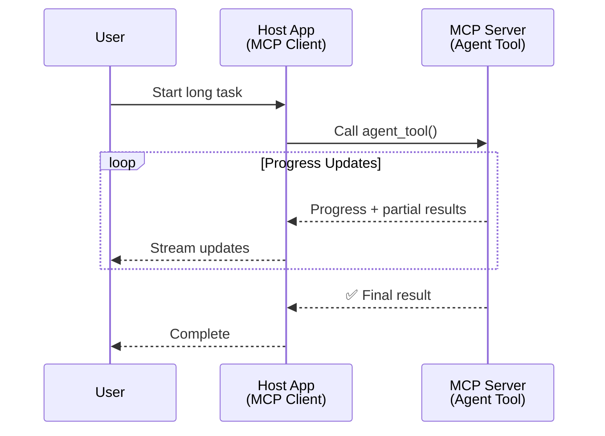
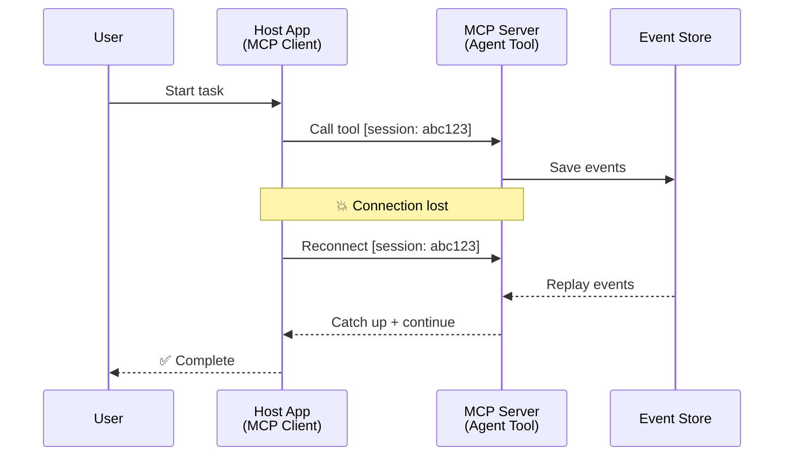
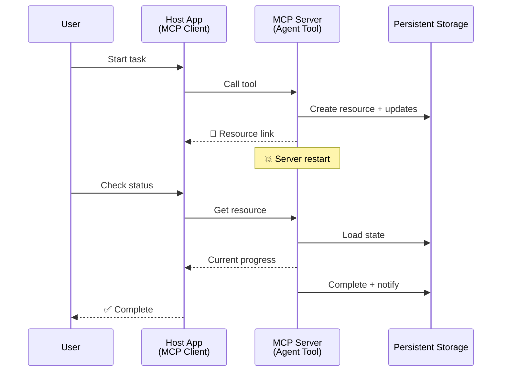
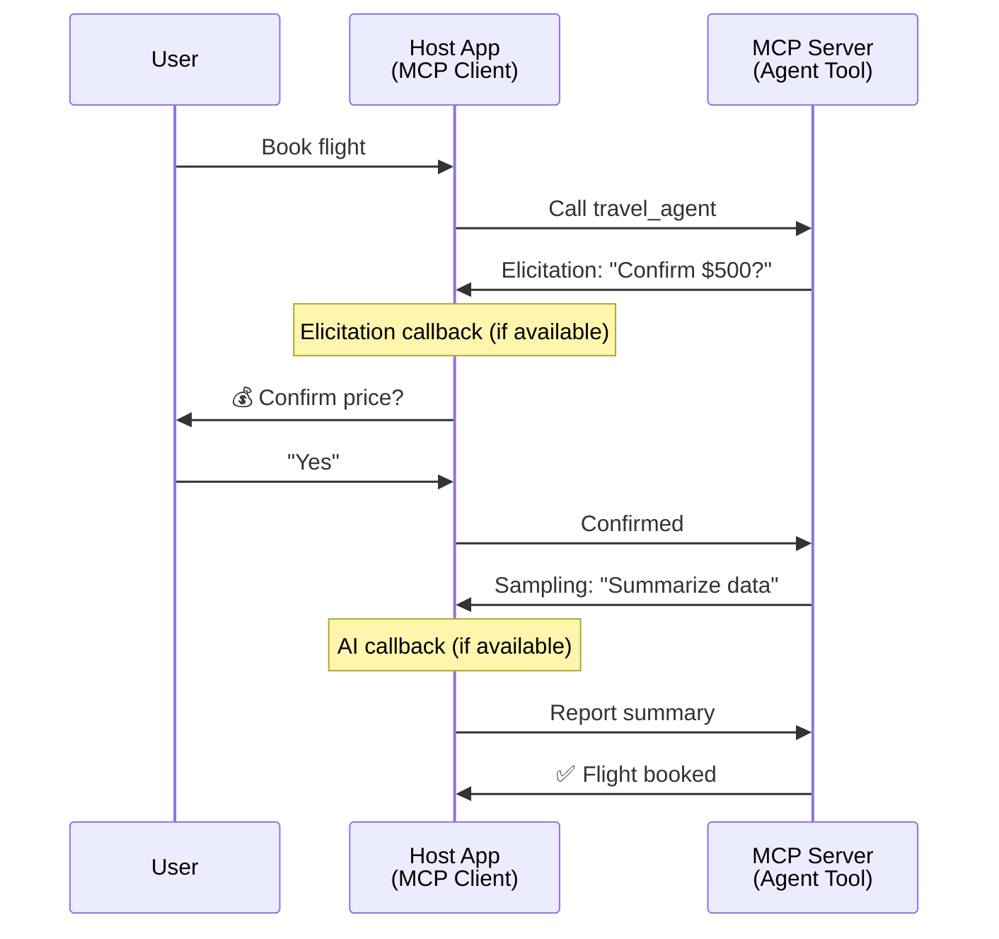
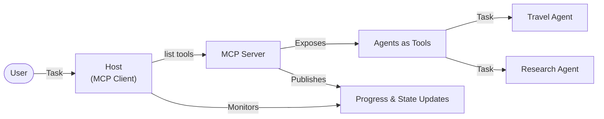

<!--
CO_OP_TRANSLATOR_METADATA:
{
  "original_hash": "5cc6836626047aa055e8960c8484a7d0",
  "translation_date": "2025-08-30T14:44:45+00:00",
  "source_file": "11-agentic-protocols/code_samples/mcp-agents/README.md",
  "language_code": "de"
}
-->
# Aufbau von Agent-zu-Agent-Kommunikationssystemen mit MCP

> TL;DR - Kann man Agent2Agent-Kommunikation mit MCP aufbauen? Ja!

MCP hat sich weit über sein ursprüngliches Ziel hinaus entwickelt, "Kontext für LLMs bereitzustellen". Mit den jüngsten Erweiterungen wie [wiederaufnehmbaren Streams](https://modelcontextprotocol.io/docs/concepts/transports#resumability-and-redelivery), [Elicitation](https://modelcontextprotocol.io/specification/2025-06-18/client/elicitation), [Sampling](https://modelcontextprotocol.io/specification/2025-06-18/client/sampling) und Benachrichtigungen ([Fortschritt](https://modelcontextprotocol.io/specification/2025-06-18/basic/utilities/progress) und [Ressourcen](https://modelcontextprotocol.io/specification/2025-06-18/schema#resourceupdatednotification)) bietet MCP nun eine robuste Grundlage für den Aufbau komplexer Agent-zu-Agent-Kommunikationssysteme.

## Das Missverständnis zwischen Agent und Tool

Da immer mehr Entwickler Tools mit agentischen Verhaltensweisen erkunden (lange Laufzeiten, möglicherweise zusätzliche Eingaben während der Ausführung erforderlich usw.), besteht ein häufiges Missverständnis darin, dass MCP ungeeignet sei, hauptsächlich weil frühe Beispiele für die Tools-Primitiven auf einfachen Anfrage-Antwort-Mustern basierten.

Diese Wahrnehmung ist veraltet. Die MCP-Spezifikation wurde in den letzten Monaten erheblich erweitert und bietet nun Funktionen, die die Lücke für den Aufbau von langlaufendem agentischen Verhalten schließen:

- **Streaming & Teilresultate**: Echtzeit-Updates während der Ausführung
- **Wiederaufnehmbarkeit**: Clients können sich nach einer Unterbrechung wieder verbinden und fortfahren
- **Dauerhaftigkeit**: Ergebnisse überleben Server-Neustarts (z. B. über Ressourcen-Links)
- **Multi-Turn**: Interaktive Eingaben während der Ausführung über Elicitation und Sampling

Diese Funktionen können kombiniert werden, um komplexe agentische und Multi-Agent-Anwendungen zu ermöglichen, die alle auf dem MCP-Protokoll bereitgestellt werden.

Zur Referenz bezeichnen wir einen Agenten als ein "Tool", das auf einem MCP-Server verfügbar ist. Dies impliziert die Existenz einer Host-Anwendung, die einen MCP-Client implementiert, der eine Sitzung mit dem MCP-Server aufbaut und den Agenten aufrufen kann.

## Was macht ein MCP-Tool "agentisch"?

Bevor wir in die Implementierung eintauchen, wollen wir klären, welche Infrastruktur-Fähigkeiten benötigt werden, um langlaufende Agenten zu unterstützen.

> Wir definieren einen Agenten als eine Entität, die autonom über längere Zeiträume arbeiten kann und in der Lage ist, komplexe Aufgaben zu bewältigen, die mehrere Interaktionen oder Anpassungen basierend auf Echtzeit-Feedback erfordern können.

### 1. Streaming & Teilresultate

Traditionelle Anfrage-Antwort-Muster funktionieren nicht für langlaufende Aufgaben. Agenten müssen bereitstellen:

- Echtzeit-Updates zum Fortschritt
- Zwischenresultate

**MCP-Unterstützung**: Ressourcenaktualisierungs-Benachrichtigungen ermöglichen das Streaming von Teilresultaten, erfordern jedoch ein sorgfältiges Design, um Konflikte mit dem 1:1-Anfrage/Antwort-Modell von JSON-RPC zu vermeiden.

| Funktion                  | Anwendungsfall                                                                                                                                                                       | MCP-Unterstützung                                                                          |
| ------------------------- | ----------------------------------------------------------------------------------------------------------------------------------------------------------------------------------- | ----------------------------------------------------------------------------------------- |
| Echtzeit-Fortschrittsupdates | Benutzer fordert eine Codebasis-Migration an. Der Agent streamt Fortschritte: "10% - Abhängigkeiten analysieren... 25% - TypeScript-Dateien konvertieren... 50% - Importe aktualisieren..." | ✅ Fortschrittsbenachrichtigungen                                                         |
| Teilresultate             | Aufgabe "Buch generieren" streamt Teilresultate, z. B. 1) Story-Arc-Gliederung, 2) Kapitelübersicht, 3) Jedes Kapitel nach Fertigstellung. Host kann inspizieren, abbrechen oder umleiten. | ✅ Benachrichtigungen können "erweitert" werden, um Teilresultate einzuschließen (siehe Vorschläge in PR 383, 776) |

<div align="center" style="font-style: italic; font-size: 0.95em; margin-bottom: 0.5em;">
<strong>Abbildung 1:</strong> Dieses Diagramm zeigt, wie ein MCP-Agent Echtzeit-Fortschrittsupdates und Teilresultate an die Host-Anwendung streamt, während eine langlaufende Aufgabe ausgeführt wird, sodass der Benutzer die Ausführung in Echtzeit überwachen kann.
</div>



### 2. Wiederaufnehmbarkeit

Agenten müssen Netzwerkunterbrechungen reibungslos handhaben:

- Wiederverbindung nach (Client-)Unterbrechung
- Fortsetzung von dort, wo sie aufgehört haben (Nachrichtenwiedergabe)

**MCP-Unterstützung**: Der MCP StreamableHTTP-Transport unterstützt heute Sitzungswiederaufnahme und Nachrichtenwiedergabe mit Sitzungs-IDs und letzten Ereignis-IDs. Wichtig ist hier, dass der Server einen EventStore implementieren muss, der Ereigniswiedergaben bei Client-Wiederverbindung ermöglicht.  
Beachten Sie, dass es einen Community-Vorschlag (PR #975) gibt, der transportunabhängige wiederaufnehmbare Streams untersucht.

| Funktion         | Anwendungsfall                                                                                                                                                   | MCP-Unterstützung                                                        |
| ---------------- | ---------------------------------------------------------------------------------------------------------------------------------------------------------------- | ------------------------------------------------------------------------ |
| Wiederaufnehmbarkeit | Client wird während einer langlaufenden Aufgabe getrennt. Nach der Wiederverbindung wird die Sitzung mit wiedergegebenen Ereignissen nahtlos fortgesetzt. | ✅ StreamableHTTP-Transport mit Sitzungs-IDs, Ereigniswiedergabe und EventStore |

<div align="center" style="font-style: italic; font-size: 0.95em; margin-bottom: 0.5em;">
<strong>Abbildung 2:</strong> Dieses Diagramm zeigt, wie MCPs StreamableHTTP-Transport und EventStore eine nahtlose Sitzungswiederaufnahme ermöglichen: Wenn der Client getrennt wird, kann er sich wieder verbinden und verpasste Ereignisse wiedergeben, um die Aufgabe ohne Fortschrittsverlust fortzusetzen.
</div>



### 3. Dauerhaftigkeit

Langlaufende Agenten benötigen einen persistenten Zustand:

- Ergebnisse überleben Server-Neustarts
- Status kann außerhalb der Sitzung abgerufen werden
- Fortschrittsverfolgung über Sitzungen hinweg

**MCP-Unterstützung**: MCP unterstützt jetzt einen Ressourcentyp-Link als Rückgabewert für Tool-Aufrufe. Ein mögliches Muster besteht darin, ein Tool zu entwerfen, das eine Ressource erstellt und sofort einen Ressourcen-Link zurückgibt. Das Tool kann die Aufgabe im Hintergrund weiter bearbeiten und die Ressource aktualisieren. Der Client kann den Status dieser Ressource abfragen, um Teil- oder Gesamtergebnisse zu erhalten (basierend auf den Ressourcenaktualisierungen, die der Server bereitstellt), oder sich für Updates der Ressource anmelden.

Eine Einschränkung hierbei ist, dass das Abfragen von Ressourcen oder das Abonnieren von Updates Ressourcen verbrauchen kann, was Auswirkungen auf die Skalierbarkeit hat. Es gibt einen offenen Community-Vorschlag (einschließlich #992), der die Möglichkeit untersucht, Webhooks oder Trigger einzuschließen, die der Server aufrufen kann, um den Client/Host-Anwendung über Updates zu benachrichtigen.

| Funktion       | Anwendungsfall                                                                                                                                        | MCP-Unterstützung                                                        |
| -------------- | ----------------------------------------------------------------------------------------------------------------------------------------------------- | ------------------------------------------------------------------------ |
| Dauerhaftigkeit | Server stürzt während einer Datenmigration ab. Ergebnisse und Fortschritt überleben den Neustart, der Client kann den Status überprüfen und von der persistenten Ressource fortfahren. | ✅ Ressourcen-Links mit persistentem Speicher und Statusbenachrichtigungen |

Heute ist ein gängiges Muster, ein Tool zu entwerfen, das eine Ressource erstellt und sofort einen Ressourcen-Link zurückgibt. Das Tool kann im Hintergrund die Aufgabe bearbeiten, Ressourcenbenachrichtigungen ausgeben, die als Fortschrittsupdates oder Teilresultate dienen, und den Inhalt der Ressource bei Bedarf aktualisieren.

<div align="center" style="font-style: italic; font-size: 0.95em; margin-bottom: 0.5em;">
<strong>Abbildung 3:</strong> Dieses Diagramm zeigt, wie MCP-Agenten persistente Ressourcen und Statusbenachrichtigungen nutzen, um sicherzustellen, dass langlaufende Aufgaben Server-Neustarts überleben, sodass Clients Fortschritte überprüfen und Ergebnisse auch nach Fehlern abrufen können.
</div>



### 4. Multi-Turn-Interaktionen

Agenten benötigen oft zusätzliche Eingaben während der Ausführung:

- Menschliche Klärung oder Genehmigung
- KI-Unterstützung für komplexe Entscheidungen
- Dynamische Parameteranpassung

**MCP-Unterstützung**: Vollständig unterstützt durch Sampling (für KI-Eingaben) und Elicitation (für menschliche Eingaben).

| Funktion                 | Anwendungsfall                                                                                                                                     | MCP-Unterstützung                                           |
| ------------------------ | -------------------------------------------------------------------------------------------------------------------------------------------------- | ----------------------------------------------------------- |
| Multi-Turn-Interaktionen | Reisebuchungs-Agent fordert Preisbestätigung vom Benutzer an, bittet dann die KI, Reisedaten zusammenzufassen, bevor die Buchung abgeschlossen wird. | ✅ Elicitation für menschliche Eingaben, Sampling für KI-Eingaben |

<div align="center" style="font-style: italic; font-size: 0.95em; margin-bottom: 0.5em;">
<strong>Abbildung 4:</strong> Dieses Diagramm zeigt, wie MCP-Agenten interaktiv menschliche Eingaben anfordern oder während der Ausführung KI-Unterstützung anfordern können, um komplexe, mehrstufige Workflows wie Bestätigungen und dynamische Entscheidungsfindung zu unterstützen.
</div>



## Implementierung von langlaufenden Agenten auf MCP - Codeübersicht

Im Rahmen dieses Artikels stellen wir ein [Code-Repository](https://github.com/victordibia/ai-tutorials/tree/main/MCP%20Agents) bereit, das eine vollständige Implementierung von langlaufenden Agenten mit dem MCP Python SDK und StreamableHTTP-Transport für Sitzungswiederaufnahme und Nachrichtenwiedergabe enthält. Die Implementierung zeigt, wie MCP-Funktionen kombiniert werden können, um anspruchsvolle agentenähnliche Verhaltensweisen zu ermöglichen.

Insbesondere implementieren wir einen Server mit zwei primären Agenten-Tools:

- **Reiseagent** - Simuliert einen Reisebuchungsdienst mit Preisbestätigung über Elicitation
- **Forschungsagent** - Führt Forschungstätigkeiten mit KI-unterstützten Zusammenfassungen über Sampling durch

Beide Agenten demonstrieren Echtzeit-Fortschrittsupdates, interaktive Bestätigungen und vollständige Sitzungswiederaufnahme-Funktionen.

### Wichtige Implementierungskonzepte

Die folgenden Abschnitte zeigen die serverseitige Agentenimplementierung und die clientseitige Host-Verarbeitung für jede Funktion:

#### Streaming & Fortschrittsupdates - Echtzeit-Task-Status

Streaming ermöglicht es Agenten, während langlaufender Aufgaben Echtzeit-Fortschrittsupdates bereitzustellen, um Benutzer über den Status der Aufgabe und Zwischenresultate zu informieren.

**Server-Implementierung (Agent sendet Fortschrittsbenachrichtigungen):**

```python
# From server/server.py - Travel agent sending progress updates
for i, step in enumerate(steps):
    await ctx.session.send_progress_notification(
        progress_token=ctx.request_id,
        progress=i * 25,
        total=100,
        message=step,
        related_request_id=str(ctx.request_id)
    )
    await anyio.sleep(2)  # Simulate work

# Alternative: Log messages for detailed step-by-step updates
await ctx.session.send_log_message(
    level="info",
    data=f"Processing step {current_step}/{steps} ({progress_percent}%)",
    logger="long_running_agent",
    related_request_id=ctx.request_id,
)
```

**Client-Implementierung (Host empfängt Fortschrittsupdates):**

```python
# From client/client.py - Client handling real-time notifications
async def message_handler(message) -> None:
    if isinstance(message, types.ServerNotification):
        if isinstance(message.root, types.LoggingMessageNotification):
            console.print(f"📡 [dim]{message.root.params.data}[/dim]")
        elif isinstance(message.root, types.ProgressNotification):
            progress = message.root.params
            console.print(f"🔄 [yellow]{progress.message} ({progress.progress}/{progress.total})[/yellow]")

# Register message handler when creating session
async with ClientSession(
    read_stream, write_stream,
    message_handler=message_handler
) as session:
```

#### Elicitation - Anfordern von Benutzereingaben

Elicitation ermöglicht es Agenten, während der Ausführung Benutzereingaben anzufordern. Dies ist essenziell für Bestätigungen, Klärungen oder Genehmigungen während langlaufender Aufgaben.

**Server-Implementierung (Agent fordert Bestätigung an):**

```python
# From server/server.py - Travel agent requesting price confirmation
elicit_result = await ctx.session.elicit(
    message=f"Please confirm the estimated price of $1200 for your trip to {destination}",
    requestedSchema=PriceConfirmationSchema.model_json_schema(),
    related_request_id=ctx.request_id,
)

if elicit_result and elicit_result.action == "accept":
    # Continue with booking
    logger.info(f"User confirmed price: {elicit_result.content}")
elif elicit_result and elicit_result.action == "decline":
    # Cancel the booking
    booking_cancelled = True
```

**Client-Implementierung (Host stellt Elicitation-Callback bereit):**

```python
# From client/client.py - Client handling elicitation requests
async def elicitation_callback(context, params):
    console.print(f"💬 Server is asking for confirmation:")
    console.print(f"   {params.message}")

    response = console.input("Do you accept? (y/n): ").strip().lower()

    if response in ['y', 'yes']:
        return types.ElicitResult(
            action="accept",
            content={"confirm": True, "notes": "Confirmed by user"}
        )
    else:
        return types.ElicitResult(
            action="decline",
            content={"confirm": False, "notes": "Declined by user"}
        )

# Register the callback when creating the session
async with ClientSession(
    read_stream, write_stream,
    elicitation_callback=elicitation_callback
) as session:
```

#### Sampling - Anfordern von KI-Unterstützung

Sampling ermöglicht es Agenten, während der Ausführung LLM-Unterstützung für komplexe Entscheidungen oder Inhaltserstellung anzufordern. Dies ermöglicht hybride Mensch-KI-Workflows.

**Server-Implementierung (Agent fordert KI-Unterstützung an):**

```python
# From server/server.py - Research agent requesting AI summary
sampling_result = await ctx.session.create_message(
    messages=[
        SamplingMessage(
            role="user",
            content=TextContent(type="text", text=f"Please summarize the key findings for research on: {topic}")
        )
    ],
    max_tokens=100,
    related_request_id=ctx.request_id,
)

if sampling_result and sampling_result.content:
    if sampling_result.content.type == "text":
        sampling_summary = sampling_result.content.text
        logger.info(f"Received sampling summary: {sampling_summary}")
```

**Client-Implementierung (Host stellt Sampling-Callback bereit):**

```python
# From client/client.py - Client handling sampling requests
async def sampling_callback(context, params):
    message_text = params.messages[0].content.text if params.messages else 'No message'
    console.print(f"🧠 Server requested sampling: {message_text}")

    # In a real application, this could call an LLM API
    # For demo purposes, we provide a mock response
    mock_response = "Based on current research, MCP has evolved significantly..."

    return types.CreateMessageResult(
        role="assistant",
        content=types.TextContent(type="text", text=mock_response),
        model="interactive-client",
        stopReason="endTurn"
    )

# Register the callback when creating the session
async with ClientSession(
    read_stream, write_stream,
    sampling_callback=sampling_callback,
    elicitation_callback=elicitation_callback
) as session:
```

#### Wiederaufnehmbarkeit - Sitzungsfortsetzung bei Unterbrechungen

Wiederaufnehmbarkeit stellt sicher, dass langlaufende Agentenaufgaben Client-Unterbrechungen überleben und nahtlos bei Wiederverbindung fortgesetzt werden können. Dies wird durch Event Stores und Wiederaufnahmetokens implementiert.

**Event Store-Implementierung (Server speichert Sitzungsstatus):**

```python
# From server/event_store.py - Simple in-memory event store
class SimpleEventStore(EventStore):
    def __init__(self):
        self._events: list[tuple[StreamId, EventId, JSONRPCMessage]] = []
        self._event_id_counter = 0

    async def store_event(self, stream_id: StreamId, message: JSONRPCMessage) -> EventId:
        """Store an event and return its ID."""
        self._event_id_counter += 1
        event_id = str(self._event_id_counter)
        self._events.append((stream_id, event_id, message))
        return event_id

    async def replay_events_after(self, last_event_id: EventId, send_callback: EventCallback) -> StreamId | None:
        """Replay events after the specified ID for resumption."""
        # Find events after the last known event and replay them
        for _, event_id, message in self._events[start_index:]:
            await send_callback(EventMessage(message, event_id))

# From server/server.py - Passing event store to session manager
def create_server_app(event_store: Optional[EventStore] = None) -> Starlette:
    server = ResumableServer()

    # Create session manager with event store for resumption
    session_manager = StreamableHTTPSessionManager(
        app=server,
        event_store=event_store,  # Event store enables session resumption
        json_response=False,
        security_settings=security_settings,
    )

    return Starlette(routes=[Mount("/mcp", app=session_manager.handle_request)])

# Usage: Initialize with event store
event_store = SimpleEventStore()
app = create_server_app(event_store)
```

**Client-Metadaten mit Wiederaufnahmetoken (Client verbindet sich mit gespeichertem Status wieder):**

```python
# From client/client.py - Client resumption with metadata
if existing_tokens and existing_tokens.get("resumption_token"):
    # Use existing resumption token to continue where we left off
    metadata = ClientMessageMetadata(
        resumption_token=existing_tokens["resumption_token"],
    )
else:
    # Create callback to save resumption token when received
    def enhanced_callback(token: str):
        protocol_version = getattr(session, 'protocol_version', None)
        token_manager.save_tokens(session_id, token, protocol_version, command, args)

    metadata = ClientMessageMetadata(
        on_resumption_token_update=enhanced_callback,
    )

# Send request with resumption metadata
result = await session.send_request(
    types.ClientRequest(
        types.CallToolRequest(
            method="tools/call",
            params=types.CallToolRequestParams(name=command, arguments=args)
        )
    ),
    types.CallToolResult,
    metadata=metadata,
)
```

Die Host-Anwendung speichert Sitzungs-IDs und Wiederaufnahmetokens lokal, sodass sie sich mit bestehenden Sitzungen verbinden kann, ohne Fortschritt oder Status zu verlieren.

### Code-Organisation

<div align="center" style="font-style: italic; font-size: 0.95em; margin-bottom: 0.5em;">
<strong>Abbildung 5:</strong> Architektur eines MCP-basierten Agentensystems
</div>



**Wichtige Dateien:**

- **`server/server.py`** - Wiederaufnehmbarer MCP-Server mit Reise- und Forschungsagenten, die Elicitation, Sampling und Fortschrittsupdates demonstrieren
- **`client/client.py`** - Interaktive Host-Anwendung mit Wiederaufnahmeunterstützung, Callback-Handlern und Token-Management
- **`server/event_store.py`** - Event Store-Implementierung, die Sitzungswiederaufnahme und Nachrichtenwiedergabe ermöglicht

## Erweiterung auf Multi-Agent-Kommunikation mit MCP

Die obige Implementierung kann auf Multi-Agent-Systeme erweitert werden, indem die Intelligenz und der Umfang der Host-Anwendung verbessert werden:

- **Intelligente Aufgabenzerlegung**: Host analysiert komplexe Benutzeranfragen und zerlegt sie in Teilaufgaben für verschiedene spezialisierte Agenten
- **Multi-Server-Koordination**: Host hält Verbindungen zu mehreren MCP-Servern aufrecht, die jeweils unterschiedliche Agentenfähigkeiten bereitstellen
- **Aufgabenstatusverwaltung**: Host verfolgt Fortschritte über mehrere gleichzeitige Agentenaufgaben hinweg, handhabt Abhängigkeiten und Sequenzierung
- **Resilienz & Wiederholungen**: Host verwaltet Fehler, implementiert Wiederholungslogik und leitet Aufgaben um, wenn Agenten nicht verfügbar sind
- **Ergebnissynthese**: Host kombiniert Ausgaben mehrerer Agenten zu kohärenten Endergebnissen

Der Host entwickelt sich von einem einfachen Client zu einem intelligenten Orchestrator, der verteilte Agentenfähigkeiten koordiniert und dabei die gleiche MCP-Protokollbasis beibehält.

## Fazit

Die erweiterten Fähigkeiten von MCP - Ressourcenbenachrichtigungen, Elicitation/Sampling, wiederaufnehmbare Streams und persistente Ressourcen - ermöglichen komplexe Agent-zu-Agent-Interaktionen bei gleichzeitiger Beibehaltung der Protokolleinfachheit.

## Erste Schritte

Bereit, Ihr eigenes Agent2Agent-System zu bauen? Folgen Sie diesen Schritten:

### 1. Demo ausführen

```bash
# Start the server with event store for resumption
python -m server.server --port 8006

# In another terminal, run the interactive client
python -m client.client --url http://127.0.0.1:8006/mcp
```

**Verfügbare Befehle im interaktiven Modus:**

- `travel_agent` - Reise buchen mit Preisbestätigung über Elicitation
- `research_agent` - Themen recherchieren mit KI-unterstützten Zusammenfassungen über Sampling
- `list` - Alle verfügbaren Tools anzeigen
- `clean-tokens` - Wiederaufnahmetokens löschen
- `help` - Detaillierte Befehlsanleitung anzeigen
- `quit` - Client beenden

### 2. Wiederaufnahmefähigkeiten testen

- Starten Sie einen langlaufenden Agenten (z. B. `travel_agent`)
- Unterbrechen Sie den Client während der Ausführung (Strg+C)
- Starten Sie den Client neu - er wird automatisch dort fortfahren, wo er aufgehört hat

### 3. Erkunden und Erweitern

- **Beispiele erkunden**: Schauen Sie sich dieses [mcp-agents](https://github.com/victordibia/ai-tutorials/tree/main/MCP%20Agents) an
- **Community beitreten**: Nehmen Sie an MCP-Diskussionen auf GitHub teil
- **Experimentieren**: Beginnen Sie mit einer einfachen langlaufenden Aufgabe und fügen Sie nach und nach Streaming, Wiederaufnehmbarkeit und Multi-Agent-Koordination hinzu

Dies zeigt, wie MCP intelligente Agentenverhalten ermöglicht und gleichzeitig die Einfachheit von Tools beibehält.

Insgesamt entwickelt sich die MCP-Protokollspezifikation schnell weiter; es wird empfohlen, die offizielle Dokumentationswebsite für die neuesten Updates zu überprüfen - https://modelcontextprotocol.io/introduction

---

**Haftungsausschluss**:  
Dieses Dokument wurde mithilfe des KI-Übersetzungsdienstes [Co-op Translator](https://github.com/Azure/co-op-translator) übersetzt. Obwohl wir uns um Genauigkeit bemühen, weisen wir darauf hin, dass automatisierte Übersetzungen Fehler oder Ungenauigkeiten enthalten können. Das Originaldokument in seiner ursprünglichen Sprache sollte als maßgebliche Quelle betrachtet werden. Für kritische Informationen wird eine professionelle menschliche Übersetzung empfohlen. Wir übernehmen keine Haftung für Missverständnisse oder Fehlinterpretationen, die sich aus der Nutzung dieser Übersetzung ergeben.