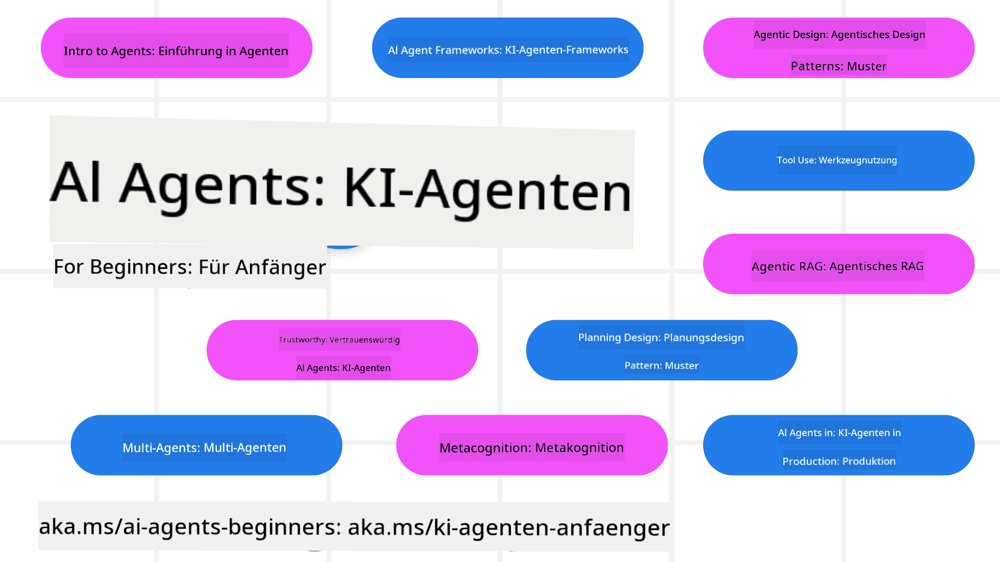

<!--
CO_OP_TRANSLATOR_METADATA:
{
  "original_hash": "6b07046397366e6f6f4524c9ddeba1e1",
  "translation_date": "2025-07-12T14:40:38+00:00",
  "source_file": "README.md",
  "language_code": "de"
}
-->
# AI Agents für Einsteiger – Ein Kurs

## 11 Lektionen, die alles vermitteln, was du wissen musst, um mit dem Erstellen von AI Agents zu beginnen

  
  
  
  

### 🌐 Mehrsprachige Unterstützung

#### Unterstützt durch GitHub Action (Automatisiert & immer aktuell)

[Französisch](../fr/README.md) | [Spanisch](../es/README.md) | [Deutsch](./README.md) | [Russisch](../ru/README.md) | [Arabisch](../ar/README.md) | [Persisch (Farsi)](../fa/README.md) | [Urdu](../ur/README.md) | [Chinesisch (vereinfacht)](../zh/README.md) | [Chinesisch (traditionell, Macau)](../mo/README.md) | [Chinesisch (traditionell, Hongkong)](../hk/README.md) | [Chinesisch (traditionell, Taiwan)](../tw/README.md) | [Japanisch](../ja/README.md) | [Koreanisch](../ko/README.md) | [Hindi](../hi/README.md) | [Bengalisch](../bn/README.md) | [Marathi](../mr/README.md) | [Nepalesisch](../ne/README.md) | [Punjabi (Gurmukhi)](../pa/README.md) | [Portugiesisch (Portugal)](../pt/README.md) | [Portugiesisch (Brasilien)](../br/README.md) | [Italienisch](../it/README.md) | [Polnisch](../pl/README.md) | [Türkisch](../tr/README.md) | [Griechisch](../el/README.md) | [Thailändisch](../th/README.md) | [Schwedisch](../sv/README.md) | [Dänisch](../da/README.md) | [Norwegisch](../no/README.md) | [Finnisch](../fi/README.md) | [Niederländisch](../nl/README.md) | [Hebräisch](../he/README.md) | [Vietnamesisch](../vi/README.md) | [Indonesisch](../id/README.md) | [Malaiisch](../ms/README.md) | [Tagalog (Filipino)](../tl/README.md) | [Swahili](../sw/README.md) | [Ungarisch](../hu/README.md) | [Tschechisch](../cs/README.md) | [Slowakisch](../sk/README.md) | [Rumänisch](../ro/README.md) | [Bulgarisch](../bg/README.md) | [Serbisch (Kyrillisch)](../sr/README.md) | [Kroatisch](../hr/README.md) | [Slowenisch](../sl/README.md) | [Ukrainisch](../uk/README.md) | [Birmanisch (Myanmar)](../my/README.md)

**Wenn du weitere Übersetzungen wünschst, findest du unterstützte Sprachen [hier](https://github.com/Azure/co-op-translator/blob/main/getting_started/supported-languages.md)**

  
  

## 🌱 Erste Schritte

Dieser Kurs umfasst 11 Lektionen, die die Grundlagen zum Erstellen von AI Agents vermitteln. Jede Lektion behandelt ein eigenes Thema, du kannst also dort starten, wo du möchtest!

Der Kurs bietet mehrsprachige Unterstützung. Siehe unsere [verfügbaren Sprachen hier](../..).

Wenn du zum ersten Mal mit Generative AI Modellen arbeitest, schau dir unseren Kurs [Generative AI For Beginners](https://aka.ms/genai-beginners) an, der 21 Lektionen zum Aufbau mit GenAI enthält.

Vergiss nicht, dieses Repo zu [starren (🌟)](https://docs.github.com/en/get-started/exploring-projects-on-github/saving-repositories-with-stars?WT.mc_id=academic-105485-koreyst) und es zu [forken](https://github.com/microsoft/ai-agents-for-beginners/fork), um den Code auszuführen.

### Was du brauchst

Jede Lektion in diesem Kurs enthält Codebeispiele, die im Ordner code_samples zu finden sind. Du kannst dieses Repo [forken](https://github.com/microsoft/ai-agents-for-beginners/fork), um deine eigene Kopie zu erstellen.

Die Codebeispiele in diesen Übungen nutzen Azure AI Foundry und GitHub Model Catalogs zur Interaktion mit Sprachmodellen:

- [Github Models](https://aka.ms/ai-agents-beginners/github-models) – Kostenlos / Eingeschränkt  
- [Azure AI Foundry](https://aka.ms/ai-agents-beginners/ai-foundry) – Azure-Konto erforderlich

Dieser Kurs verwendet außerdem folgende AI Agent Frameworks und Dienste von Microsoft:

- [Azure AI Agent Service](https://aka.ms/ai-agents-beginners/ai-agent-service)  
- [Semantic Kernel](https://aka.ms/ai-agents-beginners/semantic-kernel)  
- [AutoGen](https://aka.ms/ai-agents/autogen)

Weitere Informationen zum Ausführen des Codes für diesen Kurs findest du unter [Course Setup](./00-course-setup/README.md).

## 🙏 Möchtest du helfen?

Hast du Vorschläge oder Fehler in Rechtschreibung oder Code gefunden? [Erstelle ein Issue](https://github.com/microsoft/ai-agents-for-beginners/issues?WT.mc_id=academic-105485-koreyst) oder [sende einen Pull Request](https://github.com/microsoft/ai-agents-for-beginners/pulls?WT.mc_id=academic-105485-koreyst).

Wenn du feststeckst oder Fragen zum Erstellen von AI Agents hast, tritt unserem [Azure AI Foundry Community Discord](https://discord.gg/kzRShWzttr) bei.

Wenn du Produktfeedback oder Fehler beim Erstellen hast, besuche unser [Azure AI Foundry Developer Forum](https://aka.ms/azureaifoundry/forum).

## 📂 Jede Lektion enthält

- Eine schriftliche Lektion im README und ein kurzes Video  
- Python-Codebeispiele zur Unterstützung von Azure AI Foundry und Github Models (kostenlos)  
- Links zu zusätzlichen Ressourcen, um dein Lernen fortzusetzen  

## 🗃️ Lektionen

| **Lektion**                              | **Text & Code**                                    | **Video**                                                  | **Zusätzliches Lernen**                                                               |
|-----------------------------------------|----------------------------------------------------|------------------------------------------------------------|----------------------------------------------------------------------------------------|
| Einführung in AI Agents und Anwendungsfälle | [Link](./01-intro-to-ai-agents/README.md)          | [Video](https://youtu.be/3zgm60bXmQk?si=z8QygFvYQv-9WtO1)  | [Link](https://aka.ms/ai-agents-beginners/collection?WT.mc_id=academic-105485-koreyst) |
| Erforschung von AI Agentic Frameworks   | [Link](./02-explore-agentic-frameworks/README.md)  | [Video](https://youtu.be/ODwF-EZo_O8?si=Vawth4hzVaHv-u0H)  | [Link](https://aka.ms/ai-agents-beginners/collection?WT.mc_id=academic-105485-koreyst) |
| Verständnis von AI Agentic Design Patterns | [Link](./03-agentic-design-patterns/README.md)     | [Video](https://youtu.be/m9lM8qqoOEA?si=BIzHwzstTPL8o9GF)  | [Link](https://aka.ms/ai-agents-beginners/collection?WT.mc_id=academic-105485-koreyst) |
| Tool Use Design Pattern                  | [Link](./04-tool-use/README.md)                    | [Video](https://youtu.be/vieRiPRx-gI?si=2z6O2Xu2cu_Jz46N)  | [Link](https://aka.ms/ai-agents-beginners/collection?WT.mc_id=academic-105485-koreyst) |
| Agentic RAG                             | [Link](./05-agentic-rag/README.md)                 | [Video](https://youtu.be/WcjAARvdL7I?si=gKPWsQpKiIlDH9A3)  | [Link](https://aka.ms/ai-agents-beginners/collection?WT.mc_id=academic-105485-koreyst) |
| Vertrauenswürdige AI Agents bauen       | [Link](./06-building-trustworthy-agents/README.md) | [Video](https://youtu.be/iZKkMEGBCUQ?si=jZjpiMnGFOE9L8OK ) | [Link](https://aka.ms/ai-agents-beginners/collection?WT.mc_id=academic-105485-koreyst) |
| Planning Design Pattern                  | [Link](./07-planning-design/README.md)             | [Video](https://youtu.be/kPfJ2BrBCMY?si=6SC_iv_E5-mzucnC)  | [Link](https://aka.ms/ai-agents-beginners/collection?WT.mc_id=academic-105485-koreyst) |
| Multi-Agent Design Pattern               | [Link](./08-multi-agent/README.md)                 | [Video](https://youtu.be/V6HpE9hZEx0?si=rMgDhEu7wXo2uo6g)  | [Link](https://aka.ms/ai-agents-beginners/collection?WT.mc_id=academic-105485-koreyst) |
| Metakognition Design Pattern             | [Link](./09-metacognition/README.md)               | [Video](https://youtu.be/His9R6gw6Ec?si=8gck6vvdSNCt6OcF)  | [Link](https://aka.ms/ai-agents-beginners/collection?WT.mc_id=academic-105485-koreyst) |
| AI Agents in Produktion                  | [Link](./10-ai-agents-production/README.md)        | [Video](https://youtu.be/l4TP6IyJxmQ?si=31dnhexRo6yLRJDl)  | [Link](https://aka.ms/ai-agents-beginners/collection?WT.mc_id=academic-105485-koreyst) |
| AI Agents mit MCP                       | [Link](./11-mcp/README.md)                         |                                                            | [Link](https://aka.ms/mcp-for-beginners)                                               |

## 🎒 Weitere Kurse

Unser Team bietet weitere Kurse an! Schau mal rein:
- [**NEU** Model Context Protocol (MCP) für Einsteiger](https://github.com/microsoft/mcp-for-beginners?WT.mc_id=academic-105485-koreyst)
- [Generative KI für Einsteiger mit .NET](https://github.com/microsoft/Generative-AI-for-beginners-dotnet?WT.mc_id=academic-105485-koreyst)
- [Generative KI für Einsteiger](https://github.com/microsoft/generative-ai-for-beginners?WT.mc_id=academic-105485-koreyst)
- [ML für Einsteiger](https://aka.ms/ml-beginners?WT.mc_id=academic-105485-koreyst)
- [Data Science für Einsteiger](https://aka.ms/datascience-beginners?WT.mc_id=academic-105485-koreyst)
- [KI für Einsteiger](https://aka.ms/ai-beginners?WT.mc_id=academic-105485-koreyst)
- [Cybersecurity für Einsteiger](https://github.com/microsoft/Security-101??WT.mc_id=academic-96948-sayoung)
- [Webentwicklung für Einsteiger](https://aka.ms/webdev-beginners?WT.mc_id=academic-105485-koreyst)
- [IoT für Einsteiger](https://aka.ms/iot-beginners?WT.mc_id=academic-105485-koreyst)
- [XR-Entwicklung für Einsteiger](https://github.com/microsoft/xr-development-for-beginners?WT.mc_id=academic-105485-koreyst)
- [GitHub Copilot für AI-Paired Programming meistern](https://aka.ms/GitHubCopilotAI?WT.mc_id=academic-105485-koreyst)
- [GitHub Copilot für C#/.NET-Entwickler meistern](https://github.com/microsoft/mastering-github-copilot-for-dotnet-csharp-developers?WT.mc_id=academic-105485-koreyst)
- [Wähle dein eigenes Copilot-Abenteuer](https://github.com/microsoft/CopilotAdventures?WT.mc_id=academic-105485-koreyst)

## 🌟 Dank an die Community

Danke an [Shivam Goyal](https://www.linkedin.com/in/shivam2003/) für die Bereitstellung wichtiger Codebeispiele, die Agentic RAG demonstrieren.

## Mitwirken

Dieses Projekt freut sich über Beiträge und Vorschläge. Die meisten Beiträge erfordern, dass du einer
Contributor License Agreement (CLA) zustimmst, in der du bestätigst, dass du das Recht hast und tatsächlich
uns die Rechte zur Nutzung deines Beitrags gewährst. Details findest du unter
<https://cla.opensource.microsoft.com>.

Wenn du eine Pull-Anfrage einreichst, prüft ein CLA-Bot automatisch, ob du eine CLA vorlegen musst,
und versieht die PR entsprechend (z. B. Statusprüfung, Kommentar). Folge einfach den Anweisungen
des Bots. Dies musst du nur einmal für alle Repositories mit unserer CLA tun.

Dieses Projekt hat den [Microsoft Open Source Code of Conduct](https://opensource.microsoft.com/codeofconduct/) übernommen.
Weitere Informationen findest du in den [Code of Conduct FAQ](https://opensource.microsoft.com/codeofconduct/faq/) oder
kontaktiere [opencode@microsoft.com](mailto:opencode@microsoft.com) bei weiteren Fragen oder Anmerkungen.

## Marken

Dieses Projekt kann Marken oder Logos von Projekten, Produkten oder Dienstleistungen enthalten. Die autorisierte Nutzung von Microsoft-
Marken oder Logos unterliegt den [Microsoft Trademark & Brand Guidelines](https://www.microsoft.com/legal/intellectualproperty/trademarks/usage/general).
Die Verwendung von Microsoft-Marken oder Logos in modifizierten Versionen dieses Projekts darf nicht zu Verwechslungen führen oder eine Microsoft-Unterstützung suggerieren.
Die Nutzung von Marken oder Logos Dritter unterliegt den jeweiligen Richtlinien dieser Dritten.

**Haftungsausschluss**:  
Dieses Dokument wurde mit dem KI-Übersetzungsdienst [Co-op Translator](https://github.com/Azure/co-op-translator) übersetzt. Obwohl wir uns um Genauigkeit bemühen, beachten Sie bitte, dass automatisierte Übersetzungen Fehler oder Ungenauigkeiten enthalten können. Das Originaldokument in seiner Ursprungssprache ist als maßgebliche Quelle zu betrachten. Für wichtige Informationen wird eine professionelle menschliche Übersetzung empfohlen. Wir übernehmen keine Haftung für Missverständnisse oder Fehlinterpretationen, die aus der Nutzung dieser Übersetzung entstehen.