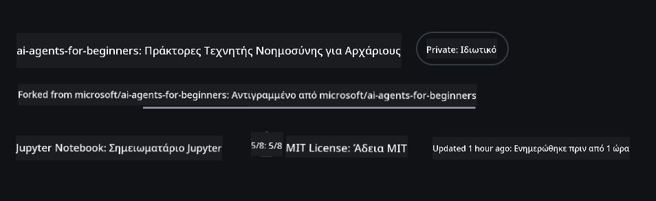
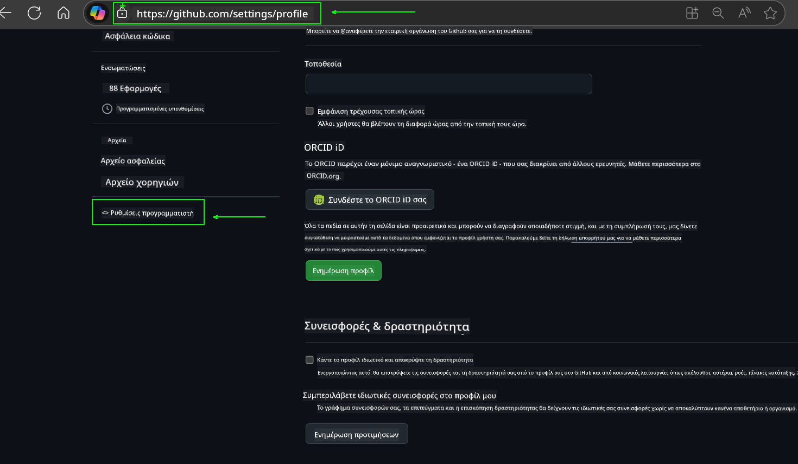
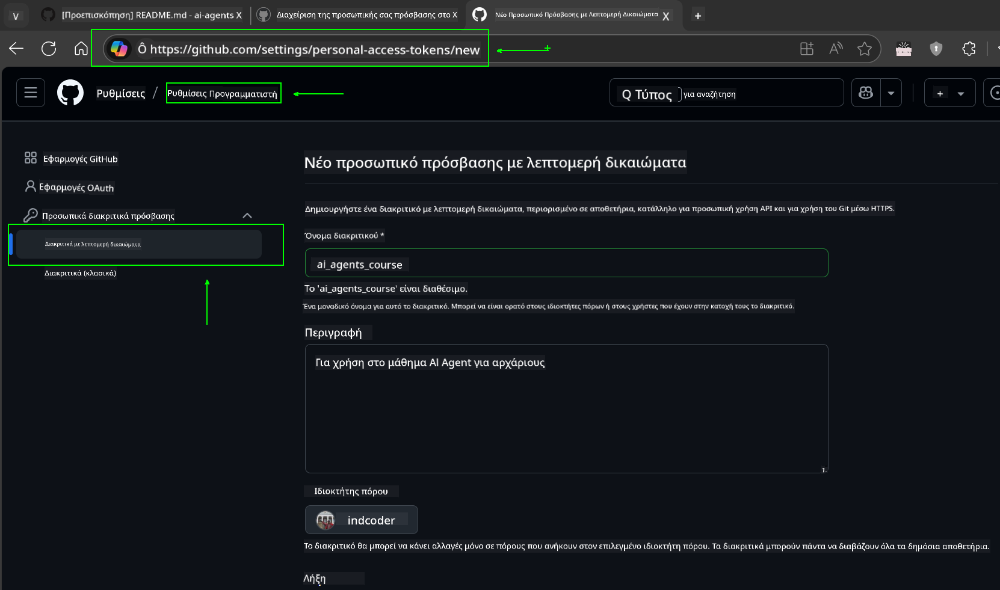
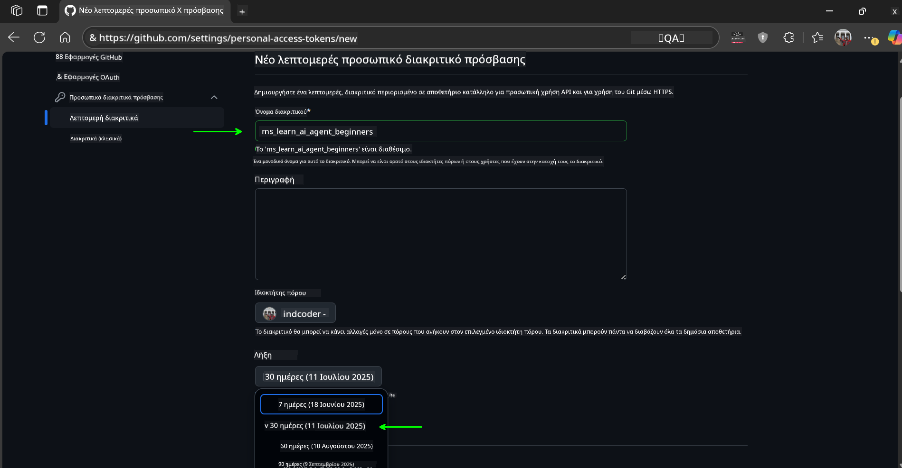
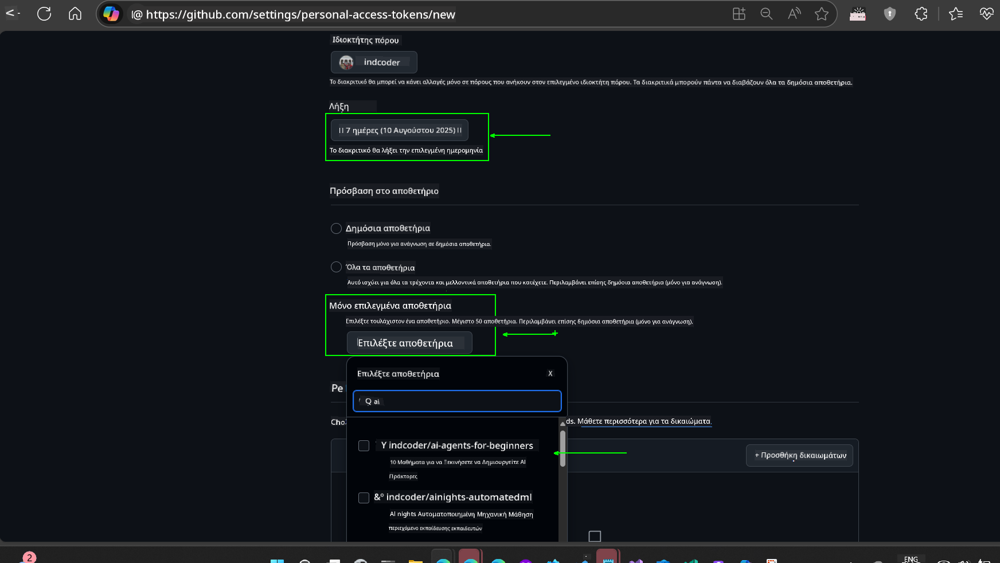
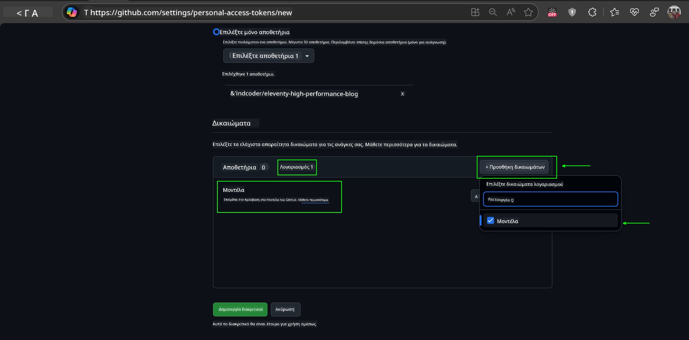
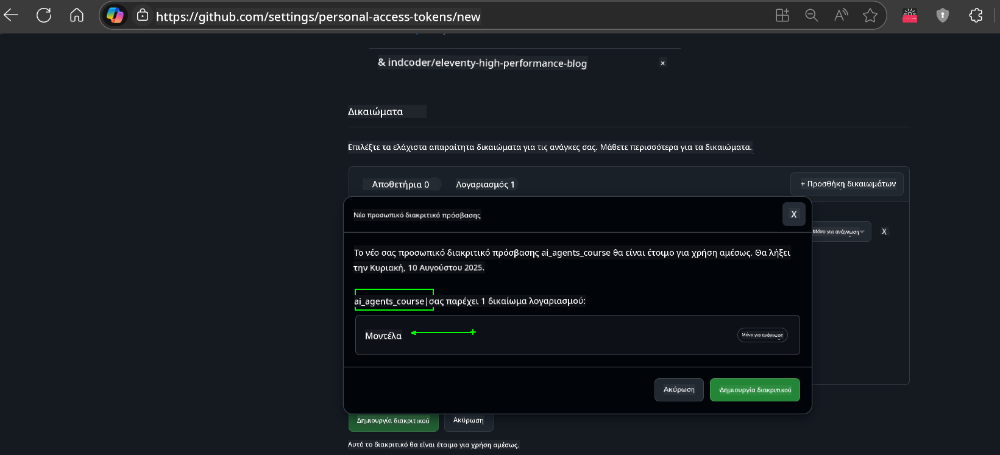
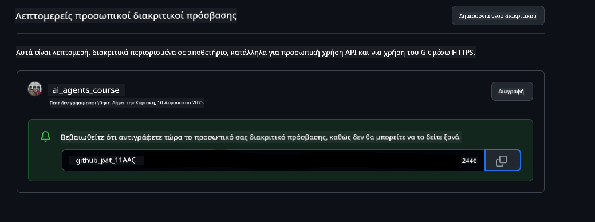
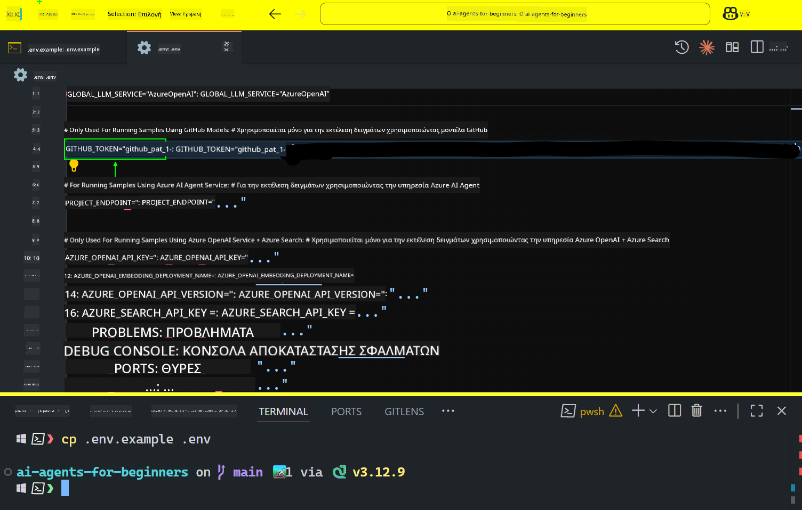

<!--
CO_OP_TRANSLATOR_METADATA:
{
  "original_hash": "c55b973b1562abf5aadf6a4028265ac5",
  "translation_date": "2025-08-29T14:53:15+00:00",
  "source_file": "00-course-setup/README.md",
  "language_code": "el"
}
-->
# Ρύθμιση Μαθήματος

## Εισαγωγή

Αυτό το μάθημα θα καλύψει πώς να εκτελέσετε τα παραδείγματα κώδικα αυτού του μαθήματος.

## Εγγραφείτε με Άλλους Μαθητές και Ζητήστε Βοήθεια

Πριν ξεκινήσετε να κλωνοποιείτε το αποθετήριο σας, εγγραφείτε στο [κανάλι Discord για Αρχάριους στους AI Agents](https://aka.ms/ai-agents/discord) για να λάβετε βοήθεια με τη ρύθμιση, να κάνετε ερωτήσεις σχετικά με το μάθημα ή να συνδεθείτε με άλλους μαθητές.

## Κλωνοποιήστε ή Δημιουργήστε Fork σε αυτό το Αποθετήριο

Για να ξεκινήσετε, παρακαλώ κλωνοποιήστε ή δημιουργήστε fork στο GitHub Repository. Αυτό θα δημιουργήσει τη δική σας έκδοση του υλικού του μαθήματος, ώστε να μπορείτε να εκτελείτε, να δοκιμάζετε και να τροποποιείτε τον κώδικα!

Αυτό μπορεί να γίνει κάνοντας κλικ στον σύνδεσμο για να 

Θα πρέπει τώρα να έχετε τη δική σας έκδοση fork αυτού του μαθήματος στον παρακάτω σύνδεσμο:



## Εκτέλεση του Κώδικα

Αυτό το μάθημα προσφέρει μια σειρά από Jupyter Notebooks που μπορείτε να εκτελέσετε για να αποκτήσετε πρακτική εμπειρία στη δημιουργία AI Agents.

Τα παραδείγματα κώδικα χρησιμοποιούν είτε:

**Απαιτεί Λογαριασμό GitHub - Δωρεάν**:

1) Semantic Kernel Agent Framework + GitHub Models Marketplace. Ετικετοποιημένο ως (semantic-kernel.ipynb)  
2) AutoGen Framework + GitHub Models Marketplace. Ετικετοποιημένο ως (autogen.ipynb)

**Απαιτεί Συνδρομή Azure**:  
3) Azure AI Foundry + Azure AI Agent Service. Ετικετοποιημένο ως (azureaiagent.ipynb)

Σας ενθαρρύνουμε να δοκιμάσετε και τους τρεις τύπους παραδειγμάτων για να δείτε ποιος σας ταιριάζει καλύτερα.

Όποια επιλογή κι αν επιλέξετε, αυτή θα καθορίσει ποια βήματα ρύθμισης πρέπει να ακολουθήσετε παρακάτω:

## Απαιτήσεις

- Python 3.12+  
  - **ΣΗΜΕΙΩΣΗ**: Εάν δεν έχετε εγκατεστημένο το Python 3.12, βεβαιωθείτε ότι το εγκαταστήσατε. Στη συνέχεια, δημιουργήστε το venv σας χρησιμοποιώντας το python3.12 για να διασφαλίσετε ότι οι σωστές εκδόσεις εγκαθίστανται από το αρχείο requirements.txt.
- Λογαριασμός GitHub - Για πρόσβαση στο GitHub Models Marketplace
- Συνδρομή Azure - Για πρόσβαση στο Azure AI Foundry
- Λογαριασμός Azure AI Foundry - Για πρόσβαση στο Azure AI Agent Service

Έχουμε συμπεριλάβει ένα αρχείο `requirements.txt` στη ρίζα αυτού του αποθετηρίου που περιέχει όλα τα απαραίτητα πακέτα Python για την εκτέλεση των παραδειγμάτων κώδικα.

Μπορείτε να τα εγκαταστήσετε εκτελώντας την παρακάτω εντολή στο τερματικό σας στη ρίζα του αποθετηρίου:

```bash
pip install -r requirements.txt
```  
Συνιστούμε τη δημιουργία ενός εικονικού περιβάλλοντος Python για να αποφύγετε τυχόν συγκρούσεις και προβλήματα.

## Ρύθμιση VSCode  
Βεβαιωθείτε ότι χρησιμοποιείτε τη σωστή έκδοση Python στο VSCode.


## Ρύθμιση για Παραδείγματα που Χρησιμοποιούν GitHub Models

### Βήμα 1: Ανάκτηση του Προσωπικού Access Token (PAT) του GitHub

Αυτό το μάθημα χρησιμοποιεί το GitHub Models Marketplace, παρέχοντας δωρεάν πρόσβαση σε Μεγάλα Γλωσσικά Μοντέλα (LLMs) που θα χρησιμοποιήσετε για να δημιουργήσετε AI Agents.

Για να χρησιμοποιήσετε τα GitHub Models, θα χρειαστεί να δημιουργήσετε ένα [Προσωπικό Access Token του GitHub](https://docs.github.com/en/authentication/keeping-your-account-and-data-secure/managing-your-personal-access-tokens).

Αυτό μπορεί να γίνει πηγαίνοντας στον λογαριασμό σας στο GitHub.

Παρακαλώ ακολουθήστε την [Αρχή της Ελάχιστης Απαραίτητης Πρόσβασης](https://docs.github.com/en/get-started/learning-to-code/storing-your-secrets-safely) κατά τη δημιουργία του token σας. Αυτό σημαίνει ότι θα πρέπει να δώσετε στο token μόνο τις άδειες που χρειάζεται για να εκτελέσει τα παραδείγματα κώδικα αυτού του μαθήματος.

1. Επιλέξτε την επιλογή `Fine-grained tokens` στην αριστερή πλευρά της οθόνης σας πηγαίνοντας στις **Ρυθμίσεις Προγραμματιστή**  
   

   Στη συνέχεια, επιλέξτε `Generate new token`.

   

2. Εισάγετε ένα περιγραφικό όνομα για το token σας που να αντικατοπτρίζει τον σκοπό του, ώστε να είναι εύκολο να το αναγνωρίσετε αργότερα.

    🔐 **Σύσταση Διάρκειας Token**  

    Συνιστώμενη διάρκεια: 30 ημέρες  
    Για μεγαλύτερη ασφάλεια, μπορείτε να επιλέξετε μικρότερη περίοδο—όπως 7 ημέρες 🛡️  
    Είναι ένας εξαιρετικός τρόπος να θέσετε έναν προσωπικό στόχο και να ολοκληρώσετε το μάθημα ενώ η μαθησιακή σας ορμή είναι υψηλή 🚀.

    

3. Περιορίστε το πεδίο εφαρμογής του token στο fork αυτού του αποθετηρίου.

    

4. Περιορίστε τα δικαιώματα του token: Στην καρτέλα **Permissions**, κάντε κλικ στην **Account** και πατήστε το κουμπί "+ Add permissions". Θα εμφανιστεί ένα αναδυόμενο μενού. Αναζητήστε **Models** και επιλέξτε το κουτάκι για αυτό.  
    

5. Επαληθεύστε τα απαιτούμενα δικαιώματα πριν δημιουργήσετε το token. 

6. Πριν δημιουργήσετε το token, βεβαιωθείτε ότι είστε έτοιμοι να αποθηκεύσετε το token σε ασφαλές μέρος, όπως ένα θησαυροφυλάκιο διαχείρισης κωδικών πρόσβασης, καθώς δεν θα εμφανιστεί ξανά μετά τη δημιουργία του. 

Αντιγράψτε το νέο token που μόλις δημιουργήσατε. Τώρα θα το προσθέσετε στο αρχείο `.env` που περιλαμβάνεται σε αυτό το μάθημα.

### Βήμα 2: Δημιουργήστε το Αρχείο `.env`

Για να δημιουργήσετε το αρχείο `.env`, εκτελέστε την παρακάτω εντολή στο τερματικό σας.

```bash
cp .env.example .env
```

Αυτό θα αντιγράψει το αρχείο παραδείγματος και θα δημιουργήσει ένα `.env` στον κατάλογό σας, όπου θα συμπληρώσετε τις τιμές για τις μεταβλητές περιβάλλοντος.

Με το token σας αντιγραμμένο, ανοίξτε το αρχείο `.env` στον αγαπημένο σας επεξεργαστή κειμένου και επικολλήστε το token στο πεδίο `GITHUB_TOKEN`.  


Τώρα θα πρέπει να μπορείτε να εκτελέσετε τα παραδείγματα κώδικα αυτού του μαθήματος.

## Ρύθμιση για Παραδείγματα που Χρησιμοποιούν Azure AI Foundry και Azure AI Agent Service

### Βήμα 1: Ανάκτηση του Endpoint του Έργου σας στο Azure

Ακολουθήστε τα βήματα για τη δημιουργία ενός hub και ενός έργου στο Azure AI Foundry που περιγράφονται εδώ: [Επισκόπηση Πόρων Hub](https://learn.microsoft.com/en-us/azure/ai-foundry/concepts/ai-resources)

Αφού δημιουργήσετε το έργο σας, θα χρειαστεί να ανακτήσετε τη συμβολοσειρά σύνδεσης για το έργο σας.

Αυτό μπορεί να γίνει πηγαίνοντας στη σελίδα **Επισκόπηση** του έργου σας στην πύλη Azure AI Foundry.


### Βήμα 2: Δημιουργήστε το Αρχείο `.env`

Για να δημιουργήσετε το αρχείο `.env`, εκτελέστε την παρακάτω εντολή στο τερματικό σας.

```bash
cp .env.example .env
```

Αυτό θα αντιγράψει το αρχείο παραδείγματος και θα δημιουργήσει ένα `.env` στον κατάλογό σας, όπου θα συμπληρώσετε τις τιμές για τις μεταβλητές περιβάλλοντος.

Με το token σας αντιγραμμένο, ανοίξτε το αρχείο `.env` στον αγαπημένο σας επεξεργαστή κειμένου και επικολλήστε το token στο πεδίο `PROJECT_ENDPOINT`.

### Βήμα 3: Συνδεθείτε στο Azure

Ως βέλτιστη πρακτική ασφαλείας, θα χρησιμοποιήσουμε [keyless authentication](https://learn.microsoft.com/azure/developer/ai/keyless-connections?tabs=csharp%2Cazure-cli?WT.mc_id=academic-105485-koreyst) για να πιστοποιηθούμε στο Azure OpenAI με το Microsoft Entra ID.

Στη συνέχεια, ανοίξτε ένα τερματικό και εκτελέστε `az login --use-device-code` για να συνδεθείτε στον λογαριασμό σας στο Azure.

Αφού συνδεθείτε, επιλέξτε τη συνδρομή σας στο τερματικό.

## Πρόσθετες Μεταβλητές Περιβάλλοντος - Azure Search και Azure OpenAI

Για το μάθημα Agentic RAG - Μάθημα 5 - υπάρχουν παραδείγματα που χρησιμοποιούν Azure Search και Azure OpenAI.

Εάν θέλετε να εκτελέσετε αυτά τα παραδείγματα, θα χρειαστεί να προσθέσετε τις παρακάτω μεταβλητές περιβάλλοντος στο αρχείο `.env` σας:

### Σελίδα Επισκόπησης (Έργο)

- `AZURE_SUBSCRIPTION_ID` - Ελέγξτε τις **Λεπτομέρειες Έργου** στη σελίδα **Επισκόπηση** του έργου σας.

- `AZURE_AI_PROJECT_NAME` - Δείτε την κορυφή της σελίδας **Επισκόπηση** για το έργο σας.

- `AZURE_OPENAI_SERVICE` - Βρείτε το στην καρτέλα **Included capabilities** για την **Υπηρεσία Azure OpenAI** στη σελίδα **Επισκόπηση**.

### Κέντρο Διαχείρισης

- `AZURE_OPENAI_RESOURCE_GROUP` - Μεταβείτε στις **Ιδιότητες Έργου** στη σελίδα **Επισκόπηση** του **Κέντρου Διαχείρισης**.

- `GLOBAL_LLM_SERVICE` - Στην ενότητα **Συνδεδεμένοι πόροι**, βρείτε το όνομα σύνδεσης για τις **Υπηρεσίες Azure AI**. Εάν δεν αναφέρεται, ελέγξτε την **πύλη Azure** στον πόρο σας.

### Σελίδα Μοντέλων + Endpoints

- `AZURE_OPENAI_EMBEDDING_DEPLOYMENT_NAME` - Επιλέξτε το μοντέλο ενσωμάτωσης σας (π.χ., `text-embedding-ada-002`) και σημειώστε το **Deployment name** από τις λεπτομέρειες του μοντέλου.

- `AZURE_OPENAI_CHAT_DEPLOYMENT_NAME` - Επιλέξτε το μοντέλο συνομιλίας σας (π.χ., `gpt-4o-mini`) και σημειώστε το **Deployment name** από τις λεπτομέρειες του μοντέλου.

### Πύλη Azure

- `AZURE_OPENAI_ENDPOINT` - Αναζητήστε τις **Υπηρεσίες Azure AI**, κάντε κλικ σε αυτές, στη συνέχεια μεταβείτε στη **Διαχείριση Πόρων**, **Κλειδιά και Endpoint**, και αντιγράψτε το endpoint που λέει "Language APIs".

- `AZURE_OPENAI_API_KEY` - Από την ίδια οθόνη, αντιγράψτε το ΚΛΕΙΔΙ 1 ή ΚΛΕΙΔΙ 2.

- `AZURE_SEARCH_SERVICE_ENDPOINT` - Βρείτε τον πόρο σας **Azure AI Search**, κάντε κλικ σε αυτόν και δείτε την **Επισκόπηση**.

- `AZURE_SEARCH_API_KEY` - Στη συνέχεια, μεταβείτε στις **Ρυθμίσεις** και μετά στα **Κλειδιά** για να αντιγράψετε το κύριο ή δευτερεύον κλειδί διαχειριστή.

### Εξωτερική Ιστοσελίδα

- `AZURE_OPENAI_API_VERSION` - Επισκεφθείτε τη σελίδα [API version lifecycle](https://learn.microsoft.com/en-us/azure/ai-services/openai/api-version-deprecation#latest-ga-api-release) στην ενότητα **Latest GA API release**.

### Ρύθμιση keyless authentication

Αντί να κωδικοποιήσουμε τα διαπιστευτήριά σας, θα χρησιμοποιήσουμε μια σύνδεση χωρίς κλειδί με το Azure OpenAI. Για να το κάνουμε αυτό, θα εισάγουμε το `DefaultAzureCredential` και αργότερα θα καλέσουμε τη συνάρτηση `DefaultAzureCredential` για να λάβουμε το διαπιστευτήριο.

```python
from azure.identity import DefaultAzureCredential, InteractiveBrowserCredential
```

## Κολλήσατε Κάπου;

Εάν αντιμετωπίζετε οποιοδήποτε πρόβλημα με τη ρύθμιση, μπείτε στο 

ή

## Επόμενο Μάθημα

Τώρα είστε έτοιμοι να εκτελέσετε τον κώδικα για αυτό το μάθημα. Καλή διασκέδαση μαθαίνοντας περισσότερα για τον κόσμο των AI Agents!

[Εισαγωγή στους AI Agents και Χρήσεις τους](../01-intro-to-ai-agents/README.md)

---

**Αποποίηση ευθύνης**:  
Αυτό το έγγραφο έχει μεταφραστεί χρησιμοποιώντας την υπηρεσία αυτόματης μετάφρασης AI [Co-op Translator](https://github.com/Azure/co-op-translator). Παρόλο που καταβάλλουμε κάθε προσπάθεια για ακρίβεια, παρακαλούμε να έχετε υπόψη ότι οι αυτόματες μεταφράσεις ενδέχεται να περιέχουν σφάλματα ή ανακρίβειες. Το πρωτότυπο έγγραφο στη μητρική του γλώσσα θα πρέπει να θεωρείται η αυθεντική πηγή. Για κρίσιμες πληροφορίες, συνιστάται επαγγελματική ανθρώπινη μετάφραση. Δεν φέρουμε ευθύνη για τυχόν παρεξηγήσεις ή εσφαλμένες ερμηνείες που προκύπτουν από τη χρήση αυτής της μετάφρασης.