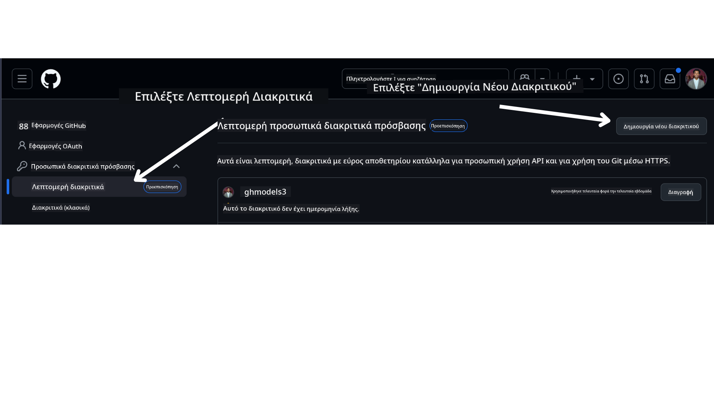

<!--
CO_OP_TRANSLATOR_METADATA:
{
  "original_hash": "76945069b52a49cd0432ae3e0b0ba22e",
  "translation_date": "2025-07-12T07:50:28+00:00",
  "source_file": "00-course-setup/README.md",
  "language_code": "el"
}
-->
στο λογαριασμό σας στο GitHub.

Επιλέξτε την επιλογή `Fine-grained tokens` στην αριστερή πλευρά της οθόνης σας.

Στη συνέχεια, επιλέξτε `Generate new token`.



Θα σας ζητηθεί να εισάγετε ένα όνομα για το token σας, να επιλέξετε την ημερομηνία λήξης (Συνιστάται: 30 ημέρες) και να επιλέξετε τα δικαιώματα για το token σας (Public Repositories).

Είναι επίσης απαραίτητο να επεξεργαστείτε τα δικαιώματα αυτού του token: Permissions -> Models -> Επιτρέπει πρόσβαση στα GitHub Models

Αντιγράψτε το νέο token που μόλις δημιουργήσατε. Τώρα θα το προσθέσετε στο αρχείο `.env` που περιλαμβάνεται σε αυτό το μάθημα.

### Βήμα 2: Δημιουργήστε το αρχείο `.env`

Για να δημιουργήσετε το αρχείο `.env`, εκτελέστε την ακόλουθη εντολή στο τερματικό σας.

```bash
cp .env.example .env
```

Αυτό θα αντιγράψει το παράδειγμα αρχείου και θα δημιουργήσει ένα `.env` στον φάκελό σας, όπου θα συμπληρώσετε τις τιμές για τις μεταβλητές περιβάλλοντος.

Με το token αντιγραμμένο, ανοίξτε το αρχείο `.env` στον αγαπημένο σας επεξεργαστή κειμένου και επικολλήστε το token στο πεδίο `GITHUB_TOKEN`.

Τώρα θα πρέπει να μπορείτε να εκτελέσετε τα παραδείγματα κώδικα αυτού του μαθήματος.

## Ρύθμιση για Παραδείγματα που χρησιμοποιούν Azure AI Foundry και Azure AI Agent Service

### Βήμα 1: Ανάκτηση του Endpoint του Azure Project σας

Ακολουθήστε τα βήματα για τη δημιουργία hub και project στο Azure AI Foundry που βρίσκονται εδώ: [Hub resources overview](https://learn.microsoft.com/en-us/azure/ai-foundry/concepts/ai-resources)

Μόλις δημιουργήσετε το project σας, θα χρειαστεί να ανακτήσετε το connection string για το project σας.

Αυτό μπορεί να γίνει πηγαίνοντας στη σελίδα **Overview** του project σας στην πύλη Azure AI Foundry.


### Βήμα 2: Δημιουργήστε το αρχείο `.env`

Για να δημιουργήσετε το αρχείο `.env`, εκτελέστε την ακόλουθη εντολή στο τερματικό σας.

```bash
cp .env.example .env
```

Αυτό θα αντιγράψει το παράδειγμα αρχείου και θα δημιουργήσει ένα `.env` στον φάκελό σας, όπου θα συμπληρώσετε τις τιμές για τις μεταβλητές περιβάλλοντος.

Με το token αντιγραμμένο, ανοίξτε το αρχείο `.env` στον αγαπημένο σας επεξεργαστή κειμένου και επικολλήστε το token στο πεδίο `PROJECT_ENDPOINT`.

### Βήμα 3: Σύνδεση στο Azure

Ως βέλτιστη πρακτική ασφαλείας, θα χρησιμοποιήσουμε [keyless authentication](https://learn.microsoft.com/azure/developer/ai/keyless-connections?tabs=csharp%2Cazure-cli?WT.mc_id=academic-105485-koreyst) για να αυθεντικοποιηθούμε στο Azure OpenAI με Microsoft Entra ID. Πριν το κάνετε αυτό, θα χρειαστεί πρώτα να εγκαταστήσετε το **Azure CLI** σύμφωνα με τις [οδηγίες εγκατάστασης](https://learn.microsoft.com/cli/azure/install-azure-cli?WT.mc_id=academic-105485-koreyst) για το λειτουργικό σας σύστημα.

Στη συνέχεια, ανοίξτε ένα τερματικό και εκτελέστε `az login --use-device-code` για να συνδεθείτε στο λογαριασμό σας Azure.

Μόλις συνδεθείτε, επιλέξτε τη συνδρομή σας στο τερματικό.

## Πρόσθετες Μεταβλητές Περιβάλλοντος - Azure Search και Azure OpenAI

Για το μάθημα Agentic RAG - Μάθημα 5 - υπάρχουν παραδείγματα που χρησιμοποιούν Azure Search και Azure OpenAI.

Αν θέλετε να εκτελέσετε αυτά τα παραδείγματα, θα χρειαστεί να προσθέσετε τις ακόλουθες μεταβλητές περιβάλλοντος στο αρχείο `.env` σας:

### Σελίδα Επισκόπησης (Project)

- `AZURE_SUBSCRIPTION_ID` - Ελέγξτε τα **Project details** στη σελίδα **Overview** του project σας.

- `AZURE_AI_PROJECT_NAME` - Κοιτάξτε στην κορυφή της σελίδας **Overview** για το project σας.

- `AZURE_OPENAI_SERVICE` - Βρείτε το στην καρτέλα **Included capabilities** για την **Azure OpenAI Service** στη σελίδα **Overview**.

### Κέντρο Διαχείρισης

- `AZURE_OPENAI_RESOURCE_GROUP` - Πηγαίνετε στις **Project properties** στη σελίδα **Overview** του **Management Center**.

- `GLOBAL_LLM_SERVICE` - Κάτω από τα **Connected resources**, βρείτε το όνομα σύνδεσης **Azure AI Services**. Αν δεν εμφανίζεται, ελέγξτε την **Azure portal** στον resource group σας για το όνομα του πόρου AI Services.

### Σελίδα Μοντέλων + Endpoints

- `AZURE_OPENAI_EMBEDDING_DEPLOYMENT_NAME` - Επιλέξτε το embedding μοντέλο σας (π.χ., `text-embedding-ada-002`) και σημειώστε το **Deployment name** από τις λεπτομέρειες του μοντέλου.

- `AZURE_OPENAI_CHAT_DEPLOYMENT_NAME` - Επιλέξτε το chat μοντέλο σας (π.χ., `gpt-4o-mini`) και σημειώστε το **Deployment name** από τις λεπτομέρειες του μοντέλου.

### Azure Portal

- `AZURE_OPENAI_ENDPOINT` - Αναζητήστε τις **Azure AI services**, κάντε κλικ σε αυτές, μετά πηγαίνετε στο **Resource Management**, **Keys and Endpoint**, κατεβείτε στις "Azure OpenAI endpoints" και αντιγράψτε αυτό που λέει "Language APIs".

- `AZURE_OPENAI_API_KEY` - Από την ίδια οθόνη, αντιγράψτε το KEY 1 ή το KEY 2.

- `AZURE_SEARCH_SERVICE_ENDPOINT` - Βρείτε τον πόρο **Azure AI Search**, κάντε κλικ σε αυτόν και δείτε την **Overview**.

- `AZURE_SEARCH_API_KEY` - Μετά πηγαίνετε στις **Settings** και μετά στα **Keys** για να αντιγράψετε το πρωτεύον ή δευτερεύον κλειδί διαχειριστή.

### Εξωτερική Ιστοσελίδα

- `AZURE_OPENAI_API_VERSION` - Επισκεφθείτε τη σελίδα [API version lifecycle](https://learn.microsoft.com/en-us/azure/ai-services/openai/api-version-deprecation#latest-ga-api-release) κάτω από το **Latest GA API release**.

### Ρύθμιση keyless authentication

Αντί να κωδικοποιήσουμε τα διαπιστευτήριά σας, θα χρησιμοποιήσουμε μια σύνδεση χωρίς κλειδί με το Azure OpenAI. Για να το κάνουμε αυτό, θα εισάγουμε το `DefaultAzureCredential` και αργότερα θα καλέσουμε τη λειτουργία `DefaultAzureCredential` για να λάβουμε τα διαπιστευτήρια.

```python
from azure.identity import DefaultAzureCredential, InteractiveBrowserCredential
```

## Κόλλησες Κάπου;

Αν αντιμετωπίζετε προβλήματα με αυτή τη ρύθμιση, μπείτε στο

ή

.

## Επόμενο Μάθημα

Τώρα είστε έτοιμοι να εκτελέσετε τον κώδικα για αυτό το μάθημα. Καλή μάθηση στον κόσμο των AI Agents!

[Εισαγωγή στους AI Agents και Περιπτώσεις Χρήσης Agent](../01-intro-to-ai-agents/README.md)

**Αποποίηση ευθυνών**:  
Αυτό το έγγραφο έχει μεταφραστεί χρησιμοποιώντας την υπηρεσία αυτόματης μετάφρασης AI [Co-op Translator](https://github.com/Azure/co-op-translator). Παρόλο που επιδιώκουμε την ακρίβεια, παρακαλούμε να έχετε υπόψη ότι οι αυτόματες μεταφράσεις ενδέχεται να περιέχουν λάθη ή ανακρίβειες. Το πρωτότυπο έγγραφο στη γλώσσα του θεωρείται η αυθεντική πηγή. Για κρίσιμες πληροφορίες, συνιστάται επαγγελματική ανθρώπινη μετάφραση. Δεν φέρουμε ευθύνη για τυχόν παρεξηγήσεις ή λανθασμένες ερμηνείες που προκύπτουν από τη χρήση αυτής της μετάφρασης.