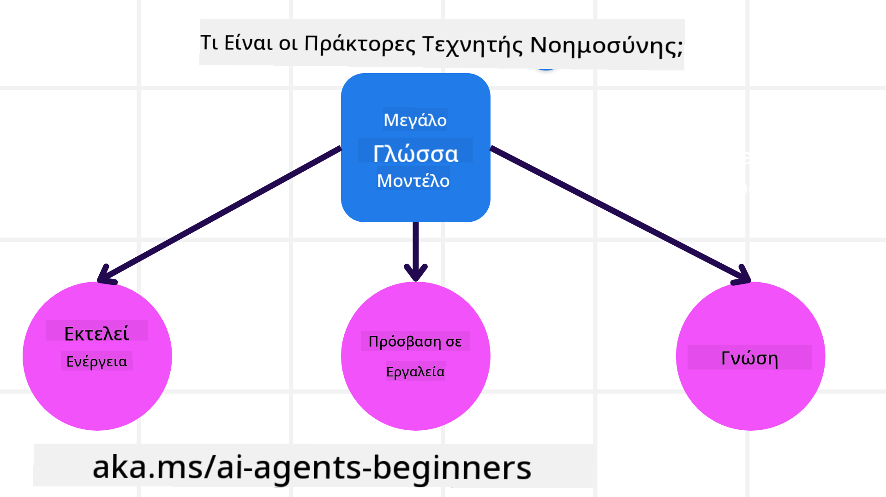
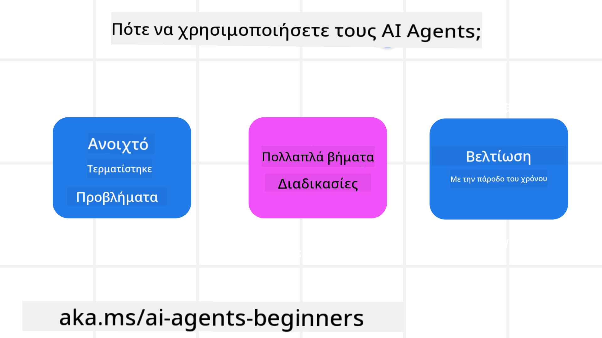

<!--
CO_OP_TRANSLATOR_METADATA:
{
  "original_hash": "d84943abc8f001ad4670418d32c2d899",
  "translation_date": "2025-07-12T08:06:58+00:00",
  "source_file": "01-intro-to-ai-agents/README.md",
  "language_code": "el"
}
-->
να γνωρίσετε άλλους μαθητές και δημιουργούς AI Agents και να κάνετε οποιεσδήποτε ερωτήσεις έχετε σχετικά με αυτό το μάθημα.

Για να ξεκινήσουμε αυτό το μάθημα, αρχίζουμε κατανοώντας καλύτερα τι είναι οι AI Agents και πώς μπορούμε να τους χρησιμοποιήσουμε στις εφαρμογές και τις ροές εργασίας που δημιουργούμε.

## Εισαγωγή

Αυτό το μάθημα καλύπτει:

- Τι είναι οι AI Agents και ποιοι είναι οι διαφορετικοί τύποι agents;
- Ποιες περιπτώσεις χρήσης είναι οι καλύτερες για AI Agents και πώς μπορούν να μας βοηθήσουν;
- Ποια είναι τα βασικά δομικά στοιχεία κατά το σχεδιασμό Agentic λύσεων;

## Στόχοι Μάθησης
Μετά την ολοκλήρωση αυτού του μαθήματος, θα πρέπει να μπορείτε να:

- Κατανοείτε τις έννοιες των AI Agents και πώς διαφέρουν από άλλες λύσεις AI.
- Εφαρμόζετε τους AI Agents με τον πιο αποδοτικό τρόπο.
- Σχεδιάζετε Agentic λύσεις παραγωγικά για χρήστες και πελάτες.

## Ορισμός των AI Agents και Τύποι AI Agents

### Τι είναι οι AI Agents;

Οι AI Agents είναι **συστήματα** που επιτρέπουν στα **Μεγάλα Γλωσσικά Μοντέλα (LLMs)** να **εκτελούν ενέργειες** επεκτείνοντας τις δυνατότητές τους, δίνοντας στα LLMs **πρόσβαση σε εργαλεία** και **γνώσεις**.

Ας αναλύσουμε αυτόν τον ορισμό σε μικρότερα μέρη:

- **Σύστημα** - Είναι σημαντικό να σκεφτόμαστε τους agents όχι απλά ως ένα μεμονωμένο στοιχείο, αλλά ως ένα σύστημα πολλών στοιχείων. Σε βασικό επίπεδο, τα στοιχεία ενός AI Agent είναι:
  - **Περιβάλλον** - Ο ορισμένος χώρος όπου λειτουργεί ο AI Agent. Για παράδειγμα, αν είχαμε έναν AI Agent για κρατήσεις ταξιδιών, το περιβάλλον θα μπορούσε να είναι το σύστημα κρατήσεων ταξιδιών που χρησιμοποιεί ο agent για να ολοκληρώσει εργασίες.
  - **Αισθητήρες** - Τα περιβάλλοντα έχουν πληροφορίες και παρέχουν ανατροφοδότηση. Οι AI Agents χρησιμοποιούν αισθητήρες για να συλλέγουν και να ερμηνεύουν αυτές τις πληροφορίες σχετικά με την τρέχουσα κατάσταση του περιβάλλοντος. Στο παράδειγμα του ταξιδιωτικού agent, το σύστημα κρατήσεων μπορεί να παρέχει πληροφορίες όπως διαθεσιμότητα ξενοδοχείων ή τιμές πτήσεων.
  - **Ενεργοποιητές** - Μόλις ο AI Agent λάβει την τρέχουσα κατάσταση του περιβάλλοντος, για την τρέχουσα εργασία ο agent αποφασίζει ποια ενέργεια θα εκτελέσει για να αλλάξει το περιβάλλον. Για τον ταξιδιωτικό agent, μπορεί να είναι η κράτηση ενός διαθέσιμου δωματίου για τον χρήστη.

**Μεγάλα Γλωσσικά Μοντέλα** - Η έννοια των agents υπήρχε πριν τη δημιουργία των LLMs. Το πλεονέκτημα της κατασκευής AI Agents με LLMs είναι η ικανότητά τους να ερμηνεύουν την ανθρώπινη γλώσσα και τα δεδομένα. Αυτή η ικανότητα επιτρέπει στα LLMs να ερμηνεύουν πληροφορίες από το περιβάλλον και να ορίζουν ένα σχέδιο για να αλλάξουν το περιβάλλον.

**Εκτέλεση Ενεργειών** - Εκτός των συστημάτων AI Agent, τα LLMs περιορίζονται σε καταστάσεις όπου η ενέργεια είναι η δημιουργία περιεχομένου ή πληροφοριών βάσει της εντολής του χρήστη. Μέσα σε συστήματα AI Agent, τα LLMs μπορούν να ολοκληρώσουν εργασίες ερμηνεύοντας το αίτημα του χρήστη και χρησιμοποιώντας εργαλεία που είναι διαθέσιμα στο περιβάλλον τους.

**Πρόσβαση σε Εργαλεία** - Τα εργαλεία στα οποία έχει πρόσβαση το LLM ορίζονται από 1) το περιβάλλον στο οποίο λειτουργεί και 2) τον προγραμματιστή του AI Agent. Στο παράδειγμα του ταξιδιωτικού agent, τα εργαλεία του agent περιορίζονται από τις λειτουργίες που είναι διαθέσιμες στο σύστημα κρατήσεων, και/ή ο προγραμματιστής μπορεί να περιορίσει την πρόσβαση του agent σε εργαλεία πτήσεων.

**Μνήμη + Γνώση** - Η μνήμη μπορεί να είναι βραχυπρόθεσμη στο πλαίσιο της συνομιλίας μεταξύ χρήστη και agent. Μακροπρόθεσμα, πέρα από τις πληροφορίες που παρέχει το περιβάλλον, οι AI Agents μπορούν επίσης να ανακτούν γνώση από άλλα συστήματα, υπηρεσίες, εργαλεία και ακόμη και άλλους agents. Στο παράδειγμα του ταξιδιωτικού agent, αυτή η γνώση μπορεί να είναι οι πληροφορίες για τις ταξιδιωτικές προτιμήσεις του χρήστη που βρίσκονται σε μια βάση δεδομένων πελατών.

### Οι διαφορετικοί τύποι agents

Τώρα που έχουμε έναν γενικό ορισμό των AI Agents, ας δούμε μερικούς συγκεκριμένους τύπους agents και πώς θα εφαρμοστούν σε έναν ταξιδιωτικό AI agent.

| **Τύπος Agent**               | **Περιγραφή**                                                                                                                       | **Παράδειγμα**                                                                                                                                                                                                                   |
| ----------------------------- | ----------------------------------------------------------------------------------------------------------------------------------- | ----------------------------------------------------------------------------------------------------------------------------------------------------------------------------------------------------------------------------- |
| **Απλοί Αντιδραστικοί Agents** | Εκτελούν άμεσες ενέργειες βάσει προκαθορισμένων κανόνων.                                                                             | Ο ταξιδιωτικός agent ερμηνεύει το περιεχόμενο ενός email και προωθεί παράπονα ταξιδιών στην εξυπηρέτηση πελατών.                                                                                                               |
| **Αντιδραστικοί Agents με Μοντέλο** | Εκτελούν ενέργειες βάσει ενός μοντέλου του κόσμου και των αλλαγών σε αυτό το μοντέλο.                                               | Ο ταξιδιωτικός agent δίνει προτεραιότητα σε διαδρομές με σημαντικές αλλαγές τιμών βάσει πρόσβασης σε ιστορικά δεδομένα τιμών.                                                                                                  |
| **Agents με Στόχο**           | Δημιουργούν σχέδια για να επιτύχουν συγκεκριμένους στόχους ερμηνεύοντας τον στόχο και καθορίζοντας ενέργειες για την επίτευξή του. | Ο ταξιδιωτικός agent κλείνει ένα ταξίδι καθορίζοντας τις απαραίτητες ταξιδιωτικές ρυθμίσεις (αυτοκίνητο, δημόσια συγκοινωνία, πτήσεις) από την τρέχουσα τοποθεσία στον προορισμό.                                                  |
| **Agents με Βάση την Ωφέλεια** | Λαμβάνουν υπόψη προτιμήσεις και ζυγίζουν ανταλλαγές αριθμητικά για να καθορίσουν πώς να επιτύχουν στόχους.                          | Ο ταξιδιωτικός agent μεγιστοποιεί την ωφέλεια ζυγίζοντας την ευκολία έναντι του κόστους κατά την κράτηση ταξιδιού.                                                                                                            |
| **Μαθησιακοί Agents**         | Βελτιώνονται με την πάροδο του χρόνου ανταποκρινόμενοι σε ανατροφοδότηση και προσαρμόζοντας τις ενέργειες αναλόγως.                  | Ο ταξιδιωτικός agent βελτιώνεται χρησιμοποιώντας ανατροφοδότηση πελατών από έρευνες μετά το ταξίδι για να κάνει προσαρμογές σε μελλοντικές κρατήσεις.                                                                           |
| **Ιεραρχικοί Agents**         | Αποτελούνται από πολλούς agents σε ένα ιεραρχικό σύστημα, όπου οι agents υψηλότερου επιπέδου διασπούν εργασίες σε υποεργασίες για agents χαμηλότερου επιπέδου. | Ο ταξιδιωτικός agent ακυρώνει ένα ταξίδι διαιρώντας την εργασία σε υποεργασίες (π.χ. ακύρωση συγκεκριμένων κρατήσεων) και αναθέτοντας σε agents χαμηλότερου επιπέδου να τις ολοκληρώσουν, αναφέροντας πίσω στον agent υψηλότερου επιπέδου. |
| **Συστήματα Πολλαπλών Agents (MAS)** | Agents ολοκληρώνουν εργασίες ανεξάρτητα, είτε συνεργατικά είτε ανταγωνιστικά.                                                        | Συνεργατικά: Πολλοί agents κλείνουν συγκεκριμένες ταξιδιωτικές υπηρεσίες όπως ξενοδοχεία, πτήσεις και ψυχαγωγία. Ανταγωνιστικά: Πολλοί agents διαχειρίζονται και ανταγωνίζονται για ένα κοινό ημερολόγιο κρατήσεων ξενοδοχείου για να κλείσουν πελάτες. |

## Πότε να Χρησιμοποιήσετε AI Agents

Στην προηγούμενη ενότητα, χρησιμοποιήσαμε το παράδειγμα του ταξιδιωτικού agent για να εξηγήσουμε πώς οι διαφορετικοί τύποι agents μπορούν να χρησιμοποιηθούν σε διαφορετικά σενάρια κρατήσεων ταξιδιών. Θα συνεχίσουμε να χρησιμοποιούμε αυτήν την εφαρμογή σε όλο το μάθημα.

Ας δούμε τους τύπους περιπτώσεων χρήσης για τους οποίους οι AI Agents είναι πιο κατάλληλοι:

- **Προβλήματα Ανοιχτού Τέλους** - επιτρέποντας στο LLM να καθορίσει τα απαραίτητα βήματα για την ολοκλήρωση μιας εργασίας, επειδή δεν μπορεί πάντα να κωδικοποιηθεί σκληρά σε μια ροή εργασίας.
- **Διαδικασίες Πολλαπλών Βημάτων** - εργασίες που απαιτούν ένα επίπεδο πολυπλοκότητας όπου ο AI Agent χρειάζεται να χρησιμοποιήσει εργαλεία ή πληροφορίες σε πολλαπλές φάσεις αντί για απλή ανάκτηση μιας φοράς.
- **Βελτίωση με την Πάροδο του Χρόνου** - εργασίες όπου ο agent μπορεί να βελτιωθεί με την πάροδο του χρόνου λαμβάνοντας ανατροφοδότηση είτε από το περιβάλλον του είτε από τους χρήστες για να παρέχει καλύτερη ωφέλεια.

Καλύπτουμε περισσότερες παραμέτρους για τη χρήση AI Agents στο μάθημα "Building Trustworthy AI Agents".

## Βασικά Στοιχεία Agentic Λύσεων

### Ανάπτυξη Agent

Το πρώτο βήμα στο σχεδιασμό ενός συστήματος AI Agent είναι ο ορισμός των εργαλείων, ενεργειών και συμπεριφορών. Σε αυτό το μάθημα, εστιάζουμε στη χρήση της **Azure AI Agent Service** για τον ορισμό των Agents μας. Προσφέρει χαρακτηριστικά όπως:

- Επιλογή Ανοιχτών Μοντέλων όπως OpenAI, Mistral και Llama
- Χρήση Αδειοδοτημένων Δεδομένων μέσω παρόχων όπως το Tripadvisor
- Χρήση τυποποιημένων εργαλείων OpenAPI 3.0

### Agentic Πρότυπα

Η επικοινωνία με τα LLM γίνεται μέσω prompts. Δεδομένης της ημι-αυτόνομης φύσης των AI Agents, δεν είναι πάντα εφικτό ή απαραίτητο να ξαναδοθεί prompt στο LLM μετά από μια αλλαγή στο περιβάλλον. Χρησιμοποιούμε **Agentic Πρότυπα** που μας επιτρέπουν να δίνουμε prompts στο LLM σε πολλαπλά βήματα με πιο κλιμακούμενο τρόπο.

Αυτό το μάθημα χωρίζεται σε μερικά από τα πιο δημοφιλή τρέχοντα Agentic πρότυπα.

### Agentic Πλαίσια Εργασίας

Τα Agentic Πλαίσια Εργασίας επιτρέπουν στους προγραμματιστές να υλοποιούν agentic πρότυπα μέσω κώδικα. Αυτά τα πλαίσια προσφέρουν πρότυπα, πρόσθετα και εργαλεία για καλύτερη συνεργασία AI Agents. Αυτά τα οφέλη παρέχουν δυνατότητες για καλύτερη παρατηρησιμότητα και αντιμετώπιση προβλημάτων σε συστήματα AI Agent.

Σε αυτό το μάθημα, θα εξερευνήσουμε το ερευνητικά καθοδηγούμενο πλαίσιο AutoGen και το παραγωγικά έτοιμο πλαίσιο Agent από το Semantic Kernel.

## Προηγούμενο Μάθημα

[Course Setup](../00-course-setup/README.md)

## Επόμενο Μάθημα

[Exploring Agentic Frameworks](../02-explore-agentic-frameworks/README.md)

**Αποποίηση ευθυνών**:  
Αυτό το έγγραφο έχει μεταφραστεί χρησιμοποιώντας την υπηρεσία αυτόματης μετάφρασης AI [Co-op Translator](https://github.com/Azure/co-op-translator). Παρόλο που επιδιώκουμε την ακρίβεια, παρακαλούμε να έχετε υπόψη ότι οι αυτόματες μεταφράσεις ενδέχεται να περιέχουν λάθη ή ανακρίβειες. Το πρωτότυπο έγγραφο στη γλώσσα του θεωρείται η αυθεντική πηγή. Για κρίσιμες πληροφορίες, συνιστάται επαγγελματική ανθρώπινη μετάφραση. Δεν φέρουμε ευθύνη για τυχόν παρεξηγήσεις ή λανθασμένες ερμηνείες που προκύπτουν από τη χρήση αυτής της μετάφρασης.